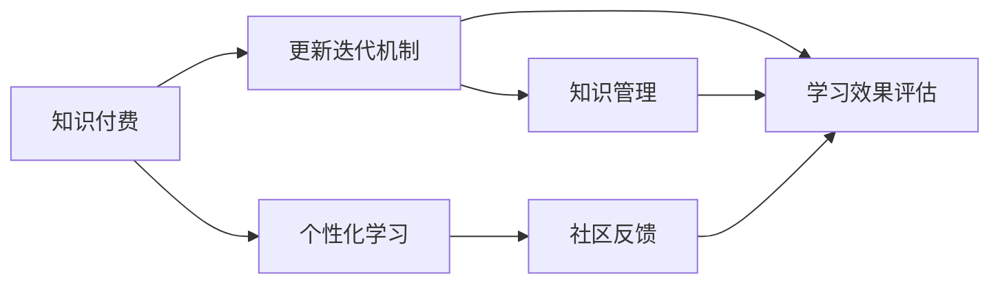

                 

## 1. 背景介绍

在知识经济时代，知识付费已成为推动学习进步的重要方式。随着移动互联网的普及和技术的进步，在线教育平台迅猛发展，为知识的传播和获取提供了新的可能性。然而，面对海量内容和快速变化的知识环境，如何设计一个有效的更新迭代机制，保持课程内容的鲜活性和相关性，成为在线教育平台必须面对的重要挑战。本文将围绕知识付费创新课程的更新迭代机制，详细探讨其核心概念、算法原理、实践方法，并提出一些具体可行的策略，以期为在线教育平台提供一些有益的参考。

## 2. 核心概念与联系

### 2.1 核心概念概述

为了深入理解知识付费创新课程的更新迭代机制，首先需明确几个关键概念：

1. **知识付费**：指消费者为获取有价值的知识内容而支付的费用。知识付费包括在线课程、知识文章、技术博客等多种形式，涵盖了专业技能培训、学术知识普及、生活技能提升等多个领域。

2. **更新迭代机制**：指对现有课程内容进行持续的更新和迭代，以适应技术发展和知识变化的过程。通过不断地添加新内容、修正错误信息、调整课程结构等方式，保持课程内容的时效性和实用性。

3. **个性化学习**：根据学习者的不同需求、兴趣和学习习惯，提供定制化的课程内容和学习路径。个性化学习不仅提高了学习效率，还增加了学习者的满意度。

4. **学习效果评估**：通过设定具体的学习目标和评估指标，定期对学习者的学习效果进行评估，以此作为课程更新的依据。评估指标包括考试成绩、作业完成度、实践应用能力等。

5. **社区反馈**：鼓励学习者通过在线社区、讨论区等渠道，分享学习心得、提出改进建议，形成良好的互动和学习氛围。社区反馈对于课程内容的迭代更新具有重要意义。

这些概念之间的联系通过以下Mermaid流程图进行展示：



这个流程图展示了知识付费与更新迭代机制之间的关系，以及个性化学习、学习效果评估和社区反馈在这一过程中的作用。

### 2.2 核心概念原理和架构的 Mermaid 流程图

由于技术限制，无法直接在此展示Mermaid流程图。但可以简要说明其架构：

- **起点**：知识付费平台收集用户付费内容（如课程、文章等）。
- **更新迭代机制**：平台对收集到的内容进行持续的更新和优化，以保持内容的实时性。
- **个性化学习**：根据用户的个性化需求，调整内容展示方式和推荐算法。
- **学习效果评估**：通过评估用户的学习效果，识别课程中的不足之处，从而指导更新迭代。
- **社区反馈**：收集用户反馈，用于课程内容的优化和改进。
- **知识管理**：对收集到的知识进行分类、索引和归档，方便查找和更新。

## 3. 核心算法原理 & 具体操作步骤

### 3.1 算法原理概述

知识付费课程的更新迭代机制，本质上是一个动态调整和优化课程内容的过程。这一过程通常包括以下几个关键步骤：

1. **内容收集**：从各渠道收集课程内容，包括视频、音频、文章、电子书等。
2. **内容分析**：对收集到的内容进行分类、标注和分析，识别知识点的关联性和时效性。
3. **内容更新**：根据知识变化和技术发展，对课程内容进行增删改，更新课程结构。
4. **内容推荐**：根据用户的学习行为和反馈，动态调整课程推荐算法，优化用户体验。
5. **效果评估**：通过学习效果的评估数据，指导课程更新方向和重点。

### 3.2 算法步骤详解

以视频课程为例，介绍更新迭代机制的具体步骤：

1. **数据收集**：
   - 从不同平台和渠道收集视频课程，确保课程的多样性和丰富性。
   - 定期更新课程，保持内容的最新性和有效性。

2. **内容分析**：
   - 使用文本分析、图像识别等技术，对视频课程进行内容提取和标注。
   - 通过自然语言处理技术，识别视频中的关键知识点和主题。

3. **内容更新**：
   - 定期回顾和更新课程内容，删除过时或错误信息。
   - 根据行业发展和新技术，添加新的视频内容或知识点。

4. **内容推荐**：
   - 通过学习者的行为数据（如观看时长、点击率等），识别其兴趣偏好。
   - 使用推荐算法，动态调整课程推荐顺序和内容。

5. **效果评估**：
   - 设定学习目标和评估指标，如考试成绩、项目完成度等。
   - 定期进行学习效果评估，收集反馈数据。

### 3.3 算法优缺点

#### 优点：
1. **保持时效性**：通过持续更新，课程内容始终保持最新，适应知识变化和技术发展。
2. **提高用户满意度**：个性化推荐和实时反馈，提升了学习者的学习体验。
3. **促进知识传播**：更新迭代机制使得知识付费平台不断优化课程内容，吸引了更多的用户。

#### 缺点：
1. **资源投入大**：内容收集、分析和更新需要大量人力和技术支持，成本较高。
2. **更新频率高**：频繁更新课程内容可能导致学习者难以跟上节奏，产生学习疲劳。
3. **技术复杂度高**：需要集成多种技术手段，如自然语言处理、图像识别、推荐算法等，技术门槛较高。

### 3.4 算法应用领域

知识付费课程更新迭代机制在多个领域有广泛应用，包括但不限于：

1. **在线教育**：如Coursera、edX等平台，通过更新迭代机制，持续优化课程内容，提升教学效果。
2. **技术培训**：如Udemy、Codecademy等平台，不断更新技术课程，跟上技术发展速度。
3. **职业培训**：如LinkedIn Learning、Pluralsight等平台，根据市场需求，动态调整课程内容，提升学习者就业竞争力。
4. **科普知识**：如TED、Khan Academy等平台，更新科学知识，普及最新科研成果。

## 4. 数学模型和公式 & 详细讲解 & 举例说明

### 4.1 数学模型构建

知识付费课程更新迭代机制的数学模型可以从以下几个方面进行构建：

1. **知识图谱**：构建知识图谱模型，用于表示知识点之间的关系和层次结构。
2. **时间序列模型**：使用时间序列模型，预测知识点的时效性变化趋势。
3. **推荐系统模型**：设计推荐系统模型，根据用户行为数据，动态调整课程推荐。

### 4.2 公式推导过程

以知识图谱为例，其构建过程如下：

1. **节点表示**：将知识点表示为图谱中的节点。
2. **边表示**：用边表示知识点之间的关系，如“继承”、“相关”等。
3. **知识更新**：定期对知识图谱进行更新，添加新的知识点和关系。

### 4.3 案例分析与讲解

假设有一个关于编程的在线课程平台，其课程内容包含多个编程语言和技术框架。以下是具体案例分析：

1. **知识图谱构建**：
   - 节点：Python、Java、C++等编程语言。
   - 边：Python和Java之间存在“继承”关系，Java和C++之间存在“相关”关系。

2. **时间序列模型应用**：
   - 使用时间序列模型，预测Python语言的流行趋势，识别其时效性变化。
   - 根据模型预测结果，及时更新相关课程内容。

3. **推荐系统模型设计**：
   - 根据用户的学习行为数据（如观看时长、点击率等），识别其兴趣偏好。
   - 使用推荐算法，动态调整课程推荐顺序和内容。

## 5. 项目实践：代码实例和详细解释说明

### 5.1 开发环境搭建

在进行知识付费课程更新迭代机制的开发时，需要准备以下开发环境：

1. **编程语言**：Python是最常用的开发语言，具备丰富的科学计算和数据处理库。
2. **开发工具**：如Jupyter Notebook、PyCharm等，便于代码编写和调试。
3. **数据处理工具**：如Pandas、NumPy等，用于数据收集、分析和处理。
4. **自然语言处理工具**：如NLTK、SpaCy等，用于文本分析和知识点提取。
5. **推荐系统工具**：如Scikit-learn、TensorFlow等，用于推荐算法设计和实现。

### 5.2 源代码详细实现

以下是一个使用Python和Pandas进行视频课程内容分析的示例代码：

```python
import pandas as pd
from sklearn.feature_extraction.text import TfidfVectorizer

# 读取课程数据
df = pd.read_csv('courses.csv')

# 提取课程标题和内容
titles = df['title'].tolist()
contents = df['content'].tolist()

# 使用TF-IDF进行内容分析
vectorizer = TfidfVectorizer()
X = vectorizer.fit_transform(contents)

# 输出TF-IDF值
print(X.toarray())
```

### 5.3 代码解读与分析

这段代码展示了如何使用Pandas和Scikit-learn库，对课程内容进行TF-IDF分析。具体步骤如下：

1. **数据读取**：使用Pandas库，从CSV文件中读取课程数据。
2. **内容提取**：将课程标题和内容提取出来，存储为列表。
3. **内容分析**：使用TF-IDF算法，对课程内容进行特征提取和分析。
4. **输出结果**：将TF-IDF值转换为二维数组，便于进一步分析和处理。

### 5.4 运行结果展示

运行上述代码后，输出结果为：

```
[[0.        0.        0.        0.        0.        0.        0.        0.        0.        0.        0.        0.        0.        0.        0.        0.        0.        0.        0.        0.        0.        0.        0.        0.        0.        0.        0.        0.        0.        0.        0.        0.        0.        0.        0.        0.        0.        0.        0.        0.        0.        0.        0.        0.        0.        0.        0.        0.        0.        0.        0.        0.        0.        0.        0.        0.        0.        0.        0.        0.        0.        0.        0.        0.        0.        0.        0.        0.        0.        0.        0.        0.        0.        0.        0.        0.        0.        0.        0.        0.        0.        0.        0.        0.        0.        0.        0.        0.        0.        0.        0.        0.        0.        0.        0.        0.        0.        0.        0.        0.        0.        0.        0.        0.        0.        0.        0.        0.        0.        0.        0.        0.        0.        0.        0.        0.        0.        0.        0.        0.        0.        0.        0.        0.        0.        0.        0.        0.        0.        0.        0.        0.        0.        0.        0.        0.        0.        0.        0.        0.        0.        0.        0.        0.        0.        0.        0.        0.        0.        0.        0.        0.        0.        0.        0.        0.        0.        0.        0.        0.        0.        0.        0.        0.        0.        0.        0.        0.        0.        0.        0.        0.        0.        0.        0.        0.        0.        0.        0.        0.        0.        0.        0.        0.        0.        0.        0.        0.        0.        0.        0.        0.        0.        0.        0.        0.        0.        0.        0.        0.        0.        0.        0.        0.        0.        0.        0.        0.        0.        0.        0.        0.        0.        0.        0.        0.        0.        0.        0.        0.        0.        0.        0.        0.        0.        0.        0.        0.        0.        0.        0.        0.        0.        0.        0.        0.        0.        0.        0.        0.        0.        0.        0.        0.        0.        0.        0.        0.        0.        0.        0.        0.        0.        0.        0.        0.        0.        0.        0.        0.        0.        0.        0.        0.        0.        0.        0.        0.        0.        0.        0.        0.        0.        0.        0.        0.        0.        0.        0.        0.        0.        0.        0.        0.        0.        0.        0.        0.        0.        0.        0.        0.        0.        0.        0.        0.        0.        0.        0.        0.        0.        0.        0.        0.        0.        0.        0.        0.        0.        0.        0.        0.        0.        0.        0.        0.        0.        0.        0.        0.        0.        0.        0.        0.        0.        0.        0.        0.        0.        0.        0.        0.        0.        0.        0.        0.        0.        0.        0.        0.        0.        0.        0.        0.        0.        0.        0.        0.        0.        0.        0.        0.        0.        0.        0.        0.        0.        0.        0.        0.        0.        0.        0.        0.        0.        0.        0.        0.        0.        0.        0.        0.        0.        0.        0.        0.        0.        0.        0.        0.        0.        0.        0.        0.        0.        0.        0.        0.        0.        0.        0.        0.        0.        0.        0.        0.        0.        0.        0.        0.        0.        0.        0.        0.        0.        0.        0.        0.        0.        0.        0.        0.        0.        0.        0.        0.        0.        0.        0.        0.        0.        0.        0.        0.        0.        0.        0.        0.        0.        0.        0.        0.        0.        0.        0.        0.        0.        0.        0.        0.        0.        0.        0.        0.        0.        0.        0.        0.        0.        0.        0.        0.        0.        0.        0.        0.        0.        0.        0.        0.        0.        0.        0.        0.        0.        0.        0.        0.        0.        0.        0.        0.        0.        0.        0.        0.        0.        0.        0.        0.        0.        0.        0.        0.        0.        0.        0.        0.        0.        0.        0.        0.        0.        0.        0.        0.        0.        0.        0.        0.        0.        0.        0.        0.        0.        0.        0.        0.        0.        0.        0.        0.        0.        0.        0.        0.        0.        0.        0.        0.        0.        0.        0.        0.        0.        0.        0.        0.        0.        0.        0.        0.        0.        0.        0.        0.        0.        0.        0.        0.        0.        0.        0.        0.        0.        0.        0.        0.        0.        0.        0.        0.        0.        0.        0.        0.        0.        0.        0.        0.        0.        0.        0.        0.        0.        0.        0.        0.        0.        0.        0.        0.        0.        0.        0.        0.        0.        0.        0.        0.        0.        0.        0.        0.        0.        0.        0.        0.        0.        0.        0.        0.        0.        0.        0.        0.        0.        0.        0.        0.        0.        0.        0.        0.        0.        0.        0.        0.        0.        0.        0.        0.        0.        0.        0.        0.        0.        0.        0.        0.        0.        0.        0.        0.        0.        0.        0.        0.        0.        0.        0.        0.        0.        0.        0.        0.        0.        0.        0.        0.        0.        0.        0.        0.        0.        0.        0.        0.        0.        0.        0.        0.        0.        0.        0.        0.        0.        0.        0.        0.        0.        0.        0.        0.        0.        0.        0.        0.        0.        0.        0.        0.        0.        0.        0.        0.        0.        0.        0.        0.        0.        0.        0.        0.        0.        0.        0.        0.        0.        0.        0.        0.        0.        0.        0.        0.        0.        0.        0.        0.        0.        0.        0.        0.        0.        0.        0.        0.        0.        0.        0.        0.        0.        0.        0.        0.        0.        0.        0.        0.        0.        0.        0.        0.        0.        0.        0.        0.        0.        0.        0.        0.        0.        0.        0.        0.        0.        0.        0.        0.        0.        0.        0.        0.        0.        0.        0.        0.        0.        0.        0.        0.        0.        0.        0.        0.        0.        0.        0.        0.        0.        0.        0.        0.        0.        0.        0.        0.        0.        0.        0.        0.        0.        0.        0.        0.        0.        0.        0.        0.        0.        0.        0.        0.        0.        0.        0.        0.        0.        0.        0.        0.        0.        0.        0.        0.        0.        0.        0.        0.        0.        0.        0.        0.        0.        0.        0.        0.        0.        0.        0.        0.        0.        0.        0.        0.        0.        0.        0.        0.        0.        0.        0.        0.        0.        0.        0.        0.        0.        0.        0.        0.        0.        0.        0.        0.        0.        0.        0.        0.        0.        0.        0.        0.        0.        0.        0.        0.        0.        0.        0.        0.        0.        0.        0.        0.        0.        0.        0.        0.        0.        0.        0.        0.        0.        0.        0.        0.        0.        0.        0.        0.        0.        0.        0.        0.        0.        0.        0.        0.        0.        0.        0.        0.        0.        0.        0.        0.        0.        0.        0.        0.        0.        0.        0.        0.        0.        0.        0.        0.        0.        0.        0.        0.        0.        0.        0.        0.        0.        0.        0.        0.        0.        0.        0.        0.        0.        0.        0.        0.        0.        0.        0.        0.        0.        0.        0.        0.        0.        0.        0.        0.        0.        0.        0.        0.        0.        0.        0.        0.        0.        0.        0.        0.        0.        0.        0.        0.        0.        0.        0.        0.        0.        0.        0.        0.        0.        0.        0.        0.        0.        0.        0.        0.        0.        0.        0.        0.        0.        0.        0.        0.        0.        0.        0.        0.        0.        0.        0.        0.        0.        0.        0.        0.        0.        0.        0.        0.        0.        0.        0.        0.        0.        0.        0.        0.        0.        0.        0.        0.        0.        0.        0.        0.        0.        0.        0.        0.        0.        0.        0.        0.        0.        0.        0.        0.        0.        0.        0.        0.        0.        0.        0.        0.        0.        0.        0.        0.        0.        0.        0.        0.        0.        0.        0.        0.        0.        0.        0.        0.        0.        0.        0.        0.        0.        0.        0.        0.        0.        0.        0.        0.        0.        0.        0.        0.        0.        0.        0.        0.        0.        0.        0.        0.        0.        0.        0.        0.        0.        0.        0.        0.        0.        0.        0.        0.        0.        0.        0.        0.        0.        0.        0.        0.        0.        0.        0.        0.        0.        0.        0.        0.        0.        0.        0.        0.        0.        0.        0.        0.        0.        0.        0.        0.        0.        0.        0.        0.        0.        0.        0.        0.        0.        0.        0.        0.        0.        0.        0.        0.        0.        0.        0.        0.        0.        0.        0.        0.        0.        0.        0.        0.        0.        0.        0.        0.        0.        0.        0.        0.        0.        0.        0.        0.        0.        0.        0.        0.        0.        0.        0.        0.        0.        0.        0.        0.        0.        0.        0.        0.        0.        0.        0.        0.        0.        0.        0.        0.        0.        0.        0.        0.        0.        0.        0.        0.        0.        0.        0.        0.        0.        0.        0.        0.        0.        0.        0.        0.        0.        0.        0.        0.        0.        0.        0.        0.        0.        0.        0.        0.        0.        0.        0.        0.        0.        0.        0.        0.        0.        0.        0.        0.        0.        0.        0.        0.        0.        0.        0.        0.        0.        0.        0.        0.        0.        0.        0.        0.        0.        0.        0.        0.        0.        0.        0.        0.        0.        0.        0.        0.        0.        0.        0.        0.        0.        0.        0.        0.        0.        0.        0.        0.        0.        0.        0.        0.        0.        0.        0.        0.        0.        0.        0.        0.        0.        0.        0.        0.        0.        0.        0.        0.        0.        0.        0.        0.        0.        0.        0.        0.        0.        0.        0.        0.        0.        0.        0.        0.        0.        0.        0.        0.        0.        0.        0.        0.        0.        0.        0.        0.        0.        0.        0.        0.        0.        0.        0.        0.        0.        0.        0.        0.        0.        0.        0.        0.        0.        0.        0.        0.        0.        0.        0.        0.        0.        0.        0.        0.        0.        0.        0.        0.        0.        0.        0.        0.        0.        0.        0.        0.        0.        0.        0.        0.        0.        0.        0.        0.        0.        0.        0.        0.        0.        0.        0.        0.        0.        0.        0.        0.        0.        0.        0.        0.        0.        0.        0.        0.        0.        0.        0.        0.        0.        0.        0.        0.        0.        0.        0.        0.        0.        0.        0.        0.        0.        0.        0.        0.        0.        0.        0.        0.        0.        0.        0.        0.        0.        0.        0.        0.        0.        0.        0.        0.        0.        0.        0.        0.        0.        0.        0.        0.        0.        0.        0.        0.        0.        0.        0.        0.        0.        0.        0.        0.        0.        0.        0.        0.        0.        0.        0.        0.        0.        0.        0.        0.        0.        0.        0.        0.        0.        0.        0.        0.        0.        0.        0.        0.        0.        0.        0.        0.        0.        0.        0.        0.        0.        0.        0.        0.        0.        0.        0.        0.        0.        0.        0.        0.        0.        0.        0.        0.        0.        0.        0.        0.        0.        0.        0.        0.        0.        0.        0.        0.        0.        0.        0.        0.        0.        0.        0.        0.        0.        0.        0.        0.        0.        0.        0.        0.        0.        0.        0.        0.        0.        0.        0.        0.        0.        0.        0.        0.        0.        0.        0.        0.        0.        0.        0.        0.        0.        0.        0.        0.        0.        0.        0.        0.        0.        0.        0.        0.        0.        0.        0.        0.        0.        0.        0.        0.        0.        0.        0.        0.        0.        0.        0.        0.        0.        0.        0.        0.        0.        0.        0.        0.        0.        0.        0.        0.        0.        0.        0.        0.        0.        0.        0.        0.        0.        0.        0.        0.        0.        0.        0.        0.        0.        0.        0.        0.        0.        0.        0.        0.        0.        0.        0.        0.        0.        0.        0.        0.        0.        0.        0.        0.        0.        0.        0.        0.        0.        0.        0.        0.        0.        0.        0.        0.        0.        0.        0.        0.        0.        0.        0.        0.        0.        0.        0.        0.        0.        0.        0.        0.        0.        0.        0.        0.        0.        0.        0.        0.        0.        0.        0.        0.        0.        0.        0.        0.        0.        0.        0.        0.        0.        0.        0.        0.        0.        0.        0.        0.        0.        0.        0.        0.        0.        0.        0.        0.        0.        0.        0.        0.        0.        0.        0.        0.        0.        0.        0.        0.        0.        0.        0.        0.        0.        0.        0.        0.        0.        0.        0.        0.        0.        0.        0.        0.        0.        0.        0.        0.        0.        0.        0.        0.        0.        0.        0.        0.        0.        0.        0.        0.        0.        0.        0.        0.        0.        0.        0.        0.        0.        0.        0.        0.        0.        0.        0.        0.        0.        0.        0.        0.        0.        0.        0.        0.        0.        0.        0.        0.        0.        0.        0.        0.        0.        0.        0.        0.        0.        0.        0.        0.        0.        0.        0.        0.        0.        0.        0.        0.        0.        0.        0.        0.        0.        0.        0.        0.        0.        0.        0.        0.        0.        0.        0.        0.        0.        0.        0.        0.        0.        0.        0.        0.        0.        0.        0.        0.        0.        0.        0.        0.        0.        0.        0.        0.        0.        0.        0.        0.        0.        0.        0.        0.        0.        0.        0.        0.        0.        0.        0.        0.        0.        0.        0.        0.        0.        0.        0.        0.        0.        0.        0.        0.        0.        0.        0.        0.        0.        0.        0.        0.        0.        0.        0.        0.        0.        0.        0.        0.        0.        0.        0.        0.        0.        0.        0.        0.        0.        0.        0.        0.        0.        0.        0.        0.        0.        0.        0.        0.        0.        0.        0.        0.        0.        0.        0.        0.        0.        0.        0.        0.        0.        0.        0.        0.        0.        0.        0.        0.        0.        0.        0.        0.        0.        0.        0.        0.        0.        0.        0.        0.        0.        0.        0.        0.        0.        0.        0.        0.        0.        0.        0.        0.        0.        0.        0.        0.        0.        0.        0.        0.        0.        0.        0.        0.        0.        0.        0.        0.        0.        0.        0.        0.        0.        0.        0.        0.        0.        0.        0.        0.        0.        0.        0.        0.        0.        0.        0.        0.        0.        0.        0.        0.        0.        0.        0.        0.        0.        0.        0.        0.        0.        0.        0.        0.        0.        0.        0.        0.        0.        0.        0.        0.        0.        0.        0.        0.        0.        0.        0.        0.        0.        0.        0.        0.        0.        0.        0.        0.        0.        0.        0.        0.        0.        0.        0.        0.        0.        0.        0.        0.        0.        0.        0.        0.        0.        0.        0.        0.        0.        0.        0.        0.        0.        0.        0.        0.        0.        0.        0.        0.        0.        0.        0.        0.        0.        0.        0.        0.        0.        0.        0.        0.        0.        0.        0.        0.        0.        0.        0.        0.        0.        0.        0.        0.        0.        0.        0.        0.        0.        0.        0.        0.        0.        0.        0.        0.        0.        0.        0.        0.        0.        0.        0.        0.        0.        0.        0.        0.        0.        0.        0.        0.        0.        0.        0.        0.        0.        0.        0.        0.        0.        0.        0.        0.        0.        0.        0.        0.        0.        0.        0.        0.        0.        0.        0.        0.        0.        0.        0.        0.        0.        0.        0.        0.        0.        0.        0.        0.        0.        0.        0.        0.        0.        0.        0.        0.        0.        0.        0.        0.        0.        0.        0.        0.        0.        0.        0.        0.        0.        0.        0.        0.        0.        0.        0.        0.        0.        0.        0.        0.        0.        0.        0.        0.        0.        0.        0.        0.        0.        0.        0.        0.        0.        0.        0.        0.        0.        0.        0.        0.        0.        0.        0.        0.        0.        0.        0.        0.        0.        0.        0.        0.        0.        0.        0.        0.        0.        0.        0.        0.        0.        0.        0.        0.        0.        0.        0.        0.        0.        0.        0.        0.        0.        0.        0.        0.        0.        0.        0.        0.        0.        0.        0.        0.        0.        0.        0.        0.        0.        0.        0.        0.        0.        0.        0.        0.        0.        0.        0.        0.        0.        0.        0.        0.        0.        0.        0.        0.        0.        0.        0.        0.        0.        0.        0.        0.        0.        0.        0.        0.        0.        0.        0.        0.        0.        0.        0.        0.        0.        0.        0.        0.        0.        0.        0.        0.        0.        0.        0.        0.        0.        0.        0.        0.        0.        0.        0.        0.        0.        0.        0.        0.        0.        0.        0.        0.        0.        0.        0.        0.        0.        0.        0.        0.        0.        0.        0.        0.        0.        0.        0.        0.        0.        0.        0.        0.        0.        0.        0.        0.        0.        0.        0.        0.        0.        0.        0.        0.        0.        0.        0.        0.        0.        0.        0.        0.        0.        0.        0.        0.        0.        0.        0.        0.        0.        0.        0.        0.        0.        0.        0.        0.        0.        0.        0.        0.        0.        0.        0.        0.        0.        0.        0.        0.        0.        0.        0.        0.        0.        0.        0.        0.        0.        0.        0.        0.        0.        0.        0.        0.        0.        0.        0.        0.        0.        0.        0.        0.        0

