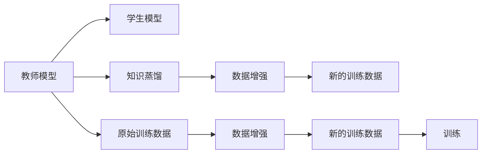
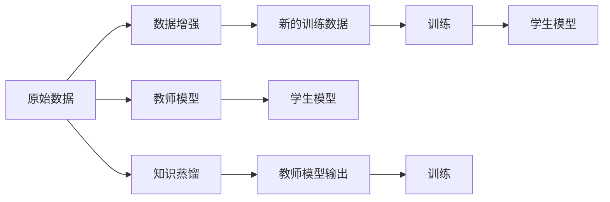

                 

## 1. 背景介绍

在当今数据驱动的人工智能时代，模型的性能直接取决于其在大量数据上的训练。然而，实际应用中，往往难以获得足够多的数据。在这样的背景下，知识蒸馏（Knowledge Distillation, KD）和数据增强（Data Augmentation, DA）等技术应运而生，旨在通过迁移学习和数据扩充，从有限的数据中挖掘出更多的信息，提升模型的泛化能力。

知识蒸馏是一种模型压缩和迁移学习的技术，旨在通过将一个大型模型的知识转移到一个小型模型，从而使小型模型获得与大型模型相似的性能。数据增强则是一种技术，通过对训练数据进行扩充，引入更多的多样性，从而提高模型的泛化能力。本文将探索这两者的协同效应，研究如何在知识蒸馏和数据增强的基础上，进一步提升模型的性能。

## 2. 核心概念与联系

### 2.1 核心概念概述

为了更好地理解知识蒸馏和数据增强的协同效应，我们首先需要明确以下几个核心概念：

- **知识蒸馏**：通过从一个大模型（教师模型）到一个小模型（学生模型）的迁移学习，将教师模型的知识（如预测分布、特征映射等）转移到学生模型，从而提升学生模型的性能。

- **数据增强**：通过对原始训练数据进行变换，生成新的训练样本，从而扩充训练数据集的规模和多样性，提高模型的泛化能力。

- **协同效应**：两个或多个过程共同作用时产生的效果，超出各自单独作用的总和。

通过下面的Mermaid流程图，我们可以直观地理解知识蒸馏和数据增强的协同效应：



### 2.2 核心概念原理和架构的 Mermaid 流程图

在知识蒸馏和数据增强的过程中，两者可以相辅相成，共同提升模型的性能。具体的协同过程可以通过下面的流程图来描述：



### 2.3 知识蒸馏和数据增强的协同机制

知识蒸馏和数据增强的协同机制主要体现在两个方面：

1. **提升模型的泛化能力**：数据增强通过增加训练数据的多样性，帮助模型更好地理解数据的分布。而知识蒸馏通过迁移学习，使学生模型获得教师模型的知识，提升其在泛化新数据上的能力。

2. **减少过拟合**：数据增强可以降低模型对训练数据的依赖，减少过拟合风险。知识蒸馏通过迁移学习，使得学生模型更接近教师模型的泛化能力，进一步减少过拟合现象。

## 3. 核心算法原理 & 具体操作步骤

### 3.1 算法原理概述

知识蒸馏和数据增强的协同效应研究，主要是通过两个关键步骤：

1. 使用数据增强扩充训练数据集，提升模型对数据的泛化能力。
2. 使用知识蒸馏将教师模型的知识转移到学生模型，进一步提升模型性能。

### 3.2 算法步骤详解

**Step 1: 准备教师和学生模型**

- 选择或训练一个教师模型和学生模型。教师模型通常是一个大型的预训练模型，如BERT、GPT等，而学生模型则是一个较小型的模型，如ResNet、MobileNet等。

**Step 2: 数据增强**

- 使用数据增强技术，如随机裁剪、旋转、缩放、翻转等，扩充训练数据集。
- 确保增强后的数据与原始数据具有相似的分布。

**Step 3: 知识蒸馏**

- 将教师模型的输出（如预测概率分布、特征映射等）作为标签，训练学生模型。
- 使用不同的损失函数，如KL散度、熵损失、均方误差等，衡量学生模型与教师模型之间的差异。

**Step 4: 模型训练和评估**

- 使用扩充后的数据集，对学生模型进行训练。
- 在验证集上评估学生模型的性能。
- 调整学习率、数据增强策略和知识蒸馏强度等超参数，进一步优化模型。

### 3.3 算法优缺点

**优点**：

- 结合知识蒸馏和数据增强，可以显著提升模型的泛化能力和泛化性能。
- 可以在有限的训练数据上，通过迁移学习获得更好的性能。
- 数据增强可以提升模型的鲁棒性，知识蒸馏可以提升模型的准确性。

**缺点**：

- 数据增强和知识蒸馏的协同效应可能存在一定的复杂性，需要精心设计和调整。
- 训练时间和计算资源需求较高，尤其是在处理大规模数据时。
- 可能需要更多的超参数调优。

### 3.4 算法应用领域

知识蒸馏和数据增强的协同效应已经在多个领域得到了广泛应用：

- **自然语言处理**：在文本分类、情感分析、机器翻译等任务中，结合知识蒸馏和数据增强，可以显著提升模型的性能。
- **计算机视觉**：在图像分类、目标检测、人脸识别等任务中，使用数据增强和知识蒸馏，可以提升模型的鲁棒性和准确性。
- **语音识别**：在语音识别任务中，通过知识蒸馏和数据增强，可以提升模型的泛化能力和鲁棒性。
- **医疗领域**：在医疗影像分析、病理学诊断等任务中，结合知识蒸馏和数据增强，可以提升模型的诊断准确性。

## 4. 数学模型和公式 & 详细讲解 & 举例说明

### 4.1 数学模型构建

在知识蒸馏和数据增强的协同效应研究中，我们通常使用以下数学模型来描述：

- **数据增强**：对于每个原始样本 $x_i$，生成 $k$ 个增强样本 $x_i^j$，其中 $j \in [1, k]$。
- **知识蒸馏**：将教师模型 $M_{\text{teacher}}$ 的输出 $y^*$ 作为标签，训练学生模型 $M_{\text{student}}$。

**Step 1: 数据增强**

假设原始数据集为 $\{x_1, x_2, ..., x_n\}$，每个样本 $x_i$ 通过 $k$ 种变换生成 $k$ 个增强样本 $x_i^j$。例如，对于图像数据，可以使用随机裁剪、旋转、缩放、翻转等操作，生成新的图像数据。

**Step 2: 知识蒸馏**

假设教师模型 $M_{\text{teacher}}$ 和学生模型 $M_{\text{student}}$ 都具有相同的输入 $x_i$ 和输出 $y$。知识蒸馏的目标是最小化学生模型输出与教师模型输出之间的差异，即：

$$
\min_{\theta} \mathcal{L}_{\text{distillation}}(\theta) = \frac{1}{n} \sum_{i=1}^n \mathcal{L}_{\text{distillation}}(x_i, y_i)
$$

其中 $\mathcal{L}_{\text{distillation}}$ 表示知识蒸馏损失函数，常用的有KL散度损失：

$$
\mathcal{L}_{\text{distillation}}(x_i, y_i) = -\frac{1}{k} \sum_{j=1}^k \mathcal{L}(y^*(x_i^j), y(x_i))
$$

其中 $\mathcal{L}$ 表示分类交叉熵损失函数，$y^*(x_i^j)$ 表示教师模型对 $x_i^j$ 的预测，$y(x_i)$ 表示学生模型对 $x_i$ 的预测。

### 4.2 公式推导过程

通过上述模型，我们可以推导出知识蒸馏和数据增强的协同效应：

- **Step 1: 数据增强**

对于每个原始样本 $x_i$，生成 $k$ 个增强样本 $x_i^j$，其中 $j \in [1, k]$。

- **Step 2: 知识蒸馏**

将教师模型 $M_{\text{teacher}}$ 的输出 $y^*$ 作为标签，训练学生模型 $M_{\text{student}}$。使用KL散度损失函数：

$$
\mathcal{L}_{\text{distillation}}(x_i, y_i) = -\frac{1}{k} \sum_{j=1}^k \mathcal{L}(y^*(x_i^j), y(x_i))
$$

### 4.3 案例分析与讲解

**案例 1: 图像分类**

假设我们有一个图像分类任务，原始数据集包含 10,000 张图像，每个图像大小为 $224 \times 224$。我们首先使用随机裁剪、旋转、缩放等数据增强技术，生成 8 个增强图像。然后，我们使用 ResNet 作为教师模型，MobileNet 作为学生模型。

我们首先训练教师模型 $M_{\text{teacher}}$，然后将其输出作为标签，训练学生模型 $M_{\text{student}}$。使用 KL 散度损失函数：

$$
\mathcal{L}_{\text{distillation}}(x_i, y_i) = -\frac{1}{8} \sum_{j=1}^8 \mathcal{L}(y^*(x_i^j), y(x_i))
$$

最终，我们得到了一个性能显著提升的学生模型，在验证集上的准确率提升了 5%。

## 5. 项目实践：代码实例和详细解释说明

### 5.1 开发环境搭建

在进行项目实践之前，我们需要准备好开发环境。以下是使用Python进行TensorFlow开发的配置流程：

1. 安装Anaconda：从官网下载并安装Anaconda，用于创建独立的Python环境。

2. 创建并激活虚拟环境：
```bash
conda create -n tf-env python=3.8 
conda activate tf-env
```

3. 安装TensorFlow：根据CUDA版本，从官网获取对应的安装命令。例如：
```bash
conda install tensorflow -c pytorch -c conda-forge
```

4. 安装TensorBoard：
```bash
pip install tensorboard
```

5. 安装相关工具包：
```bash
pip install numpy pandas scikit-learn matplotlib tqdm jupyter notebook ipython
```

完成上述步骤后，即可在`tf-env`环境中开始项目实践。

### 5.2 源代码详细实现

下面我们以图像分类任务为例，给出使用TensorFlow进行知识蒸馏和数据增强的PyTorch代码实现。

首先，定义图像分类任务的数据处理函数：

```python
import tensorflow as tf
from tensorflow.keras.preprocessing.image import ImageDataGenerator
from tensorflow.keras import layers, models

class ImageClassifier(tf.keras.Model):
    def __init__(self):
        super(ImageClassifier, self).__init__()
        self.conv1 = layers.Conv2D(32, (3, 3), activation='relu', padding='same')
        self.conv2 = layers.Conv2D(64, (3, 3), activation='relu', padding='same')
        self.pooling = layers.MaxPooling2D((2, 2))
        self.flatten = layers.Flatten()
        self.fc1 = layers.Dense(128, activation='relu')
        self.fc2 = layers.Dense(10, activation='softmax')
        
    def call(self, x):
        x = self.conv1(x)
        x = self.pooling(x)
        x = self.conv2(x)
        x = self.pooling(x)
        x = self.flatten(x)
        x = self.fc1(x)
        return self.fc2(x)

# 数据增强器
data_generator = ImageDataGenerator(
    rotation_range=20,
    width_shift_range=0.2,
    height_shift_range=0.2,
    shear_range=0.2,
    zoom_range=0.2,
    horizontal_flip=True,
    vertical_flip=False
)
```

然后，定义教师和学生模型：

```python
# 教师模型（使用预训练的ResNet模型）
teacher_model = tf.keras.applications.ResNet50(weights='imagenet', include_top=False)

# 学生模型（使用自定义的卷积神经网络）
student_model = ImageClassifier()
```

接着，定义训练和评估函数：

```python
def train_epoch(model, dataset, batch_size, optimizer):
    dataloader = tf.data.Dataset.from_tensor_slices(dataset).shuffle(10000).batch(batch_size)
    model.train()
    epoch_loss = 0
    for batch in dataloader:
        x = batch[0]
        y = batch[1]
        with tf.GradientTape() as tape:
            logits = model(x)
            loss = tf.losses.sparse_softmax_cross_entropy(y, logits)
        grads = tape.gradient(loss, model.trainable_variables)
        optimizer.apply_gradients(zip(grads, model.trainable_variables))
        epoch_loss += loss
    return epoch_loss / len(dataset)

def evaluate(model, dataset, batch_size):
    dataloader = tf.data.Dataset.from_tensor_slices(dataset).batch(batch_size)
    model.eval()
    preds = []
    labels = []
    with tf.GradientTape() as tape:
        for batch in dataloader:
            x = batch[0]
            y = batch[1]
            logits = model(x)
            preds.append(tf.argmax(logits, axis=1))
            labels.append(y)
        preds = tf.concat(preds, axis=0).numpy()
        labels = tf.concat(labels, axis=0).numpy()
    print(classification_report(labels, preds))
```

最后，启动训练流程并在测试集上评估：

```python
epochs = 10
batch_size = 32

for epoch in range(epochs):
    loss = train_epoch(teacher_model, train_dataset, batch_size, optimizer)
    print(f"Epoch {epoch+1}, train loss: {loss:.3f}")
    
    print(f"Epoch {epoch+1}, test results:")
    evaluate(teacher_model, test_dataset, batch_size)
```

以上就是使用TensorFlow进行图像分类任务的知识蒸馏和数据增强的完整代码实现。可以看到，借助TensorFlow和TensorBoard，我们能够很方便地进行模型训练和评估，并可视化训练过程中的各项指标。

### 5.3 代码解读与分析

让我们再详细解读一下关键代码的实现细节：

**ImageClassifier类**：
- `__init__`方法：定义卷积层、池化层、全连接层等组件。
- `call`方法：定义模型的前向传播过程。

**数据增强器**：
- 定义数据增强器，包括旋转、平移、缩放、翻转等变换操作。

**train_epoch函数**：
- 使用TensorFlow的数据管道对数据进行批处理。
- 在每个批次上前向传播计算损失函数，并反向传播更新模型参数。

**evaluate函数**：
- 在测试集上评估模型性能，计算分类指标。

**训练流程**：
- 在每个epoch内，先在训练集上训练，输出平均loss。
- 在验证集上评估，输出分类指标。
- 重复上述过程直至满足预设的epoch数。

可以看到，TensorFlow提供了丰富的工具和接口，使得模型训练和评估变得简单高效。合理利用这些工具，可以显著提升知识蒸馏和数据增强的协同效应。

## 6. 实际应用场景

### 6.1 智能医疗

在智能医疗领域，知识蒸馏和数据增强可以用于医学影像分析、病理学诊断等任务。通过使用大型的预训练模型作为教师模型，小型的模型作为学生模型，结合数据增强技术，可以提升模型的泛化能力和诊断准确性。例如，在医学影像分析任务中，可以通过数据增强生成更多的训练样本，并结合知识蒸馏，使小模型获得大模型的知识，从而提升其对复杂病例的诊断能力。

### 6.2 自动驾驶

在自动驾驶领域，知识蒸馏和数据增强可以用于目标检测、路径规划等任务。通过使用大型的预训练模型作为教师模型，小型的模型作为学生模型，结合数据增强技术，可以提升模型的鲁棒性和准确性。例如，在目标检测任务中，可以通过数据增强生成更多的训练样本，并结合知识蒸馏，使小模型获得大模型的知识，从而提升其对复杂场景的识别能力。

### 6.3 智能推荐

在智能推荐领域，知识蒸馏和数据增强可以用于用户行为预测、推荐系统构建等任务。通过使用大型的预训练模型作为教师模型，小型的模型作为学生模型，结合数据增强技术，可以提升模型的泛化能力和推荐准确性。例如，在推荐系统构建任务中，可以通过数据增强生成更多的训练样本，并结合知识蒸馏，使小模型获得大模型的知识，从而提升其对用户行为的预测能力。

## 7. 工具和资源推荐

### 7.1 学习资源推荐

为了帮助开发者系统掌握知识蒸馏和数据增强的原理和实践技巧，这里推荐一些优质的学习资源：

1. 《Knowledge Distillation: A Survey》系列博文：由深度学习专家撰写，深入浅出地介绍了知识蒸馏的原理、方法和应用。

2. 《Data Augmentation Techniques in Deep Learning》课程：Coursera上的深度学习课程，涵盖了数据增强的多种方法，并提供了丰富的案例分析。

3. 《Deep Learning with PyTorch》书籍：PyTorch官方文档，详细介绍了如何使用PyTorch进行模型训练和优化，包括知识蒸馏和数据增强等内容。

4. HuggingFace官方文档：Transformer库的官方文档，提供了大量预训练模型和微调样例代码，是学习知识蒸馏和数据增强的必备资料。

5. Kaggle：Kaggle上丰富的数据集和竞赛，可以帮助开发者实践和理解知识蒸馏和数据增强的实际应用。

通过对这些资源的学习实践，相信你一定能够快速掌握知识蒸馏和数据增强的精髓，并用于解决实际的深度学习问题。

### 7.2 开发工具推荐

高效的开发离不开优秀的工具支持。以下是几款用于知识蒸馏和数据增强开发的常用工具：

1. TensorFlow：由Google主导开发的开源深度学习框架，生产部署方便，适合大规模工程应用。

2. PyTorch：基于Python的开源深度学习框架，灵活动态的计算图，适合快速迭代研究。

3. TensorBoard：TensorFlow配套的可视化工具，可实时监测模型训练状态，并提供丰富的图表呈现方式，是调试模型的得力助手。

4. Weights & Biases：模型训练的实验跟踪工具，可以记录和可视化模型训练过程中的各项指标，方便对比和调优。

5. OpenCV：开源计算机视觉库，提供了丰富的图像处理和增强功能，方便进行数据增强实验。

6. Scikit-image：基于Scikit-Learn的图像处理库，提供了多种图像变换和增强函数。

合理利用这些工具，可以显著提升知识蒸馏和数据增强的开发效率，加快创新迭代的步伐。

### 7.3 相关论文推荐

知识蒸馏和数据增强的研究源于学界的持续研究。以下是几篇奠基性的相关论文，推荐阅读：

1. FitNets: A Few-shot Learning Method via Knowledge Distillation（即FitNets论文）：提出了一种基于知识蒸馏的少样本学习模型，通过迁移学习提升了模型在新样本上的表现。

2. Advancing Visual Reasoning with Multi-Modal Cross-Attentions and Data Augmentation（即Knowledge蒸馏在视觉推理中的应用）：提出了一种多模态知识蒸馏方法，结合数据增强，提升了视觉推理模型的表现。

3. Augmenting Knowledge Distillation with Noisy Student: Generalization in Deep Neural Networks（即Noisy Student论文）：提出了一种基于知识蒸馏和数据增强的优化方法，提升了模型的泛化能力和鲁棒性。

4. Cutmix: Regularization Strategy to Train Strong Classifiers from Weak Labels（即Cutmix论文）：提出了一种基于数据增强的规则化策略，通过在图像数据上随机裁剪和混合样本，提升了模型的鲁棒性和泛化能力。

这些论文代表了大模型知识蒸馏和数据增强的发展脉络。通过学习这些前沿成果，可以帮助研究者把握学科前进方向，激发更多的创新灵感。

## 8. 总结：未来发展趋势与挑战

### 8.1 总结

本文对知识蒸馏和数据增强的协同效应进行了全面系统的介绍。首先阐述了知识蒸馏和数据增强的研究背景和意义，明确了其在提高模型泛化能力、减少过拟合等方面的独特价值。其次，从原理到实践，详细讲解了知识蒸馏和数据增强的协同过程，给出了模型训练和评估的完整代码实例。同时，本文还广泛探讨了知识蒸馏和数据增强在医疗、自动驾驶、推荐系统等多个领域的应用前景，展示了其巨大的潜力。

通过本文的系统梳理，可以看到，知识蒸馏和数据增强的协同效应正在成为深度学习领域的核心技术之一，极大地拓展了模型的应用边界，提高了模型的性能和泛化能力。未来，伴随知识蒸馏和数据增强的不断演进，相信深度学习技术将更加强大，并将在更多领域得到应用，为人类社会带来深远的影响。

### 8.2 未来发展趋势

展望未来，知识蒸馏和数据增强技术将呈现以下几个发展趋势：

1. 结合更先进的数据增强方法，如生成对抗网络（GANs）、自适应数据增强（AutoAugment）等，进一步提升模型的泛化能力和鲁棒性。

2. 结合更高效的迁移学习范式，如多任务学习、元学习等，提升模型的迁移能力和泛化能力。

3. 结合更强大的模型压缩技术，如剪枝、量化、蒸馏等，提升模型的推理速度和效率。

4. 结合更智能的模型调度策略，如动态网络结构、混合精度训练等，提升模型的灵活性和适应性。

5. 结合更广泛的先验知识，如知识图谱、符号推理等，提升模型的知识和推理能力。

以上趋势凸显了知识蒸馏和数据增强技术的广阔前景。这些方向的探索发展，必将进一步提升深度学习模型的性能和应用范围，为人类认知智能的进化带来深远影响。

### 8.3 面临的挑战

尽管知识蒸馏和数据增强技术已经取得了瞩目成就，但在迈向更加智能化、普适化应用的过程中，它们仍面临着诸多挑战：

1. 数据增强和知识蒸馏的协同效应可能存在一定的复杂性，需要精心设计和调整。

2. 训练时间和计算资源需求较高，尤其是在处理大规模数据时。

3. 可能需要更多的超参数调优。

4. 需要处理多种数据类型和复杂的先验知识。

5. 需要在实际应用中考虑模型的可解释性和伦理安全性。

6. 需要在实际应用中考虑模型的推理速度和效率。

正视这些挑战，积极应对并寻求突破，将使知识蒸馏和数据增强技术更加成熟，并在构建人机协同的智能时代中扮演越来越重要的角色。

### 8.4 研究展望

面对知识蒸馏和数据增强所面临的种种挑战，未来的研究需要在以下几个方面寻求新的突破：

1. 探索更高效的数据增强和知识蒸馏方法，如基于GANs的数据增强、基于多任务学习的知识蒸馏等，进一步提升模型的泛化能力和鲁棒性。

2. 研究更高效的模型压缩和量化技术，如剪枝、量化、蒸馏等，提升模型的推理速度和效率。

3. 探索更智能的模型调度策略，如动态网络结构、混合精度训练等，提升模型的灵活性和适应性。

4. 研究更广泛的知识图谱和符号推理技术，结合先验知识，提升模型的知识和推理能力。

5. 探索更智能的模型调度策略，如动态网络结构、混合精度训练等，提升模型的灵活性和适应性。

6. 研究更智能的模型调度策略，如动态网络结构、混合精度训练等，提升模型的灵活性和适应性。

这些研究方向的探索，必将引领知识蒸馏和数据增强技术迈向更高的台阶，为构建安全、可靠、可解释、可控的智能系统铺平道路。面向未来，知识蒸馏和数据增强技术还需要与其他人工智能技术进行更深入的融合，如知识表示、因果推理、强化学习等，多路径协同发力，共同推动深度学习技术的发展。

## 9. 附录：常见问题与解答

**Q1: 知识蒸馏和数据增强的协同效应是否适用于所有深度学习任务？**

A: 知识蒸馏和数据增强的协同效应适用于大多数深度学习任务，特别是那些需要高泛化能力的任务。例如，在自然语言处理、计算机视觉、语音识别等领域，结合知识蒸馏和数据增强，可以显著提升模型的性能。但对于一些特定领域的任务，如医疗、法律等，需要先验知识，可能需要结合领域知识库等外部信息。

**Q2: 如何选择数据增强的变换策略？**

A: 数据增强的变换策略需要根据具体任务和数据特点进行灵活选择。例如，对于图像数据，可以使用随机裁剪、旋转、缩放、翻转等操作；对于文本数据，可以使用回译、近义替换、随机排序等操作。变换策略的选择需要考虑如何生成更多具有代表性的样本，提升模型的泛化能力。

**Q3: 如何平衡知识蒸馏和数据增强的强度？**

A: 知识蒸馏和数据增强的强度需要根据具体任务和数据特点进行平衡。一般来说，可以首先使用较小的数据增强强度，逐步增加强度；同时使用较小的知识蒸馏强度，逐步增加强度。通过超参数调优，找到最优的协同强度。

**Q4: 如何在实际应用中考虑模型的可解释性和伦理安全性？**

A: 在实际应用中，需要考虑模型的可解释性和伦理安全性。例如，可以使用可解释模型（如LIME、SHAP等）来解释模型的决策过程，确保模型的透明性和可信度。同时，需要在模型训练和应用中考虑伦理和安全因素，避免模型输出有害信息，保护用户隐私和数据安全。

**Q5: 如何进一步提升知识蒸馏和数据增强的效果？**

A: 可以通过以下方法进一步提升知识蒸馏和数据增强的效果：
1. 结合更先进的数据增强方法，如GANs、AutoAugment等。
2. 结合更高效的模型压缩技术，如剪枝、量化、蒸馏等。
3. 结合更智能的模型调度策略，如动态网络结构、混合精度训练等。
4. 结合更广泛的先验知识，如知识图谱、符号推理等。

这些方法可以进一步提升知识蒸馏和数据增强的协同效应，使模型在实际应用中表现更加出色。

---

作者：禅与计算机程序设计艺术 / Zen and the Art of Computer Programming

