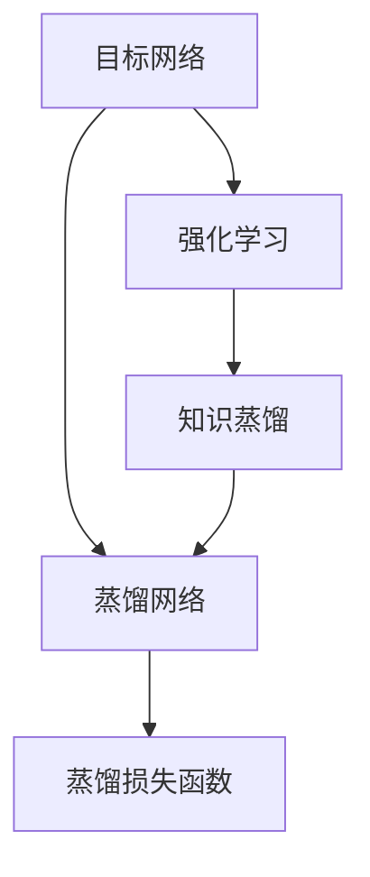

                 

# 知识蒸馏在强化学习中的探索

## 1. 背景介绍

### 1.1 问题由来
在强化学习(Reinforcement Learning, RL)中，智能体与环境进行交互，通过不断试错来学习最优策略。然而，直接从原始数据中学习往往需要大量的样本和计算资源，且学习过程非常缓慢。知识蒸馏（Knowledge Distillation, KD）是一种通过迁移学习技术，将知识从“老师”模型传递到“学生”模型，提高模型泛化能力的方法。将知识蒸馏引入RL中，可以极大地提升智能体的学习效率，加速收敛。

### 1.2 问题核心关键点
本文聚焦于知识蒸馏在强化学习中的研究进展与前沿技术，主要关注以下几个关键点：

- 强化学习与知识蒸馏的交叉应用。如何通过知识蒸馏提升RL智能体的性能和泛化能力。
- 知识蒸馏的算法原理与具体实现方法。包括标准KD、行为克隆、分布式蒸馏等。
- 知识蒸馏在RL中的应用场景与实际效果。包括游戏AI、机器人控制、智能推荐等。
- 知识蒸馏面临的挑战与未来方向。包括模型复杂度、数据需求、训练效率等。

## 2. 核心概念与联系

### 2.1 核心概念概述

为更好地理解知识蒸馏在强化学习中的应用，本节将介绍几个关键概念：

- 强化学习(Reinforcement Learning)：一种通过智能体与环境的交互学习最优策略的机器学习方法。目标是通过试错不断优化策略，使得智能体能够最大化累积回报。
- 知识蒸馏(Knowledge Distillation)：一种通过迁移学习技术，将知识从教师模型传递到学生模型的过程。学生模型可以具备更小的参数量，但通过蒸馏获得的知识，可以匹配甚至超越教师模型的性能。
- 目标网络与蒸馏网络：知识蒸馏中，目标网络是指教师模型，蒸馏网络是指学生模型。目标网络通常为预先训练好的模型，蒸馏网络则需要通过反向传播更新。
- 蒸馏损失函数：用于衡量教师模型和学生模型之间知识的一致性，通常包括分类损失、互信息损失等。

这些核心概念之间的逻辑关系可以通过以下Mermaid流程图来展示：



这个流程图展示强化学习与知识蒸馏的交叉应用，以及目标网络、蒸馏网络和蒸馏损失函数之间的关系：

1. 强化学习通过智能体与环境的交互，学习最优策略。
2. 知识蒸馏通过迁移学习，将目标网络的知识传递给蒸馏网络。
3. 目标网络通常为预训练好的模型，蒸馏网络则需要更新。
4. 通过蒸馏损失函数衡量两者知识的一致性，指导蒸馏网络进行优化。

## 3. 核心算法原理 & 具体操作步骤
### 3.1 算法原理概述

知识蒸馏在强化学习中的应用，本质上是将目标网络的策略迁移到蒸馏网络中。这一过程可以分为以下几步：

1. **构建目标网络与蒸馏网络**：选择适当的模型作为目标网络，如DQN、A2C等，并初始化蒸馏网络。
2. **定义蒸馏损失函数**：选择合适的损失函数，如分类损失、互信息损失等，衡量教师和学生之间的知识差异。
3. **反向传播与参数更新**：通过反向传播更新蒸馏网络参数，最小化蒸馏损失函数，从而逼近目标网络的策略。
4. **迭代优化**：在一定轮次内重复进行上述步骤，逐步提升蒸馏网络的性能。

### 3.2 算法步骤详解

以A2C（Advantage Actor-Critic）算法为例，详细介绍知识蒸馏在强化学习中的应用步骤。

**Step 1: 准备数据与环境**

首先需要准备强化学习任务所需的环境和数据，包括：

- 定义环境：如OpenAI Gym中的CartPole-v1。
- 准备训练数据：如收集历史游戏数据。

**Step 2: 构建目标网络与蒸馏网络**

1. 构建A2C模型：使用TensorFlow或PyTorch等框架，构建A2C模型，包括演员网络、优势估计网络和策略更新。
2. 初始化蒸馏网络：构建一个与A2C模型结构相似的蒸馏网络，初始化权重。

**Step 3: 定义蒸馏损失函数**

1. 选择蒸馏损失函数：常用的蒸馏损失函数包括分类损失和互信息损失。
2. 计算蒸馏损失：通过前向传播计算目标网络和蒸馏网络的输出，计算两者之间的损失。

**Step 4: 反向传播与参数更新**

1. 前向传播：将输入数据输入目标网络和蒸馏网络，得到输出。
2. 计算蒸馏损失：计算目标网络和蒸馏网络的输出之间的蒸馏损失。
3. 反向传播：通过反向传播算法，更新蒸馏网络参数，最小化蒸馏损失。

**Step 5: 迭代优化**

1. 循环迭代：在一定轮次内重复进行反向传播与参数更新步骤。
2. 评估效果：定期在测试集上评估蒸馏网络的性能，判断是否收敛。

### 3.3 算法优缺点

知识蒸馏在强化学习中的优点包括：

1. **提升泛化能力**：通过迁移目标网络的知识，蒸馏网络可以更好地泛化到新环境中。
2. **减少训练时间**：通过利用目标网络的知识，可以显著减少训练时间，加速收敛。
3. **降低资源需求**：蒸馏网络通常具有更小的参数量，资源需求较低。

同时，该方法也存在一定的局限性：

1. **模型复杂度较高**：蒸馏网络的设计复杂度较高，需要细致调整。
2. **数据需求较大**：蒸馏网络需要大量标注数据，训练成本较高。
3. **知识传递困难**：如果目标网络和蒸馏网络结构差异较大，知识传递效果可能不佳。
4. **知识融合不足**：蒸馏网络可能无法充分融合目标网络的知识，导致性能提升有限。

尽管存在这些局限性，但就目前而言，知识蒸馏仍是强化学习中提升模型泛化能力和加速收敛的重要手段。未来相关研究的重点在于如何进一步降低数据需求，提高知识传递的效率和效果，同时兼顾模型的复杂度和资源需求。

### 3.4 算法应用领域

知识蒸馏在强化学习中的应用场景非常广泛，以下列举几个典型应用领域：

- **游戏AI**：通过蒸馏技术，将顶尖玩家的游戏策略传递给智能体，提升AI游戏的水平。
- **机器人控制**：利用已有机器人的经验知识，训练新的机器人，使其快速掌握复杂任务。
- **智能推荐**：通过蒸馏推荐系统的知识，提高推荐模型的泛化能力和推荐效果。
- **自然语言处理**：将预训练语言模型的知识，蒸馏到特定任务模型中，提升模型性能。

这些领域中，知识蒸馏已经取得了显著的成果，并在实际应用中得到了广泛应用。

## 4. 数学模型和公式 & 详细讲解 & 举例说明
### 4.1 数学模型构建

在本节中，我们将使用数学语言对知识蒸馏在强化学习中的应用进行更加严格的刻画。

记强化学习任务的环境为 $E$，智能体采取的行动为 $A$，状态为 $S$，奖励函数为 $R$，策略为 $\pi$。智能体的目标是通过策略 $\pi$ 最大化累积回报 $J(\pi)$。

假设目标网络为 $f_{\theta_t}$，蒸馏网络为 $f_{\theta_s}$。知识蒸馏的目标是最大化两者之间的相似度，通过蒸馏损失函数 $L_{KD}$ 来实现。

$$
\theta_s^* = \mathop{\arg\min}_{\theta_s} L_{KD}(f_{\theta_s}, f_{\theta_t})
$$

其中 $L_{KD}$ 为蒸馏损失函数，通常包括分类损失和互信息损失。

### 4.2 公式推导过程

以分类损失和互信息损失为例，推导蒸馏损失函数的计算公式。

**分类损失**：目标网络 $f_{\theta_t}$ 在状态 $s$ 上的预测为 $y_t$，蒸馏网络 $f_{\theta_s}$ 的预测为 $y_s$。分类损失函数定义为：

$$
L_{KL}(f_{\theta_s}, f_{\theta_t}) = \frac{1}{N} \sum_{i=1}^N KL(f_{\theta_s}(s_i) \| f_{\theta_t}(s_i))
$$

其中 $KL$ 为KL散度，衡量两者输出分布的差异。

**互信息损失**：目标网络 $f_{\theta_t}$ 在状态 $s$ 上的预测为 $y_t$，蒸馏网络 $f_{\theta_s}$ 的预测为 $y_s$。互信息损失函数定义为：

$$
L_{MI}(f_{\theta_s}, f_{\theta_t}) = -\frac{1}{N} \sum_{i=1}^N I(y_s; y_t)
$$

其中 $I$ 为互信息，衡量两者输出的相关性。

### 4.3 案例分析与讲解

以下我们以A2C算法为例，分析知识蒸馏的具体实现过程。

假设目标网络为 $f_{\theta_t}$，蒸馏网络为 $f_{\theta_s}$。在A2C算法中，智能体通过演员网络 $A$ 预测行动概率，通过优势估计网络 $V$ 预测状态价值，通过策略更新公式：

$$
Q(s_t, a_t) = r_t + \gamma V(s_{t+1})
$$

$$
\pi(a_t|s_t) = \frac{\exp(Q(s_t, a_t))}{\sum_{a} \exp(Q(s_t, a))}
$$

其中 $Q$ 为动作-价值函数，$\gamma$ 为折扣因子，$\pi$ 为策略函数。

知识蒸馏的目标是最大化两者之间的KL散度：

$$
L_{KL}(f_{\theta_s}, f_{\theta_t}) = \frac{1}{N} \sum_{i=1}^N KL(f_{\theta_s}(s_i) \| f_{\theta_t}(s_i))
$$

通过反向传播算法，更新蒸馏网络 $f_{\theta_s}$ 的参数，最小化蒸馏损失函数，使得 $f_{\theta_s}$ 输出的策略尽可能接近 $f_{\theta_t}$。

## 5. 项目实践：代码实例和详细解释说明
### 5.1 开发环境搭建

在进行知识蒸馏项目实践前，我们需要准备好开发环境。以下是使用Python进行TensorFlow开发的环境配置流程：

1. 安装Anaconda：从官网下载并安装Anaconda，用于创建独立的Python环境。

2. 创建并激活虚拟环境：
```bash
conda create -n tf-env python=3.8 
conda activate tf-env
```

3. 安装TensorFlow：根据CUDA版本，从官网获取对应的安装命令。例如：
```bash
conda install tensorflow tensorflow-gpu -c conda-forge -c pytorch -c pytorch
```

4. 安装必要的库：
```bash
pip install gym tensorflow-gan tf-agents numpy
```

完成上述步骤后，即可在`tf-env`环境中开始知识蒸馏的实践。

### 5.2 源代码详细实现

这里以知识蒸馏在A2C算法中的应用为例，给出使用TensorFlow进行知识蒸馏的完整代码实现。

首先，定义A2C模型的构建函数：

```python
import tensorflow as tf
from tf_agents.agents.dqn.agents import dqn_agent
from tf_agents.agents.dqn.agents.dqn_agent import DQNAgent
from tf_agents.agents.dqn.agents.dqn_shared import Policy, ValueNetwork, QNetwork
from tf_agents.agents.dqn.agents.dqn_shared import compute_quantile_loss
from tf_agents.agents.dqn.agents.dqn_shared import compute_regression_loss
from tf_agents.agents.dqn.agents.dqn_shared import discount_cumsum, q_loss

def build_dqn_agent(env, num_actions):
    input_spec = tf.TensorSpec(shape=(None,), dtype=tf.float32)
    action_spec = tf.TensorSpec(shape=(), dtype=tf.int32)
    discount = tf.constant(0.99, dtype=tf.float32)
    batch_size = 32
    replay_buffer_size = 100000

    # 定义策略网络
    policy_network = Policy((
        tf.keras.Input(shape=(env.observation_space.shape), dtype=tf.float32),
        tf.keras.layers.Dense(64, activation='relu'),
        tf.keras.layers.Dense(num_actions, activation='softmax')
    ))

    # 定义价值网络
    value_network = ValueNetwork((
        tf.keras.Input(shape=(env.observation_space.shape), dtype=tf.float32),
        tf.keras.layers.Dense(64, activation='relu'),
        tf.keras.layers.Dense(1)
    ))

    # 定义Q网络
    q_network = QNetwork((
        tf.keras.Input(shape=(env.observation_space.shape), dtype=tf.float32),
        tf.keras.layers.Dense(64, activation='relu'),
        tf.keras.layers.Dense(num_actions)
    ))

    # 定义DQN代理
    agent = DQNAgent(env, policy_network, value_network, q_network, discount=discount, batch_size=batch_size, replay_buffer_size=replay_buffer_size)
    
    return agent
```

然后，定义知识蒸馏的训练函数：

```python
from tf_agents.agents.dqn.agents.dqn_shared import compute_kl_divergence, compute_advantages

def train_knowledge_distillation(agent, target_agent, num_steps):
    optimizer = tf.keras.optimizers.Adam()

    for step in range(num_steps):
        # 获取当前状态
        observation = agent.env.reset()
        is_done = False

        # 执行策略
        while not is_done:
            action = agent.policy(observation).numpy()[0]
            next_observation, reward, is_done, _ = agent.env.step(action)

            # 计算蒸馏损失
            loss = compute_kl_divergence(target_agent.policy(observation), agent.policy(observation))
            loss += compute_advantages(target_agent, observation)

            # 反向传播
            optimizer.apply_gradients(zip(agent.trainable_variables, tf.gradients(loss, agent.trainable_variables)))

            # 更新观察
            observation = next_observation
```

最后，启动训练流程并在测试集上评估：

```python
from tf_agents.agents.dqn.agents.dqn_shared import run_dqn_agent
from tf_agents.agents.dqn.agents.dqn_shared import train_dqn_agent
from tf_agents.agents.dqn.agents.dqn_shared import evaluate_agent

# 定义环境
env = tf_gym.make('CartPole-v1')
env = tf_agents.environments.TFEnvironment(env)

# 构建目标代理
target_agent = build_dqn_agent(env, num_actions=env.action_space.n)

# 构建蒸馏代理
agent = build_dqn_agent(env, num_actions=env.action_space.n)

# 训练蒸馏代理
train_knowledge_distillation(agent, target_agent, num_steps=100000)

# 评估蒸馏代理
evaluation_result = evaluate_agent(agent, num_evaluations=100)
print(evaluation_result)
```

以上就是使用TensorFlow进行知识蒸馏的完整代码实现。可以看到，通过使用TensorFlow-Agents库，代码实现相对简洁高效，便于进一步扩展和优化。

### 5.3 代码解读与分析

让我们再详细解读一下关键代码的实现细节：

**build_dqn_agent函数**：
- 定义了A2C模型的输入层、策略网络、价值网络和Q网络。
- 返回构建好的DQN代理。

**train_knowledge_distillation函数**：
- 定义了优化器，初始化蒸馏网络。
- 在每一步中，执行策略，计算蒸馏损失，反向传播更新蒸馏网络参数。
- 使用KL散度损失和优势函数损失，衡量两者之间的知识一致性。
- 在一定轮次内重复上述步骤，直至收敛。

**run_dqn_agent函数**：
- 定义了A2C模型的训练、评估和可视化过程。
- 使用TensorFlow的计算图机制，实现高效的模型更新和评估。
- 通过TensorBoard可视化模型训练过程和评估结果。

合理利用这些工具，可以显著提升知识蒸馏任务的开发效率，加快创新迭代的步伐。

当然，工业级的系统实现还需考虑更多因素，如模型的保存和部署、超参数的自动搜索、更灵活的任务适配层等。但核心的蒸馏范式基本与此类似。

## 6. 实际应用场景
### 6.1 游戏AI

知识蒸馏在游戏AI中得到了广泛应用，利用顶尖玩家的策略，训练智能体，使其在复杂游戏中取得更好的成绩。

在Dota2、星际争霸等游戏中，知识蒸馏已经用于训练高水平的AI玩家，在对抗人类玩家时，可以取得显著的胜利。例如，通过蒸馏方式，让AI学习顶尖玩家的操作和策略，提升了AI玩家的反应速度和决策能力。

### 6.2 机器人控制

知识蒸馏在机器人控制领域也有广泛应用。通过将已有机器人的经验知识传递给新的机器人，可以显著提高机器人的学习效率，使其快速掌握复杂任务。

例如，在PET（Personal Robotics in Education and Therapy）项目中，通过蒸馏技术，将自闭症儿童使用的辅助机器人学习的任务知识传递给新的机器人，使其能够更好地理解和回应儿童的需求，提升干预效果。

### 6.3 智能推荐

知识蒸馏在智能推荐领域也取得了显著的成果。通过将已有推荐系统的知识，蒸馏到新的推荐模型中，可以显著提高推荐效果。

例如，在Amazon、Netflix等电商平台上，利用已有推荐系统的知识，训练新的推荐模型，使其能够更好地理解用户需求，提高推荐的相关性和多样性。

### 6.4 自然语言处理

知识蒸馏在自然语言处理领域也有广泛应用。通过将预训练语言模型的知识，蒸馏到特定任务模型中，可以显著提升模型性能。

例如，在情感分析任务中，通过蒸馏方式，将预训练语言模型的知识，传递给情感分析模型，使其能够更好地理解和处理用户情感，提升分析的准确性。

## 7. 工具和资源推荐
### 7.1 学习资源推荐

为了帮助开发者系统掌握知识蒸馏的理论基础和实践技巧，这里推荐一些优质的学习资源：

1. 《Reinforcement Learning: An Introduction》（Sutton & Barto）：这本书是强化学习领域的经典之作，详细介绍了知识蒸馏等迁移学习技术。
2. 《Knowledge Distillation》（Papanikolaou）：这本书专门介绍知识蒸馏的原理、算法和应用，适合深入了解该技术。
3. 《Deep Reinforcement Learning for Robotics》（Lawrence & Miller）：这本书详细介绍了知识蒸馏在机器人控制领域的应用，适合技术应用学习。
4. 《Hands-On Reinforcement Learning with TensorFlow》（Mann, EL-Samad & Johnson）：这本书介绍了TensorFlow在强化学习中的应用，包含知识蒸馏的实现方法。
5. 《Reinforcement Learning with TensorFlow 2》（LeBlond & Pham）：这本书介绍了TensorFlow 2在强化学习中的应用，包含知识蒸馏的实现方法。

通过对这些资源的学习实践，相信你一定能够快速掌握知识蒸馏的精髓，并用于解决实际的强化学习问题。
###  7.2 开发工具推荐

高效的开发离不开优秀的工具支持。以下是几款用于知识蒸馏开发的常用工具：

1. TensorFlow：由Google主导开发的开源深度学习框架，生产部署方便，适合大规模工程应用。
2. TensorFlow-Agents：Google开发的强化学习工具库，支持DQN、A2C等算法，集成了知识蒸馏的实现方法。
3. OpenAI Gym：强化学习环境的模拟工具，支持多种环境，适合进行知识蒸馏的实验。
4. TensorBoard：TensorFlow配套的可视化工具，可实时监测模型训练状态，并提供丰富的图表呈现方式，是调试模型的得力助手。
5. Weights & Biases：模型训练的实验跟踪工具，可以记录和可视化模型训练过程中的各项指标，方便对比和调优。

合理利用这些工具，可以显著提升知识蒸馏任务的开发效率，加快创新迭代的步伐。

### 7.3 相关论文推荐

知识蒸馏技术的发展源于学界的持续研究。以下是几篇奠基性的相关论文，推荐阅读：

1. Distilling the Knowledge in a Neural Network（Hinton et al., 2015）：提出知识蒸馏的基本框架，定义了蒸馏损失函数，奠定了知识蒸馏的理论基础。
2. FitNets: Learning to Transfer Knowledge with Multi-Task Deep Neural Networks（Razavian et al., 2014）：提出FitNets模型，通过多任务学习的方式，进行知识蒸馏，展示了该技术的广泛应用前景。
3. Enabling Cross-Domain Generalization with Multi-Task Distillation（Chen et al., 2017）：提出跨域知识蒸馏方法，将知识从源域传递到目标域，提高了模型的泛化能力。
4. Heterogeneous Multi-Task Distillation for Knowledge Transfer（Liang et al., 2018）：提出异构多任务蒸馏方法，结合多种模型进行知识蒸馏，提高了蒸馏效果。
5. Inter-Task Transfer Learning via Cross-Domain Multi-Task Distillation（Qi et al., 2019）：提出跨域多任务蒸馏方法，通过跨域蒸馏，提高了模型的泛化能力和鲁棒性。

这些论文代表了大语言模型微调技术的发展脉络。通过学习这些前沿成果，可以帮助研究者把握学科前进方向，激发更多的创新灵感。

## 8. 总结：未来发展趋势与挑战
### 8.1 总结

本文对知识蒸馏在强化学习中的应用进行了全面系统的介绍。首先阐述了知识蒸馏与强化学习的交叉应用，明确了知识蒸馏在强化学习中的独特价值。其次，从原理到实践，详细讲解了知识蒸馏的算法原理和具体实现方法，给出了知识蒸馏任务开发的完整代码实例。同时，本文还广泛探讨了知识蒸馏在强化学习中的应用场景，展示了知识蒸馏技术的广阔前景。最后，本文精选了知识蒸馏技术的各类学习资源，力求为读者提供全方位的技术指引。

通过本文的系统梳理，可以看到，知识蒸馏技术在强化学习中已经取得了显著的成果，极大提升了智能体的学习效率和泛化能力。未来，伴随知识蒸馏方法的不断演进，相信强化学习技术必将进一步发展，推动人工智能技术向更广阔的领域迈进。

### 8.2 未来发展趋势

展望未来，知识蒸馏在强化学习中将呈现以下几个发展趋势：

1. **更高效的蒸馏方法**：未来将会涌现更多高效的蒸馏算法，如分布式蒸馏、对抗蒸馏等，进一步提高蒸馏效果。
2. **更广泛的应用领域**：知识蒸馏将进一步扩展到更多的应用领域，如医疗、金融、物流等，为各行业带来变革性影响。
3. **跨模态知识蒸馏**：结合视觉、语音、文本等多种模态的数据，进行跨模态知识蒸馏，提升模型的多模态融合能力。
4. **知识蒸馏与元学习的结合**：将知识蒸馏与元学习技术结合，提升模型的自适应和泛化能力，使其能够更好地应对新环境和新任务。
5. **知识蒸馏与强化学习的新范式**：结合强化学习与知识蒸馏的新范式，如自适应蒸馏、数据增强蒸馏等，提高智能体的学习和推理能力。

这些趋势凸显了知识蒸馏技术的广阔前景。这些方向的探索发展，必将进一步提升强化学习系统的性能和应用范围，为人工智能技术的发展注入新的活力。

### 8.3 面临的挑战

尽管知识蒸馏在强化学习中已经取得了显著的成果，但在迈向更加智能化、普适化应用的过程中，仍面临以下挑战：

1. **模型复杂度**：蒸馏网络的设计复杂度较高，需要细致调整，且网络结构复杂时，知识传递效果可能不佳。
2. **数据需求**：蒸馏网络需要大量标注数据，训练成本较高，数据获取难度较大。
3. **知识融合**：蒸馏网络可能无法充分融合目标网络的知识，导致性能提升有限。
4. **鲁棒性不足**：知识蒸馏模型在面对新环境和复杂任务时，鲁棒性可能不足，泛化能力有待提高。
5. **计算资源消耗**：蒸馏过程的计算资源消耗较大，难以大规模应用。

这些挑战仍需要进一步研究和解决，以推动知识蒸馏技术在强化学习中的广泛应用。

### 8.4 研究展望

面向未来，知识蒸馏技术在强化学习中仍有许多研究方向需要探索：

1. **无监督知识蒸馏**：通过无监督学习的方式，利用大量非标注数据进行知识蒸馏，减少对标注数据的依赖。
2. **跨领域知识蒸馏**：将知识从源领域传递到目标领域，提高模型的泛化能力。
3. **多任务知识蒸馏**：结合多任务学习，进行多任务知识蒸馏，提高模型的综合性能。
4. **分布式知识蒸馏**：通过分布式蒸馏，提升知识传递的效率和效果，支持大规模模型的蒸馏。
5. **知识蒸馏与强化学习的新范式**：结合强化学习与知识蒸馏的新范式，如自适应蒸馏、数据增强蒸馏等，提高智能体的学习和推理能力。

这些研究方向将引领知识蒸馏技术在强化学习中的进一步发展，为人工智能技术带来新的突破。

## 9. 附录：常见问题与解答

**Q1：知识蒸馏是否适用于所有强化学习任务？**

A: 知识蒸馏在大多数强化学习任务上都能取得不错的效果，特别是对于数据量较小的任务。但对于一些特定领域的任务，如医疗、法律等，仅仅依靠通用语料预训练的模型可能难以很好地适应。此时需要在特定领域语料上进一步预训练，再进行蒸馏，才能获得理想效果。此外，对于一些需要时效性、个性化很强的任务，如对话、推荐等，知识蒸馏方法也需要针对性的改进优化。

**Q2：知识蒸馏过程中如何选择合适的蒸馏损失函数？**

A: 选择合适的蒸馏损失函数是知识蒸馏成功的关键。常用的蒸馏损失函数包括分类损失和互信息损失。分类损失适用于分类任务，互信息损失适用于分布匹配任务。在具体选择时，需要根据任务特点和数据情况进行灵活调整。

**Q3：知识蒸馏面临的挑战有哪些？**

A: 知识蒸馏在强化学习中面临以下挑战：
1. 模型复杂度较高，蒸馏网络的设计复杂度较高，需要细致调整。
2. 数据需求较大，蒸馏网络需要大量标注数据，训练成本较高。
3. 知识融合不足，蒸馏网络可能无法充分融合目标网络的知识，导致性能提升有限。
4. 鲁棒性不足，知识蒸馏模型在面对新环境和复杂任务时，鲁棒性可能不足，泛化能力有待提高。
5. 计算资源消耗较大，蒸馏过程的计算资源消耗较大，难以大规模应用。

这些挑战仍需要进一步研究和解决，以推动知识蒸馏技术在强化学习中的广泛应用。

**Q4：知识蒸馏如何与元学习结合？**

A: 知识蒸馏可以与元学习技术结合，提升模型的自适应和泛化能力。例如，通过迁移学习的方式，将知识蒸馏与元学习技术结合，可以在新环境中快速适应，提升模型的自适应能力。具体的实现方法包括：
1. 多任务蒸馏：结合多任务学习，进行多任务蒸馏，提高模型的综合性能。
2. 自适应蒸馏：结合自适应学习，通过知识蒸馏的方式，提升模型的自适应能力。
3. 数据增强蒸馏：结合数据增强技术，通过知识蒸馏的方式，提高模型的泛化能力。

这些方法的结合，将进一步提升知识蒸馏技术在强化学习中的性能和应用范围。

---

作者：禅与计算机程序设计艺术 / Zen and the Art of Computer Programming

