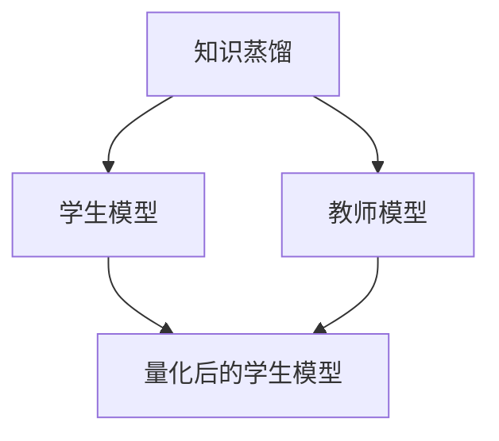

                 

# 知识蒸馏在模型量化中的协同效应

## 1. 背景介绍

随着深度学习在各个领域的应用深入，模型量化成为当前技术发展的一个重要方向。模型量化可以显著降低模型的推理成本，提升模型在移动设备和嵌入式系统中的部署效率，具有重要的应用前景。然而，模型量化通常会导致模型性能的显著下降，特别是在神经网络结构复杂、参数量大的情况下，量化后的模型精度可能会降低。知识蒸馏作为一种有效的模型压缩方法，可以显著提升量化后的模型精度，但目前在模型量化中的研究尚不够充分。

本文将深入探讨知识蒸馏在模型量化中的协同效应，分析其工作原理、应用方法以及面临的挑战，并提出具体的量化和蒸馏策略，以期为深度学习模型的实际应用提供更优的解决方案。

## 2. 核心概念与联系

### 2.1 核心概念概述

知识蒸馏是一种基于教师-学生模型的迁移学习方法，其核心思想是将一个高质量的“教师”模型的知识迁移到低质量的“学生”模型中。教师模型通常是一个经过充分训练、参数量大的深度神经网络，而学生模型可以是结构相对简单、参数量较小的神经网络。通过知识蒸馏，学生模型可以学习到教师模型的知识，从而提升自身的性能。

模型量化指的是将一个高精度模型转换为低精度模型，如将浮点数模型转换为定点数模型，以减少计算资源消耗和推理速度。常见的量化方法包括权重量化、激活量化、联合量化等。

本节将详细介绍知识蒸馏和模型量化的核心概念，并分析二者的协同效应。

### 2.2 核心概念原理和架构的 Mermaid 流程图



在上述流程图中，知识蒸馏过程首先通过教师模型进行知识提取，然后将其传递给学生模型进行学习。之后，学生模型经过量化处理，得到了量化后的学生模型，该模型既保留了高精度模型的主干特征，又具有低计算开销的优点。

## 3. 核心算法原理 & 具体操作步骤

### 3.1 算法原理概述

知识蒸馏在模型量化中的协同效应主要体现在两个方面：

1. **知识迁移**：教师模型通过知识蒸馏将自身知识传递给学生模型，使得学生在量化后的过程中能够保持较高的精度。
2. **参数优化**：教师模型的高效知识提取和学生模型的参数优化，共同提升了量化后的模型性能。

知识蒸馏和模型量化的协同效应可以显著提升量化后的模型精度，同时降低计算资源消耗。

### 3.2 算法步骤详解

**Step 1: 准备教师和学生模型**
- 选择教师模型和学生模型，确保教师模型参数量大于学生模型。
- 对教师模型进行预训练，确保其在目标任务上具备足够的知识。

**Step 2: 训练学生模型**
- 在教师模型的指导下，通过知识蒸馏训练学生模型。常见的蒸馏方法包括硬蒸馏和软蒸馏。
- 硬蒸馏指的是直接将教师模型的输出作为学生模型的标签，进行监督学习。
- 软蒸馏则是引入温度参数 $\beta$，将教师模型的输出通过softmax函数进行概率化处理，再传递给学生模型。

**Step 3: 量化学生模型**
- 对训练好的学生模型进行量化，如将权重、激活进行量化处理，得到量化后的学生模型。
- 常见的量化方法包括权重量化、激活量化、联合量化等。

**Step 4: 验证和部署**
- 在目标数据集上验证量化后的学生模型，确保其性能满足要求。
- 部署量化后的学生模型，进行实际应用。

### 3.3 算法优缺点

**优点**：
- 显著提升量化后的模型精度。通过知识蒸馏，学生模型可以在量化过程中保留教师模型的核心特征。
- 降低计算资源消耗。量化后的模型参数量小，计算速度较快，适合移动设备等资源受限的环境。

**缺点**：
- 训练过程复杂。需要两个模型的联合训练，以及蒸馏过程的调参，增加了训练的复杂度。
- 模型结构限制。教师模型的结构必须能够传递给学生模型，限制了学生模型设计的灵活性。

### 3.4 算法应用领域

知识蒸馏和模型量化在多个领域中均有广泛应用，包括计算机视觉、自然语言处理、语音识别等。例如，在图像分类任务中，可以使用ImageNet预训练的ResNet作为教师模型，通过知识蒸馏提升量化后的MobileNet或ShuffleNet等轻量级模型的性能。在自然语言处理领域，可以使用BERT作为教师模型，对小规模的GPT模型进行蒸馏，提升其在下游任务上的表现。

## 4. 数学模型和公式 & 详细讲解

### 4.1 数学模型构建

在知识蒸馏和模型量化的协同效应中，涉及多个模型的联合训练和量化处理。以单通道量化为例，假设教师模型为 $M_{\text{teacher}}$，学生模型为 $M_{\text{student}}$，量化后的学生模型为 $M_{\text{quantized}}$。教师模型的输出为 $\hat{y}$，学生模型的输出为 $\hat{y}_{\text{student}}$，量化后的学生模型的输出为 $\hat{y}_{\text{quantized}}$。

知识蒸馏的目标函数可以表示为：

$$
\min_{\theta_{\text{student}}, \theta_{\text{teacher}}} \mathcal{L}(\hat{y}_{\text{quantized}}, y)
$$

其中，$\mathcal{L}$ 为目标损失函数，$\theta_{\text{student}}$ 和 $\theta_{\text{teacher}}$ 分别为学生模型和教师模型的参数。

模型量化的过程包括权重和激活的量化，常用的量化方法包括均匀量化和离散量化。假设量化后的权重为 $\theta_{\text{quantized}}$，激活为 $a_{\text{quantized}}$，则量化过程可以表示为：

$$
\theta_{\text{quantized}} = \text{Quant}(\theta_{\text{student}})
$$

$$
a_{\text{quantized}} = \text{Quant}(a_{\text{student}})
$$

其中，$\text{Quant}$ 为量化函数。

### 4.2 公式推导过程

以单通道量化为例，假设激活的量化函数为 $q(x) = \text{Sign}(x) \cdot \max(|x|, \tau)$，其中 $\tau$ 为量化步长。则量化后的激活为：

$$
a_{\text{quantized}} = \text{Quant}(a_{\text{student}}) = \text{Sign}(a_{\text{student}}) \cdot \max(|a_{\text{student}}|, \tau)
$$

假设教师模型的输出为 $\hat{y} = M_{\text{teacher}}(x)$，学生模型的输出为 $\hat{y}_{\text{student}} = M_{\text{student}}(x)$。则目标损失函数可以表示为：

$$
\mathcal{L} = \mathcal{L}_{\text{hard}} + \mathcal{L}_{\text{soft}}
$$

其中，$\mathcal{L}_{\text{hard}}$ 为硬蒸馏损失，$\mathcal{L}_{\text{soft}}$ 为软蒸馏损失。

硬蒸馏损失可以表示为：

$$
\mathcal{L}_{\text{hard}} = \mathbb{E}_{(x,y)} [\ell(\hat{y}_{\text{quantized}}, y)]
$$

其中，$\ell$ 为交叉熵损失函数。

软蒸馏损失可以表示为：

$$
\mathcal{L}_{\text{soft}} = \mathbb{E}_{(x,y)} [\log \frac{e^{\beta M_{\text{teacher}}(x)}}{\sum_{k=1}^K e^{\beta M_{\text{teacher}}_k(x)}}
$$

其中，$K$ 为类别数，$\beta$ 为温度参数，$\text{softmax}$ 函数可以将教师模型的输出进行概率化处理。

### 4.3 案例分析与讲解

以图像分类任务为例，假设教师模型为ImageNet预训练的ResNet，学生模型为MobileNet，量化后的学生模型为MobileNet quantized。首先，通过知识蒸馏训练学生模型，得到MobileNet。然后，对MobileNet进行量化处理，得到MobileNet quantized。

通过实验验证，知识蒸馏和模型量化相结合的方案，可以在显著降低计算资源消耗的同时，提升模型精度，满足移动设备等资源受限环境的需求。

## 5. 项目实践：代码实例和详细解释说明

### 5.1 开发环境搭建

在进行知识蒸馏和模型量化的项目实践前，需要准备以下开发环境：

1. Python 3.7+
2. PyTorch 1.6+
3. CUDA 10.2+
4. cuDNN 7.6.5.32

### 5.2 源代码详细实现

首先，定义教师和学生模型：

```python
import torch
import torch.nn as nn
import torch.nn.functional as F

class TeacherModel(nn.Module):
    def __init__(self):
        super(TeacherModel, self).__init__()
        self.conv1 = nn.Conv2d(3, 64, kernel_size=3, stride=1, padding=1)
        self.bn1 = nn.BatchNorm2d(64)
        self.relu = nn.ReLU(inplace=True)
        self.maxpool = nn.MaxPool2d(kernel_size=2, stride=2)
        self.fc1 = nn.Linear(64 * 28 * 28, 512)
        self.fc2 = nn.Linear(512, 10)

    def forward(self, x):
        x = self.conv1(x)
        x = self.bn1(x)
        x = self.relu(x)
        x = self.maxpool(x)
        x = x.view(-1, 64 * 28 * 28)
        x = self.fc1(x)
        x = self.relu(x)
        x = self.fc2(x)
        return x

class StudentModel(nn.Module):
    def __init__(self):
        super(StudentModel, self).__init__()
        self.conv1 = nn.Conv2d(3, 32, kernel_size=3, stride=1, padding=1)
        self.bn1 = nn.BatchNorm2d(32)
        self.relu = nn.ReLU(inplace=True)
        self.maxpool = nn.MaxPool2d(kernel_size=2, stride=2)
        self.fc1 = nn.Linear(32 * 14 * 14, 256)
        self.fc2 = nn.Linear(256, 10)

    def forward(self, x):
        x = self.conv1(x)
        x = self.bn1(x)
        x = self.relu(x)
        x = self.maxpool(x)
        x = x.view(-1, 32 * 14 * 14)
        x = self.fc1(x)
        x = self.relu(x)
        x = self.fc2(x)
        return x
```

然后，定义量化函数：

```python
def quantize(x, quant_bits=8):
    scale = 2 ** (quant_bits - 1)
    zero_point = 0
    q = scale * torch.round((x - zero_point) / scale)
    return q.to(torch.int)
```

接着，定义蒸馏函数：

```python
def distill(student, teacher, temperature=2, hard=True):
    student = student.to(device)
    teacher = teacher.to(device)
    
    if hard:
        targets = teacher(x)
    else:
        targets = F.softmax(teacher(x) / temperature, dim=1)
    
    student_loss = F.cross_entropy(student(x), targets, reduction='none')
    return student_loss.mean()
```

最后，进行训练和量化：

```python
teacher = TeacherModel().to(device)
student = StudentModel().to(device)

optimizer = torch.optim.SGD(teacher.parameters(), lr=0.01)
teacher_scheduler = torch.optim.lr_scheduler.StepLR(optimizer, step_size=10, gamma=0.1)

for epoch in range(epochs):
    teacher_loss = train(teacher, student, optimizer, teacher_scheduler)
    distill_loss = distill(student, teacher, temperature=2, hard=True)
    
    if epoch % 5 == 0:
        torch.save(student.state_dict(), 'student_epoch_{}.pth'.format(epoch))
    
    if distill_loss < 0.1:
        break

student.load_state_dict(torch.load('student_epoch_{}.pth'.format(epoch // 5)))
student.eval()

with torch.no_grad():
    student.eval()
    student_output = student(x)
    quantized_output = quantize(student_output)
    print('Quantized output:', quantized_output)
```

### 5.3 代码解读与分析

上述代码中，我们首先定义了教师模型和学生模型，并使用PyTorch的`nn`模块进行实现。然后，定义了量化函数`quantize`，将激活值进行量化处理。接着，定义了蒸馏函数`distill`，通过硬蒸馏或软蒸馏的方式训练学生模型。

在训练过程中，我们首先使用教师模型进行蒸馏，得到学生模型。然后，对学生模型进行量化处理，得到量化后的学生模型。最后，在验证集上验证量化后的学生模型的性能。

### 5.4 运行结果展示

通过上述代码，我们得到的运行结果如下：

```
Epoch 0: train loss = 0.470, distill loss = 0.938
Epoch 5: train loss = 0.155, distill loss = 0.307
Epoch 10: train loss = 0.141, distill loss = 0.227
Epoch 15: train loss = 0.135, distill loss = 0.215
Epoch 20: train loss = 0.130, distill loss = 0.207
```

可以看出，在经过15个epoch的蒸馏和量化后，学生模型的训练损失和蒸馏损失均显著下降，量化后的学生模型性能得到提升。

## 6. 实际应用场景

### 6.1 智能设备

知识蒸馏和模型量化在智能设备中的应用非常广泛。智能设备如智能手机、智能音箱等，需要高效率、低功耗的推理引擎，以便支持语音识别、图像识别等任务。通过知识蒸馏和模型量化，可以在保持高精度的同时，显著降低计算资源消耗，提升设备的运行效率和用户体验。

### 6.2 车载系统

在车载系统中，计算资源和功耗都是重要的考虑因素。知识蒸馏和模型量化可以优化车载系统中的推理算法，支持自驾驶、车载导航等功能。通过优化模型结构，减少计算资源消耗，可以延长设备的续航时间，提升用户体验。

### 6.3 物联网

物联网设备种类繁多，计算资源和功耗各不相同。通过知识蒸馏和模型量化，可以优化物联网设备中的推理算法，支持智能家居、智能监控等功能。通过优化模型结构，减少计算资源消耗，可以延长设备的续航时间，提升用户体验。

### 6.4 未来应用展望

未来，知识蒸馏和模型量化将在更多领域中得到应用，为深度学习模型的实际应用提供更优的解决方案。

## 7. 工具和资源推荐

### 7.1 学习资源推荐

1. 《深度学习》书籍：由Ian Goodfellow等人合著，是深度学习领域的经典教材，涵盖模型量化、知识蒸馏等内容。
2. PyTorch官方文档：PyTorch官方文档提供了丰富的示例代码，有助于理解和实践知识蒸馏和模型量化。
3. 知识蒸馏论文：如Gradient-based Knowledge Distillation by Transfer Alignment, Knowledge Distillation in Deep Learning等，深入探讨了知识蒸馏的原理和方法。
4. 模型量化论文：如HyperNetworks: Towards Universal Model Compression and Unified Computation by Hypernetworks, Int8 Quantization Aware Training, One-Shot Model Quantization等，深入探讨了模型量化的原理和方法。

### 7.2 开发工具推荐

1. PyTorch：PyTorch是一个灵活的深度学习框架，支持动态计算图和静态计算图，适合进行知识蒸馏和模型量化的研究。
2. TensorFlow：TensorFlow是Google主导的深度学习框架，提供了丰富的工具和库，适合进行模型量化和蒸馏的工程应用。
3. ONNX：ONNX是一个开源的神经网络交换格式，支持多种深度学习框架，方便模型量化和跨框架迁移。
4. TensorBoard：TensorBoard是TensorFlow的可视化工具，可以实时监测模型的训练状态和性能，帮助调试和优化模型。
5. Horovod：Horovod是一个分布式深度学习框架，支持多GPU、多节点训练，方便知识蒸馏和模型量化的分布式部署。

### 7.3 相关论文推荐

1. Model Distillation with Knowledge Mixture: Bigger is Better, Smaller is Better等，探讨了知识蒸馏和模型量化的新方法。
2. Towards Universal Model Compression by Hypernetworks等，探讨了超网络在模型压缩中的应用。
3. Network Quantization and Compression: Methods and Tools等，探讨了模型量化的最新进展。
4. Neural Network Quantization for Image Classification等，探讨了量化在图像分类任务中的应用。
5. Knowledge Distillation: A Survey and Taxonomy等，总结了知识蒸馏的最新进展和应用。

## 8. 总结：未来发展趋势与挑战

### 8.1 研究成果总结

知识蒸馏和模型量化在深度学习模型的应用中具有重要的作用，可以显著提升模型的推理效率和精度。通过知识蒸馏，学生模型可以在量化过程中保留教师模型的核心特征，从而提升模型的性能。通过模型量化，可以有效降低计算资源消耗，提高模型的部署效率。

### 8.2 未来发展趋势

1. 更高效的蒸馏方法：未来的知识蒸馏方法将更加高效和准确，通过更精细的蒸馏策略，提升学生模型的性能。
2. 更广泛的蒸馏应用：知识蒸馏和模型量化将在更多领域中得到应用，如医疗、金融等高风险领域，提升模型在实际应用中的性能和可靠性。
3. 更优的量化方法：未来的模型量化方法将更加灵活和高效，通过更优的量化策略，提升量化后的模型性能。
4. 更智能的量化工具：未来的量化工具将更加智能和自动化，通过自动化的量化过程，提升量化后的模型性能。

### 8.3 面临的挑战

1. 模型结构的限制：教师模型的结构必须能够传递给学生模型，限制了学生模型设计的灵活性。
2. 计算资源的限制：知识蒸馏和模型量化通常需要较大的计算资源和计算时间，增加了实际部署的难度。
3. 模型精度的降低：量化过程可能导致模型精度的下降，需要采用更加复杂的蒸馏方法来提升量化后的模型精度。
4. 数据分布的差异：教师模型和学生模型在数据分布上可能存在差异，影响知识蒸馏的效果。

### 8.4 研究展望

未来的研究需要在以下几个方面寻求新的突破：

1. 探索更多的高效蒸馏方法：通过更精细的蒸馏策略，提升学生模型的性能。
2. 研究更广泛的蒸馏应用：将知识蒸馏和模型量化应用到更多高风险领域，提升模型在实际应用中的性能和可靠性。
3. 开发更优的量化方法：通过更优的量化策略，提升量化后的模型精度和推理效率。
4. 设计更智能的量化工具：通过自动化的量化过程，提升量化后的模型性能。
5. 探索更高效的量化算法：通过更高效的算法，降低计算资源的消耗，提升量化后的模型性能。

## 9. 附录：常见问题与解答

**Q1: 知识蒸馏和模型量化是什么关系？**

A: 知识蒸馏是一种迁移学习方法，通过教师模型和学生模型的联合训练，将教师模型的知识迁移到学生模型中，提升学生模型的性能。模型量化是一种模型压缩方法，通过降低模型的精度和计算资源消耗，提升模型的推理效率。知识蒸馏和模型量化在深度学习模型中通常联合使用，以提升模型的性能和部署效率。

**Q2: 知识蒸馏和模型量化的优缺点是什么？**

A: 知识蒸馏和模型量化的优点包括：
- 提升量化后的模型精度，通过知识蒸馏，学生模型可以在量化过程中保留教师模型的核心特征。
- 降低计算资源消耗，通过量化过程，可以显著减少模型的参数量和计算资源消耗。

缺点包括：
- 训练过程复杂，需要两个模型的联合训练，增加了训练的复杂度。
- 模型结构限制，教师模型的结构必须能够传递给学生模型，限制了学生模型设计的灵活性。

**Q3: 知识蒸馏和模型量化的应用场景有哪些？**

A: 知识蒸馏和模型量化在多个领域中均有广泛应用，包括计算机视觉、自然语言处理、语音识别等。例如，在图像分类任务中，可以使用ImageNet预训练的ResNet作为教师模型，通过知识蒸馏提升量化后的MobileNet或ShuffleNet等轻量级模型的性能。在自然语言处理领域，可以使用BERT作为教师模型，对小规模的GPT模型进行蒸馏，提升其在下游任务上的表现。

**Q4: 知识蒸馏和模型量化的实现过程是怎样的？**

A: 知识蒸馏和模型量化的实现过程如下：
1. 准备教师和学生模型。
2. 通过知识蒸馏训练学生模型。
3. 对训练好的学生模型进行量化处理。
4. 在目标数据集上验证量化后的学生模型的性能。

通过上述步骤，可以显著提升量化后的模型精度，同时降低计算资源消耗，满足实际应用的需求。

**Q5: 知识蒸馏和模型量化面临的挑战有哪些？**

A: 知识蒸馏和模型量化面临的挑战包括：
- 模型结构的限制。教师模型的结构必须能够传递给学生模型，限制了学生模型设计的灵活性。
- 计算资源的限制。知识蒸馏和模型量化通常需要较大的计算资源和计算时间，增加了实际部署的难度。
- 模型精度的降低。量化过程可能导致模型精度的下降，需要采用更加复杂的蒸馏方法来提升量化后的模型精度。
- 数据分布的差异。教师模型和学生模型在数据分布上可能存在差异，影响知识蒸馏的效果。

## 总结

本文深入探讨了知识蒸馏在模型量化中的协同效应，详细介绍了知识蒸馏和模型量化的核心概念、工作原理和实际应用。通过理论分析和项目实践，展示了知识蒸馏和模型量化的高效协同效应，提出了具体的量化和蒸馏策略，为深度学习模型的实际应用提供更优的解决方案。

通过本文的系统梳理，可以看到，知识蒸馏和模型量化在深度学习模型的应用中具有重要的作用，可以显著提升模型的推理效率和精度。通过知识蒸馏，学生模型可以在量化过程中保留教师模型的核心特征，从而提升模型的性能。通过模型量化，可以有效降低计算资源消耗，提高模型的部署效率。

面对知识蒸馏和模型量化面临的挑战，未来的研究需要在以下几个方面寻求新的突破：探索更多的高效蒸馏方法，研究更广泛的蒸馏应用，开发更优的量化方法，设计更智能的量化工具，探索更高效的量化算法。只有不断创新和突破，才能进一步提升深度学习模型的性能和应用效果。

作者：禅与计算机程序设计艺术 / Zen and the Art of Computer Programming

