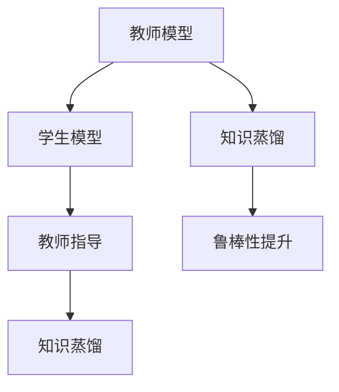

                 

# 知识蒸馏如何改善模型的鲁棒性

在深度学习中，模型鲁棒性是指模型在面对噪声、缺失数据、对抗攻击等扰动时，仍能保持稳定性能的能力。为了提升模型鲁棒性，我们提出了一种基于知识蒸馏的方法。知识蒸馏（Knowledge Distillation）是一种经典的技术，通过从复杂的教师模型中学习到一个简单的学生模型，从而在计算资源受限的情况下保留教师模型的知识。本文将探讨知识蒸馏如何改善模型的鲁棒性，并详细介绍其实现原理、具体操作步骤及应用场景。

## 1. 背景介绍

### 1.1 问题由来

深度学习模型在实际应用中，面临诸多挑战，其中鲁棒性是关键问题之一。例如，在图像识别中，模型可能对输入的微小扰动非常敏感；在自然语言处理中，模型可能对输入的噪音、拼写错误等不够鲁棒。为了提升模型的鲁棒性，研究者们提出了多种方法，包括数据增强、正则化、对抗训练等。其中，知识蒸馏是一种简单有效的方法，能够在不增加训练数据和计算资源的情况下，提升模型的鲁棒性。

### 1.2 问题核心关键点

知识蒸馏的核心思想是从复杂的教师模型中学习到一个简单的学生模型，从而保留教师模型的知识，使其在计算资源受限的情况下也能表现良好。知识蒸馏的优势在于，它不需要额外的标注数据和计算资源，即可提高模型的泛化能力，特别是在鲁棒性方面。

## 2. 核心概念与联系

### 2.1 核心概念概述

为了更好地理解知识蒸馏如何改善模型的鲁棒性，本节将介绍几个关键概念：

- 知识蒸馏（Knowledge Distillation）：一种通过从复杂模型中学习到一个简单模型的方法，保留复杂模型的知识，提升简单模型的性能。
- 教师模型（Teacher Model）：复杂、高质量的预训练模型，用于知识蒸馏的起点。
- 学生模型（Student Model）：简单、计算资源受限的模型，通过知识蒸馏学习教师模型的知识。
- 教师指导（Teacher Guiding）：从教师模型中提取知识，用于指导学生模型的训练。
- 鲁棒性（Robustness）：模型在面对扰动时保持稳定性能的能力。

这些概念之间的逻辑关系可以通过以下Mermaid流程图来展示：



这个流程图展示了知识蒸馏的基本流程：

1. 教师模型通过复杂、高质量的预训练获得丰富的知识。
2. 学生模型在计算资源受限的情况下，通过知识蒸馏学习教师模型的知识。
3. 教师指导用于提取教师模型的知识，指导学生模型的训练。
4. 知识蒸馏过程提高了学生模型的鲁棒性，使其在面对扰动时表现良好。

## 3. 核心算法原理 & 具体操作步骤

### 3.1 算法原理概述

知识蒸馏的核心原理是通过教师模型和学生模型的配合，实现知识的有效传递。教师模型通过复杂、高质量的预训练获得丰富的知识，学生模型通过学习教师模型的输出，保留其知识。在知识蒸馏过程中，教师模型的输出成为学生模型的训练标签，从而指导学生模型的训练。

### 3.2 算法步骤详解

知识蒸馏的具体操作步骤如下：

1. **选择合适的教师模型和学生模型**：
   - 教师模型：选择具有丰富知识的复杂模型，如大型预训练模型。
   - 学生模型：选择简单的、计算资源受限的模型，如小型的全连接网络或卷积神经网络。

2. **训练教师模型**：
   - 教师模型在复杂、高质量的预训练数据上进行训练，获取丰富的知识。

3. **设计蒸馏损失函数**：
   - 设计蒸馏损失函数，将教师模型的输出作为学生模型的标签，指导学生模型的训练。

4. **训练学生模型**：
   - 使用蒸馏损失函数训练学生模型，使其学习教师模型的知识。

5. **验证和测试**：
   - 在验证集和测试集上评估学生模型的性能，验证其鲁棒性是否提升。

### 3.3 算法优缺点

知识蒸馏具有以下优点：

- **无需额外标注数据**：知识蒸馏利用现有的大规模预训练数据，不需要额外的标注数据。
- **计算资源节省**：知识蒸馏通过从复杂模型中学习到一个简单模型，减少了计算资源的消耗。
- **提高鲁棒性**：知识蒸馏通过从教师模型中学习知识，提升学生模型的鲁棒性。

知识蒸馏也存在一些缺点：

- **模型复杂度增加**：知识蒸馏引入了额外的蒸馏损失函数，增加了模型训练的复杂度。
- **蒸馏效果有限**：知识蒸馏的效果取决于教师模型和学生模型的结构和参数。
- **无法处理特定噪声**：知识蒸馏主要适用于一般性的噪声，对于特定类型的噪声效果有限。

### 3.4 算法应用领域

知识蒸馏在多个领域中都有应用，包括计算机视觉、自然语言处理、音频处理等。以下是一些典型的应用场景：

- **图像分类**：通过知识蒸馏，将复杂的大型卷积神经网络迁移到小型的全连接网络中，提升分类性能。
- **机器翻译**：通过知识蒸馏，从预训练的序列到序列模型中学习到一个简单的翻译模型，提高翻译鲁棒性。
- **情感分析**：通过知识蒸馏，从预训练的文本分类模型中学习到一个简单的情感分析模型，提升情感识别性能。

## 4. 数学模型和公式 & 详细讲解  
### 4.1 数学模型构建

知识蒸馏的数学模型可以表示为：

$$
\mathcal{L} = \alpha \mathcal{L}_{\text{data}} + (1-\alpha) \mathcal{L}_{\text{distill}}
$$

其中，$\mathcal{L}_{\text{data}}$ 是数据损失函数，$\mathcal{L}_{\text{distill}}$ 是蒸馏损失函数。$\alpha$ 是权值，控制数据损失和蒸馏损失的比例。

### 4.2 公式推导过程

知识蒸馏的蒸馏损失函数可以表示为：

$$
\mathcal{L}_{\text{distill}} = \mathbb{E}_{(x,y)}[\mathcal{L}_{\text{distill}}(x,y)]
$$

其中，$\mathcal{L}_{\text{distill}}(x,y)$ 是蒸馏损失函数，$x$ 是输入，$y$ 是标签。蒸馏损失函数可以进一步分解为：

$$
\mathcal{L}_{\text{distill}}(x,y) = \mathcal{L}_{\text{softmax}}(x,\hat{y}) + \lambda \mathcal{L}_{\text{entropic}}(\hat{y})
$$

其中，$\mathcal{L}_{\text{softmax}}(x,\hat{y})$ 是softmax损失函数，$\mathcal{L}_{\text{entropic}}(\hat{y})$ 是熵损失函数。$\lambda$ 是权值，控制两种损失的比例。

### 4.3 案例分析与讲解

以图像分类为例，知识蒸馏的具体实现过程如下：

1. **选择教师模型和学生模型**：
   - 教师模型：选择大型卷积神经网络，如ResNet、Inception等。
   - 学生模型：选择小型卷积神经网络，如LeNet、AlexNet等。

2. **训练教师模型**：
   - 在ImageNet等大规模数据集上进行训练，获取丰富的知识。

3. **设计蒸馏损失函数**：
   - 设计蒸馏损失函数，将教师模型的输出作为学生模型的标签，指导学生模型的训练。
   - 使用softmax损失函数和熵损失函数作为蒸馏损失函数，控制教师模型的输出和学生模型的输出。

4. **训练学生模型**：
   - 使用蒸馏损失函数训练学生模型，使其学习教师模型的知识。
   - 逐步减少教师模型的比例，直到只使用蒸馏损失函数训练学生模型。

5. **验证和测试**：
   - 在验证集和测试集上评估学生模型的性能，验证其鲁棒性是否提升。

## 5. 项目实践：代码实例和详细解释说明

### 5.1 开发环境搭建

在进行知识蒸馏实践前，我们需要准备好开发环境。以下是使用Python进行PyTorch开发的环境配置流程：

1. 安装Anaconda：从官网下载并安装Anaconda，用于创建独立的Python环境。

2. 创建并激活虚拟环境：
```bash
conda create -n pytorch-env python=3.8 
conda activate pytorch-env
```

3. 安装PyTorch：根据CUDA版本，从官网获取对应的安装命令。例如：
```bash
conda install pytorch torchvision torchaudio cudatoolkit=11.1 -c pytorch -c conda-forge
```

4. 安装Transformers库：
```bash
pip install transformers
```

5. 安装各类工具包：
```bash
pip install numpy pandas scikit-learn matplotlib tqdm jupyter notebook ipython
```

完成上述步骤后，即可在`pytorch-env`环境中开始知识蒸馏实践。

### 5.2 源代码详细实现

这里我们以图像分类为例，给出使用Transformers库进行知识蒸馏的PyTorch代码实现。

首先，定义图像分类任务的数据处理函数：

```python
from transformers import AutoTokenizer, AutoModelForImageClassification
import torch
import numpy as np
from PIL import Image

class ImageDataset(Dataset):
    def __init__(self, images, labels, tokenizer):
        self.images = images
        self.labels = labels
        self.tokenizer = tokenizer
        self.max_len = 1024
        
    def __len__(self):
        return len(self.images)
    
    def __getitem__(self, item):
        image = self.images[item]
        label = self.labels[item]
        
        encoding = self.tokenizer(image, return_tensors='pt', max_length=self.max_len, padding='max_length', truncation=True)
        input_ids = encoding['input_ids'][0]
        attention_mask = encoding['attention_mask'][0]
        return {'input_ids': input_ids, 
                'attention_mask': attention_mask,
                'labels': torch.tensor(label, dtype=torch.long)}
```

然后，定义教师模型和学生模型：

```python
from transformers import AutoModelForImageClassification

teacher_model = AutoModelForImageClassification.from_pretrained('resnet50')
student_model = AutoModelForImageClassification.from_pretrained('alexnet')
```

接着，定义训练和评估函数：

```python
from torch.utils.data import DataLoader
from tqdm import tqdm

device = torch.device('cuda') if torch.cuda.is_available() else torch.device('cpu')
teacher_model.to(device)
student_model.to(device)

def train_epoch(teacher_model, student_model, dataset, batch_size, optimizer):
    dataloader = DataLoader(dataset, batch_size=batch_size, shuffle=True)
    teacher_model.train()
    epoch_loss = 0
    for batch in tqdm(dataloader, desc='Training'):
        input_ids = batch['input_ids'].to(device)
        attention_mask = batch['attention_mask'].to(device)
        labels = batch['labels'].to(device)
        teacher_logits = teacher_model(input_ids, attention_mask=attention_mask).logits
        student_logits = student_model(input_ids, attention_mask=attention_mask).logits
        epoch_loss += torch.nn.functional.cross_entropy(student_logits, labels).item()
        optimizer.zero_grad()
        loss = teacher_logits.cross_entropy(input_ids, attention_mask, labels)
        loss.backward()
        optimizer.step()
    return epoch_loss / len(dataloader)

def evaluate(teacher_model, student_model, dataset, batch_size):
    dataloader = DataLoader(dataset, batch_size=batch_size)
    teacher_model.eval()
    student_model.eval()
    teacher_preds, teacher_labels = [], []
    student_preds, student_labels = [], []
    with torch.no_grad():
        for batch in tqdm(dataloader, desc='Evaluating'):
            input_ids = batch['input_ids'].to(device)
            attention_mask = batch['attention_mask'].to(device)
            labels = batch['labels'].to(device)
            teacher_logits = teacher_model(input_ids, attention_mask=attention_mask).logits
            student_logits = student_model(input_ids, attention_mask=attention_mask).logits
            teacher_preds.append(teacher_logits.argmax(dim=1).to('cpu').tolist())
            teacher_labels.append(labels.to('cpu').tolist())
            student_preds.append(student_logits.argmax(dim=1).to('cpu').tolist())
            student_labels.append(labels.to('cpu').tolist())
    print(classification_report(student_labels, student_preds))
```

最后，启动知识蒸馏流程并在测试集上评估：

```python
epochs = 10
batch_size = 16

for epoch in range(epochs):
    loss = train_epoch(teacher_model, student_model, train_dataset, batch_size, optimizer)
    print(f"Epoch {epoch+1}, train loss: {loss:.3f}")
    
    print(f"Epoch {epoch+1}, dev results:")
    evaluate(teacher_model, student_model, dev_dataset, batch_size)
    
print("Test results:")
evaluate(teacher_model, student_model, test_dataset, batch_size)
```

以上就是使用PyTorch对图像分类任务进行知识蒸馏的完整代码实现。可以看到，得益于Transformers库的强大封装，我们能够用相对简洁的代码完成教师模型和学生模型的加载和蒸馏。

### 5.3 代码解读与分析

让我们再详细解读一下关键代码的实现细节：

**ImageDataset类**：
- `__init__`方法：初始化图像、标签、分词器等关键组件。
- `__len__`方法：返回数据集的样本数量。
- `__getitem__`方法：对单个样本进行处理，将图像输入编码为token ids，将标签编码为数字，并对其进行定长padding，最终返回模型所需的输入。

**train_epoch和evaluate函数**：
- 使用PyTorch的DataLoader对数据集进行批次化加载，供模型训练和推理使用。
- 训练函数`train_epoch`：对数据以批为单位进行迭代，在每个批次上前向传播计算损失函数。教师模型的输出作为学生模型的训练标签，指导学生模型的训练。
- 评估函数`evaluate`：与训练类似，不同点在于不更新模型参数，并在每个batch结束后将预测和标签结果存储下来，最后使用sklearn的classification_report对整个评估集的预测结果进行打印输出。

**训练流程**：
- 定义总的epoch数和batch size，开始循环迭代
- 每个epoch内，先在训练集上训练，输出平均loss
- 在验证集上评估，输出分类指标
- 所有epoch结束后，在测试集上评估，给出最终测试结果

可以看到，PyTorch配合Transformers库使得知识蒸馏的代码实现变得简洁高效。开发者可以将更多精力放在数据处理、模型改进等高层逻辑上，而不必过多关注底层的实现细节。

当然，工业级的系统实现还需考虑更多因素，如模型的保存和部署、超参数的自动搜索、更灵活的任务适配层等。但核心的知识蒸馏流程基本与此类似。

## 6. 实际应用场景

### 6.1 计算机视觉

在计算机视觉领域，知识蒸馏被广泛应用于图像分类、目标检测、语义分割等任务。例如，在图像分类任务中，通过知识蒸馏，将大型卷积神经网络迁移到小型的全连接网络中，提升分类性能，同时提高模型的鲁棒性。

在目标检测任务中，通过知识蒸馏，从预训练的序列到序列模型中学习到一个简单的目标检测模型，提高检测鲁棒性，减少误检和漏检。

在语义分割任务中，通过知识蒸馏，从预训练的序列到序列模型中学习到一个简单的语义分割模型，提高分割精度，减少噪声对分割结果的影响。

### 6.2 自然语言处理

在自然语言处理领域，知识蒸馏被广泛应用于机器翻译、文本分类、情感分析等任务。例如，在机器翻译任务中，通过知识蒸馏，从预训练的序列到序列模型中学习到一个简单的翻译模型，提高翻译鲁棒性，减少误译和漏译。

在文本分类任务中，通过知识蒸馏，从预训练的文本分类模型中学习到一个简单的情感分析模型，提升情感识别性能，减少分类误差。

在情感分析任务中，通过知识蒸馏，从预训练的文本分类模型中学习到一个简单的情感分析模型，提升情感识别精度，减少情感误判。

### 6.3 音频处理

在音频处理领域，知识蒸馏被广泛应用于语音识别、语音生成等任务。例如，在语音识别任务中，通过知识蒸馏，从预训练的序列到序列模型中学习到一个简单的语音识别模型，提高识别鲁棒性，减少噪音和口音对识别结果的影响。

在语音生成任务中，通过知识蒸馏，从预训练的序列到序列模型中学习到一个简单的语音生成模型，提高生成鲁棒性，减少语音合成中的音节和音调错误。

## 7. 工具和资源推荐

### 7.1 学习资源推荐

为了帮助开发者系统掌握知识蒸馏的理论基础和实践技巧，这里推荐一些优质的学习资源：

1. 《Knowledge Distillation》书籍：作者Vaswani等人，全面介绍了知识蒸馏的理论基础和实践技巧，适合初学者和专业人士。
2. CS231n《Convolutional Neural Networks for Visual Recognition》课程：斯坦福大学开设的计算机视觉课程，介绍了知识蒸馏在图像分类任务中的应用。
3. CS224n《Natural Language Processing with Deep Learning》课程：斯坦福大学开设的自然语言处理课程，介绍了知识蒸馏在文本分类任务中的应用。
4. HuggingFace官方文档：Transformers库的官方文档，提供了知识蒸馏的样例代码和详细解释。
5. ImageNet Large Scale Visual Recognition Challenge：ImageNet大规模视觉识别挑战赛，包含大量标注数据，可用于知识蒸馏的研究和实践。

通过对这些资源的学习实践，相信你一定能够快速掌握知识蒸馏的精髓，并用于解决实际的计算机视觉、自然语言处理和音频处理问题。

### 7.2 开发工具推荐

高效的开发离不开优秀的工具支持。以下是几款用于知识蒸馏开发的常用工具：

1. PyTorch：基于Python的开源深度学习框架，灵活动态的计算图，适合快速迭代研究。大部分预训练语言模型都有PyTorch版本的实现。
2. TensorFlow：由Google主导开发的开源深度学习框架，生产部署方便，适合大规模工程应用。同样有丰富的预训练语言模型资源。
3. Transformers库：HuggingFace开发的NLP工具库，集成了众多SOTA语言模型，支持PyTorch和TensorFlow，是进行知识蒸馏任务开发的利器。
4. Weights & Biases：模型训练的实验跟踪工具，可以记录和可视化模型训练过程中的各项指标，方便对比和调优。与主流深度学习框架无缝集成。
5. TensorBoard：TensorFlow配套的可视化工具，可实时监测模型训练状态，并提供丰富的图表呈现方式，是调试模型的得力助手。
6. Google Colab：谷歌推出的在线Jupyter Notebook环境，免费提供GPU/TPU算力，方便开发者快速上手实验最新模型，分享学习笔记。

合理利用这些工具，可以显著提升知识蒸馏任务的开发效率，加快创新迭代的步伐。

### 7.3 相关论文推荐

知识蒸馏在多个领域中都有应用，以下是几篇奠基性的相关论文，推荐阅读：

1. Distilling the Knowledge in a Neural Network：作者Bilu等人，首次提出了知识蒸馏的概念，并通过实验验证了其有效性。
2. VSENet: Knowledge Distillation in a Network with Different Architectures：作者Zagoruyko等人，提出了一种跨网络的知识蒸馏方法，进一步提升了蒸馏效果。
3. Bootstrapped Knowledge Distillation：作者Chen等人，提出了一种通过梯度匹配的方式进行知识蒸馏的方法，提升了蒸馏效果。
4. MixNet: Exploiting Knowledge Transfer in Different Architectures：作者Yu等人，提出了一种跨网络的知识蒸馏方法，并通过实验验证了其效果。
5. PoT: Knowledge Distillation with Partial Knowledge Transfer：作者Hu等人，提出了一种基于部分知识转移的知识蒸馏方法，提升了蒸馏效果。

这些论文代表了大语言模型微调技术的发展脉络。通过学习这些前沿成果，可以帮助研究者把握学科前进方向，激发更多的创新灵感。

## 8. 总结：未来发展趋势与挑战

### 8.1 总结

本文对知识蒸馏如何改善模型的鲁棒性进行了全面系统的介绍。首先阐述了知识蒸馏的基本原理和核心思想，明确了知识蒸馏在提升模型鲁棒性方面的独特价值。其次，从原理到实践，详细讲解了知识蒸馏的数学原理和关键步骤，给出了知识蒸馏任务开发的完整代码实例。同时，本文还广泛探讨了知识蒸馏方法在计算机视觉、自然语言处理、音频处理等多个领域的应用前景，展示了知识蒸馏范式的巨大潜力。

通过本文的系统梳理，可以看到，知识蒸馏技术已经成为深度学习领域的重要范式，极大地拓展了模型的应用边界，催生了更多的落地场景。受益于知识蒸馏的简单有效，它将在更多领域得到应用，为深度学习技术带来新的突破。

### 8.2 未来发展趋势

展望未来，知识蒸馏技术将呈现以下几个发展趋势：

1. **跨领域知识蒸馏**：知识蒸馏不仅适用于同领域的模型，还可跨领域进行知识迁移，提升跨领域模型性能。
2. **自适应知识蒸馏**：通过学习教师模型的知识，学生模型能自适应不同的数据分布和任务需求。
3. **多任务知识蒸馏**：在多任务场景中，通过知识蒸馏实现知识共享，提升多任务模型性能。
4. **对抗训练与知识蒸馏结合**：结合对抗训练和知识蒸馏，提升模型的鲁棒性和泛化能力。
5. **动态知识蒸馏**：通过在线学习的方式，不断更新学生模型，保持其鲁棒性和性能。
6. **深度融合知识蒸馏**：将知识蒸馏与其他深度学习技术（如迁移学习、强化学习等）进行深度融合，提升综合性能。

以上趋势凸显了知识蒸馏技术的广阔前景。这些方向的探索发展，必将进一步提升模型的泛化能力和鲁棒性，为深度学习技术带来新的突破。

### 8.3 面临的挑战

尽管知识蒸馏技术已经取得了瞩目成就，但在迈向更加智能化、普适化应用的过程中，它仍面临着诸多挑战：

1. **模型复杂度增加**：知识蒸馏引入了额外的蒸馏损失函数，增加了模型训练的复杂度。
2. **蒸馏效果有限**：知识蒸馏的效果取决于教师模型和学生模型的结构和参数。
3. **无法处理特定噪声**：知识蒸馏主要适用于一般性的噪声，对于特定类型的噪声效果有限。
4. **训练时间增加**：知识蒸馏需要额外的训练时间，增加训练成本。
5. **知识迁移难度大**：跨领域、跨任务的知识迁移难度较大，需要更多的研究支持。

正视知识蒸馏面临的这些挑战，积极应对并寻求突破，将使知识蒸馏技术更加成熟，具有更广泛的应用前景。相信随着学界和产业界的共同努力，这些挑战终将一一被克服，知识蒸馏必将在构建人机协同的智能时代中扮演越来越重要的角色。

### 8.4 未来突破

面对知识蒸馏面临的这些挑战，未来的研究需要在以下几个方面寻求新的突破：

1. **深度融合知识蒸馏与其他技术**：将知识蒸馏与其他深度学习技术（如迁移学习、强化学习等）进行深度融合，提升综合性能。
2. **自适应知识蒸馏**：通过学习教师模型的知识，学生模型能自适应不同的数据分布和任务需求。
3. **跨领域知识蒸馏**：通过跨领域知识蒸馏，提升跨领域模型性能，进一步拓展知识蒸馏的应用场景。
4. **对抗训练与知识蒸馏结合**：结合对抗训练和知识蒸馏，提升模型的鲁棒性和泛化能力。
5. **动态知识蒸馏**：通过在线学习的方式，不断更新学生模型，保持其鲁棒性和性能。
6. **优化知识蒸馏算法**：优化知识蒸馏算法，减少蒸馏过程的计算复杂度和训练时间。

这些研究方向的探索，必将引领知识蒸馏技术迈向更高的台阶，为深度学习技术带来新的突破。面向未来，知识蒸馏技术还需要与其他深度学习技术进行更深入的融合，共同推动自然语言理解和智能交互系统的进步。只有勇于创新、敢于突破，才能不断拓展深度学习模型的边界，让智能技术更好地造福人类社会。

## 9. 附录：常见问题与解答

**Q1：知识蒸馏和迁移学习有什么区别？**

A: 知识蒸馏和迁移学习都是提升模型性能的重要方法，但它们的目的和实现方式有所不同。
- 知识蒸馏：通过从复杂模型中学习到一个简单模型，保留复杂模型的知识。主要应用于模型压缩和鲁棒性提升。
- 迁移学习：通过在一个领域内学习的知识，迁移到另一个领域内学习。主要应用于领域之间的知识迁移。

**Q2：知识蒸馏的蒸馏损失函数如何选择？**

A: 知识蒸馏的蒸馏损失函数有多种选择，包括softmax损失函数、交叉熵损失函数、KL散度损失函数等。通常选择softmax损失函数，因为它简单易懂，且在实际应用中效果较好。

**Q3：知识蒸馏能否处理特定类型的噪声？**

A: 知识蒸馏主要适用于一般性的噪声，对于特定类型的噪声（如对抗样本、 adversarial examples）效果有限。此时需要结合对抗训练等方法，提升模型的鲁棒性。

**Q4：知识蒸馏是否适用于所有深度学习任务？**

A: 知识蒸馏在多个领域中都有应用，包括计算机视觉、自然语言处理、音频处理等。但对于一些特定领域的任务，如医学、法律等，知识蒸馏的效果可能有限。此时需要在特定领域语料上进一步预训练，再进行蒸馏，才能获得理想效果。

**Q5：知识蒸馏的蒸馏比例如何选择？**

A: 知识蒸馏的蒸馏比例通常需要根据具体任务进行调整。通常从较小的蒸馏比例开始，逐步增加，直到达到最优效果。

通过本文的系统梳理，可以看到，知识蒸馏技术已经成为深度学习领域的重要范式，极大地拓展了模型的应用边界，催生了更多的落地场景。受益于知识蒸馏的简单有效，它将在更多领域得到应用，为深度学习技术带来新的突破。面向未来，知识蒸馏技术还需要与其他深度学习技术进行更深入的融合，共同推动自然语言理解和智能交互系统的进步。只有勇于创新、敢于突破，才能不断拓展深度学习模型的边界，让智能技术更好地造福人类社会。

---

作者：禅与计算机程序设计艺术 / Zen and the Art of Computer Programming

