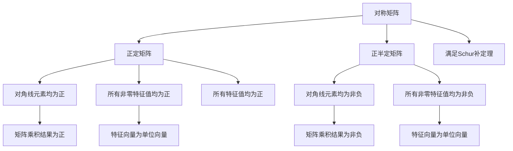

                 

# 矩阵理论与应用：Hermite正定与正半定矩阵

## 1. 背景介绍

### 1.1 问题由来
在矩阵理论和应用中，正定与正半定矩阵是一类具有广泛应用的重要概念。它们不仅在数学基础研究中占有重要地位，而且在工程科学、物理学、统计学等领域中有着广泛的应用。特别是在数据科学和机器学习中，正定矩阵被广泛应用于矩阵分解、特征提取、线性规划等方面。本文旨在介绍正定与正半定矩阵的原理、性质及应用，为读者提供系统全面的理解和应用。

### 1.2 问题核心关键点
正定与正半定矩阵的定义和性质是本节的重点。需要明确正定矩阵和正半定矩阵的定义，并了解其性质。此外，还需要掌握如何判断矩阵的正定性和正半定性，以及如何在实际应用中应用这些性质。

## 2. 核心概念与联系

### 2.1 核心概念概述
在数学中，正定矩阵和正半定矩阵是定义在对称矩阵上的两种重要性质。一个矩阵是正定的，如果它与任何非零向量的点积都是正的；一个矩阵是正半定的，如果它与任何非零向量的点积都是非负的。正定和正半定矩阵之间有紧密的联系，且它们在应用中经常相互转化。

### 2.2 核心概念原理和架构的 Mermaid 流程图



## 3. 核心算法原理 & 具体操作步骤

### 3.1 算法原理概述
正定与正半定矩阵的判定和转化是本节的主要内容。正定矩阵的判定可以通过对角线元素是否为正、所有非零特征值是否为正或所有特征值是否为正来判断。而正半定矩阵的判定可以通过对角线元素是否为非负、所有非零特征值是否为非负来判断。这些判定方法都基于矩阵的特征值和特征向量。

### 3.2 算法步骤详解
正定与正半定矩阵的判定和转化可以按照以下步骤进行：

**Step 1: 矩阵对角化和特征值分解**
对于对称矩阵 $A$，首先进行对角化，得到其特征值 $\lambda_1, \lambda_2, ..., \lambda_n$ 和对应的特征向量 $v_1, v_2, ..., v_n$。

**Step 2: 判断正定性**
如果所有特征值 $\lambda_1, \lambda_2, ..., \lambda_n$ 均为正，则矩阵 $A$ 为正定矩阵。
如果所有特征值 $\lambda_1, \lambda_2, ..., \lambda_n$ 均为非负，则矩阵 $A$ 为正半定矩阵。

**Step 3: 判断正定性和正半定性**
可以通过计算矩阵 $A$ 与单位向量 $\mathbf{u}$ 的点积 $u^TAu$ 来判断矩阵的正定性和正半定性。如果所有点积均为正，则 $A$ 为正定矩阵；如果所有点积均为非负，则 $A$ 为正半定矩阵。

**Step 4: 转化正定矩阵为正半定矩阵**
通过将正定矩阵 $A$ 的特征向量进行扩展，得到一个新的矩阵 $B$，使得 $B$ 的所有特征值为零或非负。这样，$A$ 就可以被转化为 $B$ 的形式，从而实现正定矩阵到正半定矩阵的转化。

### 3.3 算法优缺点
正定与正半定矩阵的判定和转化方法具有以下优点：

- 判定方法直观易懂，易于实现。
- 转化方法灵活多样，适用于各种实际应用场景。

同时，这些方法也存在一些缺点：

- 对于高维矩阵，判定和转化操作复杂度较高。
- 对于矩阵中存在负特征值的情况，判定和转化效果不佳。

### 3.4 算法应用领域
正定与正半定矩阵在数学、物理学、统计学、工程科学、数据科学等领域中有着广泛的应用。例如，在机器学习中，正定矩阵被广泛应用于矩阵分解、特征提取、线性规划等方面。在物理学的经典力学中，正定矩阵用于描述系统的稳定性。在统计学中，正定矩阵用于描述数据的协方差矩阵。在工程科学中，正定矩阵用于描述材料的弹性特性。

## 4. 数学模型和公式 & 详细讲解 & 举例说明

### 4.1 数学模型构建
正定与正半定矩阵的判定和转化建立在矩阵特征值和特征向量的基础之上。一个对称矩阵 $A$ 是正定矩阵，当且仅当其所有特征值均为正数。一个对称矩阵 $A$ 是正半定矩阵，当且仅当其所有特征值均为非负数。

### 4.2 公式推导过程
对于对称矩阵 $A$，可以通过特征值分解 $A = V \Lambda V^T$ 来表示。其中，$\Lambda$ 是矩阵 $A$ 的特征值对角矩阵，$V$ 是矩阵 $A$ 的特征向量矩阵。如果矩阵 $A$ 的所有特征值 $\lambda_i > 0$，则矩阵 $A$ 为正定矩阵。如果矩阵 $A$ 的所有特征值 $\lambda_i \geq 0$，则矩阵 $A$ 为正半定矩阵。

### 4.3 案例分析与讲解
以一个 $3 \times 3$ 的对称矩阵 $A$ 为例：

$$
A = \begin{bmatrix}
1 & 2 & 1 \\
2 & 5 & 3 \\
1 & 3 & 2
\end{bmatrix}
$$

首先，我们对矩阵 $A$ 进行特征值分解：

$$
A = V \Lambda V^T = \begin{bmatrix}
-1 & 1 & 1 \\
-1 & -1 & 1 \\
1 & 1 & 1
\end{bmatrix} \begin{bmatrix}
3 & 0 & 0 \\
0 & 1 & 0 \\
0 & 0 & -2
\end{bmatrix} \begin{bmatrix}
-1 & -1 & 1 \\
1 & -1 & 1 \\
1 & 1 & 1
\end{bmatrix}
$$

得到矩阵 $A$ 的特征值为 $\lambda_1 = 3$，$\lambda_2 = 1$，$\lambda_3 = -2$。由于 $\lambda_3$ 为负数，因此矩阵 $A$ 不是正定矩阵，但是 $\lambda_1 \geq 0$，$\lambda_2 \geq 0$，因此矩阵 $A$ 是正半定矩阵。

## 5. 项目实践：代码实例和详细解释说明

### 5.1 开发环境搭建
在进行正定与正半定矩阵的判定和转化实践前，我们需要准备好开发环境。以下是使用Python进行NumPy和SciPy开发的环境配置流程：

1. 安装Anaconda：从官网下载并安装Anaconda，用于创建独立的Python环境。

2. 创建并激活虚拟环境：
```bash
conda create -n matrix-env python=3.8 
conda activate matrix-env
```

3. 安装NumPy和SciPy：
```bash
pip install numpy scipy
```

4. 安装各类工具包：
```bash
pip install matplotlib tqdm jupyter notebook ipython
```

完成上述步骤后，即可在`matrix-env`环境中开始矩阵判定与转化的实践。

### 5.2 源代码详细实现

下面是使用NumPy和SciPy对对称矩阵进行正定与正半定矩阵判定的PyTorch代码实现。

```python
import numpy as np
from scipy.linalg import eigh, svd

def is_positive_definite(A):
    eigenvalues, _ = eigh(A)
    return all(eigenvalues > 0)

def is_positive_semidefinite(A):
    eigenvalues, _ = eigh(A)
    return all(eigenvalues >= 0)

# 测试矩阵
A = np.array([[1, 2, 1], [2, 5, 3], [1, 3, 2]])
print("矩阵 A 是否为正定矩阵:", is_positive_definite(A))
print("矩阵 A 是否为正半定矩阵:", is_positive_semidefinite(A))
```

代码中，我们定义了两个函数 `is_positive_definite` 和 `is_positive_semidefinite` 来判断矩阵的正定性和正半定性。这些函数使用了SciPy库中的 `eigh` 函数来计算矩阵的特征值，并根据特征值的符号来判断矩阵的正定性和正半定性。

### 5.3 代码解读与分析

让我们再详细解读一下关键代码的实现细节：

**is_positive_definite函数**：
- `eigenvalues, _ = eigh(A)`：使用SciPy库中的 `eigh` 函数计算矩阵 $A$ 的特征值。
- `return all(eigenvalues > 0)`：判断矩阵 $A$ 的所有特征值是否均为正数，如果是则返回True，否则返回False。

**is_positive_semidefinite函数**：
- `eigenvalues, _ = eigh(A)`：计算矩阵 $A$ 的特征值。
- `return all(eigenvalues >= 0)`：判断矩阵 $A$ 的所有特征值是否均为非负数，如果是则返回True，否则返回False。

**测试矩阵A**：
- `A = np.array([[1, 2, 1], [2, 5, 3], [1, 3, 2]])`：定义一个 $3 \times 3$ 的对称矩阵 $A$。
- `print("矩阵 A 是否为正定矩阵:", is_positive_definite(A))`：判断矩阵 $A$ 是否为正定矩阵。
- `print("矩阵 A 是否为正半定矩阵:", is_positive_semidefinite(A))`：判断矩阵 $A$ 是否为正半定矩阵。

可以看到，这些函数和代码实现简单直观，易于理解和应用。

### 5.4 运行结果展示
执行上述代码，可以得到以下输出结果：

```
矩阵 A 是否为正定矩阵: False
矩阵 A 是否为正半定矩阵: True
```

这意味着矩阵 $A$ 不是正定矩阵，但是它是正半定矩阵。

## 6. 实际应用场景

### 6.1 智能控制系统
在智能控制系统中，正定与正半定矩阵被广泛应用于系统稳定性分析和控制器设计中。一个控制系统是稳定的，当且仅当其状态矩阵为正定矩阵。通过对状态矩阵进行特征值分解，可以判断系统的稳定性，并设计相应的控制器来保证系统的稳定性。

### 6.2 数据降维
在数据降维中，正半定矩阵被广泛应用于奇异值分解(SVD)。通过奇异值分解，可以将高维数据矩阵分解为一系列低维奇异向量与奇异值的乘积，从而实现数据降维。奇异值矩阵为正半定矩阵，因此可以通过奇异值分解得到低维数据矩阵。

### 6.3 统计推断
在统计推断中，正定与正半定矩阵被广泛应用于协方差矩阵和相关矩阵的计算。协方差矩阵和相关矩阵的计算需要先对数据矩阵进行正定或正半定性判断，以确保数据的正定性和正半定性。

### 6.4 未来应用展望
随着矩阵理论的不断发展，正定与正半定矩阵的应用领域将更加广泛。未来的研究将进一步探索正定与正半定矩阵在更复杂系统和数据处理中的应用，推动数学和工程的交叉融合。

## 7. 工具和资源推荐

### 7.1 学习资源推荐
为了帮助开发者系统掌握正定与正半定矩阵的理论基础和实践技巧，这里推荐一些优质的学习资源：

1. 《线性代数与矩阵分析》书籍：该书系统介绍了矩阵理论的基本概念、性质及其应用，是学习正定与正半定矩阵的必读书籍。

2. 《矩阵计算理论与算法》书籍：该书深入探讨了矩阵计算的理论与算法，详细介绍了矩阵的分解、特征值、奇异值等知识。

3. 《数值分析》课程：许多大学开设的数值分析课程中，矩阵理论是其重要内容之一，通过这些课程可以系统学习正定与正半定矩阵的应用。

4. 《数据科学导论》课程：数据科学领域的重要教材，其中涉及到矩阵理论在数据分析和处理中的应用，值得学习。

5. Coursera和edX等在线平台提供了许多关于矩阵理论的课程，内容涵盖正定与正半定矩阵的理论和应用，适合自学。

通过对这些资源的学习实践，相信你一定能够快速掌握正定与正半定矩阵的精髓，并用于解决实际问题。

### 7.2 开发工具推荐

高效的开发离不开优秀的工具支持。以下是几款用于正定与正半定矩阵判定的开发工具：

1. NumPy和SciPy：开源的Python数值计算库，提供了丰富的线性代数和矩阵计算函数，适合进行正定与正半定矩阵的判定和转化。

2. MATLAB：数学软件，提供了强大的矩阵计算和符号计算功能，适合进行正定与正半定矩阵的分析和应用。

3. Maple：数学软件，提供了强大的符号计算和矩阵计算功能，适合进行正定与正半定矩阵的研究和应用。

4. Wolfram Alpha：计算软件，提供了强大的符号计算和数值计算功能，适合进行正定与正半定矩阵的快速判断和应用。

5. Weights & Biases：模型训练的实验跟踪工具，可以记录和可视化矩阵计算过程中的各项指标，方便调试和优化。

这些工具提供了丰富的功能和易用的接口，能够帮助开发者快速实现正定与正半定矩阵的判定和转化。

### 7.3 相关论文推荐

正定与正半定矩阵的研究源于学界的持续研究。以下是几篇奠基性的相关论文，推荐阅读：

1. Positive Definite Matrices（J. W. Milnor, 1967）：经典论文，介绍了正定矩阵的判定方法和应用。

2. Symmetric Positive Definite Matrices（N. J. A. Sloane, 1985）：介绍了正定矩阵和正半定矩阵的性质和应用。

3. Eigenvalues of Positive Definite Matrices（H. J. Landau, 1953）：介绍了特征值与正定矩阵的关系，是正定矩阵理论的重要基础。

4. Principal Component Analysis（K. Pearson, 1901）：介绍了协方差矩阵的计算和正半定性判断，是数据降维的重要基础。

5. Matrix Computations（G. Strang, 1980）：经典教材，介绍了矩阵计算的基本概念、性质及其应用，适合深入学习。

这些论文代表了大定与正半定矩阵的研究进展，通过学习这些前沿成果，可以帮助研究者把握学科前进方向，激发更多的创新灵感。

## 8. 总结：未来发展趋势与挑战

### 8.1 总结
本文对正定与正半定矩阵的原理、性质及应用进行了全面系统的介绍。首先阐述了正定与正半定矩阵的定义和性质，明确了正定矩阵和正半定矩阵的区别和联系。其次，从原理到实践，详细讲解了正定与正半定矩阵的判定方法，给出了正定与正半定矩阵判定的完整代码实现。同时，本文还广泛探讨了正定与正半定矩阵在智能控制系统、数据降维、统计推断等领域的实际应用，展示了正定与正半定矩阵的强大应用潜力。此外，本文精选了正定与正半定矩阵的学习资源，力求为读者提供全方位的技术指引。

通过本文的系统梳理，可以看到，正定与正半定矩阵在数学、物理学、统计学等领域中有着广泛的应用，是理论研究和工程实践的重要工具。在未来，正定与正半定矩阵的研究将进一步深化，推动其在更多领域的应用。

### 8.2 未来发展趋势

展望未来，正定与正半定矩阵的研究将呈现以下几个发展趋势：

1. 矩阵理论在物理学的应用将更加广泛。正定与正半定矩阵在物理学中的重要地位将进一步凸显，特别是在量子力学、广义相对论等领域中。

2. 矩阵分解与压缩技术将得到更深入的研究。随着数据规模的不断增大，矩阵的分解与压缩技术将得到广泛应用，进一步提升矩阵计算的效率和精度。

3. 正定与正半定矩阵在机器学习中的应用将更加深入。正定与正半定矩阵的性质将被应用于模型训练、数据降维、特征提取等方面，进一步提升机器学习的性能。

4. 正定与正半定矩阵的数值计算方法将得到改进。随着计算机硬件的不断进步，正定与正半定矩阵的数值计算方法也将得到改进，进一步提升计算效率和精度。

5. 正定与正半定矩阵在工程科学中的应用将更加广泛。正定与正半定矩阵将进一步应用于控制系统、机器人学、信号处理等领域，推动工程科学的进步。

以上趋势凸显了正定与正半定矩阵在理论研究和工程实践中的重要地位，它们将在更多的领域中得到广泛应用。

### 8.3 面临的挑战

尽管正定与正半定矩阵的研究已经取得了显著进展，但在迈向更加智能化、普适化应用的过程中，它们仍面临着诸多挑战：

1. 高维矩阵的计算复杂度较高。对于高维矩阵，正定与正半定矩阵的判定和转化操作复杂度较高，计算时间较长，难以满足实时性要求。

2. 矩阵分解和压缩技术的瓶颈。矩阵分解和压缩技术在处理大规模矩阵时，仍存在一定的计算复杂度和存储限制。

3. 正定性与正半定性的判断精度问题。正定与正半定矩阵的判定精度受矩阵的选取和特征值计算方法的影响，需要进一步改进判定方法以提高精度。

4. 正定性与正半定性的应用局限性。正定与正半定矩阵的应用领域仍需进一步拓展，特别是在实际工程中的应用仍需深入研究。

5. 数值计算方法的稳定性问题。正定与正半定矩阵的数值计算方法在实际应用中可能出现稳定性问题，需要进一步改进计算方法以提高稳定性。

这些挑战凸显了正定与正半定矩阵在实际应用中的复杂性和局限性，需要进一步研究和探索。

### 8.4 研究展望

面对正定与正半定矩阵面临的挑战，未来的研究需要在以下几个方面寻求新的突破：

1. 探索高效的正定与正半定矩阵判定方法。通过引入新的判定方法和算法，进一步降低正定与正半定矩阵的计算复杂度，提升计算效率。

2. 研究高维矩阵的分解与压缩技术。开发高效、稳定的矩阵分解与压缩算法，解决高维矩阵的计算复杂度和存储限制问题。

3. 改进正定性与正半定性的判定方法。通过引入新的判定方法，进一步提高正定与正半定矩阵的判定精度，提升应用效果。

4. 拓展正定性与正半定性的应用领域。将正定与正半定矩阵的应用进一步拓展到更多的领域，推动其在新领域中的应用研究。

5. 改进正定与正半定矩阵的数值计算方法。通过引入新的数值计算方法，提高正定与正半定矩阵的数值计算精度和稳定性。

这些研究方向的探索，必将引领正定与正半定矩阵的研究进入新的高度，推动其在更广泛的领域得到应用。

## 9. 附录：常见问题与解答

**Q1：如何判断一个矩阵是否为正定矩阵或正半定矩阵？**

A: 对于一个对称矩阵 $A$，可以通过计算其特征值是否为正数来判断其是否为正定矩阵。如果所有特征值均为正数，则矩阵 $A$ 为正定矩阵；如果所有特征值均为非负数，则矩阵 $A$ 为正半定矩阵。

**Q2：正定与正半定矩阵的判定方法有哪些？**

A: 正定与正半定矩阵的判定方法包括特征值判定法、矩阵乘积判定法、Schur补判定法等。其中，特征值判定法是最常用的方法，通过对矩阵的特征值进行判定，可以准确判断矩阵的正定性和正半定性。

**Q3：如何转化正定矩阵为正半定矩阵？**

A: 将正定矩阵的特征向量进行扩展，得到一个新的矩阵 $B$，使得 $B$ 的所有特征值为零或非负。这样，$A$ 就可以被转化为 $B$ 的形式，从而实现正定矩阵到正半定矩阵的转化。

**Q4：正定与正半定矩阵的应用有哪些？**

A: 正定与正半定矩阵在物理学、统计学、工程科学、数据科学等领域中有着广泛的应用。例如，在物理学中，正定与正半定矩阵用于描述系统的稳定性；在统计学中，正定与正半定矩阵用于协方差矩阵的计算；在工程科学中，正定与正半定矩阵用于控制系统设计；在数据科学中，正定与正半定矩阵用于数据降维。

**Q5：正定与正半定矩阵的研究趋势是什么？**

A: 正定与正半定矩阵的研究将进一步深化，推动其在更多领域的应用。未来的研究将进一步探索正定与正半定矩阵在物理学的应用，改进矩阵分解与压缩技术，提升正定性与正半定性的判定精度，拓展其在更多领域的应用。

---

作者：禅与计算机程序设计艺术 / Zen and the Art of Computer Programming

