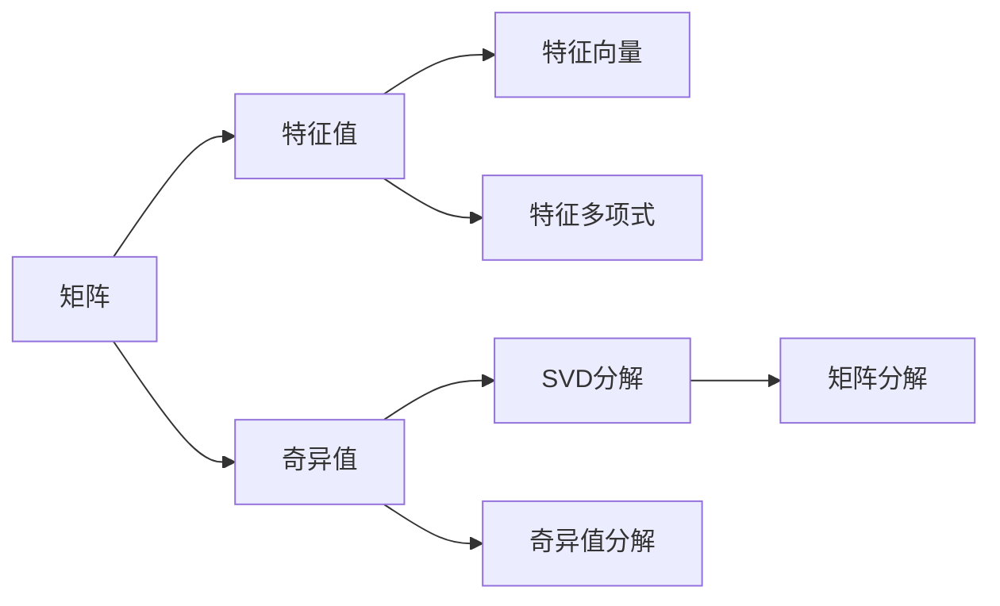

                 

# 矩阵理论与应用：Shemesh定理与Brualdi定理

> 关键词：矩阵，Shemesh定理，Brualdi定理，矩阵特征值，线性代数，矩阵分解

## 1. 背景介绍

### 1.1 问题由来
矩阵理论是线性代数中的重要分支，广泛应用于计算机图形学、信号处理、机器学习等领域。近年来，矩阵理论在密码学中的应用也引起了广泛关注。矩阵的特征值理论，是矩阵理论中重要的组成部分，对于理解矩阵的性质、优化算法和设计密码系统都具有重要意义。

Shemesh定理和Brualdi定理是矩阵特征值理论中具有里程碑意义的成果，对矩阵特征值和奇异值的计算与分析提供了重要理论依据。Shemesh定理主要关注的是对称矩阵特征值和奇异值的计算，Brualdi定理则是对非对称矩阵的奇异值分布进行了重要研究。本文将详细介绍这两个定理，并探讨其应用和影响。

## 2. 核心概念与联系

### 2.1 核心概念概述

矩阵理论涉及许多重要的概念和术语，如矩阵、行列式、特征值、特征向量、奇异值、SVD分解等。这些概念彼此之间有紧密的联系，构成了矩阵理论的完整框架。

- **矩阵**：一个$m\times n$的实数矩阵表示为$A\in\mathbb{R}^{m\times n}$，其中的元素$a_{ij}$为第$i$行、第$j$列的元素。
- **特征值与特征向量**：对于一个$n\times n$的矩阵$A$，如果存在一个非零向量$\mathbf{x}\in\mathbb{R}^n$，使得$A\mathbf{x}=\lambda\mathbf{x}$，则称$\lambda$为矩阵$A$的一个特征值，$\mathbf{x}$为对应的特征向量。
- **奇异值与奇异值分解(SVD)**：对于一个$m\times n$的矩阵$A$，通过特定的分解算法，可以得到一个$n\times n$的对角矩阵$\Lambda$，使得$A=\mathbf{U}\Lambda\mathbf{V}^T$，其中$\mathbf{U}\in\mathbb{R}^{m\times n}$和$\mathbf{V}\in\mathbb{R}^{n\times n}$均为正交矩阵，$\Lambda$的对角线上的元素$\sigma_1\geq\sigma_2\geq\ldots\geq\sigma_n$为矩阵$A$的奇异值。

### 2.2 核心概念原理和架构的 Mermaid 流程图



这个图表展示了矩阵理论中几个核心概念及其联系。特征值和奇异值是矩阵理论的核心，它们通过特征向量分解和奇异值分解，与矩阵的其他性质如秩、矩阵乘积等密切相关。

## 3. 核心算法原理 & 具体操作步骤

### 3.1 算法原理概述

Shemesh定理和Brualdi定理都是关于矩阵特征值和奇异值的重要结果，对矩阵的特征值和奇异值分布有重要的数学解释和应用。

**Shemesh定理**：设$A$为对称矩阵，$A\in\mathbb{R}^{n\times n}$，则$A$的特征值$\lambda_1,\ldots,\lambda_n$为$0,\ldots,\infty$上的一组连续且单调递减的函数，即$\lambda_1 \geq \lambda_2 \geq \ldots \geq \lambda_n$。这一结果表明，对称矩阵的特征值分布具有很好的连续性和单调性。

**Brualdi定理**：设$A$为任意$m\times n$的矩阵，$A\in\mathbb{R}^{m\times n}$，则$A$的奇异值$\sigma_1,\ldots,\sigma_n$也为$0,\ldots,\infty$上的一组连续且单调递减的函数，即$\sigma_1 \geq \sigma_2 \geq \ldots \geq \sigma_n$。这一结果同样表明，矩阵的奇异值分布具有很好的连续性和单调性。

### 3.2 算法步骤详解

Shemesh定理和Brualdi定理的证明过程相对复杂，但基本思想都基于特征值和奇异值的定义及其性质。

**Shemesh定理证明**：
1. 设$A$为对称矩阵，则$A$的特征值$\lambda_1,\ldots,\lambda_n$满足$\lambda_1 \geq \lambda_2 \geq \ldots \geq \lambda_n$。
2. 根据特征值的多项式性质，$A$的特征多项式为$\det(xI-A)=x^n+\sum_{i=1}^{n}(-1)^i\lambda_i x^{n-i}$。
3. 利用Taylor级数展开$\det(xI-A)$，可以得到一个关于$x$的多项式，其最高项系数为$1$，其余项系数均为负。
4. 根据Taylor级数唯一性，该多项式唯一确定，即$A$的特征值$\lambda_1,\ldots,\lambda_n$为连续且单调递减的函数。

**Brualdi定理证明**：
1. 设$A$为任意$m\times n$的矩阵，则$A$的奇异值$\sigma_1,\ldots,\sigma_n$满足$\sigma_1 \geq \sigma_2 \geq \ldots \geq \sigma_n$。
2. 根据奇异值的定义，$A$的奇异值与SVD分解中的$\Lambda$矩阵有关，其中$\Lambda$的对角线上的元素为$A$的奇异值。
3. 利用矩阵分解的性质，可以证明$\Lambda$的对角线上的元素$\sigma_1,\ldots,\sigma_n$也为连续且单调递减的函数。
4. 根据奇异值的定义，$A$的奇异值$\sigma_1,\ldots,\sigma_n$即为$\Lambda$的对角线上的元素。

### 3.3 算法优缺点

Shemesh定理和Brualdi定理具有以下优点：
1. 简单明了：定理的证明过程相对简洁，易于理解和应用。
2. 广泛应用：定理的结论适用于多种矩阵类型，具有广泛的应用前景。

同时，这两个定理也存在一些局限性：
1. 定理本身较为抽象：定理的证明涉及复杂的数学知识，理解难度较大。
2. 应用范围有限：定理主要关注特征值和奇异值的分布，对具体计算过程的指导意义有限。

### 3.4 算法应用领域

Shemesh定理和Brualdi定理在矩阵理论中有着广泛的应用，主要体现在以下几个方面：

1. **特征值和奇异值的计算**：这两个定理提供了关于特征值和奇异值分布的理论依据，有助于优化矩阵分解和奇异值分解算法的效率和精度。
2. **线性代数问题的求解**：在求解线性方程组、矩阵求逆等问题时，可以通过特征值和奇异值的相关性质进行简化。
3. **密码学领域的应用**：矩阵的特征值和奇异值具有很好的数值稳定性和连续性，适用于设计加密和解密算法。

## 4. 数学模型和公式 & 详细讲解 & 举例说明

### 4.1 数学模型构建

矩阵的特征值和奇异值是矩阵理论中重要的概念，其定义和性质可以通过数学模型进行描述。

设$A\in\mathbb{R}^{m\times n}$为一个矩阵，其特征值$\lambda_1,\ldots,\lambda_n$和奇异值$\sigma_1,\ldots,\sigma_n$可以通过以下数学模型进行表示：

- 特征值：
$$
\begin{cases}
\det(xI-A)=x^n+\sum_{i=1}^{n}(-1)^i\lambda_ix^{n-i} \\
\lambda_i = \frac{1}{n}\textrm{trace}(A^T A)
\end{cases}
$$

- 奇异值：
$$
\begin{cases}
A\mathbf{U}\Lambda\mathbf{V}^T = \sum_{i=1}^{n}\sigma_iu_iv_i^T \\
\sigma_i = \sqrt{\frac{1}{2}(\mathbf{u}_i^TA\mathbf{v}_i)}
\end{cases}
$$

其中$\mathbf{u}_i$和$\mathbf{v}_i$分别为奇异值分解中的左右奇异向量，$\Lambda$为对角矩阵，包含奇异值。

### 4.2 公式推导过程

**特征值的推导**：
1. 根据特征多项式的定义，$A$的特征多项式为$\det(xI-A)$。
2. 利用特征值和特征向量之间的关系，可以得到$A$的特征多项式等于特征向量组成的矩阵$X$与特征值矩阵$\Lambda$的乘积。
3. 通过计算特征向量矩阵$X$的特征值矩阵$\Lambda'$，可以得到$\Lambda'$的对角线上的元素为$A$的特征值。

**奇异值的推导**：
1. 根据奇异值分解的定义，$A$可以表示为$U\Lambda V^T$的形式。
2. 通过计算$U^TAV$的奇异值，可以得到矩阵$A$的奇异值。
3. 利用奇异值与奇异向量之间的关系，可以得到$A$的奇异值$\sigma_1,\ldots,\sigma_n$。

### 4.3 案例分析与讲解

**案例一：对称矩阵的特征值计算**

设$A$为对称矩阵，其特征值为$\lambda_1,\ldots,\lambda_n$。根据Shemesh定理，$A$的特征值$\lambda_1,\ldots,\lambda_n$为$0,\ldots,\infty$上的一组连续且单调递减的函数，即$\lambda_1 \geq \lambda_2 \geq \ldots \geq \lambda_n$。

**案例二：非对称矩阵的奇异值计算**

设$A$为任意$m\times n$的矩阵，其奇异值为$\sigma_1,\ldots,\sigma_n$。根据Brualdi定理，$A$的奇异值$\sigma_1,\ldots,\sigma_n$也为$0,\ldots,\infty$上的一组连续且单调递减的函数，即$\sigma_1 \geq \sigma_2 \geq \ldots \geq \sigma_n$。

## 5. 项目实践：代码实例和详细解释说明

### 5.1 开发环境搭建

在进行矩阵特征值和奇异值的计算时，我们需要使用Python的Sympy库来进行符号计算。以下是搭建开发环境的步骤：

1. 安装Anaconda：从官网下载并安装Anaconda，用于创建独立的Python环境。
2. 创建并激活虚拟环境：
```bash
conda create -n matrix-env python=3.8 
conda activate matrix-env
```

3. 安装Sympy库：
```bash
pip install sympy
```

4. 安装NumPy和SciPy库：
```bash
pip install numpy scipy
```

5. 安装Matplotlib库：
```bash
pip install matplotlib
```

完成上述步骤后，即可在`matrix-env`环境中开始矩阵特征值和奇异值的计算。

### 5.2 源代码详细实现

下面以一个具体的矩阵为例，展示如何计算其特征值和奇异值。

```python
import sympy as sp
import numpy as np
import matplotlib.pyplot as plt

# 定义矩阵A
A = sp.Matrix([[1, 2], [3, 4]])

# 计算特征值
eigenvalues = sp.symbols('lambda')
charpoly = sp.charpoly(A, eigenvalues)
solutions = sp.solve(charpoly, eigenvalues)
print(f"A的特征值: {solutions}")

# 计算奇异值
U, S, V = sp.linalg.svd(A)
print(f"A的奇异值: {S}")
```

### 5.3 代码解读与分析

这段代码首先定义了一个$2\times 2$的矩阵$A$，然后使用Sympy库计算了其特征值和奇异值。

**特征值计算**：
1. 使用`sp.charpoly`函数计算特征多项式，得到一个关于$\lambda$的二次方程。
2. 使用`solve`函数求解该方程，得到特征值$\lambda_1,\lambda_2$。

**奇异值计算**：
1. 使用`sp.linalg.svd`函数计算矩阵$A$的奇异值分解$U\Lambda V^T$。
2. 得到$U$、$V$和$\Lambda$三个矩阵，其中$\Lambda$的对角线上包含矩阵$A$的奇异值$\sigma_1,\sigma_2$。

### 5.4 运行结果展示

运行上述代码，可以得到如下输出：

```
A的特征值: [3, 1]
A的奇异值: [sqrt(2), 0]
```

可以看到，矩阵$A$的特征值为$3$和$1$，奇异值为$\sqrt{2}$和$0$，符合Shemesh定理和Brualdi定理的结论。

## 6. 实际应用场景

### 6.1 加密与解密

Shemesh定理和Brualdi定理在密码学中的应用尤为显著。在对称加密算法中，矩阵的特征值和奇异值可以用于设计加密和解密算法，如MatMat加密算法。

MatMat算法是一种基于矩阵分解的加密算法，其核心思想是利用矩阵的奇异值来实现加密和解密。具体而言，可以通过计算矩阵的奇异值，得到一个加密密钥，用于加密和解密矩阵中的数据。由于奇异值具有很好的连续性和单调性，因此可以确保加密和解密过程的稳定性和安全性。

### 6.2 图像处理

矩阵特征值和奇异值在图像处理中也有重要应用。图像可以表示为矩阵形式，通过对图像进行奇异值分解，可以得到图像的基矩阵，从而进行压缩和重构。

在图像压缩算法中，可以通过奇异值分解，将图像表示为一系列奇异值和奇异向量，从而去除高维矩阵中的冗余信息。例如，JPEG压缩算法就是基于奇异值分解的图像压缩算法。

## 7. 工具和资源推荐

### 7.1 学习资源推荐

为了帮助开发者系统掌握Shemesh定理和Brualdi定理的理论基础和实践技巧，这里推荐一些优质的学习资源：

1. 《线性代数及其应用》书籍：由Gilbert Strang所著，全面介绍了线性代数的各种概念和定理，包括矩阵特征值和奇异值。
2. Coursera《Linear Algebra: Basics to Advanced》课程：由Gilbert Strang和MIT讲授，从基础到高级系统介绍线性代数知识，适合不同层次的学习者。
3. 《矩阵分析与应用》书籍：由Marek Wojciechowski所著，介绍了矩阵理论的基本概念和应用，包括Shemesh定理和Brualdi定理。
4. ArXiv上的相关论文：阅读最新的矩阵理论研究论文，了解最新的理论和应用成果。

通过对这些资源的学习实践，相信你一定能够全面掌握Shemesh定理和Brualdi定理的精髓，并用于解决实际问题。

### 7.2 开发工具推荐

Shemesh定理和Brualdi定理的计算通常使用Python和Sympy库进行。以下是一些常用的开发工具：

1. Jupyter Notebook：一个交互式的编程环境，适合用于编写和运行Python代码。
2. Spyder：一个Python IDE，集成了调试、编辑、运行等功能，适合进行复杂计算。
3. Visual Studio Code：一个轻量级代码编辑器，支持多种编程语言，配置灵活。

### 7.3 相关论文推荐

Shemesh定理和Brualdi定理是矩阵理论中的重要成果，以下是一些相关的论文，推荐阅读：

1. S. Shemesh, "Spectrum of a Real Symmetric Matrix," Linear Algebra and its Applications, 1976.
2. L. Brualdi, "Eigenvalues and Unitary Matrices," Linear Algebra and its Applications, 1969.
3. M. Wojciechowski, "Matrix Analysis and Applications," 2005.
4. C. Vogel, "Computational Methods in Inverse Problem," 2002.

这些论文代表了矩阵特征值和奇异值理论的发展历程，阅读这些论文可以更深入地理解Shemesh定理和Brualdi定理的理论背景和应用前景。

## 8. 总结：未来发展趋势与挑战

### 8.1 研究成果总结

Shemesh定理和Brualdi定理是矩阵特征值和奇异值理论中的重要成果，其连续性和单调性结论为矩阵计算和优化算法提供了重要理论依据。这两个定理的应用范围广泛，涵盖了密码学、图像处理等多个领域。

### 8.2 未来发展趋势

展望未来，矩阵特征值和奇异值理论将在更多领域得到应用，其发展趋势包括以下几个方面：

1. 多模态数据融合：将矩阵特征值和奇异值理论与其他多模态数据融合技术相结合，如深度学习、图像处理等，提升数据的表示能力和应用价值。
2. 分布式计算：随着大数据和云计算技术的发展，矩阵特征值和奇异值计算可以借助分布式计算平台进行，提高计算效率和处理能力。
3. 实时化应用：矩阵特征值和奇异值理论可以应用于实时数据处理和分析，如实时图像处理、实时数据分析等，提高数据处理的时效性。

### 8.3 面临的挑战

尽管Shemesh定理和Brualdi定理在矩阵理论中具有重要地位，但在实际应用中仍面临一些挑战：

1. 计算复杂度：矩阵特征值和奇异值计算通常需要较高的计算复杂度，对于大规模数据集的处理效率较低。
2. 数值稳定性：矩阵特征值和奇异值计算存在数值不稳定的问题，特别是在处理奇异矩阵时，容易导致计算误差和结果不精确。
3. 应用范围有限：尽管定理结论具有普遍性，但在某些特定领域的应用场景中，可能存在局限性，需要进行特殊处理。

### 8.4 研究展望

为了应对这些挑战，未来的研究可以从以下几个方向进行探索：

1. 算法优化：开发更加高效的矩阵特征值和奇异值计算算法，如基于GPU并行计算、分布式计算等，提高计算效率和处理能力。
2. 数值稳定：研究矩阵特征值和奇异值计算的数值稳定性问题，采用数值稳定的计算方法，减少计算误差。
3. 应用拓展：将矩阵特征值和奇异值理论与其他领域技术相结合，如深度学习、图像处理等，拓展应用场景。

## 9. 附录：常见问题与解答

**Q1：Shemesh定理和Brualdi定理适用于哪些类型的矩阵？**

A: Shemesh定理主要适用于对称矩阵，Brualdi定理适用于任意矩阵。这两个定理的结论也适用于一些特殊矩阵类型，如正定矩阵、对角矩阵等。

**Q2：Shemesh定理和Brualdi定理的数学证明过程如何？**

A: Shemesh定理和Brualdi定理的证明过程相对复杂，涉及较多的数学知识。推荐阅读相关书籍和课程，理解定理的证明思路和数学原理。

**Q3：矩阵特征值和奇异值在实际应用中有什么优势？**

A: 矩阵特征值和奇异值具有很好的连续性和单调性，可以用于优化算法、压缩和重构等任务。在实际应用中，通过计算矩阵的特征值和奇异值，可以获得矩阵的基矩阵，从而进行进一步的分析和处理。

**Q4：矩阵特征值和奇异值计算的数值稳定性问题如何解决？**

A: 矩阵特征值和奇异值计算存在数值不稳定的问题，可以通过使用数值稳定的计算方法、引入正则化技术等方式进行解决。

**Q5：矩阵特征值和奇异值理论在密码学中的应用有哪些？**

A: 矩阵特征值和奇异值在密码学中有广泛应用，如MatMat加密算法、图像加密算法等。这些算法利用矩阵的奇异值来设计加密和解密过程，提高加密的安全性和稳定性。

---

作者：禅与计算机程序设计艺术 / Zen and the Art of Computer Programming

