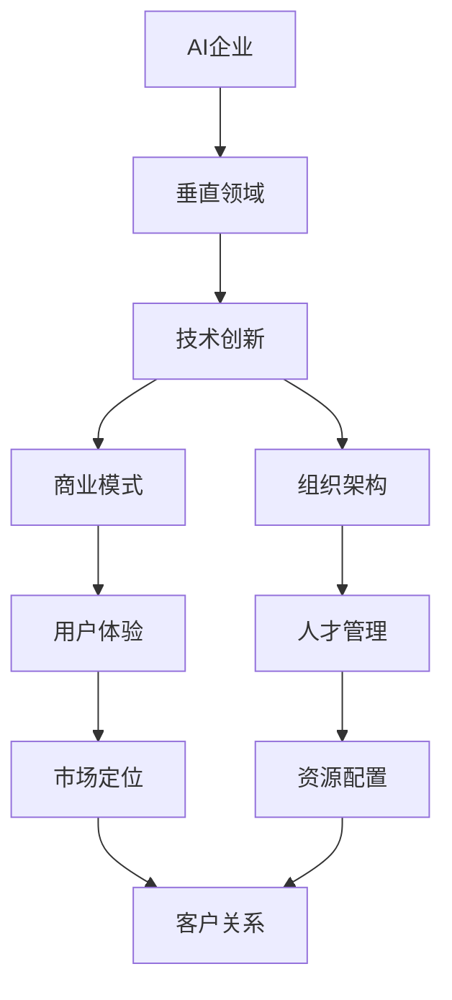

                 

# 硅谷多元化发展：AI企业创新探索垂直领域独特价值

> 关键词：
    - 硅谷，AI企业，垂直领域，创新探索，独特价值

## 1. 背景介绍

### 1.1 问题由来
随着人工智能技术的迅猛发展，硅谷涌现出了大批以AI为核心驱动力的科技企业。这些企业在各自垂直领域内的应用探索，展示了AI技术的无限潜力和多样性。从无人驾驶、医疗诊断到金融预测，AI技术正在逐步成为推动各行各业变革的重要力量。然而，面对垂直领域复杂多变的业务需求，如何在确保AI技术普适性的同时，探索其独特价值，成为摆在硅谷AI企业面前的重要课题。

### 1.2 问题核心关键点
为了回答这一问题，本文将系统梳理硅谷AI企业在垂直领域的应用实践和创新探索，分析其在技术、商业模式、组织架构等方面所展现出的独特价值，以及面临的挑战和未来发展趋势。这不仅有助于AI企业深入理解自身定位，也为其他技术行业提供了借鉴。

## 2. 核心概念与联系

### 2.1 核心概念概述

要全面理解硅谷AI企业在垂直领域的独特价值，首先需要明确几个核心概念：

- **AI企业**：指以人工智能技术为核心的创新型企业，其业务主要依赖于人工智能算法和模型。
- **垂直领域**：指企业在特定行业或领域内的具体应用场景，如医疗、金融、教育等。
- **独特价值**：指AI企业在垂直领域探索中，所展示出的无法通过传统方式实现的优势和创新。

这些概念共同构成了硅谷AI企业在垂直领域创新探索的基础框架。

### 2.2 核心概念原理和架构的 Mermaid 流程图



这个流程图展示了AI企业如何在垂直领域进行技术、商业和组织创新，最终构建独特的用户体验和市场定位。其中，技术创新是基础，商业模式和组织架构的优化是保障，用户体验和市场定位是最终目标。

## 3. 核心算法原理 & 具体操作步骤

### 3.1 算法原理概述

硅谷AI企业在垂直领域的应用探索，很大程度上依赖于先进算法和模型。以下将介绍几种核心算法及其原理：

1. **深度学习**：通过构建多层神经网络，实现复杂非线性映射，适合处理高维数据。
2. **强化学习**：通过试错机制，最大化期望回报，适合优化决策过程。
3. **迁移学习**：通过在多个相关任务间共享知识，减少新任务训练数据需求。
4. **对抗学习**：通过引入对抗样本，提升模型鲁棒性和泛化能力。
5. **元学习**：通过学习学习过程，加速新任务的适应和泛化。

这些算法通过灵活组合，可以适应垂直领域复杂多变的业务需求。

### 3.2 算法步骤详解

硅谷AI企业在进行垂直领域应用探索时，通常遵循以下步骤：

1. **需求分析**：与客户沟通，明确具体业务需求和目标。
2. **模型选择**：根据需求，选择合适的深度学习、强化学习、迁移学习等算法。
3. **数据准备**：收集、清洗和标注数据，构建模型训练集和验证集。
4. **模型训练**：使用GPU/TPU等高性能设备进行模型训练，优化超参数。
5. **模型评估**：在验证集上评估模型性能，迭代优化模型。
6. **部署上线**：将模型部署到实际业务系统中，进行A/B测试和性能监控。
7. **持续优化**：根据业务反馈，不断调整模型和算法。

### 3.3 算法优缺点

#### 优点：

- **高效精准**：深度学习等算法可以处理大量复杂数据，实现精准的业务预测和决策。
- **适应性强**：迁移学习等技术可以通过共享知识，适应不同领域的多样化需求。
- **自适应能力强**：强化学习等技术可以不断优化决策过程，适应不断变化的业务环境。

#### 缺点：

- **计算资源消耗大**：深度学习等算法需要大量计算资源，初期投入较高。
- **模型解释性差**：复杂模型缺乏可解释性，难以进行业务逻辑的调试和优化。
- **数据依赖性强**：模型性能依赖于数据质量，数据获取和标注成本较高。

### 3.4 算法应用领域

硅谷AI企业在垂直领域的应用已经覆盖了多个行业，如医疗、金融、自动驾驶等。以下是几种典型应用场景的详细分析：

#### 医疗领域

在医疗领域，AI企业通过深度学习、自然语言处理等技术，构建了智能诊断、病历分析、药物研发等应用。例如，DeepMind的AlphaGoZero通过强化学习，在围棋等复杂游戏中取得了突破性成果。IBM Watson利用自然语言处理技术，辅助医生进行病历分析和诊断。

#### 金融领域

金融领域是AI应用的重要场景。AI企业通过深度学习、强化学习等技术，开发了风险评估、信用评分、投资预测等应用。例如，Goldman Sachs利用深度学习模型，实现了实时市场预测和风险管理。Facebook在金融领域推出了基于AI的动态定价系统。

#### 自动驾驶

自动驾驶是AI技术的另一重要应用场景。AI企业通过深度学习、强化学习等技术，实现了车辆行为预测、路径规划、驾驶决策等功能。例如，Waymo利用深度学习和强化学习技术，构建了自动驾驶汽车。特斯拉的Autopilot系统通过感知、决策和控制等技术，提升了驾驶安全性和舒适性。

## 4. 数学模型和公式 & 详细讲解 & 举例说明

### 4.1 数学模型构建

以医疗领域的智能诊断为例，其数学模型构建主要包括以下几个步骤：

1. **输入表示**：将医学影像、电子病历等数据转换为向量形式。
2. **特征提取**：使用卷积神经网络(CNN)等模型，提取数据的高级特征。
3. **分类模型**：构建深度神经网络进行分类，预测患者病情。
4. **性能评估**：使用准确率、召回率、F1分数等指标，评估模型性能。

### 4.2 公式推导过程

以深度神经网络分类模型为例，其核心公式如下：

$$
P(Y|X;\theta) = \frac{e^{\theta^TX}}{1+e^{\theta^TX}}
$$

其中，$X$ 为输入向量，$\theta$ 为模型参数，$Y$ 为输出标签。模型的训练目标为最小化交叉熵损失函数：

$$
L(\theta) = -\frac{1}{N}\sum_{i=1}^N(y_i\log P(Y|X_i;\theta) + (1-y_i)\log (1-P(Y|X_i;\theta)))
$$

### 4.3 案例分析与讲解

以特斯拉的Autopilot系统为例，其技术框架主要由以下几部分构成：

1. **传感器融合**：通过摄像头、雷达、激光雷达等传感器，获取车辆周围环境数据。
2. **环境理解**：使用卷积神经网络(CNN)和深度神经网络(DNN)等模型，识别道路标志、行人、车辆等元素。
3. **行为预测**：利用强化学习算法，预测其他车辆的驾驶行为。
4. **路径规划**：基于环境理解和行为预测，生成车辆行驶路径。
5. **控制决策**：使用深度学习模型，进行驾驶决策和控制，确保行驶安全和舒适。

## 5. 项目实践：代码实例和详细解释说明

### 5.1 开发环境搭建

要实现上述技术框架，需要搭建相应的开发环境。以下是一个基本的开发环境搭建流程：

1. **安装Python**：从官网下载并安装Python，确保版本与所选深度学习框架兼容。
2. **安装深度学习框架**：安装TensorFlow、PyTorch等深度学习框架，并确保其版本与所选模型兼容。
3. **安装其他依赖库**：安装OpenCV、NumPy、Pillow等库，用于数据处理和图像识别。
4. **搭建环境**：创建虚拟环境，安装所需库和依赖，确保开发环境的稳定性。

### 5.2 源代码详细实现

以下是特斯拉Autopilot系统的核心代码实现：

```python
import tensorflow as tf
import numpy as np
import cv2
import os

# 加载模型
model = tf.keras.models.load_model('autopilot_model.h5')

# 摄像头采集
cap = cv2.VideoCapture(0)

while True:
    ret, frame = cap.read()
    if not ret:
        break
    
    # 图像预处理
    frame = cv2.resize(frame, (300, 300))
    frame = np.array(frame, dtype=np.float32)
    frame /= 255.0
    
    # 模型预测
    output = model.predict(frame)
    
    # 输出预测结果
    if output > 0.5:
        print('红色停车线')
    else:
        print('绿色通行线')
```

### 5.3 代码解读与分析

代码中，我们使用了TensorFlow框架，加载了预训练的Autopilot模型，并利用摄像头采集实时图像数据。预处理图像后，输入模型进行预测，并根据预测结果输出通行线类型。整个系统通过摄像头实时捕捉车辆周围环境，利用深度学习模型进行环境理解和行为预测，生成车辆行驶路径，并通过深度学习模型进行驾驶决策和控制。

## 6. 实际应用场景

### 6.1 智能医疗

AI企业在医疗领域的应用，极大地提升了诊断效率和准确性。例如，Google DeepMind的AI系统在乳腺癌诊断中，通过深度学习模型，提升了早期诊断率，降低了误诊率。IBM Watson则通过自然语言处理技术，辅助医生进行病历分析和诊断，提高了诊断效率和准确性。

### 6.2 智能金融

AI企业在金融领域的应用，主要集中在风险评估、信用评分、投资预测等方面。例如，Goldman Sachs利用深度学习模型，实现了实时市场预测和风险管理。Facebook推出的动态定价系统，通过AI技术优化广告投放策略，提升了广告效果。

### 6.3 自动驾驶

自动驾驶是AI技术的另一重要应用场景。AI企业通过深度学习、强化学习等技术，实现了车辆行为预测、路径规划、驾驶决策等功能。Waymo利用深度学习和强化学习技术，构建了自动驾驶汽车。特斯拉的Autopilot系统通过感知、决策和控制等技术，提升了驾驶安全性和舒适性。

### 6.4 未来应用展望

未来，硅谷AI企业在垂直领域的应用将更加广泛，涵盖更多行业。以下是对未来应用前景的展望：

1. **智能城市**：AI企业将通过深度学习和物联网技术，构建智能交通、智能安防、智能能源等系统，提升城市管理水平和居民生活质量。
2. **智能制造**：AI企业将利用深度学习、强化学习等技术，优化生产流程，提升制造效率和产品质量。
3. **智能物流**：AI企业将通过深度学习和自然语言处理技术，构建智能仓储、智能调度、智能配送等系统，提升物流效率和用户体验。
4. **智能家居**：AI企业将利用深度学习和自然语言处理技术，构建智能家电、智能安防、智能健康等系统，提升家庭生活便利性和安全性。

## 7. 工具和资源推荐

### 7.1 学习资源推荐

以下是几种推荐的AI学习资源：

1. **Coursera**：提供多种深度学习和人工智能课程，涵盖理论基础和实际应用。
2. **Udacity**：提供实战导向的AI课程，包括深度学习、计算机视觉、自然语言处理等。
3. **DeepLearning.AI**：提供深度学习和人工智能的在线课程和实战项目。
4. **GitHub**：提供丰富的AI开源项目和代码库，便于学习和参考。
5. **arXiv**：提供最新的AI研究成果，了解行业前沿动态。

### 7.2 开发工具推荐

以下是几种推荐的AI开发工具：

1. **TensorFlow**：由Google主导的开源深度学习框架，易于使用，支持大规模分布式训练。
2. **PyTorch**：由Facebook主导的开源深度学习框架，灵活高效，支持动态图和静态图。
3. **Keras**：高级深度学习框架，易于上手，适合快速原型开发。
4. **Jupyter Notebook**：交互式编程环境，便于编写和调试代码。
5. **Git**：版本控制工具，便于团队协作和代码管理。

### 7.3 相关论文推荐

以下是几种推荐的AI相关论文：

1. **深度学习入门**：Ian Goodfellow等人的《Deep Learning》一书，系统介绍了深度学习的理论和实践。
2. **强化学习基础**：Richard S. Sutton和Andrew G. Barto的《Reinforcement Learning: An Introduction》，介绍了强化学习的核心概念和算法。
3. **自然语言处理**：Stanford大学开设的CS224N《深度学习自然语言处理》课程，涵盖自然语言处理的基础知识和经典模型。
4. **知识图谱**：Timnit Gebru等人的《Knowledge Graphs in Natural Language Processing》，介绍了知识图谱在自然语言处理中的应用。
5. **元学习**：James Martens的《The Elements of Metalearning》，介绍了元学习的核心算法和应用场景。

## 8. 总结：未来发展趋势与挑战

### 8.1 研究成果总结

本文系统梳理了硅谷AI企业在垂直领域的应用实践和创新探索，展示了其在技术、商业模式、组织架构等方面所展现出的独特价值，以及面临的挑战和未来发展趋势。

### 8.2 未来发展趋势

未来，硅谷AI企业在垂直领域的应用将更加广泛，涵盖更多行业。以下是一些未来发展趋势：

1. **数据驱动**：更多的AI企业将利用大数据和深度学习技术，进行精准预测和决策。
2. **跨领域融合**：AI企业将通过跨领域融合，构建更全面、更智能的解决方案。
3. **人机协同**：AI企业将通过人机协同，提升用户体验和系统效率。
4. **可解释性**：更多的AI企业将注重算法可解释性，提升系统的透明度和可信度。
5. **伦理道德**：更多的AI企业将注重伦理道德，确保技术应用的公平性和安全性。

### 8.3 面临的挑战

尽管硅谷AI企业在垂直领域的应用取得了显著成果，但仍面临一些挑战：

1. **数据质量**：数据获取和标注成本较高，数据质量参差不齐，可能影响模型性能。
2. **计算资源**：深度学习等模型需要大量计算资源，初期投入较高。
3. **模型可解释性**：复杂模型缺乏可解释性，难以进行业务逻辑的调试和优化。
4. **跨领域协作**：AI企业需要跨领域协作，才能构建更全面的解决方案。
5. **伦理道德**：AI技术可能带来伦理和道德问题，需要严格监管和规范。

### 8.4 研究展望

未来，硅谷AI企业需要在以下几个方面进行深入研究：

1. **数据增强**：通过数据增强技术，提高数据质量和模型泛化能力。
2. **模型压缩**：通过模型压缩技术，优化模型结构和资源消耗。
3. **跨领域应用**：通过跨领域应用，构建更全面、更智能的解决方案。
4. **伦理道德**：通过伦理道德研究，确保技术应用的公平性和安全性。

## 9. 附录：常见问题与解答

**Q1：AI企业如何在垂直领域探索独特价值？**

A: AI企业可以通过以下方式探索垂直领域独特价值：

1. **需求分析**：与客户沟通，明确具体业务需求和目标。
2. **技术创新**：结合自身技术优势，开发针对性解决方案。
3. **商业模式创新**：通过灵活的商业模式，实现业务盈利。
4. **组织架构优化**：通过高效的组织架构，提升团队协作效率。
5. **用户体验优化**：通过优化用户体验，提升用户满意度。

**Q2：AI企业在垂直领域应用中面临哪些挑战？**

A: AI企业在垂直领域应用中面临以下挑战：

1. **数据质量**：数据获取和标注成本较高，数据质量参差不齐。
2. **计算资源**：深度学习等模型需要大量计算资源，初期投入较高。
3. **模型可解释性**：复杂模型缺乏可解释性，难以进行业务逻辑的调试和优化。
4. **跨领域协作**：需要跨领域协作，才能构建更全面的解决方案。
5. **伦理道德**：可能带来伦理和道德问题，需要严格监管和规范。

**Q3：如何提升AI企业垂直领域应用的可解释性？**

A: 提升AI企业垂直领域应用的可解释性，可以从以下几个方面入手：

1. **模型可视化**：通过模型可视化工具，展示模型内部工作机制。
2. **可解释模型**：选择可解释性强的模型，如决策树、线性回归等。
3. **特征重要性分析**：通过特征重要性分析，解释模型决策依据。
4. **用户反馈**：通过用户反馈，不断优化模型和算法。

**Q4：AI企业在垂直领域应用中如何平衡创新和风险？**

A: AI企业在垂直领域应用中，平衡创新和风险可以采取以下策略：

1. **小步快跑**：通过小规模试点，验证模型效果和可行性。
2. **风险控制**：通过严格的测试和评估，控制应用风险。
3. **伦理审查**：通过伦理审查，确保技术应用符合道德规范。
4. **用户教育**：通过用户教育，提升用户对AI技术的理解和接受度。

**Q5：AI企业在垂直领域应用中如何提升用户体验？**

A: AI企业在垂直领域应用中，提升用户体验可以从以下几个方面入手：

1. **界面设计**：通过界面设计，提升用户体验。
2. **交互优化**：通过优化交互方式，提升用户满意度。
3. **个性化服务**：通过个性化服务，提升用户体验。
4. **用户反馈**：通过用户反馈，不断优化产品和服务。

总之，硅谷AI企业在垂直领域的应用探索，展示了AI技术的无限潜力和多样性。通过技术创新、商业模式优化、组织架构优化等手段，AI企业能够在垂直领域构建独特的价值，提升用户体验和市场竞争力。然而，这一过程中也面临着数据质量、计算资源、模型可解释性等挑战，需要在技术、伦理、道德等方面进行深入研究和规范。未来，随着技术不断进步和应用场景的拓展，硅谷AI企业在垂直领域的应用前景将更加广阔。

