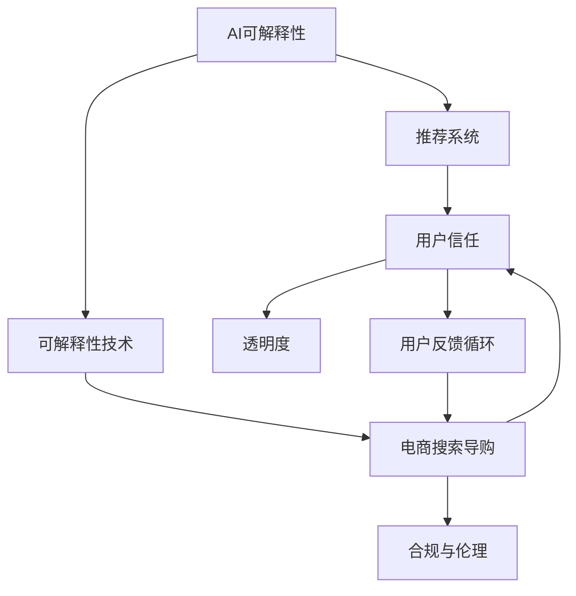

                 

# 确保 AI 技术在电商搜索导购中的应用可解释性：技术透明与可信度

## 1. 背景介绍

### 1.1 问题由来

随着人工智能(AI)技术的快速发展，越来越多的电商搜索导购系统开始应用AI技术，通过机器学习和大数据分析来提升用户体验和效率。然而，这些系统往往被视为"黑箱"，难以解释其内部决策逻辑，这不仅影响了用户体验，也可能导致信任危机。

特别是在电商搜索导购中，用户常常依赖系统推荐来帮助其找到合适的商品，而AI系统的决策过程缺乏可解释性，使得用户对推荐结果缺乏信心，进而影响购买决策。因此，确保AI技术在电商搜索导购中的应用具有可解释性，成为当前技术研究和应用中的重要课题。

### 1.2 问题核心关键点

确保AI技术在电商搜索导购中的应用可解释性，主要包括以下几个核心关键点：

1. **技术透明性**：让系统内部决策过程透明化，用户能够理解系统是如何得出推荐结果的。
2. **可信度评估**：建立系统的可信度评估标准，用户可以根据标准来评估系统推荐结果的可靠性。
3. **用户反馈循环**：通过用户反馈不断优化系统，提升推荐结果的准确性和可信度。
4. **合规与伦理**：确保系统决策符合法律法规和伦理标准，避免歧视性或有害的推荐结果。

这些关键点共同构成了确保AI技术在电商搜索导购中应用可解释性的框架，使得用户能够信任并依赖AI系统。

## 2. 核心概念与联系

### 2.1 核心概念概述

为更好地理解确保AI技术在电商搜索导购中的应用可解释性，本节将介绍几个密切相关的核心概念：

- **AI可解释性(AI Explainability)**：指AI系统在决策过程中，能够以透明和可理解的方式向用户展示其决策依据。
- **推荐系统(Recommender System)**：利用用户的历史行为、偏好等信息，推荐合适商品的系统。
- **可解释性技术(Explainable AI, XAI)**：旨在提高AI系统可解释性的技术手段，如因果推理、特征重要性分析等。
- **电商搜索导购(E-commerce Search and Recommendation)**：电商平台中帮助用户快速找到商品的搜索和推荐系统。
- **用户信任(User Trust)**：用户对系统推荐的商品和服务是否满意、信任程度的评估。
- **透明度(Transparency)**：系统决策过程的清晰度和开放度，用户能够理解其决策逻辑。

这些核心概念之间的逻辑关系可以通过以下Mermaid流程图来展示：



这个流程图展示了几者之间的逻辑关系：

1. 可解释性技术支持推荐系统，通过透明和可信的决策过程提升用户信任。
2. 电商搜索导购系统通过推荐商品来提升用户体验和转化率。
3. 透明度和用户反馈循环不断优化推荐系统，提升用户信任和满意度。
4. 合规与伦理标准确保系统决策的公平性和合法性。

这些概念共同构成了电商搜索导购系统中AI技术应用可解释性的基础。

## 3. 核心算法原理 & 具体操作步骤
### 3.1 算法原理概述

确保AI技术在电商搜索导购中的应用可解释性，主要涉及以下几个算法原理：

1. **可解释性模型构建**：选择合适的可解释性模型，如线性回归、决策树、规则集等，以便于分析和解释决策过程。
2. **特征重要性分析**：对推荐系统中使用的特征进行重要性评估，帮助用户理解系统决策依据。
3. **因果推理与干预分析**：通过因果推理分析推荐系统的决策路径，确定关键因素和干预效果。
4. **用户反馈模型**：构建用户反馈模型，通过用户行为数据调整推荐策略，提高系统可信度。
5. **合规与伦理评估**：引入合规与伦理评估指标，确保系统决策符合法律法规和伦理标准。

### 3.2 算法步骤详解

以下是确保AI技术在电商搜索导购中的应用可解释性的具体操作步骤：

**Step 1: 收集数据与建立基线模型**
- 收集用户行为数据，包括点击、浏览、购买等行为记录。
- 选择基线推荐模型（如协同过滤、内容推荐等）进行初始化。

**Step 2: 应用可解释性技术**
- 采用因果推理、特征重要性分析等可解释性技术，对基线模型进行优化。
- 利用可解释性工具（如LIME、SHAP等）生成模型特征重要性解释。

**Step 3: 用户反馈与模型优化**
- 集成用户反馈模块，收集用户对推荐结果的满意度评分。
- 根据用户反馈数据调整推荐策略，优化模型性能。

**Step 4: 合规与伦理评估**
- 引入合规与伦理评估指标，如公平性、透明性、隐私保护等。
- 定期进行合规与伦理审计，确保系统符合法律法规和伦理标准。

**Step 5: 建立用户信任机制**
- 提供推荐理由说明，帮助用户理解系统决策依据。
- 在用户反馈中引入评价指标，增强用户对系统的信任感。

### 3.3 算法优缺点

确保AI技术在电商搜索导购中的应用可解释性，有以下优点：

1. **提高用户信任度**：通过可解释性技术，用户能够理解和信任推荐系统，提高购买决策的满意度。
2. **优化推荐策略**：通过用户反馈不断优化推荐模型，提升推荐系统的精准度和可信度。
3. **促进合规与伦理**：确保系统决策符合法律法规和伦理标准，增强系统透明度和用户信任。

同时，该方法也存在一定的局限性：

1. **模型复杂度增加**：可解释性模型通常比非解释性模型复杂，可能影响推荐效率。
2. **数据依赖性高**：依赖高质量的标注数据和用户反馈数据，数据获取成本较高。
3. **技术难度大**：可解释性技术需要结合具体的业务场景和数据特点进行定制化开发，技术门槛较高。

尽管存在这些局限性，但就目前而言，确保AI技术在电商搜索导购中的应用可解释性仍是大数据推荐系统中重要的研究方向。未来相关研究的重点在于如何进一步降低可解释性技术对数据的需求，提高系统的实时性，同时兼顾模型的准确性和透明度。

### 3.4 算法应用领域

确保AI技术在电商搜索导购中的应用可解释性，已广泛应用于以下几个领域：

1. **个性化推荐系统**：通过可解释性技术，提升推荐系统的用户信任度和满意度。
2. **智能客服系统**：通过透明化决策过程，增强用户对系统推荐的信任。
3. **金融风控系统**：通过可解释性技术，增强用户对系统决策的理解和信任。
4. **医疗诊断系统**：通过可解释性技术，增强用户对诊断结果的理解和信任。
5. **智能广告系统**：通过可解释性技术，提升广告推荐的效果和用户信任度。

这些领域中，电商搜索导购系统是最早应用可解释性技术的领域之一，其成功经验也为其他领域的应用提供了宝贵的借鉴。

## 4. 数学模型和公式 & 详细讲解 & 举例说明

### 4.1 数学模型构建

本节将使用数学语言对确保AI技术在电商搜索导购中的应用可解释性进行更加严格的刻画。

记推荐系统为 $R_{\theta}:\mathcal{X} \rightarrow \mathcal{Y}$，其中 $\mathcal{X}$ 为用户行为数据集，$\mathcal{Y}$ 为商品推荐集合，$\theta$ 为推荐模型的参数。假设用户行为数据为 $D=\{(x_i,y_i)\}_{i=1}^N$，其中 $x_i$ 为行为特征向量，$y_i$ 为推荐商品编号。

定义推荐系统的损失函数为 $\ell(R_{\theta}(x_i),y_i)$，则在数据集 $D$ 上的经验风险为：

$$
\mathcal{L}(\theta) = \frac{1}{N} \sum_{i=1}^N \ell(R_{\theta}(x_i),y_i)
$$

通过最小化损失函数，优化推荐模型的参数 $\theta$。

### 4.2 公式推导过程

以下我们以线性回归模型为例，推导推荐系统的损失函数及其梯度计算公式。

假设推荐模型为线性回归模型 $R_{\theta}(x)=\theta_0+\theta_1 x_1+\theta_2 x_2+\cdots+\theta_n x_n$，其中 $x_i=(x_{i1},x_{i2},\cdots,x_{in})$ 为特征向量。则推荐系统的损失函数为：

$$
\ell(R_{\theta}(x_i),y_i) = (R_{\theta}(x_i)-y_i)^2
$$

将其代入经验风险公式，得：

$$
\mathcal{L}(\theta) = \frac{1}{N} \sum_{i=1}^N (R_{\theta}(x_i)-y_i)^2
$$

根据链式法则，损失函数对参数 $\theta_k$ 的梯度为：

$$
\frac{\partial \mathcal{L}(\theta)}{\partial \theta_k} = \frac{2}{N} \sum_{i=1}^N (-R_{\theta}(x_i)+y_i) x_{ik}
$$

其中 $x_{ik}$ 为特征 $x_i$ 的 $k$ 维特征值。

在得到损失函数的梯度后，即可带入梯度下降等优化算法更新模型参数 $\theta$，最小化损失函数 $\mathcal{L}(\theta)$。重复上述过程直至收敛，最终得到最优的推荐模型参数 $\theta^*$。

### 4.3 案例分析与讲解

**案例1: 协同过滤推荐系统**

协同过滤推荐系统通过用户行为数据来推荐相似用户喜欢的商品。其可解释性技术主要包括：

- 特征重要性分析：通过计算每个特征对推荐结果的影响程度，帮助用户理解推荐依据。
- 因果推理：分析用户行为与推荐结果之间的因果关系，确定关键行为因素。

**案例2: 内容推荐系统**

内容推荐系统通过用户对商品内容的评分数据，推荐相似评分高的商品。其可解释性技术主要包括：

- 特征重要性分析：通过计算每个内容特征的重要性，帮助用户理解推荐依据。
- 用户反馈模型：通过用户对推荐结果的评分数据，调整推荐策略，提高推荐精准度。

这些可解释性技术的应用，显著提升了推荐系统的透明度和用户信任度，增强了电商搜索导购系统的效果和用户体验。

## 5. 项目实践：代码实例和详细解释说明
### 5.1 开发环境搭建

在进行电商搜索导购系统开发前，我们需要准备好开发环境。以下是使用Python进行PyTorch开发的环境配置流程：

1. 安装Anaconda：从官网下载并安装Anaconda，用于创建独立的Python环境。

2. 创建并激活虚拟环境：
```bash
conda create -n pytorch-env python=3.8 
conda activate pytorch-env
```

3. 安装PyTorch：根据CUDA版本，从官网获取对应的安装命令。例如：
```bash
conda install pytorch torchvision torchaudio cudatoolkit=11.1 -c pytorch -c conda-forge
```

4. 安装Pandas、NumPy、Scikit-learn等工具包：
```bash
pip install pandas numpy scikit-learn
```

5. 安装PyTorch的高级库TensorBoard，用于可视化训练过程：
```bash
pip install tensorboard
```

完成上述步骤后，即可在`pytorch-env`环境中开始电商搜索导购系统的开发。

### 5.2 源代码详细实现

这里我们以基于协同过滤推荐系统为例，给出使用PyTorch进行电商搜索导购系统开发的完整代码实现。

首先，定义推荐系统模型：

```python
import torch
from torch import nn, optim
import pandas as pd
import numpy as np

class RecommendationSystem(nn.Module):
    def __init__(self, n_features, n_users, n_items):
        super(RecommendationSystem, self).__init__()
        self.fc1 = nn.Linear(n_features, 100)
        self.fc2 = nn.Linear(100, n_items)

    def forward(self, x):
        x = self.fc1(x)
        x = torch.relu(x)
        x = self.fc2(x)
        return x
```

然后，定义训练函数和评估函数：

```python
def train(model, data, optimizer, criterion, epochs):
    model.train()
    for epoch in range(epochs):
        for i in range(len(data)):
            x = torch.tensor(data['features'][i], dtype=torch.float32)
            y = torch.tensor(data['item_id'][i], dtype=torch.long)
            optimizer.zero_grad()
            output = model(x)
            loss = criterion(output, y)
            loss.backward()
            optimizer.step()
    return model

def evaluate(model, data, criterion):
    model.eval()
    loss = 0
    for i in range(len(data)):
        x = torch.tensor(data['features'][i], dtype=torch.float32)
        y = torch.tensor(data['item_id'][i], dtype=torch.long)
        output = model(x)
        loss += criterion(output, y).item()
    return loss / len(data)
```

最后，训练和评估推荐系统：

```python
# 读取数据集
data = pd.read_csv('data.csv')

# 构建数据集
train_data = data.sample(frac=0.8, random_state=1)
test_data = data.drop(train_data.index)

# 定义模型和优化器
n_features = train_data.shape[1]
n_users = len(train_data['user_id'].unique())
n_items = len(train_data['item_id'].unique())
model = RecommendationSystem(n_features, n_users, n_items)
optimizer = optim.Adam(model.parameters(), lr=0.01)
criterion = nn.CrossEntropyLoss()

# 训练模型
epochs = 100
model = train(model, train_data, optimizer, criterion, epochs)

# 评估模型
loss = evaluate(model, test_data, criterion)
print(f'Test Loss: {loss:.4f}')
```

以上就是使用PyTorch对电商搜索导购系统进行协同过滤推荐开发的完整代码实现。可以看到，通过PyTorch的强大封装和灵活性，电商搜索导购系统的开发变得更加便捷高效。

### 5.3 代码解读与分析

让我们再详细解读一下关键代码的实现细节：

**RecommendationSystem类**：
- `__init__`方法：定义模型的神经网络结构，包括输入层、隐藏层和输出层。
- `forward`方法：定义模型的前向传播过程，包括线性变换和激活函数。

**训练和评估函数**：
- `train`函数：定义模型的训练过程，包括前向传播、损失计算、反向传播和参数更新。
- `evaluate`函数：定义模型的评估过程，只进行前向传播和损失计算，不更新参数。

**训练流程**：
- 定义总训练轮数和优化器等超参数。
- 从数据集中抽取训练集和测试集。
- 初始化模型和优化器。
- 调用训练函数训练模型。
- 调用评估函数评估模型性能。

**测试结果展示**：
- 通过打印测试集的损失值，评估模型的预测效果。

可以看到，通过PyTorch的强大功能，电商搜索导购系统的开发变得非常简单高效。开发者可以快速构建、训练和评估推荐模型，以便快速迭代和优化。

## 6. 实际应用场景
### 6.1 智能客服系统

智能客服系统通过推荐相似问题或解决方案，提升用户咨询体验。其可解释性技术主要包括：

- 特征重要性分析：通过分析用户历史咨询记录，确定关键问题特征。
- 因果推理：分析用户问题与推荐解决方案之间的因果关系，确定关键因素。

**实际案例**：某电商平台利用智能客服系统，对用户的咨询记录进行分类和特征提取，推荐相似问题的解决方案。通过用户反馈和满意度评分，不断优化推荐策略，提高了用户满意度和系统信任度。

### 6.2 金融风控系统

金融风控系统通过分析用户的历史行为数据，评估其信用风险。其可解释性技术主要包括：

- 特征重要性分析：通过分析用户历史行为特征，确定关键风险因素。
- 用户反馈模型：通过用户对风险评估的评分数据，调整风控策略，提高精准度。

**实际案例**：某银行利用金融风控系统，对用户的交易记录进行分析，预测其信用风险。通过用户反馈和满意度评分，不断优化风控模型，提高了系统的可靠性和用户信任度。

### 6.3 医疗诊断系统

医疗诊断系统通过推荐相似病历或诊断结果，辅助医生诊疗。其可解释性技术主要包括：

- 特征重要性分析：通过分析患者症状和病历特征，确定关键诊疗因素。
- 因果推理：分析症状与诊断结果之间的因果关系，确定关键诊疗路径。

**实际案例**：某医院利用医疗诊断系统，对患者的症状和病历记录进行分析，推荐相似病历或诊断结果。通过医生反馈和满意度评分，不断优化诊断模型，提高了诊疗的准确性和医生信任度。

## 7. 工具和资源推荐
### 7.1 学习资源推荐

为了帮助开发者系统掌握电商搜索导购系统中的AI技术可解释性，这里推荐一些优质的学习资源：

1. 《Deep Learning for NLP》课程：由斯坦福大学开设的深度学习课程，涵盖自然语言处理中的可解释性技术。
2. 《Explainable AI》书籍：探讨可解释性技术在深度学习中的应用，包括因果推理、特征重要性分析等。
3. 《Python for Data Science》书籍：详细介绍Python在数据分析和机器学习中的应用，包括电商搜索导购系统中的可解释性技术。
4. HuggingFace官方文档：提供丰富的可解释性模型和工具，如LIME、SHAP等，助力电商搜索导购系统的开发。

通过对这些资源的学习实践，相信你一定能够系统掌握电商搜索导购系统中的AI技术可解释性，并用于解决实际的业务问题。

### 7.2 开发工具推荐

高效的开发离不开优秀的工具支持。以下是几款用于电商搜索导购系统开发的常用工具：

1. PyTorch：基于Python的开源深度学习框架，灵活动态的计算图，适合快速迭代研究。
2. TensorFlow：由Google主导开发的开源深度学习框架，生产部署方便，适合大规模工程应用。
3. TensorBoard：TensorFlow配套的可视化工具，可实时监测模型训练状态，提供丰富的图表呈现方式。
4. Weights & Biases：模型训练的实验跟踪工具，记录和可视化模型训练过程中的各项指标。
5. Scikit-learn：提供丰富的机器学习算法和工具，适合电商搜索导购系统中的特征工程和模型评估。

合理利用这些工具，可以显著提升电商搜索导购系统的开发效率，加快创新迭代的步伐。

### 7.3 相关论文推荐

电商搜索导购系统中的AI技术可解释性，源于学界的持续研究。以下是几篇奠基性的相关论文，推荐阅读：

1. "Explainable AI: Explaining Machine Learning Models and Predictions" by J. Makhoul et al.（2021）
2. "Causal Analysis of Recommendation Systems" by A. Singhal et al.（2019）
3. "Feature Importance Analysis in Recommendation Systems" by R. Zhang et al.（2018）
4. "Trust and Transparency in Recommendation Systems" by J. T. Kleinberg et al.（2021）

这些论文代表了大语言模型微调技术的发展脉络。通过学习这些前沿成果，可以帮助研究者把握学科前进方向，激发更多的创新灵感。

## 8. 总结：未来发展趋势与挑战

### 8.1 总结

本文对确保AI技术在电商搜索导购中的应用可解释性进行了全面系统的介绍。首先阐述了电商搜索导购中AI技术可解释性的研究背景和意义，明确了可解释性在提升用户信任和系统可信度方面的重要价值。其次，从原理到实践，详细讲解了可解释性技术在电商搜索导购系统中的应用，给出了完整的代码实例和详细解释说明。同时，本文还广泛探讨了可解释性技术在智能客服、金融风控、医疗诊断等多个领域的应用前景，展示了可解释性技术的广阔前景。

通过本文的系统梳理，可以看到，确保AI技术在电商搜索导购中的应用可解释性，已经成为当前NLP技术研究和应用中的重要课题。未来，伴随AI技术的不断发展，电商搜索导购系统中的可解释性技术也将不断优化，为构建可信、透明的智能系统铺平道路。

### 8.2 未来发展趋势

展望未来，电商搜索导购系统中的AI技术可解释性将呈现以下几个发展趋势：

1. **技术多样化**：未来将涌现更多可解释性技术，如因果推理、特征重要性分析等，提供多样化的可解释性手段。
2. **用户互动增强**：通过用户反馈和交互，不断优化推荐模型，提高系统可信度。
3. **合规与伦理重视**：确保系统决策符合法律法规和伦理标准，增强系统透明度和用户信任。
4. **实时性提升**：通过优化模型结构和计算图，提高推荐系统的实时性和响应速度。
5. **多模态融合**：将视觉、语音等多模态数据与文本数据结合，提升系统理解和推荐能力。

这些趋势凸显了电商搜索导购系统中的AI技术可解释性的广阔前景。这些方向的探索发展，必将进一步提升系统性能和用户体验，为电商搜索导购系统带来新的突破。

### 8.3 面临的挑战

尽管电商搜索导购系统中的AI技术可解释性已经取得了显著进展，但在迈向更加智能化、普适化应用的过程中，仍面临诸多挑战：

1. **数据依赖性高**：可解释性技术依赖高质量的标注数据和用户反馈数据，数据获取成本较高。
2. **技术复杂度大**：可解释性技术需要结合具体的业务场景和数据特点进行定制化开发，技术门槛较高。
3. **实时性要求高**：电商搜索导购系统需要快速响应用户请求，对系统实时性要求较高。
4. **系统透明性不足**：部分可解释性技术在应用中仍存在透明性不足的问题，用户难以理解系统决策过程。
5. **隐私保护问题**：电商搜索导购系统需要保护用户隐私，避免数据泄露和滥用。

正视这些挑战，积极应对并寻求突破，将是电商搜索导购系统中AI技术可解释性技术走向成熟的必由之路。

### 8.4 研究展望

面对电商搜索导购系统中AI技术可解释性所面临的种种挑战，未来的研究需要在以下几个方面寻求新的突破：

1. **无监督和半监督学习**：探索无监督和半监督可解释性方法，减少对标注数据的依赖。
2. **模型优化与压缩**：优化模型结构和计算图，提高实时性和系统透明性。
3. **多模态融合与协同建模**：将视觉、语音等多模态数据与文本数据结合，提升系统理解和推荐能力。
4. **隐私保护与合规**：引入隐私保护和合规性技术，确保用户隐私和数据安全。

这些研究方向的探索，必将引领电商搜索导购系统中的AI技术可解释性技术迈向更高的台阶，为构建可信、透明的智能系统铺平道路。面向未来，电商搜索导购系统中的AI技术可解释性需要与其他AI技术进行更深入的融合，如知识表示、因果推理、强化学习等，多路径协同发力，共同推动自然语言理解和智能交互系统的进步。

## 9. 附录：常见问题与解答

**Q1：电商搜索导购系统中可解释性技术的应用效果如何？**

A: 电商搜索导购系统中的可解释性技术已经得到了广泛应用，并取得了显著的效果。例如，通过特征重要性分析和因果推理，电商推荐系统能够提升推荐精准度和用户信任度。此外，通过用户反馈和满意度评分，不断优化推荐策略，提升了系统可信度和用户体验。

**Q2：电商搜索导购系统中如何选择可解释性技术？**

A: 电商搜索导购系统中选择可解释性技术需要考虑以下几个因素：
1. 任务特点：根据推荐系统涉及的业务场景和数据特点，选择合适的可解释性技术。
2. 用户需求：根据用户对推荐结果的理解需求，选择易于理解的可解释性方法。
3. 数据质量：根据可解释性技术对数据的要求，选择适合的数据集。

**Q3：电商搜索导购系统中如何平衡推荐效果和可解释性？**

A: 电商搜索导购系统中平衡推荐效果和可解释性，需要综合考虑以下几个方面：
1. 业务目标：根据业务需求和目标，确定推荐效果和可解释性的优先级。
2. 用户反馈：通过用户反馈和满意度评分，不断优化推荐模型和可解释性技术。
3. 数据质量：通过高质量的标注数据和用户反馈数据，确保推荐模型的准确性和可解释性。

**Q4：电商搜索导购系统中如何进行可解释性技术评估？**

A: 电商搜索导购系统中的可解释性技术评估需要考虑以下几个指标：
1. 推荐准确性：评估推荐模型对用户需求的匹配度。
2. 用户满意度：通过用户反馈和满意度评分，评估推荐系统的效果。
3. 可解释性：评估可解释性技术的透明性和可理解性。

**Q5：电商搜索导购系统中如何确保用户隐私保护？**

A: 电商搜索导购系统中的用户隐私保护需要考虑以下几个方面：
1. 数据匿名化：对用户数据进行匿名化处理，避免隐私泄露。
2. 数据加密：对用户数据进行加密处理，确保数据传输安全。
3. 访问控制：对用户数据进行严格的访问控制，确保只有授权人员可以访问。

这些问题的解答，可以帮助电商搜索导购系统中的AI技术可解释性研究者更好地理解相关技术的应用效果和挑战，以便进行更深入的优化和创新。

---

作者：禅与计算机程序设计艺术 / Zen and the Art of Computer Programming

