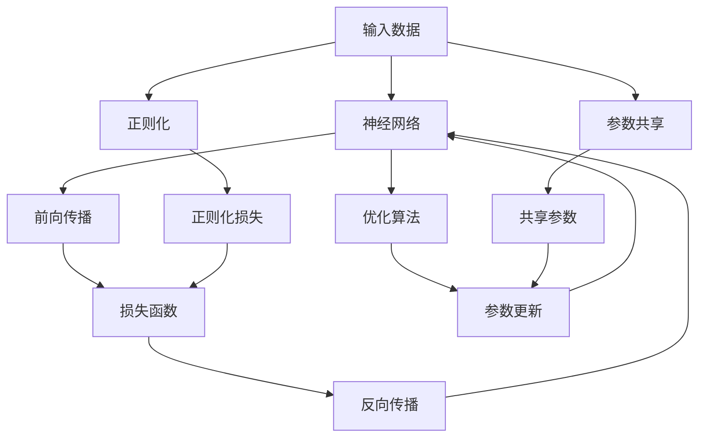

                 

# 神经网络 原理与代码实例讲解

> 关键词：神经网络，前馈神经网络，深度学习，反向传播，卷积神经网络，循环神经网络，图像识别，自然语言处理，推荐系统

## 1. 背景介绍

### 1.1 问题由来
随着计算机科学的飞速发展，深度学习技术在诸多领域中发挥着愈发重要的作用，尤其在人工智能、机器学习、图像识别、自然语言处理等领域，其应用的广度和深度不断被拓展。神经网络作为深度学习的核心技术之一，是构建复杂模型，解决复杂问题的基础。本文旨在深入探讨神经网络的基本原理、架构及其在实际项目中的代码实现。

### 1.2 问题核心关键点
- **神经网络**：由大量人工神经元通过各种连接相互作用的模型，具有强大的数据拟合能力和模式识别能力。
- **前馈神经网络(Feedforward Neural Network, FNN)**：神经网络中信息仅从前一层单向流动到后一层的网络结构。
- **深度学习**：通过多层次的神经网络结构，利用大量数据进行端到端的训练，从而构建复杂、高效的预测模型。
- **反向传播(Backpropagation)**：通过链式法则计算误差对各层神经元的梯度，从而反向更新网络权重。
- **卷积神经网络(CConvolutional Neural Network, CNN)**：针对图像识别等局部结构显著的任务，利用卷积层提取特征的神经网络。
- **循环神经网络(Recurrent Neural Network, RNN)**：对序列数据（如时间序列、文本等）进行建模的网络结构，通过循环结构处理序列信息。
- **图像识别**：识别和分类图像中的对象，如人、车辆、动物等。
- **自然语言处理(Natural Language Processing, NLP)**：处理、分析、理解和生成自然语言的技术。
- **推荐系统**：根据用户的历史行为和偏好，向用户推荐产品或内容的系统。

神经网络作为深度学习的核心技术，其研究始于20世纪80年代，近年来取得了诸多突破，如AlexNet、VGGNet、ResNet等在图像识别领域取得的成绩，以及LSTM、GRU等在自然语言处理和序列预测中的应用。本文将首先介绍神经网络的基本原理和架构，然后详细讲解反向传播算法，并给出不同类型的神经网络（CNN、RNN）代码实现，最后探讨神经网络在实际应用中的场景和挑战。

## 2. 核心概念与联系

### 2.1 核心概念概述

在深入了解神经网络原理和代码实现之前，我们需要掌握几个关键的概念：

- **激活函数(Activation Function)**：将神经元的线性变换映射到非线性空间，增加网络表达能力。
- **损失函数(Loss Function)**：衡量模型输出与真实值之间的差异，用于反向传播过程中权重的更新。
- **优化算法(Optimization Algorithm)**：通过迭代调整模型参数，最小化损失函数，使得模型输出更接近真实值。
- **正则化(Regularization)**：限制模型复杂度，防止过拟合，包括L1正则、L2正则、Dropout等。
- **参数共享(Parameter Sharing)**：通过在网络不同层次共享参数，减小参数量，提升模型泛化能力。

### 2.2 核心概念原理和架构的 Mermaid 流程图



上述流程图展示了神经网络的基本流程：输入数据首先经过前向传播（C），通过激活函数（未展示）进行非线性变换，生成预测输出。损失函数（D）计算预测输出与真实值之间的差异，并结合正则化损失（I），得到总损失。通过反向传播（E）计算各层参数的梯度，优化算法（F）根据梯度和学习率更新模型参数（G），使得网络不断逼近真实值。参数共享（J）通过在不同层之间共享部分参数，进一步提升模型效率。

## 3. 核心算法原理 & 具体操作步骤
### 3.1 算法原理概述

神经网络的核心算法包括前向传播、反向传播和优化算法。

前向传播是指输入数据通过网络各层，最终生成预测输出的过程。具体来说，每个神经元的输出可以看作前一层的输入，经过加权和、偏置项和激活函数的操作后，输出给下一层。

反向传播则是通过链式法则计算误差对各层神经元的梯度，从而反向更新网络权重的过程。反向传播的核心思想是通过链式法则对损失函数求偏导，从而得到每个参数对损失函数的贡献。

优化算法则用于根据梯度调整模型参数，使损失函数不断减小。常见的优化算法包括随机梯度下降法(SGD)、Adam等。

### 3.2 算法步骤详解

#### 3.2.1 前向传播

假设有一个简单的单层神经网络，其中包含一个输入层、一个隐藏层和一个输出层，网络结构如图1所示。

图1：单层神经网络结构

1. 输入数据$x$经过权重$w_1$和偏置$b_1$计算后，得到隐藏层输出$h$。
2. $h$经过权重$w_2$和偏置$b_2$计算，得到预测输出$y$。
3. 激活函数$f$将$h$映射到非线性空间，如$f(h) = \sigma(h) = \frac{1}{1+\exp(-h)}$。

其中，$\sigma$为激活函数，$\exp$为自然指数函数。

#### 3.2.2 损失函数

常见的损失函数包括均方误差(MSE)、交叉熵损失(Cross Entropy Loss)等。以交叉熵损失为例，定义如下：

$$
L = -\frac{1}{N}\sum_{i=1}^N \sum_{j=1}^K y_{ij}\log(p_{ij})
$$

其中，$N$为样本数，$K$为类别数，$y_{ij}$为样本$i$属于类别$j$的真实概率，$p_{ij}$为模型预测样本$i$属于类别$j$的概率。

#### 3.2.3 反向传播

反向传播的目的是计算损失函数对网络各参数的梯度。以图1中的神经网络为例，反向传播过程如下：

1. 计算预测输出$y$与真实值$y^*$的误差$\delta_y$。
2. 计算隐藏层输出$h$与误差$\delta_y$之间的误差$\delta_h$。
3. 计算权重$w_1$和偏置$b_1$的梯度$\nabla_w^1$和$\nabla_b^1$。
4. 计算隐藏层输入$x$与误差$\delta_h$之间的误差$\delta_x$。
5. 计算权重$w_2$和偏置$b_2$的梯度$\nabla_w^2$和$\nabla_b^2$。

其中，误差$\delta$的计算公式为$\delta = \frac{\partial L}{\partial z}$，其中$z$为神经元的输入。

### 3.3 算法优缺点

神经网络的优势在于其强大的数据拟合能力和表达能力，能够处理各种复杂的数据结构。然而，神经网络也存在一些缺点，如计算复杂度高、模型复杂度大、难以解释等。此外，训练过程中容易过拟合，需要采用正则化等技术来缓解。

### 3.4 算法应用领域

神经网络在计算机视觉、自然语言处理、推荐系统等领域有着广泛的应用。例如，在图像识别中，卷积神经网络(CNN)通过卷积层提取局部特征，再通过全连接层进行分类；在自然语言处理中，循环神经网络(RNN)通过循环结构处理序列数据，如文本和语音等。

## 4. 数学模型和公式 & 详细讲解 & 举例说明

### 4.1 数学模型构建

假设我们有一个包含$m$个输入特征、$n$个隐藏层神经元和$k$个输出类别的神经网络。其输入$x \in \mathbb{R}^m$，隐藏层参数$w_h \in \mathbb{R}^{n \times m}$，偏置$b_h \in \mathbb{R}^n$，输出层参数$w_o \in \mathbb{R}^{k \times n}$，偏置$b_o \in \mathbb{R}^k$。激活函数$f$通常为Sigmoid、ReLU等。

### 4.2 公式推导过程

以一个简单的单层神经网络为例，其前向传播和反向传播过程的公式推导如下：

#### 前向传播

$$
h = f(w_hx + b_h)
$$

$$
y = f(w_oy + b_o)
$$

其中，$x \in \mathbb{R}^m$，$h \in \mathbb{R}^n$，$y \in \mathbb{R}^k$。

#### 反向传播

假设样本$x$的真实标签为$y^*$，模型的预测输出为$y$，交叉熵损失函数为$L$。则：

$$
\delta_y = \frac{\partial L}{\partial y} = \frac{y^* - y}{\sigma(y)}
$$

$$
\delta_h = \frac{\partial L}{\partial h} = \delta_y \frac{\partial f(y)}{\partial y} \frac{\partial y}{\partial h}
$$

其中，$f$为激活函数，$\sigma$为Sigmoid函数。

计算权重$w_1$和偏置$b_1$的梯度：

$$
\nabla_w^1 = \frac{\partial L}{\partial w_1} = \delta_h \frac{\partial h}{\partial w_1} = \delta_h x^T
$$

$$
\nabla_b^1 = \frac{\partial L}{\partial b_1} = \delta_h
$$

计算权重$w_2$和偏置$b_2$的梯度：

$$
\nabla_w^2 = \frac{\partial L}{\partial w_2} = \delta_y \frac{\partial y}{\partial w_2} = \delta_y h^T
$$

$$
\nabla_b^2 = \frac{\partial L}{\partial b_2} = \delta_y
$$

### 4.3 案例分析与讲解

以MNIST手写数字识别任务为例，分析CNN在图像识别中的应用。MNIST数据集包含60000个28x28像素的手写数字图像，其中50000个用于训练，10000个用于测试。

#### 4.3.1 网络结构设计

构建一个简单的卷积神经网络，其网络结构如图2所示。

图2：卷积神经网络结构

- 输入层：28x28像素的灰度图像，转换为784维向量。
- 卷积层：32个5x5的卷积核，步长为1，激活函数为ReLU。
- 池化层：2x2的最大池化，步长为2。
- 全连接层：128个神经元，激活函数为ReLU。
- 输出层：10个神经元，激活函数为Sigmoid，用于分类。

#### 4.3.2 代码实现

```python
import tensorflow as tf
from tensorflow.keras import layers, models

# 定义卷积神经网络
model = models.Sequential([
    layers.Conv2D(32, (5, 5), activation='relu', input_shape=(28, 28, 1)),
    layers.MaxPooling2D((2, 2)),
    layers.Flatten(),
    layers.Dense(128, activation='relu'),
    layers.Dense(10, activation='sigmoid')
])

# 编译模型
model.compile(optimizer='adam', loss='binary_crossentropy', metrics=['accuracy'])

# 训练模型
model.fit(train_images, train_labels, epochs=5, batch_size=64, validation_data=(test_images, test_labels))
```

在上述代码中，首先定义了卷积神经网络的结构，然后编译模型，并使用`fit`函数进行训练。`train_images`和`train_labels`为训练集数据和标签，`test_images`和`test_labels`为测试集数据和标签，`epochs`为训练轮数，`batch_size`为批量大小，`validation_data`为验证集数据。

## 5. 项目实践：代码实例和详细解释说明
### 5.1 开发环境搭建

搭建Python开发环境：

1. 安装Anaconda：从官网下载并安装Anaconda，用于创建独立的Python环境。
2. 创建并激活虚拟环境：
```bash
conda create -n pytorch-env python=3.8 
conda activate pytorch-env
```

3. 安装PyTorch：根据CUDA版本，从官网获取对应的安装命令。例如：
```bash
conda install pytorch torchvision torchaudio cudatoolkit=11.1 -c pytorch -c conda-forge
```

4. 安装TensorFlow：从官网下载并安装TensorFlow，或使用pip安装：
```bash
pip install tensorflow
```

5. 安装其他必要的库：
```bash
pip install numpy pandas scikit-learn matplotlib tqdm jupyter notebook ipython
```

完成上述步骤后，即可在`pytorch-env`环境中开始项目实践。

### 5.2 源代码详细实现

以图像分类任务为例，给出使用TensorFlow进行神经网络微调的代码实现。

首先，导入必要的库：

```python
import tensorflow as tf
from tensorflow.keras import layers, models
```

然后，定义数据预处理函数：

```python
def preprocess_data(x_train, x_test, y_train, y_test):
    x_train = x_train.astype('float32') / 255.0
    x_test = x_test.astype('float32') / 255.0
    x_train = x_train.reshape((-1, 28, 28, 1))
    x_test = x_test.reshape((-1, 28, 28, 1))
    return x_train, x_test, y_train, y_test
```

接着，加载和预处理数据集：

```python
(x_train, x_test, y_train, y_test) = tf.keras.datasets.mnist.load_data()
x_train, x_test, y_train, y_test = preprocess_data(x_train, x_test, y_train, y_test)
```

然后，定义神经网络模型：

```python
model = models.Sequential([
    layers.Conv2D(32, (3, 3), activation='relu', input_shape=(28, 28, 1)),
    layers.MaxPooling2D((2, 2)),
    layers.Flatten(),
    layers.Dense(128, activation='relu'),
    layers.Dense(10, activation='softmax')
])
```

接着，编译模型并训练：

```python
model.compile(optimizer='adam', loss='sparse_categorical_crossentropy', metrics=['accuracy'])
model.fit(x_train, y_train, epochs=5, batch_size=32, validation_data=(x_test, y_test))
```

最后，评估模型性能：

```python
test_loss, test_acc = model.evaluate(x_test, y_test, verbose=2)
print('Test accuracy:', test_acc)
```

### 5.3 代码解读与分析

在上述代码中，首先定义了数据预处理函数`preprocess_data`，将原始数据归一化并转换为合适的形状，以便输入模型。

然后，使用`tf.keras.datasets.mnist.load_data`函数加载MNIST数据集，并将其传递给`preprocess_data`函数进行预处理。

接下来，定义神经网络模型`model`，包含一个卷积层、一个池化层、一个全连接层和一个输出层。

最后，使用`model.compile`函数编译模型，指定优化器、损失函数和评估指标，并使用`model.fit`函数进行训练，同时指定验证集用于监控模型性能。

## 6. 实际应用场景

### 6.1 图像识别

图像识别是神经网络最早和最成功的应用之一。通过卷积神经网络，可以高效地提取图像特征，进行分类和识别。例如，在医疗影像分析中，神经网络可以帮助医生识别肿瘤、病变等图像，提升诊断效率和准确性。

### 6.2 自然语言处理

自然语言处理是神经网络的重要应用领域。通过循环神经网络、Transformer等架构，神经网络可以处理文本序列，实现语言理解、机器翻译、文本生成等任务。例如，在情感分析中，神经网络可以分析用户评论，判断其情感倾向。

### 6.3 推荐系统

推荐系统是神经网络的另一重要应用领域。通过神经网络，可以实现对用户历史行为和兴趣的建模，预测其可能感兴趣的物品或内容，从而实现个性化推荐。例如，在电商推荐中，神经网络可以分析用户的浏览记录和购买历史，推荐其可能感兴趣的商品。

## 7. 工具和资源推荐

### 7.1 学习资源推荐

为了帮助开发者系统掌握神经网络的基本原理和实践技巧，以下是一些优质的学习资源：

1. 《深度学习》书籍：Ian Goodfellow等人所著，全面介绍了深度学习的理论基础和实践技巧，包括神经网络的基本原理和代码实现。
2. 《TensorFlow官方文档》：Google官方提供的TensorFlow文档，详细介绍了TensorFlow的基本概念和API，包括神经网络的构建和训练。
3. 《PyTorch官方文档》：Facebook官方提供的PyTorch文档，详细介绍了PyTorch的基本概念和API，包括神经网络的构建和训练。
4. Kaggle：一个数据科学竞赛平台，提供大量数据集和代码实现，适合进行实践和练习。
5. Coursera：提供多门深度学习和神经网络的课程，包括斯坦福大学的《深度学习专项课程》和吴恩达的《深度学习》课程。

通过对这些资源的学习实践，相信你一定能够快速掌握神经网络的基本原理和代码实现，并用于解决实际的机器学习问题。

### 7.2 开发工具推荐

高效的开发离不开优秀的工具支持。以下是几款用于神经网络开发的常用工具：

1. PyTorch：由Facebook开发的深度学习框架，具有动态计算图、灵活的API等优点，适合进行研究和快速原型开发。
2. TensorFlow：由Google开发的深度学习框架，具有强大的计算能力和高效的分布式训练支持，适合进行大规模工程应用。
3. Keras：高层次的深度学习API，支持多种后端，包括TensorFlow、PyTorch等，适合快速原型开发和模型构建。
4. Jupyter Notebook：一个交互式的代码编辑器，支持Python、R等多种语言，适合进行研究和开发。
5. Google Colab：谷歌提供的免费Jupyter Notebook环境，支持GPU/TPU算力，适合进行高性能计算。

合理利用这些工具，可以显著提升神经网络开发的效率，加快创新迭代的步伐。

### 7.3 相关论文推荐

神经网络作为深度学习的核心技术，其研究始于20世纪80年代，近年来取得了诸多突破，以下是几篇奠基性的相关论文：

1. 《Neural Computation of the Human Brain》（1986）：由Ronald M. Collobert等人所著，介绍了人工神经元的基本原理和结构。
2. 《ImageNet Classification with Deep Convolutional Neural Networks》（2012）：由Alex Krizhevsky等人所著，提出了卷积神经网络（CNN），并展示了其在图像识别中的应用。
3. 《LSTM: A Search Space Odyssey through Time》（1997）：由Sepp Hochreiter等人所著，介绍了长短期记忆网络（LSTM），并展示了其在序列预测中的应用。
4. 《Attention Is All You Need》（2017）：由Ashish Vaswani等人所著，提出了Transformer架构，开启了自注意力机制的时代。
5. 《BERT: Pre-training of Deep Bidirectional Transformers for Language Understanding》（2018）：由Jacob Devlin等人所著，提出了BERT模型，并展示了其在自然语言处理中的应用。

这些论文代表了大神经网络技术的发展脉络。通过学习这些前沿成果，可以帮助研究者把握学科前进方向，激发更多的创新灵感。

## 8. 总结：未来发展趋势与挑战

### 8.1 总结

本文对神经网络的基本原理、架构及其在实际项目中的代码实现进行了全面系统的介绍。首先介绍了神经网络的基本概念和架构，然后详细讲解了前向传播、反向传播和优化算法等核心算法，并给出了卷积神经网络、循环神经网络的代码实现。最后探讨了神经网络在实际应用中的场景和挑战。

通过本文的系统梳理，可以看到，神经网络作为深度学习的核心技术，其研究和应用范围在不断扩大，并在计算机视觉、自然语言处理、推荐系统等多个领域取得了显著的成果。未来，随着神经网络技术的不断进步，其在更多领域的应用前景也将更加广阔。

### 8.2 未来发展趋势

展望未来，神经网络技术将呈现以下几个发展趋势：

1. 神经网络模型的复杂度将进一步提高，模型参数量和网络层数不断增加，提升模型的表达能力和性能。
2. 神经网络模型将更加多样化和定制化，针对特定任务设计不同架构和算法，提高模型的应用效率和效果。
3. 神经网络模型的训练和推理将更加高效和可扩展，通过分布式训练、混合精度训练等技术，优化计算资源利用率。
4. 神经网络模型的可解释性和鲁棒性将进一步提升，通过引入因果推断、对抗训练等技术，提高模型的解释能力和抗干扰能力。
5. 神经网络模型的通用性和适应性将不断增强，通过迁移学习和多模态融合，提高模型的跨领域和跨模态应用能力。

以上趋势凸显了神经网络技术的广阔前景。这些方向的探索发展，必将进一步提升神经网络模型的性能和应用范围，为人工智能技术的发展注入新的动力。

### 8.3 面临的挑战

尽管神经网络技术已经取得了诸多突破，但在迈向更加智能化、普适化应用的过程中，它仍面临着诸多挑战：

1. 神经网络模型的计算复杂度高，训练和推理需要高性能硬件支持，如GPU、TPU等。
2. 神经网络模型的模型复杂度大，难以解释其内部工作机制和决策逻辑，给实际应用带来了一定的挑战。
3. 神经网络模型的过拟合问题难以解决，需要采用正则化、Dropout等技术缓解，但效果有限。
4. 神经网络模型的泛化能力有待提升，模型在不同数据集上的性能差距较大。
5. 神经网络模型的鲁棒性和安全性有待加强，面对对抗样本和攻击，模型容易产生误判和漏洞。

正视神经网络技术面临的这些挑战，积极应对并寻求突破，将是神经网络技术不断进步的关键。相信随着学界和产业界的共同努力，这些挑战终将一一被克服，神经网络技术必将在构建智能系统和人机交互中发挥更加重要的作用。

### 8.4 研究展望

面对神经网络技术面临的挑战，未来的研究需要在以下几个方面寻求新的突破：

1. 探索更高效的模型和算法，如神经网络剪枝、量化、蒸馏等技术，减小模型尺寸和计算量，提高模型效率和鲁棒性。
2. 研究更加可解释和透明化的神经网络模型，通过引入符号化表示、因果推断等技术，增强模型的解释能力和鲁棒性。
3. 开发更加灵活和多样的神经网络架构，如注意力机制、自适应神经网络等，适应不同任务和场景的需求。
4. 结合机器学习和人工智能的最新进展，如强化学习、知识表示、元学习等，提升神经网络的性能和应用范围。

这些研究方向的探索，必将引领神经网络技术迈向更高的台阶，为构建更加智能和高效的神经网络模型奠定基础。面向未来，神经网络技术还需要与其他人工智能技术进行更深入的融合，共同推动人工智能技术的发展和进步。

## 9. 附录：常见问题与解答

**Q1: 神经网络有哪些常见的激活函数？**

A: 神经网络中常见的激活函数包括Sigmoid、ReLU、Tanh、Leaky ReLU等。其中，Sigmoid函数将神经元的输出映射到[0,1]区间，ReLU函数将神经元的输出映射到[0,+∞]区间，Tanh函数将神经元的输出映射到[-1,1]区间，Leaky ReLU函数在负半轴上的斜率为一个小的非零常数，解决了ReLU函数的死亡问题。

**Q2: 神经网络中的反向传播算法如何计算梯度？**

A: 神经网络中的反向传播算法通过链式法则计算误差对各层神经元的梯度。具体来说，从输出层开始，计算误差对输出层的梯度，然后依次向后计算误差对隐藏层的梯度，直到计算到输入层为止。

**Q3: 神经网络中如何防止过拟合？**

A: 神经网络中防止过拟合的方法包括正则化、Dropout、Early Stopping等。正则化通过添加L1正则或L2正则等约束，限制模型复杂度；Dropout通过随机失活一些神经元，防止模型对噪声的过拟合；Early Stopping通过监控模型在验证集上的性能，及时停止训练，防止模型过拟合。

**Q4: 神经网络中如何加速训练？**

A: 神经网络中加速训练的方法包括梯度累积、混合精度训练、模型并行等。梯度累积通过累加小批量梯度，减小每次更新的噪声，提高模型稳定性；混合精度训练通过使用float16等低精度数据类型，提高模型训练效率；模型并行通过将模型分布在多个GPU或TPU上，提高模型的并行计算能力。

**Q5: 神经网络中如何优化超参数？**

A: 神经网络中优化超参数的方法包括网格搜索、随机搜索、贝叶斯优化等。网格搜索通过遍历超参数的取值组合，找到最优的超参数组合；随机搜索通过随机采样超参数的取值，快速找到较好的超参数组合；贝叶斯优化通过构建高斯过程模型，预测超参数取值的效果，高效搜索最优超参数组合。

通过本文的系统梳理，可以看到，神经网络作为深度学习的核心技术，其研究和应用范围在不断扩大，并在计算机视觉、自然语言处理、推荐系统等多个领域取得了显著的成果。未来，随着神经网络技术的不断进步，其在更多领域的应用前景也将更加广阔。相信随着学界和产业界的共同努力，这些挑战终将一一被克服，神经网络技术必将在构建智能系统和人机交互中发挥更加重要的作用。

