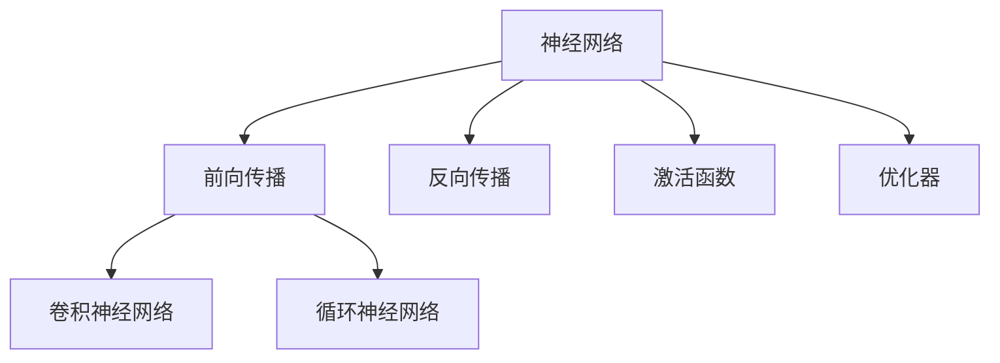

                 

# 神经网络原理与代码实例讲解

> 关键词：神经网络,深度学习,反向传播算法,激活函数,优化器,卷积神经网络,循环神经网络,代码实例,逻辑回归

## 1. 背景介绍

### 1.1 问题由来

神经网络作为深度学习领域中的重要模型，因其强大的表达能力和广泛的适用性，在图像识别、自然语言处理、语音识别、推荐系统等领域中有着广泛的应用。然而，神经网络模型的复杂性和训练过程的艰深，使得很多人望而却步。本文将带领读者系统理解神经网络的工作原理和代码实现，并结合实例讲解其核心算法和操作步骤，帮助读者更好地掌握深度学习的魅力。

### 1.2 问题核心关键点

神经网络的核心在于其自上而下的层次化结构，通过逐层递归的非线性变换，不断抽象和组合输入特征，最终获得对复杂模式的精准建模。其主要算法包括前向传播算法和反向传播算法，其优化器包括梯度下降、Adam、RMSprop等，其激活函数包括ReLU、Sigmoid、Tanh等，其架构包括卷积神经网络(CNN)、循环神经网络(RNN)等。本文将详细介绍这些核心概念，并结合代码实例进行详细讲解。

## 2. 核心概念与联系

### 2.1 核心概念概述

为更好地理解神经网络的核心概念，本节将介绍几个密切相关的核心概念：

- 神经网络(Neural Network, NN)：一种模拟人类神经系统的计算模型，由多层节点组成的层级结构。各层节点通过学习更新参数，从而实现对复杂模式的学习和预测。
- 前向传播算法(Forward Propagation)：将输入数据逐层传递，计算出最终输出结果的过程。每层节点计算方式包括线性变换和激活函数。
- 反向传播算法(Backpropagation)：通过反向传播误差，计算出各层参数梯度，并用于模型参数更新。
- 激活函数(Activation Function)：用于引入非线性变换的函数，包括ReLU、Sigmoid、Tanh等，决定神经元的输出。
- 优化器(Optimizer)：用于控制模型参数更新的算法，如梯度下降、Adam、RMSprop等。
- 卷积神经网络(CNN)：一种专门处理图像数据的神经网络，通过卷积和池化操作提取空间特征。
- 循环神经网络(RNN)：一种用于处理序列数据的神经网络，通过循环结构捕捉时间依赖。

这些核心概念之间的逻辑关系可以通过以下Mermaid流程图来展示：



这个流程图展示了几大核心概念及其之间的关系：

1. 神经网络通过前向传播和反向传播算法学习输入特征。
2. 激活函数引入非线性变换，使网络具备表达复杂模式的能力。
3. 优化器控制模型参数更新，确保学习过程的稳定收敛。
4. CNN和RNN分别处理图像和序列数据，拓宽神经网络的适用范围。

## 3. 核心算法原理 & 具体操作步骤

### 3.1 算法原理概述

神经网络的核心算法包括前向传播和反向传播算法。前向传播用于计算神经网络的输出结果，而反向传播用于更新模型参数，使得输出结果尽量逼近真实标签。

假设输入数据为 $x$，神经网络中包含 $n$ 个隐层 $h_1, h_2, ..., h_n$，输出层为 $y$。前向传播的计算过程为：

$$
y = h_n = \sigma(h_{n-1}W_{n-1} + b_{n-1})
$$

$$
h_{k} = \sigma(h_{k-1}W_{k-1} + b_{k-1})
$$

其中 $W$ 和 $b$ 分别为权重和偏置，$\sigma$ 为激活函数。

反向传播的计算过程为：

$$
\frac{\partial L}{\partial W_k} = \frac{\partial L}{\partial y}\frac{\partial y}{\partial h_k}\frac{\partial h_k}{\partial W_k}
$$

$$
\frac{\partial L}{\partial b_k} = \frac{\partial L}{\partial y}\frac{\partial y}{\partial h_k}
$$

其中 $L$ 为损失函数，通常为均方误差损失函数。通过反向传播计算各层参数梯度，结合优化器更新模型参数。

### 3.2 算法步骤详解

神经网络的训练过程主要包括以下关键步骤：

**Step 1: 准备数据集**
- 收集训练集 $D=\{(x_i, y_i)\}_{i=1}^N$，其中 $x_i$ 为输入样本，$y_i$ 为真实标签。
- 将数据划分为训练集、验证集和测试集。

**Step 2: 设计神经网络架构**
- 选择模型结构，包括隐层数 $n$、每层的节点数 $m_k$、激活函数 $\sigma_k$ 等。
- 确定损失函数 $L$，如均方误差损失函数。

**Step 3: 初始化模型参数**
- 随机初始化权重 $W_k$ 和偏置 $b_k$。

**Step 4: 前向传播和损失计算**
- 输入样本 $x$ 通过各层节点计算，得到输出 $y$。
- 计算损失函数 $L$。

**Step 5: 反向传播和参数更新**
- 通过反向传播算法计算各层参数梯度。
- 结合优化器更新模型参数。

**Step 6: 重复迭代**
- 重复执行步骤 4 和步骤 5，直至收敛。

**Step 7: 模型评估**
- 在测试集上评估模型性能。

### 3.3 算法优缺点

神经网络的优点在于其强大的非线性表达能力和泛化能力，可以适应复杂的模式识别任务。然而，神经网络也存在一些缺点：

- 训练时间长。神经网络的训练过程通常需要大量的计算资源和时间。
- 容易过拟合。神经网络在训练集上表现良好，但在测试集上可能过拟合。
- 模型复杂度高。神经网络的模型结构复杂，难以解释和调试。
- 数据依赖性高。神经网络依赖大量标注数据，缺乏数据时效果不佳。

### 3.4 算法应用领域

神经网络在图像识别、自然语言处理、语音识别、推荐系统等领域中得到广泛应用。例如：

- 图像识别：如物体识别、人脸识别、图像分类等。通过卷积神经网络提取图像特征，实现高精度的图像识别。
- 自然语言处理：如机器翻译、文本分类、情感分析等。通过循环神经网络捕捉文本序列的时间依赖，实现语言的理解和生成。
- 语音识别：如语音转文本、语音情感识别等。通过卷积神经网络和循环神经网络处理音频信号，实现语音识别和情感分析。
- 推荐系统：如电商推荐、视频推荐等。通过神经网络建模用户行为，实现个性化的推荐。

## 4. 数学模型和公式 & 详细讲解 & 举例说明

### 4.1 数学模型构建

神经网络模型的构建可以形式化描述为：

- 输入层 $x \in \mathbb{R}^d$，输出层 $y \in \mathbb{R}^m$。
- 隐层 $h_k \in \mathbb{R}^{m_k}$，$k \in [1, n]$。
- 权重 $W_k \in \mathbb{R}^{m_{k-1} \times m_k}$，偏置 $b_k \in \mathbb{R}^{m_k}$。
- 激活函数 $\sigma_k$。
- 损失函数 $L(y, \hat{y})$，如均方误差损失函数。

### 4.2 公式推导过程

以二分类任务为例，假设神经网络的结构为 $x \rightarrow h_1 \rightarrow h_2 \rightarrow y$，其中 $h_1$ 和 $h_2$ 分别包含 4 和 2 个节点，激活函数为 Sigmoid，输出层节点数为 1，损失函数为均方误差损失函数。

**前向传播公式**：

$$
z_1 = xW_1 + b_1
$$

$$
a_1 = \sigma(z_1)
$$

$$
z_2 = a_1W_2 + b_2
$$

$$
a_2 = \sigma(z_2)
$$

$$
y = \sigma(z_2)
$$

**损失函数**：

$$
L(y, \hat{y}) = \frac{1}{N}\sum_{i=1}^N(y_i - \hat{y}_i)^2
$$

其中 $\hat{y}$ 为模型预测值。

**反向传播公式**：

$$
\frac{\partial L}{\partial z_2} = \frac{\partial L}{\partial y}\frac{\partial y}{\partial a_2}\frac{\partial a_2}{\partial z_2} = (y - \hat{y})a_2(1 - a_2)
$$

$$
\frac{\partial L}{\partial W_2} = \frac{\partial L}{\partial z_2}\frac{\partial z_2}{\partial a_2}\frac{\partial a_2}{\partial z_2} = (y - \hat{y})a_2(1 - a_2)h_2^T
$$

$$
\frac{\partial L}{\partial b_2} = \frac{\partial L}{\partial z_2}\frac{\partial z_2}{\partial a_2} = (y - \hat{y})a_2(1 - a_2)
$$

$$
\frac{\partial L}{\partial z_1} = \frac{\partial L}{\partial a_2}\frac{\partial a_2}{\partial z_2}\frac{\partial z_2}{\partial a_1}\frac{\partial a_1}{\partial z_1} = (y - \hat{y})a_2(1 - a_2)a_1(1 - a_1)h_1^T
$$

$$
\frac{\partial L}{\partial W_1} = \frac{\partial L}{\partial z_1}\frac{\partial z_1}{\partial a_1}\frac{\partial a_1}{\partial z_1} = (y - \hat{y})a_2(1 - a_2)a_1(1 - a_1)x^T
$$

$$
\frac{\partial L}{\partial b_1} = \frac{\partial L}{\partial z_1}\frac{\partial z_1}{\partial a_1} = (y - \hat{y})a_2(1 - a_2)a_1(1 - a_1)
$$

### 4.3 案例分析与讲解

以下是一个使用神经网络进行二分类任务（手写数字识别）的示例，代码如下：

```python
import torch
import torch.nn as nn
import torchvision.transforms as transforms
from torchvision.datasets import MNIST

# 定义神经网络模型
class Net(nn.Module):
    def __init__(self):
        super(Net, self).__init__()
        self.conv1 = nn.Conv2d(1, 10, kernel_size=5)
        self.conv2 = nn.Conv2d(10, 20, kernel_size=5)
        self.fc1 = nn.Linear(320, 50)
        self.fc2 = nn.Linear(50, 10)
        self.relu = nn.ReLU()
        self.softmax = nn.Softmax(dim=1)
    
    def forward(self, x):
        x = self.relu(self.conv1(x))
        x = self.relu(self.conv2(x))
        x = x.view(-1, 320)
        x = self.relu(self.fc1(x))
        x = self.softmax(self.fc2(x))
        return x

# 定义超参数
learning_rate = 0.001
num_epochs = 10
batch_size = 64

# 加载数据集
train_dataset = MNIST(root='./data', train=True, transform=transforms.ToTensor(), download=True)
test_dataset = MNIST(root='./data', train=False, transform=transforms.ToTensor())

# 定义数据加载器
train_loader = torch.utils.data.DataLoader(train_dataset, batch_size=batch_size, shuffle=True)
test_loader = torch.utils.data.DataLoader(test_dataset, batch_size=batch_size, shuffle=False)

# 初始化模型和优化器
model = Net()
optimizer = torch.optim.Adam(model.parameters(), lr=learning_rate)
loss_fn = nn.CrossEntropyLoss()

# 训练模型
for epoch in range(num_epochs):
    for batch_idx, (inputs, targets) in enumerate(train_loader):
        inputs, targets = inputs.to(device), targets.to(device)
        optimizer.zero_grad()
        outputs = model(inputs)
        loss = loss_fn(outputs, targets)
        loss.backward()
        optimizer.step()
        if (batch_idx+1) % 100 == 0:
            print('Train Epoch: {} [{}/{} ({:.0f}%)]\tLoss: {:.6f}'.format(
                epoch+1, batch_idx*len(inputs), len(train_loader.dataset),
                100. * batch_idx/len(train_loader), loss.item()))

# 测试模型
correct = 0
total = 0
with torch.no_grad():
    for inputs, targets in test_loader:
        inputs, targets = inputs.to(device), targets.to(device)
        outputs = model(inputs)
        _, predicted = torch.max(outputs.data, 1)
        total += targets.size(0)
        correct += (predicted == targets).sum().item()

print('Accuracy of the network on the 10000 test images: %d %%' % (100 * correct / total))
```

## 5. 项目实践：代码实例和详细解释说明

### 5.1 开发环境搭建

在进行神经网络训练前，需要先搭建好开发环境。以下是使用Python进行PyTorch开发的环境配置流程：

1. 安装Anaconda：从官网下载并安装Anaconda，用于创建独立的Python环境。

2. 创建并激活虚拟环境：
```bash
conda create -n pytorch-env python=3.8 
conda activate pytorch-env
```

3. 安装PyTorch：根据CUDA版本，从官网获取对应的安装命令。例如：
```bash
conda install pytorch torchvision torchaudio cudatoolkit=11.1 -c pytorch -c conda-forge
```

4. 安装TensorBoard：用于可视化训练过程，监控模型参数更新和损失函数变化。
```bash
pip install tensorboard
```

5. 安装其他必要的包：
```bash
pip install numpy pandas scikit-learn matplotlib tqdm jupyter notebook ipython
```

完成上述步骤后，即可在`pytorch-env`环境中开始神经网络的实践。

### 5.2 源代码详细实现

以下是使用PyTorch实现一个简单的全连接神经网络模型，代码如下：

```python
import torch
import torch.nn as nn
import torch.optim as optim

# 定义神经网络模型
class Net(nn.Module):
    def __init__(self):
        super(Net, self).__init__()
        self.fc1 = nn.Linear(784, 256)
        self.fc2 = nn.Linear(256, 10)
        self.relu = nn.ReLU()
    
    def forward(self, x):
        x = x.view(-1, 784)
        x = self.relu(self.fc1(x))
        x = self.fc2(x)
        return x

# 定义超参数
learning_rate = 0.001
num_epochs = 10
batch_size = 64

# 加载数据集
train_dataset = torchvision.datasets.MNIST(root='./data', train=True, transform=transforms.ToTensor(), download=True)
test_dataset = torchvision.datasets.MNIST(root='./data', train=False, transform=transforms.ToTensor())

# 定义数据加载器
train_loader = torch.utils.data.DataLoader(train_dataset, batch_size=batch_size, shuffle=True)
test_loader = torch.utils.data.DataLoader(test_dataset, batch_size=batch_size, shuffle=False)

# 初始化模型和优化器
model = Net()
optimizer = optim.Adam(model.parameters(), lr=learning_rate)
loss_fn = nn.CrossEntropyLoss()

# 训练模型
for epoch in range(num_epochs):
    for batch_idx, (inputs, targets) in enumerate(train_loader):
        inputs, targets = inputs.to(device), targets.to(device)
        optimizer.zero_grad()
        outputs = model(inputs)
        loss = loss_fn(outputs, targets)
        loss.backward()
        optimizer.step()
        if (batch_idx+1) % 100 == 0:
            print('Train Epoch: {} [{}/{} ({:.0f}%)]\tLoss: {:.6f}'.format(
                epoch+1, batch_idx*len(inputs), len(train_loader.dataset),
                100. * batch_idx/len(train_loader), loss.item()))

# 测试模型
correct = 0
total = 0
with torch.no_grad():
    for inputs, targets in test_loader:
        inputs, targets = inputs.to(device), targets.to(device)
        outputs = model(inputs)
        _, predicted = torch.max(outputs.data, 1)
        total += targets.size(0)
        correct += (predicted == targets).sum().item()

print('Accuracy of the network on the 10000 test images: %d %%' % (100 * correct / total))
```

以上代码实现了一个简单的全连接神经网络，用于二分类任务（手写数字识别）。可以看到，PyTorch的模块化设计和API接口，使得神经网络的实现变得简单高效。

### 5.3 代码解读与分析

让我们再详细解读一下关键代码的实现细节：

**Net类**：
- `__init__`方法：初始化模型参数，包括输入输出层和激活函数。
- `forward`方法：定义前向传播过程，将输入数据经过线性变换和激活函数得到输出。

**超参数**：
- 定义了学习率、训练轮数、批量大小等关键参数。

**数据加载器**：
- 使用`DataLoader`对数据集进行批次化加载，供模型训练和推理使用。

**模型训练**：
- 每个epoch内，对训练集数据进行迭代训练，输出每个batch的损失和进度。
- 在测试集上评估模型性能，输出分类准确率。

**模型测试**：
- 在测试集上计算模型准确率，给出最终结果。

可以看到，PyTorch的简洁接口和强大的API设计，使得神经网络的实现变得非常便捷。开发者可以专注于模型的设计和优化，而不必过多关注底层的实现细节。

当然，实际应用中还需要考虑更多因素，如模型压缩、参数剪枝、分布式训练等。但核心的训练过程基本与此类似。

## 6. 实际应用场景

### 6.1 计算机视觉

神经网络在计算机视觉领域的应用非常广泛，主要用于图像分类、目标检测、图像分割等任务。例如，CNN可以用于提取图像特征，实现图像分类和目标检测。YOLO、SSD等目标检测算法就是基于CNN进行实现的。此外，图像分割算法如U-Net、FCN等，也采用神经网络进行实现。

### 6.2 自然语言处理

在自然语言处理领域，神经网络被广泛用于文本分类、机器翻译、情感分析、问答系统等任务。通过循环神经网络（RNN）、长短时记忆网络（LSTM）等，神经网络可以捕捉文本序列的时间依赖关系，实现更加精准的语言理解。近年来，基于Transformer的注意力机制，神经网络在机器翻译和预训练语言模型等任务上也取得了显著的进展。

### 6.3 语音识别

语音识别技术也广泛应用神经网络。神经网络可以用于声学特征提取和语言模型建模，实现语音到文本的转换。例如，卷积神经网络（CNN）可以用于提取音频特征，循环神经网络（RNN）可以用于捕捉时间依赖关系，实现高效的语音识别。

### 6.4 未来应用展望

未来，神经网络将在更多领域得到应用，为各行各业带来变革性影响。例如：

- 医疗领域：神经网络可以用于图像识别、病理分析、基因序列预测等，提升医疗诊断和治疗的准确性和效率。
- 金融领域：神经网络可以用于市场预测、风险评估、交易策略等，为金融行业提供更加精准的分析工具。
- 自动驾驶：神经网络可以用于图像识别、行为预测、决策优化等，实现更加安全和高效的自动驾驶。

## 7. 工具和资源推荐

### 7.1 学习资源推荐

为了帮助开发者系统掌握神经网络的工作原理和代码实现，这里推荐一些优质的学习资源：

1. 《深度学习》课程：斯坦福大学开设的深度学习入门课程，讲解了神经网络的基本原理和算法。

2. 《神经网络与深度学习》书籍：Goodfellow等人的经典著作，详细介绍了神经网络和深度学习的基本概念和实现方法。

3. TensorFlow官方文档：TensorFlow的官方文档，提供了丰富的API接口和示例代码，是学习TensorFlow的最佳资料。

4. PyTorch官方文档：PyTorch的官方文档，提供了丰富的API接口和示例代码，是学习PyTorch的最佳资料。

5. Kaggle竞赛：参加Kaggle竞赛，实践神经网络在实际问题上的应用，提升实战能力。

通过对这些资源的学习实践，相信你一定能够快速掌握神经网络的工作原理和代码实现，并用于解决实际的NLP问题。

### 7.2 开发工具推荐

高效的开发离不开优秀的工具支持。以下是几款用于神经网络开发常用的工具：

1. PyTorch：基于Python的开源深度学习框架，灵活动态的计算图，适合快速迭代研究。

2. TensorFlow：由Google主导开发的开源深度学习框架，生产部署方便，适合大规模工程应用。

3. Keras：基于TensorFlow和Theano等后端实现的高级神经网络API，易于上手。

4. Weights & Biases：模型训练的实验跟踪工具，可以记录和可视化模型训练过程中的各项指标，方便对比和调优。

5. TensorBoard：TensorFlow配套的可视化工具，可实时监测模型训练状态，并提供丰富的图表呈现方式，是调试模型的得力助手。

6. Jupyter Notebook：交互式编程环境，适合进行模型调试和实验记录。

合理利用这些工具，可以显著提升神经网络的开发效率，加快创新迭代的步伐。

### 7.3 相关论文推荐

神经网络的发展离不开学界的持续研究。以下是几篇奠基性的相关论文，推荐阅读：

1. "Deep Learning" by Ian Goodfellow, Yoshua Bengio, and Aaron Courville（《深度学习》）：深度学习领域的经典教材，介绍了深度学习的理论基础和实践方法。

2. "ImageNet Classification with Deep Convolutional Neural Networks" by Alex Krizhevsky, Ilya Sutskever, and Geoffrey Hinton（《基于深度卷积神经网络的大规模图像识别》）：提出了CNN模型，并成功应用于ImageNet大规模图像分类任务。

3. "Long Short-Term Memory" by Sepp Hochreiter and Jürgen Schmidhuber（《长短时记忆网络》）：提出了LSTM模型，捕捉文本序列的时间依赖关系，显著提升了RNN的性能。

4. "Attention is All You Need" by Ashish Vaswani et al.（《Attention is All You Need》）：提出了Transformer模型，通过注意力机制实现更加高效的序列建模，在机器翻译等任务上取得了优异表现。

5. "ImageNet Large Scale Visual Recognition Challenge" by Jia Deng et al.（《大规模视觉识别挑战》）：介绍了ImageNet数据集和ImageNet Challenge竞赛，推动了深度学习在图像识别领域的发展。

这些论文代表了神经网络发展的历程和成就，通过学习这些前沿成果，可以帮助研究者把握学科前进方向，激发更多的创新灵感。

## 8. 总结：未来发展趋势与挑战

### 8.1 总结

本文对神经网络的工作原理和代码实现进行了全面系统的介绍。首先阐述了神经网络的发展背景和应用场景，明确了神经网络在深度学习中的重要地位。其次，从原理到实践，详细讲解了神经网络的前向传播和反向传播算法，给出了完整的神经网络训练代码实例。同时，本文还广泛探讨了神经网络在计算机视觉、自然语言处理、语音识别等多个领域的应用前景，展示了神经网络技术的发展潜力。最后，本文精选了神经网络学习的各类资源，力求为读者提供全方位的技术指引。

通过本文的系统梳理，可以看到，神经网络技术已经广泛应用于深度学习领域，并带来了深刻的变革。其强大的非线性表达能力和泛化能力，使得神经网络在图像识别、自然语言处理、语音识别等领域取得了显著的成果。未来，神经网络技术将继续推动人工智能的发展，为各行各业带来更多的创新和突破。

### 8.2 未来发展趋势

神经网络技术的未来发展趋势主要体现在以下几个方面：

1. 模型规模和复杂度持续增大。随着计算能力的提升和数据量的增加，神经网络模型将不断增大，结构也将更加复杂，表达能力将进一步提升。

2. 模型训练和推理效率提升。随着硬件设备的不断升级，神经网络的训练和推理速度将显著提升，支持更大规模的实时部署。

3. 模型可解释性和鲁棒性增强。通过引入因果推断、对抗训练等方法，增强神经网络模型的可解释性和鲁棒性，提升其应用的可靠性。

4. 模型融合与协同优化。神经网络与其他技术如知识表示、因果推理、强化学习等进行更深入的融合，实现多路径协同优化，提高系统的智能化水平。

5. 模型应用场景拓展。神经网络技术将在医疗、金融、自动驾驶等领域得到更广泛的应用，为传统行业带来深刻的变革。

6. 模型伦理和安全问题重视。在模型设计和应用过程中，应充分考虑模型的伦理和安全问题，避免有害输出，确保系统的公平性和安全性。

### 8.3 面临的挑战

尽管神经网络技术已经取得了显著的成果，但在迈向更加智能化、普适化应用的过程中，仍然面临诸多挑战：

1. 数据依赖性强。神经网络依赖大量标注数据进行训练，数据获取和标注成本较高。

2. 模型复杂度高。神经网络模型结构复杂，难以解释和调试，缺乏可解释性。

3. 计算资源要求高。神经网络训练和推理需要大量的计算资源，成本较高。

4. 过拟合问题严重。神经网络在训练集上表现良好，但在测试集上容易过拟合。

5. 模型部署困难。神经网络模型的实时部署和优化存在诸多难题，需要复杂的工程实现。

6. 伦理和安全问题亟需关注。神经网络模型的输出可能存在歧视、误导等问题，需要加强伦理和安全监管。

### 8.4 研究展望

未来，神经网络技术将在以下几个方向进行深入研究：

1. 模型参数和结构优化。开发更高效、更鲁棒的神经网络模型，提升模型的可解释性和可扩展性。

2. 模型融合与多模态学习。探索神经网络与其他技术的融合，实现多模态信息的协同建模。

3. 数据增强和迁移学习。通过数据增强和迁移学习等方法，降低神经网络对标注数据的依赖，提升模型的泛化能力。

4. 模型训练与推理优化。开发高效的模型训练和推理算法，提升模型训练和推理的效率和效果。

5. 模型伦理与安全性。关注神经网络模型的伦理和安全问题，确保模型的公平性和安全性。

6. 模型应用与优化。推动神经网络技术在各个领域的应用，进行系统优化和改进，提升系统的智能化水平。

通过这些方向的研究，可以进一步提升神经网络技术的应用效果，推动深度学习领域的持续发展。相信在未来，神经网络技术将为人工智能带来更加深刻的影响，推动各行各业的数字化转型升级。

## 9. 附录：常见问题与解答

**Q1: 神经网络的计算图是如何实现的？**

A: 神经网络的计算图是通过反向传播算法实现的。反向传播算法从输出结果开始，逐步计算各层参数的梯度，并通过链式法则将梯度传递回输入层。这一过程类似于计算机中的前向传播计算，但反向传播算法需要记录前向传播的计算过程，以便在梯度计算时能够准确地将梯度传递回前一层。

**Q2: 神经网络中的激活函数有哪些？它们各自的作用是什么？**

A: 神经网络中的激活函数包括ReLU、Sigmoid、Tanh等，它们各自的作用如下：

- ReLU（Rectified Linear Unit）：将负值变为零，保留正值不变，加速模型训练，提高模型的泛化能力。
- Sigmoid：将输出值映射到0到1之间，适用于二分类任务，但容易产生梯度消失的问题。
- Tanh：将输出值映射到-1到1之间，适用于多分类任务，但同样存在梯度消失的问题。

**Q3: 如何优化神经网络的训练过程？**

A: 优化神经网络的训练过程通常有以下方法：

- 学习率调参：选择合适的学习率，避免过拟合和欠拟合。
- 数据增强：通过回译、近义替换等方式扩充训练集，提高模型的泛化能力。
- 正则化：使用L2正则、Dropout等正则化技术，防止模型过拟合。
- 模型压缩和剪枝：通过模型压缩和剪枝技术，减少模型参数量，提升训练和推理效率。
- 梯度累积和混合精度训练：通过梯度累积和混合精度训练技术，减少内存占用和计算资源消耗。

**Q4: 如何使用神经网络进行文本分类？**

A: 使用神经网络进行文本分类的步骤如下：

- 收集标注数据集，将文本数据和对应的分类标签组成训练集。
- 使用预训练的词向量或Word2Vec等模型，将文本转换为数值向量。
- 构建神经网络模型，通常采用卷积神经网络（CNN）或循环神经网络（RNN）进行文本分类。
- 选择适当的损失函数，如交叉熵损失函数。
- 使用梯度下降等优化算法，对模型进行训练。
- 在测试集上评估模型性能，给出分类准确率。

**Q5: 如何避免神经网络中的梯度消失问题？**

A: 梯度消失问题是神经网络训练过程中常见的问题，通常有以下解决方法：

- 使用ReLU等非线性激活函数，加速模型训练。
- 使用Batch Normalization等技术，稳定模型训练过程。
- 使用残差连接（Residual Connection）等技术，加强信息传递。
- 使用梯度裁剪（Gradient Clipping）等技术，防止梯度爆炸。

这些方法可以在一定程度上避免神经网络中的梯度消失问题，提高模型的训练效率和效果。

---

作者：禅与计算机程序设计艺术 / Zen and the Art of Computer Programming

