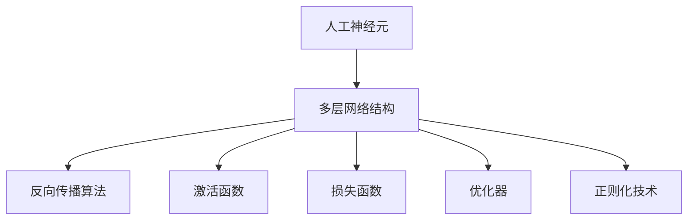

                 

# 神经网络：人类智慧的延伸

> 关键词：
1. 神经网络
2. 深度学习
3. 人工神经元
4. 反向传播
5. 卷积神经网络(CNN)
6. 循环神经网络(RNN)
7. 自然语言处理(NLP)

## 1. 背景介绍

### 1.1 问题由来
在过去的几十年里，人工智能(AI)领域经历了翻天覆地的变化。从早期基于符号逻辑的专家系统，到基于统计学习的机器学习，再到如今以深度学习为核心的神经网络，AI技术逐步迈向更加智能、更加泛化的应用。

深度学习作为当今AI研究的热点，通过多层非线性变换，显著提升了模型对复杂问题的建模能力。其中，神经网络(尤其是深度神经网络)因其强大的自适应能力和泛化性能，成为了深度学习领域的基石。本文将深入探讨神经网络的基本原理、核心算法、实际应用及其未来发展趋势。

### 1.2 问题核心关键点
神经网络通过模拟人脑神经元的工作机制，实现了对复杂输入数据的深度学习和模式识别。核心关键点包括：
- 人工神经元：神经网络的基本组成单元，实现输入到输出的非线性映射。
- 多层网络结构：通过堆叠多个神经元，构成多层网络，提升模型的拟合能力和泛化性能。
- 反向传播算法：基于误差反向传播，优化网络参数，实现模型训练。
- 激活函数：如ReLU、Sigmoid等，将神经元的输出转化为非线性形式。
- 损失函数：如均方误差、交叉熵等，度量模型预测输出与真实标签的差异。
- 优化器：如SGD、Adam等，用于优化网络参数，最小化损失函数。
- 正则化技术：如L1/L2正则、Dropout等，避免模型过拟合。

这些关键点共同构成了神经网络的核心算法框架，使得其能够处理复杂、高维的输入数据，并在图像识别、自然语言处理、语音识别等诸多领域展现出强大的应用潜力。

### 1.3 问题研究意义
神经网络作为当前最先进的人工智能技术之一，其研究和发展具有深远的意义：

1. 增强人机交互：神经网络使机器能够理解和生成自然语言，从而实现更加自然流畅的交互。
2. 推动智能决策：神经网络能够从大规模数据中提取高级模式，辅助人类进行更加精准的决策。
3. 促进产业升级：通过优化算法和硬件架构，神经网络在计算机视觉、自然语言处理等领域的应用，推动了相关产业的技术升级。
4. 构建智能基础设施：神经网络是物联网、智能交通、智能制造等基础设施的重要组成部分，推动了智慧城市的发展。
5. 赋能科学研究：神经网络为科学研究提供了强大的工具，推动了认知科学、神经科学等领域的发展。

## 2. 核心概念与联系

### 2.1 核心概念概述

为了更好地理解神经网络的基本原理和核心算法，本节将介绍几个密切相关的核心概念：

- 人工神经元(Artificial Neuron)：神经网络的基本组成单元，实现输入到输出的非线性映射。
- 多层网络结构(Multilayer Network)：通过堆叠多个神经元，构成多层网络，提升模型的拟合能力和泛化性能。
- 反向传播算法(Backpropagation)：基于误差反向传播，优化网络参数，实现模型训练。
- 激活函数(Activation Function)：如ReLU、Sigmoid等，将神经元的输出转化为非线性形式。
- 损失函数(Loss Function)：如均方误差、交叉熵等，度量模型预测输出与真实标签的差异。
- 优化器(Optimizer)：如SGD、Adam等，用于优化网络参数，最小化损失函数。
- 正则化技术(Regularization)：如L1/L2正则、Dropout等，避免模型过拟合。

这些核心概念之间的逻辑关系可以通过以下Mermaid流程图来展示：



这个流程图展示了大神经网络的核心概念及其之间的关系：

1. 人工神经元是神经网络的基本单元，实现输入到输出的非线性映射。
2. 多层网络结构通过堆叠多个神经元，提升模型的拟合能力和泛化性能。
3. 反向传播算法基于误差反向传播，优化网络参数，实现模型训练。
4. 激活函数将神经元的输出转化为非线性形式，提升模型表达能力。
5. 损失函数度量模型预测输出与真实标签的差异，指导模型优化。
6. 优化器用于更新网络参数，最小化损失函数，提升模型性能。
7. 正则化技术避免模型过拟合，提升模型泛化性能。

这些核心概念共同构成了神经网络的学习框架，使其能够处理复杂、高维的输入数据，并在图像识别、自然语言处理、语音识别等诸多领域展现出强大的应用潜力。通过理解这些核心概念，我们可以更好地把握神经网络的工作原理和优化方向。

## 3. 核心算法原理 & 具体操作步骤
### 3.1 算法原理概述

神经网络的核心原理是利用多层非线性变换，对输入数据进行深度学习和模式识别。其基本框架由多个神经元组成，每个神经元接收来自前一层的输出作为输入，经过激活函数处理后输出，并传递给下一层。

神经网络的学习过程基于反向传播算法，其核心思想是利用链式法则计算误差对各层参数的梯度，并根据梯度更新参数，逐步减小预测误差。具体步骤如下：

1. 初始化神经网络的权重和偏置，将随机向量作为初始参数。
2. 将输入数据输入到网络中，通过前向传播计算各层输出，最终得到预测结果。
3. 计算预测结果与真实标签之间的误差，使用损失函数（如均方误差、交叉熵等）进行度量。
4. 基于误差反向传播，计算各层参数的梯度，并使用优化器（如SGD、Adam等）更新参数。
5. 重复2-4步骤，直至误差满足预设条件，完成模型训练。

### 3.2 算法步骤详解

神经网络的训练过程主要分为以下几个关键步骤：

**Step 1: 准备数据集**
- 收集并准备训练数据集 $D=\{(x_i, y_i)\}_{i=1}^N$，其中 $x_i$ 为输入，$y_i$ 为标签。
- 将数据集划分为训练集、验证集和测试集，通常采用70%训练集、15%验证集、15%测试集的比例。

**Step 2: 初始化模型参数**
- 使用随机向量初始化神经网络的权重和偏置，设定初始参数。

**Step 3: 前向传播**
- 将训练数据 $x_i$ 输入到神经网络中，通过前向传播计算各层输出 $h_i$，最终得到预测结果 $y_i^{\text{pred}}$。

**Step 4: 计算损失**
- 使用损失函数 $\mathcal{L}$ 计算预测结果 $y_i^{\text{pred}}$ 与真实标签 $y_i$ 之间的误差，如均方误差、交叉熵等。

**Step 5: 反向传播**
- 基于误差反向传播，计算各层参数的梯度 $\Delta W$ 和 $\Delta b$，如使用链式法则求导。

**Step 6: 参数更新**
- 使用优化器如SGD、Adam等，更新神经网络的权重和偏置参数，如 $W_i \leftarrow W_i - \eta \Delta W_i$。

**Step 7: 评估与调整**
- 在验证集上评估模型性能，如使用准确率、精度等指标。
- 根据评估结果调整学习率 $\eta$ 和其他超参数，如正则化参数、批次大小等。

**Step 8: 测试与部署**
- 在测试集上评估最终模型的性能，如精度、召回率等指标。
- 将训练好的模型部署到实际应用中，进行推理预测。

以上是神经网络训练的一般流程。在实际应用中，还需要针对具体任务进行优化设计，如改进激活函数、损失函数、优化器，搜索最优的超参数组合等，以进一步提升模型性能。

### 3.3 算法优缺点

神经网络作为当前最先进的人工智能技术之一，具有以下优点：
1. 强大的表达能力：通过多层非线性变换，神经网络可以处理高维、复杂的数据。
2. 广泛的应用领域：在图像识别、自然语言处理、语音识别等诸多领域展现出强大的应用潜力。
3. 自适应学习能力：神经网络能够从大量数据中自动学习，无需手工设计特征。
4. 较好的泛化能力：经过充分训练的神经网络能够泛化到新数据集，具有较好的泛化性能。

同时，神经网络也存在一些局限性：
1. 高计算成本：神经网络的计算复杂度较高，训练和推理需要大量计算资源。
2. 过拟合风险：当训练数据较少时，神经网络容易过拟合，泛化性能下降。
3. 黑盒特性：神经网络参数众多，难以解释其内部工作机制和决策逻辑。
4. 数据依赖性：神经网络的训练和性能高度依赖于训练数据，数据质量直接影响模型效果。

尽管存在这些局限性，但神经网络以其强大的表达能力和自适应学习能力，成为当今人工智能技术的重要组成部分。未来相关研究的重点在于如何进一步降低计算成本、提高泛化能力，增强可解释性和安全性，提高数据依赖性等。

### 3.4 算法应用领域

神经网络在诸多领域得到了广泛的应用，具体包括：

- 计算机视觉：图像识别、物体检测、图像分割等任务，通过卷积神经网络(CNN)实现。
- 自然语言处理：语言模型、文本分类、机器翻译等任务，通过循环神经网络(RNN)和Transformer等模型实现。
- 语音识别：语音转文字、说话人识别、情感识别等任务，通过RNN、LSTM等模型实现。
- 医疗诊断：医学影像分析、疾病预测、药物研发等任务，通过卷积神经网络和深度学习实现。
- 游戏智能：智能决策、路径规划、策略优化等任务，通过神经网络实现。
- 智能推荐：推荐系统、广告投放、个性化定制等任务，通过深度学习实现。

除了这些经典应用领域外，神经网络还在金融分析、智能交通、智慧城市、无人驾驶等诸多新兴领域展现出广泛的应用前景，为各行各业带来了新的技术革命。

## 4. 数学模型和公式 & 详细讲解 & 举例说明

### 4.1 数学模型构建

神经网络通常由多个神经元组成，每个神经元接收来自前一层的输出作为输入，经过激活函数处理后输出，并传递给下一层。

定义神经网络的第 $l$ 层为 $H_l$，输入为 $x$，权重为 $W$，偏置为 $b$，激活函数为 $f$，则第 $l$ 层的输出可以表示为：

$$
h_l = f(W_l x + b_l)
$$

其中 $W_l$ 和 $b_l$ 为第 $l$ 层的权重和偏置参数。

整个神经网络的输出层 $H^L$ 通过 $L$ 个神经元实现，使用softmax函数将输出转化为概率分布，如预测类别 $y$ 的概率分布：

$$
y = \text{softmax}(W_L h_{L-1} + b_L)
$$

神经网络的损失函数 $\mathcal{L}$ 通常使用交叉熵损失（如二分类问题）或均方误差损失（如回归问题），用于衡量预测结果与真实标签之间的差异。

### 4.2 公式推导过程

以二分类问题为例，推导交叉熵损失函数及其梯度的计算公式。

假设神经网络的输出为 $y^{\text{pred}}$，真实标签为 $y$，则交叉熵损失函数定义为：

$$
\mathcal{L}(y^{\text{pred}}, y) = -\frac{1}{N} \sum_{i=1}^N y_i \log y_i^{\text{pred}} + (1-y_i) \log (1-y_i^{\text{pred}})
$$

将其代入前向传播的结果，得：

$$
\mathcal{L}(y^{\text{pred}}, y) = -\frac{1}{N} \sum_{i=1}^N \left[ y_i \log \sigma(W_L h_{L-1} + b_L) + (1-y_i) \log (1-\sigma(W_L h_{L-1} + b_L)) \right]
$$

其中 $\sigma$ 为sigmoid激活函数，将输出转化为概率形式。

通过链式法则，损失函数对权重 $W_L$ 的梯度为：

$$
\frac{\partial \mathcal{L}}{\partial W_L} = \frac{1}{N} \sum_{i=1}^N \left[ \sigma(W_L h_{L-1} + b_L) - y_i \right] h_{L-1}^T
$$

同样地，对偏置 $b_L$ 的梯度为：

$$
\frac{\partial \mathcal{L}}{\partial b_L} = \frac{1}{N} \sum_{i=1}^N \left[ \sigma(W_L h_{L-1} + b_L) - y_i \right]
$$

在得到损失函数的梯度后，即可带入优化算法进行参数更新。重复上述过程直至收敛，最终得到最优的神经网络参数。

### 4.3 案例分析与讲解

以手写数字识别为例，分析神经网络的训练过程和应用效果。

首先，准备训练数据集，包含大量手写数字的灰度图像和对应的标签。将图像数据进行归一化和预处理，并将其转化为矩阵形式。

接着，构建神经网络模型，包含多个卷积层和池化层，以及全连接层。使用交叉熵损失函数进行训练，优化器如Adam。

在训练过程中，将数据分批次输入网络，进行前向传播计算输出，并计算损失函数。反向传播计算梯度，更新模型参数。重复上述过程直至收敛。

最后，在测试集上评估训练好的神经网络，计算准确率和精度等指标。可以看到，经过充分训练的神经网络能够很好地识别手写数字，并取得较好的预测效果。

## 5. 项目实践：代码实例和详细解释说明

### 5.1 开发环境搭建

在进行神经网络开发前，我们需要准备好开发环境。以下是使用Python进行TensorFlow开发的环境配置流程：

1. 安装Anaconda：从官网下载并安装Anaconda，用于创建独立的Python环境。

2. 创建并激活虚拟环境：
```bash
conda create -n tf-env python=3.8 
conda activate tf-env
```

3. 安装TensorFlow：根据CUDA版本，从官网获取对应的安装命令。例如：
```bash
pip install tensorflow
```

4. 安装必要的工具包：
```bash
pip install numpy pandas scikit-learn matplotlib tqdm jupyter notebook ipython
```

完成上述步骤后，即可在`tf-env`环境中开始神经网络开发。

### 5.2 源代码详细实现

下面我们以手写数字识别为例，给出使用TensorFlow进行神经网络训练的PyTorch代码实现。

首先，定义神经网络的模型结构：

```python
import tensorflow as tf
from tensorflow.keras import layers

model = tf.keras.Sequential([
    layers.Conv2D(32, (3, 3), activation='relu', input_shape=(28, 28, 1)),
    layers.MaxPooling2D((2, 2)),
    layers.Flatten(),
    layers.Dense(10, activation='softmax')
])
```

然后，定义损失函数和优化器：

```python
loss_fn = tf.keras.losses.SparseCategoricalCrossentropy(from_logits=True)
optimizer = tf.keras.optimizers.Adam(learning_rate=0.001)
```

接着，定义训练和评估函数：

```python
@tf.function
def train_step(images, labels):
    with tf.GradientTape() as tape:
        logits = model(images, training=True)
        loss = loss_fn(labels, logits)
    gradients = tape.gradient(loss, model.trainable_variables)
    optimizer.apply_gradients(zip(gradients, model.trainable_variables))
    return loss

@tf.function
def evaluate_step(images, labels):
    logits = model(images, training=False)
    loss = loss_fn(labels, logits)
    return loss

# 训练函数
def train(epochs):
    for epoch in range(epochs):
        total_loss = 0
        for images, labels in train_dataset:
            batch_loss = train_step(images, labels)
            total_loss += batch_loss
        train_loss = total_loss / len(train_dataset)
        print(f"Epoch {epoch+1}, train loss: {train_loss:.4f}")

# 评估函数
def evaluate(test_dataset):
    total_loss = 0
    for images, labels in test_dataset:
        batch_loss = evaluate_step(images, labels)
        total_loss += batch_loss
    test_loss = total_loss / len(test_dataset)
    print(f"Test loss: {test_loss:.4f}")

# 训练并评估
train(10)
evaluate(test_dataset)
```

以上就是使用TensorFlow进行手写数字识别神经网络训练的完整代码实现。可以看到，TensorFlow提供了强大的API，使得神经网络模型的构建和训练过程变得简洁高效。

### 5.3 代码解读与分析

让我们再详细解读一下关键代码的实现细节：

**Sequential模型**：
- `tf.keras.Sequential`用于构建顺序神经网络模型。
- `layers.Conv2D`定义卷积层，提取图像特征。
- `layers.MaxPooling2D`定义池化层，减小特征图大小。
- `layers.Flatten`将特征图转化为向量形式。
- `layers.Dense`定义全连接层，输出预测结果。

**损失函数和优化器**：
- `tf.keras.losses.SparseCategoricalCrossentropy`定义交叉熵损失函数。
- `tf.keras.optimizers.Adam`定义优化器，如Adam算法。

**训练和评估函数**：
- `train_step`函数定义一个训练步骤，计算损失和梯度，更新模型参数。
- `evaluate_step`函数定义一个评估步骤，计算损失。
- `train`函数定义完整的训练过程，循环迭代训练集。
- `evaluate`函数定义完整的评估过程，循环迭代测试集。

**训练流程**：
- 定义总的epoch数和batch size，开始循环迭代
- 每个epoch内，先在训练集上训练，输出平均loss
- 在测试集上评估，输出最终测试结果

可以看到，TensorFlow配合Keras库使得神经网络的开发和训练过程变得简洁高效。开发者可以将更多精力放在数据处理、模型改进等高层逻辑上，而不必过多关注底层的实现细节。

当然，工业级的系统实现还需考虑更多因素，如模型的保存和部署、超参数的自动搜索、更灵活的任务适配层等。但核心的神经网络框架基本与此类似。

## 6. 实际应用场景
### 6.1 计算机视觉

神经网络在计算机视觉领域具有广泛的应用，尤其是在图像识别、物体检测、图像分割等方面，通过卷积神经网络(CNN)实现了较高的准确率和泛化能力。

在实际应用中，神经网络被广泛应用于自动驾驶、视频监控、医疗影像分析等场景中。例如，通过神经网络实现的车牌识别系统，能够从车辆图像中自动提取车牌信息，提升交通管理的效率和准确性。又如，通过神经网络实现的人体姿态估计系统，能够从视频中自动提取人体的姿态信息，用于健康监测和智能康复。

### 6.2 自然语言处理

神经网络在自然语言处理(NLP)领域也展现出巨大的应用潜力，尤其是在语言模型、文本分类、机器翻译等任务上，通过循环神经网络(RNN)和Transformer等模型实现了显著的进展。

在实际应用中，神经网络被广泛应用于问答系统、对话系统、情感分析、文本摘要等场景中。例如，通过神经网络实现的智能客服系统，能够自动理解用户的咨询意图，并提供准确的回复。又如，通过神经网络实现的翻译系统，能够自动将一种语言翻译成另一种语言，提升跨语言交流的效率和准确性。

### 6.3 语音识别

神经网络在语音识别领域也具有广泛的应用，尤其是在语音转文字、说话人识别、情感识别等任务上，通过循环神经网络(RNN)和长短时记忆网络(LSTM)等模型实现了较好的效果。

在实际应用中，神经网络被广泛应用于智能音箱、语音助手、电话客服等场景中。例如，通过神经网络实现的语音识别系统，能够自动将语音转成文字，用于智能家居控制和语音搜索。又如，通过神经网络实现的情感识别系统，能够自动分析用户的语音情感，用于用户情绪监测和心理辅导。

### 6.4 未来应用展望

随着神经网络技术的不断发展，其在更多领域的应用前景将更加广阔。

在医疗领域，神经网络被广泛应用于医学影像分析、疾病预测、药物研发等任务，为医疗诊断和治疗提供新的思路和方法。

在金融领域，神经网络被广泛应用于风险预测、股票分析、信用评估等任务，提升金融机构的决策效率和准确性。

在制造领域，神经网络被广泛应用于质量检测、故障预测、智能制造等任务，提升制造业的自动化和智能化水平。

此外，神经网络还在智慧城市、智能交通、无人驾驶等诸多领域展现出广泛的应用前景，为各行各业带来了新的技术革命。相信随着神经网络技术的进一步发展和应用，将为社会生产力和人类生活带来更深远的影响。

## 7. 工具和资源推荐
### 7.1 学习资源推荐

为了帮助开发者系统掌握神经网络的基本原理和实际应用，这里推荐一些优质的学习资源：

1. 《深度学习》书籍：由Ian Goodfellow等人著，全面介绍了深度学习的基本原理和核心算法。
2. 《TensorFlow官方文档》：提供从入门到高级的TensorFlow教程，包括神经网络的构建和训练。
3. 《PyTorch官方文档》：提供从入门到高级的PyTorch教程，包括神经网络的构建和训练。
4. 《Keras官方文档》：提供从入门到高级的Keras教程，包括神经网络的构建和训练。
5. Coursera《深度学习专项课程》：由Coursera与斯坦福大学合作开设，提供深度学习的系统学习路径。

通过对这些资源的学习实践，相信你一定能够快速掌握神经网络的基本原理和实际应用，并在实际项目中灵活运用。

### 7.2 开发工具推荐

高效的开发离不开优秀的工具支持。以下是几款用于神经网络开发的常用工具：

1. TensorFlow：由Google主导开发的深度学习框架，提供丰富的神经网络API，适合大规模工程应用。
2. PyTorch：由Facebook主导开发的深度学习框架，灵活动态的计算图，适合快速迭代研究。
3. Keras：提供高层次的神经网络API，适合快速开发原型和实验。
4. Jupyter Notebook：交互式开发环境，支持多语言编程，适合快速迭代实验。
5. Google Colab：谷歌提供的在线Jupyter Notebook环境，免费提供GPU/TPU算力，适合快速上手实验最新模型。

合理利用这些工具，可以显著提升神经网络开发和训练的效率，加速创新迭代的步伐。

### 7.3 相关论文推荐

神经网络作为当前最先进的人工智能技术之一，其研究和发展离不开学界的持续研究。以下是几篇奠基性的相关论文，推荐阅读：

1. LeCun, Y., Bottou, L., Bengio, Y., & Haffner, P. (1998). Gradient-based learning applied to document recognition. Proceedings of the IEEE, 86(11), 2278-2324.
2. Hinton, G. E., Osindero, S., & Teh, Y. W. (2006). A fast learning algorithm for deep belief nets. Neural Computation, 18(7), 1527-1554.
3. Goodfellow, I., Bengio, Y., & Courville, A. (2016). Deep learning. MIT Press.
4. Alex, K., Tsung-Yi, L., & Bhattacharya, S. (2016). Feature pyramid networks for object detection. Proceedings of the IEEE Conference on Computer Vision and Pattern Recognition.
5. A Graves, A. (2013). Generating sequences with recurrent neural networks. International Conference on Artificial Intelligence and Statistics.
6. M. G. Halter, V. Vanhoucke, A. A. Alemi. (2016). Neural Machine Translation by Jointly Learning to Align and Translate. International Conference on Learning Representations (ICLR).

通过对这些论文的学习实践，相信你一定能够快速掌握神经网络的基本原理和实际应用，并在实际项目中灵活运用。

## 8. 总结：未来发展趋势与挑战

### 8.1 总结

本文对神经网络的基本原理和实际应用进行了全面系统的介绍。首先阐述了神经网络的核心概念和基本算法框架，包括人工神经元、多层网络结构、反向传播算法、激活函数、损失函数、优化器等。其次，通过实际案例和详细代码，展示了神经网络的构建和训练过程。最后，探讨了神经网络在计算机视觉、自然语言处理、语音识别等领域的广泛应用，以及未来发展的趋势和挑战。

通过本文的系统梳理，可以看到，神经网络作为当前最先进的人工智能技术之一，其研究和发展具有深远的意义。神经网络不仅在图像识别、自然语言处理、语音识别等诸多领域展现出强大的应用潜力，还在医疗、金融、制造、智能城市等众多领域展现出广泛的应用前景，为各行各业带来了新的技术革命。

### 8.2 未来发展趋势

展望未来，神经网络技术将呈现以下几个发展趋势：

1. 模型规模持续增大。随着算力成本的下降和数据规模的扩张，神经网络的参数量还将持续增长。超大批次的训练和推理可能面临硬件瓶颈，需要进一步优化。

2. 模型泛化能力提升。通过引入更多先验知识和因果推理，神经网络将具备更好的泛化能力，能够处理更多复杂、高维的数据。

3. 参数高效训练技术发展。开发更加参数高效的神经网络训练方法，如Transformer-XL、LoRA等，能够在更少参数的情况下取得较好的效果。

4. 模型压缩和加速技术进步。通过模型压缩、量化加速、模型并行等技术，神经网络的计算效率将进一步提升，更好地支持大规模应用。

5. 模型解释性和可控性增强。通过引入因果分析、博弈论等工具，神经网络的决策过程将更加透明可控，增强模型的可解释性和安全性。

6. 跨模态融合技术发展。通过将视觉、语音、文本等多种模态数据进行融合，神经网络将具备更加全面、准确的信息整合能力。

以上趋势凸显了神经网络技术的广阔前景。这些方向的探索发展，必将进一步提升神经网络的性能和应用范围，为人类认知智能的进化带来深远影响。

### 8.3 面临的挑战

尽管神经网络技术已经取得了瞩目成就，但在迈向更加智能化、普适化应用的过程中，它仍面临着诸多挑战：

1. 计算成本高昂。神经网络的计算复杂度较高，训练和推理需要大量计算资源。如何在资源有限的情况下，最大化神经网络的效果，仍是一个重要挑战。

2. 过拟合风险。当训练数据较少时，神经网络容易过拟合，泛化性能下降。如何在保证模型泛化性的同时，提高模型拟合能力，仍是一个重要问题。

3. 模型解释性不足。神经网络的参数众多，难以解释其内部工作机制和决策逻辑。如何增强模型的可解释性和可控性，仍是一个重要方向。

4. 数据依赖性高。神经网络的训练和性能高度依赖于训练数据，数据质量直接影响模型效果。如何在保证数据质量的同时，降低数据获取和标注成本，仍是一个重要问题。

5. 安全性风险。神经网络可能学习到有害的、偏见的信息，在应用过程中产生误导性、歧视性的输出，带来安全风险。如何在保证模型性能的同时，增强模型的安全性，仍是一个重要方向。

6. 伦理道德问题。神经网络的应用过程中可能面临伦理道德问题，如隐私保护、数据滥用等。如何在保证模型效果的同时，符合伦理道德规范，仍是一个重要问题。

以上挑战凸显了神经网络技术在实际应用中的复杂性。只有在数据、模型、训练、推理等各环节进行全面优化，才能最大限度地发挥神经网络的优势，实现其广泛应用。总之，神经网络技术的不断发展需要全社会各方面的共同努力，只有协同创新、共同推进，才能实现其更加智能化、普适化的应用。

### 8.4 研究展望

未来的神经网络研究需要在以下几个方面寻求新的突破：

1. 探索无监督和半监督训练方法。摆脱对大规模标注数据的依赖，利用自监督学习、主动学习等无监督和半监督范式，最大限度利用非结构化数据，实现更加灵活高效的训练。

2. 开发参数高效和计算高效的神经网络模型。开发更加参数高效的神经网络模型，如Transformer-XL、LoRA等，能够在更少参数的情况下取得较好的效果。同时优化神经网络的计算图，减少前向传播和反向传播的资源消耗，实现更加轻量级、实时性的部署。

3. 引入因果分析和博弈论思想。通过引入因果分析方法，识别出神经网络决策的关键特征，增强输出的因果性和逻辑性。借助博弈论工具，探索人机交互中的最佳策略，提升系统的稳定性和智能性。

4. 引入更多先验知识。将符号化的先验知识，如知识图谱、逻辑规则等，与神经网络模型进行融合，引导训练过程学习更准确、合理的神经网络结构。同时加强不同模态数据的整合，实现视觉、语音、文本等多种模态信息与神经网络的协同建模。

5. 结合因果分析和博弈论工具。将因果分析方法引入神经网络，识别出决策的关键特征，增强输出的因果性和逻辑性。借助博弈论工具，探索人机交互中的最佳策略，提升系统的稳定性和智能性。

6. 纳入伦理道德约束。在模型训练目标中引入伦理导向的评估指标，过滤和惩罚有偏见、有害的输出倾向。同时加强人工干预和审核，建立模型行为的监管机制，确保输出符合人类价值观和伦理道德。

这些研究方向的探索，必将引领神经网络技术迈向更高的台阶，为构建安全、可靠、可解释、可控的智能系统铺平道路。面向未来，神经网络技术还需要与其他人工智能技术进行更深入的融合，如知识表示、因果推理、强化学习等，多路径协同发力，共同推动自然语言理解和智能交互系统的进步。只有勇于创新、敢于突破，才能不断拓展神经网络的边界，让智能技术更好地造福人类社会。

## 9. 附录：常见问题与解答

**Q1：神经网络是否适用于所有应用场景？**

A: 神经网络在诸多领域得到了广泛的应用，但在一些特定领域如金融、法律等，需要考虑模型的公平性、可解释性和安全性，因此需要谨慎选择和应用。

**Q2：神经网络的训练和优化过程复杂吗？**

A: 神经网络的训练和优化过程确实较为复杂，涉及到梯度计算、参数更新、正则化等诸多环节。但利用现有深度学习框架如TensorFlow、PyTorch等，可以大大简化训练过程，提高开发效率。

**Q3：神经网络是否容易过拟合？**

A: 神经网络在数据较少的情况下，确实容易过拟合。但通过引入正则化技术如L1/L2正则、Dropout等，可以有效缓解过拟合问题，提高模型的泛化性能。

**Q4：神经网络的计算资源需求大吗？**

A: 神经网络的计算资源需求较高，尤其是在训练和推理过程中。但随着硬件技术的发展，如GPU、TPU等高性能计算设备的普及，可以大大提升神经网络的训练和推理效率。

**Q5：神经网络的可解释性如何？**

A: 神经网络的黑盒特性使其可解释性较差，难以解释其内部工作机制和决策逻辑。但通过引入因果分析和博弈论等工具，可以增强模型的可解释性和可控性。

**Q6：神经网络的鲁棒性如何？**

A: 神经网络的鲁棒性较弱，当数据分布变化时，模型的泛化性能可能下降。通过引入因果分析和先验知识，可以有效提升模型的鲁棒性。

通过本文的系统梳理，可以看到，神经网络作为当前最先进的人工智能技术之一，其研究和发展具有深远的意义。神经网络不仅在图像识别、自然语言处理、语音识别等诸多领域展现出强大的应用潜力，还在医疗、金融、制造、智能城市等众多领域展现出广泛的应用前景，为各行各业带来了新的技术革命。相信随着神经网络技术的进一步发展和应用，将为社会生产力和人类生活带来更深远的影响。

