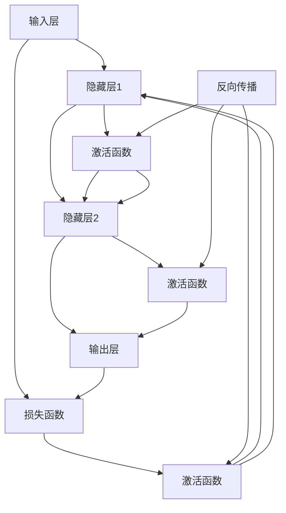

                 

# 神经网络：探索未知的领域

> 关键词：神经网络,深度学习,反向传播,梯度下降,权重更新,卷积神经网络,循环神经网络,卷积神经网络,长短期记忆网络

## 1. 背景介绍

### 1.1 问题由来
随着人工智能技术的不断进步，神经网络已成为现代深度学习技术的核心和基石。在图像识别、语音识别、自然语言处理、机器翻译等领域，神经网络不仅取得了令人瞩目的成果，也为传统人工智能方法的突破带来了新的思路。然而，神经网络背后的复杂数学原理和计算模型仍然充满了神秘感，常常让初学者望而却步。

本文将从神经网络的基本原理和计算模型出发，通过一系列核心概念和实际案例，深入浅出地介绍神经网络的核心思想和实践方法，希望能帮助读者理解和应用这一强大的技术工具。

## 2. 核心概念与联系

### 2.1 核心概念概述

神经网络是一种模仿生物神经系统的计算模型，通过多层神经元的组合来模拟数据之间的关系。核心概念包括：

- **神经元**：神经网络的构建块，每个神经元接收输入信号，加权求和，并应用激活函数，生成输出信号。
- **层**：神经元以层的形式排列，每个神经元只与前一层的神经元相连，形成不同的信息处理层次。
- **激活函数**：将神经元的输入信号映射到非线性空间，引入非线性关系，以表达复杂的数据特征。
- **损失函数**：衡量模型预测值与真实值之间的差异，指导模型优化。
- **反向传播**：通过链式法则计算梯度，自动更新模型参数。

这些概念之间的联系和作用通过以下Mermaid流程图展示：



这个流程图展示了神经网络的组成和数据流向。输入层接收原始数据，通过多个隐藏层进行特征提取和信息传递，最后通过输出层生成预测结果。激活函数和损失函数在各个层次之间引入非线性关系和模型优化机制，反向传播算法则自动更新模型参数以最小化损失函数。

## 3. 核心算法原理 & 具体操作步骤
### 3.1 算法原理概述

神经网络的核心原理是梯度下降和反向传播。梯度下降通过计算损失函数对模型参数的梯度，指导参数的更新方向，以最小化损失函数。反向传播则是通过链式法则计算梯度，将计算负担从输出层向输入层递推，使得每个参数的梯度可以高效计算。

### 3.2 算法步骤详解

神经网络的训练过程大致包括以下步骤：

1. **数据准备**：准备训练数据集，包括输入数据和对应的标签。通常需要将数据集分为训练集、验证集和测试集，以评估模型性能。
2. **模型初始化**：初始化模型参数，通常使用随机值。
3. **前向传播**：将输入数据通过模型进行前向传播，计算输出结果和损失函数。
4. **反向传播**：根据损失函数计算梯度，通过链式法则将梯度从输出层向输入层传播。
5. **参数更新**：根据梯度和学习率更新模型参数，减小损失函数。
6. **重复训练**：重复以上步骤，直至损失函数收敛或达到预设迭代次数。

### 3.3 算法优缺点

神经网络的优势在于其强大的非线性建模能力，能够处理复杂的非线性关系，适用于各类高维数据建模任务。然而，神经网络也存在以下缺点：

- **参数量巨大**：深层神经网络通常需要数百万甚至数亿的参数，计算资源消耗大。
- **模型复杂度**：深层神经网络结构复杂，容易过拟合，难以解释。
- **训练耗时长**：神经网络训练需要大量时间，特别是面对大数据集时。

### 3.4 算法应用领域

神经网络在众多领域都有广泛的应用：

- **图像识别**：卷积神经网络(CNN)通过卷积操作提取图像特征，适用于图像分类、目标检测等任务。
- **语音识别**：循环神经网络(RNN)通过时间序列信息处理语音信号，用于语音识别、语言建模等任务。
- **自然语言处理**：长短期记忆网络(LSTM)和Transformer通过序列建模能力，适用于机器翻译、文本生成等任务。
- **推荐系统**：通过神经网络模型挖掘用户行为和物品特征，实现个性化推荐。
- **控制系统**：神经网络模型可以用于机器人控制、自动驾驶等系统，实现智能决策和控制。

## 4. 数学模型和公式 & 详细讲解 & 举例说明

### 4.1 数学模型构建

神经网络的核心数学模型包括线性回归、逻辑回归、多元回归等线性模型，以及多层感知器(Multilayer Perceptron, MLP)、卷积神经网络(CNN)、循环神经网络(RNN)等非线性模型。这里以MLP为例，介绍神经网络的数学模型构建过程。

### 4.2 公式推导过程

以二分类问题为例，假设输入向量为 $x \in \mathbb{R}^d$，输出为 $y \in \{0,1\}$，MLP模型的结构如图：

```mermaid
graph LR
    x --> |W1| --> a1 --> |W2| --> a2 --> |W3| --> y
    W1 --> a1
    W2 --> a2
    W3 --> y
    W3 --> a2
    a1 --> W2
    a2 --> W3
```

其中，$a_i$ 表示第 $i$ 层神经元的输出。根据MLP模型，有：

$$
a_1 = W_1x + b_1
$$

$$
a_2 = W_2a_1 + b_2
$$

$$
y = W_3a_2 + b_3
$$

其中 $W_i$ 和 $b_i$ 分别为第 $i$ 层的权重和偏置。将 $y$ 带入损失函数 $L(y, \hat{y})$，常用的损失函数包括交叉熵损失：

$$
L(y, \hat{y}) = -(y \log \hat{y} + (1-y) \log (1-\hat{y}))
$$

将损失函数对 $W_i$ 和 $b_i$ 求导，得到梯度公式：

$$
\frac{\partial L}{\partial W_i} = \frac{\partial L}{\partial a_2} \frac{\partial a_2}{\partial a_1} \frac{\partial a_1}{\partial W_i} + \frac{\partial L}{\partial b_i}
$$

$$
\frac{\partial L}{\partial b_i} = \frac{\partial L}{\partial a_2}
$$

其中 $\frac{\partial L}{\partial a_2}$ 可以通过反向传播计算得到。

### 4.3 案例分析与讲解

以下是一个简单的二分类问题的代码实现，展示了MLP模型的前向传播和反向传播过程：

```python
import torch
import torch.nn as nn
import torch.optim as optim

class MLP(nn.Module):
    def __init__(self, input_size, hidden_size, output_size):
        super(MLP, self).__init__()
        self.fc1 = nn.Linear(input_size, hidden_size)
        self.fc2 = nn.Linear(hidden_size, output_size)
        self.relu = nn.ReLU()
        
    def forward(self, x):
        x = self.fc1(x)
        x = self.relu(x)
        x = self.fc2(x)
        return x
    
    def loss_func(self, y, y_pred):
        criterion = nn.CrossEntropyLoss()
        loss = criterion(y_pred, y)
        return loss

# 准备数据
input_size = 10
hidden_size = 5
output_size = 2
x = torch.randn(100, input_size)
y = torch.randint(output_size, (100,))

# 初始化模型和优化器
model = MLP(input_size, hidden_size, output_size)
optimizer = optim.SGD(model.parameters(), lr=0.01)

# 训练模型
criterion = nn.CrossEntropyLoss()
for i in range(1000):
    y_pred = model(x)
    loss = criterion(y_pred, y)
    optimizer.zero_grad()
    loss.backward()
    optimizer.step()

    if i % 100 == 0:
        print(f"Iteration {i}, Loss: {loss.item()}")

# 评估模型
y_pred = model(x).argmax(dim=1)
accuracy = (y_pred == y).float().mean()
print(f"Accuracy: {accuracy.item()}")
```

该代码展示了如何使用PyTorch实现一个简单的MLP模型，并通过梯度下降和反向传播进行训练和评估。通过不断迭代，模型的损失函数逐步减小，准确率逐步提升。

## 5. 项目实践：代码实例和详细解释说明
### 5.1 开发环境搭建

在进行神经网络项目实践时，需要搭建合适的开发环境。这里以PyTorch为例，介绍开发环境的搭建流程：

1. **安装Anaconda**：从官网下载并安装Anaconda，创建虚拟环境。

```bash
conda create -n pytorch-env python=3.8
conda activate pytorch-env
```

2. **安装PyTorch**：使用pip安装PyTorch及其依赖库。

```bash
pip install torch torchvision torchaudio cudatoolkit=11.1 -c pytorch -c conda-forge
```

3. **安装其他库**：安装必要的库，如numpy、pandas、scikit-learn、matplotlib等。

```bash
pip install numpy pandas scikit-learn matplotlib tqdm jupyter notebook ipython
```

完成以上步骤后，即可在虚拟环境中开始项目开发。

### 5.2 源代码详细实现

以下是一个使用PyTorch实现卷积神经网络(CNN)的代码示例，用于图像分类任务：

```python
import torch
import torch.nn as nn
import torch.optim as optim
from torchvision import datasets, transforms

class CNN(nn.Module):
    def __init__(self):
        super(CNN, self).__init__()
        self.conv1 = nn.Conv2d(3, 16, 3)
        self.relu = nn.ReLU()
        self.pool = nn.MaxPool2d(2)
        self.fc1 = nn.Linear(16*16*16, 120)
        self.fc2 = nn.Linear(120, 84)
        self.fc3 = nn.Linear(84, 10)
        
    def forward(self, x):
        x = self.conv1(x)
        x = self.relu(x)
        x = self.pool(x)
        x = x.view(-1, 16*16*16)
        x = self.fc1(x)
        x = self.relu(x)
        x = self.fc2(x)
        x = self.relu(x)
        x = self.fc3(x)
        return x

# 加载数据集
train_dataset = datasets.CIFAR10(root='./data', train=True, download=True, transform=transforms.ToTensor())
test_dataset = datasets.CIFAR10(root='./data', train=False, download=True, transform=transforms.ToTensor())

# 定义模型、损失函数和优化器
model = CNN()
criterion = nn.CrossEntropyLoss()
optimizer = optim.SGD(model.parameters(), lr=0.001, momentum=0.9)

# 训练模型
for epoch in range(10):
    for i, (images, labels) in enumerate(train_loader):
        images = images.to(device)
        labels = labels.to(device)
        
        optimizer.zero_grad()
        outputs = model(images)
        loss = criterion(outputs, labels)
        loss.backward()
        optimizer.step()
        
        if (i+1) % 100 == 0:
            print(f"Epoch [{epoch+1}/{10}], Step [{i+1}/{len(train_loader)}], Loss: {loss.item():.4f}")
            
    # 评估模型
    with torch.no_grad():
        correct = 0
        total = 0
        for images, labels in test_loader:
            images = images.to(device)
            labels = labels.to(device)
            
            outputs = model(images)
            _, predicted = torch.max(outputs.data, 1)
            total += labels.size(0)
            correct += (predicted == labels).sum().item()
            
        print(f"Accuracy of the network on the {len(test_loader)} test images: {100 * correct / total}%")
```

该代码展示了如何使用PyTorch实现一个简单的CNN模型，并用于图像分类任务。通过不断迭代，模型的准确率逐步提升，可以用于实际的图像识别任务。

### 5.3 代码解读与分析

在代码实现中，我们定义了卷积神经网络(CNN)模型，并通过数据加载器(train_loader和test_loader)加载数据集。在训练过程中，使用交叉熵损失函数和随机梯度下降优化器进行模型训练。在评估过程中，使用正确率评估模型性能。

需要注意的是，在实际项目中，还需要对模型进行保存和部署，以便后续使用。同时，还需要对模型进行调参和优化，以提升模型性能。

## 6. 实际应用场景
### 6.1 图像识别

神经网络在图像识别领域的应用非常广泛，通过卷积操作和池化操作，能够高效提取图像特征，并进行分类或检测。在实际应用中，可以使用预训练的卷积神经网络模型，如VGG、ResNet、Inception等，通过微调或者迁移学习，提升模型在特定任务上的性能。

### 6.2 语音识别

神经网络在语音识别领域也有广泛应用，通过循环神经网络(RNN)和长短期记忆网络(LSTM)，能够处理时间序列数据，实现语音识别、语言建模等任务。例如，可以使用预训练的Transformer模型，在音频数据上进行微调，提升模型的识别精度和鲁棒性。

### 6.3 自然语言处理

神经网络在自然语言处理领域也有重要应用，通过长短期记忆网络(LSTM)和Transformer，能够处理序列数据，实现机器翻译、文本生成等任务。例如，可以使用预训练的BERT模型，在特定任务上进行微调，提升模型的性能和泛化能力。

### 6.4 未来应用展望

随着神经网络技术的不断发展，未来的应用场景将更加广泛：

- **自动驾驶**：神经网络可以用于视觉识别、路径规划、决策控制等，提升自动驾驶系统的智能化水平。
- **智能家居**：神经网络可以用于语音识别、场景理解、行为预测等，提升智能家居的交互体验和自适应能力。
- **医疗诊断**：神经网络可以用于图像诊断、语音识别、病历分析等，提升医疗诊断的准确性和效率。
- **金融预测**：神经网络可以用于股票预测、信用评分、风险控制等，提升金融预测的精度和可靠性。

## 7. 工具和资源推荐
### 7.1 学习资源推荐

为了帮助开发者系统掌握神经网络技术，这里推荐一些优质的学习资源：

1. **深度学习基础课程**：斯坦福大学的CS231n课程，涵盖了深度学习的基础知识和经典模型，是入门深度学习的良好资源。
2. **TensorFlow官方文档**：TensorFlow的官方文档，提供了详细的API说明和案例代码，适合学习和开发神经网络。
3. **PyTorch官方文档**：PyTorch的官方文档，提供了丰富的模型和工具支持，适合学习和开发神经网络。
4. **《深度学习》书籍**：Ian Goodfellow、Yoshua Bengio、Aaron Courville合著的经典教材，全面介绍了深度学习的理论和实践。
5. **《动手学深度学习》书籍**：李沐、李航等人合著的实践性教材，通过实例代码展示深度学习的开发流程。

通过对这些资源的学习实践，相信你一定能够快速掌握神经网络的核心思想和实践方法，并用于解决实际的NLP问题。

### 7.2 开发工具推荐

高效的开发离不开优秀的工具支持。以下是几款用于神经网络开发的常用工具：

1. **TensorFlow**：由Google主导开发的深度学习框架，支持分布式训练和GPU加速，适合大规模工程应用。
2. **PyTorch**：由Facebook主导开发的深度学习框架，灵活易用，适合快速迭代研究和实践。
3. **Keras**：高层次的深度学习API，简单易用，适合快速构建神经网络模型。
4. **MXNet**：由亚马逊主导开发的深度学习框架，支持分布式训练和多种编程语言支持，适合工业应用。
5. **JAX**：由Google开发的深度学习框架，支持高性能计算和自动微分，适合研究和开发。

合理利用这些工具，可以显著提升神经网络项目的开发效率，加快创新迭代的步伐。

### 7.3 相关论文推荐

神经网络的发展离不开学界的持续研究。以下是几篇奠基性的相关论文，推荐阅读：

1. **反向传播算法**：Y. LeCun等人在1988年提出的反向传播算法，奠定了深度学习的基础。
2. **卷积神经网络**：Y. LeCun等人在1998年提出的卷积神经网络，开启了深度学习在计算机视觉领域的广泛应用。
3. **长短期记忆网络**：S. Hochreiter等人在1997年提出的长短期记忆网络，用于处理时间序列数据，提升了序列建模的性能。
4. **Transformer**：A. Vaswani等人在2017年提出的Transformer，通过自注意力机制，提升了序列建模的效率和效果。

这些论文代表了大神经网络的发展脉络，通过学习这些前沿成果，可以帮助研究者把握学科前进方向，激发更多的创新灵感。

## 8. 总结：未来发展趋势与挑战

### 8.1 总结

本文对神经网络的基本原理和计算模型进行了全面系统的介绍。从简单的线性模型到复杂的多层感知器，从基本的梯度下降算法到高效的反向传播，从传统的CNN到新颖的Transformer，展现了神经网络技术的强大生命力。通过系统梳理，读者可以理解神经网络的核心理念，并掌握其应用方法。

## 8.2 未来发展趋势

展望未来，神经网络技术将呈现以下几个发展趋势：

1. **更深的神经网络**：随着计算资源的提升，更深层的神经网络将不断涌现，提供更丰富的特征表示和更强的建模能力。
2. **更高效的计算模型**：新的计算模型，如量子计算、光子计算等，将为神经网络提供更高的计算效率和更强的并行处理能力。
3. **更智能的决策模型**：神经网络将与强化学习、因果推理等技术结合，提升决策模型的智能水平和鲁棒性。
4. **更普适的知识图谱**：神经网络将与知识图谱、逻辑规则等结合，提升模型的泛化能力和可解释性。
5. **更广泛的应用场景**：神经网络将进一步应用于医疗、金融、制造、交通等多个领域，为各行各业带来变革性影响。

## 8.3 面临的挑战

尽管神经网络技术已经取得了瞩目成就，但在迈向更加智能化、普适化应用的过程中，仍面临以下挑战：

1. **资源瓶颈**：深层神经网络需要巨大的计算资源，对于小规模应用场景可能难以负担。
2. **模型复杂性**：神经网络模型结构复杂，难以解释和调试。
3. **数据依赖**：神经网络需要大量标注数据进行训练，对于特定领域的任务，获取高质量标注数据成本高。
4. **过拟合风险**：深层神经网络容易过拟合，难以处理噪声和异常数据。
5. **鲁棒性不足**：神经网络面对新数据和异常情况，泛化性能可能不足。
6. **伦理道德问题**：神经网络模型可能学习到有害信息，传递偏见，引发伦理道德问题。

## 8.4 研究展望

面对神经网络面临的挑战，未来的研究需要在以下几个方面寻求新的突破：

1. **参数高效的模型设计**：开发更加参数高效的模型，如Transformer、LoRA等，在保证性能的同时，降低计算资源消耗。
2. **高效的优化算法**：开发更加高效的优化算法，如AdamW、Adafactor等，提高模型训练速度和精度。
3. **可解释性研究**：研究如何增强神经网络的可解释性，提升模型的可信度和可控性。
4. **鲁棒性和泛化能力提升**：通过数据增强、对抗训练等技术，提升模型的鲁棒性和泛化能力。
5. **多模态信息融合**：研究如何将神经网络与其他模态信息（如图像、语音、文本等）进行融合，提升模型的综合能力。

## 9. 附录：常见问题与解答

**Q1：神经网络模型如何训练？**

A: 神经网络的训练过程包括前向传播和反向传播两个步骤。首先，通过前向传播计算模型输出和损失函数，然后通过反向传播计算梯度，更新模型参数。重复这个过程，直至损失函数收敛或达到预设迭代次数。

**Q2：神经网络中常用的激活函数有哪些？**

A: 神经网络中常用的激活函数包括：
1. Sigmoid函数：将输入值映射到0到1之间，用于二分类问题。
2. Tanh函数：将输入值映射到-1到1之间，用于多分类问题。
3. ReLU函数：引入非线性关系，加速训练过程，是目前最常用的激活函数。
4. Softmax函数：将输出值映射到0到1之间，并归一化，用于多分类问题。

**Q3：神经网络中如何防止过拟合？**

A: 防止神经网络过拟合的方法包括：
1. 数据增强：通过数据扩充技术，丰富训练集多样性。
2. 正则化：使用L2正则、Dropout等技术，避免过拟合。
3. 早停策略：在验证集上评估模型性能，一旦性能不再提升，则停止训练。
4. 模型压缩：通过剪枝、量化等技术，减少模型参数量，提高泛化能力。

**Q4：神经网络在实际应用中需要注意哪些问题？**

A: 神经网络在实际应用中需要注意以下问题：
1. 模型训练时间长，需要合理配置资源。
2. 模型复杂度高，需要谨慎选择模型结构和超参数。
3. 模型易过拟合，需要进行数据增强和正则化。
4. 模型缺乏可解释性，需要合理使用可解释性技术。
5. 模型鲁棒性不足，需要进行对抗训练和鲁棒性测试。

通过这些问题解答，相信你能够更好地理解神经网络的原理和应用方法，并应用于实际的NLP问题解决中。

