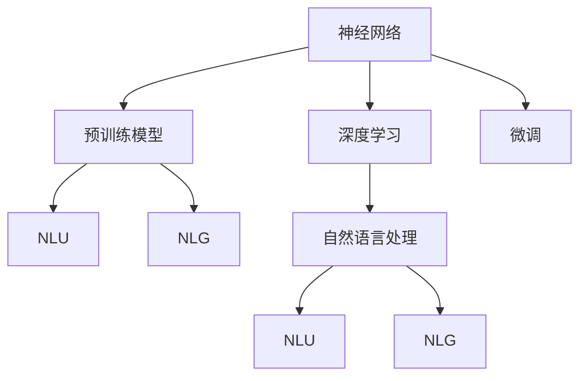

                 

# 神经网络：自然语言处理的新突破

> 关键词：神经网络, 自然语言处理, 深度学习, 预训练模型, 微调, 语言模型, 自然语言理解, 自然语言生成

## 1. 背景介绍

### 1.1 问题由来
近年来，随着深度学习技术的快速发展，人工智能在自然语言处理(Natural Language Processing, NLP)领域取得了巨大的突破。深度神经网络在语言模型、机器翻译、文本分类、情感分析等任务上取得了显著成果，极大提升了NLP应用的性能和应用范围。

然而，传统的基于规则和统计的方法无法处理复杂、模糊的自然语言现象，而基于深度学习的神经网络方法能够自动学习语言特征，具有强大的泛化能力。但是，神经网络的训练需要大量的标注数据，而且其黑箱特性也使得模型的可解释性较差。

因此，神经网络在自然语言处理中的应用依然存在许多挑战。为了解决这些问题，研究者们提出了预训练模型和微调等技术，使得神经网络在NLP中的应用更加高效和可靠。

### 1.2 问题核心关键点
神经网络在自然语言处理中的应用，主要集中在以下几个关键点：

- 预训练模型：通过大规模无标签文本数据进行预训练，学习通用的语言表示，为下游任务提供强大的特征提取能力。
- 微调技术：在下游任务的少量标注数据上进行有监督的微调，使得模型更好地适应特定任务，提升模型性能。
- 自然语言理解(NLU)和自然语言生成(NLG)：利用神经网络模型对自然语言进行理解和生成，使得机器能够更好地与人类进行交互。
- 深度学习框架：TensorFlow、PyTorch等深度学习框架为神经网络的实现提供了强大的支持。

这些关键点构成了神经网络在NLP应用的基础框架，使得深度学习技术得以在NLP领域取得突破。

### 1.3 问题研究意义
神经网络在NLP中的应用，对于拓展人工智能的应用范围，提升自然语言处理的性能，加速NLP技术的产业化进程，具有重要意义：

1. 提升任务性能：神经网络能够自动学习语言特征，具有强大的泛化能力，能够在各种NLP任务上取得优秀的性能。
2. 降低开发成本：通过预训练模型和微调技术，可以显著减少从头开发所需的标注数据和计算资源。
3. 加速应用部署：神经网络模型的训练和推理速度较快，易于部署到实际应用中，加快NLP应用的落地。
4. 促进技术创新：预训练模型和微调技术催生了许多新的研究方向，如Transformer、BERT等模型的提出，推动了NLP技术的创新。
5. 推动产业升级：神经网络技术的应用，使得NLP技术更容易被各行各业采用，为传统行业数字化转型提供了新的技术路径。

## 2. 核心概念与联系

### 2.1 核心概念概述

为更好地理解神经网络在NLP中的应用，本节将介绍几个密切相关的核心概念：

- 神经网络(Neural Network)：由多个神经元组成的计算模型，通过反向传播算法进行训练，可以用于分类、回归、语言模型等多种任务。
- 深度学习(Deep Learning)：一种基于多层神经网络的机器学习方法，能够自动学习复杂的数据特征，适用于图像、文本等高维度数据的处理。
- 预训练模型(Pre-trained Model)：通过大规模无标签文本数据进行预训练，学习通用的语言表示，为下游任务提供强大的特征提取能力。
- 微调(Fine-tuning)：在下游任务的少量标注数据上进行有监督的微调，使得模型更好地适应特定任务，提升模型性能。
- 自然语言理解(NLU)：通过神经网络模型对自然语言进行理解，如语言模型、情感分析、命名实体识别等任务。
- 自然语言生成(NLG)：通过神经网络模型生成自然语言，如文本摘要、机器翻译、对话生成等任务。
- 深度学习框架(Deep Learning Framework)：如TensorFlow、PyTorch等框架，为神经网络的实现提供了强大的支持。

这些核心概念之间的逻辑关系可以通过以下Mermaid流程图来展示：



这个流程图展示了神经网络、深度学习、预训练模型、微调、自然语言理解、自然语言生成以及自然语言处理之间的逻辑关系：

1. 神经网络是深度学习的基础，深度学习通过多层神经网络来自动学习数据特征。
2. 预训练模型通过大规模无标签文本数据进行预训练，学习通用的语言表示，为下游任务提供强大的特征提取能力。
3. 微调在下游任务的少量标注数据上进行有监督的微调，使得模型更好地适应特定任务，提升模型性能。
4. 自然语言理解通过神经网络模型对自然语言进行理解，如语言模型、情感分析、命名实体识别等任务。
5. 自然语言生成通过神经网络模型生成自然语言，如文本摘要、机器翻译、对话生成等任务。
6. 自然语言处理是神经网络和微调技术的综合应用，涵盖自然语言理解、自然语言生成等多个子任务。

这些核心概念共同构成了神经网络在NLP应用的基础框架，使得深度学习技术得以在NLP领域取得突破。

## 3. 核心算法原理 & 具体操作步骤

### 3.1 算法原理概述

神经网络在自然语言处理中的应用，主要是通过深度学习框架来实现的。其核心思想是：

1. 使用神经网络模型对自然语言进行特征提取，学习通用的语言表示。
2. 通过大规模无标签文本数据进行预训练，学习到语言特征。
3. 在下游任务的少量标注数据上进行有监督的微调，提升模型在特定任务上的性能。

深度学习框架提供了强大的计算图支持和丰富的优化算法，使得神经网络模型易于训练和优化。

### 3.2 算法步骤详解

神经网络在NLP中的应用，主要包括以下几个关键步骤：

**Step 1: 准备预训练模型和数据集**
- 选择合适的预训练模型，如BERT、GPT等。
- 准备下游任务的数据集，划分为训练集、验证集和测试集。一般要求标注数据与预训练数据的分布不要差异过大。

**Step 2: 添加任务适配层**
- 根据任务类型，在预训练模型顶层设计合适的输出层和损失函数。
- 对于分类任务，通常在顶层添加线性分类器和交叉熵损失函数。
- 对于生成任务，通常使用语言模型的解码器输出概率分布，并以负对数似然为损失函数。

**Step 3: 设置微调超参数**
- 选择合适的优化算法及其参数，如 AdamW、SGD 等，设置学习率、批大小、迭代轮数等。
- 设置正则化技术及强度，包括权重衰减、Dropout、Early Stopping等。
- 确定冻结预训练参数的策略，如仅微调顶层，或全部参数都参与微调。

**Step 4: 执行梯度训练**
- 将训练集数据分批次输入模型，前向传播计算损失函数。
- 反向传播计算参数梯度，根据设定的优化算法和学习率更新模型参数。
- 周期性在验证集上评估模型性能，根据性能指标决定是否触发 Early Stopping。
- 重复上述步骤直到满足预设的迭代轮数或 Early Stopping 条件。

**Step 5: 测试和部署**
- 在测试集上评估微调后模型，对比微调前后的精度提升。
- 使用微调后的模型对新样本进行推理预测，集成到实际的应用系统中。
- 持续收集新的数据，定期重新微调模型，以适应数据分布的变化。

以上是神经网络在NLP应用的一般流程。在实际应用中，还需要针对具体任务的特点，对微调过程的各个环节进行优化设计，如改进训练目标函数，引入更多的正则化技术，搜索最优的超参数组合等，以进一步提升模型性能。

### 3.3 算法优缺点

神经网络在NLP中的应用，具有以下优点：

1. 强大的泛化能力：神经网络能够自动学习复杂的数据特征，具有很强的泛化能力，适用于各种NLP任务。
2. 高效的特征提取：通过预训练模型和微调技术，可以显著减少从头开发所需的标注数据和计算资源。
3. 灵活的模型设计：神经网络模型可以灵活地设计，适用于各种不同的NLP任务。
4. 实时的应用部署：神经网络模型的训练和推理速度较快，易于部署到实际应用中，加快NLP应用的落地。

同时，该方法也存在一定的局限性：

1. 高标注成本：神经网络的训练需要大量的标注数据，标注成本较高。
2. 可解释性差：神经网络的决策过程缺乏可解释性，难以对其推理逻辑进行分析和调试。
3. 过拟合风险：神经网络模型容易过拟合，特别是在数据量较小的情况下。
4. 计算资源需求高：神经网络模型需要大量的计算资源，特别是在大规模数据集上进行预训练和微调时。
5. 模型复杂度高：神经网络模型的结构复杂，调试和优化难度较大。

尽管存在这些局限性，但神经网络在NLP中的应用已经取得了显著成果，未来仍有很大的发展潜力。

### 3.4 算法应用领域

神经网络在NLP中的应用，已经涵盖了以下几个主要领域：

- 语言模型：通过神经网络模型学习语言的概率分布，用于自动语言生成和语言理解。
- 文本分类：通过神经网络模型对文本进行分类，如情感分析、主题分类、意图识别等任务。
- 命名实体识别：通过神经网络模型识别文本中的人名、地名、机构名等特定实体。
- 关系抽取：通过神经网络模型从文本中抽取实体之间的语义关系。
- 问答系统：通过神经网络模型对自然语言问题给出答案。
- 机器翻译：通过神经网络模型将源语言文本翻译成目标语言。
- 文本摘要：通过神经网络模型将长文本压缩成简短摘要。
- 对话系统：通过神经网络模型使机器能够与人自然对话。

除了这些经典任务外，神经网络在NLP中还有许多创新应用，如可控文本生成、常识推理、代码生成、数据增强等，为NLP技术带来了新的突破。

## 4. 数学模型和公式 & 详细讲解

### 4.1 数学模型构建

神经网络在NLP中的应用，主要涉及以下几个数学模型：

- 语言模型：用于学习文本的概率分布，衡量模型在特定位置的预测能力。
- 分类模型：用于对文本进行分类，如情感分析、主题分类等任务。
- 生成模型：用于自动生成文本，如文本摘要、对话生成等任务。

以BERT模型为例，其数学模型可以表示为：

$$
\text{BERT}(x) = \text{Feed Forward}(\text{Self-Attention}(\text{LayerNorm}(x + \text{Positional Encoding})))
$$

其中，$\text{Feed Forward}$ 表示前馈神经网络，$\text{Self-Attention}$ 表示自注意力机制，$\text{LayerNorm}$ 表示归一化层，$\text{Positional Encoding}$ 表示位置编码，$x$ 表示输入文本。

### 4.2 公式推导过程

下面以BERT模型为例，推导其语言模型的概率计算公式。

假设输入文本 $x$ 的长度为 $n$，则其语言模型 $P(x)$ 可以表示为：

$$
P(x) = \prod_{i=1}^n P(x_i | x_{<i})
$$

其中 $P(x_i | x_{<i})$ 表示在给定前面的 $i-1$ 个单词的情况下，第 $i$ 个单词出现的概率。

由于BERT模型是基于Transformer的，其自注意力机制可以表示为：

$$
\text{Attention}(Q, K, V) = \text{Softmax}(\frac{QK^T}{\sqrt{d_k}})V
$$

其中 $Q$、$K$、$V$ 分别表示查询向量、键向量和值向量，$d_k$ 表示向量维度。

在计算概率时，可以将其转化为对数形式：

$$
\log P(x) = \sum_{i=1}^n \log P(x_i | x_{<i})
$$

通过反向传播算法，可以将概率的梯度计算出来，用于更新模型的参数。

### 4.3 案例分析与讲解

以BERT模型在情感分析任务上的应用为例，进行详细讲解。

首先，需要对情感分析数据集进行标注，每个样本包含一个文本和对应的情感标签。然后，使用BERT模型对文本进行编码，得到一个固定长度的向量表示。最后，在向量表示上进行分类，预测文本的情感。

具体步骤如下：

1. 准备数据集：将情感分析数据集划分为训练集、验证集和测试集，并进行标注。
2. 加载BERT模型：使用HuggingFace库加载预训练的BERT模型。
3. 数据预处理：将文本转换为BERT模型所需的格式，并进行分词和编码。
4. 训练模型：使用交叉熵损失函数和AdamW优化器，对BERT模型进行微调，最小化损失函数。
5. 评估模型：在验证集和测试集上评估模型性能，如准确率、F1分数等指标。
6. 应用模型：使用微调后的BERT模型对新文本进行情感分析，输出情感标签。

## 5. 项目实践：代码实例和详细解释说明

### 5.1 开发环境搭建

在进行神经网络在NLP应用实践前，需要先搭建好开发环境。以下是使用Python进行PyTorch开发的环境配置流程：

1. 安装Anaconda：从官网下载并安装Anaconda，用于创建独立的Python环境。

2. 创建并激活虚拟环境：
```bash
conda create -n pytorch-env python=3.8 
conda activate pytorch-env
```

3. 安装PyTorch：根据CUDA版本，从官网获取对应的安装命令。例如：
```bash
conda install pytorch torchvision torchaudio cudatoolkit=11.1 -c pytorch -c conda-forge
```

4. 安装Transformers库：
```bash
pip install transformers
```

5. 安装各类工具包：
```bash
pip install numpy pandas scikit-learn matplotlib tqdm jupyter notebook ipython
```

完成上述步骤后，即可在`pytorch-env`环境中开始神经网络在NLP应用的实践。

### 5.2 源代码详细实现

下面以BERT模型在情感分析任务上的应用为例，给出使用Transformers库进行BERT模型微调的PyTorch代码实现。

首先，定义情感分析任务的数据处理函数：

```python
from transformers import BertTokenizer
from torch.utils.data import Dataset
import torch

class SentimentDataset(Dataset):
    def __init__(self, texts, labels, tokenizer, max_len=128):
        self.texts = texts
        self.labels = labels
        self.tokenizer = tokenizer
        self.max_len = max_len
        
    def __len__(self):
        return len(self.texts)
    
    def __getitem__(self, item):
        text = self.texts[item]
        label = self.labels[item]
        
        encoding = self.tokenizer(text, return_tensors='pt', max_length=self.max_len, padding='max_length', truncation=True)
        input_ids = encoding['input_ids'][0]
        attention_mask = encoding['attention_mask'][0]
        
        # 对标签进行编码
        label = label2id[label]
        
        return {'input_ids': input_ids, 
                'attention_mask': attention_mask,
                'labels': label}

# 标签与id的映射
label2id = {'positive': 1, 'negative': 0}

# 创建dataset
tokenizer = BertTokenizer.from_pretrained('bert-base-uncased')

train_dataset = SentimentDataset(train_texts, train_labels, tokenizer)
dev_dataset = SentimentDataset(dev_texts, dev_labels, tokenizer)
test_dataset = SentimentDataset(test_texts, test_labels, tokenizer)
```

然后，定义模型和优化器：

```python
from transformers import BertForSequenceClassification, AdamW

model = BertForSequenceClassification.from_pretrained('bert-base-uncased', num_labels=2)

optimizer = AdamW(model.parameters(), lr=2e-5)
```

接着，定义训练和评估函数：

```python
from torch.utils.data import DataLoader
from tqdm import tqdm
from sklearn.metrics import accuracy_score, precision_recall_fscore_support

device = torch.device('cuda') if torch.cuda.is_available() else torch.device('cpu')
model.to(device)

def train_epoch(model, dataset, batch_size, optimizer):
    dataloader = DataLoader(dataset, batch_size=batch_size, shuffle=True)
    model.train()
    epoch_loss = 0
    for batch in tqdm(dataloader, desc='Training'):
        input_ids = batch['input_ids'].to(device)
        attention_mask = batch['attention_mask'].to(device)
        labels = batch['labels'].to(device)
        model.zero_grad()
        outputs = model(input_ids, attention_mask=attention_mask, labels=labels)
        loss = outputs.loss
        epoch_loss += loss.item()
        loss.backward()
        optimizer.step()
    return epoch_loss / len(dataloader)

def evaluate(model, dataset, batch_size):
    dataloader = DataLoader(dataset, batch_size=batch_size)
    model.eval()
    preds, labels = [], []
    with torch.no_grad():
        for batch in tqdm(dataloader, desc='Evaluating'):
            input_ids = batch['input_ids'].to(device)
            attention_mask = batch['attention_mask'].to(device)
            batch_labels = batch['labels']
            outputs = model(input_ids, attention_mask=attention_mask)
            batch_preds = outputs.logits.argmax(dim=1).to('cpu').tolist()
            batch_labels = batch_labels.to('cpu').tolist()
            for pred, label in zip(batch_preds, batch_labels):
                preds.append(pred)
                labels.append(label)
                
    print(f'Accuracy: {accuracy_score(labels, preds)}')
    print(f'Precision, Recall, F1-Score: {precision_recall_fscore_support(labels, preds, average='macro')}')
```

最后，启动训练流程并在测试集上评估：

```python
epochs = 5
batch_size = 16

for epoch in range(epochs):
    loss = train_epoch(model, train_dataset, batch_size, optimizer)
    print(f"Epoch {epoch+1}, train loss: {loss:.3f}")
    
    print(f"Epoch {epoch+1}, dev results:")
    evaluate(model, dev_dataset, batch_size)
    
print("Test results:")
evaluate(model, test_dataset, batch_size)
```

以上就是使用PyTorch进行BERT模型在情感分析任务上微调的完整代码实现。可以看到，得益于Transformers库的强大封装，我们可以用相对简洁的代码完成BERT模型的加载和微调。

### 5.3 代码解读与分析

让我们再详细解读一下关键代码的实现细节：

**SentimentDataset类**：
- `__init__`方法：初始化文本、标签、分词器等关键组件。
- `__len__`方法：返回数据集的样本数量。
- `__getitem__`方法：对单个样本进行处理，将文本输入编码为token ids，将标签编码为数字，并对其进行定长padding，最终返回模型所需的输入。

**label2id和id2label字典**：
- 定义了标签与数字id之间的映射关系，用于将标签解码为原始文本。

**训练和评估函数**：
- 使用PyTorch的DataLoader对数据集进行批次化加载，供模型训练和推理使用。
- 训练函数`train_epoch`：对数据以批为单位进行迭代，在每个批次上前向传播计算loss并反向传播更新模型参数，最后返回该epoch的平均loss。
- 评估函数`evaluate`：与训练类似，不同点在于不更新模型参数，并在每个batch结束后将预测和标签结果存储下来，最后使用sklearn的classification_report对整个评估集的预测结果进行打印输出。

**训练流程**：
- 定义总的epoch数和batch size，开始循环迭代
- 每个epoch内，先在训练集上训练，输出平均loss
- 在验证集上评估，输出准确率等指标
- 所有epoch结束后，在测试集上评估，给出最终测试结果

可以看到，PyTorch配合Transformers库使得BERT微调的代码实现变得简洁高效。开发者可以将更多精力放在数据处理、模型改进等高层逻辑上，而不必过多关注底层的实现细节。

当然，工业级的系统实现还需考虑更多因素，如模型的保存和部署、超参数的自动搜索、更灵活的任务适配层等。但核心的微调范式基本与此类似。

## 6. 实际应用场景

### 6.1 智能客服系统

基于神经网络的对话技术，可以广泛应用于智能客服系统的构建。传统客服往往需要配备大量人力，高峰期响应缓慢，且一致性和专业性难以保证。而使用预训练神经网络对话模型，可以7x24小时不间断服务，快速响应客户咨询，用自然流畅的语言解答各类常见问题。

在技术实现上，可以收集企业内部的历史客服对话记录，将问题和最佳答复构建成监督数据，在此基础上对预训练对话模型进行微调。微调后的对话模型能够自动理解用户意图，匹配最合适的答案模板进行回复。对于客户提出的新问题，还可以接入检索系统实时搜索相关内容，动态组织生成回答。如此构建的智能客服系统，能大幅提升客户咨询体验和问题解决效率。

### 6.2 金融舆情监测

金融机构需要实时监测市场舆论动向，以便及时应对负面信息传播，规避金融风险。传统的人工监测方式成本高、效率低，难以应对网络时代海量信息爆发的挑战。基于神经网络的文本分类和情感分析技术，为金融舆情监测提供了新的解决方案。

具体而言，可以收集金融领域相关的新闻、报道、评论等文本数据，并对其进行主题标注和情感标注。在此基础上对预训练语言模型进行微调，使其能够自动判断文本属于何种主题，情感倾向是正面、中性还是负面。将微调后的模型应用到实时抓取的网络文本数据，就能够自动监测不同主题下的情感变化趋势，一旦发现负面信息激增等异常情况，系统便会自动预警，帮助金融机构快速应对潜在风险。

### 6.3 个性化推荐系统

当前的推荐系统往往只依赖用户的历史行为数据进行物品推荐，无法深入理解用户的真实兴趣偏好。基于神经网络的推荐系统可以更好地挖掘用户行为背后的语义信息，从而提供更精准、多样的推荐内容。

在实践中，可以收集用户浏览、点击、评论、分享等行为数据，提取和用户交互的物品标题、描述、标签等文本内容。将文本内容作为模型输入，用户的后续行为（如是否点击、购买等）作为监督信号，在此基础上微调预训练语言模型。微调后的模型能够从文本内容中准确把握用户的兴趣点。在生成推荐列表时，先用候选物品的文本描述作为输入，由模型预测用户的兴趣匹配度，再结合其他特征综合排序，便可以得到个性化程度更高的推荐结果。

### 6.4 未来应用展望

随着神经网络在NLP中的应用不断拓展，其前景将更加广阔。未来，神经网络将在更多领域得到应用，为传统行业带来变革性影响。

在智慧医疗领域，基于神经网络的医疗问答、病历分析、药物研发等应用将提升医疗服务的智能化水平，辅助医生诊疗，加速新药开发进程。

在智能教育领域，基于神经网络的作业批改、学情分析、知识推荐等应用将因材施教，促进教育公平，提高教学质量。

在智慧城市治理中，基于神经网络的图像识别、语音识别、自然语言处理等技术，将提高城市管理的自动化和智能化水平，构建更安全、高效的未来城市。

此外，在企业生产、社会治理、文娱传媒等众多领域，基于神经网络的推荐、问答、翻译等应用也将不断涌现，为经济社会发展注入新的动力。相信随着技术的日益成熟，神经网络在NLP中的应用将更加广泛，推动人工智能技术在各行业的规模化落地。

## 7. 工具和资源推荐

### 7.1 学习资源推荐

为了帮助开发者系统掌握神经网络在NLP中的应用理论基础和实践技巧，这里推荐一些优质的学习资源：

1. 《深度学习与自然语言处理》书籍：详细介绍了神经网络在自然语言处理中的各种应用，包括语言模型、文本分类、情感分析、机器翻译等。
2. 《自然语言处理综述》课程：斯坦福大学开设的NLP综述课程，涵盖了NLP领域的各个方面，包括基础知识、经典模型、最新进展等。
3. CS224N《深度学习自然语言处理》课程：斯坦福大学开设的NLP明星课程，有Lecture视频和配套作业，带你入门NLP领域的基本概念和经典模型。
4. 《Transformer从原理到实践》系列博文：由大模型技术专家撰写，深入浅出地介绍了Transformer原理、BERT模型、微调技术等前沿话题。
5. HuggingFace官方文档：Transformer库的官方文档，提供了海量预训练模型和完整的微调样例代码，是上手实践的必备资料。

通过对这些资源的学习实践，相信你一定能够快速掌握神经网络在NLP应用的精髓，并用于解决实际的NLP问题。
###  7.2 开发工具推荐

高效的开发离不开优秀的工具支持。以下是几款用于神经网络在NLP应用开发的常用工具：

1. PyTorch：基于Python的开源深度学习框架，灵活动态的计算图，适合快速迭代研究。大部分预训练语言模型都有PyTorch版本的实现。
2. TensorFlow：由Google主导开发的开源深度学习框架，生产部署方便，适合大规模工程应用。同样有丰富的预训练语言模型资源。
3. Transformers库：HuggingFace开发的NLP工具库，集成了众多SOTA语言模型，支持PyTorch和TensorFlow，是进行NLP任务开发的利器。
4. Weights & Biases：模型训练的实验跟踪工具，可以记录和可视化模型训练过程中的各项指标，方便对比和调优。与主流深度学习框架无缝集成。
5. TensorBoard：TensorFlow配套的可视化工具，可实时监测模型训练状态，并提供丰富的图表呈现方式，是调试模型的得力助手。

合理利用这些工具，可以显著提升神经网络在NLP应用的开发效率，加快创新迭代的步伐。

### 7.3 相关论文推荐

神经网络在NLP中的应用源于学界的持续研究。以下是几篇奠基性的相关论文，推荐阅读：

1. Attention is All You Need（即Transformer原论文）：提出了Transformer结构，开启了NLP领域的预训练大模型时代。
2. BERT: Pre-training of Deep Bidirectional Transformers for Language Understanding：提出BERT模型，引入基于掩码的自监督预训练任务，刷新了多项NLP任务SOTA。
3. Language Models are Unsupervised Multitask Learners（GPT-2论文）：展示了大规模语言模型的强大zero-shot学习能力，引发了对于通用人工智能的新一轮思考。
4. Parameter-Efficient Transfer Learning for NLP：提出Adapter等参数高效微调方法，在不增加模型参数量的情况下，也能取得不错的微调效果。
5. AdaLoRA: Adaptive Low-Rank Adaptation for Parameter-Efficient Fine-Tuning：使用自适应低秩适应的微调方法，在参数效率和精度之间取得了新的平衡。
6. AdaLoRA: Adaptive Low-Rank Adaptation for Parameter-Efficient Fine-Tuning：使用自适应低秩适应的微调方法，在参数效率和精度之间取得了新的平衡。

这些论文代表了大语言模型在NLP应用的发展脉络。通过学习这些前沿成果，可以帮助研究者把握学科前进方向，激发更多的创新灵感。

## 8. 总结：未来发展趋势与挑战

### 8.1 总结

本文对神经网络在自然语言处理中的应用进行了全面系统的介绍。首先阐述了神经网络在NLP应用的理论背景和实践意义，明确了神经网络在语言理解、语言生成、分类、推理等任务中的重要地位。其次，从原理到实践，详细讲解了神经网络在NLP中的核心算法和具体操作步骤，给出了神经网络在NLP应用的完整代码实例。同时，本文还广泛探讨了神经网络在智能客服、金融舆情、个性化推荐等多个行业领域的应用前景，展示了神经网络在NLP应用的巨大潜力。此外，本文精选了神经网络在NLP应用的学习资源，力求为读者提供全方位的技术指引。

通过本文的系统梳理，可以看到，神经网络在NLP中的应用已经成为NLP领域的重要范式，极大地拓展了预训练语言模型的应用边界，催生了更多的落地场景。受益于大规模语料的预训练和微调技术的不断发展，神经网络在NLP领域取得了显著的成果，推动了NLP技术的产业化进程。未来，伴随预训练语言模型和微调方法的持续演进，相信NLP技术将在更广阔的应用领域大放异彩，深刻影响人类的生产生活方式。

### 8.2 未来发展趋势

展望未来，神经网络在NLP中的应用将呈现以下几个发展趋势：

1. 模型规模持续增大。随着算力成本的下降和数据规模的扩张，预训练语言模型的参数量还将持续增长。超大规模语言模型蕴含的丰富语言知识，有望支撑更加复杂多变的下游任务微调。
2. 微调方法日趋多样。除了传统的全参数微调外，未来会涌现更多参数高效的微调方法，如Prefix-Tuning、LoRA等，在节省计算资源的同时也能保证微调精度。
3. 持续学习成为常态。随着数据分布的不断变化，神经网络模型也需要持续学习新知识以保持性能。如何在不遗忘原有知识的同时，高效吸收新样本信息，将成为重要的研究课题。
4. 标注样本需求降低。受启发于提示学习(Prompt-based Learning)的思路，未来的神经网络将更好地利用大模型的语言理解能力，通过更加巧妙的任务描述，在更少的标注样本上也能实现理想的微调效果。
5. 少样本学习(Few-shot Learning)和零样本学习(Zero-shot Learning)将得到更多关注。在标注数据稀缺的情况下，通过引入 Prompt Learning，可以更灵活地利用预训练语言模型的知识，实现更高效、更智能的微调。
6. 多模态微调崛起。当前的微调主要聚焦于纯文本数据，未来会进一步拓展到图像、视频、语音等多模态数据微调。多模态信息的融合，将显著提升神经网络对现实世界的理解和建模能力。
7. 模型通用性增强。经过海量数据的预训练和多领域任务的微调，未来的神经网络将具备更强大的常识推理和跨领域迁移能力，逐步迈向通用人工智能(AGI)的目标。

以上趋势凸显了神经网络在NLP应用的发展前景。这些方向的探索发展，必将进一步提升神经网络在NLP系统的性能和应用范围，为人类认知智能的进化带来深远影响。

### 8.3 面临的挑战

尽管神经网络在NLP中的应用已经取得了显著成果，但在迈向更加智能化、普适化应用的过程中，它仍面临着诸多挑战：

1. 标注成本瓶颈。尽管神经网络的训练需要大量的标注数据，但标注成本依然较高，特别是在长尾应用场景，难以获得充足的高质量标注数据，成为制约微调性能的瓶颈。如何进一步降低神经网络对标注样本的依赖，将是一大难题。
2. 模型鲁棒性不足。当前神经网络面对域外数据时，泛化性能往往大打折扣。对于测试样本的微小扰动，神经网络模型的预测也容易发生波动。如何提高神经网络模型的鲁棒性，避免灾难性遗忘，还需要更多理论和实践的积累。
3. 推理效率有待提高。尽管神经网络模型的精度高，但在实际部署时往往面临推理速度慢、内存占用大等效率问题。如何在保证性能的同时，简化模型结构，提升推理速度，优化资源占用，将是重要的优化方向。
4. 可解释性亟需加强。当前神经网络模型更像是"黑盒"系统，难以解释其内部工作机制和决策逻辑。对于医疗、金融等高风险应用，算法的可解释性和可审计性尤为重要。如何赋予神经网络模型更强的可解释性，将是亟待攻克的难题。
5. 安全性有待保障。预训练神经网络模型难免会学习到有偏见、有害的信息，通过微调传递到下游任务，产生误导性、歧视性的输出，给实际应用带来安全隐患。如何从数据和算法层面消除神经网络模型的偏见，避免恶意用途，确保输出的安全性，也将是重要的研究课题。
6. 知识整合能力不足。现有的神经网络模型往往局限于任务内数据，难以灵活吸收和运用更广泛的先验知识。如何让神经网络模型更好地与外部知识库、规则库等专家知识结合，形成更加全面、准确的信息整合能力，还有很大的想象空间。

正视神经网络在NLP应用中所面临的这些挑战，积极应对并寻求突破，将使神经网络在NLP领域迈向成熟。相信随着学界和产业界的共同努力，这些挑战终将一一被克服，神经网络在NLP领域的应用将更加广泛、高效、可靠。

### 8.4 研究展望

面向未来，神经网络在NLP应用的研究方向将在以下几个方面进行深入探索：

1. 探索无监督和半监督神经网络微调方法。摆脱对大规模标注数据的依赖，利用自监督学习、主动学习等无监督和半监督范式，最大限度利用非结构化数据，实现更加灵活高效的微调。
2. 研究参数高效和计算高效的神经网络微调范式。开发更加参数高效的微调方法，在固定大部分预训练参数的同时，只更新极少量的任务相关参数。同时优化神经网络模型的计算图，减少前向传播和反向传播的资源消耗，实现更加轻量级、实时性的部署。
3. 融合因果和对比学习范式。通过引入因果推断和对比学习思想，增强神经网络模型的建立稳定因果关系的能力，学习更加普适、鲁棒的语言表征，从而提升模型泛化性和抗干扰能力。
4. 引入更多先验知识。将符号化的先验知识，如知识图谱、逻辑规则等，与神经网络模型进行巧妙融合，引导微调过程学习更准确、合理的语言模型。同时加强不同模态数据的整合，实现视觉、语音等多模态信息与文本信息的协同建模。
5. 结合因果分析和博弈论工具。将因果分析方法引入神经网络模型，识别出模型决策的关键特征，增强输出解释的因果性和逻辑性。借助博弈论工具刻画人机交互过程，主动探索并规避模型的脆弱点，提高系统稳定性。
6. 纳入伦理道德约束。在模型训练目标中引入伦理导向的评估指标，过滤和惩罚有偏见、有害的输出倾向。同时加强人工干预和审核，建立模型行为的监管机制，确保输出符合人类价值观和伦理道德。

这些研究方向的探索，必将引领神经网络在NLP领域的研究和应用走向更高的台阶，为构建安全、可靠、可解释、可控的智能系统铺平道路。面向未来，神经网络在NLP中的应用还需要与其他人工智能技术进行更深入的融合，如知识表示、因果推理、强化学习等，多路径协同发力，共同推动自然语言理解和智能交互系统的进步。只有勇于创新、敢于突破，才能不断拓展神经网络在NLP应用的边界，让智能技术更好地造福人类社会。

## 9. 附录：常见问题与解答

**Q1：神经网络在NLP中的应用是否适用于所有NLP任务？**

A: 神经网络在NLP中的应用，主要集中在语言理解、语言生成、分类、推理等任务上，具有良好的泛化能力。但对于一些特定领域的任务，如医学、法律等，仅仅依靠通用语料预训练的模型可能难以很好地适应。此时需要在特定领域语料上进一步预训练，再进行微调，才能获得理想效果。此外，对于一些需要时效性、个性化很强的任务，如对话、推荐等，神经网络方法也需要针对性的改进优化。

**Q2：神经网络在NLP中的应用是否存在过拟合风险？**

A: 神经网络在NLP中的应用，尤其是大规模语言模型的应用，存在过拟合风险。这是因为神经网络模型通常具有复杂的结构，容易在训练过程中学习到数据集的噪声和细节，导致在测试集上的性能下降。为解决过拟合问题，可以采用以下方法：
1. 数据增强：通过回译、近义替换等方式扩充训练集。
2. 正则化：使用L2正则、Dropout、Early Stopping等方法，防止模型过度适应小规模训练集。
3. 对抗训练：加入对抗样本，提高模型鲁棒性。
4. 参数高效微调：只调整少量参数，减小过拟合风险。
5. 多模型集成：训练多个神经网络模型，取平均输出，抑制过拟合。

这些方法往往需要根据具体任务和数据特点进行灵活组合，以最大限度地避免过拟合风险。

**Q3：神经网络在NLP中的应用是否需要大量的标注数据？**

A: 神经网络在NLP中的应用，尤其是预训练语言模型和微调模型的训练，通常需要大量的标注数据。这是因为神经网络模型通过反向传播算法进行训练，需要大量的标注数据来指导模型的参数更新。然而，对于一些长尾应用场景，标注数据的获取成本较高，难以获得充足的高质量标注数据。此时可以采用以下方法：
1. 数据增强：通过回译、近义替换等方式扩充训练集。
2. 无监督学习和半监督学习：利用自监督学习、主动学习等无监督和半监督范式，最大限度利用非结构化数据，实现更加灵活高效的微调。
3. 少样本学习(Few-shot Learning)和零样本学习(Zero-shot Learning)：通过引入 Prompt Learning，可以更灵活地利用预训练语言模型的知识，实现更高效、更智能的微调。

这些方法可以降低神经网络在NLP应用中对标注数据的依赖，提高模型的泛化能力。

**Q4：神经网络在NLP中的应用是否需要高性能计算资源？**

A: 神经网络在NLP中的应用，尤其是大规模语言模型的应用，通常需要大量的计算资源，特别是在大规模数据集上进行预训练和微调时。这需要使用高性能计算设备，如GPU/TPU等。然而，神经网络模型的推理速度较快，可以在标准计算机上完成，不需要大量的计算资源。为降低神经网络在NLP应用中的计算成本，可以采用以下方法：
1. 模型裁剪：去除不必要的层和参数，减小模型尺寸，加快推理速度。
2. 量化加速：将浮点模型转为定点模型，压缩存储空间，提高计算效率。
3. 混合精度训练：使用半精度浮点数进行训练，提高计算效率。
4. 模型并行：使用多卡并行、分布式训练等方法，加速模型的训练过程。

这些方法可以显著降低神经网络在NLP应用中的计算成本，提高模型的部署效率。

**Q5：神经网络在NLP中的应用是否具有良好的可解释性？**

A: 神经网络在NLP中的应用，尤其是大规模语言模型，通常具有较强的黑箱特性，难以解释其内部工作机制和决策逻辑。这使得神经网络在实际应用中存在一定的局限性。为提高神经网络模型的可解释性，可以采用以下方法：
1. 模型可视化：通过可视化工具，如TensorBoard、t-SNE等，展示模型的训练过程和参数变化。
2. 注意力机制：使用注意力机制，展示模型在处理输入时的关注点。
3. 自然语言解释：通过将模型输出的概率分布转换为自然语言，解释模型的决策过程。
4. 可解释性模型：使用可解释性较强的模型，如决策树、逻辑回归等，替换复杂的神经网络模型。

这些方法可以提高神经网络在NLP应用中的可解释性，使得模型更加透明、可信。

**Q6：神经网络在NLP中的应用是否存在偏见和歧视？**

A: 神经网络在NLP中的应用，尤其是基于大规模语言模型的应用，存在一定的偏见和歧视风险。这是因为神经网络模型在训练过程中可能会学习到数据中的偏见和歧视，导致在测试集上的性能下降。为减少神经网络在NLP应用中的偏见和歧视，可以采用以下方法：
1. 数据预处理：在训练数据中进行数据清洗和预处理，去除偏见和歧视样本。
2. 正则化：使用L2正则、Dropout、Early Stopping等方法，防止模型过度适应训练数据。
3. 对抗训练：加入对抗样本，提高模型的鲁棒性。
4. 公平性约束：在模型训练目标中引入公平性约束，过滤和惩罚有偏见、有害的输出。
5. 多模型集成：训练多个神经网络模型，取平均输出，抑制偏见和歧视。

这些方法可以降低神经网络在NLP应用中的偏见和歧视风险，提高模型的公平性和可信度。

---

作者：禅与计算机程序设计艺术 / Zen and the Art of Computer Programming

