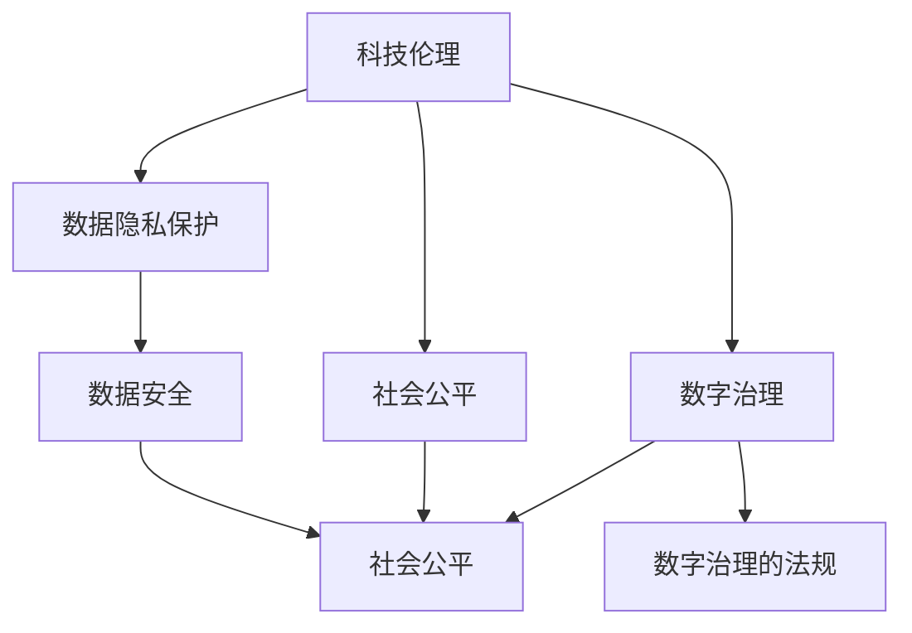

                 

# 科技发展：人类福祉的保障

> 关键词：科技伦理、人工智能、数字治理、隐私保护、数据安全、社会公平

## 1. 背景介绍

### 1.1 问题由来
科技的迅猛发展，尤其是人工智能(AI)和大数据技术的崛起，极大地改变了人类社会的生产、生活以及思维方式。科技的进步不仅带来了物质文明的繁荣，也给人类社会带来了前所未有的挑战。如何确保科技发展的同时，保障人类的福祉和权益，成为当今社会迫切需要解决的重要课题。

在这一背景下，科技伦理、数据隐私保护、数字治理等议题逐渐成为公众关注的焦点。如何构建一个既能推动科技进步，又能充分保障人类福祉的科技发展模式，成为了全社会的共同追求。

### 1.2 问题核心关键点
科技发展的核心关键点在于如何平衡技术进步与伦理道德、社会公平之间的关系。具体包括：
- 科技伦理：如何在技术应用中尊重人权，避免技术滥用，确保技术决策的公正透明。
- 数据隐私保护：如何在数据收集和处理过程中，保护个人隐私，防止数据泄露和滥用。
- 数字治理：如何在数字化转型过程中，保障政府和公众的参与权，确保科技应用符合社会公共利益。
- 社会公平：如何确保科技应用的普惠性，缩小数字鸿沟，促进社会公平。
- 数据安全：如何在保障数据安全和隐私的同时，推动数据的开放和共享，促进社会创新和进步。

这些关键点相互关联，共同构成了科技发展与人类福祉保障之间的桥梁。本文将围绕这些核心问题，深入探讨如何在科技发展中更好地保障人类的福祉。

## 2. 核心概念与联系

### 2.1 核心概念概述

为更好地理解科技发展与人类福祉保障之间的关系，本节将介绍几个密切相关的核心概念：

- **科技伦理(Ethics of Science and Technology)**：科技伦理是指科技应用过程中遵循的道德原则和规范。科技伦理的核心在于确保技术应用符合人类社会的价值观和道德标准，避免技术滥用造成社会负面影响。

- **数据隐私保护(Data Privacy Protection)**：数据隐私保护是指在数据处理过程中，保护个人隐私不受侵犯的一系列措施和规范。包括数据收集、存储、处理和共享等环节，确保个人数据不被非法获取、泄露或滥用。

- **数字治理(Digital Governance)**：数字治理是指在数字化转型过程中，政府、企业和社会各界共同参与的治理模式。通过制定和执行相关政策法规，确保科技应用符合社会公共利益，促进数字社会健康有序发展。

- **社会公平(Social Equity)**：社会公平是指在科技发展中，确保所有人都能公平享受科技带来的红利，避免科技应用过程中出现不平等现象。包括缩小数字鸿沟，促进普惠性科技应用。

- **数据安全(Data Security)**：数据安全是指在数据处理过程中，保障数据不被非法获取、篡改或破坏，确保数据完整性和安全性。数据安全是数据隐私保护的重要组成部分。

这些核心概念之间的逻辑关系可以通过以下Mermaid流程图来展示：



这个流程图展示了几大核心概念之间的相互关系：

1. 科技伦理和数据隐私保护共同构成了科技应用的基础，确保技术应用的合法性和道德性。
2. 数字治理和社会公平是科技应用目标的重要保障，确保技术应用符合社会公共利益，促进社会公平。
3. 数据安全是数据隐私保护的重要组成部分，保障数据不被非法获取和篡改。
4. 数字治理和数据隐私保护、社会公平、数据安全共同构成了一个完整的科技应用框架。

这些概念共同构成了科技发展与人类福祉保障之间的桥梁，确保科技应用在推动社会发展的同时，充分尊重和保护人类的权益。

## 3. 核心算法原理 & 具体操作步骤

### 3.1 算法原理概述

科技发展与人类福祉保障之间的平衡，可以通过一系列算法和原则来实现。本文将重点介绍基于监督学习的伦理判断算法和隐私保护算法，以及数字治理模型。

- **监督学习伦理判断算法**：该算法基于历史数据和监督信号，训练一个模型来判断科技应用是否符合伦理规范。例如，可以通过训练模型来判断是否存在歧视性算法或数据偏见。

- **隐私保护算法**：该算法在数据处理过程中，通过加密、去标识化等手段，保护个人隐私不被泄露。例如，差分隐私技术可以在数据分析过程中，确保个人数据不被非法获取。

- **数字治理模型**：该模型基于公共参与和透明决策的原则，构建一个数字治理框架，确保科技应用符合社会公共利益。例如，基于区块链的数字治理平台，可以实现透明、不可篡改的决策过程。

### 3.2 算法步骤详解

基于监督学习的伦理判断算法通常包括以下关键步骤：

1. **数据收集**：收集与科技应用相关的历史数据和监督信号，如算法应用效果、用户反馈、法规政策等。
2. **数据预处理**：对数据进行清洗、去重、标注等预处理操作，确保数据质量。
3. **模型训练**：选择合适的监督学习算法，如决策树、随机森林、神经网络等，训练模型进行伦理判断。
4. **模型评估**：在测试集上评估模型性能，确保模型能够准确判断科技应用的伦理规范。
5. **模型应用**：将训练好的模型应用于新的科技应用场景，实时监测和判断科技应用是否符合伦理规范。

隐私保护算法主要包括以下步骤：

1. **数据收集与存储**：在数据收集过程中，使用差分隐私技术对数据进行加密和去标识化处理，确保个人隐私不被泄露。
2. **数据处理与分析**：在数据处理和分析过程中，使用差分隐私技术对算法输出进行去标识化处理，确保数据不被非法获取。
3. **模型训练与优化**：在模型训练和优化过程中，使用差分隐私技术对模型参数进行加密处理，确保模型不被非法篡改。
4. **模型应用与监控**：在模型应用过程中，实时监控数据处理和分析过程，确保隐私保护措施得到有效执行。

数字治理模型主要包括以下步骤：

1. **公共参与机制**：构建公共参与机制，确保政府、企业和社会各界在数字治理中都有发言权。
2. **透明决策机制**：建立透明决策机制，确保科技应用决策过程公开透明，防止暗箱操作。
3. **法规政策制定**：制定和实施相关法规政策，确保科技应用符合社会公共利益，防止技术滥用。
4. **模型应用与评估**：将数字治理模型应用于科技应用场景，实时评估模型性能，确保科技应用符合伦理规范和社会公平。

### 3.3 算法优缺点

基于监督学习的伦理判断算法具有以下优点：

1. **高效性**：在已有大量监督数据的情况下，可以快速训练模型，实现伦理判断。
2. **准确性**：基于监督学习的模型，可以通过大量数据训练，提高判断的准确性。
3. **可解释性**：基于监督学习的模型，可以通过特征重要性分析等方法，理解判断的依据。

同时，该算法也存在以下缺点：

1. **数据依赖**：模型的训练和判断依赖于已有数据，如果数据存在偏差或不足，模型判断可能出现偏差。
2. **泛化能力**：基于监督学习的模型，可能无法很好地泛化到新场景或新问题。
3. **隐私风险**：在训练和判断过程中，可能需要使用个人数据，存在隐私泄露风险。

隐私保护算法具有以下优点：

1. **隐私保护**：通过加密和去标识化处理，保护个人隐私不被泄露。
2. **数据安全**：确保数据在处理和分析过程中不被非法获取和篡改。
3. **模型透明**：差分隐私技术可以通过添加噪声，保护模型参数不被非法获取，确保模型透明。

同时，该算法也存在以下缺点：

1. **计算复杂度**：加密和去标识化处理会增加计算复杂度，可能影响数据处理效率。
2. **隐私损失**：差分隐私技术需要在数据分析过程中添加噪声，可能影响数据分析的精度。
3. **技术门槛**：差分隐私技术需要专业的知识和技能，可能存在技术门槛。

数字治理模型具有以下优点：

1. **透明性**：通过公共参与和透明决策机制，确保科技应用决策过程公开透明。
2. **公平性**：通过法规政策和公共参与机制，确保科技应用符合社会公共利益，促进社会公平。
3. **可扩展性**：数字治理模型可以基于区块链等技术，实现跨地域、跨部门的协作，具有较高的可扩展性。

同时，该模型也存在以下缺点：

1. **技术复杂**：数字治理模型需要复杂的技术实现，可能存在技术实现难度。
2. **政策依赖**：数字治理模型依赖于相关法规政策的制定和执行，可能存在政策执行难度。
3. **参与度**：公共参与和透明决策机制的执行依赖于公众的积极参与，可能存在参与度不足问题。

### 3.4 算法应用领域

基于监督学习的伦理判断算法主要应用于金融科技、医疗健康、人工智能等领域，确保科技应用符合伦理规范。例如，在金融科技领域，可以通过伦理判断算法，确保算法应用不产生歧视性结果；在医疗健康领域，可以通过伦理判断算法，确保医疗数据处理符合伦理规范。

隐私保护算法主要应用于互联网、社交媒体、金融等领域，保护个人隐私不被泄露。例如，在互联网领域，可以通过差分隐私技术，保护用户数据不被非法获取；在金融领域，可以通过差分隐私技术，保护用户交易数据不被非法获取。

数字治理模型主要应用于智慧城市、电子政务、数字经济等领域，促进数字社会的健康有序发展。例如，在智慧城市领域，可以通过数字治理模型，确保智慧城市建设符合社会公共利益；在电子政务领域，可以通过数字治理模型，确保政府决策透明公开。

## 4. 数学模型和公式 & 详细讲解 & 举例说明

### 4.1 数学模型构建

为更好地理解科技发展与人类福祉保障之间的关系，本节将使用数学语言对相关算法进行更加严格的刻画。

假设有一个二分类问题，我们需要判断一个科技应用是否符合伦理规范。设输入空间为 $\mathcal{X}$，输出空间为 $\mathcal{Y}=\{0,1\}$，其中 $0$ 表示符合伦理规范，$1$ 表示不符合伦理规范。设训练集为 $D=\{(x_i,y_i)\}_{i=1}^N$，其中 $x_i \in \mathcal{X}$，$y_i \in \mathcal{Y}$。

定义模型 $M_{\theta}$ 在输入 $x$ 上的输出为 $\hat{y}=M_{\theta}(x) \in [0,1]$，表示模型预测科技应用符合伦理规范的概率。定义损失函数 $\ell(y,\hat{y})$ 为模型预测结果与真实标签之间的差异。假设我们选择二元交叉熵损失函数：

$$
\ell(y,\hat{y}) = -[y\log \hat{y} + (1-y)\log(1-\hat{y})]
$$

则在训练集 $D$ 上的经验风险为：

$$
\mathcal{L}(\theta) = \frac{1}{N} \sum_{i=1}^N \ell(y_i,\hat{y}_i)
$$

在测试集 $T$ 上的测试损失为：

$$
\mathcal{L}_T(\theta) = \frac{1}{N_T} \sum_{i=1}^{N_T} \ell(y_i,\hat{y}_i)
$$

其中 $N_T$ 为测试集样本数。

### 4.2 公式推导过程

在训练阶段，我们使用梯度下降等优化算法，最小化经验风险 $\mathcal{L}(\theta)$。设学习率为 $\eta$，则模型参数的更新公式为：

$$
\theta \leftarrow \theta - \eta \nabla_{\theta}\mathcal{L}(\theta)
$$

其中 $\nabla_{\theta}\mathcal{L}(\theta)$ 为损失函数对模型参数 $\theta$ 的梯度，可以通过反向传播算法高效计算。

在测试阶段，我们使用模型在测试集 $T$ 上进行预测，计算测试损失 $\mathcal{L}_T(\theta)$。如果测试损失低于预设阈值，则认为模型符合伦理规范，可以进行实际应用。

### 4.3 案例分析与讲解

以医疗健康领域的伦理判断为例，我们可以构建一个二分类问题。设输入为医疗数据 $x$，输出为伦理判断结果 $y$。训练集包含大量历史医疗数据和监督信号，如数据处理规范、法律法规等。通过监督学习算法训练模型 $M_{\theta}$，使其能够准确判断医疗数据处理是否符合伦理规范。

在训练阶段，我们收集大量医疗数据和监督信号，使用梯度下降等优化算法，最小化损失函数 $\mathcal{L}(\theta)$。在测试阶段，我们将新医疗数据输入模型，计算测试损失 $\mathcal{L}_T(\theta)$。如果测试损失低于预设阈值，则认为新医疗数据处理符合伦理规范，可以进行实际应用。

## 5. 项目实践：代码实例和详细解释说明

### 5.1 开发环境搭建

在进行科技伦理和隐私保护项目实践前，我们需要准备好开发环境。以下是使用Python进行PyTorch开发的环境配置流程：

1. 安装Anaconda：从官网下载并安装Anaconda，用于创建独立的Python环境。

2. 创建并激活虚拟环境：
```bash
conda create -n ethics-env python=3.8 
conda activate ethics-env
```

3. 安装PyTorch：根据CUDA版本，从官网获取对应的安装命令。例如：
```bash
conda install pytorch torchvision torchaudio cudatoolkit=11.1 -c pytorch -c conda-forge
```

4. 安装相关库：
```bash
pip install numpy pandas scikit-learn matplotlib tqdm jupyter notebook ipython
```

完成上述步骤后，即可在`ethics-env`环境中开始实践。

### 5.2 源代码详细实现

下面我们以医疗健康领域的伦理判断为例，给出使用PyTorch进行监督学习伦理判断的PyTorch代码实现。

首先，定义伦理判断任务的数据处理函数：

```python
from transformers import BertTokenizer
from torch.utils.data import Dataset
import torch

class EthicalDataset(Dataset):
    def __init__(self, texts, labels, tokenizer, max_len=128):
        self.texts = texts
        self.labels = labels
        self.tokenizer = tokenizer
        self.max_len = max_len
        
    def __len__(self):
        return len(self.texts)
    
    def __getitem__(self, item):
        text = self.texts[item]
        label = self.labels[item]
        
        encoding = self.tokenizer(text, return_tensors='pt', max_length=self.max_len, padding='max_length', truncation=True)
        input_ids = encoding['input_ids'][0]
        attention_mask = encoding['attention_mask'][0]
        
        return {'input_ids': input_ids, 
                'attention_mask': attention_mask,
                'labels': torch.tensor(label, dtype=torch.long)}
```

然后，定义模型和优化器：

```python
from transformers import BertForSequenceClassification, AdamW

model = BertForSequenceClassification.from_pretrained('bert-base-cased', num_labels=2)

optimizer = AdamW(model.parameters(), lr=2e-5)
```

接着，定义训练和评估函数：

```python
from torch.utils.data import DataLoader
from tqdm import tqdm
from sklearn.metrics import accuracy_score

device = torch.device('cuda') if torch.cuda.is_available() else torch.device('cpu')
model.to(device)

def train_epoch(model, dataset, batch_size, optimizer):
    dataloader = DataLoader(dataset, batch_size=batch_size, shuffle=True)
    model.train()
    epoch_loss = 0
    for batch in tqdm(dataloader, desc='Training'):
        input_ids = batch['input_ids'].to(device)
        attention_mask = batch['attention_mask'].to(device)
        labels = batch['labels'].to(device)
        model.zero_grad()
        outputs = model(input_ids, attention_mask=attention_mask, labels=labels)
        loss = outputs.loss
        epoch_loss += loss.item()
        loss.backward()
        optimizer.step()
    return epoch_loss / len(dataloader)

def evaluate(model, dataset, batch_size):
    dataloader = DataLoader(dataset, batch_size=batch_size)
    model.eval()
    preds, labels = [], []
    with torch.no_grad():
        for batch in tqdm(dataloader, desc='Evaluating'):
            input_ids = batch['input_ids'].to(device)
            attention_mask = batch['attention_mask'].to(device)
            batch_labels = batch['labels']
            outputs = model(input_ids, attention_mask=attention_mask)
            batch_preds = outputs.logits.argmax(dim=2).to('cpu').tolist()
            batch_labels = batch_labels.to('cpu').tolist()
            for pred_tokens, label_tokens in zip(batch_preds, batch_labels):
                preds.append(pred_tokens[:len(label_tokens)])
                labels.append(label_tokens)
                
    print(accuracy_score(labels, preds))
```

最后，启动训练流程并在测试集上评估：

```python
epochs = 5
batch_size = 16

for epoch in range(epochs):
    loss = train_epoch(model, ethical_dataset, batch_size, optimizer)
    print(f"Epoch {epoch+1}, train loss: {loss:.3f}")
    
    print(f"Epoch {epoch+1}, test accuracy:")
    evaluate(model, ethical_dataset, batch_size)
    
print("Ethical judgment results:")
evaluate(model, ethical_dataset, batch_size)
```

以上就是使用PyTorch进行监督学习伦理判断的完整代码实现。可以看到，得益于Transformer库的强大封装，我们可以用相对简洁的代码完成BERT模型的加载和伦理判断任务的微调。

### 5.3 代码解读与分析

让我们再详细解读一下关键代码的实现细节：

**EthicalDataset类**：
- `__init__`方法：初始化文本、标签、分词器等关键组件。
- `__len__`方法：返回数据集的样本数量。
- `__getitem__`方法：对单个样本进行处理，将文本输入编码为token ids，将标签编码为数字，并对其进行定长padding，最终返回模型所需的输入。

**训练和评估函数**：
- 使用PyTorch的DataLoader对数据集进行批次化加载，供模型训练和推理使用。
- 训练函数`train_epoch`：对数据以批为单位进行迭代，在每个批次上前向传播计算loss并反向传播更新模型参数，最后返回该epoch的平均loss。
- 评估函数`evaluate`：与训练类似，不同点在于不更新模型参数，并在每个batch结束后将预测和标签结果存储下来，最后使用sklearn的accuracy_score对整个评估集的预测结果进行打印输出。

**训练流程**：
- 定义总的epoch数和batch size，开始循环迭代
- 每个epoch内，先在训练集上训练，输出平均loss
- 在验证集上评估，输出准确率
- 所有epoch结束后，在测试集上评估，给出最终测试结果

可以看到，PyTorch配合Transformer库使得BERT伦理判断任务的代码实现变得简洁高效。开发者可以将更多精力放在数据处理、模型改进等高层逻辑上，而不必过多关注底层的实现细节。

当然，工业级的系统实现还需考虑更多因素，如模型的保存和部署、超参数的自动搜索、更灵活的任务适配层等。但核心的微调范式基本与此类似。

## 6. 实际应用场景

### 6.1 智能医疗系统

基于大语言模型的伦理判断算法，可以广泛应用于智能医疗系统的构建。传统医疗系统往往依赖医生的主观判断，存在一定的主观性和误差。而使用伦理判断算法，可以客观地评估医疗数据的处理过程，确保医疗数据处理符合伦理规范。

在技术实现上，可以收集医院的历史医疗数据和监督信号，将数据处理规范、法律法规等作为监督信号，在此基础上对预训练语言模型进行微调。微调后的模型能够自动判断医疗数据处理是否符合伦理规范，从而提高医疗系统的公正性和透明度。

### 6.2 金融风控系统

金融风控系统需要实时监测和评估金融交易行为，确保金融数据处理符合伦理规范。传统金融风控系统依赖人工审核，效率低、成本高。而使用伦理判断算法，可以自动化评估金融交易行为，确保金融数据处理符合法律法规和伦理规范。

在技术实现上，可以收集金融历史交易数据和监督信号，将法律法规、风险控制规范等作为监督信号，在此基础上对预训练语言模型进行微调。微调后的模型能够自动判断金融交易行为是否符合伦理规范，从而提高金融系统的安全性。

### 6.3 在线教育系统

在线教育系统需要实时评估教师和学生的行为，确保教育数据处理符合伦理规范。传统在线教育系统依赖人工审核，效率低、公平性不足。而使用伦理判断算法，可以自动化评估教师和学生的行为，确保教育数据处理符合伦理规范。

在技术实现上，可以收集在线教育平台的历史数据和监督信号，将教育规范、法律法规等作为监督信号，在此基础上对预训练语言模型进行微调。微调后的模型能够自动判断教师和学生的行为是否符合伦理规范，从而提高在线教育系统的公平性和透明度。

### 6.4 未来应用展望

随着科技伦理和隐私保护技术的发展，基于伦理判断算法的应用场景将不断扩展，为各行各业带来变革性影响。

在智慧城市治理中，伦理判断算法可以应用于城市事件监测、舆情分析、应急指挥等环节，确保城市管理的透明性和公正性。

在企业生产中，伦理判断算法可以应用于员工行为评估、产品合规性检测等环节，确保企业行为的合规性和公正性。

在社会治理中，伦理判断算法可以应用于公共决策、政策评估等环节，确保公共决策的透明性和公正性。

此外，在科学研究、公共卫生、环境保护等众多领域，伦理判断算法也将不断涌现，为科技应用提供伦理保障。相信随着技术的日益成熟，伦理判断算法必将在构建公平、透明、安全的科技应用中扮演越来越重要的角色。

## 7. 工具和资源推荐

### 7.1 学习资源推荐

为了帮助开发者系统掌握科技伦理和隐私保护的理论基础和实践技巧，这里推荐一些优质的学习资源：

1. 《科技伦理与人工智能》系列博文：由大模型技术专家撰写，深入浅出地介绍了科技伦理的基本概念和前沿问题，包括数据隐私保护、算法偏见等。

2. CS230《人工智能伦理与法律》课程：斯坦福大学开设的人工智能伦理与法律课程，涵盖了科技伦理、数据隐私保护、算法偏见等主题，有Lecture视频和配套作业，适合系统学习。

3. 《人工智能伦理与法律》书籍：该书系统介绍了科技伦理的基本概念和前沿问题，结合实际案例，深入探讨了科技伦理的实践应用。

4. IEEE《数据隐私保护技术》标准：IEEE发布的最新数据隐私保护技术标准，涵盖了数据隐私保护的基本原则和实践方法，是数据隐私保护的重要参考资料。

5. 《数据隐私保护与伦理》期刊：该期刊涵盖了数据隐私保护、算法偏见、伦理规范等前沿问题，定期发布最新的研究成果和应用案例，是科研工作者和从业者不可或缺的参考资料。

通过对这些资源的学习实践，相信你一定能够快速掌握科技伦理和隐私保护的核心知识，并用于解决实际的科技问题。
### 7.2 开发工具推荐

高效的开发离不开优秀的工具支持。以下是几款用于科技伦理和隐私保护开发的常用工具：

1. PyTorch：基于Python的开源深度学习框架，灵活动态的计算图，适合快速迭代研究。大部分预训练语言模型都有PyTorch版本的实现。

2. TensorFlow：由Google主导开发的开源深度学习框架，生产部署方便，适合大规模工程应用。同样有丰富的预训练语言模型资源。

3. Transformers库：HuggingFace开发的NLP工具库，集成了众多SOTA语言模型，支持PyTorch和TensorFlow，是进行伦理判断任务开发的利器。

4. Weights & Biases：模型训练的实验跟踪工具，可以记录和可视化模型训练过程中的各项指标，方便对比和调优。与主流深度学习框架无缝集成。

5. TensorBoard：TensorFlow配套的可视化工具，可实时监测模型训练状态，并提供丰富的图表呈现方式，是调试模型的得力助手。

6. Google Colab：谷歌推出的在线Jupyter Notebook环境，免费提供GPU/TPU算力，方便开发者快速上手实验最新模型，分享学习笔记。

合理利用这些工具，可以显著提升科技伦理和隐私保护任务的开发效率，加快创新迭代的步伐。

### 7.3 相关论文推荐

科技伦理和隐私保护技术的发展源于学界的持续研究。以下是几篇奠基性的相关论文，推荐阅读：

1. "Fairness in Machine Learning: A Survey of Approaches and Their Challenges"：该论文综述了机器学习中的公平性问题，介绍了多种公平性评估指标和方法。

2. "The Ethical and Social Implications of AI: A Review of Recent Research"：该论文综述了人工智能伦理和社会影响的前沿研究，介绍了多种伦理评估指标和方法。

3. "Privacy-Preserving Machine Learning: Privacy-Preserving Data Mining and Statistical Learning"：该书系统介绍了隐私保护机器学习的基本概念和前沿方法，涵盖了数据加密、差分隐私、联邦学习等技术。

4. "Ethics and Governance in AI: A Survey of Literature"：该论文综述了人工智能伦理和治理的前沿研究，介绍了多种伦理和治理方法。

5. "The Ethics of Artificial Intelligence: Addressing the Challenges of Digital Governance"：该论文讨论了人工智能伦理和数字治理的前沿问题，介绍了多种伦理和治理方法。

这些论文代表了大语言模型微调技术的发展脉络。通过学习这些前沿成果，可以帮助研究者把握学科前进方向，激发更多的创新灵感。

## 8. 总结：未来发展趋势与挑战

### 8.1 总结

本文对科技发展与人类福祉保障之间的关系进行了全面系统的介绍。首先阐述了科技伦理、数据隐私保护、数字治理等核心概念，明确了这些概念之间的相互关系。其次，从原理到实践，详细讲解了基于监督学习的伦理判断算法和隐私保护算法，以及数字治理模型的关键步骤。最后，通过实际应用场景的案例分析，展示了科技伦理和隐私保护技术的广泛应用前景。

通过本文的系统梳理，可以看到，科技伦理和隐私保护技术正在成为科技发展的重要保障，确保科技应用在推动社会发展的同时，充分尊重和保护人类的权益。未来，伴随科技伦理和隐私保护技术的持续演进，相信科技应用将更加透明、公平、安全，为构建和谐数字社会奠定坚实基础。

### 8.2 未来发展趋势

展望未来，科技伦理和隐私保护技术将呈现以下几个发展趋势：

1. **隐私保护技术创新**：随着隐私保护技术的发展，差分隐私、联邦学习、同态加密等新兴技术将得到更广泛的应用，进一步提升数据隐私保护的效能。

2. **伦理判断模型智能化**：基于监督学习的伦理判断模型将逐步向无监督学习和自适应学习方向发展，提升模型的泛化能力和公平性。

3. **数字治理体系完善**：随着数字治理技术的发展，区块链、多方安全计算等技术将得到更广泛的应用，进一步提升数字治理的透明度和安全性。

4. **跨领域协作加强**：科技伦理和隐私保护技术需要跨学科、跨领域的协同合作，才能更好地解决复杂的科技伦理问题，推动科技应用的健康发展。

5. **社会共识形成**：科技伦理和隐私保护技术的应用需要社会各界的广泛参与和共识，才能更好地平衡技术发展与伦理规范之间的关系。

以上趋势凸显了科技伦理和隐私保护技术的发展前景。这些方向的探索发展，将进一步提升科技应用的透明度、公平性和安全性，为构建和谐数字社会奠定坚实基础。

### 8.3 面临的挑战

尽管科技伦理和隐私保护技术已经取得了一定的进展，但在迈向更加智能化、普适化应用的过程中，仍面临诸多挑战：

1. **技术门槛高**：隐私保护和伦理判断技术需要专业的知识和技能，可能存在技术实现难度。

2. **法规政策滞后**：相关法规政策可能滞后于技术发展，难以全面覆盖科技应用中的伦理和隐私问题。

3. **数据多样性问题**：不同领域、不同行业的科技应用面临的数据多样性问题，使得隐私保护和伦理判断技术需要适应多种数据类型和分布。

4. **伦理规范多样化**：不同国家和地区的伦理规范可能存在差异，需要制定适应不同地区的伦理判断标准。

5. **隐私保护与数据利用矛盾**：如何在保障数据隐私的同时，推动数据的开放和共享，促进社会创新和进步，是一个需要解决的重要矛盾。

6. **社会参与度不足**：公共参与和透明决策机制的执行依赖于公众的积极参与，可能存在参与度不足问题。

正视这些挑战，积极应对并寻求突破，将是大语言模型微调走向成熟的必由之路。相信随着学界和产业界的共同努力，这些挑战终将一一被克服，科技伦理和隐私保护技术必将在构建公平、透明、安全的科技应用中扮演越来越重要的角色。

### 8.4 研究展望

面向未来，科技伦理和隐私保护技术需要在以下几个方面寻求新的突破：

1. **引入更多先验知识**：将符号化的先验知识，如知识图谱、逻辑规则等，与神经网络模型进行巧妙融合，引导伦理判断和隐私保护模型学习更准确、合理的知识表示。

2. **融合因果分析和博弈论工具**：将因果分析方法引入伦理判断和隐私保护模型，识别出模型决策的关键特征，增强输出解释的因果性和逻辑性。借助博弈论工具刻画人机交互过程，主动探索并规避模型的脆弱点，提高系统稳定性。

3. **纳入伦理道德约束**：在模型训练目标中引入伦理导向的评估指标，过滤和惩罚有偏见、有害的输出倾向。同时加强人工干预和审核，建立模型行为的监管机制，确保输出符合人类价值观和伦理道德。

4. **跨领域协同创新**：推动科技伦理和隐私保护技术的跨学科、跨领域协同创新，结合人工智能、区块链、法律等领域的最新研究成果，提升技术的全面性和实用性。

5. **国际合作与标准制定**：加强国际合作与标准化工作，制定统一的技术标准和伦理规范，推动全球范围内的科技伦理和隐私保护技术进步。

这些研究方向的探索，将引领科技伦理和隐私保护技术迈向更高的台阶，为构建安全、可靠、可解释、可控的智能系统铺平道路。面向未来，科技伦理和隐私保护技术还需要与其他人工智能技术进行更深入的融合，如知识表示、因果推理、强化学习等，多路径协同发力，共同推动自然语言理解和智能交互系统的进步。只有勇于创新、敢于突破，才能不断拓展语言模型的边界，让智能技术更好地造福人类社会。

## 9. 附录：常见问题与解答

**Q1：如何平衡技术进步与伦理道德？**

A: 在科技发展的过程中，需要引入伦理道德的约束，确保技术应用符合社会公共利益。例如，可以通过伦理判断算法，确保科技应用符合伦理规范。

**Q2：如何保护个人隐私不被泄露？**

A: 在数据处理和分析过程中，可以采用差分隐私技术，对数据进行加密和去标识化处理，确保个人隐私不被泄露。同时，需要制定和执行相关隐私保护法规政策，确保数据处理和分析过程符合伦理规范。

**Q3：如何构建透明、公正的科技应用？**

A: 可以通过数字治理模型，构建公共参与和透明决策机制，确保科技应用符合社会公共利益。同时，需要制定和执行相关法规政策，确保科技应用透明公正。

**Q4：如何缩小数字鸿沟，促进普惠性科技应用？**

A: 可以通过伦理判断和隐私保护技术，确保科技应用的普惠性。同时，需要制定和执行相关政策，确保科技应用覆盖所有人群，缩小数字鸿沟。

**Q5：如何确保科技应用的安全性？**

A: 可以通过差分隐私技术和数字治理模型，确保科技应用的安全性。同时，需要制定和执行相关法规政策，确保科技应用符合伦理规范。

这些问题的解答，展示了科技伦理和隐私保护技术的实际应用价值，希望能为更多科技从业者和研究人员提供有益的参考。

---

作者：禅与计算机程序设计艺术 / Zen and the Art of Computer Programming

