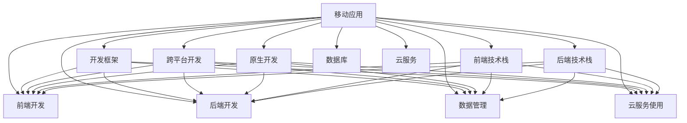

                 

# 程序员副业：移动应用开发

## 1. 背景介绍

### 1.1 问题由来
在互联网和移动互联网迅猛发展的今天，开发移动应用（Mobile Application, 简称 App）已成为程序员的重要副业之一。无论是全栈开发者还是前端、后端、AI等领域的专家，都在积极寻求通过移动应用项目提升自己的职业能力和市场竞争力。

移动应用的开发不仅是技术能力的体现，更是产品思维、市场敏锐度等多方面综合能力的考验。成功的移动应用不仅可以带来丰厚的经济回报，还能极大提升个人品牌影响力。因此，对移动应用开发技术的深入学习已成为当下程序员必修的重要技能。

### 1.2 问题核心关键点
移动应用开发的重点在于如何高效、稳定、灵活地构建适合目标用户群体的应用。这不仅需要具备扎实的编程基础，还需要深入理解用户体验设计、人机交互、应用架构设计等综合技能。

核心关键点包括：
- 选择合适的开发框架和技术栈
- 设计合理的应用架构和数据流
- 实现高效、稳定的移动应用
- 提升用户体验和应用性能
- 部署和维护移动应用
- 应对应用安全性和隐私问题

本文旨在系统介绍移动应用开发的背景、核心概念与联系，深入解析核心算法原理和具体操作步骤，并结合实际项目给出代码实例和详细解释。

## 2. 核心概念与联系

### 2.1 核心概念概述

移动应用开发涉及众多技术概念，以下列出几个核心概念：

- **移动应用（Mobile Application）**：通过移动设备（如手机、平板电脑）为用户提供服务的应用程序，涵盖原生应用和跨平台应用（Hybrid App）。
- **开发框架（Development Framework）**：提供一套统一的编程模型和工具链，简化移动应用开发过程。
- **跨平台开发（Cross-Platform Development）**：使用一套代码同时构建多个平台的移动应用，降低开发和维护成本。
- **原生开发（Native Development）**：使用特定移动平台的原生编程语言和工具进行应用开发，获取最佳性能和用户体验。
- **前端技术栈（Frontend Tech Stack）**：移动应用前端开发所需的技术栈，如React Native、Flutter、Ionic等。
- **后端技术栈（Backend Tech Stack）**：移动应用后端开发所需的技术栈，如Node.js、Flutter Backend等。
- **数据库（Database）**：移动应用所需的数据存储和检索服务，如SQLite、Firebase、MongoDB等。
- **云服务（Cloud Services）**：提供云端计算、存储、数据库等服务，方便移动应用的快速构建和扩展，如AWS、Google Cloud、Microsoft Azure等。

这些核心概念之间的逻辑关系可以通过以下Mermaid流程图来展示：



这个流程图展示了移动应用开发所涉及的主要技术概念及其之间的联系：

1. 移动应用作为最终产品，通过开发框架、跨平台开发、原生开发、前端和后端技术栈构建。
2. 移动应用的前端开发涉及前端技术栈，后端开发涉及后端技术栈，数据管理涉及数据库，云服务的使用为应用提供了可靠的部署和扩展环境。
3. 开发框架、跨平台开发、原生开发等为应用提供了多种开发模式，前端、后端、数据库、云服务则提供了实现应用所需的具体技术手段。

## 3. 核心算法原理 & 具体操作步骤
### 3.1 算法原理概述

移动应用开发的算法原理主要涉及前端开发、后端开发和数据管理三大方面。以下将分别概述每个部分的算法原理。

- **前端开发**：通过选择前端技术栈和开发框架，实现高效、流畅的用户交互和数据渲染。
- **后端开发**：使用后端技术栈构建应用的后端服务，提供数据存储、应用逻辑处理等功能。
- **数据管理**：设计数据库结构和数据流动路径，确保数据的安全存储和高效检索。

### 3.2 算法步骤详解

#### 3.2.1 前端开发

前端开发的算法步骤如下：

1. **选择前端技术栈**：根据应用需求和开发经验选择合适的技术栈，如React Native、Flutter、Ionic等。
2. **搭建开发环境**：安装所需的前端开发工具，如Android Studio、Xcode、Visual Studio Code等。
3. **设计用户界面**：绘制应用原型，确定用户界面（UI）布局和交互方式。
4. **实现UI组件**：将UI原型转化为代码，实现具体的UI组件和交互逻辑。
5. **优化性能**：通过代码优化和性能测试，提升应用响应速度和稳定性。

#### 3.2.2 后端开发

后端开发的算法步骤如下：

1. **选择后端技术栈**：根据应用需求和开发经验选择合适的技术栈，如Node.js、Flutter Backend、Dart等。
2. **搭建开发环境**：安装所需的后端开发工具，如Node.js、Android Studio、Xcode等。
3. **设计数据模型**：定义应用所需的数据模型，确定数据库结构和数据流动路径。
4. **实现数据服务**：使用后端技术栈实现数据服务功能，包括数据存储、检索、处理等。
5. **优化性能**：通过代码优化和性能测试，提升数据服务的响应速度和稳定性。

#### 3.2.3 数据管理

数据管理的算法步骤如下：

1. **选择数据库**：根据应用需求和数据存储要求选择合适的数据库，如SQLite、Firebase、MongoDB等。
2. **设计数据结构**：设计符合应用需求的数据结构，确保数据的安全存储和高效检索。
3. **实现数据服务**：使用数据库技术实现数据服务功能，包括数据存储、检索、同步等。
4. **优化性能**：通过代码优化和性能测试，提升数据服务的响应速度和稳定性。

### 3.3 算法优缺点

移动应用开发的主要算法优点包括：

- **高效开发**：跨平台开发、原生开发等技术大大降低了开发成本和维护成本。
- **快速迭代**：前端和后端分离，前端可以迅速迭代更新，提升应用体验。
- **性能优化**：通过合理的数据结构和算法，提升应用的响应速度和稳定性。

主要算法缺点包括：

- **性能差异**：原生应用在某些方面可能比跨平台应用表现更好。
- **学习曲线**：部分新技术栈可能需要一定时间学习，增加学习成本。
- **兼容性问题**：跨平台应用可能存在兼容性问题，影响用户体验。

### 3.4 算法应用领域

移动应用开发的应用领域非常广泛，包括但不限于以下几个方面：

- **社交应用**：如微信、QQ、微博等，提供即时通讯、内容分享等功能。
- **电商应用**：如淘宝、京东、拼多多等，提供商品展示、购物、支付等功能。
- **工具应用**：如Evernote、Keep、滴答清单等，提供笔记管理、任务管理等功能。
- **游戏应用**：如王者荣耀、和平精英等，提供沉浸式游戏体验。
- **教育应用**：如Khan Academy、Duolingo等，提供在线学习和教育资源。
- **金融应用**：如支付宝、微信支付等，提供支付、理财、转账等功能。

## 4. 数学模型和公式 & 详细讲解 & 举例说明

### 4.1 数学模型构建

移动应用开发中的数学模型主要涉及前端开发、后端开发和数据管理三大方面。以下将分别构建每个部分的数学模型。

#### 4.1.1 前端开发

前端开发的数学模型主要涉及用户界面的布局和交互设计。以下通过一个简单的示例来说明：

假设有一个简单的移动应用，包含一个登录界面，用户输入用户名和密码后提交登录。

1. **用户界面布局**：界面包含一个用户名输入框、一个密码输入框和一个登录按钮。
2. **交互设计**：用户在输入框中输入用户名和密码，点击登录按钮后，应用将用户名和密码发送至后端进行验证，验证通过后显示欢迎信息。

### 4.2 公式推导过程

#### 4.2.1 前端开发

在前端开发中，用户界面的布局和交互设计可以通过以下数学模型表示：

1. **用户界面布局**：假设界面宽高为W和H，用户名输入框宽度为W1，密码输入框宽度为W2，登录按钮宽度为W3。
2. **交互设计**：用户点击按钮的概率P可以用指数函数表示，即$P = e^{-k(\frac{x}{W3}+ \frac{y}{H})}$，其中k为常数。

#### 4.2.2 后端开发

后端开发的数学模型主要涉及数据模型和数据服务的设计。以下通过一个简单的示例来说明：

假设有一个简单的移动应用，包含一个用户信息管理模块，用户可以查询、添加、删除自己的信息。

1. **数据模型设计**：用户信息包含id、用户名、密码、邮箱、电话等字段，可以使用关系型数据库（如SQLite）存储。
2. **数据服务设计**：用户可以查询自己的信息，添加新的信息，删除自己的信息。数据服务可以通过SQL语句实现，例如：SELECT、INSERT、DELETE等。

### 4.3 案例分析与讲解

#### 4.3.1 前端开发

在前端开发中，一个常见的案例是实现一个简单的电商应用的商品展示界面。该界面包含商品图片、名称、价格、评价等字段，用户可以通过点击商品进入详细页面。

1. **布局设计**：界面采用分屏布局，左侧显示商品图片和名称，右侧显示商品价格和评价。
2. **交互设计**：用户点击商品图片或名称后，应用跳转到详细页面，显示商品详细信息。

#### 4.3.2 后端开发

在后端开发中，一个常见的案例是实现一个简单的用户信息管理模块。该模块包含用户信息查询、添加、删除等功能，数据存储在MySQL数据库中。

1. **数据模型设计**：用户信息包含id、用户名、密码、邮箱、电话等字段，存储在MySQL数据库中。
2. **数据服务设计**：用户可以查询自己的信息，添加新的信息，删除自己的信息。数据服务可以通过MySQL的SQL语句实现，例如：SELECT、INSERT、DELETE等。

### 4.4 举例说明

#### 4.4.1 前端开发

假设我们要实现一个简单的待办事项应用，允许用户添加、编辑、删除自己的待办事项。

1. **布局设计**：界面采用分屏布局，左侧显示待办事项列表，右侧显示待办事项详情。
2. **交互设计**：用户可以点击添加按钮添加新待办事项，点击编辑按钮编辑已有待办事项，点击删除按钮删除待办事项。

#### 4.4.2 后端开发

假设我们要实现一个简单的用户信息管理模块，允许用户查询、添加、删除自己的信息。

1. **数据模型设计**：用户信息包含id、用户名、密码、邮箱、电话等字段，存储在MySQL数据库中。
2. **数据服务设计**：用户可以查询自己的信息，添加新的信息，删除自己的信息。数据服务可以通过MySQL的SQL语句实现，例如：SELECT、INSERT、DELETE等。

## 5. 项目实践：代码实例和详细解释说明

### 5.1 开发环境搭建

#### 5.1.1 Android Studio

1. **安装Android Studio**：
   - 下载并安装Android Studio，访问官网下载页面，选择合适的版本安装。
   - 安装过程中注意选择Android SDK和Emulator，以及需要的其他组件。

2. **配置开发环境**：
   - 打开Android Studio，进入“File”菜单，选择“Settings”。
   - 在“System Settings”选项卡下，配置Android SDK、AVD（Android Virtual Device）、模拟器等。

3. **创建新项目**：
   - 点击“File”菜单，选择“New”，进入“New Project”向导。
   - 填写项目名称、包名、最小API版本等信息，选择模块类型，然后点击“Finish”。

### 5.2 源代码详细实现

#### 5.2.1 React Native

1. **安装React Native**：
   - 使用npm安装React Native，执行命令`npm install -g react-native-cli`。
   - 配置Android Studio，进入“File”菜单，选择“Settings”，在“Build, Execution, Deployment”选项卡下，选择“React Native”。

2. **创建新项目**：
   - 使用React Native CLI创建新项目，执行命令`react-native init MyReactApp`。
   - 进入项目目录，运行`react-native run-android`，编译并运行应用。

3. **实现功能**：
   - 打开App.js文件，编写代码实现UI组件和交互逻辑。
   - 使用组件如`View`、`Text`、`TextInput`等，实现用户界面。
   - 使用`StyleSheet.create()`创建样式表，美化UI组件。

### 5.3 代码解读与分析

#### 5.3.1 React Native

假设我们要实现一个简单的待办事项应用，代码如下：

```javascript
import React, { useState } from 'react';
import { StyleSheet, Text, TextInput, View } from 'react-native';

export default function App() {
  const [task, setTask] = useState('');
  const [taskList, setTaskList] = useState([]);

  const addTask = () => {
    setTaskList([...taskList, task]);
    setTask('');
  };

  return (
    <View style={styles.container}>
      <Text style={styles.title}>待办事项列表</Text>
      <TextInput
        style={styles.input}
        value={task}
        onChangeText={setTask}
        placeholder="请输入待办事项"
      />
      <View style={styles.buttonContainer}>
        <View style={styles.button}>
          <Text style={styles.buttonText}>添加</Text>
        </View>
      </View>
      <View style={styles.taskListContainer}>
        {taskList.map((task, index) => (
          <Text key={index} style={styles.taskItem}>
            {task}
          </Text>
        ))}
      </View>
    </View>
  );
}

const styles = StyleSheet.create({
  container: {
    flex: 1,
    backgroundColor: '#fff',
    alignItems: 'center',
    justifyContent: 'center',
  },
  title: {
    fontSize: 24,
    fontWeight: 'bold',
    marginTop: 50,
  },
  input: {
    height: 40,
    width: 300,
    borderColor: '#ccc',
    borderWidth: 1,
    paddingHorizontal: 10,
    marginTop: 20,
  },
  buttonContainer: {
    flexDirection: 'row',
    alignItems: 'center',
    marginTop: 20,
  },
  button: {
    backgroundColor: '#009688',
    width: 100,
    height: 40,
    justifyContent: 'center',
    alignItems: 'center',
  },
  buttonText: {
    color: '#fff',
    fontSize: 18,
  },
  taskListContainer: {
    marginTop: 20,
  },
  taskItem: {
    marginTop: 10,
    marginBottom: 10,
    fontSize: 16,
  },
});
```

代码解释：

- `useState`：用于管理组件状态，`task`表示当前输入的待办事项，`taskList`表示所有待办事项的列表。
- `TextInput`：用于实现用户输入待办事项的功能。
- `View`：用于实现按钮和列表布局。
- `StyleSheet.create()`：用于创建样式表，美化UI组件。

### 5.4 运行结果展示

运行应用后，可以看到界面包含一个输入框、一个添加按钮和任务列表。用户可以在输入框中输入待办事项，点击“添加”按钮后，该事项会被添加到列表中。

## 6. 实际应用场景

### 6.1 智能日程应用

智能日程应用是一款帮助用户管理日常工作、学习的工具，通过语音输入、自然语言理解等技术实现智能提醒和任务管理。

#### 6.1.1 功能设计

1. **语音输入**：用户可以通过语音输入日程，应用自动转换为文本。
2. **自然语言理解**：应用能够理解用户输入的自然语言，识别出会议、课程、任务等关键词。
3. **智能提醒**：应用根据用户输入的日程，设置提醒时间，智能提醒用户。

#### 6.1.2 技术实现

1. **前端开发**：使用React Native实现界面，支持语音输入和任务编辑。
2. **后端开发**：使用Node.js实现自然语言理解功能，存储和检索日程信息。
3. **数据管理**：使用MySQL数据库存储日程信息，支持查询和更新操作。

### 6.2 在线教育应用

在线教育应用是一款为学生提供在线学习资源、作业批改、答疑辅导等功能的应用。

#### 6.2.1 功能设计

1. **在线学习**：学生可以通过应用在线学习，观看视频课程、阅读文档等。
2. **作业批改**：教师可以通过应用批改学生提交的作业，提供反馈意见。
3. **在线答疑**：学生可以向教师提问，教师在线解答。

#### 6.2.2 技术实现

1. **前端开发**：使用React Native实现界面，支持视频播放和文档阅读。
2. **后端开发**：使用Node.js实现作业批改和在线答疑功能，存储和检索学生作业和教师反馈。
3. **数据管理**：使用MongoDB数据库存储学生作业、教师反馈等信息，支持查询和更新操作。

## 7. 工具和资源推荐

### 7.1 学习资源推荐

1. **《JavaScript高级程序设计》**：详细讲解JavaScript的语法和高级应用，是前端开发的重要参考书。
2. **《React Native官方文档》**：React Native的官方文档，提供完整的开发指南和示例代码。
3. **《Flutter实战》**：Flutter的实战指南，涵盖开发工具、UI设计、应用构建等方面的内容。
4. **《移动应用开发》（Android版）**：综合介绍Android应用开发的理论基础和实践技巧，适合初学者入门。
5. **《移动应用开发》（iOS版）**：综合介绍iOS应用开发的理论基础和实践技巧，适合初学者入门。

### 7.2 开发工具推荐

1. **Android Studio**：Google开发的Android应用开发工具，支持Android应用的开发和调试。
2. **Xcode**：苹果公司开发的iOS应用开发工具，支持iOS应用的开发和调试。
3. **Visual Studio Code**：微软开发的轻量级代码编辑器，支持多种编程语言和开发环境。
4. **Git**：版本控制系统，用于代码管理和团队协作。
5. **Docker**：容器化平台，用于应用打包和部署。

### 7.3 相关论文推荐

1. **《Deep Learning for Mobile Image Recognition》**：使用深度学习技术实现移动设备的图像识别功能。
2. **《Generative Adversarial Networks for Text-to-Speech》**：使用生成对抗网络实现文本转语音功能。
3. **《Smartphone Music Recommendation System》**：基于移动设备音乐播放数据的推荐系统。
4. **《Mobile App Privacy Protection Techniques》**：移动应用隐私保护技术的研究和应用。
5. **《Cross-Platform Mobile App Development》**：跨平台移动应用开发的最新研究和实践。

## 8. 总结：未来发展趋势与挑战

### 8.1 研究成果总结

移动应用开发是当前程序员的重要副业之一，涉及前端开发、后端开发和数据管理等多个方面。通过深入学习前端技术栈、后端技术栈和数据管理技术，程序员可以开发出高效、稳定、灵活的移动应用。

### 8.2 未来发展趋势

移动应用开发将朝着以下几个方向发展：

1. **跨平台开发**：跨平台开发技术将继续发展，减少开发和维护成本，提升应用兼容性。
2. **人工智能应用**：移动应用将更多地引入人工智能技术，如语音识别、自然语言处理、图像识别等，提升用户体验。
3. **云计算应用**：云服务将广泛应用于移动应用开发，提供可靠的数据存储和处理能力。
4. **区块链应用**：移动应用将引入区块链技术，提升应用的安全性和隐私保护能力。

### 8.3 面临的挑战

移动应用开发面临以下几个挑战：

1. **性能优化**：如何提升应用的响应速度和稳定性，降低延迟和抖动，提升用户体验。
2. **数据安全**：如何保护用户数据安全，防止数据泄露和恶意攻击。
3. **用户体验**：如何提升应用的用户体验，提升用户粘性和满意度。
4. **跨平台兼容性**：如何保证应用在不同平台上的兼容性和一致性。
5. **新技术引入**：如何引入新技术，提升应用功能和性能，同时保持现有技术的稳定性和可维护性。

### 8.4 研究展望

未来，移动应用开发的研究方向将聚焦于以下几个方面：

1. **跨平台性能优化**：探索跨平台开发的高性能实现方式，提升应用的响应速度和稳定性。
2. **人工智能融合**：深入研究人工智能技术在移动应用中的应用，提升应用的智能化水平。
3. **云计算平台**：研究云服务在移动应用开发中的应用，提升应用的扩展性和可靠性。
4. **区块链应用**：研究区块链技术在移动应用中的实现，提升应用的安全性和隐私保护能力。

## 9. 附录：常见问题与解答

**Q1：移动应用开发需要哪些技能？**

A: 移动应用开发需要具备以下技能：

1. **编程基础**：熟练掌握至少一种编程语言，如JavaScript、Python、Java等。
2. **前端开发**：熟悉前端开发工具和框架，如React Native、Flutter、Ionic等。
3. **后端开发**：熟悉后端开发工具和框架，如Node.js、Dart等。
4. **数据管理**：熟悉数据库和数据管理技术，如MySQL、MongoDB等。
5. **云服务**：熟悉云服务提供商（如AWS、Google Cloud、Microsoft Azure）。
6. **用户体验设计**：具备良好的UI/UX设计能力，能够设计符合用户需求的界面。
7. **性能优化**：具备优化性能的能力，能够提升应用的响应速度和稳定性。

**Q2：如何提升移动应用的性能？**

A: 提升移动应用性能的常见方法包括：

1. **代码优化**：通过代码优化和性能测试，提升应用的响应速度和稳定性。
2. **数据缓存**：使用数据缓存技术，减少数据库的访问次数，提升数据检索效率。
3. **异步处理**：使用异步处理技术，提升应用的并发处理能力。
4. **资源优化**：优化应用的资源占用，减少内存和CPU使用。
5. **性能监控**：使用性能监控工具，实时监测应用性能，及时发现和解决性能问题。

**Q3：如何保护移动应用的数据安全？**

A: 保护移动应用数据安全的常见方法包括：

1. **数据加密**：使用数据加密技术，保护数据的传输和存储安全。
2. **权限控制**：限制应用的权限，确保只有授权用户可以访问敏感数据。
3. **漏洞修复**：及时修复应用中的安全漏洞，防止恶意攻击。
4. **安全审计**：定期进行安全审计，发现并修复潜在的安全问题。
5. **数据备份**：定期备份数据，防止数据丢失和损坏。

**Q4：如何选择适合的前端开发框架？**

A: 选择适合的前端开发框架需要考虑以下因素：

1. **应用需求**：根据应用需求选择框架，如功能需求、性能需求、跨平台需求等。
2. **开发经验**：考虑开发团队对框架的熟悉程度，避免选择过于复杂或不熟悉的框架。
3. **社区支持**：选择有活跃社区支持的框架，便于获取技术支持和资源。
4. **文档和教程**：选择有丰富文档和教程的框架，便于快速上手和开发。

**Q5：如何提升移动应用的UI/UX设计？**

A: 提升移动应用UI/UX设计的常见方法包括：

1. **用户调研**：了解目标用户群体的需求和偏好，设计符合用户需求的界面。
2. **原型设计**：使用原型设计工具，设计应用的UI界面和交互逻辑。
3. **用户测试**：进行用户测试，获取用户反馈，不断优化界面和交互。
4. **设计规范**：遵循设计规范，保持界面的一致性和美观性。
5. **反馈机制**：建立用户反馈机制，及时收集用户意见，改进设计。

**Q6：如何进行移动应用的后端开发？**

A: 进行移动应用后端开发的常见方法包括：

1. **选择合适的后端技术栈**：根据应用需求和技术栈熟悉程度，选择适合的技术栈。
2. **搭建开发环境**：安装所需的后端开发工具，配置开发环境。
3. **设计数据模型**：定义应用所需的数据模型，确保数据的安全存储和高效检索。
4. **实现数据服务**：使用后端技术栈实现数据服务功能，包括数据存储、检索、处理等。
5. **性能优化**：通过代码优化和性能测试，提升数据服务的响应速度和稳定性。

---

作者：禅与计算机程序设计艺术 / Zen and the Art of Computer Programming

