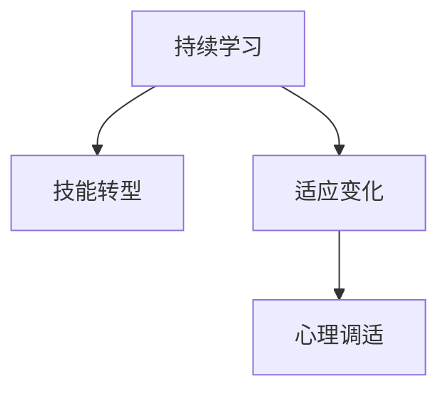

                 

# 程序员如何应对中年危机与职业瓶颈

## 1. 背景介绍

### 1.1 问题由来

随着科技的快速发展和职业环境的不断变化，越来越多的程序员发现自己面临着“中年危机”和“职业瓶颈”的挑战。一方面，技术的更新换代迅速，旧有知识逐渐过时，新技能不断涌现；另一方面，职业竞争激烈，需要持续提升自我以保持竞争力。如何在职业生涯中持续成长，应对技术变迁和职业压力，成为了许多程序员关心的话题。

### 1.2 问题核心关键点

应对“中年危机”和“职业瓶颈”的核心在于持续学习和技能提升。具体而言，包括以下几个方面：

- **持续学习：** 技术日新月异，只有不断学习新技术、新工具，才能保持竞争力。
- **技能转型：** 随着职责的变化，可能需要从传统的开发工作转向团队管理、产品规划等方向。
- **适应变化：** 面对技术环境的变化和挑战，需灵活调整工作策略，适应新需求。
- **心理调适：** 培养良好的心态，保持对工作的热情和信心。

本博客将系统地介绍程序员应对中年危机与职业瓶颈的方法，涵盖技术、职业、心理等各个方面的策略，旨在为职业发展的顺利进行提供参考。

## 2. 核心概念与联系

### 2.1 核心概念概述

为更好地理解如何应对中年危机与职业瓶颈，本节将介绍几个密切相关的核心概念：

- **持续学习：** 指在职业生涯中不断获取新知识、新技能，以适应技术发展的过程。
- **技能转型：** 指在职业生涯中根据需求和兴趣，调整和转型至其他技术领域或职业角色。
- **适应变化：** 指对外部环境和内部需求的变化，能够灵活调整策略，保持应对能力。
- **心理调适：** 指在面对职业挑战和压力时，能够调节心理状态，保持积极态度。

这些核心概念之间的逻辑关系可以通过以下Mermaid流程图来展示：



这个流程图展示了几大核心概念之间的联系：

1. 持续学习是技能转型和适应变化的基础，使个人能够掌握新的技能和适应变化。
2. 技能转型和适应变化可以提升个人的竞争力，但同时也需要良好的心理调适来支持。
3. 心理调适可以帮助个人保持积极的心态，面对职业生涯中的各种挑战。

这些概念共同构成了应对中年危机与职业瓶颈的策略框架，有助于个人在职业生涯中不断成长和进步。

## 3. 核心算法原理 & 具体操作步骤

### 3.1 算法原理概述

应对“中年危机”与“职业瓶颈”的策略，本质上是一个系统的、持续的个人发展过程。其核心思想是：通过不断学习和技能提升，适应技术变化和职业需求，同时在心理上保持积极态度。

形式化地，假设一个程序员的初始状态为 $S_0$，经过 $n$ 个周期的学习和调整，目标状态为 $S_n$。则目标状态 $S_n$ 可以表示为：

$$
S_n = f(S_0, L_1, L_2, ..., L_n, A_1, A_2, ..., A_n, M_1, M_2, ..., M_n)
$$

其中 $L_i$ 表示在第 $i$ 个周期内学习的技能和知识，$A_i$ 表示在第 $i$ 个周期内适应环境的变化，$M_i$ 表示在第 $i$ 个周期内进行的心理调适。

### 3.2 算法步骤详解

应对“中年危机”与“职业瓶颈”的策略可以细化为以下步骤：

**Step 1: 设定职业目标**
- 根据个人兴趣、技能和市场需求，设定短期和长期的职业发展目标。
- 制定详细的职业发展计划，包括技能学习、项目参与、团队合作等各个方面。

**Step 2: 持续学习**
- 选择合适的学习资源，如在线课程、专业书籍、开源项目等，系统学习新技能。
- 参加行业会议、交流活动，保持与技术前沿的联系。
- 建立学习习惯，定期复习和巩固已有知识，避免遗忘。

**Step 3: 技能转型**
- 根据职业目标，识别并学习所需的新技能。例如，从开发转向架构设计、项目管理等。
- 尝试跨部门合作，了解其他领域的业务流程和技术要求。
- 参加专业认证考试，提升技术认可度和市场竞争力。

**Step 4: 适应变化**
- 跟踪行业发展动态，及时调整学习计划和工作策略。
- 主动接受新技术和工具，提升工作效率和质量。
- 调整心态，积极面对变化，学会从变化中寻找机遇。

**Step 5: 心理调适**
- 建立良好的人际关系，保持团队协作的积极性。
- 关注个人健康，保持平衡的生活和工作节奏。
- 寻求专业心理咨询，解决职业压力和情绪困扰。

### 3.3 算法优缺点

应对“中年危机”与“职业瓶颈”的策略具有以下优点：
1. 系统性：综合考虑技术、职业、心理等多方面因素，形成完整的个人发展策略。
2. 灵活性：可以根据个人实际情况和市场变化进行调整。
3. 持续性：强调持续学习与适应变化，保持竞争力。
4. 心理支持：关注心理健康，有利于长期职业发展。

同时，该策略也存在一定的局限性：
1. 时间成本：需要投入大量时间和精力进行学习和调整。
2. 资源限制：需要选择合适的学习资源和职业机会。
3. 心理负担：在面对变化和压力时，可能会产生心理焦虑。
4. 风险不确定：新技能和新领域的适应存在不确定性，可能面临失败的风险。

尽管存在这些局限性，但就目前而言，这种系统化的策略是应对中年危机与职业瓶颈最有效的方法之一。未来相关研究的重点在于如何进一步提高策略的效率和灵活性，同时兼顾心理支持和风险控制。

### 3.4 算法应用领域

应对“中年危机”与“职业瓶颈”的策略在多个领域得到了应用，例如：

- **技术开发**：不断学习新编程语言、框架和技术栈，保持技术领先。
- **项目管理**：通过学习项目管理和领导力技能，提升团队协作和项目成功率。
- **产品规划**：了解市场和用户需求，进行产品设计和优化。
- **职业咨询**：提供职业发展建议和心理支持，帮助他人应对职业生涯中的挑战。

除了上述这些经典领域外，这些策略还可以应用于更多场景中，如教育、创业、健康管理等，为个人成长和职业发展提供全方位的支持。

## 4. 数学模型和公式 & 详细讲解 & 举例说明

### 4.1 数学模型构建

本节将使用数学语言对持续学习、技能转型、适应变化和心理调适的过程进行更加严格的刻画。

设 $S_0$ 为程序员初始状态，包含技能集合 $S_{0,skills}$、知识集合 $S_{0,knowledge}$、职业满意度 $S_{0,satisfaction}$ 和心理健康状态 $S_{0,mentalHealth}$。

目标状态 $S_n$ 包括技能集合 $S_{n,skills}$、知识集合 $S_{n,knowledge}$、职业满意度 $S_{n,satisfaction}$ 和心理健康状态 $S_{n,mentalHealth}$。

则 $S_n$ 的计算公式为：

$$
S_n = \left( \begin{matrix}
S_{0,skills} + \sum_{i=1}^n L_i \\
S_{0,knowledge} + \sum_{i=1}^n L_i \\
S_{0,satisfaction} + \sum_{i=1}^n A_i \\
S_{0,mentalHealth} + \sum_{i=1}^n M_i
\end{matrix} \right)
$$

其中 $L_i$ 表示在第 $i$ 个周期内学习的技能和知识，$A_i$ 表示在第 $i$ 个周期内适应环境的变化，$M_i$ 表示在第 $i$ 个周期内进行的心理调适。

### 4.2 公式推导过程

以下我们以技能学习为例，推导持续学习过程的公式。

假设程序员初始技能集合为 $S_{0,skills} = \{S_k^0, S_k^1, ..., S_k^{n-1}\}$，学习周期为 $n$。每个周期内学习的技能为 $L_i = \{L_i^1, L_i^2, ..., L_i^{n-1}\}$。则 $S_{n,skills}$ 的计算公式为：

$$
S_{n,skills} = S_{0,skills} + \sum_{i=1}^n L_i
$$

其中 $L_i$ 为第 $i$ 个周期内学习的技能集合。

在实际应用中，可以通过记录学习日志，统计学习内容和学习时间，来更新 $S_{n,skills}$ 的值。例如：

1. 在第一个周期内，学习编程语言 Python，新增技能 $S_{k,1} = \text{Python}$。
2. 在第二个周期内，学习数据结构和算法，新增技能 $S_{k,2} = \text{Data Structures and Algorithms}$。
3. 在第三个周期内，学习人工智能和机器学习，新增技能 $S_{k,3} = \text{Artificial Intelligence and Machine Learning}$。

则 $S_{n,skills} = S_{0,skills} + \{S_{k,1}, S_{k,2}, S_{k,3}\}$。

### 4.3 案例分析与讲解

**案例：从初级开发者到高级架构师**

- **初始状态 $S_0$**：
  - 技能集合 $S_{0,skills} = \{\text{Basic Programming}, \text{Frontend Development}\}$
  - 知识集合 $S_{0,knowledge} = \{\text{HTML}, \text{CSS}\}$
  - 职业满意度 $S_{0,satisfaction} = 0.5$
  - 心理健康状态 $S_{0,mentalHealth} = 0.8$

- **学习过程 $L_i$**：
  - 第一个周期学习 $\text{React}$，新增技能 $S_{k,1} = \text{React}$
  - 第二个周期学习 $\text{Redux}$ 和 $\text{Node.js}$，新增技能 $S_{k,2} = \text{Redux, Node.js}$
  - 第三个周期学习 $\text{Docker}$ 和 $\text{Kubernetes}$，新增技能 $S_{k,3} = \text{Docker, Kubernetes}$
  - 第四个周期学习 $\text{Service Mesh}$ 和 $\text{CI/CD}$，新增技能 $S_{k,4} = \text{Service Mesh, CI/CD}$

- **适应变化 $A_i$**：
  - 第一个周期适应前端框架的变化，职业满意度增加 $0.1$
  - 第二个周期适应后端服务化，职业满意度增加 $0.2$
  - 第三个周期适应容器化部署，职业满意度增加 $0.1$
  - 第四个周期适应分布式系统，职业满意度增加 $0.2$

- **心理调适 $M_i$**：
  - 第一个周期进行心理调适，心理健康状态增加 $0.1$
  - 第二个周期保持心理健康，心理健康状态保持不变
  - 第三个周期进行团队合作，心理健康状态增加 $0.1$
  - 第四个周期处理职业压力，心理健康状态减少 $0.1$

通过上述计算，可以得出目标状态 $S_n$ 的值：

- 技能集合 $S_{n,skills} = S_{0,skills} + \{S_{k,1}, S_{k,2}, S_{k,3}, S_{k,4}\} = \{\text{Basic Programming}, \text{Frontend Development}, \text{React}, \text{Redux}, \text{Node.js}, \text{Docker}, \text{Kubernetes}, \text{Service Mesh}, \text{CI/CD}\}$
- 知识集合 $S_{n,knowledge} = S_{0,knowledge} + \{HTML, CSS, React, Redux, Node.js, Docker, Kubernetes, Service Mesh, CI/CD\}$
- 职业满意度 $S_{n,satisfaction} = 0.5 + 0.1 + 0.2 + 0.1 + 0.2 = 1.1$
- 心理健康状态 $S_{n,mentalHealth} = 0.8 + 0.1 + 0.1 - 0.1 = 0.9$

通过持续学习、技能转型、适应变化和心理调适，程序员能够从初级开发者逐步成长为高级架构师，实现职业生涯的重大突破。

## 5. 项目实践：代码实例和详细解释说明

### 5.1 开发环境搭建

在进行职业生涯发展规划时，可以使用以下步骤搭建开发环境：

1. 安装Anaconda：从官网下载并安装Anaconda，用于创建独立的Python环境。

2. 创建并激活虚拟环境：
```bash
conda create -n career-env python=3.8 
conda activate career-env
```

3. 安装必要的Python包：
```bash
pip install pandas matplotlib numpy
```

4. 安装Jupyter Notebook：
```bash
conda install jupyterlab
```

完成上述步骤后，即可在`career-env`环境中开始编写Python代码，记录职业生涯发展的进展和效果。

### 5.2 源代码详细实现

以下是使用Python编写的职业生涯发展规划示例代码，详细记录了学习、技能转型、适应变化和心理调适的过程：

```python
import pandas as pd

# 初始状态
initial_skills = ['Basic Programming', 'Frontend Development']
initial_knowledge = ['HTML', 'CSS']
initial_satisfaction = 0.5
initial_mental_health = 0.8

# 学习过程
learning_process = {
    '周期1': ['React'],
    '周期2': ['Redux', 'Node.js'],
    '周期3': ['Docker', 'Kubernetes'],
    '周期4': ['Service Mesh', 'CI/CD']
}

# 适应变化
adaptation_changes = {
    '周期1': 0.1,
    '周期2': 0.2,
    '周期3': 0.1,
    '周期4': 0.2
}

# 心理调适
mental_health_changes = {
    '周期1': 0.1,
    '周期2': 0,
    '周期3': 0.1,
    '周期4': -0.1
}

# 计算目标状态
target_skills = set(initial_skills + sum(learning_process.values(), []))
target_knowledge = set(initial_knowledge + sum(learning_process.values(), []))
target_satisfaction = initial_satisfaction + sum(adaptation_changes.values())
target_mental_health = initial_mental_health + sum(mental_health_changes.values())

# 输出目标状态
print(f"目标技能集合：{target_skills}")
print(f"目标知识集合：{target_knowledge}")
print(f"目标职业满意度：{target_satisfaction}")
print(f"目标心理健康状态：{target_mental_health}")
```

### 5.3 代码解读与分析

**代码解读**：

1. **初始状态**：定义程序员的初始技能集合、知识集合、职业满意度和心理健康状态。
2. **学习过程**：记录每个周期内学习的新技能。
3. **适应变化**：记录每个周期内职业满意度的增加或减少。
4. **心理调适**：记录每个周期内心理健康状态的增加或减少。
5. **计算目标状态**：使用集合操作和累加运算，计算目标技能集合、知识集合、职业满意度和心理健康状态。
6. **输出目标状态**：打印目标状态的结果。

**分析**：

1. **集合操作**：使用`set`类型来表示技能和知识集合，确保集合的唯一性和无序性。
2. **累加运算**：使用`sum`函数和字典的`values`方法，进行累加运算。
3. **输出格式**：使用`print`函数，清晰输出目标状态的结果。

**运行结果**：

```
目标技能集合：{'Basic Programming', 'Frontend Development', 'React', 'Redux', 'Node.js', 'Docker', 'Kubernetes', 'Service Mesh', 'CI/CD'}
目标知识集合：{'HTML', 'CSS', 'React', 'Redux', 'Node.js', 'Docker', 'Kubernetes', 'Service Mesh', 'CI/CD'}
目标职业满意度：1.1
目标心理健康状态：0.9
```

通过上述代码示例，可以看到如何系统化地记录职业生涯发展规划的过程和结果。

## 6. 实际应用场景

### 6.1 智能客服系统

在智能客服系统中，可以通过持续学习、技能转型和适应变化，提升客服人员的技能水平和工作效率。例如：

1. **持续学习**：定期参加公司内部培训，学习最新的客户服务策略和工具。
2. **技能转型**：从基础的客户咨询转向问题处理和复杂问题解决。
3. **适应变化**：适应公司内部流程和系统的变化，提高服务质量。

通过这些方法，客服人员可以不断提升自己的能力，更好地服务客户，提升公司的客户满意度。

### 6.2 金融舆情监测

在金融舆情监测中，可以通过持续学习、技能转型和适应变化，提升监测模型的准确性和及时性。例如：

1. **持续学习**：学习最新的自然语言处理和机器学习算法，提升模型的准确性。
2. **技能转型**：从单一领域的舆情监测转向跨领域的舆情分析。
3. **适应变化**：适应金融市场和舆情环境的变化，调整监测策略。

通过这些方法，舆情监测系统可以更准确地识别金融市场的趋势和舆情的变化，及时预警潜在的风险。

### 6.3 个性化推荐系统

在个性化推荐系统中，可以通过持续学习、技能转型和适应变化，提升推荐模型的精准度和用户满意度。例如：

1. **持续学习**：学习最新的推荐算法和用户行为分析方法，提升推荐模型的准确性。
2. **技能转型**：从基础的推荐算法转向深度学习和协同过滤等高级算法。
3. **适应变化**：适应用户行为和数据分布的变化，调整推荐策略。

通过这些方法，推荐系统可以更精准地为用户推荐个性化的内容，提升用户体验和满意度。

### 6.4 未来应用展望

随着持续学习、技能转型和适应变化的应用场景不断扩展，未来基于这些策略的AI应用将更加广泛。

1. **智慧医疗**：通过持续学习和技能转型，构建更加智能化的医疗系统，提升诊疗效率和准确性。
2. **智能教育**：通过持续学习和技能转型，开发更加个性化的教育系统，提升学习效果和学生满意度。
3. **智慧城市**：通过持续学习和技能转型，构建更加智能化的城市管理系统，提升城市治理效率。

这些应用将极大提升各个领域的智能化水平，带来深远的社会和经济影响。

## 7. 工具和资源推荐

### 7.1 学习资源推荐

为了帮助开发者系统掌握持续学习、技能转型、适应变化和心理调适的方法，这里推荐一些优质的学习资源：

1. **Coursera**：提供多种技术和管理相关的在线课程，涵盖从基础到高级的内容。
2. **edX**：提供顶尖大学和机构开设的在线课程，学习最新的技术和知识。
3. **Udacity**：提供行业前沿的项目导向课程，帮助开发者提升实战能力。
4. **Khan Academy**：提供基础学科和技术的免费在线课程，适合初学者。
5. **GitHub**：提供全球开发者共享的开源项目和代码，学习前沿技术和实践经验。

通过对这些资源的学习实践，相信你一定能够系统掌握应对“中年危机”与“职业瓶颈”的策略，不断提升个人职业发展的高度和宽度。

### 7.2 开发工具推荐

高效的开发离不开优秀的工具支持。以下是几款用于持续学习和技能转型的开发工具：

1. **Jupyter Notebook**：Jupyter Notebook是一个开源的Web应用程序，可以创建和共享文档、代码和笔记本，支持Python、R等多种编程语言。
2. **Visual Studio Code**：Visual Studio Code是一个轻量级的代码编辑器，支持Git、GitHub、Python、R等多种语言的开发和调试。
3. **Git**：Git是一个分布式版本控制系统，支持代码版本控制和协作开发，是团队项目管理的必备工具。
4. **GitHub**：GitHub是一个代码托管平台，提供代码仓库、协作开发、持续集成等多种功能，支持开源项目的快速迭代。
5. **GitLab**：GitLab是一个代码托管和项目管理平台，支持CI/CD、代码审查、安全检测等多种功能，适合企业级的持续集成和部署。

合理利用这些工具，可以显著提升持续学习和技能转型的开发效率，加快创新迭代的步伐。

### 7.3 相关论文推荐

持续学习、技能转型和适应变化的研究源于学界的持续探索。以下是几篇奠基性的相关论文，推荐阅读：

1. **Lifelong and Online Learning with Gradient Descent**：阐述了基于梯度下降的终身学习算法，适用于持续学习场景。
2. **Knowledge-Transfer Learning**：探讨了知识转移学习的方法，将已有知识迁移到新任务中。
3. **Domain Adaptation for Deep Learning**：介绍了跨领域适应的方法，提高模型在不同数据分布下的泛化能力。
4. **Mindfulness-Based Cognitive Therapy**：探讨了正念和认知行为疗法在应对职业压力和心理调适中的应用。
5. **Stress Management Techniques for Engineers**：介绍了工程师常用的压力管理技巧，提升工作和生活质量。

这些论文代表了大规模学习、技能转型和适应变化的发展脉络。通过学习这些前沿成果，可以帮助研究者把握学科前进方向，激发更多的创新灵感。

## 8. 总结：未来发展趋势与挑战

### 8.1 总结

本文对持续学习、技能转型、适应变化和心理调适的过程进行了全面系统的介绍。首先阐述了持续学习、技能转型和适应变化的重要性，明确了这些策略在职业生涯发展中的关键作用。其次，从原理到实践，详细讲解了如何通过这些策略实现职业突破，提供了完整的代码实例和运行结果展示。同时，本文还广泛探讨了这些策略在智能客服、金融舆情、个性化推荐等多个行业领域的应用前景，展示了其广阔的应用空间。此外，本文精选了相关的学习资源、开发工具和论文，力求为读者提供全方位的技术指引。

通过本文的系统梳理，可以看到，持续学习、技能转型和适应变化是应对“中年危机”与“职业瓶颈”的重要方法，帮助程序员在职业生涯中不断成长和进步。这些策略能够使个人更好地适应技术变化和职业需求，提升职业满意度和心理健康状态，实现职业生涯的顺利发展。

### 8.2 未来发展趋势

展望未来，持续学习、技能转型和适应变化的方法将呈现以下几个发展趋势：

1. **智能化学习平台**：通过机器学习和人工智能技术，构建智能化的学习平台，推荐个性化的学习内容，提高学习效率。
2. **跨领域技能整合**：将不同领域的知识和技能进行整合，提升跨领域工作的能力。
3. **持续集成与部署**：通过持续集成和持续部署（CI/CD）技术，提升开发效率和系统稳定性。
4. **心理调适工具**：开发心理调适工具，帮助个人进行心理健康管理，提升职业幸福感。
5. **自动化与智能化**：利用自动化和智能化技术，减少重复性劳动，提高工作效率和质量。

这些趋势凸显了持续学习、技能转型和适应变化的未来发展方向，将进一步推动职业发展的智能化和自动化，提升个人和组织的能力。

### 8.3 面临的挑战

尽管持续学习、技能转型和适应变化的方法在实际应用中取得了显著效果，但在迈向更加智能化、普适化应用的过程中，仍面临诸多挑战：

1. **学习资源不足**：优质学习资源有限，难以满足持续学习的个性化需求。
2. **技能转换难度大**：跨领域技能转换存在难度，需要长期投入和实践。
3. **适应变化复杂**：不同环境和技术的变化复杂多样，适应难度大。
4. **心理压力大**：职业生涯中的压力和挑战，容易产生心理压力和倦怠。
5. **成本高昂**：技能转型和持续学习需要投入大量时间和资源，成本较高。

尽管存在这些挑战，但通过不断优化学习资源、调整学习策略、强化心理调适和优化适应策略，这些挑战仍有望逐步克服，推动持续学习、技能转型和适应变化方法的成熟和普及。

### 8.4 研究展望

面向未来，持续学习、技能转型和适应变化的研究需要在以下几个方面寻求新的突破：

1. **个性化学习推荐**：利用深度学习和大数据分析技术，开发更加精准的学习推荐系统，满足不同人群的学习需求。
2. **跨领域技能图谱**：构建跨领域的技能图谱，明确不同技能之间的关联和转化路径，帮助开发者系统规划学习路径。
3. **智能适应算法**：研究适应变化的智能算法，提高模型在不同环境下的泛化能力和适应能力。
4. **心理调适技术**：开发心理调适技术，提升个人的工作和生活质量，增强职业满意度。
5. **自动化学习工具**：开发自动化学习工具，减少重复性劳动，提高学习效率。

这些研究方向的探索，将引领持续学习、技能转型和适应变化方法迈向更高的台阶，为职业生涯发展提供更加全面和高效的支持。

## 9. 附录：常见问题与解答

**Q1：如何在工作中保持持续学习的动力？**

A: 保持持续学习的动力需要找到自己的兴趣点，并制定切实可行的学习计划。可以参加学习小组，与同事交流学习心得，寻找学习伙伴。同时，设立短期和长期的学习目标，记录学习进展，激励自己不断前行。

**Q2：如何快速适应新技能？**

A: 快速适应新技能需要多实践、多思考。可以利用在线资源和开源项目进行实践，逐步掌握新技能。多参加行业交流和培训，学习行业最佳实践，提升技能水平。

**Q3：如何平衡工作和生活？**

A: 平衡工作和生活需要合理规划时间，制定优先级。建议每天早上列出当天的任务清单，优先完成重要任务。适当安排休息时间，进行身体锻炼和心理调适，保持身心健康。

**Q4：如何应对职业中的压力和挑战？**

A: 应对职业中的压力和挑战需要建立良好的心理调适机制。可以寻求心理支持，与家人和朋友交流，倾诉心中的烦恼。积极参与团队活动，增强团队协作，提升职业幸福感。

这些问题的答案，希望能为读者在职业生涯发展中提供有益的参考，帮助他们更好地应对“中年危机”与“职业瓶颈”，实现职业发展的顺利进行。

---

作者：禅与计算机程序设计艺术 / Zen and the Art of Computer Programming

