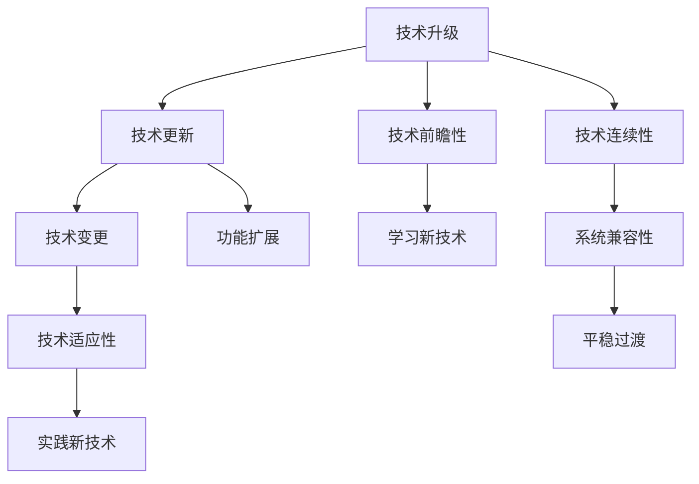

                 

# 程序员如何应对技术升级与变更

### 1. 背景介绍
在快速发展的科技行业中，技术升级与变更已经成为常态。无论是新兴技术的涌现，还是已有技术的迭代升级，都要求程序员不断学习和适应，以保持技术竞争力。然而，技术更新迭代的速度之快，往往让许多程序员感到压力巨大。本文将从技术认知、能力提升和心态调整三个方面，探讨程序员如何有效应对技术升级与变更，保持持续学习和成长。

### 2. 核心概念与联系

#### 2.1 核心概念概述

- **技术升级 (Technology Upgrade)**: 指随着技术的发展，旧技术被新技术替代，原有系统的功能、结构、接口等需要进行改造的过程。
- **技术变更 (Technology Change)**: 指技术实现细节的改变，如算法、框架、工具等，但总体架构和功能保持不变。
- **技术连续性 (Technology Continuity)**: 指技术更新过程中保持原有功能的连贯性和兼容性，确保新旧系统平稳过渡。
- **技术适应性 (Technology Adaptability)**: 指技术升级或变更后，开发者能够迅速学习和应用新知识的能力。
- **技术前瞻性 (Technology Foresight)**: 指对未来技术趋势的预判和把握，在技术尚未普及时提前进行学习和布局。

这些概念构成了程序员在技术升级与变更过程中需要关注和应对的核心点。通过理解这些概念，我们能够更好地规划自己的学习路径和实践策略。

#### 2.2 核心概念原理和架构的 Mermaid 流程图



这个流程图展示了技术升级、变更和前瞻性之间的关系，以及学习、适应和连续性在技术应对中的作用。

### 3. 核心算法原理 & 具体操作步骤

#### 3.1 算法原理概述

技术升级与变更的核心是算法的优化和框架的演进。以下是几个核心原理：

1. **算法迭代**: 新的算法可能更高效、更准确，通过算法迭代提升系统性能。
2. **框架升级**: 新的框架可能提供更好的开发工具、更高效的执行引擎，提升开发效率和系统稳定性。
3. **功能增强**: 通过新增功能或改进现有功能，提升系统适用性和用户体验。
4. **接口重构**: 通过API或SDK的更新，实现系统的接口标准化和统一，提高系统间的互操作性。
5. **工具集成**: 集成新的开发工具或测试工具，提升开发和测试效率。

#### 3.2 算法步骤详解

##### 3.2.1 需求分析

- **确定升级目标**: 评估现有技术的局限性和潜在问题，明确升级的必要性和目标。
- **功能评估**: 分析新功能或新算法对现有系统的影响，评估其可行性和优势。

##### 3.2.2 技术调研

- **技术选型**: 基于需求分析，选择最适合的技术方案，包括算法、框架、工具等。
- **技术评估**: 对选定的技术进行评估，包括性能、稳定性、兼容性等方面的测试。

##### 3.2.3 升级实施

- **项目规划**: 制定详细的项目计划，包括时间、资源、风险等。
- **迁移策略**: 确定如何从旧技术迁移到新技术，包括数据迁移、代码重构等。
- **测试验证**: 对新系统进行全面测试，确保功能正确、性能稳定。
- **发布上线**: 在新系统经过充分验证后，逐步切换旧系统到新系统。

##### 3.2.4 反馈优化

- **持续监控**: 对新系统进行持续监控，收集用户反馈和性能数据。
- **问题修复**: 根据监控结果和用户反馈，及时修复新系统中的问题。
- **性能调优**: 对新系统进行性能调优，确保其运行效率和稳定性。

#### 3.3 算法优缺点

##### 3.3.1 优点

1. **提升系统性能**: 通过算法迭代和框架升级，提升系统性能和用户体验。
2. **增强系统功能**: 通过新增功能或改进现有功能，增强系统适用性和竞争力。
3. **提升开发效率**: 通过工具集成和接口重构，提高开发和测试效率。
4. **增强系统稳定性**: 通过全面的测试和优化，提升系统稳定性和可靠性。

##### 3.3.2 缺点

1. **技术学习曲线陡峭**: 新技术的学习和掌握需要时间和精力，尤其是新算法和框架。
2. **迁移成本高**: 系统迁移过程中，数据、代码和配置等需要进行全面重构，成本较高。
3. **风险控制难**: 技术变更可能带来未知的风险，如性能波动、兼容性问题等，需要严格控制。

#### 3.4 算法应用领域

技术升级与变更的应用领域非常广泛，以下是几个典型示例：

- **Web开发**: 从传统的JavaScript框架（如jQuery）升级到现代框架（如React、Vue），提升前端性能和开发效率。
- **后端系统**: 从旧的Java EE架构升级到Spring Boot或Node.js，提高系统灵活性和扩展性。
- **数据库系统**: 从传统的关系型数据库（如Oracle）升级到NoSQL数据库（如MongoDB），适应大数据和分布式存储需求。
- **人工智能**: 从传统的机器学习算法升级到深度学习算法，提升模型的精度和泛化能力。

### 4. 数学模型和公式 & 详细讲解 & 举例说明

#### 4.1 数学模型构建

技术升级与变更的数学模型构建主要涉及以下几个要素：

1. **性能评估模型**: 用于量化新旧技术的性能差异，如响应时间、吞吐量、准确率等。
2. **风险评估模型**: 用于评估技术升级的风险和潜在影响，如迁移成本、系统稳定性等。
3. **优化模型**: 用于指导技术升级的优化策略，如算法选择、参数配置等。

#### 4.2 公式推导过程

以Web前端技术升级为例，假设旧技术为jQuery，新技术为React。设旧技术性能指标为$P_{\text{old}}$，新技术性能指标为$P_{\text{new}}$。

1. **性能评估模型**:
   $$
   \text{性能提升} = P_{\text{new}} - P_{\text{old}}
   $$

2. **风险评估模型**:
   $$
   \text{风险系数} = \text{迁移成本} + \text{稳定性损失} + \text{学习成本}
   $$

3. **优化模型**:
   $$
   \text{优化策略} = \text{性能提升} / \text{风险系数}
   $$

#### 4.3 案例分析与讲解

假设某电商平台需要从旧技术升级为React。旧技术为jQuery，性能为$P_{\text{old}}=100$，迁移成本为$C_{\text{migration}}=1000$，稳定性损失为$L_{\text{stability}}=0.1$，学习成本为$C_{\text{learning}}=200$。

1. **性能评估**:
   $$
   \text{性能提升} = 性能新旧差异 / 性能旧值 = (P_{\text{new}} - P_{\text{old}}) / P_{\text{old}}
   $$

2. **风险评估**:
   $$
   \text{风险系数} = C_{\text{migration}} + L_{\text{stability}} + C_{\text{learning}} = 1000 + 0.1 + 200 = 1200
   $$

3. **优化策略**:
   $$
   \text{优化策略} = \text{性能提升} / \text{风险系数} = (P_{\text{new}} - P_{\text{old}}) / 1200
   $$

通过这些模型和公式，可以科学地评估技术升级的收益和风险，指导优化策略。

### 5. 项目实践：代码实例和详细解释说明

#### 5.1 开发环境搭建

以下是基于JavaScript框架从jQuery升级到React的开发环境搭建流程：

1. **安装Node.js和npm**:
   ```bash
   sudo apt-get install nodejs npm
   ```

2. **安装React**:
   ```bash
   npm install react react-dom
   ```

3. **创建项目**:
   ```bash
   npx create-react-app my-app
   cd my-app
   ```

4. **迁移代码**:
   将旧代码逐步迁移到React组件中。

#### 5.2 源代码详细实现

以下是部分代码示例：

```javascript
// 旧代码，使用jQuery
function loadData(callback) {
  $.get('data.json', function(data) {
    callback(data);
  });
}

// 新代码，使用React
function App() {
  const [data, setData] = useState([]);
  
  useEffect(() => {
    loadData((data) => {
      setData(data);
    });
  }, []);

  return (
    <div>
      {data.map((item) => (
        <div key={item.id}>{item.name}</div>
      ))}
    </div>
  );
}

// 组件调用
ReactDOM.render(<App />, document.getElementById('root'));
```

#### 5.3 代码解读与分析

**迁移策略**:
- 将旧代码逐步替换为新代码，确保代码的可维护性和可读性。
- 使用React的`useEffect`钩子管理副作用，确保数据加载的正确性和稳定性。

**性能优化**:
- 使用React的虚拟DOM和diff算法，提升渲染性能。
- 使用React的`useMemo`和`useCallback`优化数据和回调函数。

**测试验证**:
- 对新系统进行全面的单元测试和集成测试，确保新功能的正确性和性能。

#### 5.4 运行结果展示

通过前端监控工具（如Chrome DevTools），可以看到新系统在性能、响应时间等方面的提升。

### 6. 实际应用场景

#### 6.1 Web开发

在Web开发中，技术升级与变更非常常见。如从jQuery升级到React，从Angular升级到Vue等。新框架提供了更好的组件化、状态管理、性能优化等特性，提升了开发效率和用户体验。

#### 6.2 后端系统

在后端系统开发中，技术升级与变更同样重要。如从Java EE升级到Spring Boot，从MyBatis升级到Hibernate等。新框架提供了更轻量级的开发方式、更高效的缓存机制、更完善的日志和监控功能，提升了系统的灵活性和可扩展性。

#### 6.3 数据库系统

在数据库系统升级中，技术变更主要体现在从传统的关系型数据库升级到NoSQL数据库。如从Oracle升级到MongoDB，从MySQL升级到Cassandra等。新数据库提供了更好的分布式存储、更高的并发处理能力、更灵活的数据模型，提升了系统的可扩展性和数据处理能力。

#### 6.4 人工智能

在人工智能领域，技术升级与变更主要体现在算法和框架的演进。如从传统机器学习算法升级到深度学习算法，从TensorFlow升级到PyTorch等。新算法提供了更强大的模型表示能力、更高效的网络结构、更灵活的优化策略，提升了模型的精度和泛化能力。

### 7. 工具和资源推荐

#### 7.1 学习资源推荐

1. **《深入浅出Java框架》**: 这本书介绍了常用的Java框架（如Spring Boot、MyBatis），涵盖从入门到进阶的内容，适合开发者学习。
2. **《JavaScript高级程序设计》**: 这本书详细讲解了JavaScript的最新特性和最佳实践，适合前端开发者学习。
3. **《深度学习》**: 这本书介绍了深度学习的基础理论和应用，适合人工智能开发者学习。
4. **《数据科学入门》**: 这本书介绍了数据科学的基本概念和技术栈，适合数据分析和数据挖掘开发者学习。

#### 7.2 开发工具推荐

1. **Visual Studio Code**: 一款轻量级且功能强大的代码编辑器，支持多种编程语言和框架。
2. **Jenkins**: 一款开源的持续集成工具，支持自动化构建、测试和部署，适合团队协作开发。
3. **Docker**: 一款容器化技术，适合在多平台环境中部署和管理应用。
4. **GitLab**: 一款开源的DevOps平台，支持代码托管、CI/CD、项目管理等功能，适合团队协作开发。

#### 7.3 相关论文推荐

1. **《机器学习实战》**: 这本书介绍了常用的机器学习算法和应用，适合初学者学习。
2. **《TensorFlow实战》**: 这本书介绍了TensorFlow的最新特性和应用，适合深度学习开发者学习。
3. **《分布式系统原理与实践》**: 这本书介绍了分布式系统设计和实现的原则和实践，适合系统架构师学习。
4. **《软件架构模式》**: 这本书介绍了常见的软件架构模式和设计原则，适合系统架构师学习。

### 8. 总结：未来发展趋势与挑战

#### 8.1 研究成果总结

技术升级与变更是大数据和云计算时代的重要特征，程序员需要不断学习和适应。本文从技术认知、能力提升和心态调整三个方面，探讨了程序员如何有效应对技术升级与变更，保持持续学习和成长。

#### 8.2 未来发展趋势

未来的技术升级与变更将更加频繁和深入，主要趋势如下：

1. **云计算和容器化**: 云计算和容器化技术将广泛应用于各个领域，提升系统部署和管理的效率和灵活性。
2. **大数据和人工智能**: 大数据和人工智能技术将进一步普及，推动业务智能化和数据驱动决策。
3. **微服务和DevOps**: 微服务架构和DevOps文化将进一步发展，提升系统可维护性和交付效率。
4. **跨平台和跨语言**: 跨平台和跨语言开发将更加普及，提升开发效率和兼容性。

#### 8.3 面临的挑战

技术升级与变更也面临诸多挑战：

1. **学习成本高**: 新技术的引入需要较高的学习成本，尤其是在时间紧任务重的项目中。
2. **兼容性差**: 新技术和旧技术之间的兼容性问题需要仔细评估和处理。
3. **性能波动**: 新技术的引入可能带来性能波动，需要全面测试和优化。
4. **风险控制**: 技术变更可能带来未知的风险，需要严格控制和管理。

#### 8.4 研究展望

未来的技术升级与变更需要更加科学和系统的方法，主要方向如下：

1. **持续学习和培训**: 建立持续学习和培训机制，帮助团队成员不断掌握新技能。
2. **技术评估和风险控制**: 采用技术评估和风险控制模型，评估新技术的可行性和风险。
3. **技术架构演进**: 基于微服务架构和DevOps文化，逐步演进系统架构和技术栈。
4. **技术前瞻性和储备**: 提前布局和储备新技术，保持技术前瞻性和竞争力。

### 9. 附录：常见问题与解答

#### Q1: 如何评估新技术的可行性？

A: 评估新技术的可行性主要从以下几个方面考虑：

1. **性能评估**: 对比新旧技术在性能上的差异，如响应时间、吞吐量、准确率等。
2. **风险评估**: 评估新技术可能带来的风险，如迁移成本、稳定性损失、学习成本等。
3. **需求匹配**: 评估新技术是否满足业务需求，如功能扩展、用户体验、开发效率等。
4. **技术支持**: 评估新技术的社区支持、文档完备性、开发者资源等。

#### Q2: 如何避免技术变更带来的风险？

A: 避免技术变更带来的风险主要从以下几个方面考虑：

1. **全面评估**: 在系统升级前进行全面的评估和测试，确保新系统的稳定性和兼容性。
2. **分阶段迁移**: 采用分阶段迁移策略，逐步从旧系统迁移到新系统，减少迁移风险。
3. **备份数据**: 在系统迁移前备份关键数据，确保数据安全和可恢复性。
4. **风险控制**: 制定详细的风险控制策略，如监控、告警、应急预案等。

#### Q3: 如何提升技术升级与变更的效率？

A: 提升技术升级与变更的效率主要从以下几个方面考虑：

1. **持续学习**: 建立持续学习和培训机制，提升团队的平均技术水平。
2. **自动化工具**: 使用自动化工具（如Jenkins、Docker、GitLab等），提升开发效率和部署效率。
3. **性能优化**: 优化新系统的性能，提升响应速度和并发处理能力。
4. **代码重构**: 逐步重构旧代码，提升代码质量和可维护性。

---

作者：禅与计算机程序设计艺术 / Zen and the Art of Computer Programming

