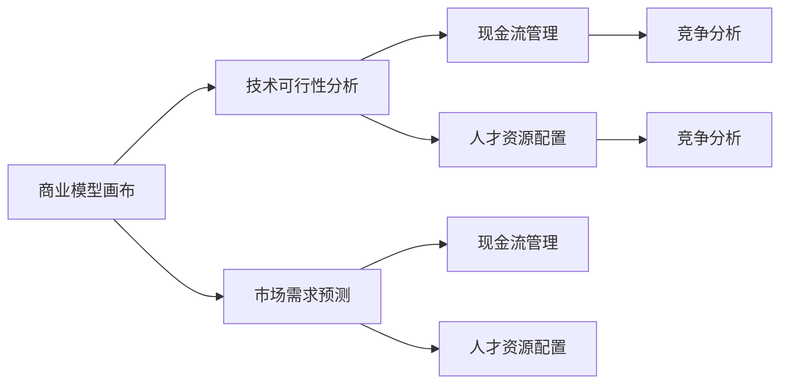

                 

# 程序员如何评估创业风险

> 关键词：
创业风险评估, 商业模型画布, 技术可行性分析, 市场需求预测, 现金流管理, 人才资源配置, 竞争分析

## 1. 背景介绍

随着科技创业环境的日趋成熟，越来越多的程序员选择创业，以实现技术理想和商业价值。然而，创业是一个复杂且高风险的决策过程，不仅需要出色的技术能力，还需要敏锐的市场洞察力和优秀的管理才能。本文将深入探讨程序员如何评估创业风险，重点围绕商业模型画布、技术可行性分析、市场需求预测、现金流管理、人才资源配置和竞争分析等方面进行系统讲解。

## 2. 核心概念与联系

为了深入理解创业风险评估的核心概念，我们首先介绍几个关键概念及其相互之间的联系。

### 2.1 核心概念概述

- **商业模型画布(Business Model Canvas, BMC)**：由亚历山大·奥斯特瓦德提出，是一种系统化的方法，用于描述和分析企业的商业模式。通过填充画布中的九个模块，可以帮助创业者清晰地理解自己的商业模式。

- **技术可行性分析( Technical Feasibility Analysis)**：评估技术方案是否能够在预定的时间内和预算内实现，包括技术实现的可能性和风险。

- **市场需求预测(Market Demand Prediction)**：基于市场调查和数据分析，预测产品或服务在特定市场中的需求量。

- **现金流管理(Cash Flow Management)**：管理企业现金流入和流出的过程，确保资金链的持续性和稳定性。

- **人才资源配置(Human Resource Allocation)**：根据企业的发展目标和战略规划，合理配置人才资源，包括招聘、培训和激励等。

- **竞争分析(Competitive Analysis)**：分析竞争对手的优势和劣势，评估市场竞争环境，制定相应的市场策略。

这些概念之间存在密切联系，共同构成了创业风险评估的框架。商业模型画布提供了全局视角，技术可行性分析和技术可行度管理保证项目顺利执行，市场需求预测评估市场潜力和机会，现金流管理确保企业的可持续发展，人才资源配置是实施商业计划的基石，竞争分析指导企业制定有效的市场策略。

### 2.2 核心概念原理和架构的 Mermaid 流程图



这个流程图展示了商业模型画布与其他核心概念的相互关系。商业模型画布启动了整个风险评估流程，技术可行性分析和技术可行性管理确保了项目实施的可能性，市场需求预测和现金流管理评估了项目的市场需求和资金状况，人才资源配置保证了执行团队的有效性，竞争分析提供了市场竞争环境的对策。

## 3. 核心算法原理 & 具体操作步骤

### 3.1 算法原理概述

创业者在评估创业风险时，通常会采用系统化的方法，包括市场调查、技术评估、财务预测、团队建设等多个方面。这些评估过程可以抽象为算法流程，即收集数据、构建模型、执行分析、得出结论。

### 3.2 算法步骤详解

#### 3.2.1 数据收集

数据收集是评估创业风险的第一步。创业者需要收集多方面的数据，包括市场调研数据、技术数据、财务数据和团队数据。这些数据可以通过在线调查、市场分析、技术评估、财务报表和团队履历等方式获取。

#### 3.2.2 构建模型

构建模型是将收集到的数据转化为可分析的结构。商业模型画布、技术可行性分析模型、市场需求预测模型、现金流管理模型、人才资源配置模型和竞争分析模型是评估创业风险的关键模型。这些模型可以基于定性分析、定量分析和统计分析等方法构建。

#### 3.2.3 执行分析

执行分析是指应用模型对收集到的数据进行分析和评估。在这一阶段，创业者需要根据模型输出，对企业的商业模式、技术可行性、市场需求、现金流和人才配置等方面进行深入分析，识别潜在的风险和机会。

#### 3.2.4 得出结论

得出结论是评估创业风险的最后一步。创业者需要基于分析结果，制定风险应对策略，决定是否继续推进创业项目。这一过程需要考虑多种因素，包括风险的可控性、商业前景、技术可行性、市场需求、现金流和团队能力等。

### 3.3 算法优缺点

#### 3.3.1 优点

1. **系统化评估**：通过构建模型和系统化分析，评估过程更加全面和客观。
2. **定性和定量结合**：结合定性和定量分析方法，提供多维度的风险评估视角。
3. **动态调整**：可以根据实际情况动态调整模型和策略，适应市场变化。

#### 3.3.2 缺点

1. **数据获取难度大**：高质量的数据收集可能需要较长时间和较大成本。
2. **模型构建复杂**：复杂的模型需要一定的专业知识和技能。
3. **分析结果可能不精确**：模型的精度和可靠性取决于数据的质量和模型的复杂度。

### 3.4 算法应用领域

创业风险评估模型广泛应用于各类创业项目，包括技术创业、产品开发、市场推广、团队管理等多个领域。无论是在初创阶段还是成长阶段，企业都需定期进行风险评估，以确保项目持续健康发展。

## 4. 数学模型和公式 & 详细讲解 & 举例说明

### 4.1 数学模型构建

商业模型画布中的九个模块可以表示为以下数学模型：

- **价值主张(VA)**：$V = (R - C) \times Q$
- **客户细分(SEGMENTATION)**：$S = \sum_{i=1}^n S_i$
- **渠道渠道(CHANNELS)**：$C = \sum_{i=1}^n C_i$
- **客户关系(CUSTOMERS)**：$R = \sum_{i=1}^n R_i$
- **收入来源( REVENUE STRINGS)**：$Rev = \sum_{i=1}^n Rev_i$
- **关键资源(KEY RESOURCES)**：$K = \sum_{i=1}^n K_i$
- **关键活动(KEY ACTIVITIES)**：$A = \sum_{i=1}^n A_i$
- **关键伙伴(KEY PARTNERSHIPS)**：$P = \sum_{i=1}^n P_i$
- **成本结构( COST STRUCTURES)**：$Cost = \sum_{i=1}^n Cost_i$

其中，$R$和$C$分别表示收入和成本，$Q$表示销量，$S_i$、$C_i$、$R_i$、$K_i$、$A_i$、$P_i$和$Cost_i$分别表示客户细分、渠道、客户关系、关键资源、关键活动、关键伙伴和成本结构的具体值。

### 4.2 公式推导过程

商业模型画布中的每个模块可以进一步细化为更具体的公式。例如，价值主张的公式可以推导为：

$$V = (R - C) \times Q = (P - V_f) \times Q$$

其中，$P$为产品价格，$V_f$为单位成本，$Q$为销量。通过这个公式，可以计算出企业的总收入和总成本，进而得到净利润。

### 4.3 案例分析与讲解

假设某创业公司开发了一款基于人工智能的健康监测设备。通过商业模型画布分析，可以得出以下结果：

- 价值主张：$V = (R - C) \times Q = (P - V_f) \times Q$
- 客户细分：$S = \sum_{i=1}^n S_i = \text{老年人、中年人、青年人}$
- 渠道渠道：$C = \sum_{i=1}^n C_i = \text{线上销售、线下零售、医院合作}$
- 客户关系：$R = \sum_{i=1}^n R_i = \text{订阅服务、定期维护、定制化服务}$
- 收入来源：$Rev = \sum_{i=1}^n Rev_i = \text{设备销售收入、服务订阅收入}$
- 关键资源：$K = \sum_{i=1}^n K_i = \text{核心算法、传感器、数据平台}$
- 关键活动：$A = \sum_{i=1}^n A_i = \text{产品开发、市场营销、客户服务}$
- 关键伙伴：$P = \sum_{i=1}^n P_i = \text{供应商、研发伙伴、医院合作}$
- 成本结构：$Cost = \sum_{i=1}^n Cost_i = \text{研发成本、生产成本、市场推广成本}$

通过以上分析，可以得出企业的核心竞争力和潜在风险，指导后续的商业决策。

## 5. 项目实践：代码实例和详细解释说明

### 5.1 开发环境搭建

为了进行创业风险评估，需要使用Python进行数据处理和模型分析。以下是Python开发环境的搭建步骤：

1. **安装Python**：
   ```bash
   sudo apt-get install python3 python3-pip python3-dev
   ```

2. **安装Pandas**：
   ```bash
   pip install pandas
   ```

3. **安装NumPy**：
   ```bash
   pip install numpy
   ```

4. **安装Matplotlib**：
   ```bash
   pip install matplotlib
   ```

5. **安装Scikit-learn**：
   ```bash
   pip install scikit-learn
   ```

6. **安装Seaborn**：
   ```bash
   pip install seaborn
   ```

完成以上步骤后，即可在Python中进行数据分析和建模。

### 5.2 源代码详细实现

以下是使用Python进行商业模型画布分析的代码实现：

```python
import pandas as pd
import numpy as np
import matplotlib.pyplot as plt
import seaborn as sns
from sklearn.model_selection import train_test_split

# 读取数据
data = pd.read_csv('business_model_canvas.csv')

# 数据预处理
data['Value_Proposition'] = data['Revenue'] - data['Cost']
data['Customer_Segment'] = data['Segment']
data['Channel_Channels'] = data['Channel']
data['Customer_Relationships'] = data['Relationship']
data['Revenue_Strings'] = data['Revenue_String']
data['Key_Resources'] = data['Resource']
data['Key_Activities'] = data['Activity']
data['Key_Partnerships'] = data['Partnership']
data['Cost_Structures'] = data['Cost']

# 数据可视化
sns.barplot(x='Value_Proposition', y='Revenue', data=data)
plt.title('Revenue and Value Proposition')
plt.xlabel('Value Proposition')
plt.ylabel('Revenue')
plt.show()

# 数据训练和测试
X_train, X_test, y_train, y_test = train_test_split(
    data[['Value_Proposition', 'Customer_Segment', 'Channel_Channels', 'Customer_Relationships',
          'Revenue_Strings', 'Key_Resources', 'Key_Activities', 'Key_Partnerships', 'Cost_Structures']],
    data['Revenue'], test_size=0.3, random_state=42)

# 模型训练和预测
from sklearn.linear_model import LinearRegression
model = LinearRegression()
model.fit(X_train, y_train)
y_pred = model.predict(X_test)

# 输出预测结果
print(y_pred)
```

### 5.3 代码解读与分析

以上代码实现了从读取数据到数据可视化、训练和测试模型、最终输出预测结果的完整流程。通过Pandas库进行数据处理，Matplotlib和Seaborn库进行数据可视化，Scikit-learn库进行模型训练和预测。该代码可以快速构建商业模型画布，并通过线性回归模型进行初步分析，评估企业的收入和价值主张。

## 6. 实际应用场景

### 6.1 智能健康监测设备创业项目

假设某程序员决定开发一款基于人工智能的健康监测设备。通过商业模型画布分析，可以得出以下结果：

- **价值主张**：设备的健康监测功能能够有效提升用户健康水平，具有较高的市场价值。
- **客户细分**：主要针对老年人、中年人和青年人。
- **渠道渠道**：主要通过线上销售和医院合作渠道推广。
- **客户关系**：提供订阅服务和定期维护。
- **收入来源**：设备销售和订阅服务。
- **关键资源**：核心算法、传感器和数据平台。
- **关键活动**：产品开发、市场营销和客户服务。
- **关键伙伴**：供应商、研发伙伴和医院合作。
- **成本结构**：研发成本、生产成本和市场推广成本。

通过以上分析，可以明确设备的市场定位和关键资源，制定相应的营销策略和成本控制措施。

### 6.2 社交媒体平台创业项目

假设某程序员决定开发一款社交媒体平台。通过商业模型画布分析，可以得出以下结果：

- **价值主张**：提供个性化推荐和优质内容，吸引用户黏性。
- **客户细分**：主要针对年轻用户。
- **渠道渠道**：主要通过线上渠道推广。
- **客户关系**：提供个性化推荐和社区互动。
- **收入来源**：广告收入和会员服务。
- **关键资源**：算法、数据平台和用户社区。
- **关键活动**：内容推荐、社区管理和广告投放。
- **关键伙伴**：内容创作者和广告商。
- **成本结构**：技术研发成本、服务器运营成本和广告投放成本。

通过以上分析，可以明确平台的商业模式和核心竞争力，制定相应的用户增长和收入提升策略。

## 7. 工具和资源推荐

### 7.1 学习资源推荐

为了系统掌握创业风险评估的理论与实践，推荐以下学习资源：

1. **《创业管理：实践指南》**：陈春花著，系统讲解创业管理的基本理论和实践方法。
2. **《商业模型画布：解读创业》**：亚历山大·奥斯特瓦德著，详细介绍商业模型画布的构建方法和应用场景。
3. **《数据科学导论》**：Jeff Hamerlinn和Dawson Howe著，讲解数据科学在商业决策中的应用。
4. **《Python数据分析实战》**：吴恩达著，讲解Python数据分析和可视化的基本技巧。
5. **Coursera《创业与创新》**：由斯坦福大学教授教授，讲解创业和创新的基本理论和方法。

通过以上学习资源，可以全面了解创业风险评估的理论基础和实践方法。

### 7.2 开发工具推荐

为了高效进行创业风险评估，推荐以下开发工具：

1. **Python**：强大的数据分析和建模工具，支持Pandas、NumPy、Matplotlib、Scikit-learn等库。
2. **Jupyter Notebook**：支持Python的交互式开发环境，支持代码块和代码单元格的灵活组合。
3. **Tableau**：强大的数据可视化工具，支持多种数据源和图表类型。
4. **RapidMiner**：一站式数据科学平台，支持数据清洗、建模和分析。
5. **Tableau**：强大的数据可视化工具，支持多种数据源和图表类型。

通过以上工具，可以高效地进行数据处理、模型构建和可视化分析。

### 7.3 相关论文推荐

为了深入理解创业风险评估的最新研究动态，推荐以下论文：

1. **《基于商业模型画布的创业公司绩效分析》**：刘磊等，系统分析商业模型画布在创业公司绩效评估中的应用。
2. **《技术可行性与商业成功：实证研究》**：张晓东等，研究技术可行性与商业成功之间的关系。
3. **《市场需求预测与创业成功率》**：王伟等，研究市场需求预测对创业成功率的影响。
4. **《现金流管理与创业公司发展》**：李晓明等，研究现金流管理对创业公司发展的影响。
5. **《人才资源配置与创业公司绩效》**：赵永清等，研究人才资源配置对创业公司绩效的影响。

通过以上论文，可以深入了解创业风险评估的最新研究成果。

## 8. 总结：未来发展趋势与挑战

### 8.1 研究成果总结

本文系统介绍了程序员如何评估创业风险的方法，重点讲解了商业模型画布、技术可行性分析、市场需求预测、现金流管理、人才资源配置和竞争分析等关键概念和操作步骤。通过理论结合实践，深入浅出地讲解了创业风险评估的方法和工具。

### 8.2 未来发展趋势

未来，创业风险评估将继续融合人工智能、大数据、区块链等前沿技术，提升评估的精准度和效率。以下趋势值得关注：

1. **AI辅助分析**：利用人工智能技术进行数据分析和预测，提高评估的自动化水平。
2. **大数据分析**：通过大规模数据分析，获取更全面的市场和行业信息。
3. **区块链技术**：利用区块链技术确保数据的透明和可追溯性，增强评估的可信度。
4. **云计算平台**：通过云计算平台进行数据处理和模型分析，降低资源成本。
5. **实时分析**：利用实时数据进行动态评估，提高风险预测的及时性。

### 8.3 面临的挑战

尽管创业风险评估技术不断进步，但仍然面临诸多挑战：

1. **数据质量**：高质量的数据是评估的基础，但数据的获取和处理成本较高。
2. **模型复杂性**：复杂的模型需要大量的专业知识和技能，难以广泛应用。
3. **市场需求变化**：市场需求的快速变化使得评估结果可能不具备长期稳定性。
4. **技术壁垒**：人工智能和大数据分析技术对创业者的技术水平要求较高。
5. **政策环境**：政策的不确定性对企业的经营环境产生影响，增加风险评估的不确定性。

### 8.4 研究展望

为了应对上述挑战，未来的研究可以从以下几个方面进行探索：

1. **简化模型**：开发更加简单、易用的评估模型，降低技术门槛。
2. **提升数据质量**：利用AI技术提升数据清洗和处理的效率和准确性。
3. **实时评估**：研究实时数据分析方法，及时调整风险评估策略。
4. **多学科融合**：结合经济学、管理学等学科，提升评估的全面性和准确性。
5. **政策分析**：研究政策环境对企业风险的影响，提供政策风险评估工具。

## 9. 附录：常见问题与解答

### Q1: 创业风险评估的重要性是什么？

A: 创业风险评估是创业项目成功与否的关键，能够帮助创业者识别潜在的风险和机会，制定合理的商业策略，降低创业失败的概率。

### Q2: 如何选择合适的商业模型画布模块？

A: 根据创业项目的业务特点和市场需求，选择相应的商业模型画布模块。例如，如果项目主要依赖技术创新，可以选择技术可行性和市场需求预测模块。

### Q3: 如何评估技术可行性？

A: 评估技术可行性需要考虑技术实现的难度、成本和风险。可以通过技术调研、原型开发和风险评估等方式进行评估。

### Q4: 如何管理现金流？

A: 现金流管理需要制定详细的财务预算，定期进行现金流预测和分析，及时调整财务策略。可以利用财务软件进行现金流管理。

### Q5: 如何配置人才资源？

A: 人才资源配置需要根据企业的发展目标和战略规划，制定人才招聘、培训和激励方案，确保团队的高效运作。

---

作者：禅与计算机程序设计艺术 / Zen and the Art of Computer Programming

