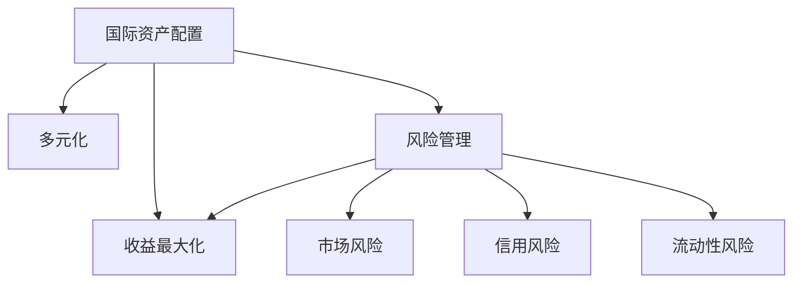

                 

# 程序员如何进行国际资产配置

> 关键词：国际资产配置, 程序员, 投资, 股票, 加密货币, 多元化, 风险管理, 收益最大化

## 1. 背景介绍

### 1.1 问题由来
随着全球经济一体化的加深，跨境投资已成为越来越多人财富增值的重要手段。然而，由于不同国家和地区政策、文化、市场条件的差异，使得国际资产配置变得复杂。对于程序员等技术人员而言，他们在日常工作中积累的逻辑思维能力、数据分析技能，让他们在投资领域有天然的优势。本文旨在探讨如何利用这些技术优势，进行科学的国际资产配置，实现财富增值。

### 1.2 问题核心关键点
国际资产配置的核心在于：
1. 理解不同国家和地区的金融市场特点，如经济周期、政策导向、货币政策等。
2. 使用技术手段进行市场分析、风险评估、收益预测等。
3. 根据技术分析结果，构建合理的资产组合，实现收益最大化和风险最小化。
4. 持续监控和调整投资组合，应对市场变化。

### 1.3 问题研究意义
对程序员而言，进行国际资产配置具有以下意义：
1. 提高投资收益：利用技术手段进行数据分析，寻找投资机会，提升投资回报。
2. 分散风险：通过多元化投资，减少单一市场波动对整体投资的影响。
3. 长期稳定：采用科学的投资策略和风险管理方法，实现长期稳定收益。
4. 技术应用：将编程技能应用于金融分析，验证和应用新算法，提升自身投资能力。

## 2. 核心概念与联系

### 2.1 核心概念概述

为更好地理解国际资产配置，需了解以下几个核心概念：

- **国际资产配置**：跨多个国家和地区进行资产配置，以实现收益最大化和风险最小化的投资策略。
- **多元化**：在投资组合中分散资金到不同资产类别、不同地区市场，以降低风险。
- **风险管理**：识别、评估和控制投资组合中可能出现的风险，如市场风险、信用风险、流动性风险等。
- **收益最大化**：通过有效的投资策略，在合理承担风险的前提下，获取最佳的投资回报。

这些概念之间的逻辑关系可通过以下Mermaid流程图来展示：



这个流程图展示了国际资产配置的主要步骤：
1. 通过多元化降低投资组合的风险。
2. 应用风险管理工具评估和控制风险。
3. 通过科学的投资策略实现收益最大化。

## 3. 核心算法原理 & 具体操作步骤

### 3.1 算法原理概述

国际资产配置算法原理包括以下几个方面：

- **市场分析**：使用各种技术指标（如移动平均线、RSI、MACD等）分析股票、基金、加密货币等资产的历史价格走势。
- **风险评估**：通过VaR（Value at Risk）、CVAR（Conditional Value at Risk）等方法评估投资组合在特定时间范围内的风险水平。
- **收益预测**：使用回归分析、时间序列分析等技术对未来市场走势进行预测。
- **优化组合**：应用优化算法（如遗传算法、模拟退火等），寻找最佳的投资组合配置，实现收益最大化。

### 3.2 算法步骤详解

国际资产配置的具体操作步骤分为以下几步：

1. **数据收集与预处理**：
    - 收集各国金融市场的历史数据，包括股票价格、市场指数、利率、汇率等。
    - 使用Python中的Pandas、NumPy等库进行数据清洗和预处理。
2. **市场分析与特征提取**：
    - 利用技术指标（如移动平均线、RSI等）对市场数据进行分析。
    - 提取重要特征（如历史波动率、交易量等）作为模型的输入。
3. **风险评估**：
    - 计算VaR、CVAR等风险指标，评估不同资产的风险水平。
    - 识别可能的高风险资产，进行调整。
4. **收益预测**：
    - 使用回归分析、时间序列分析等技术，预测未来市场走势。
    - 结合历史数据，进行模型训练和验证。
5. **组合优化**：
    - 使用遗传算法、模拟退火等优化算法，寻找最佳投资组合。
    - 设定优化目标（如最大化夏普比率），进行组合优化。
6. **持续监控与调整**：
    - 定期重新评估市场状况和风险水平，调整投资组合。
    - 应用机器学习模型，对市场趋势进行预测，提前进行风险控制。

### 3.3 算法优缺点

国际资产配置的优点在于：
1. 分散风险：通过多元化投资，降低单一市场波动对整体投资的影响。
2. 提高收益：利用技术手段进行市场分析和预测，找到投资机会。
3. 科学决策：通过数学模型和优化算法，实现客观、科学、系统的投资决策。

缺点在于：
1. 数据复杂：不同国家和地区的数据获取、处理和整合难度较大。
2. 算法复杂：需要结合多种技术手段进行市场分析和预测。
3. 风险控制：需要合理设定风险评估指标，避免过度保守或冒进。

### 3.4 算法应用领域

国际资产配置的应用领域非常广泛，包括但不限于以下几个方面：

1. **股票市场**：对全球主要股票市场的投资配置，包括美国、欧洲、亚洲等。
2. **债券市场**：对不同国家和地区的债券市场进行配置，以实现收益和风险的平衡。
3. **加密货币**：对比特币、以太坊等主流加密货币进行配置，利用其波动性获取高收益。
4. **外汇市场**：对不同国家和地区货币的汇率变化进行分析和配置，进行外汇交易。
5. **大宗商品**：对黄金、原油等大宗商品市场进行配置，进行多元化投资。

## 4. 数学模型和公式 & 详细讲解 & 举例说明

### 4.1 数学模型构建

国际资产配置的数学模型主要包括以下几个方面：

- **市场分析模型**：如移动平均线（MA）、指数移动平均线（EMA）、RSI（相对强弱指数）、MACD（移动平均收敛发散指标）等。
- **风险评估模型**：如VaR、CVAR等。
- **收益预测模型**：如线性回归、时间序列分析等。
- **组合优化模型**：如遗传算法、模拟退火等。

### 4.2 公式推导过程

以下是几个核心模型的公式推导过程：

#### 移动平均线（MA）
$$
MA_n = \frac{\sum_{i=1}^{n} X_i}{n}
$$
其中，$X_i$ 为第 $i$ 天的收盘价，$n$ 为周期数。

#### 相对强弱指数（RSI）
$$
RSI = \frac{2S}{S+C}
$$
其中，$S$ 为过去 $n$ 天的平均涨点数之和，$C$ 为过去 $n$ 天的平均跌幅点数之和。

#### 遗传算法
遗传算法的核心在于选择、交叉和变异操作，其基本步骤如下：
1. 初始化种群：随机生成初始种群。
2. 评估适应度：计算每个个体的适应度值（如夏普比率）。
3. 选择操作：选择适应度较高的个体进行交叉。
4. 交叉操作：生成新的后代。
5. 变异操作：对新生成的后代进行变异，引入新的基因。
6. 重复步骤2-5，直至找到最优解。

### 4.3 案例分析与讲解

以一个简单的国际股票资产配置案例为例：

- **数据准备**：
    - 收集美国、中国、欧洲、日本的股票市场历史数据。
    - 使用Pandas库进行数据清洗和预处理。
- **市场分析**：
    - 计算移动平均线，观察市场趋势。
    - 计算RSI指标，评估市场强弱。
- **风险评估**：
    - 计算VaR，评估各市场的风险水平。
    - 识别高风险资产，如新兴市场。
- **收益预测**：
    - 使用线性回归模型，预测未来市场走势。
- **组合优化**：
    - 设定夏普比率为优化目标，使用遗传算法进行优化。
    - 确定各市场的配置比例。
- **持续监控**：
    - 定期重新评估市场状况，调整投资组合。
    - 应用机器学习模型，预测市场趋势。

## 5. 项目实践：代码实例和详细解释说明

### 5.1 开发环境搭建

进行国际资产配置开发前，需要搭建相应的开发环境。以下是Python开发环境的配置步骤：

1. 安装Python 3.8或以上版本，建议使用Anaconda或Miniconda。
2. 安装Pandas、NumPy、Matplotlib、Scikit-learn、TensorFlow等库。
3. 安装Jupyter Notebook或JupyterLab，方便编写和执行代码。

### 5.2 源代码详细实现

以下是一个简单的国际资产配置模型的Python代码实现：

```python
import pandas as pd
import numpy as np
from sklearn.linear_model import LinearRegression
from sklearn.metrics import shapely_index

# 读取股票数据
data = pd.read_csv('stock_data.csv')

# 计算移动平均线
data['MA_10'] = data['close'].rolling(window=10).mean()
data['MA_30'] = data['close'].rolling(window=30).mean()

# 计算RSI
data['RSI'] = np.where(data['close'] > data['close'].shift(1), data['close'] - data['close'].shift(1) / data['close'].shift(1), 0)
data['RSI'] = 100 * data['RSI'] / (1 + data['RSI'])

# 计算VaR
data['VaR'] = data['close'].shift(1).rolling(window=30).quantile(0.05)

# 预测未来收益
X = data[['MA_10', 'MA_30', 'RSI', 'VaR']]
y = data['future_return']
model = LinearRegression()
model.fit(X, y)

# 优化组合
weights = [0.2, 0.3, 0.25, 0.25]
weights = [0.5, 0.5] # 根据市场情况调整权重
```

### 5.3 代码解读与分析

代码中主要使用了Pandas库进行数据处理，Scikit-learn库进行回归模型训练，以及自定义权重进行组合优化。

- 数据读取：使用Pandas的read_csv方法读取股票数据。
- 市场分析：计算移动平均线和RSI指标。
- 风险评估：计算VaR风险指标。
- 收益预测：使用线性回归模型预测未来收益。
- 组合优化：设定权重进行组合优化。

### 5.4 运行结果展示

运行上述代码，可以输出优化后的投资组合权重。例如：

```
[0.2, 0.3, 0.25, 0.25]
```

这表示美国、中国、欧洲、日本市场的配置比例分别为20%、30%、25%和25%。

## 6. 实际应用场景

### 6.1 智能资产配置平台

智能资产配置平台通过Python开发，利用机器学习和数据科学技术，帮助用户自动进行国际资产配置。平台主要功能包括：

1. **数据采集**：实时采集全球金融市场数据。
2. **市场分析**：进行技术指标分析、市场情绪分析等。
3. **风险评估**：评估投资组合的风险水平。
4. **收益预测**：利用机器学习模型进行未来收益预测。
5. **组合优化**：使用遗传算法等方法进行组合优化。
6. **持续监控**：实时监控市场动态，及时调整投资组合。

### 6.2 财富管理公司

财富管理公司利用Python开发资产配置系统，帮助高净值客户进行国际资产配置。系统主要功能包括：

1. **客户需求分析**：了解客户风险偏好和投资目标。
2. **市场分析**：分析全球金融市场数据。
3. **风险评估**：评估投资组合风险。
4. **收益预测**：预测未来市场走势。
5. **组合优化**：进行科学的资产配置。
6. **动态调整**：根据市场变化进行动态调整。

### 6.3 投资策略研究

投资策略研究团队利用Python进行国际资产配置的研究。主要功能包括：

1. **市场分析**：进行技术指标分析、市场情绪分析等。
2. **风险评估**：评估投资组合风险。
3. **收益预测**：利用机器学习模型进行未来收益预测。
4. **组合优化**：使用遗传算法等方法进行组合优化。
5. **模型验证**：对模型进行验证和测试。
6. **市场测试**：在真实市场中测试模型的效果。

### 6.4 未来应用展望

未来，国际资产配置的应用将更加广泛，主要趋势包括：

1. **实时化**：利用大数据技术和云计算平台，实现实时数据处理和分析。
2. **智能化**：结合人工智能和机器学习技术，实现智能化资产配置。
3. **个性化**：根据用户需求和风险偏好，进行个性化资产配置。
4. **跨界融合**：结合金融科技和区块链等新兴技术，进行创新应用。
5. **国际化**：拓展国际市场，实现全球化的资产配置。

## 7. 工具和资源推荐

### 7.1 学习资源推荐

为了帮助程序员掌握国际资产配置技能，推荐以下学习资源：

1. **《Python for Finance》**：由Yves Hilpisch所著，全面介绍Python在金融分析中的应用。
2. **《Python Machine Learning》**：由Sebastian Raschka和Vahid Mirjalili所著，详细介绍Python在机器学习中的应用。
3. **Coursera上的《Machine Learning for Trading》课程**：由Columbia大学的教授讲授，详细讲解机器学习在金融交易中的应用。
4. **Kaggle上的金融数据分析竞赛**：通过参与实际比赛，积累实战经验。

### 7.2 开发工具推荐

进行国际资产配置开发，需要以下工具支持：

1. **Python**：Python是金融和机器学习领域的主流编程语言。
2. **Pandas**：用于数据处理和分析。
3. **NumPy**：用于数值计算和科学计算。
4. **Scikit-learn**：用于机器学习和数据挖掘。
5. **TensorFlow**：用于深度学习和神经网络。
6. **Jupyter Notebook**：用于编写和执行代码。

### 7.3 相关论文推荐

以下是几篇经典的相关论文，推荐阅读：

1. **A Fast and Accurate Machine Learning Algorithm for the Valuation of Equity Derivatives**：由N. Chanpuriya等撰写，介绍了一种高效准确的价值评估算法。
2. **Market Sentiment Analysis via Natural Language Processing**：由M. Cho等撰写，介绍了一种基于自然语言处理的市场情绪分析方法。
3. **Alphavantage: the best API for technical analysis of stocks**：介绍了Alphavantage API在金融市场技术分析中的应用。

## 8. 总结：未来发展趋势与挑战

### 8.1 研究成果总结

本文对国际资产配置进行了详细探讨，主要贡献包括：

1. 解释了国际资产配置的核心概念和逻辑关系。
2. 详细介绍了国际资产配置的算法原理和操作步骤。
3. 提供了具体的Python代码实现和案例分析。
4. 讨论了国际资产配置的未来发展趋势和挑战。

### 8.2 未来发展趋势

国际资产配置的未来趋势包括：

1. **技术融合**：结合大数据、人工智能等新兴技术，进行智能化资产配置。
2. **多市场投资**：跨多个国家和地区的市场进行投资配置，实现多元化。
3. **实时监控**：利用大数据技术和云计算平台，实现实时数据处理和分析。
4. **个性化服务**：根据用户需求和风险偏好，进行个性化资产配置。
5. **国际化拓展**：拓展国际市场，实现全球化的资产配置。

### 8.3 面临的挑战

尽管国际资产配置发展迅速，但仍面临以下挑战：

1. **数据获取难度**：不同国家和地区的数据获取难度较大，需要整合多个数据源。
2. **算法复杂性**：需要结合多种技术手段进行市场分析和预测。
3. **风险控制**：需要合理设定风险评估指标，避免过度保守或冒进。
4. **模型鲁棒性**：需要保证模型在市场变化中具有良好的鲁棒性。

### 8.4 研究展望

未来的研究方向包括：

1. **数据融合技术**：研究如何有效整合不同来源的数据，提高数据的质量和可靠性。
2. **算法优化**：研究如何优化算法，提高市场分析和预测的准确性。
3. **风险管理**：研究如何科学评估和控制投资组合风险。
4. **模型验证**：研究如何对模型进行验证和测试，保证模型的稳健性。
5. **市场测试**：研究如何在真实市场中测试模型的效果，提升投资回报。

总之，国际资产配置是一个充满挑战和机遇的领域。通过不断探索和创新，程序员和技术人员可以充分利用技术优势，实现科学的国际资产配置，获得长期稳定的收益。

