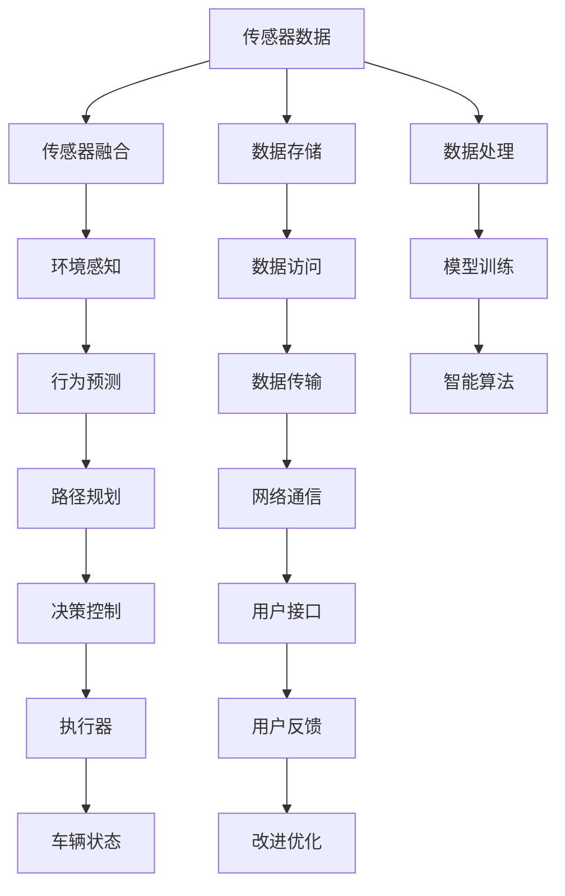

                 

# 端到端自动驾驶的软件架构变革

> 关键词：自动驾驶,软件架构,端到端,汽车工业,未来出行

## 1. 背景介绍

### 1.1 问题由来
随着自动驾驶技术的飞速发展，软件架构的复杂性和多样性也随之增加。传统的汽车工业高度依赖硬件的进步，而如今软件定义的趋势，意味着软件架构的改变将直接影响自动驾驶系统的性能和安全性。

自动驾驶的端到端架构不仅仅是自动驾驶系统的核心架构，它涉及到了感知、决策和控制等各个环节，这些环节的协同工作是确保自动驾驶安全性和可靠性的关键。然而，现有的端到端架构在处理复杂任务、数据融合、多传感器融合等方面存在诸多挑战。

### 1.2 问题核心关键点
本文将重点探讨自动驾驶端到端软件架构的设计和优化，包括：
- 如何选择合适的技术栈和架构模式。
- 如何在复杂的任务环境中，有效融合多传感器数据。
- 如何实现模块化、可扩展的架构，以应对未来的技术演进和业务需求。
- 如何在实时性、安全性、可维护性之间进行权衡。
- 如何处理数据隐私和安全问题。

## 2. 核心概念与联系

### 2.1 核心概念概述

为更好地理解自动驾驶端到端架构，本节将介绍几个关键概念：

- 端到端自动驾驶：从传感器数据到决策控制，所有任务由同一系统完成，避免数据丢失和信息不一致。
- 软件定义汽车(SDA)：通过软件实现汽车的各种功能，使汽车可以根据需要更新和升级，从而适应不断变化的业务需求。
- 传感器融合与数据处理：将来自不同传感器（如摄像头、雷达、激光雷达、IMU等）的数据融合，以获得更准确、更全面的环境信息。
- 多任务处理：自动驾驶任务复杂多样，包括目标检测、路径规划、行为预测、控制命令生成等，如何高效处理这些任务是架构设计的重点。
- 模块化设计：通过模块化的设计，将复杂的系统拆分为独立、可维护的模块，以便于未来的扩展和维护。
- 实时性：自动驾驶需要实时处理大量数据，确保决策的及时性和准确性。
- 安全性：自动驾驶的核心在于确保行车安全，架构设计必须围绕安全性进行。
- 数据隐私和安全：自动驾驶涉及大量个人隐私数据，必须采取措施保护数据安全。

这些概念之间的逻辑关系可以通过以下Mermaid流程图来展示：



这个流程图展示了几大核心概念及其之间的关系：

1. 从传感器数据到车辆状态，中间经过传感器融合、环境感知、行为预测、路径规划、决策控制等环节，最终通过执行器控制车辆。
2. 数据处理、模型训练、数据存储、网络通信、用户接口等环节，支持了端到端自动驾驶系统的完整运行。
3. 智能算法、改进优化、用户反馈等环节，构成了系统的动态改进机制。

## 3. 核心算法原理 & 具体操作步骤
### 3.1 算法原理概述

端到端自动驾驶的架构设计，本质上是一个多层次、多任务的复杂系统。其核心在于如何高效融合多传感器数据，合理设计多任务处理流程，实现实时性、安全性与可扩展性的统一。

端到端架构通常包含以下几个层次：
- 数据预处理层：对传感器数据进行去噪、同步、校正等处理，以保证数据质量。
- 环境感知层：通过多传感器融合，获取车辆周围环境的精确信息。
- 行为预测层：利用深度学习和决策树等算法，预测其他车辆、行人的行为。
- 路径规划层：使用A*、D*、LQR等算法，规划车辆的最佳行驶路径。
- 决策控制层：基于行为预测和路径规划结果，生成控制命令，驱动车辆执行。

### 3.2 算法步骤详解

端到端自动驾驶的架构设计可以按照以下步骤进行：

**Step 1: 需求分析与设计**
- 分析自动驾驶功能需求，包括环境感知、行为预测、路径规划、决策控制等。
- 设计架构的高层框架，包括各个模块的功能和交互方式。

**Step 2: 技术栈选择**
- 根据需求选择适用的技术栈，如传感器融合算法、深度学习框架、实时操作系统等。
- 选择合适的硬件平台，包括计算单元、通信接口、存储设备等。

**Step 3: 模块划分与实现**
- 将自动驾驶系统拆分为独立的、可维护的模块，如感知模块、预测模块、规划模块、控制模块等。
- 对每个模块进行详细设计和实现，确保模块的独立性和可扩展性。

**Step 4: 数据处理与传输**
- 设计数据处理流程，对传感器数据进行去噪、校正和同步，确保数据质量。
- 设计高效的数据传输协议，保证数据在模块间和云端传输的实时性和可靠性。

**Step 5: 测试与验证**
- 进行单元测试、集成测试和系统测试，确保每个模块和整个系统的正确性和稳定性。
- 使用模拟器和实际道路测试，验证系统的性能和安全。

**Step 6: 部署与优化**
- 将系统部署到目标硬件平台，进行性能调优和资源配置。
- 根据测试结果，对系统进行改进优化，提升实时性、准确性和鲁棒性。

### 3.3 算法优缺点

端到端自动驾驶的架构设计具有以下优点：
1. 高效融合多传感器数据：通过多传感器融合，能够获得更全面、更准确的环境信息。
2. 模块化设计：可扩展性强，便于未来功能的升级和维护。
3. 实时性保障：通过合理设计架构，能够确保实时处理大量数据。
4. 安全性提升：各模块独立设计，易于实现数据隔离和故障隔离，提高系统鲁棒性。

同时，该架构也存在一定的局限性：
1. 技术栈复杂：涉及多种技术和算法，需要跨领域的知识。
2. 数据处理量大：传感器数据量大且实时性强，需要强大的计算和存储资源。
3. 实时性要求高：各模块的协同工作要求极高的实时性和精度。
4. 架构设计复杂：需要平衡各个模块的性能和资源配置，优化难度大。

尽管存在这些局限性，但端到端架构仍是大规模自动驾驶系统的首选架构。通过不断优化技术栈选择、模块设计、数据传输和测试验证等环节，可以进一步提升系统的性能和可维护性。

### 3.4 算法应用领域

端到端自动驾驶架构已在多个应用场景中得到验证：

- 高级驾驶辅助系统(ADAS)：在自动泊车、自适应巡航、车道保持等功能中，端到端架构能够高效处理传感器数据，提升驾驶辅助功能。
- 智能物流运输：在智能货车、无人驾驶车队等应用中，端到端架构能够实现实时路径规划和智能驾驶，优化运输效率和安全性。
- 自动驾驶出租车：在无人驾驶出租车、自动驾驶公交等场景中，端到端架构能够保证高精度的感知和决策，提升出行体验和服务质量。
- 智能城市：在智能交通管理、智慧停车场、无人配送车等应用中，端到端架构能够优化城市交通流，提升城市管理水平。

## 4. 数学模型和公式 & 详细讲解 & 举例说明

### 4.1 数学模型构建

本节将使用数学语言对端到端自动驾驶系统的核心算法进行更加严格的刻画。

记传感器数据为 $S$，环境信息为 $E$，行为预测结果为 $B$，路径规划结果为 $P$，决策结果为 $D$，控制命令为 $C$，车辆状态为 $V$。环境感知模型为 $F$，行为预测模型为 $G$，路径规划模型为 $H$，决策控制模型为 $I$。

定义环境感知损失函数为 $\ell_E$，行为预测损失函数为 $\ell_B$，路径规划损失函数为 $\ell_P$，决策控制损失函数为 $\ell_D$，综合损失函数为 $\mathcal{L}$，则端到端自动驾驶的数学模型可以表示为：

$$
\mathcal{L}(S, E, B, P, D, C, V) = \ell_E(F(S)) + \ell_B(G(E)) + \ell_P(H(B)) + \ell_D(I(P, D, V))
$$

其中 $F$、$G$、$H$、$I$ 分别表示环境感知、行为预测、路径规划、决策控制等模型的映射关系。

### 4.2 公式推导过程

以下我们以行为预测为例，推导端到端自动驾驶系统中的行为预测模型。

假设车辆当前位置为 $(x_0, y_0)$，速度为 $v_0$，加速度为 $a_0$。预测下一时刻位置为 $(x_1, y_1)$，速度为 $v_1$，加速度为 $a_1$。

根据运动学方程，有：

$$
x_1 = x_0 + v_0 \Delta t + \frac{1}{2}a_0 (\Delta t)^2
$$

$$
y_1 = y_0 + v_0 \Delta t + \frac{1}{2}a_0 (\Delta t)^2
$$

$$
v_1 = v_0 + a_0 \Delta t
$$

$$
a_1 = a_0
$$

其中 $\Delta t$ 为时间间隔。

将上述公式代入行为预测模型 $G(E)$，得到行为预测的数学模型：

$$
G(E) = (x_1, y_1, v_1, a_1)
$$

### 4.3 案例分析与讲解

以智能货车为例，分析端到端架构在自动驾驶中的应用。

**环境感知模块**：
- 通过摄像头、雷达、激光雷达等传感器获取车辆周围环境的信息。
- 将传感器数据进行校正、去噪和同步处理，确保数据质量。
- 利用多传感器融合算法，如卡尔曼滤波、粒子滤波等，得到精确的环境信息。

**行为预测模块**：
- 使用深度学习模型，如CNN、RNN等，对环境信息进行分类、检测和跟踪。
- 利用行为预测模型 $G(E)$，预测其他车辆、行人的行为，生成行为轨迹。

**路径规划模块**：
- 使用A*、D*等算法，结合车辆参数、环境信息、行为预测结果，生成最优路径。
- 考虑道路条件、交通规则、行人、障碍物等因素，优化路径规划。

**决策控制模块**：
- 根据路径规划结果，生成控制命令，驱动车辆执行。
- 考虑安全距离、车速限制、道路标志等因素，优化控制策略。

在实际应用中，各模块的协同工作能够确保智能货车的安全性和稳定性。通过对端到端架构的不断优化，能够提升智能货车的自动驾驶能力和运输效率。

## 5. 项目实践：代码实例和详细解释说明
### 5.1 开发环境搭建

在进行端到端自动驾驶系统开发前，我们需要准备好开发环境。以下是使用Python进行自动驾驶系统开发的常用环境配置流程：

1. 安装Python：从官网下载并安装Python，选择稳定版或科学版，安装依赖库。
2. 安装虚拟环境：使用virtualenv创建虚拟环境，安装需要的Python库。
3. 安装ROS：在ROS上搭建开发环境，安装ROS1或ROS2，配置ROS节点。
4. 安装开源自动驾驶系统：如Apollo、Pioneer、Carla等开源系统，安装并配置系统。
5. 安装传感器和硬件设备：安装摄像头、激光雷达、IMU等传感器和硬件设备，并进行校准和测试。

完成上述步骤后，即可在虚拟环境中进行自动驾驶系统的开发和测试。

### 5.2 源代码详细实现

下面我们以智能货车为例，给出使用ROS进行自动驾驶系统开发和微调的Python代码实现。

首先，定义ROS节点并订阅传感器数据：

```python
import rospy
from sensor_msgs.msg import Imu, PointCloud2, LaserScan, Image
from geometry_msgs.msg import Point, Pose, Twist, Quaternion
from tf.transformations import euler_from_quaternion, quaternion_from_euler

class AutodriveNode:
    def __init__(self):
        rospy.init_node('autodrive_node', anonymous=True)
        self.sub_imu = rospy.Subscriber('/imu/data', Imu, self.imu_callback)
        self.sub_laser = rospy.Subscriber('/laser_data', LaserScan, self.laser_callback)
        self.sub_camera = rospy.Subscriber('/camera/image_rect', Image, self.camera_callback)
        self.imu_data = None
        self.laser_data = None
        self.camera_data = None
        
    def imu_callback(self, data):
        self.imu_data = data
        
    def laser_callback(self, data):
        self.laser_data = data
        
    def camera_callback(self, data):
        self.camera_data = data
        
    def process(self):
        while not rospy.is_shutdown():
            # 对传感器数据进行处理和融合
            # 调用行为预测、路径规划、决策控制等算法
            # 生成控制命令并驱动车辆执行
            pass
```

然后，定义传感器数据处理和融合函数：

```python
def process_imu_data(imu_data):
    # 对IMU数据进行处理，如加速计校准、去噪、同步等
    return imu_data
    
def process_laser_data(laser_data):
    # 对激光雷达数据进行处理，如点云转换、去噪、校正等
    return laser_data
    
def process_camera_data(camera_data):
    # 对摄像头数据进行处理，如图像裁剪、去噪、校正等
    return camera_data

def fuse_sensors(imu_data, laser_data, camera_data):
    # 将IMU、激光雷达、摄像头数据融合，得到精确的环境信息
    return fused_data
```

接着，定义行为预测和路径规划函数：

```python
def predict_behavior(fused_data):
    # 使用深度学习模型进行行为预测
    return behavior_data
    
def plan_route(behavior_data, camera_data):
    # 使用A*算法进行路径规划
    return route_data
```

最后，定义决策控制函数：

```python
def control_vehicle(route_data, imu_data, camera_data):
    # 根据路径规划结果和传感器数据，生成控制命令
    return control_command
    
def execute_control(command):
    # 调用车辆控制接口，执行控制命令
    pass
```

启动ROS节点，并调用上述函数进行数据处理和融合，生成控制命令：

```python
rospy.spin()
```

以上就是使用ROS进行自动驾驶系统开发的完整代码实现。可以看到，通过合理设计模块和函数，能够高效处理传感器数据，实现行为预测、路径规划和决策控制等功能。

### 5.3 代码解读与分析

让我们再详细解读一下关键代码的实现细节：

**ROS节点**：
- 通过roslib和rospkg库，定义ROS节点，并订阅传感器数据。
- 在回调函数中，存储传感器数据，等待处理和融合。

**传感器数据处理和融合函数**：
- 对IMU、激光雷达、摄像头数据进行处理，如去噪、同步、校正等，确保数据质量。
- 将处理后的数据进行融合，得到精确的环境信息，为后续的预测和规划提供基础。

**行为预测和路径规划函数**：
- 使用深度学习模型对行为数据进行预测，得到行为轨迹。
- 使用A*等算法进行路径规划，生成最优路径。

**决策控制函数**：
- 根据路径规划结果和传感器数据，生成控制命令，驱动车辆执行。
- 考虑安全距离、车速限制、道路标志等因素，优化控制策略。

在实际应用中，各模块的协同工作能够确保智能货车的安全性和稳定性。通过对端到端架构的不断优化，能够提升智能货车的自动驾驶能力和运输效率。

## 6. 实际应用场景
### 6.1 智能物流运输

端到端自动驾驶架构在智能物流运输中的应用前景广阔。通过智能货车、无人驾驶车队等系统，能够实现自动装载、自动驾驶、自动卸载等全自动化流程，极大地提升物流运输效率和安全性。

在智能物流运输中，端到端架构需要处理复杂多变的环境信息，包括交通信号、其他车辆、行人、障碍物等。通过多传感器融合和行为预测，能够实现更精准的感知和预测，保证行车安全。

### 6.2 自动驾驶出租车

端到端自动驾驶架构在自动驾驶出租车中的应用同样重要。通过自动驾驶出租车，能够为乘客提供更加安全和舒适的出行体验，同时减少交通拥堵和环境污染。

在自动驾驶出租车中，端到端架构需要处理更加复杂和多样化的场景，如城市道路、高速公路、停车场等。通过路径规划和行为预测，能够实现更高效的路线选择和避障决策，提升乘客出行体验。

### 6.3 智能城市

端到端自动驾驶架构在智能城市中的应用前景广阔。通过智慧交通管理系统、智慧停车场、无人配送车等系统，能够实现智能交通流管理、智能停车、智能配送等，提升城市管理水平和居民生活质量。

在智能城市中，端到端架构需要处理多种交通模式和场景，如人行道、自行车道、公交车站等。通过路径规划和行为预测，能够实现更高效的交通流管理和交通调度，提升城市管理水平。

## 7. 工具和资源推荐
### 7.1 学习资源推荐

为了帮助开发者系统掌握端到端自动驾驶技术，这里推荐一些优质的学习资源：

1. 《端到端自动驾驶系统设计与实现》书籍：系统介绍了端到端自动驾驶系统的设计原理和实现方法，适合初学者和进阶开发者。

2. ROS官网和ROS开发者社区：ROS官网提供了详细的ROS教程和文档，ROS开发者社区有大量的开源项目和交流讨论。

3. Udacity《自动驾驶纳米学位》课程：Udacity开设的自动驾驶课程，涵盖自动驾驶系统的各个环节，从感知到决策控制，都有详细的讲解。

4. NVIDIA AI Lab《自动驾驶》教程：NVIDIA AI Lab提供了详细的自动驾驶教程和代码示例，涵盖感知、预测、规划、控制等环节。

5. OpenAI《自动驾驶指南》：OpenAI提供的自动驾驶指南，涵盖自动驾驶的各个环节，适合对自动驾驶感兴趣的开发者和研究人员。

通过对这些资源的学习实践，相信你一定能够快速掌握端到端自动驾驶技术的精髓，并用于解决实际的自动驾驶问题。

### 7.2 开发工具推荐

高效的开发离不开优秀的工具支持。以下是几款用于端到端自动驾驶开发的常用工具：

1. ROS：ROS是一个开源的机器人操作系统，提供了强大的数据管理和同步工具，适合自动化驾驶系统的开发和测试。

2. PyTorch和TensorFlow：主流的深度学习框架，支持多种深度学习模型，适合自动驾驶系统中的感知和预测任务。

3. UG和SIMULINK：MATLAB提供的仿真工具，支持自动驾驶系统的仿真和测试。

4. ROS-Bag和ROS-Viz：ROS提供的数据管理和可视化工具，适合记录和回放传感器数据，并进行实时数据可视化。

5. Webots：一个基于MATLAB的高级机器人仿真平台，支持多传感器融合和自动驾驶系统的仿真。

合理利用这些工具，可以显著提升端到端自动驾驶系统的开发效率，加快创新迭代的步伐。

### 7.3 相关论文推荐

端到端自动驾驶技术的发展源于学界的持续研究。以下是几篇奠基性的相关论文，推荐阅读：

1. End-to-End Training for Self-Driving Cars（即Carla论文）：介绍了Carla模拟器和端到端自动驾驶系统的开发过程。

2. End-to-End Training of a Fully Autonomous Driving Policy（即Apollo论文）：介绍了Apollo自动驾驶系统，并详细描述了感知、预测、规划和控制等环节。

3. Learning to Drive with End-to-End Deep Reinforcement Learning（即A3C论文）：介绍了使用深度强化学习进行端到端自动驾驶的训练方法。

4. Adversarial Recovery of Robust Prediction from Imperfect Labels（即Adversarial Recover论文）：介绍了使用对抗训练提高自动驾驶系统的鲁棒性和泛化能力。

5. Improved Multi-Task Learning for Autonomous Driving（即MTL论文）：介绍了使用多任务学习提高自动驾驶系统的泛化能力和性能。

这些论文代表了大规模自动驾驶系统的发展脉络。通过学习这些前沿成果，可以帮助研究者把握学科前进方向，激发更多的创新灵感。

## 8. 总结：未来发展趋势与挑战

### 8.1 总结

本文对端到端自动驾驶的软件架构设计进行了全面系统的介绍。首先阐述了端到端自动驾驶的背景和重要性，明确了端到端架构设计的关键点。其次，从原理到实践，详细讲解了端到端架构的各个环节，给出了系统开发的完整代码实例。同时，本文还广泛探讨了端到端架构在智能物流运输、自动驾驶出租车、智能城市等多个领域的应用前景，展示了端到端架构的广阔前景。此外，本文精选了端到端架构设计的学习资源、开发工具和相关论文，力求为读者提供全方位的技术指引。

通过本文的系统梳理，可以看到，端到端自动驾驶架构是大规模自动驾驶系统的核心架构，能够在复杂的任务环境中高效处理多传感器数据，实现实时性、安全性与可扩展性的统一。未来，伴随技术演进和业务需求的变化，端到端架构仍需不断优化和升级，以应对更加复杂的挑战。

### 8.2 未来发展趋势

展望未来，端到端自动驾驶技术将呈现以下几个发展趋势：

1. 传感器融合技术的进步：新一代传感器如激光雷达、毫米波雷达、红外相机等将带来更高的精度和更广的视野，进一步提升环境感知能力。

2. 多任务学习与深度强化学习的结合：通过多任务学习和深度强化学习的结合，能够提升系统的泛化能力和鲁棒性。

3. 云计算和边缘计算的结合：通过云计算和边缘计算的结合，能够提升系统的实时性和计算效率。

4. 自主学习与智能驾驶的结合：通过自主学习算法，能够提高系统的自我优化能力和适应能力。

5. 数据隐私和安全的保护：随着自动驾驶系统对数据的需求增加，如何保护数据隐私和安全将成为重要研究方向。

以上趋势凸显了端到端自动驾驶技术的广阔前景。这些方向的探索发展，必将进一步提升自动驾驶系统的性能和安全性，推动自动驾驶技术的普及和应用。

### 8.3 面临的挑战

尽管端到端自动驾驶技术已经取得了瞩目成就，但在迈向更加智能化、普适化应用的过程中，它仍面临着诸多挑战：

1. 技术栈复杂：涉及多种技术和算法，需要跨领域的知识，增加了开发和维护难度。

2. 数据处理量大：传感器数据量大且实时性强，需要强大的计算和存储资源。

3. 实时性要求高：各模块的协同工作要求极高的实时性和精度，优化难度大。

4. 架构设计复杂：需要平衡各个模块的性能和资源配置，优化难度大。

尽管存在这些挑战，但通过不断优化技术栈选择、模块设计、数据传输和测试验证等环节，可以进一步提升系统的性能和可维护性。

### 8.4 研究展望

面对端到端自动驾驶面临的种种挑战，未来的研究需要在以下几个方面寻求新的突破：

1. 探索无监督和半监督学习算法：摆脱对大规模标注数据的依赖，利用自监督学习、主动学习等无监督和半监督范式，最大限度利用非结构化数据，实现更加灵活高效的训练。

2. 研究参数高效和计算高效的微调范式：开发更加参数高效的微调方法，在固定大部分预训练参数的同时，只更新极少量的任务相关参数。同时优化微调模型的计算图，减少前向传播和反向传播的资源消耗，实现更加轻量级、实时性的部署。

3. 融合因果和对比学习范式：通过引入因果推断和对比学习思想，增强端到端自动驾驶模型建立稳定因果关系的能力，学习更加普适、鲁棒的语言表征，从而提升模型泛化性和抗干扰能力。

4. 引入更多先验知识：将符号化的先验知识，如知识图谱、逻辑规则等，与神经网络模型进行巧妙融合，引导端到端自动驾驶模型学习更准确、合理的语言模型。同时加强不同模态数据的整合，实现视觉、语音等多模态信息与文本信息的协同建模。

5. 结合因果分析和博弈论工具：将因果分析方法引入端到端自动驾驶模型，识别出模型决策的关键特征，增强输出解释的因果性和逻辑性。借助博弈论工具刻画人机交互过程，主动探索并规避模型的脆弱点，提高系统稳定性。

这些研究方向的探索，必将引领端到端自动驾驶技术迈向更高的台阶，为构建安全、可靠、可解释、可控的智能系统铺平道路。面向未来，端到端自动驾驶技术还需要与其他人工智能技术进行更深入的融合，如知识表示、因果推理、强化学习等，多路径协同发力，共同推动自动驾驶技术的进步。只有勇于创新、敢于突破，才能不断拓展端到端自动驾驶的边界，让自动驾驶技术更好地造福人类社会。

## 9. 附录：常见问题与解答

**Q1：端到端自动驾驶架构的优点和缺点有哪些？**

A: 端到端自动驾驶架构的优点包括：
1. 高效融合多传感器数据：通过多传感器融合，能够获得更全面、更准确的环境信息。
2. 模块化设计：可扩展性强，便于未来功能的升级和维护。
3. 实时性保障：通过合理设计架构，能够确保实时处理大量数据。
4. 安全性提升：各模块独立设计，易于实现数据隔离和故障隔离，提高系统鲁棒性。

缺点包括：
1. 技术栈复杂：涉及多种技术和算法，需要跨领域的知识。
2. 数据处理量大：传感器数据量大且实时性强，需要强大的计算和存储资源。
3. 实时性要求高：各模块的协同工作要求极高的实时性和精度。
4. 架构设计复杂：需要平衡各个模块的性能和资源配置，优化难度大。

**Q2：端到端自动驾驶架构在实际应用中需要注意哪些问题？**

A: 端到端自动驾驶架构在实际应用中需要注意以下问题：
1. 数据处理：对传感器数据进行去噪、同步、校正等处理，确保数据质量。
2. 传感器融合：多传感器数据融合，确保环境信息的准确性和完整性。
3. 行为预测：使用深度学习模型进行行为预测，确保预测结果的准确性和鲁棒性。
4. 路径规划：使用A*等算法进行路径规划，确保路径的合理性和安全性。
5. 决策控制：根据路径规划结果和传感器数据，生成控制命令，确保控制策略的准确性和鲁棒性。
6. 测试验证：进行单元测试、集成测试和系统测试，确保系统的正确性和稳定性。

**Q3：端到端自动驾驶架构的部署和优化有哪些要点？**

A: 端到端自动驾驶架构的部署和优化要点包括：
1. 部署到目标硬件平台：根据硬件平台的特点，进行系统部署和优化。
2. 优化计算资源：采用梯度积累、混合精度训练、模型并行等方法，优化计算资源配置。
3. 优化数据存储：采用模型压缩、稀疏化存储等方法，优化数据存储和传输。
4. 优化实时性：优化系统架构，提升实时性。
5. 优化安全性：设计数据隔离和故障隔离机制，提高系统鲁棒性。
6. 优化可维护性：设计模块化的架构，便于未来功能的升级和维护。

通过不断优化技术栈选择、模块设计、数据传输和测试验证等环节，可以进一步提升系统的性能和可维护性。

---

作者：禅与计算机程序设计艺术 / Zen and the Art of Computer Programming

