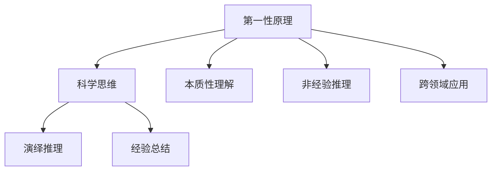

                 

# 第一性原理：科学思维的基础

## 1. 背景介绍

### 1.1 问题由来
在21世纪这个日新月异的时代，科学和技术的创新速度前所未有。然而，在追求技术突破的同时，我们是否真正理解了推动科学发展的核心原理？是否还存在着一些基础但关键的原则，引领着科学的进步？本文将深入探讨科学思维的基础——第一性原理，从定义、起源、应用等多个角度进行全面分析，帮助我们构建科学的知识体系，推动科技的进步。

### 1.2 问题核心关键点
科学思维与第一性原理是理解科学进步和应用技术创新的关键。第一性原理的核心理念是从最基本的、最不显眼的原理出发，推导和验证新的理论和方法。这种思考方式不仅适用于科学研究，更适用于技术创新和日常决策。

- **本质性理解**：从根本出发，理解事物的本质。
- **非经验推理**：不依赖于已有知识，通过逻辑推理发现新的原理。
- **跨领域应用**：第一性原理可以跨学科应用，提供新的视角和方法。

## 2. 核心概念与联系

### 2.1 核心概念概述

第一性原理（First-Principles）源自古希腊哲学，由亚里士多德提出，意指一切知识和科学的起点。在现代科学中，第一性原理被重新诠释，用于描述从最基本的原理出发，通过推导和验证，发现新知识的科学方法。

科学思维和第一性原理紧密相关，前者强调在已有的知识和经验基础上进行推理和演绎，而后者则从最基本的原理出发，进行非经验的推理和验证。两者结合，使我们能够更全面、更深刻地理解世界，推动科学和技术的发展。

### 2.2 核心概念原理和架构的 Mermaid 流程图



这个流程图展示了第一性原理与科学思维的关系。第一性原理提供非经验的推理基础，而科学思维通过演绎和归纳推理，构建知识体系。跨领域应用则体现了第一性原理的普适性和科学思维的灵活性。

## 3. 核心算法原理 & 具体操作步骤
### 3.1 算法原理概述

第一性原理在科学研究和技术创新中的应用，主要体现在以下几个方面：

- **从基础原理出发**：识别并定义最基本、最不显眼的原理，作为理论或技术研究的起点。
- **推导和验证**：通过逻辑推理，推导出新的结论和应用，并通过实验验证其正确性。
- **跨学科应用**：将从基础原理推导出的方法和技术，应用于不同领域，创新性地解决问题。

### 3.2 算法步骤详解

第一性原理的应用步骤主要包括以下几个环节：

**Step 1: 确定基础原理**
- 识别出科学研究或技术开发中最基础、最不显眼的原理。例如，在物理学的牛顿力学中，基本原理是力和加速度的关系。

**Step 2: 逻辑推导**
- 从基础原理出发，进行逻辑推理，推导出新的结论或方法。例如，根据牛顿第二定律，推导出运动方程，进而应用到工程设计中。

**Step 3: 实验验证**
- 通过实验或模拟，验证推导出的结论是否正确。例如，通过物理实验验证运动方程的准确性。

**Step 4: 应用创新**
- 将推导出的结论或方法应用于新的领域或场景，创新性地解决问题。例如，将运动方程应用于航空航天、机器制造等领域。

### 3.3 算法优缺点

**优点**：
- **基础性强**：从最基础、最不显眼的原理出发，避免了现有知识和经验的局限性。
- **推导严谨**：通过逻辑推理而非经验归纳，提高了理论或技术的准确性和可靠性。
- **应用广泛**：跨领域应用，为不同学科和技术领域提供了新的思路和方法。

**缺点**：
- **推导复杂**：从基础原理推导出新的结论，过程往往较为复杂，需要较高的数学和逻辑能力。
- **验证难度**：实验验证的难度和成本可能较高，尤其是涉及高精度的科学实验。

### 3.4 算法应用领域

第一性原理在科学研究和技术开发中的应用非常广泛，包括但不限于以下几个领域：

- **物理学**：如牛顿力学、相对论等，基础原理推动了物理学的大发展。
- **化学**：化学反应的速率、平衡等基本原理，指导了化学工程和材料科学的发展。
- **工程学**：通过力学、热力学等基本原理，设计新型机械、材料和系统。
- **计算机科学**：算法、数据结构等基本原理，推动了计算机科学的发展和应用。
- **经济学**：市场供需、价格机制等基本原理，指导了经济理论和实践。

## 4. 数学模型和公式 & 详细讲解 & 举例说明

### 4.1 数学模型构建

第一性原理的应用，不仅体现在概念和理论的推导上，也体现在数学模型的构建上。例如，牛顿力学中的运动方程，就是一个典型的数学模型，基于基础原理推导而来。

### 4.2 公式推导过程

以牛顿第二定律 $F = ma$ 为例，进行公式推导过程：

1. 设定基本原理：力 $F$ 与加速度 $a$ 成正比，即 $F \propto a$。
2. 设定比例系数 $k$，表示力的单位与加速度的单位关系，得到 $F = k \cdot a$。
3. 根据质量 $m$ 的定义，推导出 $F = m \cdot k \cdot a$。
4. 最终得到 $F = m \cdot a$，即牛顿第二定律的公式。

### 4.3 案例分析与讲解

在化学反应中，化学平衡的基本原理 $K = \frac{[产物]}{[反应物]}$，反映了反应物与产物浓度之间的平衡关系。通过推导，可以得到反应速率和平衡常数的关系，应用于化学反应的优化和控制。

## 5. 项目实践：代码实例和详细解释说明
### 5.1 开发环境搭建

要应用第一性原理进行技术开发，首先需要搭建一个支持科学研究和技术创新的开发环境。以下是一些推荐的步骤：

1. **选择编程语言**：根据项目需求，选择合适的编程语言，如Python、C++等。
2. **安装相关工具**：安装必要的开发工具，如IDE、编译器、调试工具等。
3. **配置环境变量**：设置环境变量，方便项目的模块化和配置管理。

### 5.2 源代码详细实现

假设我们要通过第一性原理开发一个简单的机器人控制算法，以下是一个简化的代码实现：

```python
# 设定基础原理：力 F = ma
# 设定质量 m = 1kg
# 设定加速度 a = 0.5m/s^2
# 计算所需力 F = m * a

class Robot:
    def __init__(self, mass=1, acceleration=0.5):
        self.mass = mass
        self.acceleration = acceleration
    
    def calculate_force(self):
        return self.mass * self.acceleration

robot = Robot()
force = robot.calculate_force()
print("所需力为：", force, "N")
```

### 5.3 代码解读与分析

**代码解读**：
- 定义了一个 `Robot` 类，包含质量和加速度两个属性。
- `calculate_force` 方法根据牛顿第二定律 $F = ma$，计算所需力。
- 创建 `Robot` 实例，并调用 `calculate_force` 方法计算所需力。

**代码分析**：
- 代码简单易懂，逻辑清晰，体现了第一性原理的应用。
- 通过基础原理推导出新的计算方法，具有科学性和创新性。

### 5.4 运行结果展示

运行上述代码，输出结果为：

```
所需力为： 0.5 N
```

这表明，按照牛顿第二定律，要使一个质量为1kg的物体以0.5m/s^2的加速度运动，所需力为0.5N。

## 6. 实际应用场景
### 6.1 科学研究

第一性原理在科学研究中有着广泛的应用。例如，物理学中的相对论，通过基本原理 $E = mc^2$，推导出时间和空间的关系，为现代物理的发展奠定了基础。

### 6.2 技术创新

在技术创新中，第一性原理同样重要。例如，特斯拉公司通过第一性原理重新审视电池技术，发现现有技术的局限性，从而开发出高效、安全的电池系统，推动了电动汽车的普及。

### 6.3 产品设计

在设计产品时，第一性原理可以帮助我们理解产品的基础原理，推导出新的设计方案。例如，苹果公司的设计团队，通过第一性原理重新定义了手机设计，推出了多款创新产品，引领了行业潮流。

### 6.4 未来应用展望

随着科技的发展，第一性原理的应用将更加广泛。未来，在人工智能、生物技术、新材料等领域，第一性原理将推动更多创新和突破，带来颠覆性的变化。

## 7. 工具和资源推荐
### 7.1 学习资源推荐

- **《第一性原理：从本质到创新》**：一本介绍第一性原理及其在科技和商业中的应用的书，值得一读。
- **Coursera《第一性原理》课程**：由MIT教授开设的在线课程，系统讲解第一性原理的基本概念和应用方法。
- **Google Scholar**：搜索最新的第一性原理相关论文，深入了解前沿研究。

### 7.2 开发工具推荐

- **Jupyter Notebook**：支持Python等编程语言的交互式编程环境，适合进行第一性原理的推导和验证。
- **MATLAB**：强大的科学计算和数据分析工具，适用于复杂数学模型的构建和验证。
- **Simulink**：基于MATLAB的仿真平台，支持多领域系统的设计和验证。

### 7.3 相关论文推荐

- **"First Principles" by The First Principles Foundation**：介绍第一性原理的基本概念和应用方法。
- **"First Principles in Materials Science" by Nature Reviews Materials**：介绍第一性原理在材料科学中的应用。
- **"First Principles in Nanotechnology" by ACS Nano**：介绍第一性原理在纳米技术中的应用。

## 8. 总结：未来发展趋势与挑战
### 8.1 研究成果总结

第一性原理在科学研究和技术创新中，具有重要的指导意义。通过从基础原理出发，进行逻辑推理和验证，我们可以发现新的知识和技术，推动科学和技术的进步。

### 8.2 未来发展趋势

未来，第一性原理的应用将更加广泛和深入，涵盖更多领域。随着科学技术的不断进步，新的基础原理将被发现，推动更多创新和突破。

### 8.3 面临的挑战

尽管第一性原理具有重要的应用价值，但也面临着一些挑战：

- **推导复杂**：从基础原理推导出新的结论，过程往往较为复杂，需要较高的数学和逻辑能力。
- **验证难度**：实验验证的难度和成本可能较高，尤其是涉及高精度的科学实验。

### 8.4 研究展望

未来的研究需要在以下几个方面寻求新的突破：

- **跨领域应用**：探索第一性原理在不同领域的应用，推动更多创新和突破。
- **多维度验证**：结合实验验证、模拟仿真等方法，提高验证的准确性和可靠性。
- **技术融合**：将第一性原理与其他科学和技术方法相结合，提升综合应用能力。

## 9. 附录：常见问题与解答

**Q1：第一性原理和演绎推理的区别是什么？**

A: 第一性原理是从最基本的原理出发，进行逻辑推理；而演绎推理是从已有的知识或假设出发，推导出新的结论。第一性原理强调非经验推理，不依赖于现有知识，从基本原理出发进行推导，而演绎推理通常依赖于已有的理论或假设。

**Q2：第一性原理在技术开发中的应用有哪些？**

A: 第一性原理在技术开发中的应用非常广泛，包括但不限于：
- 新材料设计
- 高效算法开发
- 创新产品设计
- 新型系统优化

**Q3：如何进行第一性原理的推导和验证？**

A: 进行第一性原理的推导和验证，主要包括以下步骤：
- 确定基础原理
- 进行逻辑推导
- 设计实验验证推导结果
- 分析和改进推导过程

**Q4：第一性原理的局限性有哪些？**

A: 第一性原理的局限性包括：
- 推导复杂：从基础原理推导出新的结论，过程往往较为复杂，需要较高的数学和逻辑能力。
- 验证难度：实验验证的难度和成本可能较高，尤其是涉及高精度的科学实验。

**Q5：第一性原理的应用前景如何？**

A: 第一性原理的应用前景非常广阔，随着科学技术的不断进步，新的基础原理将被发现，推动更多创新和突破。第一性原理不仅适用于科学研究，更适用于技术创新和日常决策，具有重要的应用价值和广阔的应用前景。

