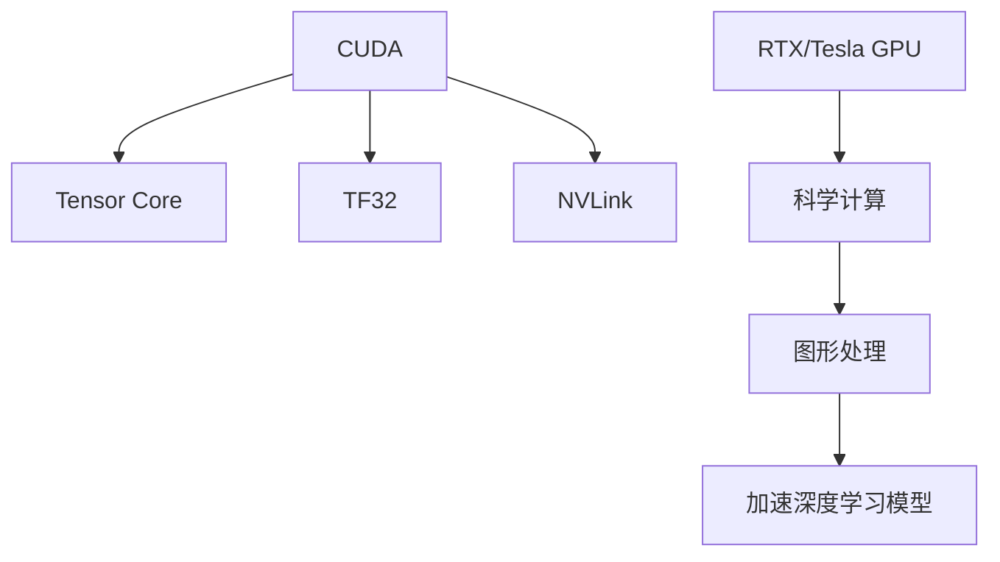

                 

# 算力革命与NVIDIA的角色

## 1. 背景介绍

### 1.1 问题由来

随着人工智能技术的飞速发展，算力已成为推动AI应用落地的关键因素。在AI模型的训练和推理过程中，算力需求呈现指数级增长。尽管目前硬件和软件技术已经取得了重大进展，但依然无法满足大规模深度学习模型的需求。如何构建高效、灵活、可持续的算力基础设施，成为当前AI社区面临的重大挑战。

在这样的大背景下，NVIDIA作为全球领先的图形处理器(GPU)和计算卡制造商，凭借其强大的技术实力和创新精神，在推动算力革命中发挥了核心作用。NVIDIA的CUDA技术、GPU架构以及AI计算平台，为AI应用的开发和部署提供了强大的动力，成为全球AI社区的重要基础设施。

### 1.2 问题核心关键点

为了应对算力需求的快速增长，NVIDIA持续推动GPU和计算卡技术的升级，引领了算力革命的发展。其关键技术包括：

- CUDA：NVIDIA开发的并行编程模型，为GPU提供高效编程接口。
- Tensor Core：NVIDIA GPU中的专用计算单元，用于加速深度学习模型的计算。
- 自适应计算技术：如TF32、BF16等，优化数据类型和精度，提高能效比。
- NVLink：NVIDIA设计的互连技术，大幅提高GPU与GPU、GPU与CPU之间的数据传输速度。
- RTX、Tesla系列GPU：适用于不同的计算需求，从图形处理到科学计算均有覆盖。

这些技术的综合运用，使得NVIDIA在算力革命中占据了核心地位，为AI应用提供了高效、灵活、可扩展的计算平台。

## 2. 核心概念与联系

### 2.1 核心概念概述

要深入理解NVIDIA在算力革命中的角色，首先需要了解一些关键概念：

- **CUDA**：NVIDIA开发的并行计算框架，为GPU提供高效编程接口。
- **Tensor Core**：GPU中的专用计算单元，用于加速深度学习模型的训练和推理。
- **TF32**：一种数据类型，将浮点数分解为32位和1位两部分，大幅提高计算效率和内存带宽。
- **NVLink**：NVIDIA设计的互连技术，大幅提升GPU间的通信速度。
- **RTX/Tesla系列GPU**：适用于不同计算需求，从图形处理到科学计算均有覆盖。

这些概念之间的逻辑关系可以通过以下Mermaid流程图来展示：



这个流程图展示了大语言模型微调的核心概念及其之间的关系：

1. CUDA提供高效的并行编程能力，支持Tensor Core的加速计算。
2. TF32和NVLink进一步优化计算效率和通信带宽。
3. RTX/Tesla GPU实现科学计算和图形处理的统一。

这些技术共同构成了NVIDIA在算力革命中的核心竞争力，使其能够为AI社区提供高性能、灵活可扩展的计算平台。

## 3. 核心算法原理 & 具体操作步骤
### 3.1 算法原理概述

NVIDIA在算力革命中的核心技术是基于GPU的深度学习计算平台，其中CUDA和Tensor Core是其最关键的两个组件。其工作原理如下：

- **CUDA编程模型**：CUDA为GPU提供高效的并行计算框架，支持大规模深度学习模型的训练和推理。
- **Tensor Core计算单元**：Tensor Core是NVIDIA GPU中的专用计算单元，专门用于加速深度学习模型的矩阵运算，如卷积、矩阵乘法等。

通过CUDA编程模型和Tensor Core计算单元的协同工作，NVIDIA GPU能够高效地处理大规模深度学习模型的训练和推理任务，显著提升算力。

### 3.2 算法步骤详解

NVIDIA GPU在深度学习计算中的操作步骤如下：

1. **数据预处理**：将输入数据转化为GPU可处理的数据格式，包括数据格式转换、数据分片等。
2. **模型定义**：使用CUDA编写深度学习模型的定义代码，包括模型架构、损失函数、优化器等。
3. **模型训练**：使用CUDA启动模型的训练过程，将数据流式输入Tensor Core进行计算，通过反向传播更新模型参数。
4. **模型推理**：将训练好的模型加载到GPU上，使用CUDA进行推理计算，输出预测结果。

### 3.3 算法优缺点

NVIDIA的GPU技术在算力革命中具有以下优点：

- **高效计算**：Tensor Core和CUDA技术大幅提高了深度学习模型的计算效率。
- **灵活扩展**：NVIDIA GPU支持多卡并行计算，可以灵活扩展算力规模。
- **广泛应用**：适用于各种AI应用场景，从图像识别到自然语言处理均有覆盖。

同时，这些技术也存在一些缺点：

- **能耗较高**：GPU计算密集型，能耗较大，对冷却系统要求较高。
- **成本较高**：高端GPU价格昂贵，初期投资成本较高。
- **编程复杂**：需要具备一定的CUDA编程能力，对开发者要求较高。

### 3.4 算法应用领域

NVIDIA的GPU技术在多个领域得到了广泛应用，包括但不限于：

- **计算机视觉**：图像识别、物体检测、人脸识别等。
- **自然语言处理**：语言模型训练、机器翻译、情感分析等。
- **语音识别**：语音转文字、语音合成等。
- **医学影像**：医学图像分析、肿瘤检测、病理分析等。
- **自动驾驶**：环境感知、路径规划、决策辅助等。
- **科学研究**：高精度模拟、分子动力学、天文学计算等。

NVIDIA GPU技术的广泛应用，极大地推动了AI技术的落地和产业化进程。

## 4. 数学模型和公式 & 详细讲解 & 举例说明

### 4.1 数学模型构建

NVIDIA GPU在深度学习计算中的核心数学模型是神经网络，其基本架构包括输入层、隐藏层和输出层。以一个简单的全连接神经网络为例，其数学模型可以表示为：

$$
f(x) = W_2 \cdot f_1(x) + b_2
$$

其中 $W_2$ 和 $b_2$ 为输出层的权重和偏置，$f_1(x)$ 为隐藏层的输出，其表达式为：

$$
f_1(x) = W_1 \cdot x + b_1
$$

### 4.2 公式推导过程

以全连接神经网络为例，推导深度学习模型在GPU上的计算过程。假设输入向量 $x$ 的大小为 $m$，隐藏层神经元数为 $n$，则隐藏层的计算过程可以表示为：

$$
y = W \cdot x + b
$$

其中 $W$ 为权重矩阵，$b$ 为偏置向量。假设隐藏层输出 $y$ 的大小为 $n$，则将 $y$ 输入到输出层，可以得到最终的输出 $z$：

$$
z = W' \cdot y + b'
$$

其中 $W'$ 和 $b'$ 分别为输出层的权重矩阵和偏置向量。

### 4.3 案例分析与讲解

以一个简单的图像分类任务为例，假设输入图片的大小为 $64 \times 64$，隐藏层神经元数为 $128$，输出层神经元数为 $10$，分别代表10个不同类别的标签。假设使用ReLU激活函数，则整个神经网络的计算过程可以表示为：

$$
y = W \cdot x + b
$$

$$
z = W' \cdot y + b'
$$

其中 $W$ 和 $W'$ 均为全连接权重矩阵，$b$ 和 $b'$ 分别为偏置向量。使用GPU进行计算时，可以采用如下步骤：

1. **数据预处理**：将输入图片转化为GPU可处理的数据格式。
2. **模型定义**：使用CUDA编写神经网络的定义代码。
3. **模型训练**：使用CUDA启动模型训练过程，将数据流式输入Tensor Core进行计算。
4. **模型推理**：将训练好的模型加载到GPU上，使用CUDA进行推理计算，输出预测结果。

## 5. 项目实践：代码实例和详细解释说明
### 5.1 开发环境搭建

在进行GPU计算的项目实践中，首先需要搭建开发环境。以下是使用PyTorch进行GPU计算的开发环境配置流程：

1. 安装Anaconda：从官网下载并安装Anaconda，用于创建独立的Python环境。
2. 创建并激活虚拟环境：
```bash
conda create -n pytorch-env python=3.8 
conda activate pytorch-env
```

3. 安装PyTorch：根据CUDA版本，从官网获取对应的安装命令。例如：
```bash
conda install pytorch torchvision torchaudio cudatoolkit=11.1 -c pytorch -c conda-forge
```

4. 安装TensorFlow：下载并安装TensorFlow。

5. 安装CUDA和cuDNN：下载并安装CUDA和cuDNN。

6. 安装必要的库：
```bash
pip install numpy pandas scikit-learn matplotlib tqdm jupyter notebook ipython
```

完成上述步骤后，即可在`pytorch-env`环境中开始GPU计算的实践。

### 5.2 源代码详细实现

这里我们以图像分类任务为例，给出使用PyTorch和CUDA进行GPU计算的PyTorch代码实现。

首先，定义神经网络模型：

```python
import torch
import torch.nn as nn
import torch.nn.functional as F

class Net(nn.Module):
    def __init__(self):
        super(Net, self).__init__()
        self.conv1 = nn.Conv2d(3, 64, kernel_size=3, stride=1, padding=1)
        self.conv2 = nn.Conv2d(64, 128, kernel_size=3, stride=1, padding=1)
        self.fc1 = nn.Linear(128*8*8, 1024)
        self.fc2 = nn.Linear(1024, 10)
    
    def forward(self, x):
        x = F.relu(self.conv1(x))
        x = F.max_pool2d(x, 2, 2)
        x = F.relu(self.conv2(x))
        x = F.max_pool2d(x, 2, 2)
        x = x.view(-1, 128*8*8)
        x = F.relu(self.fc1(x))
        x = self.fc2(x)
        return F.log_softmax(x, dim=1)
```

然后，定义训练和推理函数：

```python
import torch.optim as optim

def train(model, train_loader, optimizer):
    model.train()
    for data, target in train_loader:
        data = data.to(device)
        target = target.to(device)
        optimizer.zero_grad()
        output = model(data)
        loss = F.nll_loss(output, target)
        loss.backward()
        optimizer.step()

def evaluate(model, test_loader):
    model.eval()
    correct = 0
    total = 0
    with torch.no_grad():
        for data, target in test_loader:
            data = data.to(device)
            target = target.to(device)
            output = model(data)
            _, predicted = torch.max(output.data, 1)
            total += target.size(0)
            correct += (predicted == target).sum().item()
    return correct / total
```

最后，启动训练流程并在测试集上评估：

```python
import torchvision.datasets as datasets
import torchvision.transforms as transforms

# 定义数据集和数据变换
train_dataset = datasets.CIFAR10(root='./data', train=True, download=True, transform=transforms.ToTensor())
test_dataset = datasets.CIFAR10(root='./data', train=False, download=True, transform=transforms.ToTensor())

# 定义数据加载器
train_loader = torch.utils.data.DataLoader(train_dataset, batch_size=64, shuffle=True)
test_loader = torch.utils.data.DataLoader(test_dataset, batch_size=64, shuffle=False)

# 定义模型和优化器
model = Net().to(device)
optimizer = optim.SGD(model.parameters(), lr=0.01, momentum=0.9)

# 训练模型
epochs = 10
for epoch in range(epochs):
    train(model, train_loader, optimizer)
    accuracy = evaluate(model, test_loader)
    print(f'Epoch {epoch+1}, Accuracy: {accuracy:.2f}')
```

以上就是使用PyTorch和CUDA进行GPU计算的完整代码实现。可以看到，得益于CUDA技术，PyTorch的深度学习模型在GPU上实现了高效的并行计算，大大提升了模型的训练和推理速度。

### 5.3 代码解读与分析

让我们再详细解读一下关键代码的实现细节：

**Net类**：
- `__init__`方法：初始化网络结构，包括卷积层、全连接层等。
- `forward`方法：定义前向传播过程，包括卷积、池化、激活函数、全连接等操作。

**train函数**：
- 将输入数据和目标标签转换为GPU张量。
- 在模型上进行前向传播，计算输出和损失函数。
- 反向传播更新模型参数。

**evaluate函数**：
- 对模型进行评估，计算分类准确率。
- 在测试集上进行推理计算，输出预测结果。

**训练流程**：
- 定义总的epoch数和批大小，开始循环迭代
- 每个epoch内，先进行训练，输出损失值
- 在测试集上评估模型，输出准确率

可以看到，PyTorch配合CUDA技术使得深度学习模型的GPU计算变得简洁高效。开发者可以将更多精力放在模型架构、超参数调优等高层逻辑上，而不必过多关注底层的实现细节。

当然，工业级的系统实现还需考虑更多因素，如模型的保存和部署、超参数的自动搜索、更灵活的模型适配层等。但核心的GPU计算范式基本与此类似。

## 6. 实际应用场景
### 6.1 智能交通系统

智能交通系统是NVIDIA GPU技术的重要应用领域之一。通过实时处理交通传感器数据，智能交通系统可以实时监测交通流量、事故和违法行为，提升交通管理效率，减少拥堵和事故发生率。

在技术实现上，NVIDIA GPU可以高效地处理大规模传感器数据，快速生成实时地图，并提供高精度的轨迹预测和路径规划算法。例如，基于深度学习的自动驾驶技术，可以在复杂交通环境中做出实时决策，实现自主驾驶。

### 6.2 科学研究

NVIDIA GPU在科学研究中也有广泛应用。在气候变化、生物医药、天体物理等领域，科学家们需要处理大量高维数据，进行复杂的计算和模拟。NVIDIA GPU的高效计算能力，可以显著提升科学研究的效率和精度。

例如，在气候变化研究中，科学家们可以使用GPU进行大规模气候模型的模拟，分析全球变暖对生态系统的影响。在生物医药领域，NVIDIA GPU可以加速蛋白质结构预测和药物分子设计，推动新药研发。

### 6.3 数据中心

数据中心是NVIDIA GPU技术的另一个重要应用领域。随着数据量的爆炸性增长，数据中心的存储和计算需求也在不断增加。NVIDIA GPU的高效并行计算能力，可以大幅提升数据中心的计算性能，满足大规模数据处理的需求。

例如，在机器学习任务中，NVIDIA GPU可以并行处理大规模数据集，加速模型的训练和推理过程。在数据中心的网络优化和性能监控中，NVIDIA GPU也可以实时处理大量数据，提供高效的网络分析和管理服务。

### 6.4 未来应用展望

随着NVIDIA GPU技术的不断进步，其在算力革命中的角色将更加重要。未来，NVIDIA GPU技术将在更多领域得到应用，为AI应用提供更加高效、灵活、可扩展的计算平台。

在自动驾驶、智慧城市、医疗健康、科学研究等领域，NVIDIA GPU将提供强大的计算能力，推动相关技术的快速落地和产业化进程。同时，NVIDIA GPU也将更加普及，成为AI社区不可或缺的基础设施。

## 7. 工具和资源推荐
### 7.1 学习资源推荐

为了帮助开发者系统掌握NVIDIA GPU计算技术，这里推荐一些优质的学习资源：

1. **NVIDIA CUDA官方网站**：提供全面的CUDA开发文档和教程，帮助开发者快速上手GPU编程。
2. **NVIDIA TensorRT官方网站**：提供TensorRT的开发文档和教程，帮助开发者使用NVIDIA GPU进行高性能推理计算。
3. **NVIDIA DeepLearning.ai**：提供深度学习相关课程，包括GPU计算、神经网络等内容，帮助开发者掌握深度学习技术。
4. **NVIDIA GDC大会视频**：观看NVIDIA GDC大会视频，了解最新的GPU技术进展和应用案例。
5. **NVIDIA开发者社区**：加入NVIDIA开发者社区，获取最新的技术资讯、代码示例和开发经验分享。

通过对这些资源的学习实践，相信你一定能够快速掌握NVIDIA GPU计算技术的精髓，并用于解决实际的AI应用问题。

### 7.2 开发工具推荐

NVIDIA GPU技术的开发离不开优秀的工具支持。以下是几款用于GPU计算开发的常用工具：

1. **PyTorch**：基于Python的开源深度学习框架，灵活动态的计算图，适合快速迭代研究。支持CUDA和TensorRT。
2. **TensorFlow**：由Google主导开发的开源深度学习框架，生产部署方便，适合大规模工程应用。支持CUDA和TensorRT。
3. **NVIDIA Visual Profiler**：用于监控和优化NVIDIA GPU计算性能的工具，提供详细的性能分析报告。
4. **NVIDIA DeepGreen**：用于GPU图形优化和性能调优的工具，可以帮助开发者优化GPU计算效率。
5. **NVIDIA cuBLAS**：NVIDIA的GPU线性代数库，提供高效的矩阵运算性能。
6. **NVIDIA cuDNN**：NVIDIA的GPU深度学习库，提供高效的卷积和池化运算性能。

合理利用这些工具，可以显著提升NVIDIA GPU计算任务的开发效率，加快创新迭代的步伐。

### 7.3 相关论文推荐

NVIDIA GPU技术的发展源于学界的持续研究。以下是几篇奠基性的相关论文，推荐阅读：

1. **CUDA: A Parallel Computing Platform and Language**：介绍CUDA编程模型，展示其并行计算能力。
2. **Tensor Core Architecture**：介绍Tensor Core计算单元，展示其加速深度学习模型的能力。
3. **The TensorFlow Ecosystem: From Deep Learning to AI and Beyond**：介绍TensorFlow生态系统，展示其深度学习计算能力。
4. **The NVIDIA Learning System**：介绍NVIDIA Learning System，展示其从深度学习到AI的整体解决方案。
5. **NVIDIA DeepLearning SDK**：介绍NVIDIA DeepLearning SDK，展示其深度学习计算能力和优化技术。

这些论文代表了大语言模型微调技术的发展脉络。通过学习这些前沿成果，可以帮助研究者把握学科前进方向，激发更多的创新灵感。

## 8. 总结：未来发展趋势与挑战

### 8.1 总结

本文对NVIDIA在算力革命中的角色进行了全面系统的介绍。首先阐述了NVIDIA GPU技术在深度学习计算中的核心地位，明确了CUDA和Tensor Core等关键技术对算力革命的推动作用。其次，从原理到实践，详细讲解了NVIDIA GPU在深度学习计算中的工作原理和具体操作步骤，给出了GPU计算任务开发的完整代码实例。同时，本文还广泛探讨了NVIDIA GPU技术在智能交通、科学研究、数据中心等领域的实际应用前景，展示了NVIDIA GPU技术的广泛应用价值。

通过本文的系统梳理，可以看到，NVIDIA GPU技术在算力革命中占据了核心地位，为AI社区提供了高效、灵活、可扩展的计算平台。NVIDIA GPU技术的不断进步，将推动算力革命的进一步发展，为AI应用提供更加强大、可持续的计算支持。

### 8.2 未来发展趋势

展望未来，NVIDIA GPU技术将在算力革命中继续发挥重要作用，推动AI应用的广泛落地。以下是NVIDIA GPU技术可能的发展趋势：

1. **CUDA和Tensor Core升级**：NVIDIA将继续提升CUDA和Tensor Core的技术水平，提高深度学习模型的计算效率和能效比。
2. **AI计算平台升级**：NVIDIA将推出更加灵活、可扩展的AI计算平台，支持更多AI应用场景。
3. **多模态计算**：NVIDIA GPU将支持多模态计算，处理图像、音频、视频等多种数据类型，推动跨模态计算的发展。
4. **边缘计算**：NVIDIA GPU将支持边缘计算，推动AI技术在物联网、智能设备等领域的应用。
5. **自适应计算技术**：NVIDIA将推出更多的自适应计算技术，优化不同深度学习模型的计算效率。

这些趋势凸显了NVIDIA GPU技术在算力革命中的核心地位，将继续推动AI应用的广泛落地和产业化进程。

### 8.3 面临的挑战

尽管NVIDIA GPU技术在算力革命中占据了核心地位，但在其发展过程中，也面临着一些挑战：

1. **能耗问题**：NVIDIA GPU计算密集型，能耗较大，对冷却系统要求较高。
2. **成本问题**：高端GPU价格昂贵，初期投资成本较高。
3. **编程复杂性**：需要具备一定的CUDA编程能力，对开发者要求较高。
4. **兼容性问题**：不同GPU架构之间的兼容性问题，增加了开发和维护难度。
5. **软件生态问题**：NVIDIA GPU技术的软件生态还需要进一步完善，支持更多深度学习框架和工具。

这些挑战需要NVIDIA以及整个AI社区共同努力，通过技术创新和生态建设，推动NVIDIA GPU技术的持续进步。

### 8.4 研究展望

未来，NVIDIA GPU技术将在算力革命中继续发挥重要作用，推动AI应用的广泛落地。以下是NVIDIA GPU技术可能的发展方向：

1. **CUDA和Tensor Core升级**：NVIDIA将继续提升CUDA和Tensor Core的技术水平，提高深度学习模型的计算效率和能效比。
2. **AI计算平台升级**：NVIDIA将推出更加灵活、可扩展的AI计算平台，支持更多AI应用场景。
3. **多模态计算**：NVIDIA GPU将支持多模态计算，处理图像、音频、视频等多种数据类型，推动跨模态计算的发展。
4. **边缘计算**：NVIDIA GPU将支持边缘计算，推动AI技术在物联网、智能设备等领域的应用。
5. **自适应计算技术**：NVIDIA将推出更多的自适应计算技术，优化不同深度学习模型的计算效率。

这些方向凸显了NVIDIA GPU技术在算力革命中的核心地位，将继续推动AI应用的广泛落地和产业化进程。

## 9. 附录：常见问题与解答

**Q1：大语言模型微调是否适用于所有NLP任务？**

A: 大语言模型微调在大多数NLP任务上都能取得不错的效果，特别是对于数据量较小的任务。但对于一些特定领域的任务，如医学、法律等，仅仅依靠通用语料预训练的模型可能难以很好地适应。此时需要在特定领域语料上进一步预训练，再进行微调，才能获得理想效果。此外，对于一些需要时效性、个性化很强的任务，如对话、推荐等，微调方法也需要针对性的改进优化。

**Q2：微调过程中如何选择合适的学习率？**

A: 微调的学习率一般要比预训练时小1-2个数量级，如果使用过大的学习率，容易破坏预训练权重，导致过拟合。一般建议从1e-5开始调参，逐步减小学习率，直至收敛。也可以使用warmup策略，在开始阶段使用较小的学习率，再逐渐过渡到预设值。需要注意的是，不同的优化器(如AdamW、Adafactor等)以及不同的学习率调度策略，可能需要设置不同的学习率阈值。

**Q3：采用大模型微调时会面临哪些资源瓶颈？**

A: 目前主流的预训练大模型动辄以亿计的参数规模，对算力、内存、存储都提出了很高的要求。GPU/TPU等高性能设备是必不可少的，但即便如此，超大批次的训练和推理也可能遇到显存不足的问题。因此需要采用一些资源优化技术，如梯度积累、混合精度训练、模型并行等，来突破硬件瓶颈。同时，模型的存储和读取也可能占用大量时间和空间，需要采用模型压缩、稀疏化存储等方法进行优化。

**Q4：如何缓解微调过程中的过拟合问题？**

A: 过拟合是微调面临的主要挑战，尤其是在标注数据不足的情况下。常见的缓解策略包括：
1. 数据增强：通过回译、近义替换等方式扩充训练集
2. 正则化：使用L2正则、Dropout、Early Stopping等避免过拟合
3. 对抗训练：引入对抗样本，提高模型鲁棒性
4. 参数高效微调：只调整少量参数(如Adapter、Prefix等)，减小过拟合风险
5. 多模型集成：训练多个微调模型，取平均输出，抑制过拟合

这些策略往往需要根据具体任务和数据特点进行灵活组合。只有在数据、模型、训练、推理等各环节进行全面优化，才能最大限度地发挥大模型微调的威力。

**Q5：微调模型在落地部署时需要注意哪些问题？**

A: 将微调模型转化为实际应用，还需要考虑以下因素：
1. 模型裁剪：去除不必要的层和参数，减小模型尺寸，加快推理速度
2. 量化加速：将浮点模型转为定点模型，压缩存储空间，提高计算效率
3. 服务化封装：将模型封装为标准化服务接口，便于集成调用
4. 弹性伸缩：根据请求流量动态调整资源配置，平衡服务质量和成本
5. 监控告警：实时采集系统指标，设置异常告警阈值，确保服务稳定性
6. 安全防护：采用访问鉴权、数据脱敏等措施，保障数据和模型安全

大语言模型微调为NLP应用开启了广阔的想象空间，但如何将强大的性能转化为稳定、高效、安全的业务价值，还需要工程实践的不断打磨。唯有从数据、算法、工程、业务等多个维度协同发力，才能真正实现人工智能技术在垂直行业的规模化落地。总之，微调需要开发者根据具体任务，不断迭代和优化模型、数据和算法，方能得到理想的效果。

---

作者：禅与计算机程序设计艺术 / Zen and the Art of Computer Programming

