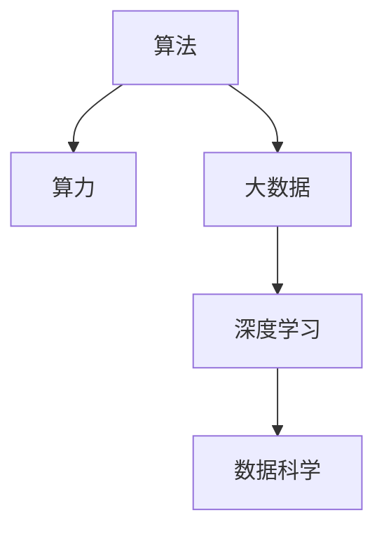

                 

# 算法、算力与大数据：AI的三驾马车

> 关键词：人工智能,算法,算力,大数据,深度学习,机器学习,数据科学

## 1. 背景介绍

在人工智能的广阔领域中，算法、算力和大数据被视为AI的三驾马车。这三者相互依赖、相互促进，共同推动了AI技术的飞速发展。算法提供了解决问题的策略和思路，算力提供了执行这些策略和思路的计算能力，而大数据提供了训练和优化算法所需的数据基础。在过去几十年的AI研究中，这三者的发展历程构成了人工智能演进的主线。

### 1.1 问题由来
人工智能（AI）自诞生以来，经历了多个发展阶段。从早期的基于规则的系统，到20世纪80年代的专家系统，再到21世纪初期机器学习（Machine Learning, ML）的兴起，AI技术不断突破旧有框架，开辟新的领域。然而，尽管在理论和应用上都取得了显著进展，AI技术的落地仍面临诸多挑战，包括算法的复杂度、计算资源的限制、数据的获取和处理等。因此，如何在算法、算力和数据方面协同进步，是当前AI研究的热点问题。

### 1.2 问题核心关键点
算法、算力和大数据的协同进步，主要体现在以下几个方面：

- **算法创新**：从传统的基于规则的系统到复杂的深度学习算法，AI算法在模型结构、训练方法等方面不断演进，推动了AI技术的突破。
- **算力提升**：从早期的个人计算机到现代的高性能计算集群，算力的提升为AI算法提供了强大的执行环境。
- **数据获取与处理**：从早期的手工标注数据到如今的大数据技术，数据量的增加和处理效率的提升，为AI算法提供了更为丰富的训练样本和更高效的训练方法。

这些核心关键点共同构成了人工智能技术的发展基石，使得AI在各个领域得以广泛应用。

## 2. 核心概念与联系

### 2.1 核心概念概述

为了更好地理解算法、算力与大数据的关系，本节将介绍几个关键概念：

- **算法**：指用于解决问题的步骤和策略，包括机器学习算法、深度学习算法等。
- **算力**：指执行算法的计算能力，包括CPU、GPU、TPU等硬件平台，以及软件层面的优化技术。
- **大数据**：指存储和处理大规模数据集的技术，包括数据采集、存储、清洗、分析等环节。
- **深度学习**：一种特殊的机器学习算法，通过多层神经网络进行非线性映射，学习输入和输出之间的关系。
- **数据科学**：涉及数据获取、处理、分析和可视化等领域，是算法和大数据之间的桥梁。

这些概念之间的逻辑关系可以通过以下Mermaid流程图来展示：



这个流程图展示了大语言模型的核心概念及其之间的关系：

1. 算法提供了解决问题的步骤和策略，是AI的核心。
2. 算力提供了执行算法的计算能力，是AI的执行环境。
3. 大数据为算法提供了数据基础，是AI的数据来源。
4. 深度学习是一种特殊的算法，通过多层神经网络实现复杂任务。
5. 数据科学是连接算法和大数据的重要桥梁，涉及数据处理和分析。

这些概念共同构成了AI技术的基石，使得AI可以在各种场景下发挥强大的作用。通过理解这些核心概念，我们可以更好地把握AI的工作原理和优化方向。

## 3. 核心算法原理 & 具体操作步骤

### 3.1 算法原理概述

在AI技术中，算法通常指通过特定步骤和策略解决某一问题的步骤。以下是几种常见算法的原理概述：

- **机器学习算法**：通过学习训练数据中的规律，使模型能够对新数据进行预测或分类。常用的算法包括线性回归、逻辑回归、决策树等。
- **深度学习算法**：通过多层神经网络进行非线性映射，学习输入和输出之间的关系。常用的算法包括卷积神经网络（CNN）、循环神经网络（RNN）、变分自编码器（VAE）等。
- **强化学习算法**：通过试错的方式，让模型在与环境的交互中学习最优策略。常用的算法包括Q-learning、SARSA等。

### 3.2 算法步骤详解

算法步骤通常包括以下几个关键步骤：

**Step 1: 数据准备**
- 收集、清洗、标注数据，准备好训练数据和测试数据。

**Step 2: 模型选择**
- 根据任务类型选择合适的算法模型。例如，对于图像分类任务，通常选择卷积神经网络（CNN）；对于自然语言处理任务，通常选择循环神经网络（RNN）或Transformer模型。

**Step 3: 模型训练**
- 将训练数据输入模型，通过反向传播算法（Backpropagation）调整模型参数，最小化损失函数。
- 常用的优化算法包括随机梯度下降（SGD）、Adam、Adagrad等。

**Step 4: 模型评估**
- 使用测试数据对训练好的模型进行评估，通常使用准确率、召回率、F1-score等指标。

**Step 5: 模型部署**
- 将训练好的模型部署到实际应用场景中，通常使用RESTful API或服务化框架进行调用。

### 3.3 算法优缺点

算法在AI中的应用，既有其优点，也有其局限性：

**优点**：
1. **灵活性**：算法能够针对特定问题进行定制化设计，灵活应对各种任务。
2. **可解释性**：一些算法（如决策树、线性回归等）具有较高的可解释性，能够直观展示模型内部逻辑。
3. **易用性**：许多算法已经封装为易用的库函数，便于开发者快速上手。

**缺点**：
1. **计算复杂度高**：一些算法（如深度学习）计算复杂度高，需要大规模计算资源支持。
2. **数据依赖性强**：算法的效果很大程度上取决于数据的数量和质量。
3. **泛化能力差**：部分算法（如过拟合的模型）在新数据上泛化能力差。

### 3.4 算法应用领域

算法在AI领域的应用非常广泛，包括但不限于：

- **计算机视觉**：图像分类、目标检测、图像分割等任务。
- **自然语言处理**：机器翻译、文本分类、问答系统等任务。
- **语音识别**：语音转文本、情感识别、语音合成等任务。
- **推荐系统**：协同过滤、基于内容的推荐、混合推荐等任务。
- **智能控制**：机器人导航、自动驾驶、智能家居等任务。

## 4. 数学模型和公式 & 详细讲解 & 举例说明

### 4.1 数学模型构建

在AI中，数学模型通常用于描述算法的工作原理。以下是几个常见算法的数学模型：

- **线性回归模型**：用于预测连续值，数学模型为 $y = w_0 + w_1x_1 + w_2x_2 + ... + w_nx_n + \epsilon$。
- **决策树模型**：用于分类或回归任务，通过划分数据空间构建树形结构。
- **卷积神经网络（CNN）**：用于图像识别任务，数学模型为 $y = \sigma(\sum_{i=1}^{n}w_i z_i + b)$。
- **循环神经网络（RNN）**：用于序列数据处理任务，通过反向传播算法（Backpropagation Through Time, BPTT）进行参数更新。

### 4.2 公式推导过程

以下是几个常见算法的公式推导过程：

- **线性回归**：目标函数为 $J(w) = \frac{1}{2m} \sum_{i=1}^m (y_i - w_0 - \sum_{j=1}^n w_j x_{ij})^2$，其中 $m$ 为样本数。梯度下降更新公式为 $w_j \leftarrow w_j - \eta \frac{1}{m} \sum_{i=1}^m (y_i - w_0 - \sum_{j=1}^n w_j x_{ij})x_{ij}$。
- **卷积神经网络**：假设输入数据为 $z_i$，卷积层输出为 $y$，激活函数为 $\sigma$。卷积核权重为 $w$，偏置为 $b$。则输出为 $y = \sigma(\sum_{i=1}^{n}w_i z_i + b)$。
- **决策树**：通过划分数据空间构建树形结构，计算信息增益并选择最优划分特征。

### 4.3 案例分析与讲解

**案例：手写数字识别**
- **数据准备**：收集手写数字图片数据集，进行预处理和标注。
- **模型选择**：选择卷积神经网络（CNN）作为模型。
- **模型训练**：将训练数据输入模型，使用交叉熵损失函数进行训练。
- **模型评估**：使用测试数据集进行评估，输出准确率和混淆矩阵。
- **模型部署**：将训练好的模型部署到实际应用中，实现手写数字的识别。

## 5. 项目实践：代码实例和详细解释说明

### 5.1 开发环境搭建

在进行项目实践前，我们需要准备好开发环境。以下是使用Python进行PyTorch开发的环境配置流程：

1. 安装Anaconda：从官网下载并安装Anaconda，用于创建独立的Python环境。

2. 创建并激活虚拟环境：
```bash
conda create -n pytorch-env python=3.8 
conda activate pytorch-env
```

3. 安装PyTorch：根据CUDA版本，从官网获取对应的安装命令。例如：
```bash
conda install pytorch torchvision torchaudio cudatoolkit=11.1 -c pytorch -c conda-forge
```

4. 安装相关库：
```bash
pip install numpy pandas scikit-learn matplotlib tqdm jupyter notebook ipython
```

完成上述步骤后，即可在`pytorch-env`环境中开始项目实践。

### 5.2 源代码详细实现

以下是使用PyTorch进行手写数字识别的代码实现。

```python
import torch
import torch.nn as nn
import torchvision
import torchvision.transforms as transforms
from torch.utils.data import DataLoader
from torch.autograd import Variable

# 数据预处理
transform = transforms.Compose([
    transforms.ToTensor(),
    transforms.Normalize((0.5,), (0.5,))
])

trainset = torchvision.datasets.MNIST(root='./data', train=True,
                                     download=True, transform=transform)
trainloader = DataLoader(trainset, batch_size=64, shuffle=True)

# 定义卷积神经网络模型
class CNN(nn.Module):
    def __init__(self):
        super(CNN, self).__init__()
        self.conv1 = nn.Conv2d(1, 10, kernel_size=5)
        self.conv2 = nn.Conv2d(10, 20, kernel_size=5)
        self.fc1 = nn.Linear(320, 50)
        self.fc2 = nn.Linear(50, 10)

    def forward(self, x):
        x = F.relu(F.max_pool2d(self.conv1(x), 2))
        x = F.relu(F.max_pool2d(self.conv2(x), 2))
        x = x.view(-1, 320)
        x = F.relu(self.fc1(x))
        x = self.fc2(x)
        return F.log_softmax(x, dim=1)

# 定义训练过程
cnn = CNN()
criterion = nn.CrossEntropyLoss()
optimizer = torch.optim.Adam(cnn.parameters(), lr=0.001)
for epoch in range(5):
    for i, (images, labels) in enumerate(trainloader):
        images = Variable(images)
        labels = Variable(labels)
        optimizer.zero_grad()
        output = cnn(images)
        loss = criterion(output, labels)
        loss.backward()
        optimizer.step()

print('Finished Training')
```

### 5.3 代码解读与分析

让我们再详细解读一下关键代码的实现细节：

**数据预处理**：
- `transforms.Compose`方法用于组合多个数据预处理步骤。`transforms.ToTensor()`将输入转换为张量，`transforms.Normalize()`将数据标准化。

**模型定义**：
- `nn.Conv2d`用于定义卷积层，`nn.Linear`用于定义全连接层。
- `F.relu`和`F.max_pool2d`用于激活和池化操作。

**训练过程**：
- `Adam`优化器用于更新模型参数。
- `for`循环遍历训练集，`Variable`用于将输入数据转换为可训练变量。
- `output = cnn(images)`表示模型前向传播，`loss = criterion(output, labels)`表示计算损失函数，`loss.backward()`表示反向传播，`optimizer.step()`表示参数更新。

**代码展示**：
- `images = Variable(images)`：将输入数据转换为可训练变量。
- `labels = Variable(labels)`：将标签转换为可训练变量。
- `output = cnn(images)`：模型前向传播。
- `loss = criterion(output, labels)`：计算损失函数。
- `loss.backward()`：反向传播计算梯度。
- `optimizer.step()`：参数更新。

## 6. 实际应用场景

### 6.1 智能推荐系统

智能推荐系统是AI在实际应用中的一个典型场景。通过分析用户的历史行为数据，推荐系统可以为用户推荐感兴趣的商品、内容等。常用的推荐算法包括协同过滤、基于内容的推荐和混合推荐等。

在实践中，可以使用深度学习算法（如CNN、RNN）对用户行为数据进行建模，提取用户兴趣特征，结合商品特征进行推荐。训练好的模型可以部署到实际应用中，实现实时推荐。

### 6.2 医疗影像诊断

医疗影像诊断是AI在医疗领域的一个重要应用场景。通过分析患者的影像数据，AI模型可以辅助医生进行疾病诊断和治疗方案的制定。常用的算法包括卷积神经网络（CNN）和循环神经网络（RNN）等。

在实践中，可以使用卷积神经网络（CNN）对医学影像进行特征提取和分类，结合医生的专业知识进行诊断。训练好的模型可以部署到医疗系统中，提高诊断效率和准确率。

### 6.3 自动驾驶

自动驾驶是AI在交通领域的一个重要应用场景。通过感知环境、规划路径和控制车辆，自动驾驶系统可以实现无人驾驶。常用的算法包括卷积神经网络（CNN）、循环神经网络（RNN）和强化学习（Reinforcement Learning, RL）等。

在实践中，可以使用卷积神经网络（CNN）和循环神经网络（RNN）对传感器数据进行特征提取和路径规划，结合强化学习算法进行控制。训练好的模型可以部署到自动驾驶系统中，实现无人驾驶。

## 7. 工具和资源推荐

### 7.1 学习资源推荐

为了帮助开发者系统掌握AI技术的理论基础和实践技巧，这里推荐一些优质的学习资源：

1. 《机器学习》课程：由斯坦福大学Andrew Ng教授开设，是机器学习领域的经典课程。
2. 《深度学习》课程：由Coursera与DeepMind联合开设，介绍了深度学习的基本原理和应用。
3. 《Python深度学习》书籍：弗朗索瓦·切里昂（François Chollet）所著，介绍了使用Keras实现深度学习的全过程。
4. 《深度学习与Python》书籍：伊恩·古德费洛（Ian Goodfellow）等人合著，是深度学习领域的权威教材。
5. Kaggle：数据科学竞赛平台，提供大量的公开数据集和竞赛，是学习和实践数据科学的好地方。

通过对这些资源的学习实践，相信你一定能够快速掌握AI技术的精髓，并用于解决实际的NLP问题。

### 7.2 开发工具推荐

高效的开发离不开优秀的工具支持。以下是几款用于AI开发常用的工具：

1. PyTorch：基于Python的开源深度学习框架，灵活的计算图和动态图设计，适合快速迭代研究。
2. TensorFlow：由Google主导开发的开源深度学习框架，生产部署方便，适合大规模工程应用。
3. Keras：高层次的神经网络API，易于上手，支持多种后端，如TensorFlow和Theano。
4. Scikit-learn：基于Python的数据科学库，提供了丰富的机器学习算法和数据处理工具。
5. Jupyter Notebook：交互式开发环境，支持Python、R等语言，适合研究和分享代码。

合理利用这些工具，可以显著提升AI模型的开发效率，加快创新迭代的步伐。

### 7.3 相关论文推荐

AI技术的发展离不开学界的持续研究。以下是几篇奠基性的相关论文，推荐阅读：

1. 《Backpropagation: Application to Feedforward Networks and Problem Learning》：Yann LeCun等人提出的反向传播算法，是深度学习的基础。
2. 《ImageNet Classification with Deep Convolutional Neural Networks》：Alex Krizhevsky等人提出的卷积神经网络（CNN），奠定了计算机视觉领域的基础。
3. 《Connectionist Temporal Classification: Labelling Unsegmented Sequence Data with Recurrent Neural Networks》：Geoffrey Hinton等人提出的CTC算法，实现了端到端的语音识别。
4. 《Attention is All You Need》：Vaswani等人提出的Transformer模型，推动了自然语言处理领域的突破。
5. 《Generative Adversarial Nets》：Ian Goodfellow等人提出的生成对抗网络（GAN），是生成模型领域的重要里程碑。

这些论文代表了大语言模型微调技术的发展脉络。通过学习这些前沿成果，可以帮助研究者把握学科前进方向，激发更多的创新灵感。

## 8. 总结：未来发展趋势与挑战

### 8.1 研究成果总结

在AI领域，算法、算力和大数据三者之间的关系密不可分。算法创新提供了解决问题的思路和策略，算力提升提供了强大的计算环境，大数据提供了丰富的数据基础。通过三者的协同进步，AI技术得以在各个领域广泛应用。

### 8.2 未来发展趋势

展望未来，AI技术将继续在以下几个方向发展：

1. **算法多样化**：随着AI技术的发展，更多的算法将被发明和应用，如生成对抗网络（GAN）、自适应增强学习（Adaptive Reinforcement Learning）等。
2. **算力普及化**：高性能计算资源将逐渐普及到企业和家庭，推动AI应用的普及和发展。
3. **数据智能化**：大数据技术将更加智能化，自动化的数据采集、清洗和标注技术将大幅提升数据处理效率。

### 8.3 面临的挑战

尽管AI技术取得了长足进步，但在应用过程中仍面临诸多挑战：

1. **计算资源限制**：高性能计算资源的成本较高，限制了AI技术在企业中的应用。
2. **数据隐私和安全**：大规模数据集的使用涉及隐私和安全问题，如何保护用户数据隐私是重要的研究课题。
3. **算法透明性**：部分AI算法的决策过程难以解释，缺乏透明性和可解释性。
4. **模型泛化能力**：AI模型在特定场景下的泛化能力较差，难以应对新数据和新问题。
5. **伦理和道德问题**：AI算法可能存在偏见和歧视，如何避免伦理和道德问题是一个重要的挑战。

### 8.4 研究展望

未来，AI技术需要在算法、算力和大数据等方面进行进一步的探索和发展：

1. **开发高效算法**：研究更高效、更可解释的算法，如因果推断、自适应学习等，提升AI系统的可靠性和可解释性。
2. **提升算力水平**：开发更加高效的计算架构和算法，如异构计算、量子计算等，提升AI系统的处理能力。
3. **优化大数据处理**：开发智能化、自动化的数据处理工具，提升数据采集、清洗和标注的效率。
4. **强化伦理监管**：制定AI伦理规范，确保AI技术的透明性和公平性，避免伦理和道德问题。

## 9. 附录：常见问题与解答

**Q1：什么是深度学习？**

A: 深度学习是一种机器学习算法，通过多层神经网络进行非线性映射，学习输入和输出之间的关系。深度学习在计算机视觉、自然语言处理等领域取得了显著的成果。

**Q2：机器学习和深度学习有什么区别？**

A: 机器学习和深度学习都是AI技术的分支。机器学习通常使用浅层神经网络或决策树等算法进行建模；而深度学习使用多层神经网络进行建模，具有更强的非线性表达能力和更强的泛化能力。

**Q3：大数据如何帮助AI模型训练？**

A: 大数据为AI模型提供了丰富的训练样本，帮助模型更好地学习输入和输出之间的关系。同时，大数据还可以帮助AI模型进行特征工程，提升模型的表现。

**Q4：AI算法在实际应用中需要注意哪些问题？**

A: 在实际应用中，AI算法需要注意以下问题：
1. 数据质量和数量：确保数据的质量和数量，避免数据偏差和过拟合。
2. 模型泛化能力：评估模型的泛化能力，确保模型在新数据上的表现。
3. 算法透明性：确保算法的透明性和可解释性，避免"黑箱"系统。
4. 模型鲁棒性：评估模型的鲁棒性，确保模型在各种情况下都能正常工作。
5. 伦理和道德问题：确保模型的透明性和公平性，避免伦理和道德问题。

总之，AI算法在实际应用中需要综合考虑数据、模型、算法和伦理等多个方面的问题，才能取得良好的效果。

---

作者：禅与计算机程序设计艺术 / Zen and the Art of Computer Programming

