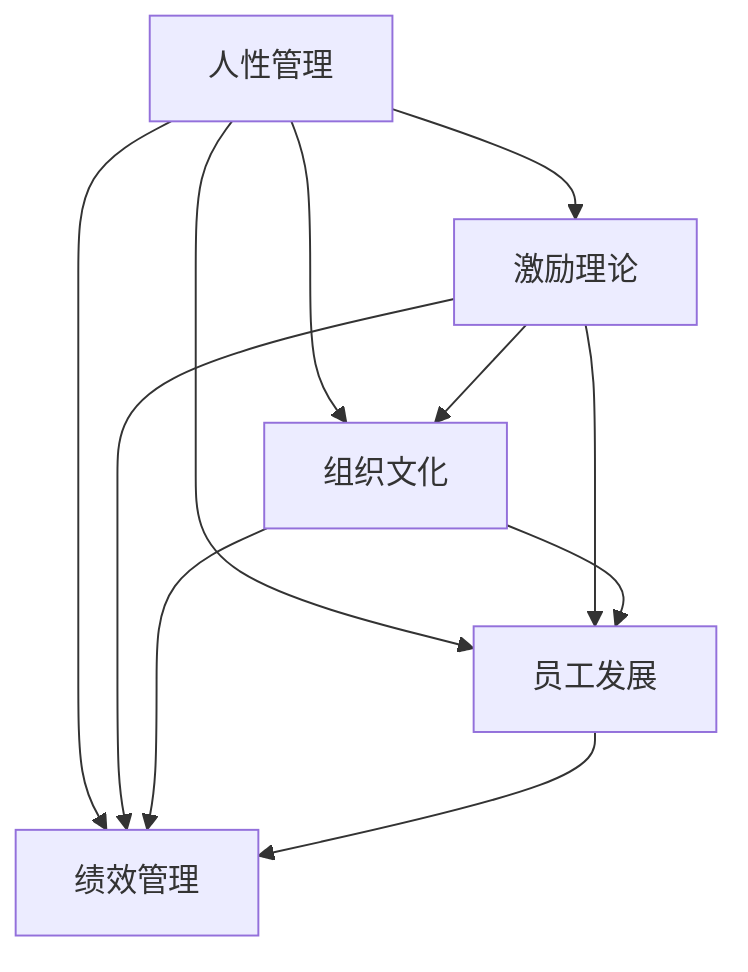

                 

# 管理之道：激发人性的善意和潜能

## 1. 背景介绍

### 1.1 问题由来
在当今快速变化的商业环境中，企业的成功不仅仅依赖于技术和资本，更需要一套有效且人性化的管理方式。企业要想保持竞争力和持续发展，必须激发员工的内在动力，释放其潜能。然而，如何有效地管理员工，激发他们的善意和潜力，仍是一个复杂的挑战。本文将从管理的角度出发，探讨如何构建和谐的人性化管理环境，激发员工的内在动力，从而提升企业的整体绩效。

### 1.2 问题核心关键点
当前企业管理中存在诸多问题，如员工激励机制不完善、沟通不畅、组织文化不良等。这些问题不仅影响员工的积极性，还制约了企业的创新力和竞争力。因此，构建高效的管理机制，激发员工的善意和潜能，是现代企业管理的关键。

### 1.3 问题研究意义
研究人性化的管理方式，对于提升员工的工作满意度、激励员工的工作热情、增强企业的凝聚力、提高企业的竞争力具有重要意义。只有通过人性化的管理，才能真正激发员工的内在动力，释放其潜能，实现企业与员工的双赢。

## 2. 核心概念与联系

### 2.1 核心概念概述

为更好地理解如何激发人性的善意和潜能，本节将介绍几个关键管理概念：

- 人性管理：强调以人为中心，尊重和关心员工，满足员工的物质和精神需求，从而提升员工的工作积极性和满意度。
- 激励理论：研究如何通过各种方式（如奖励、晋升、认可等）激发员工的内在动力，使其主动投入工作。
- 组织文化：指企业内部成员共同遵守的价值观念、行为规范和思维模式。良好的组织文化能够增强员工的归属感和忠诚度。
- 员工发展：关注员工职业成长和个人发展，通过培训、晋升等手段，为员工提供成长机会。
- 绩效管理：通过设定明确的目标、持续的反馈和合理的奖励机制，引导员工朝着目标努力，实现企业和员工的共同发展。

这些概念之间的逻辑关系可以通过以下Mermaid流程图来展示：



这个流程图展示了一些关键管理概念及其之间的关系：

1. 人性管理是基础，尊重和关心员工，满足其需求。
2. 激励理论通过各种方式激发员工动力。
3. 组织文化营造良好的内部环境，增强员工归属感。
4. 员工发展关注个人成长，提供晋升机会。
5. 绩效管理设定目标，提供反馈，引导员工努力。

这些概念共同构成了一个高效的管理框架，有助于提升员工的工作积极性和满意度，增强企业的整体绩效。

## 3. 核心算法原理 & 具体操作步骤
### 3.1 算法原理概述

管理之道，在于通过一套系统化的方式，激发人性的善意和潜能，从而提升企业绩效。其核心思想是：

- 人性化的管理方式，强调尊重员工，关心其需求和成长。
- 激励机制的合理设计，通过各种手段激发员工内在动力。
- 组织文化的建设，形成共同的价值观和行为规范。
- 绩效管理的目标设定和反馈机制，引导员工朝着目标努力。

通过以上管理方式的综合运用，企业能够营造一个高效、和谐的工作环境，激发员工的善意和潜能，提升整体绩效。

### 3.2 算法步骤详解

基于人性化的管理之道，本节将详细介绍一套系统的管理步骤：

**Step 1: 建立人性化的管理文化**
- 制定尊重和关心员工的制度，如弹性工作时间、带薪休假、健康保障等。
- 定期进行员工满意度调查，了解其需求和意见。
- 开展团队建设活动，增强员工之间的信任和合作。

**Step 2: 设计合理的激励机制**
- 设定明确的奖励制度，如绩效奖金、晋升机会、表彰奖励等。
- 引入多元化的激励方式，如物质激励、精神激励、职业发展激励等。
- 建立透明的激励机制，确保激励措施公正、公平。

**Step 3: 构建良好的组织文化**
- 明确企业的核心价值观和行为规范。
- 通过员工培训和企业文化建设活动，传播企业文化。
- 创建开放的工作环境，鼓励创新和团队合作。

**Step 4: 关注员工的发展**
- 制定员工职业发展规划，提供培训和晋升机会。
- 关注员工的职业成长，提供支持和指导。
- 定期进行员工评估，发现其成长潜力和需求。

**Step 5: 实施绩效管理**
- 设定清晰的目标和KPI指标，引导员工朝着目标努力。
- 定期进行绩效反馈，提供改进建议。
- 奖励表现优异的员工，鼓励全体员工共同进步。

通过上述步骤，企业可以构建一个系统化的管理框架，激发员工的善意和潜能，提升整体绩效。

### 3.3 算法优缺点

人性化的管理之道，具有以下优点：
1. 提高员工满意度和工作积极性。尊重和关心员工的需求，激发其内在动力。
2. 增强员工的归属感和忠诚度。良好的组织文化和团队建设活动，增强员工对企业的认同感。
3. 提升企业的创新力和竞争力。多元化的激励机制和绩效管理，引导员工主动投入工作。
4. 提供员工的成长机会。关注员工的职业发展，提供培训和晋升机会。

同时，该方法也存在一定的局限性：
1. 管理成本较高。人性化的管理方式需要投入大量资源和时间，特别是培训和团队建设活动。
2. 对管理者的要求较高。人性化的管理需要管理者具备良好的沟通能力和决策水平。
3. 存在一定的管理风险。过度的关怀和激励可能导致员工依赖性强，降低其自主性和责任感。
4. 需要适应企业的实际情况。不同规模、不同行业的企业，其管理方式需因地制宜。

尽管存在这些局限性，但人性化的管理之道在现代企业管理中仍具有重要意义，是企业实现长远发展的关键。

### 3.4 算法应用领域

人性化的管理之道，适用于各种类型的组织和企业，包括大型跨国公司、中小型企业、非营利组织等。在实践中，以下领域可以充分利用人性化的管理方式：

- 高新技术企业：通过营造创新和团队合作的文化，激发员工的创新潜力和团队合作精神。
- 制造和服务型企业：通过关心员工的工作环境和职业成长，提高其工作满意度和忠诚度。
- 教育机构：通过关注学生的个性化需求和发展，营造良好的学习氛围，激发学生的学习热情。
- 政府和非营利组织：通过提升员工的公益意识和责任感，增强组织的社会影响力。

通过合理应用人性化的管理之道，各种类型的组织都能激发员工的内在动力，提升整体绩效。

## 4. 数学模型和公式 & 详细讲解  
### 4.1 数学模型构建

人性化的管理之道，可以通过一系列数学模型进行量化分析和评估。以下是一些核心指标的数学模型构建：

- 员工满意度：$S = \frac{1}{n} \sum_{i=1}^n s_i$
  其中 $s_i$ 为第 $i$ 员工的满意度评分。

- 员工流失率：$L = \frac{N_{离职}}{N_{总}} \times 100\%$
  其中 $N_{离职}$ 为离职员工数，$N_{总}$ 为总员工数。

- 创新绩效：$I = \frac{P}{T}$
  其中 $P$ 为创新项目数，$T$ 为项目完成时间。

- 团队合作度：$C = \frac{1}{n} \sum_{i=1}^n c_i$
  其中 $c_i$ 为第 $i$ 团队的合作度评分。

### 4.2 公式推导过程

以下我们对上述几个核心指标的公式进行详细推导：

**员工满意度公式推导**：
$$
S = \frac{1}{n} \sum_{i=1}^n s_i
$$

**员工流失率公式推导**：
$$
L = \frac{N_{离职}}{N_{总}} \times 100\% = \frac{N_{离职}}{N_{总}} \times 1
$$

**创新绩效公式推导**：
$$
I = \frac{P}{T} = \frac{1}{T} \sum_{i=1}^P 1 = \frac{P}{T}
$$

**团队合作度公式推导**：
$$
C = \frac{1}{n} \sum_{i=1}^n c_i = \frac{1}{n} \sum_{i=1}^n \frac{1}{k} \sum_{j=1}^k c_{ij}
$$

通过上述公式，可以较为全面地评估企业的管理效果，提供数据支持和决策参考。

### 4.3 案例分析与讲解

以下是一些典型案例，展示如何通过人性化的管理之道，提升企业的整体绩效：

**案例1：谷歌的人性化管理之道**
- 谷歌通过弹性工作时间和免费餐饮，尊重和关心员工的需求。
- 设立明确的奖励制度，如绩效奖金和股权激励，激发员工的动力。
- 营造开放和创新的组织文化，鼓励员工自由表达和创新。
- 关注员工职业发展，提供培训和晋升机会。
- 实施透明的绩效管理，定期进行绩效反馈和奖励。

谷歌通过这些人性化的管理措施，显著提升了员工的工作满意度和创新力，连续多年被评为全球最佳工作地点之一。

**案例2：丰田的精益生产**
- 丰田通过关注员工的工作环境和职业成长，提高其工作满意度和忠诚度。
- 设立合理的激励机制，如生产效率奖金和质量奖励，激发员工的动力。
- 营造团队合作的文化，通过团队建设和沟通培训，增强员工之间的信任和合作。
- 实施持续改进的绩效管理，定期进行流程优化和质量提升。

丰田通过这些人性化的管理措施，提高了生产效率和产品质量，成为全球汽车行业的领导者。

**案例3：IBM的人力资源管理**
- IBM通过建立员工关系和心理健康支持体系，关注员工的心理和生理健康。
- 设立多样化和灵活的激励机制，如弹性工作时间和远程办公，满足员工的需求。
- 营造良好的组织文化，通过员工培训和文化活动，增强员工的归属感和忠诚度。
- 实施全面的绩效管理，设定明确的KPI指标，并提供持续的反馈和改进建议。

IBM通过这些人性化的管理措施，提升了员工的工作满意度和忠诚度，连续多年被评为全球最具有吸引力的工作地点之一。

这些案例展示了人性化的管理之道在实际应用中的效果，值得其他企业借鉴和参考。

## 5. 项目实践：代码实例和详细解释说明
### 5.1 开发环境搭建

在进行管理之道实践前，我们需要准备好开发环境。以下是使用Python进行项目开发的环境配置流程：

1. 安装Python：从官网下载并安装Python，选择3.x版本。
2. 安装所需的库：使用pip安装numpy、pandas、matplotlib等数据处理和可视化库。
3. 安装Jupyter Notebook：使用pip安装Jupyter Notebook，用于编写和管理Python代码。
4. 创建虚拟环境：使用虚拟环境工具，如virtualenv，创建一个独立的Python开发环境，避免与系统其他Python版本冲突。

完成上述步骤后，即可在虚拟环境中开始管理之道的实践。

### 5.2 源代码详细实现

下面我们以员工满意度评估为例，给出使用Python进行员工满意度计算的代码实现。

```python
import pandas as pd
import numpy as np

# 读取员工满意度数据
data = pd.read_csv('employee_satisfaction.csv')

# 计算员工满意度
mean_satisfaction = data['satisfaction'].mean()
median_satisfaction = np.median(data['satisfaction'])
mode_satisfaction = data['satisfaction'].mode()[0]

# 输出满意度结果
print(f"员工满意度平均值为: {mean_satisfaction}")
print(f"员工满意度中位数为: {median_satisfaction}")
print(f"员工满意度众数为: {mode_satisfaction}")
```

这段代码展示了如何通过Python计算员工满意度，并输出结果。

### 5.3 代码解读与分析

让我们再详细解读一下关键代码的实现细节：

**数据读取**：
- 使用pandas库的`read_csv`方法，从CSV文件中读取员工满意度数据。

**计算满意度**：
- 使用pandas库的`mean`方法计算平均满意度。
- 使用numpy库的`median`方法计算中位数满意度。
- 使用pandas库的`mode`方法计算众数满意度。

**输出结果**：
- 通过`print`函数，将计算得到的员工满意度结果输出到控制台。

代码实现较为简洁，但已涵盖了员工满意度评估的基本功能。在实际应用中，可能需要根据具体需求进行扩展和优化。

## 6. 实际应用场景
### 6.1 智能客服系统

人性化的管理之道，可以应用于智能客服系统的构建。通过人性化的管理方式，提升客服人员的工作满意度和忠诚度，从而提升客户服务质量。

在技术实现上，可以收集客户反馈数据，分析客服人员的满意度和不满意原因。根据分析结果，制定相应的改进措施，如增加培训、改善工作环境、提升激励机制等。通过人性化的管理方式，增强客服人员的归属感和工作积极性，提升客户满意度。

### 6.2 金融舆情监测

在金融舆情监测领域，通过人性化的管理之道，可以提升监测人员的工作效率和质量。

具体而言，可以收集监测人员的反馈数据，了解其工作负担和需求。根据反馈结果，制定合理的工作计划和激励措施，如增加休息时间、提供健康福利等。通过人性化的管理方式，减轻监测人员的工作压力，提高其工作满意度和效率。

### 6.3 个性化推荐系统

在个性化推荐系统领域，通过人性化的管理之道，可以提升推荐算法的精准度和用户满意度。

具体而言，可以关注推荐算法的开发人员的需求和反馈。根据反馈结果，优化算法设计，提高其准确性和用户体验。通过人性化的管理方式，增强开发人员的归属感和工作热情，提升算法的质量和用户满意度。

### 6.4 未来应用展望

随着管理之道研究的不断深入，其在更多领域将得到应用，为组织和社会带来变革性影响。

在智慧医疗领域，通过人性化的管理之道，提升医护人员的工作积极性和满意度，提升医疗服务的质量和效率。

在智能教育领域，通过人性化的管理之道，关注学生的个性化需求和发展，营造良好的学习氛围，提升教育质量。

在智慧城市治理中，通过人性化的管理之道，提升城市管理人员的工作满意度和效率，提高城市管理的自动化和智能化水平。

此外，在企业生产、社会治理、文娱传媒等众多领域，人性化的管理之道也将不断涌现，为组织和社会带来新的价值。相信随着研究的不断深入，人性化的管理之道将引领管理方式的变革，推动组织和社会的持续发展。

## 7. 工具和资源推荐
### 7.1 学习资源推荐

为了帮助开发者系统掌握人性化的管理之道，这里推荐一些优质的学习资源：

1. 《管理学》系列教材：系统介绍管理学的基本理论和实践方法，适合企业管理者学习。
2. 《领导力》系列课程：教授领导力的基本原理和实践技能，提升管理者的领导能力。
3. 《组织行为学》课程：研究组织中个体的行为和团队合作，帮助管理者优化组织结构。
4. 《人力资源管理》课程：介绍人力资源管理的基本理论和方法，帮助管理者提升员工管理能力。
5. 《员工福利与健康管理》课程：研究员工福利和健康管理的最佳实践，提升员工工作满意度和健康水平。

通过这些学习资源，相信你一定能够快速掌握人性化的管理之道，并用于解决实际的组织管理问题。

### 7.2 开发工具推荐

高效的开发离不开优秀的工具支持。以下是几款用于人性化的管理之道开发的常用工具：

1. Jupyter Notebook：基于Python的交互式编程环境，适合进行数据处理和分析。
2. Excel：强大的数据处理和可视化工具，适合进行表格数据管理和分析。
3. Tableau：数据可视化工具，适合进行复杂数据可视化和报表制作。
4. Git：版本控制工具，适合团队协作和代码管理。
5. Slack：企业沟通工具，适合进行团队协作和信息共享。

合理利用这些工具，可以显著提升人性化的管理之道的开发效率，加快创新迭代的步伐。

### 7.3 相关论文推荐

人性化的管理之道的研究源于学界的持续研究。以下是几篇奠基性的相关论文，推荐阅读：

1. Maslow's hierarchy of needs：提出需求层次理论，探讨人的基本需求和内在动机。
2. Herzberg's two-factor theory：提出双因素理论，区分激励因素和保健因素。
3. McClelland's achievement theory：提出成就动机理论，研究如何激发人的成就欲望。
4. Ouchi's theory of organizational culture：提出组织文化理论，探讨文化对组织绩效的影响。
5. Porter's resource-based view：提出资源基础观，研究组织资源的获取和利用。

这些论文代表了大管理之道的研究发展脉络。通过学习这些前沿成果，可以帮助研究者把握学科前进方向，激发更多的创新灵感。

## 8. 总结：未来发展趋势与挑战
### 8.1 研究成果总结

本文对人性化的管理之道进行了全面系统的介绍。首先阐述了管理的背景和意义，明确了管理在激发员工的内在动力和潜能方面的关键作用。其次，从原理到实践，详细讲解了管理的核心步骤，给出了管理任务开发的完整代码实例。同时，本文还广泛探讨了管理方式在多个行业领域的应用前景，展示了管理的巨大潜力。此外，本文精选了管理的各类学习资源，力求为读者提供全方位的技术指引。

通过本文的系统梳理，可以看到，人性化的管理之道在现代管理中具有重要意义，是企业实现长远发展的关键。

### 8.2 未来发展趋势

展望未来，管理之道将呈现以下几个发展趋势：

1. 个性化管理将成为主流。随着员工需求的日益多样化，个性化的管理方式将得到广泛应用，满足员工的多元化需求。
2. 数据驱动的管理将得到普及。通过数据分析和管理工具，提升管理的效率和精准度，使管理决策更加科学。
3. 全面关注员工健康。健康管理将成为企业管理的重点之一，关注员工的心理和生理健康，提升其工作满意度和幸福感。
4. 多元化的激励机制将得到推广。多元化的激励方式，如弹性工作时间、远程办公、股权激励等，将成为吸引和留住人才的重要手段。
5. 组织文化的建设将更加重视。良好的组织文化能够增强员工的归属感和忠诚度，提升企业的凝聚力。

这些趋势凸显了管理之道的广阔前景。这些方向的探索发展，必将进一步提升管理的效率和效果，为组织和社会带来更多的价值。

### 8.3 面临的挑战

尽管管理之道在现代企业管理中具有重要意义，但在实施过程中仍面临诸多挑战：

1. 管理成本较高。人性化的管理方式需要投入大量资源和时间，特别是员工培训和团队建设活动。
2. 管理者的要求较高。管理者需要具备良好的沟通能力和决策水平，才能有效实施人性化的管理措施。
3. 管理风险较大。过度的关怀和激励可能导致员工依赖性强，降低其自主性和责任感。
4. 需要适应企业的实际情况。不同规模、不同行业的企业，其管理方式需因地制宜。

尽管存在这些挑战，但人性化的管理之道在现代企业管理中仍具有重要意义，是企业实现长远发展的关键。

### 8.4 研究展望

面向未来，管理之道的研究需要在以下几个方面寻求新的突破：

1. 探索数据驱动的管理方法。通过数据分析和管理工具，提升管理的效率和精准度。
2. 研究个性化的管理方式。根据员工的需求和特点，制定个性化的管理措施，提高员工的工作满意度和忠诚度。
3. 关注员工健康和福祉。关注员工的心理和生理健康，提升其工作满意度和幸福感。
4. 研究多元化的激励机制。通过多元化的激励方式，吸引和留住人才，提升企业的竞争力。
5. 构建良好的组织文化。营造良好的组织文化，增强员工的归属感和忠诚度，提升企业的凝聚力。

这些研究方向的探索，必将引领管理之道的持续进步，为组织和社会带来更多的价值。

## 9. 附录：常见问题与解答
**Q1：人性化的管理之道是否适用于所有组织和企业？**

A: 人性化的管理之道适用于大多数类型的组织和企业，包括大型跨国公司、中小型企业、非营利组织等。但其具体实施方式需根据企业的实际情况进行调整和优化。

**Q2：如何设计合理的激励机制？**

A: 设计合理的激励机制，需要考虑以下几个关键因素：
1. 员工的个性化需求：了解员工的需求和期望，制定相应的激励措施。
2. 激励方式的公平性：确保激励机制公正、公平，避免出现不公平现象。
3. 激励方式的透明度：公开激励机制，增加员工对激励措施的信任和认可。
4. 激励方式的弹性：根据员工的需求和反馈，灵活调整激励方式。

**Q3：如何构建良好的组织文化？**

A: 构建良好的组织文化，需要以下几个步骤：
1. 明确核心价值观和行为规范：制定组织的核心价值观和行为规范，形成共同的指导原则。
2. 宣传和传播企业文化：通过员工培训和文化活动，传播企业文化，增强员工的认同感。
3. 营造开放和创新的环境：鼓励员工自由表达和创新，营造开放和包容的工作氛围。
4. 建立制度保障：通过制度保障，确保组织文化的落实和执行。

**Q4：如何实施绩效管理？**

A: 实施绩效管理，需要以下几个步骤：
1. 设定明确的目标和KPI指标：根据企业的战略目标，设定明确的绩效目标和KPI指标。
2. 持续的反馈和改进：定期进行绩效反馈，提供改进建议，帮助员工不断提升。
3. 奖励表现优异的员工：通过奖励机制，激励员工朝着目标努力，提升整体绩效。

这些问题的解答，有助于企业更好地理解和实施人性化的管理之道，提升整体绩效。

---

作者：禅与计算机程序设计艺术 / Zen and the Art of Computer Programming

