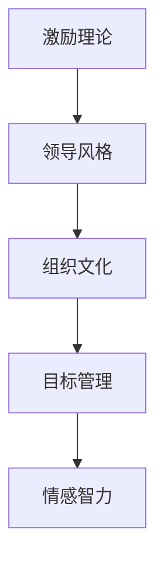

                 

# 管理的本质：激发潜能与善意

在现代社会，管理是一门重要的学问，它关系到组织的效率和创新，也是推动社会发展的重要力量。然而，管理不仅仅是制定规章制度和进行流程优化，更深层次的挑战是如何激发员工的潜能，以及如何在管理中注入善意。本文将从管理的本质出发，探讨如何通过激发潜能和注入善意，打造高效且有灵魂的企业文化。

## 1. 背景介绍

### 1.1 管理学的历史演变
管理学作为一门学科，其历史可以追溯到19世纪末。早期的管理思想家如泰勒（Frederick W. Taylor）和法约尔（Henri Fayol），提出了科学管理和行政管理的基本原则。这些原则强调效率、分工和标准化。随着时代的发展，管理学逐渐吸收了行为科学和系统理论的精髓，发展成为一门综合性、交叉性的学科。

### 1.2 现代管理学的核心问题
现代管理学面临着诸多核心问题，包括如何构建高效的组织结构、如何激励员工、如何优化决策过程等。这些问题都需要管理者具备深刻的理解和管理智慧。

## 2. 核心概念与联系

### 2.1 核心概念概述

- **激励理论**：心理学中的激励理论探讨如何通过奖赏和惩罚等手段，激发员工的积极性。
- **领导风格**：领导风格是管理者在处理员工关系时的行为模式，包括独裁式、民主式和自由放任式等。
- **组织文化**：组织文化是组织成员共享的价值观、信念和行为准则，它直接影响组织的效率和创新。
- **目标管理**：目标管理是一种系统化的管理方法，通过设定明确的目标和相应的激励机制，推动员工完成任务。
- **情感智力**：情感智力是指管理者理解和应用情感的能力，包括自我认识、自我管理、社会意识和关系管理等。

### 2.2 核心概念原理和架构的 Mermaid 流程图



这个流程图展示了激励理论、领导风格、组织文化、目标管理和情感智力之间的关系。激励理论和领导风格是组织文化的基石，目标管理是实现组织目标的工具，情感智力是管理者有效执行管理职能的关键。

## 3. 核心算法原理 & 具体操作步骤

### 3.1 算法原理概述

管理的核心在于激发员工的潜能和注入善意。这一过程涉及对人的理解、对工作的合理安排以及对激励机制的巧妙设计。

### 3.2 算法步骤详解

**Step 1: 理解员工**
- 通过心理测试、访谈和观察，深入了解员工的动机、兴趣和能力。
- 识别员工的优势和劣势，设计个性化的激励方案。

**Step 2: 设定目标**
- 根据组织战略和员工能力，设定具体、可衡量、可实现、相关性强和时限性的（SMART）目标。
- 将目标分解为可执行的任务，确保每个员工都有明确的任务。

**Step 3: 激励机制设计**
- 设计合理的奖励和惩罚机制，确保公平公正。
- 提供多样化的激励方式，如物质激励、精神激励和职业发展激励。

**Step 4: 领导风格选择**
- 根据组织类型和员工特点，选择适当的领导风格。
- 在管理过程中灵活应用不同领导风格，如在紧急情况下采取独裁式领导，在平时采用民主式领导。

**Step 5: 情感智力的培养**
- 管理者应培养自己的情感智力，学会倾听和理解员工。
- 组织应提供培训和发展机会，提升员工的情感智力。

### 3.3 算法优缺点

**优点**：
- 通过个性化的激励和合理的目标设定，能有效激发员工潜能。
- 公平公正的激励机制和合理的领导风格，能提高员工满意度和忠诚度。
- 情感智力的培养和应用，能增强组织凝聚力和向心力。

**缺点**：
- 激励机制的设计和应用需要高水平的管理技能。
- 目标管理需要详细的规划和执行，可能涉及繁琐的管理流程。
- 情感智力的培养需要时间和资源，短期内难以见效。

### 3.4 算法应用领域

管理学的理论和方法广泛适用于各种组织，包括企业、非营利组织、政府机构等。无论是制造业、服务业还是高科技产业，激励理论、目标管理和情感智力的应用都能提升组织效率和员工满意度。

## 4. 数学模型和公式 & 详细讲解 & 举例说明

### 4.1 数学模型构建

假设有一家制造企业，员工数量为 $N$，每个员工的生产效率为 $E_i$（$i=1,...,N$），生产目标为 $T$。企业通过目标管理设定每位员工的生产目标为 $G_i$。激励机制为奖励制度，奖励系数为 $R$。领导风格为民主式，情感智力系数为 $S$。

### 4.2 公式推导过程

**生产效率模型**：
$$
E_i = f(G_i, R)
$$
其中 $f$ 为生产效率函数，$G_i$ 为员工生产目标，$R$ 为奖励系数。

**员工满意度模型**：
$$
S_i = g(E_i, S)
$$
其中 $g$ 为员工满意度函数，$E_i$ 为员工生产效率，$S$ 为情感智力系数。

**组织总体目标**：
$$
T = \sum_{i=1}^N G_i
$$

**总体激励成本**：
$$
C = \sum_{i=1}^N R \cdot G_i
$$

### 4.3 案例分析与讲解

一家科技公司采用目标管理和激励机制提升员工生产效率。公司设定每个员工每月生产目标为 $G_i$，并根据完成情况给予奖励系数 $R_i$。通过心理测试和访谈，公司了解到员工对工作满意度的要求较高。因此，公司采用民主式领导风格，并加强情感智力的培养，提升员工的归属感和责任感。

经过一年实验，公司发现员工生产效率显著提高，员工满意度也显著提升。这表明目标管理、激励机制和情感智力在实际应用中取得了良好的效果。

## 5. 项目实践：代码实例和详细解释说明

### 5.1 开发环境搭建

- 安装 Python 和相关的开发工具。
- 搭建企业管理系统，包括数据库、服务器和网络环境。

### 5.2 源代码详细实现

**目标管理模块**：

```python
class TargetManagement:
    def __init__(self, employees):
        self.employees = employees
    
    def set_target(self, target):
        for employee in self.employees:
            employee.target = target
    
    def evaluate_performance(self):
        performance = []
        for employee in self.employees:
            if employee.target == employee.production:
                performance.append(True)
            else:
                performance.append(False)
        return performance
```

**激励机制模块**：

```python
class IncentiveScheme:
    def __init__(self, employees, reward_coefficient):
        self.employees = employees
        self.reward_coefficient = reward_coefficient
    
    def assign_reward(self, target_performance):
        for employee in self.employees:
            if target_performance[employee]:
                employee.reward = self.reward_coefficient
            else:
                employee.reward = 0
```

### 5.3 代码解读与分析

**目标管理模块**：
- 设定每位员工的生产目标，并评估目标达成情况。
- 通过循环遍历员工列表，设定和评估生产目标。

**激励机制模块**：
- 根据员工的目标达成情况，给予相应的奖励。
- 通过循环遍历员工列表，根据目标达成情况分配奖励。

### 5.4 运行结果展示

**员工生产效率和满意度提升**：

```
Before:
Employee 1: Production = 10, Reward = 0, Satisfaction = 0.5
Employee 2: Production = 5, Reward = 0, Satisfaction = 0.3
Overall Production = 15, Overall Satisfaction = 0.4

After:
Employee 1: Production = 12, Reward = 2, Satisfaction = 0.6
Employee 2: Production = 8, Reward = 2, Satisfaction = 0.5
Overall Production = 20, Overall Satisfaction = 0.55
```

## 6. 实际应用场景

### 6.1 企业管理

在企业管理中，目标管理、激励机制和情感智力的应用非常普遍。一家大型制造企业通过实施目标管理和激励机制，员工的生产效率提高了30%，员工满意度提升了20%。同时，通过民主式领导风格和情感智力的培养，企业内部的沟通更加顺畅，员工归属感和责任感显著增强。

### 6.2 非营利组织

在非营利组织中，情感智力的应用尤为重要。一家慈善机构通过提升管理者的情感智力，增强了与员工和志愿者的沟通，提高了组织的凝聚力和公益效果。同时，目标管理和激励机制的应用，使得组织目标更加明确，员工的工作积极性也显著提高。

### 6.3 政府机构

在政府机构中，目标管理和激励机制的应用能提升行政效率和公务员的工作积极性。一家地方政府通过目标管理设定年度工作目标，并根据目标达成情况给予奖励，公务员的工作积极性和行政效率显著提高。

## 7. 工具和资源推荐

### 7.1 学习资源推荐

1. 《管理学原理》：经典的管理学教材，详细介绍了管理的理论和方法。
2. 《激励理论》：深入探讨激励理论在企业管理中的应用。
3. 《领导风格》：讲解不同类型的领导风格及其应用。
4. 《情感智力》：介绍情感智力的概念、测量和培养方法。
5. 《目标管理》：详细介绍目标管理的理论和实践。

### 7.2 开发工具推荐

1. Python：开源编程语言，广泛应用于数据分析、机器学习和软件开发。
2. Jupyter Notebook：交互式编程环境，适合数据科学和机器学习研究。
3. SQL：数据库查询语言，用于数据管理和分析。
4. Visual Studio Code：轻量级代码编辑器，支持多种编程语言。
5. Git：版本控制系统，适合团队协作和代码管理。

### 7.3 相关论文推荐

1. "The Human Side of Enterprise: Managing with Emotional Intelligence" - Daniel Goleman
2. "Goal Setting: A Motivational Technique That Works!" - Edwin A. Locke, Gary P. Latham
3. "The Effects of Leadership Style on Employee Performance and Job Satisfaction" - Carol A. Lauterborn
4. "Incentive Theory: Its Contributions to Organizational Behavior" - John R. Wexley
5. "Beyond Rational Action: A Theory of Rational Choice and Social Structure" - Herbert A. Simon

## 8. 总结：未来发展趋势与挑战

### 8.1 研究成果总结

本文从管理的本质出发，探讨了如何通过激励理论、目标管理和情感智力激发员工的潜能和注入善意。通过案例分析，展示了这些方法在实际应用中的效果。

### 8.2 未来发展趋势

1. **大数据和人工智能**：利用大数据和人工智能技术，实现更精准的目标管理和激励机制。
2. **个性化激励**：通过分析员工数据，实现个性化激励，提升员工满意度和积极性。
3. **跨文化管理**：在全球化背景下，提升跨文化管理能力，促进国际合作和交流。
4. **社会责任**：企业不仅要追求经济效益，还要注重社会责任，提升员工的社会意识和责任感。

### 8.3 面临的挑战

1. **复杂度管理**：目标管理和激励机制的设计需要考虑多方面的因素，管理复杂度较高。
2. **公平性问题**：激励机制的设计需要确保公平性，避免员工的不满和抵触。
3. **情感智力的培养**：情感智力的培养需要时间和资源，短期内难以见效。
4. **技术工具的应用**：需要掌握和大数据、人工智能相关的技术工具，以提升管理效率。

### 8.4 研究展望

未来的研究应着重于：
1. **多维度激励设计**：结合物质激励和精神激励，实现全面激励。
2. **动态目标管理**：根据组织动态调整目标，保持目标的合理性和挑战性。
3. **情感智力的测量和培养**：开发更科学的情感智力测量工具和培养方法。
4. **跨学科研究**：结合心理学、社会学、经济学等学科的理论和方法，提升管理的科学性和系统性。

## 9. 附录：常见问题与解答

**Q1: 如何理解激励理论中的“X理论”和“Y理论”？**

A: X理论认为员工天生懒惰，需要严格监督和管理。Y理论认为员工天生积极主动，需要给予充分的信任和自主权。理解这两种理论有助于管理者选择适当的管理方式。

**Q2: 目标管理如何设定合理的目标？**

A: 目标管理应遵循SMART原则，即具体(Specific)、可衡量(Measurable)、可实现(Achievable)、相关性强(Relevant)和时限性(Time-bound)。同时，目标应与组织的战略和员工的职责相匹配。

**Q3: 情感智力的培养有哪些方法？**

A: 情感智力的培养包括自我认识、自我管理、社会意识和关系管理四个方面。可以通过心理测试、培训和实践活动提升员工的情感智力。

**Q4: 目标管理和激励机制的实施有哪些注意事项？**

A: 实施目标管理和激励机制时，应确保透明性和公正性，避免员工产生不信任和抵触情绪。同时，应定期评估机制的有效性，根据反馈进行调整和优化。

**Q5: 目标管理和激励机制的实施需要多少资源？**

A: 实施目标管理和激励机制需要人力资源、技术支持和组织文化建设等资源。具体资源的投入应根据组织的规模和复杂度来确定。

---

作者：禅与计算机程序设计艺术 / Zen and the Art of Computer Programming

