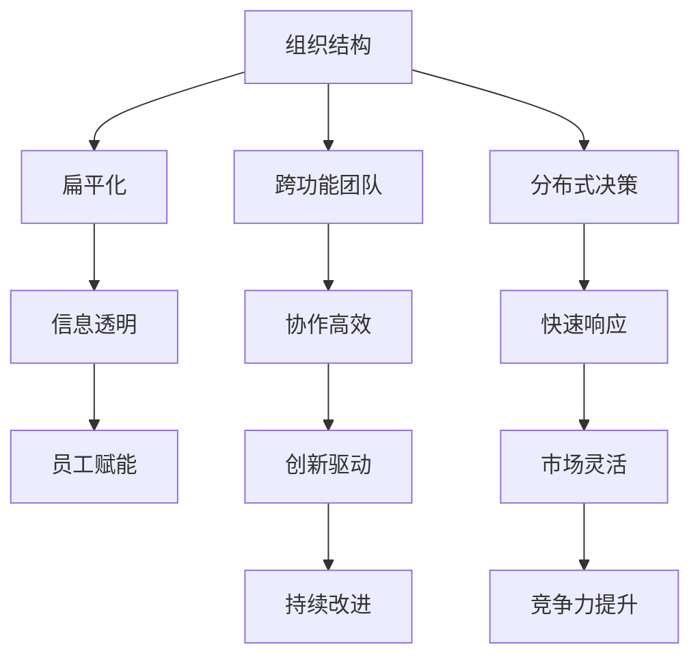

                 

# 管理的艺术：德鲁克的洞见

> 关键词：彼得·德鲁克, 管理哲学, 组织理论, 领导力, 知识工作, 组织变革

## 1. 背景介绍

### 1.1 问题由来
在信息化和全球化的浪潮中，企业面临的竞争压力和不确定性日益增加。如何通过科学的管理手段，提升组织效率和创新能力，已成为企业管理者亟需面对的重要课题。彼得·德鲁克(Peter Drucker)是现代管理学的奠基人之一，他的管理思想深刻影响了世界范围内的企业实践和教育。德鲁克强调“管理是一门艺术”，主张通过系统的管理理论和实践，实现组织和个人的最大化潜能。

在德鲁克看来，管理不仅仅是技术手段的应用，更是一种艺术。他通过对经典案例的深入分析，总结出了一套系统而实用的管理方法论。他的思想不仅帮助企业实现了卓越的经营成果，更引导了组织变革和管理的全球化趋势。

### 1.2 问题核心关键点
德鲁克的管理艺术涵盖了他对组织结构、领导力、知识工作、创新等多个维度的深刻洞见。本文将深入探讨德鲁克的管理哲学和核心概念，从其思想出发，讨论如何应用德鲁克的洞见，提升企业的管理水平和竞争力。

## 2. 核心概念与联系

### 2.1 核心概念概述

为了更好地理解德鲁克的管理艺术，本文将介绍几个关键概念及其相互联系：

- **组织结构**：德鲁克认为，有效的组织结构应当适应企业战略，合理分配决策权和管理责任。他提出了扁平化、跨功能团队等组织形式，以适应快速变化的市场环境。
- **领导力**：德鲁克强调，领导力不仅仅是管理者的职责，更是所有员工需要具备的能力。优秀的领导能够激发员工的潜能，引导团队达成共同目标。
- **知识工作**：德鲁克提出，随着信息时代的到来，知识工作者的比例将大幅增加。如何管理知识工作，提升其生产效率，成为管理的重要课题。
- **创新**：德鲁克认为，创新是企业生存和发展的关键。通过持续的创新，企业能够适应环境变化，保持竞争优势。
- **组织变革**：德鲁克主张，面对环境变化，企业需要持续进行组织变革。通过重组、流程优化等手段，提升组织适应性和灵活性。

这些概念之间有着密切的联系，共同构成了德鲁克管理艺术的核心框架。

### 2.2 核心概念原理和架构的 Mermaid 流程图


这个流程图展示了德鲁克管理艺术中各核心概念的联系：

1. **组织结构**：通过扁平化、跨功能团队等形式，提升信息透明和协作效率。
2. **领导力**：通过分布式决策，赋能员工，激发创新，提升市场灵活性。
3. **知识工作**：通过信息透明和协作高效，促进创新，持续改进。
4. **创新**：通过知识工作和分布式决策，驱动组织变革，提升竞争力。

这些概念相互支撑，共同构建了德鲁克管理艺术的理论基础。

## 3. 核心算法原理 & 具体操作步骤
### 3.1 算法原理概述

德鲁克的管理艺术强调系统性思考和实践，其核心在于通过科学的管理手段，实现组织和个人潜能的最大化。其算法原理主要包括：

- **系统思考**：德鲁克主张，管理者应具备系统思考的能力，从整体出发，协调各个组成部分。
- **目标管理**：通过明确的目标设定和任务分解，引导员工朝着共同的目标努力。
- **反馈机制**：建立有效的反馈机制，及时调整和优化管理决策。
- **持续改进**：德鲁克认为，组织和个人都需要不断学习和改进，以适应不断变化的环境。

这些原理共同构成了德鲁克管理艺术的核心理念。

### 3.2 算法步骤详解

德鲁克的管理艺术，通过一系列具体的操作步骤，实现组织的科学管理。以下是具体步骤：

**Step 1: 目标设定与任务分解**
- 明确组织的目标和战略，通过SMART原则设定具体、可衡量的目标。
- 将大目标分解为可执行的小任务，分配给不同团队和个人。

**Step 2: 扁平化与跨功能团队**
- 构建扁平化的组织结构，缩短决策链，提升信息透明。
- 组建跨功能团队，促进不同部门之间的协作和信息共享。

**Step 3: 分布式决策与领导力培养**
- 将决策权下放到各层级，提高组织的灵活性和响应速度。
- 培养员工的领导能力，使每个人都能成为领导者，激发其潜能。

**Step 4: 知识工作和创新管理**
- 识别和提升知识工作者，通过培训和激励，提升其生产效率。
- 建立创新激励机制，鼓励员工提出新想法，并推动其实现。

**Step 5: 持续改进与组织变革**
- 建立持续改进的反馈机制，及时调整和优化管理决策。
- 根据环境变化，持续进行组织变革，优化流程和结构。

### 3.3 算法优缺点

德鲁克的管理艺术具有以下优点：
1. 系统性：通过整体性的思考和操作，提升组织的协调性和适应性。
2. 实践性：强调操作层面的具体步骤，便于在实际管理中应用。
3. 人本主义：重视员工的发展和激励，提升整体的生产力和幸福感。
4. 持续改进：鼓励组织和个人不断学习和优化，保持竞争优势。

同时，该方法也存在一定的局限性：
1. 复杂度高：系统性思考和实际操作需要较高的管理水平。
2. 实施难度大：涉及组织结构、领导力、知识工作等多方面的改进，需要全方位的努力。
3. 反馈机制设计困难：建立有效的反馈机制需要时间，短期内可能效果不明显。

尽管存在这些局限性，德鲁克的管理艺术仍是大企业管理的重要指导思想，被广泛应用在各种组织和行业中。

### 3.4 算法应用领域

德鲁克的管理艺术适用于各种组织和行业，特别是在企业战略管理、人力资源管理、创新管理等领域发挥了重要作用。以下是一些具体的应用领域：

- **企业战略管理**：通过目标设定和任务分解，确保企业战略的有效实施。
- **人力资源管理**：通过领导力培养和知识工作管理，提升员工的生产力和幸福感。
- **创新管理**：通过创新激励和持续改进，保持企业的创新活力。
- **组织变革**：通过扁平化、跨功能团队等手段，提升组织的灵活性和适应性。

## 4. 数学模型和公式 & 详细讲解 & 举例说明

### 4.1 数学模型构建

德鲁克的管理艺术虽然偏重于实践操作，但其中一些概念和方法，也可以通过数学模型进行分析和计算。以下是一些核心概念的数学模型构建：

- **目标设定**：设定具体、可衡量的目标，可以用SMART原则进行数学建模。
- **反馈机制**：建立反馈机制，可以采用PDCA循环（Plan-Do-Check-Act）进行建模。
- **持续改进**：通过统计过程控制（SPC）等方法，实现持续改进。

### 4.2 公式推导过程

以目标设定为例，用数学模型表示SMART原则：

**S** - **Specific**：目标具体化
- $T_i = t_1, t_2, ..., t_n$
- $T = T_1 \times T_2 \times ... \times T_n$
- 目标 $T$ 需满足 $T < 100$

**M** - **Measurable**：目标可量化
- $O_i = o_1, o_2, ..., o_n$
- $O = O_1 \times O_2 \times ... \times O_n$
- 目标 $O$ 需满足 $O > 50$

**A** - **Attainable**：目标可实现
- $C_i = c_1, c_2, ..., c_n$
- $C = C_1 \times C_2 \times ... \times C_n$
- 目标 $C$ 需满足 $C \leq 1.2$

**R** - **Relevant**：目标相关性
- $R_i = r_1, r_2, ..., r_n$
- $R = R_1 \times R_2 \times ... \times R_n$
- 目标 $R$ 需满足 $R \geq 0.8$

**T** - **Time-bound**：目标有时限
- $T_{\text{start}} = t_{\text{start}}$
- $T_{\text{end}} = t_{\text{end}}$
- 目标时限 $T_{\text{span}} = T_{\text{end}} - T_{\text{start}}$
- 目标时限 $T_{\text{span}} \leq 3$

### 4.3 案例分析与讲解

**案例：某科技公司目标设定**

某科技公司希望提升其产品在市场中的占有率。

- **S**：设定具体的目标，如“在3年内，将市场占有率提升至15%”。
- **M**：将目标分解为具体的指标，如“每年提升5%的市场占有率”。
- **A**：制定可实现的行动计划，如“增加市场推广预算，扩大线上线下渠道”。
- **R**：确保目标与公司战略和市场环境相关，如“符合公司长期发展战略”。
- **T**：设定明确的时间节点，如“每年度末评估目标达成情况”。

通过SMART原则设定目标，该公司能够更加清晰地指导各项工作，提升市场占有率。

## 5. 项目实践：代码实例和详细解释说明

### 5.1 开发环境搭建

要进行德鲁克管理艺术的实践，首先需要搭建好开发环境。以下是一些建议：

1. **环境准备**：选择一个适合的编程语言，如Python或Java。
2. **工具选择**：选择合适的项目管理工具，如JIRA或Trello。
3. **数据准备**：收集和整理企业内部的数据，用于分析和建模。
4. **资源配置**：配置好必要的计算资源，如服务器和数据库。

### 5.2 源代码详细实现

以下是使用Python进行德鲁克管理艺术的实践代码示例：

```python
import pandas as pd
import numpy as np

# 数据准备
data = pd.read_csv('company_data.csv')

# 目标设定
def set_goals(data):
    target = data['market_share'].mean() + (data['market_share'].std() * 0.5)
    return target

# 任务分解
def task_decomposition(target, data):
    tasks = ['target_share', 'marketing_budget', 'channel_expansion']
    return tasks

# 反馈机制
def feedback_mechanism(data, tasks):
    feedback = pd.DataFrame({'task': tasks, 'score': []})
    for task in tasks:
        feedback[task] = data[task].mean()
    return feedback

# 持续改进
def continuous_improvement(feedback):
    improvement = pd.DataFrame({'task': feedback.index, 'target': 0, 'actual': 0})
    for task in feedback.index:
        improvement['target'] += feedback[task].mean()
        improvement['actual'] += feedback[task].mean()
    return improvement

# 运行示例
target = set_goals(data)
tasks = task_decomposition(target, data)
feedback = feedback_mechanism(data, tasks)
improvement = continuous_improvement(feedback)
print(improvement)
```

这段代码演示了如何通过Python进行德鲁克管理艺术的实践操作。具体步骤包括：

1. **数据准备**：从公司数据中提取市场份额和相关任务数据。
2. **目标设定**：计算当前市场份额的目标值。
3. **任务分解**：将目标分解为具体的任务。
4. **反馈机制**：计算每个任务的反馈分数。
5. **持续改进**：计算整体改进情况。

### 5.3 代码解读与分析

这段代码实现了一个简单的德鲁克管理艺术实践流程：

- **数据准备**：使用Pandas库读取公司数据，准备分析所需的数据。
- **目标设定**：通过计算历史市场份额的平均值和标准差，设定市场份额提升的目标值。
- **任务分解**：将目标分解为具体的任务，如市场推广预算和渠道扩展。
- **反馈机制**：计算每个任务当前的目标完成情况，作为反馈。
- **持续改进**：通过持续改进模型，评估整体进展。

## 6. 实际应用场景

### 6.1 科技公司项目管理

某科技公司在进行新产品开发时，使用了德鲁克的目标设定和任务分解方法。

- **S**：设定具体的产品目标，如“在12个月内，推出一款高性能的智能手机”。
- **M**：将目标分解为具体的里程碑，如“3个月内完成硬件设计”、“6个月内完成软件开发”。
- **A**：制定详细的行动计划，如“每周召开项目会议，确保任务按计划推进”。
- **R**：确保目标与公司战略和市场需求相关，如“符合市场需求，提升公司市场占有率”。
- **T**：设定明确的时间节点，如“每个季度末评估项目进展”。

通过德鲁克的管理艺术，该公司能够有效管理项目进度，按时推出新产品，提升市场竞争力。

### 6.2 医疗卫生机构质量管理

某医疗卫生机构希望提升其医疗服务质量。

- **S**：设定具体的质量目标，如“在6个月内，减少病人投诉率至5%”。
- **M**：将目标分解为具体的指标，如“每月病人满意度调查”。
- **A**：制定可实现的行动计划，如“增加医疗服务培训，提升医护人员的服务质量”。
- **R**：确保目标与医疗机构的战略和市场需求相关，如“符合患者需求，提升患者满意度”。
- **T**：设定明确的时间节点，如“每月末评估质量改进情况”。

通过德鲁克的管理艺术，该机构能够有效提升医疗服务质量，提升患者满意度，提升整体运营效率。

### 6.3 金融企业风险管理

某金融企业希望降低其信用风险。

- **S**：设定具体的风险目标，如“在3年内，不良贷款率降至2%”。
- **M**：将目标分解为具体的指标，如“每月不良贷款率”。
- **A**：制定可实现的行动计划，如“加强贷款审批流程，优化风险控制机制”。
- **R**：确保目标与金融机构的战略和市场需求相关，如“符合监管要求，提升客户信任度”。
- **T**：设定明确的时间节点，如“每季度末评估风险改进情况”。

通过德鲁克的管理艺术，该企业能够有效控制信用风险，提升财务健康度，提升市场竞争力。

### 6.4 未来应用展望

随着科技的进步和信息化的发展，德鲁克的管理艺术将得到更广泛的应用和推广。以下是一些未来应用展望：

1. **智能化管理**：结合大数据和人工智能技术，实现更精准的目标设定和任务分解。
2. **跨组织协作**：通过云平台和协作工具，实现不同组织之间的有效沟通和协作。
3. **个性化管理**：根据员工的能力和兴趣，提供个性化的发展路径和激励方案。
4. **全球化管理**：通过标准化的管理流程和工具，实现跨国组织的高效管理。

德鲁克的管理艺术将在全球化、智能化的大背景下，不断演进和创新，助力企业在全球市场竞争中占据优势。

## 7. 工具和资源推荐

### 7.1 学习资源推荐

为了帮助管理者系统掌握德鲁克的管理艺术，这里推荐一些优质的学习资源：

1. **《管理的实践》**：德鲁克最著名的管理学著作，深入浅出地介绍了管理的基本原理和实践方法。
2. **《21世纪的管理挑战》**：德鲁克对21世纪管理环境变化的深度分析，提供了许多前沿的管理思路。
3. **Coursera管理课程**：由多所大学和知名讲师开设的在线管理课程，涵盖德鲁克思想和现代管理实践。
4. **Harvard Business Review**：哈佛商业评论杂志，提供大量关于德鲁克思想和商业实践的最新研究成果。
5. **Bilibili德鲁克频道**：哔哩哔哩平台上的德鲁克课程和讲座，适合视频学习。

通过这些资源的学习，相信管理者能够更好地理解德鲁克的管理艺术，并将其应用到实际管理中。

### 7.2 开发工具推荐

为了更好地实践德鲁克的管理艺术，以下是一些常用的开发工具推荐：

1. **JIRA**：一款优秀的项目管理工具，支持任务分解、进度跟踪、反馈机制等功能。
2. **Trello**：一款简单易用的项目管理工具，适合团队协作和任务管理。
3. **Microsoft Project**：微软的高级项目管理工具，支持复杂的项目规划和资源管理。
4. **Asana**：一款灵活的项目管理工具，支持多种任务和工作流程。
5. **Slack**：一款强大的沟通工具，支持即时消息、文件共享和任务协作。

合理利用这些工具，可以显著提升德鲁克管理艺术的实践效果，帮助管理者高效地管理项目和团队。

### 7.3 相关论文推荐

德鲁克的管理艺术在管理学界具有重要地位，以下是几篇相关的重要论文，推荐阅读：

1. **《管理的新范式》**：德鲁克总结了现代管理的新范式，提出了许多管理前沿思想。
2. **《组织的前途》**：德鲁克探讨了未来组织的发展方向和变革趋势。
3. **《创新与企业家精神》**：德鲁克深入分析了创新在企业中的重要性，提供了创新管理的实践建议。
4. **《目标与绩效》**：德鲁克讨论了目标管理的具体操作和应用案例。
5. **《知识工作者》**：德鲁克对知识工作者的分析和研究，提出了许多管理新思路。

这些论文代表了大管理思想的深度和广度，通过学习这些前沿成果，可以帮助管理者更好地理解德鲁克的管理艺术，并应用于实际管理中。

## 8. 总结：未来发展趋势与挑战

### 8.1 总结

本文对德鲁克的管理艺术进行了全面系统的介绍。首先阐述了德鲁克的管理哲学和核心概念，明确了德鲁克思想对企业管理的深远影响。其次，从其思想出发，探讨了如何应用德鲁克的管理艺术，提升企业的管理水平和竞争力。

通过本文的系统梳理，可以看到，德鲁克的管理艺术强调系统性思考和实践，通过目标设定、任务分解、反馈机制、持续改进等具体步骤，实现组织的科学管理。其系统性和实践性，使得德鲁克的管理艺术在企业界得到了广泛应用，并引领了组织变革和管理的全球化趋势。

### 8.2 未来发展趋势

展望未来，德鲁克的管理艺术将呈现以下几个发展趋势：

1. **智能化管理**：结合大数据和人工智能技术，实现更精准的目标设定和任务分解。
2. **全球化管理**：通过标准化的管理流程和工具，实现跨国组织的高效管理。
3. **跨组织协作**：通过云平台和协作工具，实现不同组织之间的有效沟通和协作。
4. **个性化管理**：根据员工的能力和兴趣，提供个性化的发展路径和激励方案。
5. **可持续发展**：结合环境保护和可持续发展理念，提升企业的社会责任感和公众形象。

以上趋势凸显了德鲁克管理艺术的广阔前景。这些方向的探索发展，必将进一步提升企业的管理水平，推动社会和经济的可持续发展。

### 8.3 面临的挑战

尽管德鲁克的管理艺术已经取得了巨大的成功，但在迈向更加智能化、全球化和可持续发展的过程中，仍面临诸多挑战：

1. **复杂度高**：德鲁克的系统性思考和操作需要较高的管理水平。
2. **实施难度大**：涉及组织结构、领导力、知识工作等多方面的改进，需要全方位的努力。
3. **反馈机制设计困难**：建立有效的反馈机制需要时间，短期内可能效果不明显。
4. **资源消耗大**：德鲁克的管理艺术涉及大量数据和工具，需要较高的资源投入。

尽管存在这些挑战，德鲁克的管理艺术仍是大企业管理的重要指导思想，被广泛应用在各种组织和行业中。

### 8.4 研究展望

面对德鲁克管理艺术所面临的挑战，未来的研究需要在以下几个方面寻求新的突破：

1. **智能化管理**：结合大数据和人工智能技术，实现更精准的目标设定和任务分解。
2. **全球化管理**：通过标准化的管理流程和工具，实现跨国组织的高效管理。
3. **跨组织协作**：通过云平台和协作工具，实现不同组织之间的有效沟通和协作。
4. **个性化管理**：根据员工的能力和兴趣，提供个性化的发展路径和激励方案。
5. **可持续发展**：结合环境保护和可持续发展理念，提升企业的社会责任感和公众形象。

这些研究方向的探索，必将引领德鲁克管理艺术迈向更高的台阶，为构建高效、智能、可持续发展的企业提供更多创新思路。

## 9. 附录：常见问题与解答

**Q1：德鲁克的管理艺术适用于所有企业吗？**

A: 德鲁克的管理艺术适用于各种规模和类型的企业，尤其适合那些需要系统化思考和科学管理的组织。但其具体应用需要根据企业实际情况进行调整，以达到最佳效果。

**Q2：如何理解德鲁克的“目标管理”？**

A: 德鲁克的目标管理强调通过明确的目标设定和任务分解，引导员工朝着共同的目标努力。目标应具备SMART原则（具体、可衡量、可实现、相关、时限），并定期进行评估和调整。通过目标管理，可以提升员工的动力和组织的协调性，实现高效的管理。

**Q3：德鲁克的管理艺术在实施过程中有哪些难点？**

A: 德鲁克的管理艺术在实施过程中可能面临的难点包括：
1. 系统性思考需要较高的管理水平。
2. 数据收集和分析需要投入大量时间和资源。
3. 反馈机制的设计和执行可能较为困难。
4. 目标设定和任务分解需要详细的操作流程。

这些难点需要管理者具备较高的管理能力和实践经验，才能顺利实施德鲁克的管理艺术。

**Q4：如何结合现代技术手段，提升德鲁克的管理艺术？**

A: 结合现代技术手段，可以提升德鲁克的管理艺术的实施效果：
1. 数据驱动：通过大数据和人工智能技术，实现更精准的目标设定和任务分解。
2. 自动化工具：使用项目管理工具和协作工具，提升组织协作效率。
3. 实时监控：利用实时监控和反馈机制，及时调整和优化管理决策。
4. 持续改进：采用持续改进方法，提升组织的适应性和灵活性。

通过这些技术手段，可以更好地实现德鲁克的管理艺术，提升企业的管理水平和竞争力。

**Q5：如何评估德鲁克管理艺术的实施效果？**

A: 评估德鲁克管理艺术的实施效果，可以采用以下方法：
1. 目标评估：通过目标设定的实现情况，评估整体管理效果。
2. 绩效评估：通过员工绩效和组织绩效指标，评估管理改进效果。
3. 反馈收集：通过员工和团队的反馈，及时调整和优化管理决策。
4. 持续改进：通过持续改进模型，不断优化管理流程和工具。

通过这些评估方法，可以全面了解德鲁克管理艺术的实施效果，不断提升企业的管理水平。

---

作者：禅与计算机程序设计艺术 / Zen and the Art of Computer Programming

