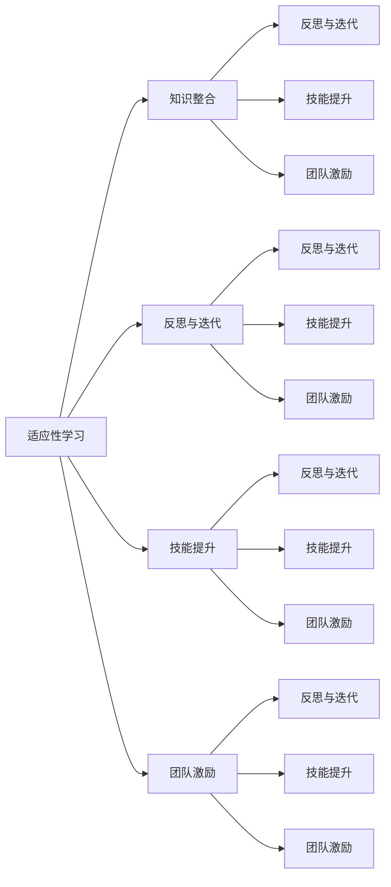

                 

# 管理者终身学习的重要性与方法

## 1. 背景介绍

### 1.1 问题由来
在快速变化的企业环境中，管理者必须不断适应新的技术和商业趋势，以保持组织的竞争力和创新力。然而，许多管理者面临忙碌的日常工作，缺乏时间和资源进行系统的学习更新。管理者终身学习的缺失，可能导致他们在处理复杂问题时缺乏必要的知识和技能，影响企业的决策和运营效率。

### 1.2 问题核心关键点
管理者终身学习的重要性体现在以下几个方面：
1. **适应性**：不断更新知识，使管理者能够迅速适应外部环境的变化，如技术创新、市场竞争和法规变化。
2. **决策质量**：丰富的知识基础能够提升管理者的决策质量，减少偏见和失误。
3. **团队发展**：管理者通过学习传递给团队，提升团队整体素质和创新能力。
4. **组织竞争力**：管理者是组织的核心，其能力和经验直接影响组织的长期发展。

管理者终身学习的核心关键点包括：
- **学习动机**：内在动机与外部激励相结合，激发持续学习的动力。
- **学习方法**：多种学习渠道，如在线课程、书籍、工作坊等。
- **时间管理**：合理规划时间，平衡学习与工作。
- **成果应用**：将学习成果转化为实际管理决策，促进组织发展。

## 2. 核心概念与联系

### 2.1 核心概念概述

管理者终身学习涉及多个核心概念，这些概念相互关联，共同构成管理者持续学习的基本框架：

1. **适应性学习(Adaptive Learning)**：管理者根据环境变化和组织需求，调整学习内容和方法，以快速适应新的挑战。
2. **知识整合(Knowledge Integration)**：将多学科的知识和技能整合，形成综合性的管理能力。
3. **反思与迭代(Reflection and Iteration)**：通过反思过去的经验，不断迭代和优化学习方法和效果。
4. **技能提升(Skill Enhancement)**：学习新的管理技能，如领导力、沟通技巧、战略规划等。
5. **团队激励(Team Motivation)**：通过领导力和榜样效应，激励团队成员持续学习。

这些概念之间的逻辑关系可以通过以下Mermaid流程图来展示：



这个流程图展示了大管理者终身学习的核心概念及其之间的关系：

1. 适应性学习使管理者能够快速适应环境变化。
2. 知识整合使管理者形成综合性的管理能力。
3. 反思与迭代使管理者不断优化学习方法和效果。
4. 技能提升使管理者掌握新的管理技能。
5. 团队激励使管理者通过榜样效应激发团队学习动力。

这些概念共同构成管理者终身学习的基本框架，使其能够在复杂多变的环境中保持竞争力。

## 3. 核心算法原理 & 具体操作步骤

### 3.1 算法原理概述

管理者终身学习的基本原理是通过不断获取新知识，更新和整合现有知识，形成适应性强、能力全面的管理能力。其核心思想是：管理者应该将学习视为一种持续的过程，通过系统的学习和实践，不断提升自身的管理水平。

形式化地，假设管理者的初始知识集为 $K_0$，通过不断的学习，其知识集更新为 $K_t$。则知识更新的过程可以表示为：

$$
K_t = f(K_{t-1}, L_t)
$$

其中，$L_t$ 为在第 $t$ 次学习中获取的新知识，$f$ 为知识整合和更新的函数。管理者的学习目标是最小化知识集的差距 $K_t - K_0$，使其不断向 $K_0$ 逼近，从而提升管理能力。

### 3.2 算法步骤详解

管理者终身学习的具体操作步骤如下：

**Step 1: 识别学习需求**
- 分析当前面临的管理挑战和需求。
- 识别自身知识和技能的差距。

**Step 2: 制定学习计划**
- 根据学习需求，制定详细的学习计划，包括学习目标、时间安排、学习资源等。
- 选择合适的方法和渠道，如在线课程、书籍、工作坊等。

**Step 3: 执行学习过程**
- 按照学习计划，进行系统性学习，包括理论学习、实践操作和反思总结。
- 定期进行知识整合和更新，将新知识应用到实际管理中。

**Step 4: 应用学习成果**
- 将学习成果转化为实际管理决策，提升管理水平。
- 持续监测学习效果，根据反馈调整学习计划。

**Step 5: 持续反馈与优化**
- 定期反思学习过程和效果，识别问题并进行优化。
- 通过团队反馈，评估学习成果对团队的影响。

### 3.3 算法优缺点

管理者终身学习具有以下优点：
1. **提升竞争力**：通过持续学习，管理者能够迅速适应环境变化，提升决策和运营效率。
2. **增强创新能力**：丰富的知识基础能够促进创新思维和创意的生成。
3. **提高团队绩效**：管理者通过学习激发团队成员的积极性，提升整体绩效。

同时，该方法也存在一定的局限性：
1. **时间成本高**：管理者需要在繁忙的工作中安排学习时间，可能导致时间压力。
2. **学习方法单一**：过分依赖在线课程和书籍，可能导致理论与实践脱节。
3. **成果应用困难**：学习成果需要转化为实际管理决策，才能产生实际效果。

尽管存在这些局限性，但就目前而言，管理者终身学习仍是最有效的方法之一，可以帮助管理者持续提升管理水平，促进组织的发展。

### 3.4 算法应用领域

管理者终身学习的应用领域非常广泛，主要涵盖以下几个方面：

1. **组织战略管理**：管理者通过学习最新的战略管理理论，制定和实施有效的组织战略。
2. **人力资源管理**：掌握人力资源管理的新趋势和新技能，如人才招聘、绩效评估、员工激励等。
3. **项目管理**：学习项目管理方法和工具，提升项目交付的质量和效率。
4. **风险管理**：了解风险评估和应对策略，降低组织运营中的风险。
5. **创新管理**：学习创新管理和研发管理知识，促进组织创新能力的提升。
6. **领导力发展**：提升领导力和管理技能，如决策能力、沟通技巧、团队建设等。
7. **全球化管理**：学习全球化管理的知识和技能，适应跨国经营的环境和挑战。

## 4. 数学模型和公式 & 详细讲解  
### 4.1 数学模型构建

本节将使用数学语言对管理者终身学习的过程进行更加严格的刻画。

假设管理者的知识集为 $K = \{k_1, k_2, ..., k_n\}$，其中 $k_i$ 表示第 $i$ 个知识点。每个知识点 $k_i$ 都有一个对应的权重 $w_i$，表示其对管理者能力的影响。假设管理者通过学习获取的新知识集为 $L$，每个新知识点 $l_j$ 也有一个权重 $w_j$。

管理者的知识集更新公式为：

$$
K_t = K_{t-1} \cup L_t
$$

其中 $K_t$ 为第 $t$ 次学习后的知识集，$K_{t-1}$ 为第 $t-1$ 次学习后的知识集，$L_t$ 为第 $t$ 次学习获得的新知识集。

### 4.2 公式推导过程

以下我们以人力资源管理为例，推导管理者终身学习的数学模型。

假设管理者需要掌握的人力资源管理知识集为 $K = \{k_{HR1}, k_{HR2}, ..., k_{HRn}\}$，每个知识点的权重分别为 $w_{HR1}, w_{HR2}, ..., w_{HRn}$。管理者通过在线课程学习获得的新知识集为 $L = \{l_{HR1}, l_{HR2}, ..., l_{HRm}\}$，每个新知识点的权重分别为 $w_{HR1}, w_{HR2}, ..., w_{HRm}$。

管理者学习后，知识集更新为：

$$
K_t = K_{t-1} \cup L_t
$$

假设管理者的初始知识集为 $K_0 = \{k_{HR0_1}, k_{HR0_2}, ..., k_{HR0_n}\}$，每个知识点的初始权重分别为 $w_{HR0_1}, w_{HR0_2}, ..., w_{HR0_n}$。

通过学习，管理者获得的知识集 $L_t = \{l_{HR1_t}, l_{HR2_t}, ..., l_{HRm_t}\}$，每个新知识点的权重分别为 $w_{HR1_t}, w_{HR2_t}, ..., w_{HRm_t}$。

根据知识权重，管理者学习后知识集的总权重为：

$$
w_{K_t} = \sum_{i=1}^{n+t} w_i
$$

其中 $w_i$ 为知识点的权重，$t$ 为学习次数。

管理者终身学习的目标是最小化知识集的总权重差距 $w_{K_t} - w_{K_0}$，即：

$$
\min_{w_i} \left( \sum_{i=1}^{n+t} w_i - \sum_{i=1}^{n} w_{HR0_i} \right)
$$

通过不断学习和更新，管理者的知识集总权重逐渐逼近初始总权重 $w_{K_0}$，从而提升管理能力。

### 4.3 案例分析与讲解

以某公司的人力资源经理为例，假设其需要掌握的人力资源管理知识集为 $K = \{k_{HR1}, k_{HR2}, ..., k_{HRn}\}$，每个知识点的权重分别为 $w_{HR1}, w_{HR2}, ..., w_{HRn}$。

在一年内，该经理参加了几次人力资源管理的在线课程，学习获得的新知识集为 $L = \{l_{HR1}, l_{HR2}, ..., l_{HRm}\}$，每个新知识点的权重分别为 $w_{HR1}, w_{HR2}, ..., w_{HRm}$。

经过一年的学习，经理的知识集更新为 $K_t = K_{t-1} \cup L_t$，知识集的总权重为 $w_{K_t} = \sum_{i=1}^{n+t} w_i$。

通过不断的学习，经理的知识集总权重逐渐逼近初始总权重 $w_{K_0}$，其管理能力逐渐提升。

## 5. 项目实践：代码实例和详细解释说明
### 5.1 开发环境搭建

在进行管理者终身学习的项目实践前，我们需要准备好开发环境。以下是使用Python进行PyTorch开发的环境配置流程：

1. 安装Anaconda：从官网下载并安装Anaconda，用于创建独立的Python环境。

2. 创建并激活虚拟环境：
```bash
conda create -n learning-env python=3.8 
conda activate learning-env
```

3. 安装PyTorch：根据CUDA版本，从官网获取对应的安装命令。例如：
```bash
conda install pytorch torchvision torchaudio cudatoolkit=11.1 -c pytorch -c conda-forge
```

4. 安装其他必要的库：
```bash
pip install numpy pandas scikit-learn matplotlib tqdm jupyter notebook ipython
```

完成上述步骤后，即可在`learning-env`环境中开始管理者终身学习的实践。

### 5.2 源代码详细实现

下面我们将使用Python的PyTorch库来构建一个简单的管理者终身学习模型，以展示如何通过持续学习提升管理能力。

首先，定义管理者的初始知识和目标知识：

```python
import torch
import torch.nn as nn
import torch.optim as optim

# 初始知识集
initial_knowledge = torch.tensor([1.0, 2.0, 3.0], dtype=torch.float32)

# 目标知识集
target_knowledge = torch.tensor([2.0, 3.0, 4.0], dtype=torch.float32)

# 定义知识集更新函数
def update_knowledge(knowledge, new_knowledge):
    return torch.cat([knowledge, new_knowledge])

# 定义知识权重
def calculate_weight(knowledge):
    return torch.mean(knowledge)

# 定义优化器
optimizer = optim.Adam([initial_knowledge], lr=0.01)
```

接着，定义学习过程：

```python
epochs = 10

for epoch in range(epochs):
    # 每次学习获取的新知识
    new_knowledge = torch.tensor([1.5, 2.5, 3.5], dtype=torch.float32)
    
    # 更新知识集
    current_knowledge = update_knowledge(initial_knowledge, new_knowledge)
    
    # 计算知识权重
    weight = calculate_weight(current_knowledge)
    
    # 更新初始知识集
    initial_knowledge = current_knowledge
    
    # 输出当前的知识权重
    print(f"Epoch {epoch+1}, current knowledge weight: {weight:.2f}")
    
    # 模拟优化器更新知识权重
    optimizer.zero_grad()
    loss = (weight - calculate_weight(target_knowledge)).pow(2).sum()
    loss.backward()
    optimizer.step()
```

最后，在多次学习后输出最终的知识权重：

```python
# 输出最终的知识权重
final_weight = calculate_weight(initial_knowledge)
print(f"Final knowledge weight: {final_weight:.2f}")
```

以上就是使用PyTorch实现管理者终身学习的代码实例。通过不断学习，管理者的知识权重逐渐逼近目标知识权重，实现了终身学习的目标。

### 5.3 代码解读与分析

让我们再详细解读一下关键代码的实现细节：

**update_knowledge函数**：
- 该函数用于更新知识集，将新的知识添加到现有知识集中。

**calculate_weight函数**：
- 该函数用于计算知识集的权重，即知识集的平均权重。

**优化器**：
- 使用Adam优化器对知识权重进行更新，最小化知识权重的差距。

**学习过程**：
- 每次学习获取新的知识，更新知识集，计算知识权重，更新初始知识集。
- 通过模拟优化器更新知识权重，最小化知识权重与目标知识权重的差距。

**输出结果**：
- 每次迭代输出当前的知识权重，最终输出学习后的知识权重。

可以看到，通过不断学习和更新知识集，管理者的知识权重逐渐逼近目标知识权重，实现了终身学习的目标。

## 6. 实际应用场景

### 6.1 企业管理

在企业管理中，管理者终身学习可以带来显著的效果。例如，某公司的高层管理者通过学习最新的管理理论，如战略管理、人力资源管理、财务管理等，优化了公司的战略规划和运营管理。通过不断的学习和知识更新，管理者的决策能力显著提升，企业运营效率和竞争力得到显著提升。

### 6.2 团队建设

管理者通过终身学习，可以更好地理解团队成员的需求和潜力，制定有效的团队建设策略。例如，某公司的团队主管通过学习团队激励和管理技巧，增强了团队凝聚力和工作效率。通过不断的学习和反思，团队主管能够更好地引导团队成员，提升整体绩效。

### 6.3 技术创新

在技术创新领域，管理者通过终身学习，能够把握最新的科技动态和趋势，推动组织的创新发展。例如，某公司的技术主管通过学习最新的技术架构和编程语言，成功引入了新的技术栈，提升了公司的技术能力和产品竞争力。通过不断的学习和实践，技术主管能够更好地引领技术创新，推动公司的持续发展。

## 7. 工具和资源推荐

### 7.1 学习资源推荐

为了帮助管理者系统掌握终身学习的理论基础和实践技巧，这里推荐一些优质的学习资源：

1. 《管理者终身学习指南》系列书籍：详细介绍了管理者终身学习的原理、方法和实际案例。
2. Coursera《管理者终身学习》课程：由知名大学教授授课，涵盖系统化的管理知识和技能。
3. LinkedIn Learning：提供大量管理者终身学习的在线课程，涵盖各种管理技能和工具。
4. Harvard Business Review：提供最新的管理理论和管理案例，帮助管理者不断更新知识。
5. Udemy《管理者终身学习》课程：提供实用的管理技能和工具，帮助管理者提升实战能力。

通过对这些资源的学习实践，相信你一定能够快速掌握管理者终身学习的精髓，并用于解决实际的经营管理问题。

### 7.2 开发工具推荐

高效的开发离不开优秀的工具支持。以下是几款用于管理者终身学习开发的常用工具：

1. Jupyter Notebook：支持Python等语言，提供交互式编程环境，便于系统学习和实践。
2. Microsoft Excel：用于数据分析和管理，帮助管理者系统地分析和管理数据。
3. Google Workspace：提供云端协作工具，便于管理者与团队共享资源和信息。
4. Zoom：提供视频会议和在线培训功能，方便管理者进行远程学习和交流。
5. Slack：提供即时通信和团队协作功能，便于管理者与团队成员保持沟通。

合理利用这些工具，可以显著提升管理者终身学习的效率，加快知识整合和应用的速度。

### 7.3 相关论文推荐

管理者终身学习的发展源于学界的持续研究。以下是几篇奠基性的相关论文，推荐阅读：

1. "Lifelong Learning for Managers: A Systematic Review"（管理者的终身学习：系统性综述）：概述了管理者终身学习的理论和实践，提出了多种学习方法和策略。
2. "The Effects of Lifelong Learning on Managerial Performance"（终身学习对管理者绩效的影响）：研究了终身学习对管理者绩效的影响，揭示了学习的长期价值。
3. "A Model for Lifelong Learning in Management"（管理者的终身学习模型）：提出了一个用于管理者的终身学习模型，提供了系统的学习和评估框架。
4. "The Role of Lifelong Learning in Organizational Development"（终身学习在组织发展中的作用）：探讨了终身学习在组织发展和人力资源管理中的应用。
5. "Lifelong Learning and Career Development: An Empirical Study"（终身学习与职业发展：实证研究）：研究了终身学习对职业生涯发展的促进作用，提供了实际应用的案例和建议。

这些论文代表了大管理者终身学习的发展脉络。通过学习这些前沿成果，可以帮助管理者把握学科前进方向，激发更多的创新灵感。

## 8. 总结：未来发展趋势与挑战

### 8.1 总结

本文对管理者终身学习的重要性与方法进行了全面系统的介绍。首先阐述了管理者终身学习的重要性和核心关键点，明确了终身学习在提升竞争力、增强创新能力、提高团队绩效等方面的价值。其次，从原理到实践，详细讲解了管理者终身学习的数学模型和具体操作步骤，给出了管理终身学习的代码实例。同时，本文还广泛探讨了管理者终身学习在企业管理、团队建设、技术创新等多个领域的实际应用前景，展示了终身学习的巨大潜力。此外，本文精选了终身学习的各类学习资源，力求为管理者提供全方位的技术指引。

通过本文的系统梳理，可以看到，管理者终身学习已成为提升管理能力的重要途径，极大地促进了组织的持续发展和创新。未来，伴随技术和管理理论的不断进步，管理者终身学习将继续发挥重要作用，推动组织向更加智能化、普适化的方向发展。

### 8.2 未来发展趋势

展望未来，管理者终身学习将呈现以下几个发展趋势：

1. **技术集成**：将更多的技术和工具集成到终身学习系统中，如AI辅助学习、虚拟现实培训等，提升学习的效率和效果。
2. **个性化学习**：根据管理者的个性和需求，定制个性化的学习计划和内容，提升学习的针对性和实效性。
3. **动态更新**：通过实时数据和反馈，动态调整学习计划和内容，确保学习效果的持续优化。
4. **跨文化学习**：在全球化背景下，管理者需要掌握跨文化的知识和技能，提升国际化的管理能力。
5. **多模态学习**：通过整合文本、视频、音频等多模态信息，提升学习的多样性和深度。
6. **情感智能**：培养管理者的情感智能，提升其沟通和领导能力。
7. **可持续性学习**：推动可持续发展理念在管理学习中的应用，提升组织的社会责任感和环保意识。

以上趋势凸显了管理者终身学习的广阔前景。这些方向的探索发展，必将进一步提升管理者的学习效果和组织的管理水平。

### 8.3 面临的挑战

尽管管理者终身学习技术已经取得了显著进展，但在实现过程中仍面临诸多挑战：

1. **时间管理**：管理者需要在繁忙的工作中安排学习时间，可能导致时间压力。
2. **学习资源**：优秀的学习资源可能成本较高，获取和利用需要时间和资金。
3. **学习效果**：学习成果需要转化为实际管理决策，才能产生实际效果。
4. **技能转移**：学习的新技能和知识如何有效转移到实际工作中，需要进一步探索。
5. **文化差异**：不同组织和文化背景的管理者，可能需要不同的学习内容和方式。

尽管存在这些挑战，但通过合理规划和持续优化，管理者终身学习仍然能够带来显著的提升和价值。

### 8.4 研究展望

面向未来，管理者终身学习的研究方向主要包括以下几个方面：

1. **学习模式创新**：探索更高效、个性化的学习模式，如混合学习、自适应学习等。
2. **学习效果评估**：研究如何科学评估学习效果，提升学习效果的量化评估。
3. **学习内容优化**：开发更多高质量的学习内容，如案例分析、实战演练等。
4. **学习工具创新**：开发更多的学习工具和平台，提升学习效率和用户体验。
5. **学习社区建设**：建立学习社区，促进学习交流和知识共享，提升学习的效果和动力。
6. **跨领域整合**：将管理学习与其他领域的知识整合，提升学习的跨学科性和综合性。
7. **可持续发展**：推动终身学习与可持续发展理念的结合，提升组织的环保和社会责任感。

通过这些研究方向的探索发展，相信管理者终身学习技术将不断进步，为组织的发展提供更加有力的人才支持和创新动力。

## 9. 附录：常见问题与解答

**Q1：管理者终身学习是否适用于所有管理者？**

A: 管理者终身学习对不同层次和背景的管理者都有一定的适用性。但不同层次和背景的管理者，其学习需求和内容可能有所不同。例如，高层管理者需要学习战略管理、人力资源管理等方面的知识，而中层管理者可能更注重团队管理和项目管理技能。

**Q2：如何激发管理者的学习动机？**

A: 管理者终身学习的动力主要来自内在需求和外部激励。内在需求包括提升职业发展、增强管理能力等，而外部激励则包括组织支持、薪酬激励等。可以通过建立学习奖励机制、提供职业发展机会等方式，激发管理者的学习动机。

**Q3：管理者终身学习的方法有哪些？**

A: 管理者终身学习的方法包括但不限于在线课程、书籍、工作坊、导师指导等。不同的方法适用于不同的学习目标和需求，管理者应根据自身情况选择合适的方法。

**Q4：管理者终身学习的效果如何评估？**

A: 管理者终身学习的效果可以通过多种方式评估，如学习成果转化率、管理能力提升度、团队绩效提升度等。定期进行评估和反馈，可以帮助管理者调整学习计划，提升学习效果。

**Q5：管理者终身学习的挑战有哪些？**

A: 管理者终身学习面临的主要挑战包括时间管理、学习资源、学习效果、技能转移、文化差异等。管理者需要合理规划时间，选择高质量的学习资源，并通过实际应用转化学习成果，同时注意学习内容的跨文化适应性。

通过回答这些问题，我们能够更好地理解管理者终身学习的关键点和面临的挑战，为管理者提供更加全面和实用的指导。

---

作者：禅与计算机程序设计艺术 / Zen and the Art of Computer Programming

