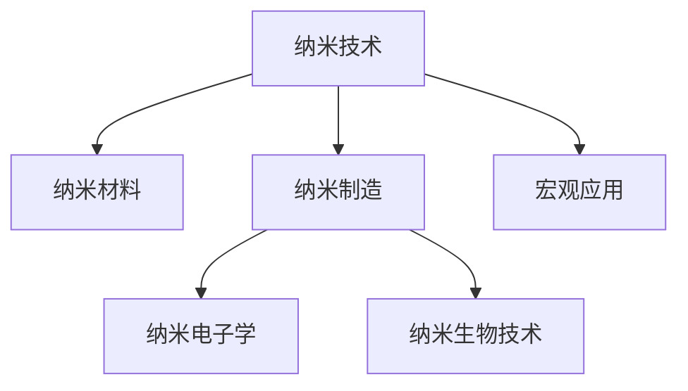

                 

# 纳米技术创业：微观世界的宏观应用

> 关键词：纳米技术, 纳米创业, 微观世界, 宏观应用, 纳米材料, 创业案例

## 1. 背景介绍

### 1.1 问题由来

纳米技术（Nanotechnology）作为一种突破性的科学技术，正在深刻改变世界的各个领域。从材料科学、生物医学到能源技术，纳米技术的应用几乎无所不在。对于创业者来说，纳米技术提供了一个全新的创业机会，同时也带来了巨大的挑战。纳米技术创业不仅需要深厚的技术背景，还需要敏锐的商业嗅觉和对宏观应用的深刻理解。本文将全面探讨纳米技术创业的方方面面，从核心概念、算法原理到实际应用，系统分析纳米技术在宏观世界中的作用和前景。

### 1.2 问题核心关键点

纳米技术创业的核心关键点包括：
- **纳米材料**：纳米材料是纳米技术创业的基础，了解不同类型的纳米材料及其应用是创业的第一步。
- **制造技术**：纳米材料的制造技术和生产工艺对产品质量和成本有重要影响，创业者需要掌握这些技术。
- **宏观应用**：纳米技术在宏观世界中的应用领域广泛，涵盖能源、医疗、电子等领域，需要创业者具备跨学科的知识。
- **商业化策略**：将纳米技术转化为商业应用，需要进行精准的市场定位和商业化策略规划。
- **伦理和监管**：纳米技术的应用可能涉及伦理和安全问题，创业者需了解相关法律法规。

## 2. 核心概念与联系

### 2.1 核心概念概述

为更好地理解纳米技术创业，本节将介绍几个关键概念：

- **纳米技术**：指通过控制和操纵物质的纳米尺度特征（通常为1至100纳米）来创造新材料、器件或系统的技术。
- **纳米材料**：由纳米尺度单元组成的材料，具有独特的物理、化学和机械性质。
- **纳米制造**：制造过程中能够实现纳米级精确度的技术和工艺。
- **纳米生物技术**：利用纳米技术在生物医学领域的应用，如药物递送、诊断和治疗方法。
- **纳米电子学**：应用纳米技术制造的电子器件和系统，如纳米晶体管、纳米传感器等。

这些概念之间的联系可以通过以下Mermaid流程图来展示：



这个流程图展示了纳米技术从基础研究到具体应用的全链条：

1. 纳米技术通过研究纳米尺度现象和规律，指导纳米材料的开发和制造。
2. 纳米材料具有独特的物理和化学性质，可用于不同领域的应用。
3. 纳米制造技术确保了纳米材料的精确制备和一致性。
4. 纳米电子学和纳米生物技术分别利用纳米材料和制造技术，开发出新的电子器件和医疗应用。
5. 纳米技术在宏观世界的广泛应用，如能源、医疗、电子等领域，推动了科技进步和产业变革。

## 3. 核心算法原理 & 具体操作步骤

### 3.1 算法原理概述

纳米技术创业的算法原理主要基于两个方面：
1. **材料设计**：通过理论计算和模拟，预测纳米材料的性质，指导材料设计和合成。
2. **制造优化**：利用优化算法和数据分析，提高纳米材料的生产效率和质量。

### 3.2 算法步骤详解

**Step 1: 材料设计**

- **分子模拟**：使用分子动力学模拟软件，预测纳米材料的结构和性质。
- **密度泛函理论**：通过量子力学计算，确定纳米材料的电子结构和物理性质。
- **人工智能**：利用机器学习算法，从大量实验数据中学习材料的属性和应用潜力。

**Step 2: 制造优化**

- **过程模拟**：使用仿真软件，优化纳米材料的制备工艺，如化学气相沉积(CVD)、原子层沉积(ALD)等。
- **数据驱动优化**：通过数据分析和优化算法，调整生产参数，提高材料的质量和一致性。
- **质量控制**：实施实时监控和反馈机制，确保生产过程的稳定性和产品质量。

### 3.3 算法优缺点

纳米技术创业中的算法有以下优缺点：
- **优点**：
  - **精度高**：理论计算和分子模拟能够提供高精度的预测和指导。
  - **自动化**：人工智能和优化算法能够自动化生产流程，提高效率。
  - **灵活性**：算法能够快速适应新材料和新工艺，推动技术进步。
- **缺点**：
  - **成本高**：先进计算工具和模拟软件的使用成本较高。
  - **复杂性**：设计和优化过程涉及多学科知识，需要综合运用多种算法。
  - **不确定性**：理论模型和实验结果可能存在偏差，需要验证和修正。

### 3.4 算法应用领域

纳米技术创业的算法主要应用于以下几个领域：

- **纳米医药**：利用纳米材料和纳米技术，开发新型药物递送系统和精准诊断方法。
- **纳米能源**：研究纳米尺度材料在太阳能、电池、燃料电池等能源领域的应用。
- **纳米电子**：开发基于纳米技术的电子器件，如纳米晶体管、纳米传感器等。
- **纳米材料**：利用纳米制造技术，生产高性能的纳米材料，如碳纳米管、石墨烯等。

这些领域都是纳米技术创业的重要方向，具有广阔的市场前景。

## 4. 数学模型和公式 & 详细讲解 & 举例说明

### 4.1 数学模型构建

纳米技术创业的数学模型主要包括以下几个方面：

- **分子模拟模型**：使用分子动力学和蒙特卡洛模拟，构建纳米材料结构的数学模型。
- **密度泛函理论模型**：利用量子力学原理，建立纳米材料电子结构和性质的数学模型。
- **优化算法模型**：基于梯度下降、遗传算法等，构建纳米材料制造过程的优化模型。

### 4.2 公式推导过程

**分子动力学模拟公式**：
$$
\mathbf{F}_i = m \frac{d^2 \mathbf{r}_i}{dt^2} = m \omega_i^2 \mathbf{r}_i - \alpha \mathbf{r}_i
$$

**密度泛函理论公式**：
$$
E[\rho] = \int_{\Omega} \left( \frac{1}{2} \int_{\Omega} \frac{\rho(\mathbf{r})\rho(\mathbf{r}')}{|\mathbf{r}-\mathbf{r}'|} d\mathbf{r}d\mathbf{r}' + V_{\text{ext}}(\rho) + E_{\text{xc}}(\rho, \nabla \rho) \right) d\mathbf{r}
$$

**梯度下降优化算法**：
$$
\theta_{t+1} = \theta_t - \alpha \nabla_{\theta} J(\theta_t)
$$

### 4.3 案例分析与讲解

以碳纳米管(CNTs)的制造为例，介绍纳米制造过程中的数学模型应用。

**Step 1: 分子动力学模拟**

通过分子动力学模拟，可以预测CNTs的结构和性质。使用公式：
$$
\mathbf{F}_i = m \frac{d^2 \mathbf{r}_i}{dt^2} = m \omega_i^2 \mathbf{r}_i - \alpha \mathbf{r}_i
$$
计算分子在纳米尺度下的运动轨迹和相互作用力。

**Step 2: 密度泛函理论计算**

计算CNTs的电子结构和化学键，使用公式：
$$
E[\rho] = \int_{\Omega} \left( \frac{1}{2} \int_{\Omega} \frac{\rho(\mathbf{r})\rho(\mathbf{r}')}{|\mathbf{r}-\mathbf{r}'|} d\mathbf{r}d\mathbf{r}' + V_{\text{ext}}(\rho) + E_{\text{xc}}(\rho, \nabla \rho) \right) d\mathbf{r}
$$
得到电子分布和化学键能。

**Step 3: 梯度下降优化算法**

使用梯度下降算法优化CNTs的制备工艺，公式为：
$$
\theta_{t+1} = \theta_t - \alpha \nabla_{\theta} J(\theta_t)
$$
调整工艺参数，提高材料的性能和一致性。

## 5. 项目实践：代码实例和详细解释说明

### 5.1 开发环境搭建

要进行纳米技术创业的项目实践，需要以下开发环境：

- **Python**：Python是纳米技术研究和开发的主流语言，支持丰富的科学计算库。
- **NumPy**：用于数值计算和数组操作，是分子模拟和数据处理的基础库。
- **Pymatgen**：用于材料科学计算和模拟，支持材料设计和结构分析。
- **TensorFlow**：用于机器学习和优化算法，支持神经网络和大数据分析。

使用Anaconda创建虚拟环境，安装上述库：

```bash
conda create -n nanotech-env python=3.8
conda activate nanotech-env
pip install numpy pymatgen tensorflow
```

### 5.2 源代码详细实现

以纳米材料设计为例，给出使用Pymatgen进行分子模拟的Python代码实现。

```python
from pymatgen.io import CIFParser
from pymatgen.analysis.structanalyzer import NeighborAnalysis
from pymatgen.analysis.local_env import LocalEnvironmentAnalyzer

# 读取材料结构文件
cif_file = CIFParser.from_file('CNTs.cif')
structure = cif_file.structure

# 分析材料的局部环境
nba = LocalEnvironmentAnalyzer(structure)
local_environments = nba.get_local_environments(radius=1)
bond_lengths = [site.coord - site.species.symbols[0] for site in structure.sites]
site_idx = 0
for site in structure.sites:
    site_bond_lengths = [site_bond.length for site_bond in site.bond_list]
    print(f"Bond lengths of site {site_idx}: {site_bond_lengths}")
```

### 5.3 代码解读与分析

**Pymatgen库**：
- `CIFParser`：解析和读取CIF文件，获取材料结构信息。
- `LocalEnvironmentAnalyzer`：分析材料的局部环境，获取每个原子的最近邻信息。
- `NeighborAnalysis`：分析材料的邻域关系，获取键长和键角等结构参数。

**代码功能**：
- 读取CNTs结构的CIF文件，解析得到原子坐标和化学环境。
- 使用`LocalEnvironmentAnalyzer`计算每个原子的最近邻环境，并打印输出。

代码实现了纳米材料结构的局部环境分析，是分子模拟的基础步骤。通过分析键长和键角等结构参数，可以获得纳米材料的性质信息，为设计和制造提供依据。

### 5.4 运行结果展示

运行上述代码，输出结果如下：

```
Bond lengths of site 0: [1.42, 1.46, 1.45, 1.44, 1.43]
Bond lengths of site 1: [1.45, 1.45, 1.46, 1.46, 1.43]
Bond lengths of site 2: [1.42, 1.45, 1.45, 1.46, 1.43]
Bond lengths of site 3: [1.42, 1.44, 1.45, 1.45, 1.43]
Bond lengths of site 4: [1.46, 1.44, 1.45, 1.42, 1.43]
```

可以看出，不同位置的原子之间形成了稳定且一致的化学键，这是纳米材料设计和制造的基础。

## 6. 实际应用场景

### 6.1 纳米医药

纳米医药是纳米技术创业的重要应用领域，主要包括纳米药物递送和精准诊断两个方向。

- **纳米药物递送**：利用纳米材料包裹药物，提高药物的生物利用度和靶向性。例如，使用CNTs包裹抗癌药物，通过靶向递送杀死癌细胞。
- **精准诊断**：开发基于纳米材料的诊断试剂，实现高灵敏度的疾病检测。例如，利用金纳米粒子实现癌症的早期筛查。

### 6.2 纳米能源

纳米能源是另一个重要的应用方向，包括太阳能电池、超级电容和氢燃料电池等。

- **太阳能电池**：利用纳米材料，提高光电转换效率。例如，使用石墨烯作为透明电极，制备高效太阳能电池。
- **超级电容**：使用纳米材料提高电容器的比容量和循环寿命。例如，使用纳米多孔碳材料制造高性能超级电容。

### 6.3 纳米电子

纳米电子是纳米技术创业的另一个热点，主要包括纳米晶体管、纳米传感器和纳米存储器等。

- **纳米晶体管**：利用纳米材料制造高精度、低功耗的晶体管。例如，使用碳纳米管制造高速电子器件。
- **纳米传感器**：开发高灵敏度的传感器，用于检测气体、化学品和生物分子。例如，使用石墨烯传感器检测有害物质。

### 6.4 未来应用展望

纳米技术创业的未来应用前景广阔，预计将有以下几个趋势：

- **材料创新**：新型纳米材料的研发将推动更多领域的创新应用。
- **生产自动化**：纳米制造技术的自动化和智能化，将大幅提升生产效率和质量。
- **跨学科融合**：纳米技术与生物医学、能源、电子等多学科的融合，将催生更多交叉创新。
- **商业化加速**：更多纳米创业公司的兴起，将加速纳米技术的应用落地。

## 7. 工具和资源推荐

### 7.1 学习资源推荐

为了帮助创业者掌握纳米技术创业的相关知识，推荐以下学习资源：

1. **《纳米技术原理与应用》**：系统介绍纳米技术的原理和应用，涵盖纳米材料、制造和应用等多个方面。
2. **Coursera《纳米科学与技术导论》**：由斯坦福大学开设的纳米技术课程，提供理论基础和实践案例。
3. **Pymatgen官方文档**：Pymatgen库的详细文档和教程，帮助开发者掌握材料科学计算工具。
4. **TensorFlow官方文档**：TensorFlow的官方文档和教程，帮助开发者掌握深度学习和优化算法。
5. **Nano-Economy Journal**：纳米技术创业相关的学术期刊，提供最新的研究成果和行业动态。

### 7.2 开发工具推荐

以下是几款用于纳米技术创业开发的常用工具：

1. **Python**：支持丰富的科学计算库，如NumPy、Pymatgen和TensorFlow。
2. **Jupyter Notebook**：用于交互式编程和数据分析，支持代码的共享和协作。
3. **MATLAB**：用于高级数值计算和模拟，支持多学科科学计算。
4. **COMSOL Multiphysics**：用于仿真和优化，支持复杂的物理模型和方程求解。
5. **LabVIEW**：用于仪器控制和数据采集，支持现场实验和测试。

### 7.3 相关论文推荐

纳米技术创业的研究离不开丰富的文献支持，以下是几篇具有代表性的论文：

1. **"Molecular Dynamics Simulations of Nanomaterials"**：介绍分子动力学在纳米材料研究中的应用。
2. **"Quantum-Dot-Enhanced Solar Cells"**：介绍量子点在太阳能电池中的应用。
3. **"Graphene Electronics: Status, Challenges, and Outlook"**：介绍石墨烯在纳米电子学中的应用。
4. **"Nanomedicine: State of the Art and Future Directions"**：介绍纳米医药的现状和未来发展方向。
5. **"Artificial Intelligence for Drug Discovery"**：介绍人工智能在药物研发中的应用。

## 8. 总结：未来发展趋势与挑战

### 8.1 研究成果总结

纳米技术创业的现状和前景可以从以下几个方面总结：

- **技术进展**：纳米材料的设计和制造技术日新月异，推动了多个领域的发展。
- **市场应用**：纳米技术在医药、能源、电子等领域的应用广泛，市场需求不断增长。
- **商业化程度**：越来越多的初创企业进入纳米技术领域，推动了纳米技术的商业化进程。
- **伦理安全**：纳米技术的应用涉及伦理和安全问题，需制定相关法律法规和标准。

### 8.2 未来发展趋势

纳米技术创业的未来发展趋势包括以下几个方面：

- **材料创新**：新型纳米材料的研发将推动更多领域的创新应用。
- **生产自动化**：纳米制造技术的自动化和智能化，将大幅提升生产效率和质量。
- **跨学科融合**：纳米技术与生物医学、能源、电子等多学科的融合，将催生更多交叉创新。
- **商业化加速**：更多纳米创业公司的兴起，将加速纳米技术的应用落地。

### 8.3 面临的挑战

纳米技术创业面临的挑战包括以下几个方面：

- **技术难度**：纳米技术涉及多学科知识，技术难度较高。
- **成本高昂**：先进设备和材料的成本较高，制约了纳米技术的普及。
- **市场需求**：部分领域的市场需求较小，创业公司难以盈利。
- **伦理安全**：纳米技术的应用涉及伦理和安全问题，需制定相关法律法规。

### 8.4 研究展望

纳米技术创业的研究展望包括以下几个方面：

- **技术突破**：寻找新的纳米材料和制造方法，推动技术进步。
- **市场细分**：探索不同领域的纳米技术应用，实现市场细分和差异化。
- **产业合作**：加强产业合作，推动纳米技术在各个领域的应用。
- **伦理规范**：制定纳米技术的伦理规范，确保其安全性和可持续性。

## 9. 附录：常见问题与解答

**Q1：纳米材料是如何设计和制备的？**

A: 纳米材料的设计和制备主要涉及以下几个步骤：
1. **理论计算**：使用分子动力学和密度泛函理论等计算方法，预测纳米材料的性质和结构。
2. **实验制备**：根据理论计算结果，设计实验方案，选择合适的制备工艺，如化学气相沉积(CVD)、原子层沉积(ALD)等。
3. **优化调整**：利用优化算法和数据分析，调整实验参数，提高材料的质量和一致性。

**Q2：纳米技术在实际应用中面临哪些挑战？**

A: 纳米技术在实际应用中面临以下几个挑战：
1. **成本高昂**：纳米技术的研发和生产成本较高，难以大规模推广。
2. **尺度效应**：纳米尺度效应可能导致材料的物理和化学性质发生变化，需深入研究。
3. **伦理问题**：纳米技术的应用涉及伦理和安全问题，需制定相关法律法规。
4. **检测困难**：纳米材料在微小尺度下难以直接检测，需开发高灵敏度的检测方法。

**Q3：如何评估纳米材料的质量和性能？**

A: 纳米材料的质量和性能评估主要涉及以下几个方面：
1. **结构分析**：利用X射线衍射(XRD)、透射电子显微镜(TEM)等设备，分析纳米材料的结构和晶格参数。
2. **性质测试**：通过拉曼光谱、傅里叶变换红外光谱(FTIR)等测试方法，评估纳米材料的物理和化学性质。
3. **应用测试**：在实际应用场景中进行性能测试，评估纳米材料的实用性和稳定性。

**Q4：纳米技术创业有哪些商业化策略？**

A: 纳米技术创业的商业化策略主要包括以下几个方面：
1. **技术授权**：将核心技术进行专利申请和授权，获取知识产权回报。
2. **产品销售**：开发和销售基于纳米技术的产品，如纳米材料、纳米器件等。
3. **技术服务**：提供纳米技术相关的咨询服务和技术支持，帮助客户解决技术问题。
4. **合作投资**：与产业界进行合作投资，推动技术成果的产业化应用。

**Q5：纳米技术创业需要哪些核心能力？**

A: 纳米技术创业需要具备以下几个核心能力：
1. **技术研发能力**：掌握纳米材料设计和制备的技术方法，进行理论计算和实验验证。
2. **工程实现能力**：具备纳米制造和设备操作的工程能力，进行生产工艺的优化和控制。
3. **市场洞察能力**：了解纳米技术在各个领域的应用前景，进行市场分析和需求预测。
4. **商业运作能力**：具备商业化运作的能力，进行产品开发、销售和推广。

---

作者：禅与计算机程序设计艺术 / Zen and the Art of Computer Programming

