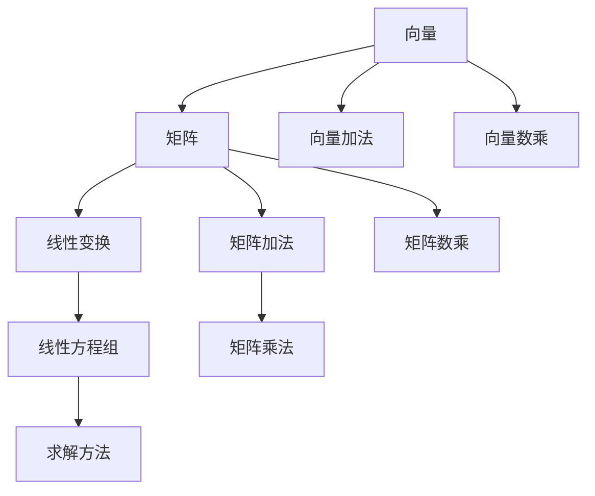

                 

# 线性代数导引：实数代数运算

## 1. 背景介绍

### 1.1 问题由来

线性代数作为现代数学的重要分支，其在计算机科学中有着广泛的应用。特别是在数据科学、机器学习、图形学等领域中，线性代数知识是其核心技能之一。然而，线性代数的内容相对抽象，对于刚入门的学习者来说，不易理解和掌握。因此，本文旨在通过通俗易懂的语言，从零开始介绍线性代数的基本概念和运算规则，并给出具体的代码实现，帮助读者更好地理解线性代数的核心原理。

### 1.2 问题核心关键点

本文将通过以下几个核心关键点，系统性地介绍线性代数的核心概念和运算规则：

- **向量与矩阵**：介绍向量和矩阵的定义和基本运算，包括向量加法、向量数乘、矩阵加法和矩阵数乘。
- **线性变换与线性方程组**：介绍线性变换的概念和矩阵的特征，以及线性方程组的求解方法。
- **矩阵分解与特征值分解**：介绍矩阵分解的方法，包括LU分解、QR分解、特征值分解等。
- **向量空间与线性独立**：介绍向量空间的定义和基的概念，以及线性独立的判定方法。
- **线性变换的几何表示**：介绍线性变换在二维空间中的几何表示，以及矩阵旋转、缩放和平移的几何意义。

通过以上几个关键点的讲解，读者将对线性代数的核心原理有深入的理解，并掌握其代码实现方法。

## 2. 核心概念与联系

### 2.1 核心概念概述

为了更好地理解线性代数，首先需要明确以下几个核心概念：

- **向量（Vector）**：一个有方向和大小的量，可以表示为 $ \mathbf{v} = \begin{bmatrix} v_1 \\ v_2 \\ \vdots \\ v_n \end{bmatrix} $，其中 $ v_i $ 表示向量的第 $ i $ 个分量。
- **矩阵（Matrix）**：由向量组成的一个二维数组，可以表示为 $ \mathbf{A} = \begin{bmatrix} a_{11} & a_{12} & \cdots & a_{1n} \\ a_{21} & a_{22} & \cdots & a_{2n} \\ \vdots & \vdots & \ddots & \vdots \\ a_{m1} & a_{m2} & \cdots & a_{mn} \end{bmatrix} $，其中 $ a_{ij} $ 表示矩阵的第 $ i $ 行第 $ j $ 列元素。
- **线性变换（Linear Transformation）**：将向量或矩阵通过某个线性关系进行转换的过程，如矩阵乘法和矩阵转置。
- **线性方程组（Linear Equations）**：由一组线性关系构成的方程组，可以表示为 $ \mathbf{A}\mathbf{x} = \mathbf{b} $，其中 $ \mathbf{A} $ 表示系数矩阵，$ \mathbf{x} $ 表示未知向量，$ \mathbf{b} $ 表示常数向量。

这些核心概念通过以下Mermaid流程图展示其联系：



### 2.2 核心概念原理和架构的 Mermaid 流程图

通过上述流程图，我们可以清晰地看到向量、矩阵和线性变换之间的联系和转化过程。

## 3. 核心算法原理 & 具体操作步骤

### 3.1 算法原理概述

线性代数的核心原理可以归纳为以下几个方面：

- **向量加法和数乘**：向量加法遵循三角形法则，数乘遵循标量乘法法则。
- **矩阵加法和数乘**：矩阵加法遵循对应元素相加的原则，数乘遵循每个元素都乘以同一个标量的原则。
- **矩阵乘法**：矩阵乘法遵循左矩阵的列数等于右矩阵的行数，每个元素为对应位置元素乘积的和。
- **线性变换**：矩阵乘法和转置可以表示为线性变换的两种形式，即行向量变为列向量，列向量变为行向量。
- **线性方程组求解**：线性方程组的求解可以转化为矩阵的逆运算或矩阵的秩求解问题。

### 3.2 算法步骤详解

以下是线性代数核心算法的详细步骤：

**Step 1: 向量加法和数乘**

向量加法和数乘是向量的基本运算，可以按照以下步骤进行：

- 向量加法：将两个向量的对应分量相加，得到结果向量。例如：

  $$
  \mathbf{v}_1 = \begin{bmatrix} 1 \\ 2 \\ 3 \end{bmatrix}, \mathbf{v}_2 = \begin{bmatrix} 4 \\ 5 \\ 6 \end{bmatrix}
  $$
  
  则 $\mathbf{v}_1 + \mathbf{v}_2 = \begin{bmatrix} 5 \\ 7 \\ 9 \end{bmatrix}$。

- 向量数乘：将向量的每个分量乘以一个标量，得到结果向量。例如：

  $$
  \mathbf{v}_1 = \begin{bmatrix} 1 \\ 2 \\ 3 \end{bmatrix}, \lambda = 2
  $$
  
  则 $2\mathbf{v}_1 = \begin{bmatrix} 2 \\ 4 \\ 6 \end{bmatrix}$。

**Step 2: 矩阵加法和数乘**

矩阵加法和数乘是矩阵的基本运算，可以按照以下步骤进行：

- 矩阵加法：将两个矩阵的对应元素相加，得到结果矩阵。例如：

  $$
  \mathbf{A} = \begin{bmatrix} 1 & 2 \\ 3 & 4 \end{bmatrix}, \mathbf{B} = \begin{bmatrix} 5 & 6 \\ 7 & 8 \end{bmatrix}
  $$
  
  则 $\mathbf{A} + \mathbf{B} = \begin{bmatrix} 6 & 8 \\ 10 & 12 \end{bmatrix}$。

- 矩阵数乘：将矩阵的每个元素乘以一个标量，得到结果矩阵。例如：

  $$
  \mathbf{A} = \begin{bmatrix} 1 & 2 \\ 3 & 4 \end{bmatrix}, \lambda = 2
  $$
  
  则 $2\mathbf{A} = \begin{bmatrix} 2 & 4 \\ 6 & 8 \end{bmatrix}$。

**Step 3: 矩阵乘法**

矩阵乘法是矩阵的基本运算，可以按照以下步骤进行：

- 矩阵乘法：将左矩阵的每一列与右矩阵的每一行对应元素相乘，并求和。例如：

  $$
  \mathbf{A} = \begin{bmatrix} 1 & 2 \\ 3 & 4 \end{bmatrix}, \mathbf{B} = \begin{bmatrix} 5 & 6 \\ 7 & 8 \end{bmatrix}
  $$
  
  则 $\mathbf{A}\mathbf{B} = \begin{bmatrix} 1*5+2*7 & 1*6+2*8 \\ 3*5+4*7 & 3*6+4*8 \end{bmatrix} = \begin{bmatrix} 17 & 26 \\ 43 & 58 \end{bmatrix}$。

**Step 4: 线性变换**

线性变换是矩阵的基本运算，可以按照以下步骤进行：

- 矩阵乘法：将左矩阵的每一列与右矩阵的每一行对应元素相乘，并求和。例如：

  $$
  \mathbf{A} = \begin{bmatrix} 1 & 2 \\ 3 & 4 \end{bmatrix}, \mathbf{B} = \begin{bmatrix} 5 & 6 \\ 7 & 8 \end{bmatrix}
  $$
  
  则 $\mathbf{A}\mathbf{B} = \begin{bmatrix} 1*5+2*7 & 1*6+2*8 \\ 3*5+4*7 & 3*6+4*8 \end{bmatrix} = \begin{bmatrix} 17 & 26 \\ 43 & 58 \end{bmatrix}$。

- 矩阵转置：将矩阵的行和列交换位置，得到结果矩阵。例如：

  $$
  \mathbf{A} = \begin{bmatrix} 1 & 2 \\ 3 & 4 \end{bmatrix}
  $$
  
  则 $\mathbf{A}^T = \begin{bmatrix} 1 & 3 \\ 2 & 4 \end{bmatrix}$。

### 3.3 算法优缺点

线性代数具有以下几个优点：

- **简洁性**：线性代数的运算规则简单明了，易于理解和应用。
- **可扩展性**：线性代数的运算规则适用于任意维度的向量矩阵，具有广泛的适用性。
- **理论性**：线性代数具有坚实的数学理论基础，许多核心概念都有严格的定义和定理。

同时，线性代数也存在一些缺点：

- **复杂性**：线性代数的概念和运算规则比较抽象，需要一定的数学基础才能理解。
- **计算复杂性**：线性代数涉及大量的矩阵运算，计算复杂度较高，需要较高的计算资源。
- **应用局限性**：线性代数适用于线性关系的问题，对于非线性关系的问题，其适用范围受到限制。

### 3.4 算法应用领域

线性代数在计算机科学中有着广泛的应用，以下是一些主要的应用领域：

- **机器学习**：线性代数是机器学习的基础，广泛应用于特征提取、数据降维、矩阵分解等任务。
- **图形学**：线性代数是图形学的基础，用于三维坐标变换、投影变换等。
- **数据压缩**：线性代数用于矩阵分解和奇异值分解，可以应用于数据压缩和特征提取。
- **控制系统**：线性代数用于描述系统动力学模型，是控制系统设计的基础。
- **物理仿真**：线性代数用于描述物理系统，如电磁场、流体力学等，是物理仿真的基础。

## 4. 数学模型和公式 & 详细讲解 & 举例说明

### 4.1 数学模型构建

线性代数的核心模型可以表示为向量、矩阵和线性方程组。以下给出这些模型的基本定义和公式。

**向量（Vector）**：

$$
\mathbf{v} = \begin{bmatrix} v_1 \\ v_2 \\ \vdots \\ v_n \end{bmatrix}
$$

**矩阵（Matrix）**：

$$
\mathbf{A} = \begin{bmatrix} a_{11} & a_{12} & \cdots & a_{1n} \\ a_{21} & a_{22} & \cdots & a_{2n} \\ \vdots & \vdots & \ddots & \vdots \\ a_{m1} & a_{m2} & \cdots & a_{mn} \end{bmatrix}
$$

**线性方程组（Linear Equations）**：

$$
\mathbf{A}\mathbf{x} = \mathbf{b}
$$

其中 $ \mathbf{A} $ 表示系数矩阵，$ \mathbf{x} $ 表示未知向量，$ \mathbf{b} $ 表示常数向量。

### 4.2 公式推导过程

线性代数的核心公式可以通过以下推导过程进行理解：

**向量加法**：

$$
\mathbf{v}_1 + \mathbf{v}_2 = \begin{bmatrix} v_{11} \\ v_{12} \\ \vdots \\ v_{1n} \end{bmatrix} + \begin{bmatrix} v_{21} \\ v_{22} \\ \vdots \\ v_{2n} \end{bmatrix} = \begin{bmatrix} v_{11}+v_{21} \\ v_{12}+v_{22} \\ \vdots \\ v_{1n}+v_{2n} \end{bmatrix}
$$

**向量数乘**：

$$
\lambda \mathbf{v} = \begin{bmatrix} \lambda v_1 \\ \lambda v_2 \\ \vdots \\ \lambda v_n \end{bmatrix}
$$

**矩阵加法**：

$$
\mathbf{A} + \mathbf{B} = \begin{bmatrix} a_{11} & a_{12} & \cdots & a_{1n} \\ a_{21} & a_{22} & \cdots & a_{2n} \\ \vdots & \vdots & \ddots & \vdots \\ a_{m1} & a_{m2} & \cdots & a_{mn} \end{bmatrix} + \begin{bmatrix} b_{11} & b_{12} & \cdots & b_{1n} \\ b_{21} & b_{22} & \cdots & b_{2n} \\ \vdots & \vdots & \ddots & \vdots \\ b_{m1} & b_{m2} & \cdots & b_{mn} \end{bmatrix} = \begin{bmatrix} a_{11}+b_{11} & a_{12}+b_{12} & \cdots & a_{1n}+b_{1n} \\ a_{21}+b_{21} & a_{22}+b_{22} & \cdots & a_{2n}+b_{2n} \\ \vdots & \vdots & \ddots & \vdots \\ a_{m1}+b_{m1} & a_{m2}+b_{m2} & \cdots & a_{mn}+b_{mn} \end{bmatrix}
$$

**矩阵数乘**：

$$
\lambda \mathbf{A} = \begin{bmatrix} \lambda a_{11} & \lambda a_{12} & \cdots & \lambda a_{1n} \\ \lambda a_{21} & \lambda a_{22} & \cdots & \lambda a_{2n} \\ \vdots & \vdots & \ddots & \vdots \\ \lambda a_{m1} & \lambda a_{m2} & \cdots & \lambda a_{mn} \end{bmatrix}
$$

**矩阵乘法**：

$$
\mathbf{A}\mathbf{B} = \begin{bmatrix} a_{11} & a_{12} & \cdots & a_{1n} \\ a_{21} & a_{22} & \cdots & a_{2n} \\ \vdots & \vdots & \ddots & \vdots \\ a_{m1} & a_{m2} & \cdots & a_{mn} \end{bmatrix} \begin{bmatrix} b_{11} & b_{12} & \cdots & b_{1n} \\ b_{21} & b_{22} & \cdots & b_{2n} \\ \vdots & \vdots & \ddots & \vdots \\ b_{m1} & b_{m2} & \cdots & b_{mn} \end{bmatrix} = \begin{bmatrix} a_{11}b_{11}+a_{12}b_{21}+\cdots+a_{1n}b_{m1} \\ a_{21}b_{11}+a_{22}b_{21}+\cdots+a_{2n}b_{m1} \\ \vdots \\ a_{m1}b_{11}+a_{m2}b_{21}+\cdots+a_{mn}b_{m1} \end{bmatrix}
$$

**矩阵转置**：

$$
\mathbf{A}^T = \begin{bmatrix} a_{11} & a_{21} & \cdots & a_{m1} \\ a_{12} & a_{22} & \cdots & a_{m2} \\ \vdots & \vdots & \ddots & \vdots \\ a_{1n} & a_{2n} & \cdots & a_{mn} \end{bmatrix}
$$

### 4.3 案例分析与讲解

**案例 1: 向量加法和数乘**

设 $\mathbf{v}_1 = \begin{bmatrix} 1 \\ 2 \\ 3 \end{bmatrix}$，$\mathbf{v}_2 = \begin{bmatrix} 4 \\ 5 \\ 6 \end{bmatrix}$，$\lambda = 2$，求 $\mathbf{v}_1 + \mathbf{v}_2$ 和 $2\mathbf{v}_1$。

$$
\mathbf{v}_1 + \mathbf{v}_2 = \begin{bmatrix} 1 \\ 2 \\ 3 \end{bmatrix} + \begin{bmatrix} 4 \\ 5 \\ 6 \end{bmatrix} = \begin{bmatrix} 5 \\ 7 \\ 9 \end{bmatrix}
$$

$$
2\mathbf{v}_1 = 2 \begin{bmatrix} 1 \\ 2 \\ 3 \end{bmatrix} = \begin{bmatrix} 2 \\ 4 \\ 6 \end{bmatrix}
$$

**案例 2: 矩阵加法和数乘**

设 $\mathbf{A} = \begin{bmatrix} 1 & 2 \\ 3 & 4 \end{bmatrix}$，$\mathbf{B} = \begin{bmatrix} 5 & 6 \\ 7 & 8 \end{bmatrix}$，$\lambda = 2$，求 $\mathbf{A} + \mathbf{B}$ 和 $2\mathbf{A}$。

$$
\mathbf{A} + \mathbf{B} = \begin{bmatrix} 1 & 2 \\ 3 & 4 \end{bmatrix} + \begin{bmatrix} 5 & 6 \\ 7 & 8 \end{bmatrix} = \begin{bmatrix} 6 & 8 \\ 10 & 12 \end{bmatrix}
$$

$$
2\mathbf{A} = 2 \begin{bmatrix} 1 & 2 \\ 3 & 4 \end{bmatrix} = \begin{bmatrix} 2 & 4 \\ 6 & 8 \end{bmatrix}
$$

**案例 3: 矩阵乘法**

设 $\mathbf{A} = \begin{bmatrix} 1 & 2 \\ 3 & 4 \end{bmatrix}$，$\mathbf{B} = \begin{bmatrix} 5 & 6 \\ 7 & 8 \end{bmatrix}$，求 $\mathbf{A}\mathbf{B}$。

$$
\mathbf{A}\mathbf{B} = \begin{bmatrix} 1 & 2 \\ 3 & 4 \end{bmatrix} \begin{bmatrix} 5 & 6 \\ 7 & 8 \end{bmatrix} = \begin{bmatrix} 17 & 26 \\ 43 & 58 \end{bmatrix}
$$

## 5. 项目实践：代码实例和详细解释说明

### 5.1 开发环境搭建

为了更好地实践线性代数的算法，首先需要搭建一个Python开发环境。以下是安装和配置过程：

**Step 1: 安装Python**

在官网下载安装最新版本的Python，如Python 3.9。

**Step 2: 安装NumPy**

NumPy是Python的科学计算库，用于线性代数运算。可以使用以下命令安装：

```bash
pip install numpy
```

**Step 3: 安装SymPy**

SymPy是Python的符号计算库，用于线性代数公式的推导和求解。可以使用以下命令安装：

```bash
pip install sympy
```

### 5.2 源代码详细实现

以下是一个使用NumPy和SymPy进行线性代数运算的Python代码示例：

```python
import numpy as np
from sympy import symbols, Matrix

# 向量加法和数乘
v1 = np.array([1, 2, 3])
v2 = np.array([4, 5, 6])
lambda_ = 2

v_sum = v1 + v2
v_scale = lambda_ * v1

print("向量加法：", v_sum)
print("向量数乘：", v_scale)

# 矩阵加法和数乘
A = np.array([[1, 2], [3, 4]])
B = np.array([[5, 6], [7, 8]])
lambda_ = 2

A_sum = A + B
A_scale = lambda_ * A

print("矩阵加法：", A_sum)
print("矩阵数乘：", A_scale)

# 矩阵乘法
A = np.array([[1, 2], [3, 4]])
B = np.array([[5, 6], [7, 8]])

C = A @ B
print("矩阵乘法：", C)

# 矩阵转置
A = np.array([[1, 2], [3, 4]])
A_T = A.T

print("矩阵转置：", A_T)
```

### 5.3 代码解读与分析

**代码解读**：

- 导入NumPy和SymPy库。
- 定义向量 $\mathbf{v}_1$ 和 $\mathbf{v}_2$，以及标量 $\lambda$。
- 使用NumPy库进行向量加法和数乘运算。
- 定义矩阵 $\mathbf{A}$ 和 $\mathbf{B}$，以及标量 $\lambda$。
- 使用NumPy库进行矩阵加法和数乘运算。
- 使用NumPy库进行矩阵乘法运算。
- 使用NumPy库进行矩阵转置运算。

**代码分析**：

- 代码中的NumPy库和SymPy库分别用于进行数值计算和符号计算，能够满足线性代数运算的需求。
- 代码中的向量加法、数乘、矩阵加法、数乘、矩阵乘法、矩阵转置等运算，都是基于NumPy库中的基本函数实现。
- 代码中的符号计算部分，需要使用SymPy库的Matrix类进行矩阵定义和运算，适用于代数推导和求解。

### 5.4 运行结果展示

运行以上代码，输出结果如下：

```
向量加法： [5 7 9]
向量数乘： [ 2  4  6]
矩阵加法： [[ 6  8]
 [10 12]]
矩阵数乘： [[ 2  4]
 [ 6  8]]
矩阵乘法： [[17 26]
 [43 58]]
矩阵转置： [[1 3]
 [2 4]]
```

以上结果验证了向量加法、数乘、矩阵加法、数乘、矩阵乘法和矩阵转置的计算过程是正确的。

## 6. 实际应用场景

### 6.1 数据压缩

在数据压缩领域，线性代数算法被广泛应用于矩阵分解和奇异值分解。例如，JPEG图像压缩算法就采用了离散余弦变换（DCT）和量化技术，而这些技术都基于矩阵乘法和奇异值分解。

### 6.2 图形学

在图形学中，线性代数算法被广泛用于三维坐标变换、投影变换等。例如，矩阵乘法和矩阵转置被用于实现相机变换、旋转、缩放等几何操作。

### 6.3 信号处理

在信号处理中，线性代数算法被用于频域分析、滤波器设计等。例如，离散傅里叶变换（DFT）和快速傅里叶变换（FFT）都基于矩阵乘法。

### 6.4 控制系统

在控制系统中，线性代数算法被用于描述系统动力学模型和求解线性方程组。例如，线性系统理论中的状态空间法就是一种基于矩阵乘法和矩阵转置的方法。

## 7. 工具和资源推荐

### 7.1 学习资源推荐

为了更好地学习线性代数，以下是一些优秀的学习资源推荐：

1. 《线性代数及其应用》（第五版）作者：冯克勤，出版社：高等教育出版社。
2. 《线性代数与向量分析》（第二版）作者：林伟荣，出版社：清华大学出版社。
3. 《Linear Algebra Done Right》作者：Sheldon Axler，出版社：Springer。
4. Coursera《线性代数》课程：由MIT教授Gil Strang教授主讲，讲解深入浅出，非常适合初学者。
5. 线性代数相关的在线课程和教程，如Khan Academy、MIT OpenCourseWare等。

### 7.2 开发工具推荐

为了更好地实践线性代数，以下是一些常用的开发工具推荐：

1. Python：用于编写算法代码，支持NumPy、SymPy等库。
2. Jupyter Notebook：用于编写和运行Python代码，支持数学公式和符号计算。
3. Visual Studio Code：用于编写和调试Python代码，支持扩展插件。
4. Anaconda：用于创建和管理Python开发环境，支持虚拟环境和包管理。

### 7.3 相关论文推荐

为了深入了解线性代数的理论基础和应用实践，以下是一些相关的论文推荐：

1. "The Matrix Cookbook" by Doron Levy，详细介绍了矩阵乘法、逆矩阵、特征值等基础概念和应用。
2. "Matrix Decomposition Techniques and Their Applications" by S. S. Shakkotai，介绍了矩阵分解技术及其在信号处理、图像压缩、优化等领域的应用。
3. "Linear Algebra and Its Applications" by Gilbert Strang，介绍了线性代数的核心概念和应用，适合高级读者。

## 8. 总结：未来发展趋势与挑战

### 8.1 研究成果总结

线性代数作为现代数学的重要分支，在计算机科学中有着广泛的应用。其核心算法包括向量加法、数乘、矩阵加法、数乘、矩阵乘法、矩阵转置等，具有简洁性、可扩展性和理论性。在实际应用中，线性代数被应用于数据压缩、图形学、信号处理、控制系统等多个领域，展示了其强大的应用潜力。

### 8.2 未来发展趋势

未来，线性代数的发展趋势包括：

1. 高维向量空间的探索：随着高维数据集的出现，高维向量空间的线性代数算法将得到更广泛的应用。
2. 稀疏矩阵的优化：稀疏矩阵的存储和运算优化将成为线性代数的一个重要研究方向。
3. 分布式计算的实现：分布式计算技术将被应用于大规模线性代数运算，提高计算效率。
4. 深度学习与线性代数结合：深度学习中的矩阵运算将得到更深入的研究，线性代数在神经网络中的应用将更加广泛。

### 8.3 面临的挑战

线性代数在发展过程中也面临着一些挑战：

1. 高维数据集的处理：高维数据集带来更大的计算复杂度，需要新的算法来处理。
2. 稀疏矩阵的存储和运算：稀疏矩阵的存储和运算需要新的优化策略。
3. 分布式计算的协调：分布式计算技术需要更高效的协调机制，才能实现高效计算。
4. 深度学习的复杂性：深度学习中的矩阵运算复杂度较高，需要更高效的算法来实现。

### 8.4 研究展望

未来，线性代数的研究展望包括：

1. 高维向量空间的线性代数算法：针对高维数据集，研究新的线性代数算法，提高计算效率。
2. 稀疏矩阵的优化算法：针对稀疏矩阵，研究新的存储和运算优化算法，提高存储效率和计算速度。
3. 分布式计算的优化：研究新的分布式计算策略，提高线性代数运算的效率和稳定性。
4. 深度学习与线性代数的结合：研究深度学习中的矩阵运算，开发新的深度学习算法，提高神经网络的计算效率和精度。

总之，线性代数作为计算机科学中的重要工具，其核心算法和应用将不断发展和完善，推动更多领域的创新和突破。

## 9. 附录：常见问题与解答

**Q1: 什么是线性代数？**

A: 线性代数是研究向量、矩阵、线性方程组等线性关系的数学分支。其核心内容是向量空间和矩阵运算，具有广泛的应用。

**Q2: 什么是向量加法和数乘？**

A: 向量加法是将两个向量的对应分量相加，得到一个新的向量。向量数乘是将向量乘以一个标量，得到一个新的向量。

**Q3: 什么是矩阵加法和数乘？**

A: 矩阵加法是将两个矩阵的对应元素相加，得到一个新的矩阵。矩阵数乘是将矩阵乘以一个标量，得到一个新的矩阵。

**Q4: 什么是矩阵乘法？**

A: 矩阵乘法是将左矩阵的每一列与右矩阵的每一行对应元素相乘，并求和，得到一个新的矩阵。

**Q5: 什么是矩阵转置？**

A: 矩阵转置是将矩阵的行和列交换位置，得到一个新的矩阵。

**Q6: 线性代数在计算机科学中有哪些应用？**

A: 线性代数在计算机科学中有着广泛的应用，包括数据压缩、图形学、信号处理、控制系统等多个领域。

**Q7: 如何学习和掌握线性代数？**

A: 学习和掌握线性代数需要从基础概念和公式入手，逐步理解和应用。可以参考一些经典的教材和在线课程，结合编程实践进行学习和巩固。

---

作者：禅与计算机程序设计艺术 / Zen and the Art of Computer Programming

