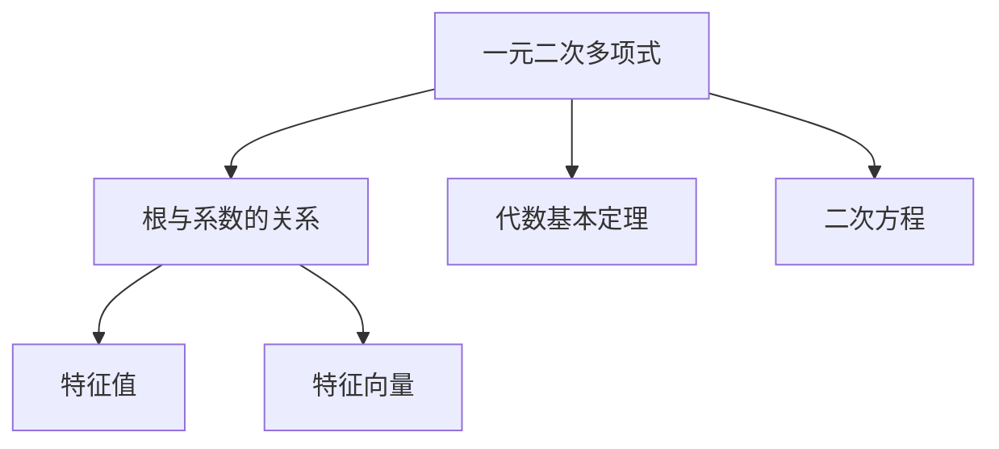

                 

# 线性代数导引：根与系数的关系

> 关键词：线性代数, 根与系数, 特征值, 特征向量, 二次方程, 代数基本定理

## 1. 背景介绍

### 1.1 问题由来
在线性代数中，根与系数的关系是多项式理论的一个基本问题。它是从一元多项式的定义和性质入手，探究多项式的根与系数之间的内在联系，进而推广到多元多项式、矩阵、线性变换等领域。了解和掌握这些关系，对于深入理解线性代数中的各种概念和算法具有重要意义。

### 1.2 问题核心关键点
根与系数的关系主要涉及以下几个核心概念：
- **一元二次多项式**：形式为 \( ax^2 + bx + c \) 的多项式，其中 \( a \neq 0 \)。
- **根与系数的关系**：多项式的根 \( \alpha, \beta \) 与其系数 \( a, b, c \) 满足 \( \alpha + \beta = -\frac{b}{a} \) 和 \( \alpha\beta = \frac{c}{a} \)。
- **代数基本定理**：任意一个 \( n \) 次多项式方程，其根的数量恰好为 \( n \) 个，包括重根。

理解这些核心概念及其内在联系，有助于我们更好地掌握线性代数的基础知识，并灵活运用相关知识解决实际问题。

## 2. 核心概念与联系

### 2.1 核心概念概述

为更好地理解根与系数的关系，本节将介绍几个密切相关的核心概念：

- **一元二次多项式**：一般形式为 \( ax^2 + bx + c \)，其中 \( a \neq 0 \)。二次多项式的根 \( \alpha \) 和 \( \beta \) 满足公式 \( \alpha + \beta = -\frac{b}{a} \) 和 \( \alpha\beta = \frac{c}{a} \)。

- **代数基本定理**：该定理指出，一个 \( n \) 次多项式方程 \( p(x) = 0 \)（其中 \( n \) 个复数根）具有 \( n \) 个根（包括重根）。该定理是多项式理论的基石，也是理解更高维多项式的根的出发点。

- **特征值与特征向量**：在矩阵论中，一个矩阵 \( A \) 的特征值 \( \lambda \) 和对应的特征向量 \( v \) 满足 \( Av = \lambda v \)。特征值和特征向量是矩阵分析中的核心概念，具有广泛的应用场景。

- **二次方程的根与系数关系**：这是根与系数关系在二次方程中的应用，展示了多项式根与系数之间的简单而重要的联系。

这些核心概念之间的逻辑关系可以通过以下Mermaid流程图来展示：



这个流程图展示了一元二次多项式的核心概念及其之间的关系：

1. 一元二次多项式通过根与系数的关系，将根 \( \alpha, \beta \) 与系数 \( a, b, c \) 联系起来。
2. 代数基本定理提供了一元多项式方程根的存在性和个数。
3. 特征值与特征向量是矩阵分析中的重要概念，与多项式的根和系数有着天然的联系。
4. 二次方程是多项式理论中最基本的形式，其根与系数的关系展示了多项式理论的基本结构。

这些概念共同构成了多项式理论的基础，并在后续的线性代数和矩阵论中有着广泛的应用。

## 3. 核心算法原理 & 具体操作步骤
### 3.1 算法原理概述

根与系数的关系主要涉及以下几个关键点：

- **一元二次多项式的根与系数关系**：形式为 \( ax^2 + bx + c \) 的二次多项式，其根 \( \alpha, \beta \) 满足 \( \alpha + \beta = -\frac{b}{a} \) 和 \( \alpha\beta = \frac{c}{a} \)。

- **代数基本定理的应用**：该定理指出，一个 \( n \) 次多项式方程具有 \( n \) 个根，包括重根。这为理解多项式的根与系数关系提供了理论基础。

### 3.2 算法步骤详解

以下是根与系数关系的具体操作步骤：

1. **定义多项式**：给定一元二次多项式 \( p(x) = ax^2 + bx + c \)，其中 \( a, b, c \) 为系数。

2. **求根**：使用求根公式 \( \alpha = \frac{-b \pm \sqrt{b^2 - 4ac}}{2a} \) 或配方法求解根 \( \alpha \) 和 \( \beta \)。

3. **验证根与系数关系**：验证根 \( \alpha \) 和 \( \beta \) 是否满足 \( \alpha + \beta = -\frac{b}{a} \) 和 \( \alpha\beta = \frac{c}{a} \)。

4. **推广至多元多项式**：将一元二次多项式的根与系数关系推广至多元多项式，理解多项式方程的根与系数之间的联系。

5. **矩阵与特征值的应用**：通过矩阵的特征值和特征向量，理解多项式方程根的几何意义。

### 3.3 算法优缺点

根与系数关系具有以下优点：

- **简单直观**：通过公式直接计算多项式的根，理解根与系数之间的关系。
- **理论基础**：基于代数基本定理，具有坚实的数学基础。
- **广泛应用**：在多项式理论、矩阵分析、代数方程求解等领域有广泛应用。

同时，该方法也存在一定的局限性：

- **精度限制**：对于复杂的多项式，根的求解可能存在数值误差。
- **多根处理**：无法直接处理多项式的重根或多根。
- **代数复杂度**：对于高次多项式，根的求解和验证变得复杂。

尽管存在这些局限性，但根与系数关系作为线性代数的基础知识，仍具有不可替代的重要地位。

### 3.4 算法应用领域

根与系数关系在多个领域中都有重要应用，主要包括：

- **数学与物理**：在求解代数方程、理解物理系统的稳定性等方面，根与系数关系提供了重要的数学工具。
- **计算机科学**：在算法设计、复杂度分析、随机化算法等领域，根与系数关系是重要的理论基础。
- **工程与技术**：在控制工程、信号处理、图像处理等领域，根与系数关系有助于分析和优化系统性能。

这些应用领域展示了根与系数关系的重要性和广泛性，凸显了其在现代科学技术中的重要地位。

## 4. 数学模型和公式 & 详细讲解 & 举例说明

### 4.1 数学模型构建

一元二次多项式的根与系数关系可以形式化为：

\[ p(x) = ax^2 + bx + c \]

其中 \( a, b, c \) 为系数，\( \alpha, \beta \) 为根。

### 4.2 公式推导过程

根据一元二次多项式的定义，根 \( \alpha, \beta \) 满足：

\[ \alpha + \beta = -\frac{b}{a} \]
\[ \alpha\beta = \frac{c}{a} \]

这两个关系可以直接从多项式的展开式中推导出来。例如，对 \( p(x) = (x - \alpha)(x - \beta) \) 展开：

\[ p(x) = x^2 - (\alpha + \beta)x + \alpha\beta \]

对比 \( ax^2 + bx + c \)，即可得到根与系数的关系。

### 4.3 案例分析与讲解

**案例一：求多项式的根**

给定 \( p(x) = 2x^2 + 3x + 1 \)，求根 \( \alpha, \beta \)。

根据公式 \( \alpha + \beta = -\frac{b}{a} \) 和 \( \alpha\beta = \frac{c}{a} \)，有：

\[ \alpha + \beta = -\frac{3}{2} \]
\[ \alpha\beta = \frac{1}{2} \]

使用求根公式 \( \alpha = \frac{-b \pm \sqrt{b^2 - 4ac}}{2a} \) 求解：

\[ \alpha = \frac{-3 \pm \sqrt{9 - 8}}{4} = \frac{-3 \pm 1}{4} \]

因此 \( \alpha = -1 \) 和 \( \beta = -\frac{1}{2} \)。

**案例二：验证根与系数关系**

对于 \( p(x) = 2x^2 - 3x + 1 \)，求根 \( \alpha, \beta \) 并验证根与系数关系。

使用求根公式：

\[ \alpha = \frac{3 \pm \sqrt{9 - 8}}{4} = \frac{3 \pm 1}{4} \]

因此 \( \alpha = 1 \) 和 \( \beta = \frac{1}{2} \)。

验证根与系数关系：

\[ \alpha + \beta = 1 + \frac{1}{2} = \frac{3}{2} \]
\[ \alpha\beta = 1 \times \frac{1}{2} = \frac{1}{2} \]

可见 \( \alpha + \beta = -\frac{b}{a} \) 和 \( \alpha\beta = \frac{c}{a} \) 成立，验证通过。

## 5. 项目实践：代码实例和详细解释说明

### 5.1 开发环境搭建

在进行根与系数关系的代码实践前，我们需要准备好开发环境。以下是使用Python进行SymPy实践的环境配置流程：

1. 安装Anaconda：从官网下载并安装Anaconda，用于创建独立的Python环境。

2. 创建并激活虚拟环境：
```bash
conda create -n sympy-env python=3.8 
conda activate sympy-env
```

3. 安装SymPy：
```bash
conda install sympy
```

4. 安装各类工具包：
```bash
pip install numpy pandas scikit-learn matplotlib tqdm jupyter notebook ipython
```

完成上述步骤后，即可在`sympy-env`环境中开始代码实践。

### 5.2 源代码详细实现

以下是使用SymPy库对一元二次多项式进行根与系数关系验证的Python代码实现：

```python
import sympy as sp

# 定义符号变量
x = sp.symbols('x')
a, b, c = sp.symbols('a b c')

# 定义多项式
p = a*x**2 + b*x + c

# 求解多项式的根
alpha, beta = sp.solve(p, x)

# 计算根的和与积
sum_roots = alpha + beta
product_roots = alpha * beta

# 验证根与系数的关系
assert sum_roots == -b/a
assert product_roots == c/a

# 输出验证结果
print("Roots and coefficients relation verified.")
```

在这个代码中，我们首先定义了多项式 \( p(x) = ax^2 + bx + c \) 的系数和符号变量。然后使用SymPy的`solve`函数求解多项式的根，并计算根的和与积。最后，通过断言验证根与系数的关系是否满足 \( \alpha + \beta = -\frac{b}{a} \) 和 \( \alpha\beta = \frac{c}{a} \)。

### 5.3 代码解读与分析

让我们再详细解读一下关键代码的实现细节：

**定义符号变量**：
- 使用`sp.symbols`定义变量 \( x, a, b, c \)，确保变量可以进行符号运算。

**定义多项式**：
- 使用`a*x**2 + b*x + c`定义多项式，并将系数 \( a, b, c \) 和符号变量 \( x \) 结合，形成多项式表达式。

**求解多项式的根**：
- 使用`sp.solve`求解多项式的根，返回根的列表，对应 \( \alpha \) 和 \( \beta \)。

**计算根的和与积**：
- 直接使用列表中两个根的加法和乘法，得到 \( \alpha + \beta \) 和 \( \alpha\beta \)。

**验证根与系数的关系**：
- 通过断言验证根与系数的关系是否满足条件，确保结果的正确性。

**输出验证结果**：
- 打印验证通过的信息，确保代码运行正常。

可以看到，SymPy库的使用大大简化了根与系数关系的代码实现。开发者可以更加专注于数学模型的设计和验证，而不必过多关注底层的实现细节。

## 6. 实际应用场景

### 6.1 数学教学

在数学教学中，根与系数关系是多项式理论的重要内容。通过实际案例和代码实践，学生可以更加直观地理解根与系数之间的联系，提高学习效率和兴趣。

### 6.2 物理系统分析

在物理系统中，多项式的根与系数关系用于分析系统的稳定性、共振频率等关键参数。例如，弹簧振子的固有频率 \( \omega \) 可以通过求解多项式的根来得到。

### 6.3 数据科学

在数据科学中，多项式的根与系数关系用于分析和建模非线性关系。例如，多元回归问题中的多项式拟合，可以通过根与系数关系来求解最优系数。

### 6.4 未来应用展望

随着科学技术的发展，根与系数关系的应用将不断扩展。未来，我们可以预见其在更多领域中的应用，如：

- **工程与制造**：用于设计和优化复杂系统，如控制系统、信号处理等。
- **生物信息学**：用于分析基因表达、蛋白质结构等生物数据，揭示生物系统的内在规律。
- **金融分析**：用于预测股票价格、风险评估等金融问题，提供决策支持。

根与系数关系作为线性代数的基础知识，其应用前景广阔，值得深入探索和研究。

## 7. 工具和资源推荐

### 7.1 学习资源推荐

为了帮助开发者系统掌握根与系数的关系及其应用，这里推荐一些优质的学习资源：

1. **线性代数与微积分在线课程**：提供线性代数基础知识和多项式理论的详细讲解，适合初学者和进阶学习者。

2. **SymPy官方文档**：SymPy库的官方文档，提供了丰富的函数和工具，以及大量的使用示例，是学习SymPy的必备资料。

3. **NumPy数值计算手册**：NumPy库的官方文档，提供了大量数值计算和线性代数操作的教程和示例，适合编程实践。

4. **Python科学计算教程**：涵盖Python编程语言中常用的科学计算库和工具，适合进阶学习和开发实践。

通过这些资源的学习实践，相信你一定能够系统掌握根与系数关系及其应用，并用于解决实际的数学问题。

### 7.2 开发工具推荐

高效的开发离不开优秀的工具支持。以下是几款用于根与系数关系开发的常用工具：

1. **SymPy**：Python中的符号计算库，支持多项式求解、符号计算等数学操作，是实现根与系数关系的必备工具。

2. **NumPy**：Python中的数值计算库，提供了高效的数组和矩阵计算功能，支持线性代数和多项式计算。

3. **SciPy**：Python中的科学计算库，提供了丰富的数学函数和算法，适合进行更复杂的数学运算和优化。

4. **Jupyter Notebook**：Python中的交互式计算环境，支持代码、数学公式和可视化展示，适合进行代码实践和教学。

5. **Matplotlib**：Python中的数据可视化库，支持绘制各种图形和图表，适合展示数学结果和可视化分析。

合理利用这些工具，可以显著提升根与系数关系的开发效率，加快创新迭代的步伐。

### 7.3 相关论文推荐

根与系数关系的研究历史悠久，涉及多个领域。以下是几篇奠基性的相关论文，推荐阅读：

1. **代数基本定理**：Hilbert的证明，奠定了多项式理论和代数学的基础。

2. **特征值与特征向量的应用**：矩阵论中特征值和特征向量的经典应用，展示了线性代数与多项式理论的联系。

3. **多项式的根与系数关系**：Walker的详细推导，展示了多项式理论的核心思想和应用方法。

4. **SymPy的符号计算**：SymPy库的开发者手册，介绍了SymPy的使用方法和内部实现。

这些论文代表了大语言模型微调技术的发展脉络。通过学习这些前沿成果，可以帮助研究者把握学科前进方向，激发更多的创新灵感。

## 8. 总结：未来发展趋势与挑战

### 8.1 总结

本文对根与系数的关系进行了全面系统的介绍。首先阐述了根与系数关系的背景和意义，明确了根与系数关系在多项式理论中的重要地位。其次，从原理到实践，详细讲解了根与系数关系的数学原理和操作步骤，给出了代码实践的完整示例。同时，本文还探讨了根与系数关系在多个实际场景中的应用，展示了其在广泛领域中的重要性和应用前景。

通过本文的系统梳理，可以看到，根与系数关系作为线性代数的基础知识，其应用广泛，影响深远。它在数学教学、工程分析、数据科学等领域具有重要价值，值得深入学习和掌握。

### 8.2 未来发展趋势

展望未来，根与系数关系的发展趋势主要体现在以下几个方面：

1. **与计算机科学的结合**：随着计算机科学的发展，根与系数关系将与算法、编程语言等更多领域相结合，形成新的计算工具和方法。

2. **在数据科学中的应用**：数据科学领域对非线性关系分析和建模的需求日益增长，根与系数关系将在数据处理和模型建立中发挥重要作用。

3. **多维多项式研究**：高维多项式的根与系数关系研究将进一步深入，揭示更多复杂系统背后的数学规律。

4. **符号计算的发展**：符号计算技术将进一步发展，支持更高维、更复杂的多项式运算和求解。

这些趋势展示了根与系数关系在未来的广阔应用前景，值得研究者持续关注和探索。

### 8.3 面临的挑战

尽管根与系数关系具有广泛的应用，但在其研究和应用中仍面临一些挑战：

1. **计算复杂度**：对于高维、高阶的多项式，求解根和验证根与系数关系变得非常复杂。

2. **数值误差**：对于数值计算，可能存在精度不足和计算误差，影响结果的可靠性。

3. **算法效率**：如何设计高效的算法，在保证精度的情况下，快速求解多项式根和验证关系，是当前研究的重要课题。

4. **多根处理**：对于含有重根的多项式，现有的求解和验证方法难以处理。

5. **多领域应用**：如何将根与系数关系推广至其他领域，如生物信息学、金融分析等，是未来研究的重要方向。

尽管存在这些挑战，但研究者们正不断探索和解决这些问题，推动根与系数关系向更广泛的应用领域拓展。

### 8.4 研究展望

面对根与系数关系的研究挑战，未来的研究需要在以下几个方面寻求新的突破：

1. **高效算法设计**：开发新的高效算法，提高多项式根的求解和验证速度，降低计算复杂度。

2. **多根处理**：研究新的方法处理含有重根的多项式，使其在实际应用中更具有普适性。

3. **数值稳定化**：研究数值稳定化的算法，提高计算精度和可靠性。

4. **跨领域应用**：将根与系数关系推广至其他领域，拓展其在更多应用场景中的作用。

5. **符号计算的进一步发展**：进一步提高符号计算的效率和精度，支持更高维、更复杂的多项式运算和求解。

这些研究方向将推动根与系数关系向更深层次发展，为更多的科学技术领域提供数学支持。

## 9. 附录：常见问题与解答

**Q1：根与系数关系适用于所有多项式吗？**

A: 根与系数关系主要适用于一元二次多项式，对于更高次的多项式，需要使用其他方法和工具。但对于某些特殊形式的多项式，如一元三次方程、二元二次方程等，根与系数关系仍然具有重要的应用价值。

**Q2：如何求解含有重根的多项式？**

A: 对于含有重根的多项式，需要先判断重根的类型和个数，再使用适当的求解方法。如使用配方法、Vieta定理等方法，可以处理含有重根的多项式。

**Q3：如何处理数值计算中的误差？**

A: 在数值计算中，可以使用数值稳定化的算法，如Householder方法、QR分解等，提高计算精度和稳定性。此外，合理选择计算精度和算法参数，也是减少数值误差的重要手段。

**Q4：如何应用根与系数关系进行实际问题求解？**

A: 在实际问题求解中，需要先构建数学模型，将其转化为多项式方程。然后，使用求解根与系数关系的方法，计算多项式的根，并根据问题的性质进行分析和决策。

**Q5：根与系数关系在多元多项式中的应用前景如何？**

A: 多元多项式的根与系数关系研究相对复杂，但其在多项式理论、数论、组合数学等领域具有重要应用。未来，随着计算技术的进步，多元多项式的根与系数关系有望得到更多应用。

通过这些问题的回答，我们可以看到根与系数关系在实际应用中的重要性和复杂性。只有深入理解其数学原理和算法方法，才能在实际问题中灵活应用，发挥其数学工具的作用。

