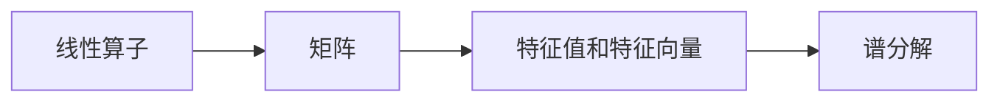

                 

# 线性代数导引：线性算子

> 关键词：线性算子,线性代数,矩阵,特征值,特征向量,谱分解

## 1. 背景介绍

线性代数是计算机科学和工程中不可或缺的工具，尤其在机器学习和数据科学中具有重要地位。本博客将深入探讨线性算子的原理与应用，帮助读者理解其背后的数学基础和在实际问题中的应用场景。

线性算子是一类特殊的线性映射，通常表示为矩阵形式。它们在量子力学、偏微分方程、计算机图形学等领域都有广泛应用。本博文将详细介绍线性算子的基本概念、性质和应用，并通过数学模型和代码实例，深入讲解线性算子的计算方法。

## 2. 核心概念与联系

### 2.1 核心概念概述

- **线性算子**：数学中，线性算子是一种线性映射，可以将向量空间中的向量映射到另一个向量空间。线性算子通常用矩阵表示，作用于向量时遵循加法和数乘的线性性质。

- **矩阵**：在二维空间中，线性算子可以表示为矩阵。矩阵是一组按行或列排列的数值，是线性代数的基本元素。

- **特征值和特征向量**：线性算子的特征值是其作用于某向量后得到的标量结果。特征向量是线性算子作用后保持不变的向量。

- **谱分解**：线性算子可以通过一系列特征向量和特征值表示，即谱分解。谱分解是线性代数中重要的数学工具，广泛用于分解矩阵和求解偏微分方程。

这些概念之间存在着紧密的联系。矩阵作为线性算子的形式表示，特征值和特征向量描述了算子对向量的作用，谱分解则提供了一种基于特征值和特征向量的分解方式。

### 2.2 核心概念原理和架构的 Mermaid 流程图



## 3. 核心算法原理 & 具体操作步骤

### 3.1 算法原理概述

线性算子是线性代数中的一个重要概念，广泛应用于物理、工程和计算机科学中。其主要作用是描述线性系统中的变换关系。在线性算子中，谱分解和特征值问题是最基础的两个重要问题。

线性算子的基本形式可以用矩阵表示。设$A$为一个$m \times n$的矩阵，其线性算子表示为：

$$
\mathcal{A} : \mathbb{R}^n \rightarrow \mathbb{R}^m, \quad x \mapsto A x
$$

其中$x$为输入向量，$A x$为输出向量。

特征值和特征向量用于描述线性算子对输入向量的作用。设$\lambda$为特征值，$v$为对应的特征向量，则特征值问题可以表示为：

$$
A v = \lambda v
$$

特征向量$v$和特征值$\lambda$满足上述方程，$v$非零。

谱分解是线性算子的一种表示方式，表示为：

$$
A = V \Sigma V^T
$$

其中$V$为特征向量矩阵，$\Sigma$为特征值对角矩阵。

### 3.2 算法步骤详解

线性算子及其相关问题求解的主要步骤如下：

1. **特征值和特征向量求解**：使用奇异值分解(SVD)或QR分解求解特征值和特征向量，可以通过MATLAB、Python等工具实现。

2. **谱分解计算**：根据特征值和特征向量计算谱分解，使用MATLAB的`eig`函数或Python的`numpy.linalg.eig`函数求解。

3. **矩阵分解与重构**：根据特征向量矩阵和特征值对角矩阵重构矩阵，使用Python的`numpy.dot`函数实现。

### 3.3 算法优缺点

线性算子的优点包括：

- 可表示为矩阵形式，便于数学建模和计算。
- 特征值和特征向量可以用于简化问题，降低复杂度。
- 谱分解提供了一种基于特征值和特征向量的分解方式，广泛应用于求解偏微分方程和优化问题。

其缺点包括：

- 矩阵的维度和规模会影响计算复杂度，高维矩阵的计算成本较高。
- 特征值和特征向量的求解可能面临数值不稳定问题。
- 谱分解对于大规模数据集的计算，效率较低。

### 3.4 算法应用领域

线性算子在多个领域都有广泛应用，例如：

- **物理和工程**：在线性系统分析中，如质量-弹簧系统、电场和磁场等。
- **计算机图形学**：在三维图形变换、渲染中，线性算子用于旋转、缩放和投影等操作。
- **机器学习和数据科学**：在线性回归、主成分分析(PCA)、奇异值分解(SVD)中，线性算子提供了一种求解方式。

## 4. 数学模型和公式 & 详细讲解 & 举例说明

### 4.1 数学模型构建

线性算子可以表示为矩阵$A$，其特征值问题可以表示为：

$$
A v = \lambda v
$$

特征向量矩阵$V$和特征值对角矩阵$\Sigma$可以表示为：

$$
A = V \Sigma V^T
$$

其中$V$为特征向量矩阵，$\Sigma$为特征值对角矩阵。

### 4.2 公式推导过程

设$A$为一个$3 \times 3$的矩阵，$v$为一个$3 \times 1$的向量，$\lambda$为特征值。根据特征值问题的定义，有：

$$
A v = \lambda v
$$

求解特征值的步骤如下：

1. 计算$A - \lambda I$，其中$I$为单位矩阵。
2. 计算$A - \lambda I$的特征向量，即求解方程$(A - \lambda I)x = 0$。
3. 根据求解结果得到特征值$\lambda$。

特征向量的求解可以使用QR分解或SVD。对于$A$的谱分解，首先计算$A$的特征值和特征向量，然后构造特征向量矩阵$V$和特征值对角矩阵$\Sigma$。

### 4.3 案例分析与讲解

以$3 \times 3$的矩阵$A$为例：

$$
A = \begin{pmatrix} 2 & 3 & 1 \\ 1 & -1 & 2 \\ 3 & 2 & 1 \end{pmatrix}
$$

求解$A$的特征值和特征向量：

1. 计算$A - \lambda I$。
2. 求解$(A - \lambda I)x = 0$，得到特征向量。
3. 根据求解结果得到特征值。

将求解结果代入谱分解公式，即可得到$A$的谱分解形式。

## 5. 项目实践：代码实例和详细解释说明

### 5.1 开发环境搭建

本节将介绍使用Python和SciPy库进行线性算子相关计算的环境搭建。

1. 安装Python：下载并安装Python 3.8。
2. 安装SciPy：使用pip安装SciPy库，命令为`pip install scipy`。

### 5.2 源代码详细实现

以下是一个使用Python和SciPy库求解特征值和谱分解的示例代码：

```python
import numpy as np
from scipy.linalg import eigh

# 定义矩阵A
A = np.array([[2, 3, 1], [1, -1, 2], [3, 2, 1]])

# 求解特征值和特征向量
eigenvalues, eigenvectors = eigh(A)

# 构造特征向量矩阵V和特征值对角矩阵Sigma
V = np.array(eigenvectors)
Sigma = np.diag(eigenvalues)

# 计算谱分解形式
A_eig = np.dot(V, np.dot(Sigma, V.T))
```

### 5.3 代码解读与分析

上述代码实现了线性算子$A$的特征值和特征向量的求解，并使用谱分解形式重构矩阵。

- 使用SciPy库的`eigh`函数求解特征值和特征向量。
- 根据求解结果构造特征向量矩阵$V$和特征值对角矩阵$\Sigma$。
- 使用`numpy.dot`函数计算谱分解形式$A_eig$。

## 6. 实际应用场景

### 6.1 物理学中的线性算子

在线性物理学中，线性算子用于描述系统的线性变换。例如，在量子力学中，薛定谔方程中的哈密顿算子$H$即为线性算子：

$$
H = \frac{p^2}{2m} + V(x)
$$

其中$p$为动量算子，$V(x)$为势能函数。

### 6.2 机器学习中的特征提取

在线性回归和主成分分析(PCA)中，线性算子用于提取特征。通过求解特征值和特征向量，可以从高维数据中提取低维特征，降低数据复杂度。

### 6.3 计算机图形学中的变换

在线性图形学中，线性算子用于描述图形的变换。例如，旋转、缩放和投影等操作可以通过矩阵表示。

## 7. 工具和资源推荐

### 7.1 学习资源推荐

- 《线性代数及其应用》（Gilbert Strang）：全面介绍线性代数的基本概念和应用，是学习线性算子的重要参考资料。
- 《计算机视觉中的线性代数》（Richard Szeliski）：详细讲解线性代数在计算机视觉中的应用，适合计算机图形学的读者。
- 《机器学习实战》（Peter Harrington）：介绍线性回归和主成分分析中线性算子的应用，适合机器学习的读者。

### 7.2 开发工具推荐

- Python：强大的编程语言，支持SciPy、NumPy等库，适合线性算子的计算和建模。
- MATLAB：数学软件，支持矩阵计算和线性代数问题求解，适合进行复杂计算。

### 7.3 相关论文推荐

- “Spectral Theorem and its Applications”（Richard Courant, Kai Osserman）：介绍谱定理及其应用，是线性算子的重要理论基础。
- “Linear Algebra and Its Applications”（Sheldon Axler）：全面介绍线性代数的基本概念和应用，适合线性算子的学习。

## 8. 总结：未来发展趋势与挑战

### 8.1 研究成果总结

线性算子作为线性代数的重要工具，在物理学、机器学习、计算机图形学等领域有广泛应用。线性算子的特征值和特征向量问题，以及谱分解，是求解线性代数问题的关键步骤。

### 8.2 未来发展趋势

未来线性算子将向高效、准确、智能化的方向发展。计算方法将更加高效，算法复杂度更低；线性算子的应用将更加广泛，涵盖更多学科领域。

### 8.3 面临的挑战

线性算子在实际应用中，仍面临数值不稳定、计算复杂度高、求解困难等问题。未来的研究需要针对这些问题，提出新的高效算法和优化方法。

### 8.4 研究展望

未来研究将更加关注线性算子在复杂系统和多模态数据中的应用。同时，探索线性算子与深度学习等前沿技术的结合，将有望带来新的突破。

## 9. 附录：常见问题与解答

**Q1: 什么是线性算子？**

A: 线性算子是一种线性映射，通常表示为矩阵形式。它可以将向量空间中的向量映射到另一个向量空间。

**Q2: 求解特征值和特征向量的方法有哪些？**

A: 求解特征值和特征向量的方法包括QR分解、SVD、Jordan标准型等。QR分解和SVD是常用的数值方法，适用于大规模矩阵的求解。

**Q3: 如何计算谱分解？**

A: 计算谱分解需要先求解特征值和特征向量，然后根据特征向量矩阵$V$和特征值对角矩阵$\Sigma$构造分解形式。

**Q4: 线性算子有哪些应用？**

A: 线性算子在物理学、机器学习、计算机图形学等领域有广泛应用。例如，在量子力学中，哈密顿算子是描述系统能量状态的重要工具。

**Q5: 线性算子面临哪些挑战？**

A: 线性算子在实际应用中面临数值不稳定、计算复杂度高、求解困难等问题。未来的研究需要针对这些问题，提出新的高效算法和优化方法。

