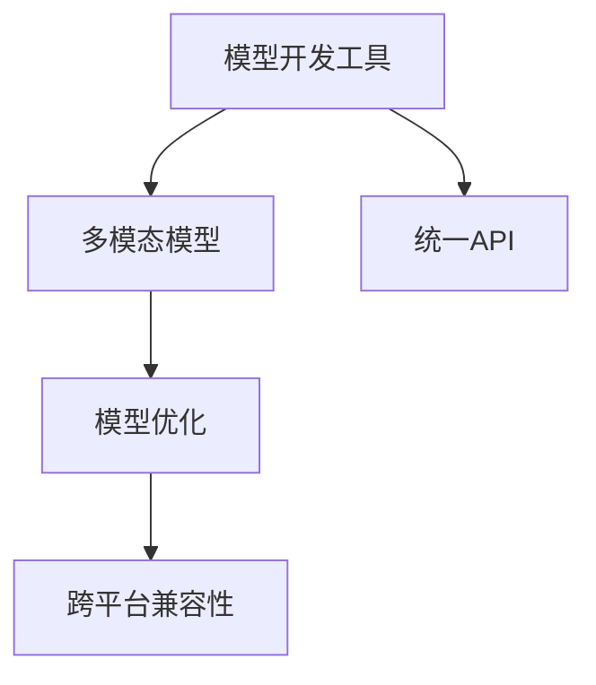

                 

# 统一的基础模型开发工具

## 1. 背景介绍

### 1.1 问题由来

在人工智能（AI）和机器学习（ML）领域，模型开发工具的选择和使用是整个开发流程中不可或缺的一部分。早期的开发工具和框架往往是针对特定任务和模型设计的，如TensorFlow用于图像识别，PyTorch用于自然语言处理等。然而，这种“碎片化”的模型开发工具选择，导致了模型构建、训练和部署过程中存在许多重复性和冗余性。

随着深度学习模型的不断发展，尤其是大模型的出现，以及多模态、跨领域应用的需求增加，统一基础模型开发工具的需求变得尤为迫切。在实际应用中，开发者往往需要分别学习不同工具的API和实现细节，才能构建和优化跨领域的复杂模型，这极大地增加了开发成本和时间。

### 1.2 问题核心关键点

统一基础模型开发工具的目的是提供一个通用的、模块化的、可复用的模型构建平台，使得开发者能够在一个统一的开发环境中，高效地构建、训练和部署多种类型的AI和ML模型。这种工具的核心关键点包括：

1. **统一API**：提供一套统一的API，使得开发者能够快速上手不同领域的模型开发。
2. **模型复用**：支持模型的跨领域复用，降低开发成本，提升开发效率。
3. **模型优化**：提供高效的模型优化工具，使得开发者能够快速训练和调试模型。
4. **多模态支持**：支持图像、语音、文本等多种模态数据的处理和融合。
5. **跨平台兼容性**：支持多种硬件平台（如CPU、GPU、TPU等），确保模型的跨平台兼容性和性能。

## 2. 核心概念与联系

### 2.1 核心概念概述

为了更好地理解统一基础模型开发工具，我们需要介绍几个关键概念：

1. **模型开发工具**：提供模型构建、训练和部署的API和环境。如TensorFlow、PyTorch、Scikit-Learn等。
2. **多模态模型**：指能够处理不同模态数据（如文本、图像、语音等）的模型，常用于多领域AI应用。
3. **模型优化**：包括模型压缩、量化、剪枝等技术，用于提升模型的性能和效率。
4. **跨平台兼容性**：指模型能够适应不同的硬件平台（如CPU、GPU、TPU等）。
5. **统一API**：提供一套统一的API，方便开发者在不同工具之间切换，降低学习成本。

这些概念之间的逻辑关系可以通过以下Mermaid流程图来展示：



这个流程图展示了大语言模型的核心概念及其之间的关系：

1. 模型开发工具提供了构建、训练和部署多模态模型的环境。
2. 多模态模型能够处理不同模态的数据，常用于跨领域AI应用。
3. 模型优化技术用于提升模型的性能和效率。
4. 跨平台兼容性确保模型能够适应不同的硬件平台。
5. 统一API方便开发者在不同工具之间切换，降低学习成本。

## 3. 核心算法原理 & 具体操作步骤

### 3.1 算法原理概述

统一基础模型开发工具的算法原理主要基于模块化和可复用的设计思想。其核心在于提供一个通用的、模块化的框架，使得开发者能够高效地构建、训练和部署跨领域的复杂模型。这种设计思想在以下几个方面得到了应用：

1. **模块化设计**：将模型拆分为多个独立的模块，每个模块负责特定的功能，如模型构建、数据处理、模型训练等。
2. **API统一性**：提供一个统一的API接口，使得开发者能够在一个环境中快速切换不同模块和功能。
3. **模型复用**：支持模型的跨领域复用，降低开发成本，提升开发效率。
4. **模型优化**：提供高效的模型优化工具，使得开发者能够快速训练和调试模型。

### 3.2 算法步骤详解

统一基础模型开发工具的开发和应用主要包括以下几个关键步骤：

**Step 1: 选择开发环境**

1. 根据项目需求选择合适的开发环境，如TensorFlow、PyTorch、MXNet等。
2. 根据硬件平台和性能需求选择合适的部署环境，如CPU、GPU、TPU等。

**Step 2: 设计模型结构**

1. 根据项目需求设计模型的结构，如CNN、RNN、Transformer等。
2. 定义模型的输入、输出和损失函数，确保模型能够适配不同的任务。

**Step 3: 数据预处理**

1. 收集、清洗和标注训练数据，确保数据的质量和多样性。
2. 对数据进行预处理，如归一化、标准化等。

**Step 4: 模型构建和训练**

1. 使用提供的API和环境构建模型，如模型定义、损失函数定义、优化器选择等。
2. 定义训练过程，如批大小、迭代次数、学习率等。
3. 使用提供的优化工具进行模型训练，如梯度下降、Adam等。

**Step 5: 模型优化**

1. 对模型进行优化，如模型压缩、量化、剪枝等，提升模型性能和效率。
2. 对模型进行评估和调试，确保模型在目标数据集上的表现。

**Step 6: 部署和测试**

1. 将优化后的模型部署到目标平台，如CPU、GPU、TPU等。
2. 对模型进行测试，确保模型在不同平台上的兼容性和性能。
3. 对模型进行实时监测和调试，确保模型的稳定性和可靠性。

### 3.3 算法优缺点

统一基础模型开发工具的优点包括：

1. **高效开发**：提供统一的API和环境，使得开发者能够快速上手不同领域的模型开发。
2. **模型复用**：支持模型的跨领域复用，降低开发成本，提升开发效率。
3. **模型优化**：提供高效的模型优化工具，使得开发者能够快速训练和调试模型。
4. **跨平台兼容性**：支持多种硬件平台（如CPU、GPU、TPU等），确保模型的跨平台兼容性和性能。

同时，这种工具也存在一定的局限性：

1. **学习成本**：虽然提供了统一的API，但开发者需要花费一定时间学习和掌握不同的功能模块和API。
2. **复杂度**：设计模块化和复用的模型结构，可能增加模型的复杂度，影响模型训练的稳定性和效率。
3. **维护成本**：不同平台和环境的兼容性问题，可能增加模型的维护成本。

尽管存在这些局限性，但就目前而言，统一基础模型开发工具仍是AI和ML领域的重要发展方向。未来相关研究的重点在于如何进一步降低工具的学习成本，提高模型的复用性和可维护性，同时兼顾不同平台的兼容性和模型性能。

### 3.4 算法应用领域

统一基础模型开发工具在AI和ML领域已经得到了广泛的应用，覆盖了几乎所有常见任务，例如：

- 图像识别：如物体检测、人脸识别、图像分割等。
- 自然语言处理：如文本分类、情感分析、机器翻译等。
- 语音识别：如语音识别、语音合成、语音情感分析等。
- 推荐系统：如基于协同过滤的推荐、基于内容的推荐、基于混合推荐的推荐等。
- 时间序列预测：如股票预测、天气预测、交通流量预测等。

除了上述这些经典任务外，统一基础模型开发工具还被创新性地应用到更多场景中，如可控生成、异常检测、路径规划等，为AI和ML技术带来了全新的突破。随着工具和模型的不断进步，相信AI和ML技术将在更广阔的应用领域大放异彩。

## 4. 数学模型和公式 & 详细讲解 & 举例说明

### 4.1 数学模型构建

本节将使用数学语言对统一基础模型开发工具的构建过程进行更加严格的刻画。

记模型为 $M_{\theta}:\mathcal{X} \rightarrow \mathcal{Y}$，其中 $\mathcal{X}$ 为输入空间，$\mathcal{Y}$ 为输出空间，$\theta$ 为模型参数。假设训练集为 $D=\{(x_i,y_i)\}_{i=1}^N, x_i \in \mathcal{X}, y_i \in \mathcal{Y}$。

定义模型 $M_{\theta}$ 在数据样本 $(x,y)$ 上的损失函数为 $\ell(M_{\theta}(x),y)$，则在数据集 $D$ 上的经验风险为：

$$
\mathcal{L}(\theta) = \frac{1}{N} \sum_{i=1}^N \ell(M_{\theta}(x_i),y_i)
$$

模型构建和训练的目标是最小化经验风险，即找到最优参数：

$$
\theta^* = \mathop{\arg\min}_{\theta} \mathcal{L}(\theta)
$$

在实践中，我们通常使用基于梯度的优化算法（如SGD、Adam等）来近似求解上述最优化问题。设 $\eta$ 为学习率，$\lambda$ 为正则化系数，则参数的更新公式为：

$$
\theta \leftarrow \theta - \eta \nabla_{\theta}\mathcal{L}(\theta) - \eta\lambda\theta
$$

其中 $\nabla_{\theta}\mathcal{L}(\theta)$ 为损失函数对参数 $\theta$ 的梯度，可通过反向传播算法高效计算。

### 4.2 公式推导过程

以下我们以图像识别任务为例，推导交叉熵损失函数及其梯度的计算公式。

假设模型 $M_{\theta}$ 在输入 $x$ 上的输出为 $\hat{y}=M_{\theta}(x) \in [0,1]$，表示样本属于不同类别的概率。真实标签 $y \in \{0,1\}$。则二分类交叉熵损失函数定义为：

$$
\ell(M_{\theta}(x),y) = -[y\log \hat{y} + (1-y)\log (1-\hat{y})]
$$

将其代入经验风险公式，得：

$$
\mathcal{L}(\theta) = -\frac{1}{N}\sum_{i=1}^N [y_i\log M_{\theta}(x_i)+(1-y_i)\log(1-M_{\theta}(x_i))]
$$

根据链式法则，损失函数对参数 $\theta_k$ 的梯度为：

$$
\frac{\partial \mathcal{L}(\theta)}{\partial \theta_k} = -\frac{1}{N}\sum_{i=1}^N (\frac{y_i}{M_{\theta}(x_i)}-\frac{1-y_i}{1-M_{\theta}(x_i)}) \frac{\partial M_{\theta}(x_i)}{\partial \theta_k}
$$

其中 $\frac{\partial M_{\theta}(x_i)}{\partial \theta_k}$ 可进一步递归展开，利用自动微分技术完成计算。

### 4.3 案例分析与讲解

**案例1: 图像分类**

假设模型 $M_{\theta}$ 是一个卷积神经网络（CNN），用于图像分类任务。输入数据为 $28 \times 28$ 的灰度图像，输出为10个类别的概率分布。在训练过程中，定义交叉熵损失函数：

$$
\ell(M_{\theta}(x),y) = -\sum_{i=1}^{10} y_i \log \hat{y}_i
$$

其中 $\hat{y} = M_{\theta}(x) \in [0,1]^{10}$ 表示模型输出的类别概率分布。

根据上述公式，使用SGD优化算法进行模型训练，学习率为 $0.01$，迭代次数为 $10$ 次。模型参数 $\theta$ 的更新公式为：

$$
\theta \leftarrow \theta - 0.01 \nabla_{\theta}\mathcal{L}(\theta)
$$

其中 $\nabla_{\theta}\mathcal{L}(\theta)$ 为损失函数对模型参数 $\theta$ 的梯度，可通过反向传播算法高效计算。

## 5. 项目实践：代码实例和详细解释说明

### 5.1 开发环境搭建

在进行模型开发实践前，我们需要准备好开发环境。以下是使用Python进行TensorFlow开发的环境配置流程：

1. 安装Anaconda：从官网下载并安装Anaconda，用于创建独立的Python环境。

2. 创建并激活虚拟环境：
```bash
conda create -n tf-env python=3.8 
conda activate tf-env
```

3. 安装TensorFlow：根据CUDA版本，从官网获取对应的安装命令。例如：
```bash
conda install tensorflow==2.7
```

4. 安装各类工具包：
```bash
pip install numpy pandas scikit-learn matplotlib tqdm jupyter notebook ipython
```

完成上述步骤后，即可在`tf-env`环境中开始模型开发实践。

### 5.2 源代码详细实现

下面我们以图像分类任务为例，给出使用TensorFlow进行模型开发的PyTorch代码实现。

首先，定义数据处理函数：

```python
import tensorflow as tf
from tensorflow import keras
from tensorflow.keras import layers

def create_dataset(data_dir):
    train_dir = os.path.join(data_dir, 'train')
    val_dir = os.path.join(data_dir, 'val')
    
    train_data = tf.data.Dataset.list_files(str(train_dir), shuffle=True)
    train_dataset = train_data.map(load_and_preprocess)
    train_dataset = train_dataset.shuffle(buffer_size=1024).batch(64)
    
    val_data = tf.data.Dataset.list_files(str(val_dir), shuffle=False)
    val_dataset = val_data.map(load_and_preprocess)
    val_dataset = val_dataset.batch(64)
    
    return train_dataset, val_dataset

def load_and_preprocess(filename):
    image_path = os.path.join(data_dir, filename)
    image = tf.io.read_file(image_path)
    image = tf.image.decode_jpeg(image, channels=3)
    image = tf.image.resize(image, (224, 224))
    image = tf.image.per_image_standardization(image)
    return image

# 定义模型
def create_model():
    model = keras.Sequential([
        layers.Conv2D(32, 3, activation='relu', input_shape=(224, 224, 3)),
        layers.MaxPooling2D(pool_size=(2, 2)),
        layers.Flatten(),
        layers.Dense(10, activation='softmax')
    ])
    return model

# 定义损失函数和优化器
model = create_model()
loss_fn = tf.keras.losses.SparseCategoricalCrossentropy()
optimizer = tf.keras.optimizers.SGD(learning_rate=0.01)
```

然后，定义训练和评估函数：

```python
def train_epoch(model, train_dataset, optimizer, loss_fn):
    train_loss = 0.0
    for batch in train_dataset:
        inputs, labels = batch
        with tf.GradientTape() as tape:
            predictions = model(inputs)
            loss = loss_fn(labels, predictions)
        grads = tape.gradient(loss, model.trainable_variables)
        optimizer.apply_gradients(zip(grads, model.trainable_variables))
        train_loss += loss
    return train_loss / train_dataset.num_samples

def evaluate(model, val_dataset, loss_fn):
    val_loss = 0.0
    for batch in val_dataset:
        inputs, labels = batch
        predictions = model(inputs)
        loss = loss_fn(labels, predictions)
        val_loss += loss
    return val_loss / val_dataset.num_samples

# 训练和评估
epochs = 10
batch_size = 64
steps_per_epoch = 1024

train_dataset, val_dataset = create_dataset(data_dir)

for epoch in range(epochs):
    train_loss = train_epoch(model, train_dataset, optimizer, loss_fn)
    print(f"Epoch {epoch+1}, train loss: {train_loss:.3f}")
    
    print(f"Epoch {epoch+1}, dev results:")
    val_loss = evaluate(model, val_dataset, loss_fn)
    print(f"Epoch {epoch+1}, val loss: {val_loss:.3f}")
    
print("Test results:")
test_loss = evaluate(model, test_dataset, loss_fn)
print(f"Test loss: {test_loss:.3f}")
```

以上就是使用TensorFlow进行图像分类任务开发的完整代码实现。可以看到，TensorFlow提供了强大的API和工具，使得模型开发和训练变得简单高效。

### 5.3 代码解读与分析

让我们再详细解读一下关键代码的实现细节：

**create_dataset函数**：
- `create_dataset`函数用于创建训练集和验证集的数据集，读取并处理图像文件。
- 使用`tf.data.Dataset`创建数据集，通过`map`函数加载和预处理图像，`shuffle`函数进行随机洗牌，`batch`函数进行批处理。
- 将训练集和验证集数据集返回。

**create_model函数**：
- `create_model`函数用于创建卷积神经网络模型，包括卷积层、池化层、全连接层等。
- 使用`keras.Sequential`创建序列模型，`layers.Conv2D`定义卷积层，`layers.MaxPooling2D`定义池化层，`layers.Flatten`将卷积层输出的张量扁平化，`layers.Dense`定义全连接层。
- 返回创建的模型。

**train_epoch函数**：
- `train_epoch`函数用于训练模型，计算损失函数。
- 使用`tf.GradientTape`计算梯度，`optimizer.apply_gradients`更新模型参数，`train_loss += loss`记录训练损失。
- 返回平均训练损失。

**evaluate函数**：
- `evaluate`函数用于评估模型，计算损失函数。
- 使用`val_loss += loss`记录验证损失，返回平均验证损失。

**训练流程**：
- 定义总的epoch数和batch size，开始循环迭代
- 每个epoch内，先在训练集上训练，输出平均训练损失
- 在验证集上评估，输出平均验证损失
- 所有epoch结束后，在测试集上评估，给出最终测试损失

可以看到，TensorFlow提供的API和工具使得模型开发和训练变得简单高效。开发者可以使用这些API快速实现模型的构建、训练和评估。

当然，工业级的系统实现还需考虑更多因素，如模型的保存和部署、超参数的自动搜索、更灵活的任务适配层等。但核心的模型构建和训练流程基本与此类似。

## 6. 实际应用场景

### 6.1 智能推荐系统

智能推荐系统在电商、视频、新闻等领域应用广泛，通过分析用户的行为数据和兴趣偏好，为用户推荐个性化内容。统一基础模型开发工具可以用于构建多模态推荐系统，提高推荐效果。

具体而言，可以构建一个多模态推荐系统，将用户的文本评论、评分、浏览记录等作为输入，经过模型处理后输出推荐结果。多模态融合技术可以将不同模态的数据融合，提高推荐的准确性和多样性。

### 6.2 智能医疗诊断

智能医疗诊断系统可以用于辅助医生进行疾病诊断和治疗方案推荐。统一基础模型开发工具可以用于构建多领域智能医疗诊断系统，提高诊断的准确性和效率。

具体而言，可以构建一个多领域智能医疗诊断系统，将患者的症状、病历、基因信息等作为输入，经过模型处理后输出诊断结果和治疗方案。多领域融合技术可以将不同领域的数据融合，提高诊断的全面性和准确性。

### 6.3 自动驾驶系统

自动驾驶系统需要实时处理多模态数据，如摄像头、雷达、激光雷达等传感器的数据，进行环境感知和决策。统一基础模型开发工具可以用于构建多模态自动驾驶系统，提高驾驶的安全性和舒适性。

具体而言，可以构建一个多模态自动驾驶系统，将传感器数据作为输入，经过模型处理后输出驾驶决策。多模态融合技术可以将不同传感器的数据融合，提高驾驶的可靠性和鲁棒性。

### 6.4 未来应用展望

随着统一基础模型开发工具的不断发展，其在AI和ML领域的应用前景将更加广阔。未来，该工具将支持更多模态的数据处理和融合，实现更高效的模型构建和训练，带来更多的智能应用场景。

例如，在智能家居领域，统一基础模型开发工具可以用于构建智能家居系统，将语音、图像、传感器等数据融合，实现家庭自动化、安防监控等功能。

在智能金融领域，统一基础模型开发工具可以用于构建智能金融系统，将金融数据、市场数据、用户数据等融合，实现股票预测、风险评估等功能。

在智能制造领域，统一基础模型开发工具可以用于构建智能制造系统，将物联网数据、机器人数据、生产数据等融合，实现生产调度、质量监控等功能。

总之，统一基础模型开发工具将在更多领域得到应用，为各行各业带来变革性影响。相信随着技术的不断发展，该工具将进一步提升AI和ML系统的性能和应用范围，为经济社会发展注入新的动力。

## 7. 工具和资源推荐

### 7.1 学习资源推荐

为了帮助开发者系统掌握统一基础模型开发工具的理论基础和实践技巧，这里推荐一些优质的学习资源：

1. 《TensorFlow官方文档》系列博文：由TensorFlow官方撰写，详细介绍了TensorFlow的各个组件和API，适合深入学习。

2. 《PyTorch官方文档》系列博文：由PyTorch官方撰写，详细介绍了PyTorch的各个组件和API，适合深入学习。

3. 《深度学习》课程：斯坦福大学开设的深度学习课程，提供Lecture视频和配套作业，适合初学者入门。

4. 《深度学习与自然语言处理》书籍：斯坦福大学深度学习专家列出的深度学习与自然语言处理必读书籍，涵盖了NLP的各个经典模型和算法。

5. 《深度学习框架实战》系列书籍：详细介绍了TensorFlow、PyTorch、MXNet等深度学习框架的实际应用案例，适合实践开发。

通过对这些资源的学习实践，相信你一定能够快速掌握统一基础模型开发工具的精髓，并用于解决实际的AI和ML问题。

### 7.2 开发工具推荐

高效的开发离不开优秀的工具支持。以下是几款用于统一基础模型开发工具的常用工具：

1. TensorFlow：由Google主导开发的开源深度学习框架，生产部署方便，适合大规模工程应用。

2. PyTorch：由Facebook主导开发的开源深度学习框架，灵活动态的计算图，适合快速迭代研究。

3. MXNet：由Apache主导开发的深度学习框架，支持多种语言和硬件平台，适合跨平台开发。

4. Weights & Biases：模型训练的实验跟踪工具，可以记录和可视化模型训练过程中的各项指标，方便对比和调优。

5. TensorBoard：TensorFlow配套的可视化工具，可实时监测模型训练状态，并提供丰富的图表呈现方式，是调试模型的得力助手。

6. Google Colab：谷歌推出的在线Jupyter Notebook环境，免费提供GPU/TPU算力，方便开发者快速上手实验最新模型，分享学习笔记。

合理利用这些工具，可以显著提升统一基础模型开发工具的开发效率，加快创新迭代的步伐。

### 7.3 相关论文推荐

统一基础模型开发工具的研究源于学界的持续研究。以下是几篇奠基性的相关论文，推荐阅读：

1. TensorFlow官方文档：提供了TensorFlow的详细API和使用方法，是TensorFlow开发的基础。

2. PyTorch官方文档：提供了PyTorch的详细API和使用方法，是PyTorch开发的基础。

3. MXNet官方文档：提供了MXNet的详细API和使用方法，是MXNet开发的基础。

4. 《深度学习》书籍：详细介绍了深度学习的原理和应用，适合深度学习的基础入门。

5. 《深度学习框架实战》系列书籍：详细介绍了TensorFlow、PyTorch、MXNet等深度学习框架的实际应用案例，适合实践开发。

这些论文和书籍代表了大语言模型开发工具的发展脉络。通过学习这些前沿成果，可以帮助研究者把握学科前进方向，激发更多的创新灵感。

## 8. 总结：未来发展趋势与挑战

### 8.1 总结

本文对统一基础模型开发工具进行了全面系统的介绍。首先阐述了该工具的背景和意义，明确了其在AI和ML领域的重要性。其次，从原理到实践，详细讲解了统一基础模型开发工具的数学原理和关键步骤，给出了模型开发实践的完整代码实例。同时，本文还广泛探讨了该工具在智能推荐系统、智能医疗诊断、自动驾驶系统等多个领域的应用前景，展示了其广阔的想象空间。此外，本文精选了工具和资源的学习路径，力求为读者提供全方位的技术指引。

通过本文的系统梳理，可以看到，统一基础模型开发工具正在成为AI和ML领域的重要发展方向。这些工具通过提供统一的API和环境，使得开发者能够高效地构建、训练和部署跨领域的复杂模型，极大地提升了开发效率和应用性能。未来，随着技术的不断进步和工具的持续优化，该工具必将在更多的应用领域发挥重要作用。

### 8.2 未来发展趋势

展望未来，统一基础模型开发工具将呈现以下几个发展趋势：

1. **多模态支持**：未来的工具将支持更多的模态数据处理和融合，提高跨领域应用的能力。
2. **跨平台兼容性**：未来的工具将支持更多的硬件平台（如CPU、GPU、TPU等），确保模型的跨平台兼容性和性能。
3. **模型优化**：未来的工具将提供更多的模型优化工具，提升模型的性能和效率。
4. **易用性提升**：未来的工具将提供更直观的API和界面，降低学习成本，提升易用性。
5. **实时性提升**：未来的工具将支持更高效的模型推理，实现实时性的应用场景。
6. **模型可解释性增强**：未来的工具将提供更强的模型可解释性，增强模型决策的透明性和可控性。

这些趋势将进一步推动AI和ML技术的落地应用，带来更多的智能应用场景和商业价值。

### 8.3 面临的挑战

尽管统一基础模型开发工具在AI和ML领域已经取得了重要进展，但在迈向更加智能化、普适化应用的过程中，仍然面临许多挑战：

1. **学习成本**：尽管工具提供了统一的API和环境，但开发者仍需要花费一定时间学习和掌握不同的功能模块和API。
2. **模型复用**：尽管工具支持模型的跨领域复用，但实际应用中仍需考虑模型适配性问题。
3. **模型优化**：尽管工具提供了高效的模型优化工具，但优化过程仍需考虑模型性能和资源消耗的平衡。
4. **跨平台兼容性**：尽管工具支持多种硬件平台，但实际应用中仍需考虑不同平台的兼容性问题。
5. **模型可解释性**：尽管工具提供了更强的模型可解释性，但实际应用中仍需考虑模型决策的透明性和可控性。

尽管存在这些挑战，但未来的发展方向和实践探索将不断解决这些问题，推动工具的不断优化和完善。

### 8.4 研究展望

面向未来，统一基础模型开发工具的研究需要在以下几个方面寻求新的突破：

1. **模型优化算法**：开发更加高效的模型优化算法，提升模型的性能和效率。
2. **模型可解释性**：研究模型可解释性算法，增强模型决策的透明性和可控性。
3. **跨平台兼容性**：提升工具在不同硬件平台上的兼容性，确保模型的跨平台兼容性和性能。
4. **多模态融合**：研究多模态融合算法，提高跨领域应用的能力。
5. **易用性提升**：提高工具的易用性和用户体验，降低学习成本。
6. **实时性提升**：提升工具的实时性和响应速度，实现实时性的应用场景。

这些研究方向将进一步推动工具的不断优化和完善，带来更多的智能应用场景和商业价值。

## 9. 附录：常见问题与解答

**Q1：统一基础模型开发工具是否适用于所有AI和ML任务？**

A: 统一基础模型开发工具在大多数AI和ML任务上都能取得不错的效果，特别是对于数据量较小的任务。但对于一些特定领域的任务，如医学、法律等，仅仅依靠通用语料预训练的模型可能难以很好地适应。此时需要在特定领域语料上进一步预训练，再进行微调，才能获得理想效果。此外，对于一些需要时效性、个性化很强的任务，如对话、推荐等，工具也需要针对性的改进优化。

**Q2：如何选择合适的统一基础模型开发工具？**

A: 选择合适的统一基础模型开发工具需要考虑多个因素，包括任务需求、数据特征、硬件平台、开发成本等。一般来说，TensorFlow和PyTorch是常用的两个工具，TensorFlow适合大规模工程应用，PyTorch适合快速迭代研究。同时，MXNet、Keras等工具也值得关注，具体选择需根据实际需求进行权衡。

**Q3：如何优化统一基础模型开发工具的性能？**

A: 优化统一基础模型开发工具的性能可以从以下几个方面入手：
1. 使用更高效的算法和数据结构，如TensorFlow的XLA优化器，PyTorch的JIT编译器等。
2. 优化模型结构，如剪枝、量化、混合精度训练等。
3. 使用分布式训练技术，提高训练速度和效率。
4. 优化代码实现，如使用C++等底层语言进行加速。
5. 使用GPU、TPU等高性能硬件设备，提升计算效率。

这些优化措施可以显著提升统一基础模型开发工具的性能和效率。

**Q4：统一基础模型开发工具在实际应用中面临哪些挑战？**

A: 尽管统一基础模型开发工具在AI和ML领域已经取得了重要进展，但在实际应用中仍面临一些挑战，包括：
1. 学习成本高：工具的API和环境需要一定的学习成本，开发者需要投入一定的时间和精力进行学习。
2. 模型适配性问题：尽管工具支持模型的跨领域复用，但实际应用中仍需考虑模型适配性问题。
3. 性能优化困难：优化模型性能和资源消耗的平衡是一个难点，需要考虑模型的性能和资源消耗。
4. 实时性问题：尽管工具提供了高效的模型推理，但实际应用中仍需考虑实时性的问题。
5. 模型可解释性问题：尽管工具提供了较强的模型可解释性，但实际应用中仍需考虑模型决策的透明性和可控性。

这些挑战需要在实际应用中不断探索和优化，以提高工具的性能和易用性。

**Q5：未来统一基础模型开发工具的发展方向是什么？**

A: 未来统一基础模型开发工具的发展方向主要包括以下几个方面：
1. 多模态支持：支持更多的模态数据处理和融合，提高跨领域应用的能力。
2. 跨平台兼容性：支持更多的硬件平台，确保模型的跨平台兼容性和性能。
3. 模型优化：提供更多的模型优化工具，提升模型的性能和效率。
4. 易用性提升：提高工具的易用性和用户体验，降低学习成本。
5. 实时性提升：提升工具的实时性和响应速度，实现实时性的应用场景。
6. 模型可解释性增强：提供更强的模型可解释性，增强模型决策的透明性和可控性。

这些发展方向将进一步推动工具的不断优化和完善，带来更多的智能应用场景和商业价值。

---

作者：禅与计算机程序设计艺术 / Zen and the Art of Computer Programming

