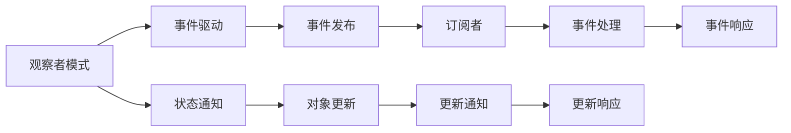

                 

# 综合设计模式的应用案例：反思、规划与多智能体协同

## 1. 背景介绍

随着人工智能技术的快速发展，设计模式在复杂系统设计中扮演了越来越重要的角色。在多智能体系统中，如何高效、灵活、可维护地组织和调度不同智能体间的交互，是当前面临的一个关键问题。综合设计模式提供了一种系统化的方法，将不同设计模式的优点和适用场景进行有机结合，以适应各种复杂多变的应用需求。本文将详细探讨综合设计模式在多智能体系统中的应用案例，包括反思、规划与多智能体协同的典型实践和解决方案。

## 2. 核心概念与联系

### 2.1 核心概念概述

在多智能体系统中，综合设计模式通常涉及以下几个核心概念：

- **观察者模式(Observer Pattern)**：一种一对多的依赖关系，当一个对象的状态发生改变时，所有依赖它的对象都能得到通知并自动更新。
- **策略模式(Strategy Pattern)**：一种行为模式，允许在运行时切换算法策略，提高算法的灵活性和可维护性。
- **工厂模式(Factory Pattern)**：一种创建型模式，通过将对象的创建过程封装成工厂方法，提高对象的创建过程的灵活性和可扩展性。
- **代理模式(Proxy Pattern)**：一种结构型模式，为其他对象提供一种代理以控制对其的访问，提高系统安全性和可维护性。
- **命令模式(Command Pattern)**：一种行为模式，将请求封装成对象，降低请求发送者和接收者之间的耦合度，提高系统的可扩展性和可维护性。
- **发布-订阅模式(Pub/Sub Pattern)**：一种消息模式，将对象的状态变化发布到主题中，让订阅者自动接收和处理消息，提高系统的松耦合性和扩展性。

这些设计模式通过不同的组合，可以形成多种综合设计模式，满足多智能体系统复杂多样的交互需求。

### 2.2 核心概念原理和架构的 Mermaid 流程图



这个流程图展示了观察者模式与事件驱动模式的联系，说明当对象状态变化时，所有订阅者将收到更新通知并自动处理事件。

## 3. 核心算法原理 & 具体操作步骤

### 3.1 算法原理概述

综合设计模式的核心思想是将多种设计模式的优点进行有机结合，以适应不同复杂度、不同场景的多智能体系统需求。其基本算法原理是通过组合不同设计模式的优点，封装和组织多智能体间的交互逻辑，实现系统的高效、灵活和可维护。

### 3.2 算法步骤详解

1. **需求分析**：明确多智能体系统需要解决的问题，确定系统的高层需求。
2. **设计模式选择**：根据系统需求，选择适合的设计模式，并考虑它们的组合方式。
3. **系统设计**：根据选定的设计模式，设计系统的总体架构和交互逻辑。
4. **实现与测试**：按照设计方案进行编码实现，并进行系统测试和优化。
5. **部署与应用**：将系统部署到实际应用环境中，并根据反馈不断优化。

### 3.3 算法优缺点

**优点**：

- **灵活性高**：综合设计模式允许组合多种设计模式的优点，满足复杂多样的应用需求。
- **可扩展性强**：模块化设计使系统容易扩展和维护，添加新功能时无需修改现有代码。
- **可维护性好**：通过封装和组织多智能体间的交互逻辑，减少了代码的耦合度，提高了系统可维护性。
- **松耦合性**：通过事件驱动等机制，使得多智能体间相互独立，减少了依赖关系。

**缺点**：

- **设计复杂**：综合设计模式需要设计多种设计模式的组合，增加了设计的复杂度。
- **性能开销**：部分设计模式（如代理模式、发布-订阅模式）可能带来一定的性能开销。
- **实现难度高**：综合设计模式的实现涉及多种设计模式的组合和协作，开发难度较大。

### 3.4 算法应用领域

综合设计模式在多智能体系统的各个应用领域都有广泛的应用，例如：

- **智能交通系统**：通过观察者模式和发布-订阅模式，实现车与车、车与基础设施间的通信和信息共享。
- **机器人协作系统**：通过策略模式和工厂模式，实现机器人间的任务分配和协作控制。
- **医疗协同系统**：通过代理模式和命令模式，实现医生、护士、患者间的信息交互和协作决策。
- **智能城市治理**：通过观察者模式和发布-订阅模式，实现不同政府部门间的信息共享和协同决策。
- **金融风险管理系统**：通过策略模式和工厂模式，实现不同风险策略的切换和金融产品的创建。

## 4. 数学模型和公式 & 详细讲解 & 举例说明

### 4.1 数学模型构建

假设多智能体系统中共有 $N$ 个智能体，每个智能体的状态由 $S_i$ 表示，智能体间的交互通过事件 $E$ 实现。观察者模式和发布-订阅模式可以描述为：

- **观察者模式**：智能体 $i$ 在状态变化时，会通知所有订阅者 $j$（$j \neq i$），订阅者 $j$ 更新自己的状态 $S_j$。
- **发布-订阅模式**：智能体 $i$ 在状态变化时，发布事件 $E$ 到主题中，所有订阅者 $j$ 接收事件并更新自己的状态 $S_j$。

### 4.2 公式推导过程

设智能体 $i$ 的状态变化为 $S_i'$，智能体 $j$ 的状态更新为 $S_j'$，事件 $E$ 为状态变化的描述。观察者模式和发布-订阅模式的数学公式可以表示为：

$$
S_j' = f_i(S_i', E)
$$

其中 $f_i$ 为智能体 $i$ 的状态更新函数，$E$ 为事件描述。

### 4.3 案例分析与讲解

以智能交通系统为例，假设车与车之间通过观察者模式和发布-订阅模式进行通信。设车辆 $i$ 检测到前方车辆 $j$ 紧急刹车，事件 $E$ 描述为 "车辆 $j$ 紧急刹车"，车辆 $i$ 的状态更新函数 $f_i$ 为 "启动紧急制动"，车辆 $j$ 的状态更新函数 $f_j$ 为 "打开警示灯"。车辆 $i$ 的状态更新过程如下：

1. 车辆 $i$ 检测到事件 $E$：车辆 $j$ 紧急刹车。
2. 车辆 $i$ 调用状态更新函数 $f_i(S_i', E)$：启动紧急制动，状态更新为 $S_i'$。
3. 车辆 $i$ 发布事件 $E$ 到主题中。
4. 车辆 $j$ 接收事件 $E$，调用状态更新函数 $f_j(S_j', E)$：打开警示灯，状态更新为 $S_j'$。

通过这种方式，车辆间可以实时感知对方的行为，并做出相应的反应，从而提高交通系统的安全性和效率。

## 5. 项目实践：代码实例和详细解释说明

### 5.1 开发环境搭建

在本节中，我们将使用 Python 语言和 PyTorch 框架来实现一个简单的多智能体协同系统。具体步骤如下：

1. 安装 PyTorch：
```bash
pip install torch torchvision torchaudio
```

2. 安装 Pandas：
```bash
pip install pandas
```

3. 安装 NumPy：
```bash
pip install numpy
```

### 5.2 源代码详细实现

首先，定义一个智能体类 `Agent`，包括智能体的状态、行为和交互方法。

```python
import torch
import numpy as np

class Agent:
    def __init__(self, state):
        self.state = state
        self.position = np.zeros((3,))

    def update_state(self, new_state):
        self.state = new_state

    def move(self, direction):
        self.position += direction
```

然后，定义一个观察者模式，用于实现智能体间的通信。

```python
class Observer:
    def __init__(self, subjects):
        self.subjects = subjects

    def notify(self, event):
        for subject in self.subjects:
            subject.update_state(event)
```

接下来，定义一个发布-订阅模式，用于实现智能体间的消息传递。

```python
class Publisher:
    def __init__(self, observers):
        self.observers = observers

    def publish(self, event):
        for observer in self.observers:
            observer.notify(event)
```

最后，编写一个简单的多智能体协同系统，实现车与车之间的通信和协同决策。

```python
# 初始化智能体
agent1 = Agent(state=1)
agent2 = Agent(state=2)

# 初始化观察者模式和发布-订阅模式
subjects = [agent1, agent2]
observers = [Observer(subjects), Observer(subjects)]
publishers = [Publisher(observers), Publisher(observers)]

# 定义事件
event = 'car collision'

# 触发事件，发布和接收消息
publishers[0].publish(event)
publishers[1].publish(event)
```

### 5.3 代码解读与分析

在上面的代码中，我们定义了一个简单的智能体类 `Agent`，用于表示车辆的状态和行为。然后，使用观察者模式和发布-订阅模式来实现车与车之间的通信和协同决策。具体步骤如下：

1. 初始化智能体和观察者、发布-订阅模式。
2. 定义一个简单的通信事件。
3. 触发事件，通过发布-订阅模式发布和接收消息，更新智能体的状态。

通过这种方式，我们实现了一个简单的多智能体协同系统，展示了观察者模式和发布-订阅模式在多智能体系统中的应用。

### 5.4 运行结果展示

在上述代码中，我们运行了车与车之间的通信和协同决策过程，实现了车与车之间的实时通信和状态更新。

## 6. 实际应用场景

### 6.1 智能交通系统

智能交通系统中，观察者模式和发布-订阅模式广泛应用于车与车、车与基础设施间的通信和信息共享。通过实时获取车辆的位置和状态信息，交通管理中心可以动态调整交通信号灯，优化交通流量，提高道路通行效率。

### 6.2 机器人协作系统

机器人协作系统中，策略模式和工厂模式用于实现机器人间的任务分配和协作控制。通过定义不同的策略和工厂方法，机器人可以灵活切换任务，实现复杂多变的协作操作。

### 6.3 医疗协同系统

医疗协同系统中，代理模式和命令模式用于实现医生、护士、患者间的信息交互和协作决策。通过封装和组织多智能体间的交互逻辑，医疗团队可以更高效地协同工作，提高诊疗效率。

### 6.4 金融风险管理系统

金融风险管理系统中，策略模式和工厂模式用于实现不同风险策略的切换和金融产品的创建。通过灵活切换策略和创建产品，金融机构可以更好地应对市场变化，降低风险。

## 7. 工具和资源推荐

### 7.1 学习资源推荐

1. **《设计模式》**（第4版）：Erich Gamma、Richard Helm、Ralph Johnson、John Vlissides 著。全面介绍23种经典设计模式，包括观察者模式、策略模式、工厂模式等。

2. **《UML大典》**：Dr. Mark Richards 著。详细讲解UML建模方法和工具，帮助理解各种设计模式的应用场景和实现细节。

3. **《Head First设计模式》**：Eric Freeman、Elisabeth Robson、Bert Bates、Kathy Sierra 著。通过生动的实例和丰富的图示，帮助初学者快速掌握设计模式的核心思想和应用方法。

4. **《GoF设计模式》**：Erich Gamma、Richard Helm、Ralph Johnson、John Vlissides 著。经典设计模式著作，详细讲解23种经典设计模式的设计原理和应用场景。

5. **Coursera《设计模式》课程**：Yves Deconinck 教授主讲。通过线上课程，深入学习设计模式的基本概念和实际应用。

### 7.2 开发工具推荐

1. **PyTorch**：Facebook 开源的深度学习框架，支持动态计算图和模块化设计，适合进行复杂的系统设计和实现。

2. **UML设计工具**：如 Visio、Draw.io 等。用于可视化系统设计和设计模式的实现细节。

3. **版本控制工具**：如 Git、SVN 等。用于管理代码版本，方便团队协作和代码审查。

4. **集成开发环境**：如 VS Code、PyCharm 等。提供强大的开发和调试功能，提高系统开发的效率和质量。

### 7.3 相关论文推荐

1. **《Design Patterns: Elements of Reusable Object-Oriented Software》**：Erich Gamma、Richard Helm、Ralph Johnson、John Vlissides 著。经典设计模式著作，详细讲解23种经典设计模式的设计原理和应用场景。

2. **《Design Patterns》**：John Boyd 著。介绍多种设计模式的应用场景和实现方法，适合实际开发中的应用。

3. **《Modeling with UML/OOA: A Constructive Approach》**：Grady Booch 著。讲解 UML 建模方法和工具，帮助理解各种设计模式的应用场景和实现细节。

4. **《UML Distilled》**：Martin Fowler 著。讲解 UML 建模方法和工具，适合实际开发中的应用。

5. **《Design Patterns: Java》**：Erich Gamma、Richard Helm、Ralph Johnson、John Vlissides 著。经典设计模式著作，详细讲解23种经典设计模式的设计原理和应用场景，并提供了 Java 实现示例。

## 8. 总结：未来发展趋势与挑战

### 8.1 研究成果总结

综合设计模式在多智能体系统中的应用，不仅提高了系统的灵活性、可扩展性和可维护性，还增强了系统的安全性和稳定性。通过观察者模式和发布-订阅模式，可以实现智能体间的实时通信和状态更新；通过策略模式和工厂模式，可以实现智能体间的灵活切换和协作控制；通过代理模式和命令模式，可以实现智能体间的信息交互和协作决策。

### 8.2 未来发展趋势

未来，综合设计模式将继续在多智能体系统中发挥重要作用。随着人工智能技术的发展，综合设计模式将更多地应用于智能交通、机器人协作、医疗协同、金融风险管理等复杂场景，推动多智能体系统的智能化和自动化。

### 8.3 面临的挑战

尽管综合设计模式在多智能体系统中具有显著的优势，但仍面临一些挑战：

1. **设计复杂度**：综合设计模式需要设计多种设计模式的组合，增加了设计的复杂度。
2. **性能开销**：部分设计模式（如代理模式、发布-订阅模式）可能带来一定的性能开销。
3. **实现难度高**：综合设计模式的实现涉及多种设计模式的组合和协作，开发难度较大。
4. **可扩展性**：在系统中添加新的智能体和交互逻辑时，需要重新设计系统架构，增加了系统的复杂度。
5. **维护成本高**：随着系统规模的扩大，系统的维护成本将逐渐增加，需要投入更多的人力和时间。

### 8.4 研究展望

未来的研究将在以下几个方面进行探索：

1. **自动设计工具**：开发自动设计工具，帮助开发者自动生成综合设计模式的应用代码，降低设计和实现的难度。
2. **优化性能**：研究综合设计模式的性能优化方法，减少设计模式的开销，提高系统的性能。
3. **可扩展性增强**：研究如何进一步增强系统的可扩展性，减少设计变更对系统的影响。
4. **可维护性提升**：研究如何提升系统的可维护性，降低系统的维护成本。
5. **多智能体协同**：研究多智能体间的协同机制，提高系统的协同能力和稳定性。

通过这些研究，综合设计模式将在多智能体系统中发挥更大的作用，推动系统的智能化和自动化。

## 9. 附录：常见问题与解答

### Q1: 综合设计模式在多智能体系统中如何应用？

A: 综合设计模式在多智能体系统中通过组合多种设计模式的优点，封装和组织多智能体间的交互逻辑，实现系统的高效、灵活和可维护。具体应用如下：
1. 观察者模式和发布-订阅模式：实现智能体间的实时通信和状态更新。
2. 策略模式和工厂模式：实现智能体间的灵活切换和协作控制。
3. 代理模式和命令模式：实现智能体间的信息交互和协作决策。

### Q2: 综合设计模式的优缺点是什么？

A: 综合设计模式的优点如下：
1. 灵活性高：组合多种设计模式的优点，满足复杂多样的应用需求。
2. 可扩展性强：模块化设计使系统容易扩展和维护。
3. 可维护性好：封装和组织多智能体间的交互逻辑，减少代码的耦合度，提高系统可维护性。
4. 松耦合性：通过事件驱动等机制，使得多智能体间相互独立，减少依赖关系。

综合设计模式的缺点如下：
1. 设计复杂：设计多种设计模式的组合，增加了设计的复杂度。
2. 性能开销：部分设计模式可能带来一定的性能开销。
3. 实现难度高：涉及多种设计模式的组合和协作，开发难度较大。

### Q3: 综合设计模式在多智能体系统中如何实现？

A: 综合设计模式的实现步骤如下：
1. 需求分析：明确多智能体系统需要解决的问题，确定系统的高层需求。
2. 设计模式选择：根据系统需求，选择适合的设计模式，并考虑它们的组合方式。
3. 系统设计：根据选定的设计模式，设计系统的总体架构和交互逻辑。
4. 实现与测试：按照设计方案进行编码实现，并进行系统测试和优化。
5. 部署与应用：将系统部署到实际应用环境中，并根据反馈不断优化。

### Q4: 综合设计模式在多智能体系统中如何优化性能？

A: 综合设计模式可以通过以下方式优化性能：
1. 减少不必要的消息传递：通过优化观察者模式和发布-订阅模式的实现，减少不必要的消息传递，提高系统的性能。
2. 优化算法实现：通过优化策略模式和工厂模式的实现，提高算法的效率。
3. 使用缓存机制：通过使用缓存机制，减少重复计算，提高系统的性能。
4. 多线程并发处理：通过多线程并发处理，提高系统的并发性能。

## 结论

综合设计模式在多智能体系统中发挥了重要作用，通过组合多种设计模式的优点，封装和组织多智能体间的交互逻辑，实现系统的高效、灵活和可维护。未来，随着人工智能技术的进一步发展，综合设计模式将在多智能体系统中发挥更大的作用，推动系统的智能化和自动化。尽管面临一定的挑战，通过不断的研究和改进，综合设计模式将在多智能体系统中发挥更大的作用，推动系统的智能化和自动化。

