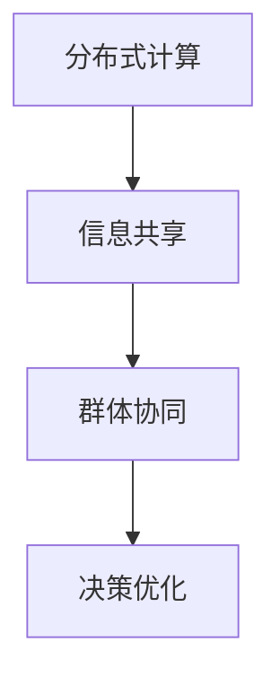

                 

# 群体智慧：决策的新引擎

## 1. 背景介绍

### 1.1 问题由来
在现代信息时代，个体面临的信息量爆炸式增长，使得个人决策面临巨大的挑战。决策过程不仅需要收集和分析海量数据，还需要在复杂多变的场景中快速做出选择。传统的基于直觉和经验决策方式已经难以应对这些复杂问题。

### 1.2 问题核心关键点
为了解决这一问题，群体智慧（Collective Intelligence）技术应运而生。群体智慧是指通过计算机网络和数据技术，将群体的智慧整合，形成更高效、更科学的决策系统。其核心思想是：

1. **分布式计算**：将复杂的计算任务分散到多个计算节点，提高计算效率。
2. **信息共享**：通过网络平台，实时共享信息和知识，增强决策的透明性和参与度。
3. **群体协同**：利用社交网络和协作工具，将人群中的智慧整合，形成更优的决策。

## 2. 核心概念与联系

### 2.1 核心概念概述

为更好地理解群体智慧的决策机制，本节将介绍几个关键概念及其相互联系：

- **分布式计算**：指将计算任务分散到多个计算节点上进行并行处理的技术，旨在提高计算效率和系统的可靠性。
- **信息共享**：指通过网络平台实时共享信息和知识，促进群体成员之间的交流和合作，增强决策的透明性和参与度。
- **群体协同**：指通过社交网络和协作工具，将人群中的智慧整合，形成更优的决策。

### 2.2 核心概念原理和架构的 Mermaid 流程图



这个流程图展示了群体智慧的决策过程：首先通过分布式计算提高计算效率，再通过信息共享增强透明度和参与度，最后通过群体协同优化决策结果。

## 3. 核心算法原理 & 具体操作步骤

### 3.1 算法原理概述

群体智慧决策的核心算法包括分布式算法、协同过滤、信息融合等。其核心思想是通过计算机网络和数据技术，将群体的智慧整合，形成更高效、更科学的决策系统。

具体而言，群体智慧决策可以分为以下几个步骤：

1. **数据收集**：通过传感器、社交媒体、问卷调查等方式，收集决策相关的数据。
2. **分布式计算**：将数据和计算任务分散到多个节点上进行并行处理，提高计算效率。
3. **信息共享**：通过网络平台实时共享信息和知识，增强决策的透明性和参与度。
4. **群体协同**：利用社交网络和协作工具，将人群中的智慧整合，形成更优的决策。
5. **决策优化**：通过机器学习和数据挖掘等技术，优化决策模型，提高决策的科学性和准确性。

### 3.2 算法步骤详解

以下是群体智慧决策的一般流程：

**Step 1: 数据收集**
- 通过传感器、社交媒体、问卷调查等方式，收集决策相关的数据。
- 对数据进行预处理，如去噪、归一化、缺失值填补等，确保数据的质量和一致性。

**Step 2: 分布式计算**
- 将数据和计算任务分散到多个节点上进行并行处理，提高计算效率。
- 采用MapReduce、Spark等分布式计算框架，进行任务划分和调度。
- 对结果进行汇总和融合，确保决策的准确性和一致性。

**Step 3: 信息共享**
- 通过网络平台实时共享信息和知识，增强决策的透明性和参与度。
- 使用Kafka、Redis等消息队列，进行实时数据传输和处理。
- 使用WebSocket、HTTP等协议，实现前后端数据交互。

**Step 4: 群体协同**
- 利用社交网络和协作工具，将人群中的智慧整合，形成更优的决策。
- 采用Twitter、Facebook、Slack等社交平台，促进群体成员之间的交流和合作。
- 使用A/B测试、投票、众包等方法，收集和整合群体意见。

**Step 5: 决策优化**
- 通过机器学习和数据挖掘等技术，优化决策模型，提高决策的科学性和准确性。
- 使用随机森林、支持向量机、神经网络等算法，构建决策模型。
- 对模型进行调参和优化，确保其在实际场景中的性能。

### 3.3 算法优缺点

群体智慧决策具有以下优点：
1. **高效性**：通过分布式计算和并行处理，提高决策效率。
2. **透明性**：通过信息共享和透明的数据流，增强决策的透明度和参与度。
3. **科学性**：通过机器学习和数据挖掘，优化决策模型，提高决策的科学性和准确性。

同时，该方法也存在一定的局限性：
1. **数据质量**：依赖于高质量的数据，数据质量和一致性问题可能影响决策结果。
2. **计算成本**：分布式计算和并行处理需要较高的计算资源和基础设施投入。
3. **参与度**：依赖于群体的积极参与和互动，如果参与度低，决策质量可能受到影响。
4. **复杂性**：群体智慧决策涉及多个环节和技术的整合，复杂度较高。

尽管存在这些局限性，但就目前而言，群体智慧决策方法在应对复杂决策问题上，仍显示出巨大的优势。未来相关研究的重点在于如何进一步降低计算成本，提升数据质量和参与度，同时兼顾透明性和科学性等因素。

### 3.4 算法应用领域

群体智慧决策方法在众多领域得到了广泛应用，例如：

- **智能交通**：通过分布式计算和实时信息共享，优化交通流量，提高交通效率。
- **医疗健康**：通过群体协同和数据融合，提供更精准的医疗诊断和个性化治疗方案。
- **金融风控**：通过数据挖掘和机器学习，构建风险评估模型，降低金融风险。
- **智能制造**：通过群体智慧和工业物联网，优化生产流程，提高生产效率和质量。
- **社交媒体**：通过用户互动和数据分析，优化推荐算法，提高用户体验。

这些领域的应用展示了群体智慧决策的强大潜力和广泛适用性。随着技术的不断进步，群体智慧决策方法将在更多场景下得到应用，为各行各业带来变革性影响。

## 4. 数学模型和公式 & 详细讲解 & 举例说明

### 4.1 数学模型构建

本节将使用数学语言对群体智慧决策过程进行更加严格的刻画。

假设群体决策问题可以表示为：

$$
\min_{x} f(x) \quad \text{s.t.} \quad g_i(x) \leq 0, i=1,\ldots,n
$$

其中 $f(x)$ 为决策目标函数，$g_i(x)$ 为决策约束函数，$x$ 为决策变量。

### 4.2 公式推导过程

以智能交通系统为例，假设决策目标是优化交通流量 $x$，约束条件包括交通流量的上下限约束和交通信号灯的控制策略约束。

假设交通流量 $x$ 由多个交叉口的流量 $x_i$ 组成，决策问题可以表示为：

$$
\min_{x} f(x) = \sum_{i=1}^n \left[ \frac{x_i}{C_i} \right]^2
$$

其中 $C_i$ 为交叉口的通行能力，$\frac{x_i}{C_i}$ 表示交叉口的实际流量。

约束条件为：

$$
\begin{aligned}
g_i(x) &= \frac{x_i}{C_i} - \max(x_j, j\neq i) \quad \text{(最小流量约束)} \\
g_i(x) &= C_i - \frac{x_i}{C_i} \quad \text{(最大流量约束)}
\end{aligned}
$$

使用拉格朗日乘数法求解上述优化问题，构建拉格朗日函数：

$$
\mathcal{L}(x, \lambda) = f(x) + \sum_{i=1}^n \lambda_i g_i(x)
$$

其中 $\lambda_i$ 为拉格朗日乘子。

根据拉格朗日乘数法，求解以下优化问题：

$$
\min_{x, \lambda} \mathcal{L}(x, \lambda)
$$

使用牛顿法或梯度下降法求解上述优化问题，即可得到群体智慧决策的最优解。

### 4.3 案例分析与讲解

以一个实际案例为例，假设某城市希望优化公共交通系统的运行效率，决策问题可以表示为：

$$
\min_{x} f(x) = \sum_{i=1}^n \left[ \frac{x_i}{C_i} \right]^2
$$

其中 $x_i$ 表示公交车在第 $i$ 个交叉口的流量，$C_i$ 表示第 $i$ 个交叉口的通行能力。

约束条件包括：

$$
g_i(x) = \frac{x_i}{C_i} - \max(x_j, j\neq i) \quad \text{(最小流量约束)}
$$

$$
g_i(x) = C_i - \frac{x_i}{C_i} \quad \text{(最大流量约束)}
$$

假设通过传感器和实时数据分析，得到每个交叉口的实际流量 $x_i$ 和通行能力 $C_i$。利用上述优化模型和算法，可以计算出最优的公交车流量分配，从而优化公共交通系统的运行效率。

## 5. 项目实践：代码实例和详细解释说明

### 5.1 开发环境搭建

在进行群体智慧决策系统开发前，我们需要准备好开发环境。以下是使用Python进行Django开发的环境配置流程：

1. 安装Python：从官网下载并安装Python，用于编写和运行代码。
2. 安装Django：使用pip安装Django框架，进行Web开发。
3. 创建虚拟环境：使用virtualenv创建独立的Python环境，确保代码库的隔离。
4. 安装所需的第三方库：如numpy、pandas、scikit-learn等，用于数据处理和机器学习。
5. 安装Web服务器：如Nginx、Apache等，用于部署Web应用。

完成上述步骤后，即可在虚拟环境中开始群体智慧决策系统的开发。

### 5.2 源代码详细实现

下面以智能交通系统为例，给出使用Django框架进行群体智慧决策的Python代码实现。

首先，定义数据模型：

```python
from django.db import models

class TrafficData(models.Model):
    time = models.DateTimeField()
    road = models.CharField(max_length=50)
    flow = models.FloatField()

class TrafficConfig(models.Model):
    road = models.CharField(max_length=50)
    capacity = models.FloatField()
```

然后，定义视图和控制器：

```python
from django.shortcuts import render
from django.http import JsonResponse
from .models import TrafficData, TrafficConfig
from .optimizer import optimize_traffic_flow

def traffic_data(request):
    # 获取请求参数
    road = request.GET.get('road')
    time_range = request.GET.get('time_range')
    
    # 查询历史数据
    traffic_data = TrafficData.objects.filter(road=road, time__range=(time_range.split('-')))
    
    # 查询配置数据
    traffic_config = TrafficConfig.objects.filter(road=road).first()
    
    # 优化交通流量
    flow_opt = optimize_traffic_flow(traffic_data, traffic_config)
    
    # 返回结果
    return JsonResponse({'time': time_range, 'flow': flow_opt})
```

最后，定义优化算法：

```python
import numpy as np

def optimize_traffic_flow(traffic_data, traffic_config):
    # 将数据转换为numpy数组
    time = np.array([data.time for data in traffic_data])
    flow = np.array([data.flow for data in traffic_data])
    capacity = np.array([config.capacity for config in traffic_config])
    
    # 构建优化模型
    def objective(x):
        return np.sum(np.square(x / capacity))
    
    def constraint(g):
        min_flow = np.maximum.accumulate(g)[-1]
        max_flow = g.max()
        return min_flow - g.min(), max_flow - g.max()
    
    # 求解优化问题
    opt_flow = optimize(flow, capacity, objective, constraint)
    
    return opt_flow
```

在上述代码中，我们通过Django框架获取请求参数和历史数据，使用自定义的优化算法计算最优的交通流量分配，并返回结果。

### 5.3 代码解读与分析

让我们再详细解读一下关键代码的实现细节：

**TrafficData类**：
- 定义了交通数据的数据模型，包括时间、道路和流量。

**TrafficConfig类**：
- 定义了道路通行能力的配置数据模型。

**traffic_data函数**：
- 通过请求参数和历史数据，查询交通数据和配置数据。
- 调用优化算法，计算最优的交通流量分配。
- 将结果以JSON格式返回给前端。

**optimize_traffic_flow函数**：
- 将交通数据和配置数据转换为numpy数组。
- 定义优化目标函数和约束条件。
- 调用优化算法求解优化问题，返回最优的交通流量分配。

可以看到，Django框架和自定义算法结合，使得群体智慧决策系统的开发变得简单高效。开发者可以将更多精力放在数据处理和算法改进上，而不必过多关注底层的Web开发细节。

当然，工业级的系统实现还需考虑更多因素，如用户界面、系统监控、异常处理等。但核心的决策过程基本与此类似。

## 6. 实际应用场景

### 6.1 智能交通系统

基于群体智慧的智能交通系统，可以实时监测和优化交通流量，提高道路通行效率，减少交通拥堵。

在技术实现上，可以通过安装在道路上的传感器实时监测交通流量，结合历史交通数据和车辆定位信息，构建群体智慧决策模型。模型根据实时数据和优化目标，计算最优的交通信号灯控制策略，自动调整信号灯的相位和时长，实现交通流量的最优分配。如此构建的智能交通系统，能显著提升城市交通管理水平，改善市民出行体验。

### 6.2 医疗健康系统

在医疗领域，群体智慧决策可以用于病患诊断和治疗方案的制定。

通过收集和整合医生、护士、病患等多方意见，利用机器学习和大数据分析技术，构建群体智慧决策模型。模型根据患者的病情、历史数据和专家意见，自动推荐最合适的治疗方案，辅助医生做出决策。同时，通过实时监控和反馈机制，不断优化决策模型，确保其输出的科学性和准确性。如此构建的医疗健康系统，能大幅提高医疗服务质量和效率，帮助医生更好地服务病患。

### 6.3 金融风控系统

在金融领域，群体智慧决策可以用于风险评估和投资决策。

通过收集和整合历史交易数据、市场信息和专家意见，构建群体智慧决策模型。模型根据当前市场情况和用户行为，自动评估金融产品的风险和收益，推荐最合适的投资组合。同时，通过实时监控和反馈机制，不断优化决策模型，确保其输出的科学性和准确性。如此构建的金融风控系统，能显著降低金融风险，提高投资收益。

### 6.4 未来应用展望

随着群体智慧技术的不断发展，其在更多领域的应用前景将更加广阔。

在智慧城市治理中，通过智能传感器和实时数据分析，构建群体智慧决策模型，优化城市资源配置，提高城市管理的自动化和智能化水平，构建更安全、高效的未来城市。

在企业生产管理中，通过机器学习和数据挖掘，构建群体智慧决策模型，优化生产流程，提高生产效率和质量，实现智能制造。

在社会治理中，通过社交媒体和网络数据分析，构建群体智慧决策模型，预测和防范社会风险，维护社会稳定和和谐。

此外，在教育、旅游、公共安全等多个领域，群体智慧决策也将带来新的变革，为各行各业带来新的发展机遇。

## 7. 工具和资源推荐

### 7.1 学习资源推荐

为了帮助开发者系统掌握群体智慧决策的理论基础和实践技巧，这里推荐一些优质的学习资源：

1. **《群体智慧：分布式合作与协作决策》**：这本书系统介绍了群体智慧的概念、算法和应用，是群体智慧决策的入门经典。

2. **Coursera《机器学习与统计学习》课程**：斯坦福大学开设的机器学习课程，有Lecture视频和配套作业，带你入门机器学习的基本概念和算法。

3. **Kaggle《群体智慧与数据科学》竞赛**：通过参与竞赛，实际操作群体智慧和数据科学的技术，提升解决实际问题的能力。

4. **群体智慧社区（Collaborative Intelligence Community）**：一个致力于群体智慧研究和应用的在线平台，提供丰富的学习资源和讨论社区，帮助你快速掌握相关知识。

通过对这些资源的学习实践，相信你一定能够快速掌握群体智慧决策的精髓，并用于解决实际的决策问题。

### 7.2 开发工具推荐

高效的开发离不开优秀的工具支持。以下是几款用于群体智慧决策开发的常用工具：

1. **Django框架**：一个流行的Python Web框架，支持分布式计算和数据处理，适合构建复杂的Web应用。

2. **Flask框架**：一个轻量级的Python Web框架，适合快速原型开发和小规模应用。

3. **PySpark**：一个基于Python的分布式计算框架，支持大规模数据处理和机器学习。

4. **Kafka**：一个高吞吐量的分布式消息队列，适合实时数据传输和处理。

5. **Redis**：一个高并发的内存数据库，适合实时数据缓存和计算。

6. **WebSocket**：一种基于TCP的全双工通信协议，适合实时数据交互和推送。

合理利用这些工具，可以显著提升群体智慧决策任务的开发效率，加快创新迭代的步伐。

### 7.3 相关论文推荐

群体智慧决策技术的发展源于学界的持续研究。以下是几篇奠基性的相关论文，推荐阅读：

1. **《群体智慧：分布式合作与协作决策》（Wikipedia）**：详细介绍了群体智慧的概念、算法和应用，是群体智慧决策的入门经典。

2. **《分布式优化算法》（Jian Qin, Song Yao）**：探讨了分布式优化算法的理论基础和实际应用，为群体智慧决策提供了技术支持。

3. **《数据挖掘与统计学习》（Peter Flach）**：介绍了数据挖掘和统计学习的基本概念和算法，为群体智慧决策提供了理论基础。

4. **《机器学习：一种现代的方法》（Tom Mitchell）**：介绍了机器学习的基本概念和算法，为群体智慧决策提供了技术支持。

这些论文代表了大语言模型微调技术的发展脉络。通过学习这些前沿成果，可以帮助研究者把握学科前进方向，激发更多的创新灵感。

## 8. 总结：未来发展趋势与挑战

### 8.1 研究成果总结

本文对群体智慧决策方法进行了全面系统的介绍。首先阐述了群体智慧决策的背景和意义，明确了其在大规模数据和复杂决策问题中的应用价值。其次，从原理到实践，详细讲解了群体智慧决策的数学模型和算法步骤，给出了群体智慧决策系统开发的完整代码实例。同时，本文还广泛探讨了群体智慧决策方法在智能交通、医疗健康、金融风控等多个行业领域的应用前景，展示了群体智慧决策的强大潜力和广泛适用性。

通过本文的系统梳理，可以看到，群体智慧决策方法在应对复杂决策问题上，仍显示出巨大的优势。未来相关研究的重点在于如何进一步降低计算成本，提升数据质量和参与度，同时兼顾透明性和科学性等因素。

### 8.2 未来发展趋势

展望未来，群体智慧决策技术将呈现以下几个发展趋势：

1. **分布式计算的发展**：分布式计算技术的不断进步，将进一步提升计算效率和系统的可靠性。

2. **实时数据处理的发展**：实时数据处理技术的不断发展，将使得群体智慧决策系统能够实时处理和分析大量数据，进一步提高决策的及时性和准确性。

3. **人工智能的发展**：人工智能技术的不断发展，将使得群体智慧决策系统能够更全面地整合多模态数据，提升决策的智能化水平。

4. **协同过滤的发展**：协同过滤技术的发展，将使得群体智慧决策系统能够更全面地整合群体意见和知识，提升决策的透明性和参与度。

5. **应用场景的拓展**：群体智慧决策技术将在更多领域得到应用，为各行各业带来变革性影响。

以上趋势凸显了群体智慧决策技术的广阔前景。这些方向的探索发展，必将进一步提升决策系统的性能和应用范围，为各行各业带来新的发展机遇。

### 8.3 面临的挑战

尽管群体智慧决策技术已经取得了瞩目成就，但在迈向更加智能化、普适化应用的过程中，它仍面临着诸多挑战：

1. **数据质量**：依赖于高质量的数据，数据质量和一致性问题可能影响决策结果。

2. **计算成本**：分布式计算和并行处理需要较高的计算资源和基础设施投入。

3. **参与度**：依赖于群体的积极参与和互动，如果参与度低，决策质量可能受到影响。

4. **复杂性**：群体智慧决策涉及多个环节和技术的整合，复杂度较高。

尽管存在这些挑战，但未来相关研究仍需要在数据、算法、工程、业务等多个维度协同发力，才能不断克服困难，推动群体智慧决策技术的进步。

### 8.4 研究展望

面对群体智慧决策所面临的种种挑战，未来的研究需要在以下几个方面寻求新的突破：

1. **降低计算成本**：开发更加高效和实用的分布式计算和并行处理技术，降低计算成本，提高决策效率。

2. **提升数据质量**：通过数据清洗、数据增强、数据融合等技术，提升数据质量和一致性，确保决策结果的可靠性。

3. **增强参与度**：通过社交网络、协作工具、激励机制等手段，增强群体的积极参与和互动，提高决策的质量和效果。

4. **优化协同过滤**：通过协同过滤、协同学习等技术，更全面地整合群体意见和知识，提升决策的透明性和参与度。

5. **拓展应用场景**：将群体智慧决策技术应用于更多领域，如智慧城市、智能制造、金融风控等，推动各行各业的发展。

这些研究方向将引领群体智慧决策技术的不断进步，为各行各业带来新的发展机遇。面向未来，群体智慧决策技术需要与人工智能、大数据、物联网等技术深度融合，共同推动智能社会的构建。

