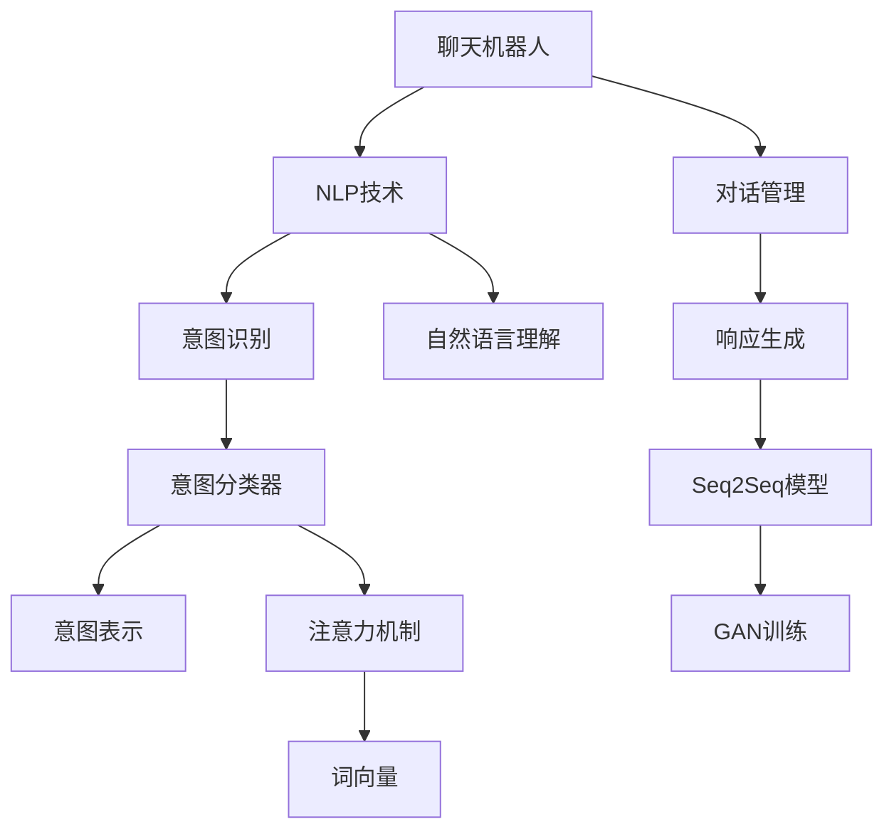

                 

## 1. 背景介绍

### 1.1 问题由来

近年来，客户服务行业面临的挑战日益增多：

1. **客户需求多样性增加**：随着市场竞争加剧，客户期望从简单的问题咨询转变为个性化、多样化的需求，如快速响应、问题解决、情感交流等。

2. **服务成本上升**：企业为了保持服务质量，需要雇佣大量客服人员，培训成本高，员工流失率高。

3. **客户满意度下降**：传统的自助服务模式如IVR、自动回复机等，难以满足客户期望，导致客户满意度下降。

4. **服务效率低下**：人工客服响应时间长，效率低，难以应对高峰期用户激增的挑战。

面对这些挑战，人工智能（AI）技术尤其是聊天机器人（Chatbot），提供了新的解决方案，以提升客户服务效率和满意度。聊天机器人基于自然语言处理（NLP）和机器学习（ML）技术，能够理解和回应客户的问题，提供24/7不间断服务，缓解人工客服压力。

### 1.2 问题核心关键点

聊天机器人的核心在于：

- **自然语言理解**：理解用户输入的自然语言，提取关键信息。
- **意图识别**：识别用户意图，如投诉、咨询、预约等。
- **对话管理**：维持对话上下文，动态调整对话策略。
- **响应生成**：根据用户意图生成符合语境的回答。

这些核心能力使得聊天机器人能够在各种场景下提供高效、个性化的服务，提升客户体验。

## 2. 核心概念与联系

### 2.1 核心概念概述

为更好地理解聊天机器人的工作原理和优化方向，本节将介绍几个密切相关的核心概念：

- **聊天机器人（Chatbot）**：基于NLP和ML技术，能够与用户进行自然语言交互的系统。常见的聊天机器人包括基于规则、基于统计、基于深度学习等。

- **自然语言处理（NLP）**：使计算机能够理解和处理人类自然语言的技术。核心任务包括分词、词性标注、命名实体识别、情感分析等。

- **意图识别（Intent Recognition）**：通过分析用户输入，识别用户的具体意图。常见的意图识别方法包括规则匹配、机器学习分类器、注意力机制等。

- **对话管理（Dialog Management）**：维持对话上下文，确保对话流畅进行。包括对话状态跟踪、对话策略生成等。

- **响应生成（Response Generation）**：根据用户意图生成符合语境的回答。包括基于模板的生成、基于深度学习的生成等。

- **序列到序列（Seq2Seq）模型**：一种经典的NLP模型，用于将输入序列映射到输出序列，常用于聊天机器人响应生成。

- **生成对抗网络（GAN）**：一种能够生成高质量文本的模型，常用于聊天机器人训练。

这些核心概念之间的逻辑关系可以通过以下Mermaid流程图来展示：



这个流程图展示聊天机器人的核心概念及其之间的关系：

1. 聊天机器人通过NLP技术理解用户输入。
2. 意图识别技术从用户输入中提取出意图，转化为意图表示。
3. 对话管理技术根据当前对话状态，动态生成对话策略。
4. 响应生成技术根据意图生成回答，通过Seq2Seq或GAN模型生成自然语言。

这些概念共同构成了聊天机器人的核心框架，使得机器人能够与用户进行流畅、高效的交互。

## 3. 核心算法原理 & 具体操作步骤
### 3.1 算法原理概述

聊天机器人的核心算法原理可以概括为：自然语言理解、意图识别、对话管理和响应生成。其中，意图识别和对话管理是关键。

- **自然语言理解**：利用分词、词性标注、命名实体识别等技术，将用户输入转换为机器可理解的形式。
- **意图识别**：使用机器学习算法，如分类器、注意力机制等，从用户输入中提取意图，转化为意图表示。
- **对话管理**：通过状态跟踪、对话策略生成等技术，维持对话上下文，动态调整对话策略。
- **响应生成**：基于Seq2Seq模型或GAN模型，生成符合语境的回答。

### 3.2 算法步骤详解

基于深度学习的聊天机器人开发一般包括以下几个关键步骤：

**Step 1: 数据准备与预处理**
- 收集并标注大量对话数据，包括用户输入、意图标签和响应等。
- 对文本进行分词、词性标注、命名实体识别等预处理。

**Step 2: 模型选择与训练**
- 选择合适的意图识别和响应生成模型。
- 使用标注数据训练意图识别模型，生成意图表示。
- 使用标注数据和生成模型训练对话管理策略，生成对话策略。
- 使用意图表示和对话策略，训练响应生成模型，生成回答。

**Step 3: 对话流程设计与实现**
- 设计对话流程，包括对话开始、意图识别、响应生成等步骤。
- 实现对话管理模块，负责维持对话状态和生成策略。
- 实现响应生成模块，根据意图生成回答。

**Step 4: 系统集成与测试**
- 将意图识别、对话管理和响应生成模块集成到聊天机器人系统中。
- 进行系统测试，确保各个模块协同工作。
- 在真实环境中进行用户测试，收集反馈，不断优化模型和对话策略。

**Step 5: 部署与维护**
- 将聊天机器人系统部署到生产环境，提供服务。
- 持续监控系统性能，收集用户反馈。
- 定期更新模型和对话策略，提升系统表现。

以上是基于深度学习的聊天机器人开发的一般流程。在实际应用中，还需要根据具体任务和数据特点，对各个环节进行优化设计，如改进训练目标函数，引入更多的正则化技术，搜索最优的超参数组合等，以进一步提升机器人性能。

### 3.3 算法优缺点

聊天机器人的基于深度学习的实现方法具有以下优点：

- **高效自动化**：自动化处理大量对话数据，减少人工干预。
- **多轮对话**：能够处理多轮对话，提供更连贯的对话体验。
- **可扩展性**：易于集成到各种服务系统中，适应不同场景。
- **自我改进**：通过用户反馈和不断迭代，持续优化。

同时，该方法也存在一定的局限性：

- **数据依赖**：训练效果依赖于标注数据的质量和数量。
- **模型复杂度**：模型规模较大，训练和推理资源消耗高。
- **响应多样性**：生成的回答较为模板化，不够灵活。
- **用户体验**：有时无法理解复杂或模糊的用户输入。

尽管存在这些局限性，但就目前而言，基于深度学习的聊天机器人技术仍是最主流的方法。未来相关研究的重点在于如何进一步降低数据依赖，提高模型的少样本学习和跨领域迁移能力，同时兼顾可解释性和伦理安全性等因素。

### 3.4 算法应用领域

聊天机器人技术已经在诸多领域得到了应用，包括但不限于：

- **客户服务**：提供24/7不间断服务，缓解人工客服压力。
- **电子商务**：引导用户购物、解答产品问题、处理订单。
- **金融服务**：提供投资咨询、理财建议、客户投诉处理。
- **医疗健康**：预约挂号、健康咨询、心理辅导。
- **教育培训**：答疑解惑、提供学习资源、自动化评估。
- **企业内部沟通**：知识库查询、会议安排、内部沟通。

除了这些经典应用外，聊天机器人还被创新性地应用到更多场景中，如智能家居、智能客服、智能助手等，为各行各业带来了新的变革。

## 4. 数学模型和公式 & 详细讲解 & 举例说明
### 4.1 数学模型构建

本节将使用数学语言对基于深度学习的聊天机器人进行更加严格的刻画。

假设聊天机器人系统的输入为 $x$，输出为 $y$，目标为 $t$。其中 $x$ 是用户输入的文本，$y$ 是机器生成的回答，$t$ 是用户的意图标签。

定义系统的损失函数为：

$$
\mathcal{L}(\theta) = \frac{1}{N}\sum_{i=1}^N \ell(y_i, t_i)
$$

其中 $\ell(y_i, t_i)$ 为损失函数，用于衡量模型预测的准确性。在聊天机器人中，常用的损失函数包括交叉熵损失、均方误差损失等。

基于Seq2Seq模型的聊天机器人训练过程，可以表示为：

- **编码器**：将用户输入 $x$ 编码为向量 $h$。
- **解码器**：根据编码向量 $h$ 和注意力机制，生成回答 $y$。
- **解码器损失**：计算解码器生成的回答与用户意图的差距。

数学上，Seq2Seq模型的训练目标可以表示为：

$$
\min_{\theta} \mathcal{L}(\theta) = \min_{\theta} \mathbb{E}_{(x, y, t)}[\ell(y, t)]
$$

其中 $\theta$ 为模型参数，$\mathbb{E}$ 表示期望。

### 4.2 公式推导过程

以基于Seq2Seq模型的聊天机器人为例，推导其训练目标函数。

假设编码器输入为 $x = (x_1, x_2, ..., x_n)$，解码器输出为 $y = (y_1, y_2, ..., y_m)$，其中 $n$ 为输入长度，$m$ 为输出长度。假设 $\theta$ 为编码器和解码器的参数，则编码器的输出为 $h = \mathcal{E}(x, \theta)$，解码器的输出为 $y = \mathcal{D}(h, \theta)$。

基于Seq2Seq模型的损失函数为：

$$
\ell(y, t) = \frac{1}{m}\sum_{i=1}^m \ell(y_i, t_i)
$$

其中 $\ell(y_i, t_i)$ 为解码器在输出位置 $i$ 上的损失。常用的损失函数包括交叉熵损失：

$$
\ell(y_i, t_i) = -\log\frac{y_i}{\sum_j y_j}
$$

训练目标函数可以表示为：

$$
\mathcal{L}(\theta) = \frac{1}{N}\sum_{i=1}^N \ell(y_i, t_i)
$$

在训练过程中，通过对目标函数求导，使用梯度下降等优化算法，不断更新模型参数 $\theta$，最小化损失函数，使得模型预测的响应与用户意图更加一致。

### 4.3 案例分析与讲解

**案例分析：电商客服聊天机器人**

电商客服聊天机器人通过分析用户输入，识别其购物意图，如查询商品、购买咨询、投诉等，并根据意图提供相应的回答。

1. **意图识别**
   - 收集并标注大量电商客服对话数据，包括用户输入、意图标签和响应等。
   - 使用LSTM或Transformer等模型，从用户输入中提取意图表示，转化为向量 $h$。
   - 使用分类器或注意力机制，将意图表示映射到意图标签 $t$。

2. **对话管理**
   - 设计对话流程，包括对话开始、意图识别、响应生成等步骤。
   - 实现对话管理模块，负责维持对话状态和生成策略。
   - 对话管理策略可以基于规则或神经网络生成。

3. **响应生成**
   - 使用Seq2Seq模型或GAN模型，根据意图生成回答 $y$。
   - Seq2Seq模型由编码器和解码器组成，能够将输入序列映射到输出序列。
   - GAN模型可以通过对抗训练生成高质量的自然语言回答。

4. **系统集成与测试**
   - 将意图识别、对话管理和响应生成模块集成到聊天机器人系统中。
   - 进行系统测试，确保各个模块协同工作。
   - 在真实环境中进行用户测试，收集反馈，不断优化模型和对话策略。

## 5. 项目实践：代码实例和详细解释说明
### 5.1 开发环境搭建

在进行聊天机器人项目实践前，我们需要准备好开发环境。以下是使用Python进行PyTorch开发的环境配置流程：

1. 安装Anaconda：从官网下载并安装Anaconda，用于创建独立的Python环境。

2. 创建并激活虚拟环境：
```bash
conda create -n chatbot-env python=3.8 
conda activate chatbot-env
```

3. 安装PyTorch：根据CUDA版本，从官网获取对应的安装命令。例如：
```bash
conda install pytorch torchvision torchaudio cudatoolkit=11.1 -c pytorch -c conda-forge
```

4. 安装Transformers库：
```bash
pip install transformers
```

5. 安装各类工具包：
```bash
pip install numpy pandas scikit-learn matplotlib tqdm jupyter notebook ipython
```

完成上述步骤后，即可在`chatbot-env`环境中开始聊天机器人项目的开发。

### 5.2 源代码详细实现

下面我们以电商客服聊天机器人为例，给出使用Transformers库对BERT模型进行聊天机器人开发的PyTorch代码实现。

首先，定义电商客服任务的数据处理函数：

```python
from transformers import BertTokenizer
from torch.utils.data import Dataset
import torch

class EcommerceChatDataset(Dataset):
    def __init__(self, texts, intents, tokenizer, max_len=128):
        self.texts = texts
        self.intents = intents
        self.tokenizer = tokenizer
        self.max_len = max_len
        
    def __len__(self):
        return len(self.texts)
    
    def __getitem__(self, item):
        text = self.texts[item]
        intent = self.intents[item]
        
        encoding = self.tokenizer(text, return_tensors='pt', max_length=self.max_len, padding='max_length', truncation=True)
        input_ids = encoding['input_ids'][0]
        attention_mask = encoding['attention_mask'][0]
        
        # 对token-wise的标签进行编码
        encoded_intent = [intent2id[intent] for intent in intent] 
        encoded_intent.extend([intent2id['O']] * (self.max_len - len(encoded_intent)))
        labels = torch.tensor(encoded_intent, dtype=torch.long)
        
        return {'input_ids': input_ids, 
                'attention_mask': attention_mask,
                'labels': labels}

# 标签与id的映射
intent2id = {'O': 0, 'B-PER': 1, 'I-PER': 2, 'B-LOC': 3, 'I-LOC': 4, 'B-ORG': 5, 'I-ORG': 6, 'BUY': 7, 'ASK': 8, 'COMPLAIN': 9, 'QUERY': 10}
id2intent = {v: k for k, v in intent2id.items()}

# 创建dataset
tokenizer = BertTokenizer.from_pretrained('bert-base-cased')

train_dataset = EcommerceChatDataset(train_texts, train_intents, tokenizer)
dev_dataset = EcommerceChatDataset(dev_texts, dev_intents, tokenizer)
test_dataset = EcommerceChatDataset(test_texts, test_intents, tokenizer)
```

然后，定义模型和优化器：

```python
from transformers import BertForTokenClassification, AdamW

model = BertForTokenClassification.from_pretrained('bert-base-cased', num_labels=len(intent2id))

optimizer = AdamW(model.parameters(), lr=2e-5)
```

接着，定义训练和评估函数：

```python
from torch.utils.data import DataLoader
from tqdm import tqdm
from sklearn.metrics import classification_report

device = torch.device('cuda') if torch.cuda.is_available() else torch.device('cpu')
model.to(device)

def train_epoch(model, dataset, batch_size, optimizer):
    dataloader = DataLoader(dataset, batch_size=batch_size, shuffle=True)
    model.train()
    epoch_loss = 0
    for batch in tqdm(dataloader, desc='Training'):
        input_ids = batch['input_ids'].to(device)
        attention_mask = batch['attention_mask'].to(device)
        labels = batch['labels'].to(device)
        model.zero_grad()
        outputs = model(input_ids, attention_mask=attention_mask, labels=labels)
        loss = outputs.loss
        epoch_loss += loss.item()
        loss.backward()
        optimizer.step()
    return epoch_loss / len(dataloader)

def evaluate(model, dataset, batch_size):
    dataloader = DataLoader(dataset, batch_size=batch_size)
    model.eval()
    preds, labels = [], []
    with torch.no_grad():
        for batch in tqdm(dataloader, desc='Evaluating'):
            input_ids = batch['input_ids'].to(device)
            attention_mask = batch['attention_mask'].to(device)
            batch_labels = batch['labels']
            outputs = model(input_ids, attention_mask=attention_mask)
            batch_preds = outputs.logits.argmax(dim=2).to('cpu').tolist()
            batch_labels = batch_labels.to('cpu').tolist()
            for pred_tokens, label_tokens in zip(batch_preds, batch_labels):
                pred_intents = [id2intent[_id] for _id in pred_tokens]
                label_intents = [id2intent[_id] for _id in label_tokens]
                preds.append(pred_intents[:len(label_intents)])
                labels.append(label_intents)
                
    print(classification_report(labels, preds))
```

最后，启动训练流程并在测试集上评估：

```python
epochs = 5
batch_size = 16

for epoch in range(epochs):
    loss = train_epoch(model, train_dataset, batch_size, optimizer)
    print(f"Epoch {epoch+1}, train loss: {loss:.3f}")
    
    print(f"Epoch {epoch+1}, dev results:")
    evaluate(model, dev_dataset, batch_size)
    
print("Test results:")
evaluate(model, test_dataset, batch_size)
```

以上就是使用PyTorch对BERT进行电商客服聊天机器人开发的完整代码实现。可以看到，得益于Transformers库的强大封装，我们可以用相对简洁的代码完成BERT模型的加载和微调。

### 5.3 代码解读与分析

让我们再详细解读一下关键代码的实现细节：

**EcommerceChatDataset类**：
- `__init__`方法：初始化文本、意图、分词器等关键组件。
- `__len__`方法：返回数据集的样本数量。
- `__getitem__`方法：对单个样本进行处理，将文本输入编码为token ids，将意图编码为数字，并对其进行定长padding，最终返回模型所需的输入。

**intent2id和id2intent字典**：
- 定义了意图与数字id之间的映射关系，用于将token-wise的预测结果解码回真实的意图。

**训练和评估函数**：
- 使用PyTorch的DataLoader对数据集进行批次化加载，供模型训练和推理使用。
- 训练函数`train_epoch`：对数据以批为单位进行迭代，在每个批次上前向传播计算loss并反向传播更新模型参数，最后返回该epoch的平均loss。
- 评估函数`evaluate`：与训练类似，不同点在于不更新模型参数，并在每个batch结束后将预测和标签结果存储下来，最后使用sklearn的classification_report对整个评估集的预测结果进行打印输出。

**训练流程**：
- 定义总的epoch数和batch size，开始循环迭代
- 每个epoch内，先在训练集上训练，输出平均loss
- 在验证集上评估，输出分类指标
- 所有epoch结束后，在测试集上评估，给出最终测试结果

可以看到，PyTorch配合Transformers库使得BERT微调的代码实现变得简洁高效。开发者可以将更多精力放在数据处理、模型改进等高层逻辑上，而不必过多关注底层的实现细节。

当然，工业级的系统实现还需考虑更多因素，如模型的保存和部署、超参数的自动搜索、更灵活的任务适配层等。但核心的微调范式基本与此类似。

## 6. 实际应用场景
### 6.1 智能客服系统

基于大语言模型微调的对话技术，可以广泛应用于智能客服系统的构建。传统客服往往需要配备大量人力，高峰期响应缓慢，且一致性和专业性难以保证。而使用微调后的对话模型，可以7x24小时不间断服务，快速响应客户咨询，用自然流畅的语言解答各类常见问题。

在技术实现上，可以收集企业内部的历史客服对话记录，将问题和最佳答复构建成监督数据，在此基础上对预训练对话模型进行微调。微调后的对话模型能够自动理解用户意图，匹配最合适的答案模板进行回复。对于客户提出的新问题，还可以接入检索系统实时搜索相关内容，动态组织生成回答。如此构建的智能客服系统，能大幅提升客户咨询体验和问题解决效率。

### 6.2 金融舆情监测

金融机构需要实时监测市场舆论动向，以便及时应对负面信息传播，规避金融风险。传统的人工监测方式成本高、效率低，难以应对网络时代海量信息爆发的挑战。基于大语言模型微调的文本分类和情感分析技术，为金融舆情监测提供了新的解决方案。

具体而言，可以收集金融领域相关的新闻、报道、评论等文本数据，并对其进行主题标注和情感标注。在此基础上对预训练语言模型进行微调，使其能够自动判断文本属于何种主题，情感倾向是正面、中性还是负面。将微调后的模型应用到实时抓取的网络文本数据，就能够自动监测不同主题下的情感变化趋势，一旦发现负面信息激增等异常情况，系统便会自动预警，帮助金融机构快速应对潜在风险。

### 6.3 个性化推荐系统

当前的推荐系统往往只依赖用户的历史行为数据进行物品推荐，无法深入理解用户的真实兴趣偏好。基于大语言模型微调技术，个性化推荐系统可以更好地挖掘用户行为背后的语义信息，从而提供更精准、多样的推荐内容。

在实践中，可以收集用户浏览、点击、评论、分享等行为数据，提取和用户交互的物品标题、描述、标签等文本内容。将文本内容作为模型输入，用户的后续行为（如是否点击、购买等）作为监督信号，在此基础上微调预训练语言模型。微调后的模型能够从文本内容中准确把握用户的兴趣点。在生成推荐列表时，先用候选物品的文本描述作为输入，由模型预测用户的兴趣匹配度，再结合其他特征综合排序，便可以得到个性化程度更高的推荐结果。

### 6.4 未来应用展望

随着大语言模型微调技术的发展，其在更多领域的应用前景将愈加广阔。

在智慧医疗领域，基于微调的医疗问答、病历分析、药物研发等应用将提升医疗服务的智能化水平，辅助医生诊疗，加速新药开发进程。

在智能教育领域，微调技术可应用于作业批改、学情分析、知识推荐等方面，因材施教，促进教育公平，提高教学质量。

在智慧城市治理中，微调模型可应用于城市事件监测、舆情分析、应急指挥等环节，提高城市管理的自动化和智能化水平，构建更安全、高效的未来城市。

此外，在企业生产、社会治理、文娱传媒等众多领域，基于大模型微调的人工智能应用也将不断涌现，为经济社会发展注入新的动力。相信随着技术的日益成熟，微调方法将成为人工智能落地应用的重要范式，推动人工智能技术在垂直行业的规模化落地。

## 7. 工具和资源推荐
### 7.1 学习资源推荐

为了帮助开发者系统掌握聊天机器人技术的基础知识和高级应用，这里推荐一些优质的学习资源：

1. 《深度学习入门：基于Python的理论与实现》系列博文：由大模型技术专家撰写，介绍了深度学习的基础理论和实现方法，是理解聊天机器人技术的必备基础。

2. Coursera《自然语言处理与深度学习》课程：由斯坦福大学开设的NLP明星课程，内容涵盖NLP基本概念、深度学习模型等，适合初学者入门。

3. 《Seq2Seq模型理论与实践》书籍：介绍了Seq2Seq模型的原理、训练方法和应用场景，是理解聊天机器人技术的关键书籍。

4. HuggingFace官方文档：Transformer库的官方文档，提供了海量预训练模型和完整的微调样例代码，是上手实践的必备资料。

5. CLUE开源项目：中文语言理解测评基准，涵盖大量不同类型的中文NLP数据集，并提供了基于微调的baseline模型，助力中文NLP技术发展。

通过对这些资源的学习实践，相信你一定能够快速掌握聊天机器人技术的精髓，并用于解决实际的NLP问题。
###  7.2 开发工具推荐

高效的开发离不开优秀的工具支持。以下是几款用于聊天机器人开发的常用工具：

1. PyTorch：基于Python的开源深度学习框架，灵活动态的计算图，适合快速迭代研究。大部分预训练语言模型都有PyTorch版本的实现。

2. TensorFlow：由Google主导开发的开源深度学习框架，生产部署方便，适合大规模工程应用。同样有丰富的预训练语言模型资源。

3. Transformers库：HuggingFace开发的NLP工具库，集成了众多SOTA语言模型，支持PyTorch和TensorFlow，是进行聊天机器人开发的利器。

4. Weights & Biases：模型训练的实验跟踪工具，可以记录和可视化模型训练过程中的各项指标，方便对比和调优。与主流深度学习框架无缝集成。

5. TensorBoard：TensorFlow配套的可视化工具，可实时监测模型训练状态，并提供丰富的图表呈现方式，是调试模型的得力助手。

6. Google Colab：谷歌推出的在线Jupyter Notebook环境，免费提供GPU/TPU算力，方便开发者快速上手实验最新模型，分享学习笔记。

合理利用这些工具，可以显著提升聊天机器人微调的开发效率，加快创新迭代的步伐。

### 7.3 相关论文推荐

聊天机器人技术的发展源于学界的持续研究。以下是几篇奠基性的相关论文，推荐阅读：

1. Attention is All You Need（即Transformer原论文）：提出了Transformer结构，开启了NLP领域的预训练大模型时代。

2. Seq2Seq: Sequence to Sequence Learning with Neural Networks：提出了Seq2Seq模型，用于序列到序列的转换，是聊天机器人核心技术之一。

3. GPT-3：展示了大模型在多轮对话、复杂指令执行等任务上的强大能力，引发了对于通用人工智能的新一轮思考。

4. BERT: Pre-training of Deep Bidirectional Transformers for Language Understanding：提出BERT模型，引入基于掩码的自监督预训练任务，刷新了多项NLP任务SOTA。

5. Transformer-XL: Attentive Language Models Beyond a Fixed-Length Context：提出了Transformer-XL模型，解决了长序列问题，进一步提升了聊天机器人的对话效果。

6. GPT-4：展示了最新的语言模型在多轮对话、图像理解、跨模态学习等任务上的突破，为聊天机器人技术带来了新的希望。

这些论文代表了大语言模型微调技术的发展脉络。通过学习这些前沿成果，可以帮助研究者把握学科前进方向，激发更多的创新灵感。

## 8. 总结：未来发展趋势与挑战

### 8.1 总结

本文对基于深度学习的聊天机器人进行了全面系统的介绍。首先阐述了聊天机器人技术的背景和重要性，明确了技术在客户服务、金融舆情、个性化推荐等众多领域的应用价值。其次，从原理到实践，详细讲解了聊天机器人模型的构建和训练过程，给出了微调任务开发的完整代码实例。同时，本文还广泛探讨了聊天机器人技术在实际应用场景中的应用前景，展示了技术的广阔前景。此外，本文精选了聊天机器人技术的各类学习资源，力求为开发者提供全方位的技术指引。

通过本文的系统梳理，可以看到，基于深度学习的聊天机器人技术正在成为NLP领域的重要范式，极大地拓展了自然语言理解和生成模型的应用边界，为构建人机协同的智能系统提供了新的解决方案。未来，伴随技术的不断演进，聊天机器人技术必将在更广阔的领域展现其强大能力，深刻影响人类的生产生活方式。

### 8.2 未来发展趋势

展望未来，聊天机器人技术将呈现以下几个发展趋势：

1. **多轮对话能力提升**：多轮对话是聊天机器人技术的关键，未来的研究将集中在提升模型的多轮对话理解和生成能力上，使得机器人能够更加自然地与用户进行交互。

2. **情感智能增强**：情感识别和生成是聊天机器人的重要任务之一，未来的技术将进一步提升机器人的情感理解和生成能力，使得机器人能够更加人性化和富有同理心。

3. **跨模态对话技术**：聊天机器人技术将与图像、语音、视频等多模态数据进行深度融合，实现更加全面的信息理解和生成，提升用户体验。

4. **知识图谱结合**：将知识图谱与自然语言理解技术结合，使得机器人能够利用外部知识进行推理和决策，提升其智能水平。

5. **模型泛化能力增强**：通过迁移学习和多领域数据融合，提升机器人的泛化能力，使其能够在不同的应用场景中保持一致的性能。

6. **模型可解释性加强**：未来聊天机器人技术将更加注重模型的可解释性和透明性，使得用户和开发者能够理解模型的决策过程，增强系统的信任度。

以上趋势凸显了聊天机器人技术的广阔前景。这些方向的探索发展，必将进一步提升聊天机器人的智能水平和应用范围，为构建更加智能化的服务系统奠定基础。

### 8.3 面临的挑战

尽管聊天机器人技术已经取得了瞩目成就，但在迈向更加智能化、普适化应用的过程中，它仍面临着诸多挑战：

1. **数据依赖**：训练效果依赖于标注数据的质量和数量。对于长尾应用场景，获取高质量标注数据成本较高，数据偏差问题也需解决。

2. **模型鲁棒性不足**：在实际应用中，机器人面对不同来源、不同风格的输入时，泛化性能往往较差。如何提高模型的鲁棒性，避免误识别，还需要更多的研究。

3. **用户接受度**：尽管聊天机器人技术日益成熟，但部分用户仍然对其效果和交互体验持怀疑态度。如何提升用户的接受度和满意度，还需不断改进。

4. **隐私和伦理问题**：聊天机器人涉及用户的隐私数据和敏感信息，如何在数据收集和使用过程中保护用户隐私，需制定合理的伦理规范。

5. **计算资源消耗**：聊天机器人的深度学习模型复杂度高，训练和推理资源消耗大，如何在保证性能的同时优化资源利用，还需更多优化方法。

6. **模型安全性**：聊天机器人可能被恶意利用，如生成有害信息、攻击系统等。如何保证模型的安全性，还需加强算法和数据的安全防护。

面对这些挑战，未来的研究需要在各个环节进行全面优化，才能进一步推动聊天机器人技术的成熟和发展。

### 8.4 研究展望

未来聊天机器人技术的研究方向包括以下几个方面：

1. **无监督学习**：探索无监督和半监督学习方法，减少对标注数据的依赖，提升机器人的泛化能力。

2. **模型压缩与优化**：通过模型压缩和量化技术，减少计算资源消耗，提升模型的实时性和可部署性。

3. **迁移学习**：通过跨领域、跨模态的数据融合，提升机器人的泛化能力和多模态对话能力。

4. **模型可解释性**：通过可解释性模型和数据可视化技术，增强机器人的透明性和可信度。

5. **隐私保护**：探索差分隐私等隐私保护技术，确保用户数据的安全和隐私。

6. **伦理规范**：制定和推广聊天机器人的伦理规范，确保技术应用的社会责任。

这些研究方向将引领聊天机器人技术迈向更高的台阶，为构建更加智能、普适、可信的服务系统提供技术保障。

## 9. 附录：常见问题与解答

**Q1：聊天机器人如何理解用户输入？**

A: 聊天机器人通过自然语言处理技术理解用户输入。常用的处理步骤包括分词、词性标注、命名实体识别、情感分析等。这些步骤将用户输入转化为机器可理解的形式，以便进行意图识别和对话管理。

**Q2：聊天机器人如何进行意图识别？**

A: 意图识别是聊天机器人的核心任务之一，常用的方法包括规则匹配、机器学习分类器、注意力机制等。其中，机器学习分类器如LSTM、Transformer等，通过标注数据训练，能够从用户输入中提取意图，转化为向量表示。

**Q3：聊天机器人如何进行对话管理？**

A: 对话管理用于维持对话上下文，动态调整对话策略。常用的方法包括状态跟踪、对话策略生成等。对话管理模块需要根据当前对话状态和用户意图，决定下一步的对话策略。

**Q4：聊天机器人如何进行响应生成？**

A: 响应生成是聊天机器人的最终输出，常用的方法包括基于模板的生成和基于深度学习的生成。其中，基于深度学习的生成方法如Seq2Seq模型、GAN模型等，能够从意图表示生成自然语言回答。

**Q5：聊天机器人在实际应用中面临哪些挑战？**

A: 聊天机器人在实际应用中面临的主要挑战包括数据依赖、模型鲁棒性不足、用户接受度、隐私和伦理问题、计算资源消耗和模型安全性等。解决这些问题需要从数据、算法、系统架构等多个方面进行综合优化。

**Q6：聊天机器人技术在未来的发展方向有哪些？**

A: 未来聊天机器人技术的发展方向包括提升多轮对话能力、增强情感智能、实现跨模态对话、结合知识图谱、增强泛化能力和可解释性等。这些方向的探索将进一步提升聊天机器人的智能水平和应用范围。

作者：禅与计算机程序设计艺术 / Zen and the Art of Computer Programming

