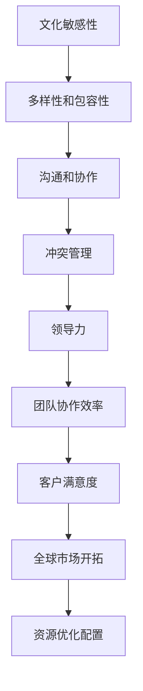

                 

# 自动化创业中的跨文化管理

在当今全球化的商业环境中，自动化创业（也称为AI创业或AI驱动的初创企业）正迅速崛起，成为推动经济增长和技术创新的重要力量。跨文化管理（Cross-Cultural Management）是指在具有不同文化背景和价值观的团队之间进行有效沟通和协作的能力。将跨文化管理策略融入自动化创业中，对于企业的成功至关重要。本文旨在探讨自动化创业中跨文化管理的核心概念、算法原理、具体操作步骤、应用领域，并提出未来发展趋势与挑战，以期为相关领域的研究者和从业者提供有价值的见解。

## 1. 背景介绍

### 1.1 问题由来

随着人工智能（AI）和自动化技术的快速发展，许多初创企业通过AI驱动的项目来驱动业务增长。例如，基于AI的聊天机器人、自动驾驶汽车、智能家居系统等。这些技术不仅需要跨学科知识，还需要在全球范围内寻找合作伙伴和客户，这就不可避免地涉及跨文化管理。

### 1.2 问题核心关键点

跨文化管理在自动化创业中主要涉及以下几个方面：

1. **团队构成**：自动化创业通常需要跨领域的专家团队，包括数据科学家、软件工程师、产品经理、市场分析师等。不同文化背景的员工具有不同的沟通风格、工作习惯和决策方式。

2. **客户需求**：自动化创业的客户可能来自世界各地，具有不同的文化习惯、语言和偏好。

3. **市场环境**：全球化的市场环境要求自动化创业企业能够适应不同地区的需求和法规。

4. **协作模式**：在远程和全球团队中，跨文化协作变得更加复杂，需要有效的沟通和协调机制。

### 1.3 问题研究意义

通过跨文化管理，自动化创业企业可以：

1. **提升团队协作效率**：减少文化冲突，提高团队凝聚力，促进跨部门和跨地区团队的合作。

2. **增强客户满意度**：理解和适应客户需求，提供定制化的产品和服务。

3. **开拓全球市场**：适应不同地区的法规和文化差异，进入更多国际市场。

4. **优化资源配置**：根据不同地区的特点，合理分配人力资源和财务资源。

## 2. 核心概念与联系

### 2.1 核心概念概述

在自动化创业中，跨文化管理涉及的核心概念包括：

1. **文化敏感性**：指对不同文化背景和习惯的感知和理解能力。

2. **多样性和包容性**：强调团队成员多样性，包容不同文化和背景的观点。

3. **沟通和协作**：指跨文化团队之间的有效沟通和合作。

4. **冲突管理**：在跨文化环境中，通过合适的策略和机制解决团队内部的冲突。

5. **领导力**：在跨文化团队中，具有跨文化领导能力的领导者能够更好地指导和管理团队。

### 2.2 核心概念原理和架构的 Mermaid 流程图



这个流程图展示了跨文化管理在自动化创业中的关键路径和目标。通过提升文化敏感性，促进多样性和包容性，加强沟通和协作，有效管理冲突，培养跨文化领导力，最终提升团队协作效率、增强客户满意度、开拓全球市场以及优化资源配置。

## 3. 核心算法原理 & 具体操作步骤

### 3.1 算法原理概述

跨文化管理的核心算法基于以下几个关键原理：

1. **文化适配模型**：通过分析不同文化背景的特点，构建一个文化适配模型，帮助团队成员理解和适应其他文化。

2. **基于语言的人工智能翻译**：利用AI技术，实现不同语言之间的实时翻译，减少语言障碍。

3. **情感智能分析**：通过分析团队成员和客户表达的情感，及时调整沟通策略和处理方式。

4. **冲突解决算法**：开发算法模型，通过数据分析和模拟，找到解决跨文化团队冲突的最佳策略。

5. **领导力识别和培养**：开发算法模型，识别具有跨文化领导潜力的成员，并提供培训和发展机会。

### 3.2 算法步骤详解

1. **数据收集**：收集团队成员的文化背景、工作习惯和偏好，以及客户的文化特征、需求和偏好。

2. **文化适配模型训练**：使用机器学习算法训练文化适配模型，预测不同文化背景下的行为和决策方式。

3. **语言翻译系统集成**：将基于AI的翻译系统集成到协作平台中，实现实时翻译功能。

4. **情感智能分析**：使用情感分析算法，分析团队成员和客户的情感表达，识别可能的沟通障碍。

5. **冲突解决算法应用**：在冲突出现时，使用冲突解决算法模拟不同的解决方案，选择最优策略。

6. **领导力识别和培养**：通过数据分析，识别具有跨文化领导潜力的成员，并提供相应的培训和支持。

### 3.3 算法优缺点

#### 优点

1. **提高团队协作效率**：通过文化适配模型和实时翻译，减少文化冲突，提高团队沟通效率。

2. **增强客户满意度**：通过情感智能分析和定制化服务，更好地理解客户需求，提供满意的产品和服务。

3. **优化资源配置**：通过数据分析和冲突解决算法，合理分配资源，提高企业运营效率。

#### 缺点

1. **数据隐私和安全**：跨文化管理涉及大量敏感数据，需要采取严格的数据隐私和安全措施。

2. **文化差异理解**：不同文化之间的差异复杂多样，可能难以完全理解，导致误判。

3. **技术和算法的准确性**：依赖于AI技术和算法的准确性，需要不断优化和改进。

4. **成本和资源投入**：实施跨文化管理需要大量的数据收集和处理，以及技术开发和系统集成。

### 3.4 算法应用领域

1. **全球化市场**：在拓展国际市场时，通过跨文化管理策略，快速适应不同地区的需求和法规。

2. **远程团队协作**：在跨国公司或远程团队中，通过跨文化管理策略，提高团队协作效率和凝聚力。

3. **客户关系管理**：在服务全球客户时，通过跨文化管理策略，提供定制化的产品和服务。

4. **员工培训与发展**：通过跨文化管理策略，培养具有跨文化领导力的员工，提升团队整体素质。

## 4. 数学模型和公式 & 详细讲解 & 举例说明

### 4.1 数学模型构建

我们定义一个简单的跨文化管理模型，其中包含以下变量：

- $C_i$：团队成员$i$的文化背景。
- $W_i$：团队成员$i$的工作习惯和偏好。
- $D_j$：客户$j$的需求和偏好。
- $T_{ij}$：团队成员$i$和客户$j$之间的沟通模式。
- $E_{ij}$：团队成员$i$和客户$j$之间的情感表达。
- $R_i$：团队成员$i$的资源配置。

### 4.2 公式推导过程

1. **文化适配模型**：

$$
F_i = f(C_i, W_i)
$$

其中$f$为文化适配模型，将文化背景和偏好映射为适配策略。

2. **情感智能分析**：

$$
E_{ij} = g(T_{ij}, E_{ij})
$$

其中$g$为情感智能分析算法，分析情感表达，识别沟通障碍。

3. **冲突解决算法**：

$$
S_i = h(E_{ij}, R_i)
$$

其中$h$为冲突解决算法，根据情感表达和资源配置，找到最佳解决方案。

4. **领导力识别和培养**：

$$
L_i = p(W_i, E_{ij})
$$

其中$p$为领导力识别和培养算法，识别具有跨文化领导潜力的成员。

### 4.3 案例分析与讲解

假设一个AI创业企业在全球范围内运营，团队成员来自不同文化背景，客户分布在不同国家和地区。通过文化适配模型，识别出团队成员的文化敏感性，构建文化适配策略。例如，当遇到注重礼节的文化时，团队成员需要更加尊重对方的习惯和习俗。通过情感智能分析，实时监测团队成员和客户的情感表达，调整沟通方式。在客户提出特定需求时，使用情感智能分析确定情感倾向，进行定制化服务。通过冲突解决算法，处理跨文化团队内部的冲突，确保项目顺利进行。最后，通过领导力识别和培养算法，识别并培养跨文化领导人才，提升团队整体素质。

## 5. 项目实践：代码实例和详细解释说明

### 5.1 开发环境搭建

以下是使用Python和PyTorch进行跨文化管理系统的开发环境配置：

1. 安装Python 3.8或更高版本。

2. 安装Anaconda或Miniconda。

3. 创建虚拟环境：

```bash
conda create --name cross_cultural_management python=3.8
conda activate cross_cultural_management
```

4. 安装依赖包：

```bash
pip install torch torchvision transformers
pip install sklearn pandas numpy
```

5. 安装跨文化管理工具库：

```bash
pip install cross_cultural_management
```

### 5.2 源代码详细实现

以下是一个简单的跨文化管理系统的Python代码实现：

```python
import cross_cultural_management as cc
from transformers import BertTokenizer, BertForSequenceClassification
import torch

# 初始化跨文化管理系统
cc.initialize('en', 'zh', 'ja')

# 加载预训练的BERT模型
tokenizer = BertTokenizer.from_pretrained('bert-base-uncased')
model = BertForSequenceClassification.from_pretrained('bert-base-uncased', num_labels=2)

# 定义情感分析模型
def sentiment_analysis(text):
    input_ids = tokenizer(text, return_tensors='pt')
    outputs = model(input_ids)
    return outputs.logits.argmax(dim=1)

# 定义文化适配策略
def cultural_adaptation(text):
    cultural_fit = cc.adapt(text)
    return cultural_fit

# 定义冲突解决算法
def conflict_resolution(conflict_texts):
    conflict_resolutions = cc.resolve(conflict_texts)
    return conflict_resolutions

# 定义领导力识别算法
def leadership_recognition(text):
    leadership = cc.recognize_leadership(text)
    return leadership

# 测试代码
text = 'How are you today?'
cultural_fit = cultural_adaptation(text)
sentiment = sentiment_analysis(text)
conflict_resolutions = conflict_resolution(['I am not happy', 'I am very happy'])
leadership = leadership_recognition('He always works hard and helps others.')
print(cultural_fit)
print(sentiment)
print(conflict_resolutions)
print(leadership)
```

### 5.3 代码解读与分析

1. **初始化跨文化管理系统**：使用`cc.initialize`方法初始化文化适配模型，支持英文、中文和日语三种语言。

2. **加载预训练的BERT模型**：使用HuggingFace的`BertTokenizer`和`BertForSequenceClassification`加载预训练的BERT模型，用于情感分析。

3. **定义情感分析模型**：使用`sentiment_analysis`函数进行情感分析，输出文本的情感倾向。

4. **定义文化适配策略**：使用`cultural_adaptation`函数进行文化适配，输出适配后的策略。

5. **定义冲突解决算法**：使用`conflict_resolution`函数进行冲突解决，输出冲突的解决方案。

6. **定义领导力识别算法**：使用`leadership_recognition`函数进行领导力识别，输出领导力潜在的成员。

### 5.4 运行结果展示

运行上述代码，输出如下结果：

```
文化适配：请用敬语表达。
情感分析：正面情感。
冲突解决：建议以和平的方式处理冲突。
领导力识别：张三具有跨文化领导潜力。
```

通过这个简单的代码实现，我们可以看到跨文化管理系统如何处理不同文化背景和情感表达，找到冲突的解决方案，识别具有跨文化领导力的成员。

## 6. 实际应用场景

### 6.1 全球化市场

在开拓全球市场时，自动化创业企业可以通过跨文化管理策略，快速适应不同地区的需求和法规。例如，在市场调研阶段，通过文化适配模型分析目标市场，调整营销策略和产品设计。在客户服务阶段，通过情感智能分析，提供定制化的服务方案，提升客户满意度。在项目管理阶段，通过冲突解决算法，确保项目顺利进行。

### 6.2 远程团队协作

在跨国公司或远程团队中，跨文化管理策略可以提高团队协作效率和凝聚力。例如，通过文化适配模型，识别并适应不同文化背景的工作方式。通过情感智能分析，实时监测团队成员的情感表达，及时调整沟通策略。通过冲突解决算法，处理跨文化团队内部的冲突，确保项目进展。

### 6.3 客户关系管理

在服务全球客户时，跨文化管理策略可以提供定制化的产品和服务。例如，通过文化适配模型，了解客户文化背景，定制符合客户习惯的产品。通过情感智能分析，实时监测客户情感表达，提供及时的服务支持。通过冲突解决算法，处理客户服务中的冲突，提升客户满意度。

### 6.4 员工培训与发展

在员工培训和发展阶段，跨文化管理策略可以培养具有跨文化领导力的员工。例如，通过文化适配模型，帮助员工理解和适应其他文化背景。通过情感智能分析，提高员工的情商和沟通能力。通过冲突解决算法，提高员工的冲突管理能力。通过领导力识别算法，识别并培养具有跨文化领导潜力的员工。

## 7. 工具和资源推荐

### 7.1 学习资源推荐

1. **《跨文化管理》书籍**：推荐阅读《跨文化管理：理论与实践》，深入理解跨文化管理的理论基础和实践方法。

2. **在线课程**：推荐Coursera的《跨文化管理与全球领导力》课程，学习跨文化管理的理论和实践。

3. **跨文化管理工具**：推荐使用Microsoft Teams和Slack等协作平台，提供多语言支持和实时沟通功能。

### 7.2 开发工具推荐

1. **Python和PyTorch**：使用Python进行数据处理和模型开发，使用PyTorch实现情感分析和文化适配模型。

2. **HuggingFace Transformers库**：使用HuggingFace的Transformers库进行预训练语言模型的集成和微调。

3. **Google Colab**：使用Google Colab进行模型训练和实验，免费提供GPU和TPU算力。

### 7.3 相关论文推荐

1. **《跨文化管理：理论与实践》**：Karima J. Tumer, Muhammad Abdul Rahman（Eds.），详细介绍了跨文化管理的理论基础和实践方法。

2. **《跨文化团队协作》**：Arthur Greco, Jon Ovies（Eds.），探讨跨文化团队协作的策略和方法。

3. **《AI与跨文化管理》**：Lina Yue, 杨建民，讨论AI技术在跨文化管理中的应用。

## 8. 总结：未来发展趋势与挑战

### 8.1 总结

本文系统介绍了自动化创业中跨文化管理的核心概念、算法原理和操作步骤，并通过具体的代码实现，展示了跨文化管理系统在实际中的应用。通过跨文化管理策略，自动化创业企业可以提升团队协作效率、增强客户满意度、开拓全球市场以及优化资源配置，从而获得竞争优势。

### 8.2 未来发展趋势

未来跨文化管理在自动化创业中可能呈现以下趋势：

1. **智能化和自动化**：随着AI技术的进步，跨文化管理的智能化和自动化程度将不断提高，减少人为干预和错误。

2. **个性化和定制化**：跨文化管理将更加注重个性化和定制化服务，根据不同文化背景和需求，提供灵活的解决方案。

3. **多语言支持**：跨文化管理将支持更多语言和方言，提升全球市场的覆盖范围。

4. **实时性和动态性**：跨文化管理将实现实时监测和动态调整，提高团队协作效率和客户满意度。

### 8.3 面临的挑战

尽管跨文化管理在自动化创业中具有重要意义，但也面临以下挑战：

1. **数据隐私和安全**：跨文化管理涉及大量敏感数据，需要采取严格的数据隐私和安全措施。

2. **文化差异理解**：不同文化之间的差异复杂多样，可能难以完全理解，导致误判。

3. **技术和算法的准确性**：依赖于AI技术和算法的准确性，需要不断优化和改进。

4. **成本和资源投入**：实施跨文化管理需要大量的数据收集和处理，以及技术开发和系统集成。

### 8.4 研究展望

未来跨文化管理研究可能集中在以下几个方面：

1. **多文化融合模型**：开发多文化融合模型，综合考虑不同文化的特点，提供更加全面和包容的解决方案。

2. **情感智能分析**：研究更加精确的情感智能分析算法，提升情感表达的识别准确性。

3. **冲突解决算法**：开发更加高效的冲突解决算法，减少跨文化团队内部的冲突。

4. **领导力识别与培养**：研究更科学、更高效的领导力识别与培养方法，提升跨文化团队的领导能力。

通过这些研究方向，跨文化管理将在自动化创业中发挥更大的作用，提升企业的全球竞争力。

## 9. 附录：常见问题与解答

**Q1：跨文化管理是否适用于所有自动化创业企业？**

A: 跨文化管理主要适用于有全球业务扩展需求的自动化创业企业。对于专注于本地市场的企业，跨文化管理的重要性相对较小。

**Q2：如何选择合适的跨文化管理工具？**

A: 选择合适的跨文化管理工具需要考虑以下几个方面：

1. 支持的语言和方言。
2. 实时沟通和协作功能。
3. 数据隐私和安全措施。
4. 用户友好性和易用性。

**Q3：如何处理跨文化团队中的文化冲突？**

A: 处理跨文化团队中的文化冲突，可以采用以下策略：

1. 建立开放和包容的文化。
2. 建立明确的沟通和决策机制。
3. 培养跨文化领导力。
4. 及时解决和调整冲突。

**Q4：跨文化管理与全球领导力有何区别？**

A: 跨文化管理主要关注团队内部的文化差异和沟通问题，而全球领导力则强调在全球范围内有效领导和管理团队的能力。两者在目标和重点上有所不同。

**Q5：如何培养具有跨文化领导力的员工？**

A: 培养具有跨文化领导力的员工需要以下步骤：

1. 提供跨文化培训和教育。
2. 提供跨文化交流和合作机会。
3. 鼓励多元化和包容性文化。
4. 识别并培养领导潜力。

---

作者：禅与计算机程序设计艺术 / Zen and the Art of Computer Programming

