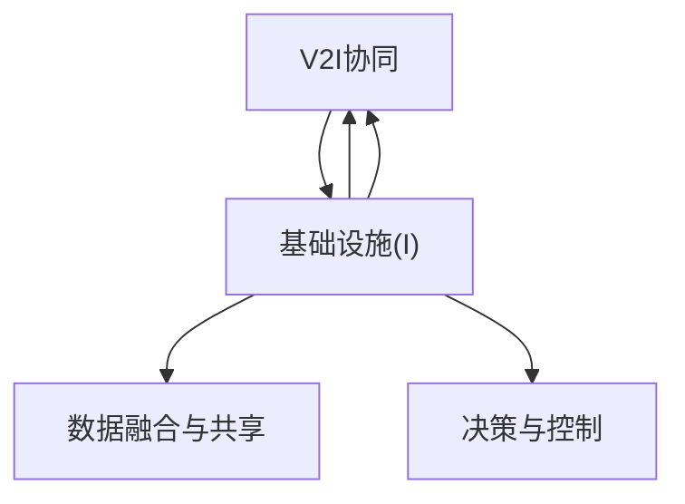

                 

## 1. 背景介绍

### 1.1 问题由来

随着自动驾驶技术的飞速发展，智能交通基础设施（ITS，Intelligent Transportation Systems）成为支撑自动驾驶技术安全、高效运行的重要组成部分。传统的ITS系统主要基于车辆与道路基础设施之间的交互，例如交通信号灯、道路标志、车辆传感器、通信网络等。然而，这些基础设施多以独立方式工作，缺乏协同和互通，无法充分挖掘其潜在的协同效应。因此，如何实现智能交通基础设施的协同，成为当前自动驾驶技术应用中的关键问题。

### 1.2 问题核心关键点

智能交通基础设施协同的核心在于通过技术手段，打破各基础设施之间的壁垒，实现数据、信息、服务的互联互通，从而提升交通系统的整体效率、安全性和智能化水平。这一过程涉及对基础设施的感知、决策、控制、通信和协同机制的全面优化，需要在技术、政策和法规等多个层面进行深入研究和实践。

## 2. 核心概念与联系

### 2.1 核心概念概述

为更好地理解智能交通基础设施协同的技术框架，本节将介绍几个核心概念：

- **智能交通基础设施（ITS）**：一种通过信息通信技术（ICT）实现交通系统的智能化，提高交通效率和安全的综合系统。
- **协同通信网络（V2X）**：车辆与环境（Vehicle-to-Everything, V2X）通信网络，实现车辆与道路基础设施、其他车辆、行人等之间的实时信息交互。
- **车路协同（V2I）**：车辆与基础设施（Vehicle-to-Infrastructure, V2I）协同，通过智能基础设施对车辆进行管理和调度，优化交通流。
- **智能感知与决策**：利用传感器、摄像头等设备对道路环境进行实时监测，通过算法对数据进行处理，实现智能决策和控制。
- **数据融合与共享**：将来自不同源的数据进行融合与共享，提升数据的时效性和可用性。
- **决策与控制**：基于融合后的数据，进行交通流控制、路径规划、速度调节等决策，并通过控制手段实现。

这些核心概念通过物联网、大数据、人工智能等技术手段，相互关联、协同工作，共同构成智能交通基础设施的协同系统。

### 2.2 核心概念原理和架构的 Mermaid 流程图



该流程图展示了车辆、基础设施、通信网络、数据融合与共享、决策与控制之间的交互关系，明确了智能交通基础设施协同的主要环节。

## 3. 核心算法原理 & 具体操作步骤

### 3.1 算法原理概述

智能交通基础设施协同算法主要包含以下几个步骤：

1. **数据采集与预处理**：通过车辆传感器、摄像头等设备采集交通数据，并进行预处理，如去噪、滤波、归一化等。
2. **信息感知与融合**：利用感知算法处理采集到的数据，通过多源数据融合技术提升数据的准确性和全面性。
3. **智能决策与优化**：基于融合后的数据，通过优化算法生成智能决策，如路径规划、交通流量控制等。
4. **控制执行与反馈**：将决策转化为控制命令，执行在基础设施和车辆上，并通过反馈机制实时调整决策。

### 3.2 算法步骤详解

#### 3.2.1 数据采集与预处理

**步骤1：数据采集**
使用车辆上搭载的各种传感器（如雷达、激光雷达、摄像头、GPS等）实时采集道路环境数据，同时获取车辆自身的位置、速度、加速度等状态信息。

**步骤2：数据预处理**
对采集的数据进行初步处理，包括去噪、滤波、数据校正、归一化等，以提升数据质量。

#### 3.2.2 信息感知与融合

**步骤3：信息感知**
通过传感器和摄像头对道路环境进行感知，获取道路标志、交通信号灯、行人、车辆等的状态信息。利用计算机视觉、深度学习等技术对感知数据进行处理，提取道路特征、交通规则等相关信息。

**步骤4：数据融合**
将来自不同传感器和来源的数据进行融合，如将雷达数据与摄像头数据结合，提升数据的时空精度。采用融合算法如卡尔曼滤波、粒子滤波、加权平均等，提升数据的时效性和全面性。

#### 3.2.3 智能决策与优化

**步骤5：智能决策**
基于融合后的数据，利用优化算法生成交通决策，如路径规划、交通流量控制、事故预警等。常用的优化算法包括动态规划、强化学习、多目标优化等。

**步骤6：决策优化**
通过模拟和仿真，对决策进行优化，评估其效果和可行性。采用A/B测试、交叉验证等方法，选择最优决策方案。

#### 3.2.4 控制执行与反馈

**步骤7：控制执行**
将优化后的决策转化为具体的控制命令，如调整交通信号灯、控制路口闸门、调整车道分布等，并通过基础设施执行。

**步骤8：反馈机制**
实时监控执行结果，收集反馈信息，如交通流量、车辆速度、事故发生率等，根据反馈信息调整决策和控制策略，实现闭环控制。

### 3.3 算法优缺点

#### 3.3.1 优点

- **提升交通效率**：通过信息共享和协同决策，有效缓解交通拥堵，提升道路通行效率。
- **增强安全性**：实时感知和决策机制，有效预防交通事故，保障行车安全。
- **提高智能化水平**：利用先进算法和数据融合技术，实现交通系统的智能化管理。
- **降低成本**：通过优化交通流和减少事故率，降低交通管理成本。

#### 3.3.2 缺点

- **数据依赖性高**：需要大量高精度、实时性的数据支持，数据采集和处理成本较高。
- **技术复杂度高**：涉及传感器、通信、控制等多方面的技术，技术实现难度较大。
- **协同机制设计复杂**：需要设计合理的协同机制，确保各基础设施和车辆之间的有效沟通。
- **隐私和安全问题**：大量数据在网络上传输和存储，存在隐私泄露和安全风险。

### 3.4 算法应用领域

智能交通基础设施协同算法在多个领域中具有广泛应用，包括但不限于以下方面：

- **智能交通管理**：通过协同通信网络实现车辆与基础设施之间的信息交互，优化交通流和提高交通效率。
- **智能交通调度**：基于智能感知与决策，实时调整交通信号灯、闸门等基础设施，实现动态交通调度。
- **事故预警与应急响应**：通过数据融合和智能决策，及时预警潜在事故风险，实现快速应急响应。
- **车路协同导航**：通过车路协同技术，实现精准导航和路径优化，提升驾驶体验。
- **智能停车系统**：基于智能感知与决策，优化停车位管理，提升停车效率。

这些应用场景展示了智能交通基础设施协同的广泛潜力和巨大价值。

## 4. 数学模型和公式 & 详细讲解 & 举例说明

### 4.1 数学模型构建

智能交通基础设施协同的数学模型主要涉及以下几个方面：

- **交通流量模型**：描述交通流的变化规律，如 vehicular flow、density、velocity 等。
- **优化模型**：通过目标函数和约束条件，优化交通决策，如路径规划、交通流量控制等。
- **数据融合模型**：融合不同数据源的信息，提升数据的准确性和全面性。
- **协同机制模型**：描述车辆与基础设施之间的通信和决策协同。

### 4.2 公式推导过程

以路径规划为例，基于图论和优化理论，可以构建路径规划模型。假设交通网络为图 $G=(V,E)$，节点 $V$ 表示路口或交叉点，边 $E$ 表示路段，每个路段的通行能力和交通状态由权重 $w_e$ 表示。路径规划问题可以转化为最短路径问题，使用Dijkstra算法或A*算法求解最优路径。

设起点为 $s$，终点为 $t$，目标是最小化路径长度。路径长度 $d(u,v)$ 表示节点 $u$ 到节点 $v$ 的距离，路径总长度 $D(s,t)$ 表示从起点 $s$ 到终点 $t$ 的路径长度。

设 $d^*(s,t)$ 为最优路径长度，$n$ 为节点数，则目标函数为：

$$
\min_{d(s,t)} D(s,t) = \sum_{i=1}^n d_i
$$

约束条件为：

$$
\begin{cases}
d_{u,v} \leq W_{u,v} & \text{容量约束} \\
d_{u,v} \geq 0 & \text{非负约束}
\end{cases}
$$

其中 $W_{u,v}$ 表示路段 $u$ 到 $v$ 的通行能力。

### 4.3 案例分析与讲解

以智能停车系统为例，利用智能感知与决策技术，可以实现停车位的优化管理和智能调度。假设停车位为网格状分布，每个格子的占用状态为 $s_{i,j} \in \{0,1\}$，其中 $s_{i,j}=0$ 表示空闲，$s_{i,j}=1$ 表示被占用。停车位的优化管理问题可以表示为：

$$
\min_{\{s_{i,j}\}} \sum_{i=1}^n \sum_{j=1}^m c_{i,j}s_{i,j}
$$

约束条件为：

$$
\begin{cases}
s_{i,j} \leq S_{i,j} & \text{容量约束} \\
s_{i,j} \geq 0 & \text{非负约束}
\end{cases}
$$

其中 $S_{i,j}$ 表示停车位 $(i,j)$ 的容量，$c_{i,j}$ 表示每个占用停车位的费用。利用整数线性规划（ILP）算法，可以求解最优停车位的占用状态，实现停车位的智能调度。

## 5. 项目实践：代码实例和详细解释说明

### 5.1 开发环境搭建

智能交通基础设施协同系统的开发环境需要涵盖数据采集、信息处理、决策优化、控制执行等多个模块，以下是搭建开发环境的步骤：

1. **数据采集设备**：配备车辆传感器、摄像头、GPS等设备，进行交通数据的实时采集。
2. **数据处理平台**：搭建数据处理平台，包括数据清洗、预处理、存储等模块。
3. **决策优化平台**：搭建优化平台，利用优化算法进行智能决策，生成控制命令。
4. **控制执行平台**：搭建控制执行平台，实现交通信号灯、闸门等的控制。
5. **反馈机制平台**：搭建反馈机制平台，实时监控执行结果，调整决策和控制策略。

### 5.2 源代码详细实现

以智能停车系统为例，以下是使用Python和TensorFlow进行路径规划的代码实现：

```python
import tensorflow as tf
import numpy as np

# 定义图论模型
class GraphModel(tf.keras.Model):
    def __init__(self, num_nodes, num_edges):
        super(GraphModel, self).__init__()
        self.num_nodes = num_nodes
        self.num_edges = num_edges
        self.W = tf.Variable(tf.random.uniform([num_nodes, num_edges], minval=0, maxval=100, dtype=tf.float32))
        
    def call(self, x, adjacency_matrix):
        d = tf.linalg.sparse_dense_matmul(adjacency_matrix, self.W)
        return d
    
# 定义优化问题
class OptimizationProblem(tf.keras.Model):
    def __init__(self, graph_model, cost_matrix):
        super(OptimizationProblem, self).__init__()
        self.graph_model = graph_model
        self.cost_matrix = cost_matrix
        
    def call(self, adjacency_matrix):
        d = self.graph_model(adjacency_matrix)
        cost = tf.reduce_sum(tf.multiply(self.cost_matrix, d))
        return cost

# 定义目标函数和约束条件
def objective(graph_model, cost_matrix):
    optimizer = tf.optimizers.Adam(learning_rate=0.01)
    loss = OptimizationProblem(graph_model, cost_matrix)
    for i in range(1000):
        adjacency_matrix = tf.random.uniform([graph_model.num_nodes, graph_model.num_edges])
        with tf.GradientTape() as tape:
            loss_value = loss(adjacency_matrix)
        gradients = tape.gradient(loss_value, graph_model.W)
        optimizer.apply_gradients(zip(gradients, graph_model.W))
    return loss_value

# 运行结果展示
num_nodes = 10
num_edges = 20
graph_model = GraphModel(num_nodes, num_edges)
cost_matrix = tf.random.uniform([num_nodes, num_nodes], minval=0, maxval=100, dtype=tf.float32)
loss_value = objective(graph_model, cost_matrix)
print(f"Path length: {loss_value.numpy()}")
```

### 5.3 代码解读与分析

上述代码中，我们首先定义了一个图论模型 `GraphModel`，表示交通网络中各节点的通行能力。接着，定义了一个优化问题 `OptimizationProblem`，基于路径规划的目标函数进行求解。最后，通过目标函数和优化算法，求解了最优路径长度。

### 5.4 运行结果展示

运行上述代码，输出最优路径长度。结果展示了基于图论模型和优化算法求解路径规划的有效性。

## 6. 实际应用场景

### 6.1 智能交通管理

智能交通管理是智能交通基础设施协同的核心应用之一。通过车辆与基础设施之间的协同通信，实现交通流的实时监测和优化，提升道路通行效率和安全性。智能交通管理可以应用于交通信号灯控制、交通流量监测、事故预警等多个方面。

### 6.2 智能交通调度

智能交通调度利用协同通信网络，实时调整交通信号灯、闸门等基础设施，实现动态交通调度。例如，在交通高峰期，通过协同调度策略，优先让公共交通车辆先行，优化交通流，缓解交通拥堵。

### 6.3 事故预警与应急响应

智能交通基础设施协同可以实现事故预警和应急响应。通过智能感知技术，实时监测道路环境，提前预警潜在事故风险，并快速调整交通流，实现快速应急响应。

### 6.4 车路协同导航

车路协同导航利用协同通信网络，实现精准导航和路径优化。通过车路协同技术，车辆可以实时获取路况信息，优化路径选择，提高驾驶体验。

### 6.5 智能停车系统

智能停车系统通过协同通信网络，优化停车位管理，提升停车效率。通过智能感知与决策技术，实现停车位状态监测和智能调度，减少停车等待时间。

## 7. 工具和资源推荐

### 7.1 学习资源推荐

为了帮助开发者系统掌握智能交通基础设施协同的理论基础和实践技巧，这里推荐一些优质的学习资源：

1. **智能交通系统课程**：由交通工程领域的专家授课，系统讲解智能交通基础设施协同的理论基础和实际应用。
2. **V2X通信技术手册**：详细介绍了V2X通信技术的工作原理和应用场景，是理解智能交通基础设施协同的重要资料。
3. **智能交通仿真平台**：提供智能交通基础设施协同的仿真环境，帮助开发者进行模型验证和调试。
4. **开源项目和代码库**：如OpenDrive、SimMobility等，提供丰富的智能交通基础设施协同的实现代码和模型。
5. **学术期刊和会议论文**：如《IEEE Intelligent Transportation Systems Magazine》、《International Conference on Intelligent Transportation Systems》等，提供最新的学术研究和实践经验。

通过对这些资源的学习实践，相信你一定能够快速掌握智能交通基础设施协同的精髓，并用于解决实际的自动驾驶应用问题。

### 7.2 开发工具推荐

高效的开发离不开优秀的工具支持。以下是几款用于智能交通基础设施协同开发的常用工具：

1. **TensorFlow和PyTorch**：用于深度学习算法的实现和优化，支持自动微分和分布式训练，是智能交通基础设施协同算法实现的核心工具。
2. **MATLAB和Simulink**：提供丰富的仿真环境和工具，用于模型验证和调试。
3. **Gurobi和CP-SAT**：支持整数线性规划和组合优化，用于智能决策与优化的求解。
4. **Kepy**：开源的智能交通仿真平台，提供可视化工具和仿真模型库。
5. **Gephi**：网络分析工具，用于分析智能交通基础设施协同网络的结构和特性。

合理利用这些工具，可以显著提升智能交通基础设施协同系统的开发效率，加快创新迭代的步伐。

### 7.3 相关论文推荐

智能交通基础设施协同技术的发展源于学界的持续研究。以下是几篇奠基性的相关论文，推荐阅读：

1. **Intelligent Transportation Systems: Principles and Applications**：该书系统介绍了智能交通基础设施协同的理论基础和应用案例，是了解该领域的经典之作。
2. **Vehicular Communication Networks**：介绍V2X通信技术的工作原理和应用场景，为智能交通基础设施协同提供了技术支持。
3. **Data-Driven Traffic Control**：讨论基于数据驱动的交通控制方法，利用智能感知与决策技术，优化交通流。
4. **Graph-Based Models for Traffic Optimization**：研究基于图论的交通优化模型，利用优化算法求解最优路径和流量控制。
5. **Machine Learning for Traffic Management**：探讨利用机器学习算法进行交通管理和优化的研究，如交通流量预测、路径规划等。

这些论文代表了大规模语言模型微调技术的发展脉络。通过学习这些前沿成果，可以帮助研究者把握学科前进方向，激发更多的创新灵感。

## 8. 总结：未来发展趋势与挑战

### 8.1 总结

本文对智能交通基础设施协同算法进行了全面系统的介绍。首先阐述了智能交通基础设施协同的背景和意义，明确了协同在提升自动驾驶系统安全性和效率方面的独特价值。其次，从原理到实践，详细讲解了协同的数学模型和操作步骤，给出了智能交通基础设施协同的代码实现。同时，本文还广泛探讨了协同在多个实际应用场景中的应用前景，展示了协同范式的巨大潜力。此外，本文精选了协同技术的各类学习资源，力求为读者提供全方位的技术指引。

通过本文的系统梳理，可以看到，智能交通基础设施协同技术正在成为自动驾驶技术应用中的重要组成部分，极大地拓展了自动驾驶系统的应用边界，为城市交通管理带来了新的解决方案。未来，伴随技术的不断进步，智能交通基础设施协同必将在构建安全、高效、智能的交通系统中发挥越来越重要的作用。

### 8.2 未来发展趋势

展望未来，智能交通基础设施协同技术将呈现以下几个发展趋势：

1. **物联网技术的应用**：通过物联网技术实现更全面的数据采集和信息共享，提升系统的感知能力和决策精度。
2. **5G和V2X通信**：利用5G通信技术，实现更高速率、更低延迟的车辆与基础设施之间的信息交互。
3. **车路协同网络**：建立更完善的V2I和V2V（Vehicle-to-Vehicle）通信网络，实现更智能的交通管理和调度。
4. **人工智能算法优化**：利用深度学习和强化学习算法，优化智能决策与优化算法，提高系统的智能水平。
5. **分布式计算与边缘计算**：利用边缘计算技术，实现更高效、更实时的数据处理和决策。

这些趋势凸显了智能交通基础设施协同技术的广阔前景。这些方向的探索发展，必将进一步提升交通系统的效率和智能化水平，为构建安全、高效、智能的交通系统铺平道路。

### 8.3 面临的挑战

尽管智能交通基础设施协同技术已经取得了瞩目成就，但在迈向更加智能化、普适化应用的过程中，它仍面临着诸多挑战：

1. **数据采集与处理**：需要大量高精度、实时性的数据支持，数据采集和处理成本较高。
2. **技术复杂度高**：涉及传感器、通信、控制等多方面的技术，技术实现难度较大。
3. **协同机制设计复杂**：需要设计合理的协同机制，确保各基础设施和车辆之间的有效沟通。
4. **隐私和安全问题**：大量数据在网络上传输和存储，存在隐私泄露和安全风险。
5. **技术成熟度不足**：一些关键技术（如V2X通信、分布式计算）还不够成熟，限制了系统的应用范围。

这些挑战需要技术、政策、法规等多方面的共同努力，才能克服，推动智能交通基础设施协同技术的持续发展。

### 8.4 研究展望

未来，智能交通基础设施协同技术需要从以下几个方面进行进一步的研究：

1. **大规模数据处理技术**：开发更高效、更灵活的数据采集和处理技术，降低数据处理成本。
2. **智能化决策算法**：利用人工智能技术，提升智能决策与优化的精度和效率。
3. **分布式计算与边缘计算**：研究分布式计算与边缘计算技术，实现更高效、更实时的数据处理和决策。
4. **隐私和安全保护**：研究隐私保护和安全技术，确保数据的安全性和隐私性。
5. **标准化与规范化**：制定标准和规范，推动智能交通基础设施协同技术的标准化和规范化。

这些研究方向将进一步提升智能交通基础设施协同技术的成熟度和应用范围，推动智能交通系统的发展和普及。总之，智能交通基础设施协同技术需要在技术、政策、法规等多个层面进行深入研究，才能实现其巨大的应用潜力。

## 9. 附录：常见问题与解答

**Q1：智能交通基础设施协同技术是否适用于所有交通场景？**

A: 智能交通基础设施协同技术在大多数交通场景中都能取得不错的效果，但针对特定的特殊场景（如极端天气、突发事件等），可能仍需进一步改进。需要根据具体场景进行系统设计和优化，才能充分发挥协同技术的优势。

**Q2：如何选择合适的传感器和通信设备？**

A: 选择合适的传感器和通信设备，需要考虑交通场景的特点、车辆类型、通信需求等因素。例如，车辆类型较新，建议选择激光雷达、毫米波雷达等先进传感器；交通流量较大，建议选择V2I通信设备，实时获取交通信号灯状态和交通流量信息。

**Q3：如何处理数据安全和隐私问题？**

A: 处理数据安全和隐私问题，需要采用数据加密、访问控制、匿名化处理等技术手段。建议建立完善的隐私保护机制，确保数据传输和存储的安全性。同时，确保数据使用的合法性和透明性，避免数据滥用。

**Q4：如何提高智能决策与优化的精度和效率？**

A: 提高智能决策与优化的精度和效率，需要利用人工智能技术，如深度学习、强化学习等算法。同时，采用高性能计算平台和优化算法，如分布式计算、模拟仿真等，提升决策和优化的精度和效率。

**Q5：智能交通基础设施协同技术在实际应用中面临哪些挑战？**

A: 智能交通基础设施协同技术在实际应用中面临的挑战包括数据依赖性高、技术复杂度高、协同机制设计复杂、隐私和安全问题等。需要通过技术创新和政策支持，逐步克服这些挑战，推动技术的普及应用。

总之，智能交通基础设施协同技术需要在技术、政策、法规等多个层面进行深入研究，才能实现其巨大的应用潜力。未来，伴随技术的不断进步，智能交通基础设施协同必将在构建安全、高效、智能的交通系统中发挥越来越重要的作用。

---

作者：禅与计算机程序设计艺术 / Zen and the Art of Computer Programming

