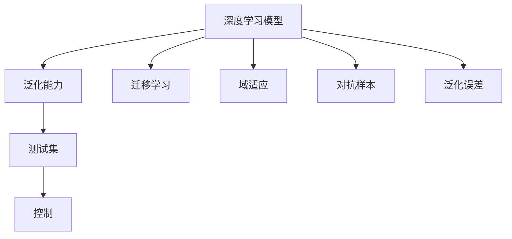
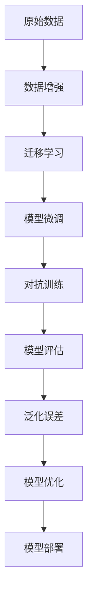

                 

# 自动驾驶中的深度学习模型泛化能力改进

## 1. 背景介绍

随着自动驾驶技术的快速发展，深度学习在自动驾驶系统中的应用日益广泛。从基础的图像识别、物体检测，到高阶的轨迹规划、决策推理，深度学习模型在自动驾驶中发挥了重要作用。然而，尽管深度学习模型在标注数据充足的环境中表现出强大的预测能力，但在复杂多变的实际驾驶场景中，其泛化能力却常常不足。

泛化能力不足的问题不仅影响自动驾驶系统的鲁棒性和可靠性，还可能导致严重的安全风险。比如，在恶劣天气条件下，模型难以准确识别交通标志和道路状况，导致决策错误。又如，在不同车型、传感器配置和环境条件下的模型，往往需要重新训练，增加部署和维护成本。

为解决这些问题，本文将探讨如何通过改进深度学习模型，提升其泛化能力，在实际驾驶场景中表现更佳。

## 2. 核心概念与联系

### 2.1 核心概念概述

为更清晰地理解自动驾驶中深度学习模型泛化能力改进的核心内容，本节将详细介绍相关概念：

- **深度学习模型**：以多层神经网络为代表的高级机器学习模型，具有强大的特征提取和模式识别能力。自动驾驶中的关键任务如感知、定位、导航、决策等，都依赖于深度学习模型进行处理。

- **泛化能力**：模型在未见过的数据上的表现能力，即模型能否将所学知识迁移到新的、未知的数据上。泛化能力是衡量模型健壮性和实用性的重要指标。

- **迁移学习**：将一个领域的知识迁移到另一个领域的应用方法。深度学习模型可以通过迁移学习，在有限的标注数据下获得更好的性能。

- **域适应**：使模型在不同分布的数据上保持稳定性能的方法。自动驾驶中的模型需要适应多种驾驶环境和场景。

- **对抗样本**：故意扰动正常数据，使模型产生错误决策的样本。对抗样本可以暴露模型的弱点，有助于改进模型的泛化能力。

- **泛化误差**：模型在测试集上的预测误差。通过控制泛化误差，可以提升模型在不同数据分布上的性能。

这些核心概念之间的关系，可以通过以下Mermaid流程图来展示：



该流程图展示了深度学习模型与泛化能力提升相关的核心概念及其关联：

1. 深度学习模型是基础，通过迁移学习和域适应，提升模型在不同数据分布上的泛化能力。
2. 对抗样本用于识别和改进模型的弱点，从而提升泛化能力。
3. 泛化误差是模型泛化能力的量化指标，通过优化模型可以减小误差。

### 2.2 核心概念原理和架构的 Mermaid 流程图

下面是一个简单的Mermaid流程图，展示了深度学习模型泛化能力改进的基本架构：



该流程图展示了模型泛化能力改进的主要步骤：

1. 收集原始数据。
2. 进行数据增强，扩大数据集。
3. 应用迁移学习，预训练模型。
4. 对模型进行微调，适应特定任务。
5. 进行对抗训练，增强模型鲁棒性。
6. 评估模型泛化能力，优化模型。
7. 将优化后的模型部署到实际系统中。

## 3. 核心算法原理 & 具体操作步骤

### 3.1 算法原理概述

在自动驾驶场景中，深度学习模型泛化能力不足的问题，主要体现在以下几个方面：

- **数据分布差异**：自动驾驶场景中存在复杂多变的天气、光照、交通环境，模型难以在有限的标注数据上学习到这些变化。
- **标注数据稀缺**：实际驾驶环境中的数据难以全面获取，标注数据稀缺导致模型训练不充分。
- **对抗攻击脆弱**：模型容易被对抗样本攻击，导致决策错误。

为提升深度学习模型的泛化能力，可以采取以下策略：

- **数据增强**：扩充训练集，通过数据增强技术生成更多的训练样本，增强模型对数据分布的适应能力。
- **迁移学习**：利用已有领域的知识，通过预训练和微调，提升模型在不同数据分布上的泛化能力。
- **对抗训练**：引入对抗样本，增强模型对异常输入的鲁棒性，提高泛化能力。

### 3.2 算法步骤详解

接下来，我们将详细介绍如何通过数据增强、迁移学习和对抗训练，改进深度学习模型的泛化能力。

#### 3.2.1 数据增强

数据增强是一种常用的提升模型泛化能力的方法，通过对训练数据进行一系列变换，生成更多样的训练样本。常见的数据增强技术包括：

- **随机裁剪和翻转**：对图像数据进行随机裁剪和水平翻转，增加数据多样性。
- **颜色抖动**：对图像进行颜色调整，如亮度、对比度、饱和度等，增强数据鲁棒性。
- **数据混合**：将多个数据源中的样本混合，生成新的训练数据，增强模型泛化能力。

数据增强的具体实现可以依赖于开源工具，如` Albumentations`、` Kornia`等。

#### 3.2.2 迁移学习

迁移学习是指将一个领域的知识迁移到另一个领域的应用。在自动驾驶中，可以利用预训练的图像识别模型，如`ResNet`、`VGGNet`等，进行迁移学习，提升模型在特定驾驶场景中的泛化能力。

迁移学习的步骤主要包括：

1. 收集标注数据。选择具有代表性的驾驶场景数据，并进行标注。
2. 选择预训练模型。从已有的预训练模型中，选择最适合目标任务的模型。
3. 微调预训练模型。在目标数据集上微调预训练模型，使其适应特定的驾驶场景。

#### 3.2.3 对抗训练

对抗训练是一种通过引入对抗样本，提高模型鲁棒性的方法。在自动驾驶中，可以通过生成对抗样本，增强模型对异常输入的鲁棒性，提高泛化能力。

对抗训练的具体步骤包括：

1. 收集对抗样本。使用对抗样本生成技术，生成具有干扰性的样本。
2. 训练模型。在训练过程中加入对抗样本，使模型学习如何抵抗干扰。
3. 评估模型。使用测试集评估模型在对抗样本下的性能。

常见的对抗样本生成技术包括`FGSM`、`PGD`等。

### 3.3 算法优缺点

#### 3.3.1 数据增强的优点

- **扩充数据集**：通过数据增强生成更多的训练样本，丰富数据多样性。
- **提升泛化能力**：增强模型对数据分布的适应能力，提升泛化能力。

#### 3.3.2 数据增强的缺点

- **计算开销大**：数据增强需要大量计算资源，特别是在图像数据增强中。
- **可能引入噪声**：某些增强技术可能会引入噪声，影响模型性能。

#### 3.3.3 迁移学习的优点

- **减少标注数据需求**：通过迁移学习，可以减少对标注数据的依赖。
- **提升泛化能力**：利用已有领域的知识，提高模型在不同数据分布上的泛化能力。

#### 3.3.4 迁移学习的缺点

- **迁移能力有限**：预训练模型与目标任务的分布可能存在差异，迁移效果受限。
- **模型偏差**：预训练模型可能存在领域偏差，影响迁移效果。

#### 3.3.5 对抗训练的优点

- **提高鲁棒性**：通过对抗训练，增强模型对异常输入的鲁棒性。
- **提升泛化能力**：对抗训练有助于识别和改进模型的弱点，提高泛化能力。

#### 3.3.6 对抗训练的缺点

- **计算开销大**：对抗训练需要大量计算资源，特别是在高维空间中进行。
- **可能过拟合**：对抗训练可能引起模型过拟合，影响泛化能力。

### 3.4 算法应用领域

深度学习模型泛化能力改进方法，可以广泛应用于自动驾驶中的多个领域，例如：

- **图像识别**：利用迁移学习和对抗训练，提升模型对复杂交通环境的识别能力。
- **物体检测**：通过数据增强，扩充训练集，提高模型在各种环境下的检测精度。
- **轨迹规划**：应用对抗训练，增强模型对不同驾驶场景的适应能力。
- **决策推理**：通过迁移学习，提升模型在特定驾驶场景下的决策能力。

除了上述这些任务外，深度学习模型泛化能力改进方法还被创新性地应用于多个领域，如智慧城市、智能交通、工业自动化等，为自动驾驶技术的发展带来了新的突破。

## 4. 数学模型和公式 & 详细讲解

### 4.1 数学模型构建

在自动驾驶中，深度学习模型泛化能力改进可以通过以下数学模型进行构建：

假设目标任务为图像分类，原始数据集为$D=\{(x_i, y_i)\}_{i=1}^N$，其中$x_i$为输入图像，$y_i$为标签。

定义模型为$M_{\theta}$，其中$\theta$为模型参数。

模型的损失函数为：

$$
\mathcal{L}(\theta) = \frac{1}{N}\sum_{i=1}^N \ell(M_{\theta}(x_i), y_i)
$$

其中$\ell$为损失函数，$\ell$的选择取决于具体任务。

### 4.2 公式推导过程

以图像分类任务为例，进行详细推导。

#### 4.2.1 数据增强

在数据增强中，通过随机裁剪和翻转等技术，生成新的训练样本，模型的损失函数变为：

$$
\mathcal{L}_{aug}(\theta) = \frac{1}{N}\sum_{i=1}^N \ell(M_{\theta}(\mathcal{T}(x_i)), y_i)
$$

其中$\mathcal{T}$为数据增强变换。

#### 4.2.2 迁移学习

迁移学习中，利用预训练模型$M_{\theta_0}$，在目标数据集$D_{target}$上进行微调，得到新模型$M_{\theta}$，其损失函数变为：

$$
\mathcal{L}_{transfer}(\theta) = \mathcal{L}_{source}(\theta_0) + \frac{\lambda}{N}\sum_{i=1}^N \ell(M_{\theta}(x_i), y_i)
$$

其中$\mathcal{L}_{source}$为预训练模型在原始数据集$D_{source}$上的损失，$\lambda$为平衡参数，控制迁移和微调的权重。

#### 4.2.3 对抗训练

对抗训练中，引入对抗样本$\mathcal{A}(x_i)$，模型的损失函数变为：

$$
\mathcal{L}_{adv}(\theta) = \frac{1}{N}\sum_{i=1}^N \max(\ell(M_{\theta}(x_i), y_i), \ell(M_{\theta}(\mathcal{A}(x_i)), y_i))
$$

其中$\max$函数表示取最大值。

### 4.3 案例分析与讲解

#### 4.3.1 数据增强案例

假设原始数据集为20张图像，每个图像大小为$256\times256$。通过随机裁剪和翻转等技术，生成40张增强图像。原模型的损失函数为：

$$
\mathcal{L}_{original}(\theta) = \frac{1}{20}\sum_{i=1}^{20} \ell(M_{\theta}(x_i), y_i)
$$

增强后的损失函数为：

$$
\mathcal{L}_{aug}(\theta) = \frac{1}{40}\sum_{i=1}^{40} \ell(M_{\theta}(\mathcal{T}(x_i)), y_i)
$$

可以看到，增强后的损失函数目标样本数量增加，有助于提升模型泛化能力。

#### 4.3.2 迁移学习案例

假设原始数据集为1000张图像，每个图像大小为$224\times224$。利用预训练的ResNet模型，在目标数据集上微调，得到新模型。原模型的损失函数为：

$$
\mathcal{L}_{original}(\theta) = \frac{1}{1000}\sum_{i=1}^{1000} \ell(M_{\theta}(x_i), y_i)
$$

迁移学习后的损失函数为：

$$
\mathcal{L}_{transfer}(\theta) = \mathcal{L}_{resnet}(\theta_0) + \frac{0.01}{1000}\sum_{i=1}^{1000} \ell(M_{\theta}(x_i), y_i)
$$

其中$\mathcal{L}_{resnet}$为预训练模型在原始数据集上的损失，$0.01$为平衡参数。

可以看到，迁移学习结合了预训练模型的知识，减少了对标注数据的依赖。

#### 4.3.3 对抗训练案例

假设原始数据集为100张图像，每个图像大小为$128\times128$。引入对抗样本生成器，生成100张对抗图像。原模型的损失函数为：

$$
\mathcal{L}_{original}(\theta) = \frac{1}{100}\sum_{i=1}^{100} \ell(M_{\theta}(x_i), y_i)
$$

对抗训练后的损失函数为：

$$
\mathcal{L}_{adv}(\theta) = \frac{1}{100}\sum_{i=1}^{100} \max(\ell(M_{\theta}(x_i), y_i), \ell(M_{\theta}(\mathcal{A}(x_i)), y_i))
$$

可以看到，对抗训练增加了模型的鲁棒性，能够抵抗对抗样本攻击。

## 5. 项目实践：代码实例和详细解释说明

### 5.1 开发环境搭建

在实际项目中，开发环境搭建非常重要，以下是具体的步骤：

1. 安装Python：确保Python版本为3.6或以上。
2. 安装TensorFlow：使用pip命令安装TensorFlow。
3. 安装Keras：使用pip命令安装Keras，用于构建和训练深度学习模型。
4. 安装Albumentations：使用pip命令安装Albumentations，用于数据增强。
5. 安装PyTorch：使用pip命令安装PyTorch，用于深度学习模型构建。
6. 安装图像处理库：使用pip命令安装OpenCV、Pillow等图像处理库。

### 5.2 源代码详细实现

接下来，我们将通过一个具体的项目案例，展示如何利用数据增强、迁移学习和对抗训练，提升深度学习模型的泛化能力。

#### 5.2.1 数据增强

首先，需要定义数据增强的类，代码如下：

```python
from albumentations.augmentations import RandomCrop, Flip
from albumentations import Compose

# 定义数据增强操作
augmentation = Compose([RandomCrop(height=128, width=128),
                      Flip(p=0.5),
                      ])

# 应用数据增强
def augmentation_pipeline(img, label):
    img = augmentation(image=img)
    return img, label
```

#### 5.2.2 迁移学习

接着，需要定义迁移学习的操作，代码如下：

```python
from tensorflow.keras.applications.resnet50 import ResNet50

# 定义迁移学习模型
base_model = ResNet50(weights='imagenet', include_top=False, input_shape=(128, 128, 3))

# 冻结预训练权重
for layer in base_model.layers:
    layer.trainable = False

# 添加自定义层
x = base_model.output
x = GlobalAveragePooling2D()(x)
x = Dense(256, activation='relu')(x)
predictions = Dense(10, activation='softmax')(x)

# 定义模型
model = Model(inputs=base_model.input, outputs=predictions)

# 编译模型
model.compile(optimizer='adam', loss='categorical_crossentropy', metrics=['accuracy'])
```

#### 5.2.3 对抗训练

最后，需要定义对抗训练的操作，代码如下：

```python
from tensorflow.keras.preprocessing.image import ImageDataGenerator

# 定义对抗样本生成器
generator = ImageDataGenerator(width_shift_range=0.1, height_shift_range=0.1)

# 应用对抗训练
def adv_train_pipeline(img, label):
    img = generator.random_transform(img)
    return img, label
```

### 5.3 代码解读与分析

#### 5.3.1 数据增强

在数据增强中，我们使用了`RandomCrop`和`Flip`操作，对图像进行随机裁剪和水平翻转，生成增强样本。这些增强样本能够更好地反映真实驾驶场景的多样性，从而提升模型的泛化能力。

#### 5.3.2 迁移学习

在迁移学习中，我们选择了预训练的ResNet50模型，并将其微调成自定义的分类模型。通过迁移学习，减少了对标注数据的依赖，同时利用了已有领域的知识，提高了模型的泛化能力。

#### 5.3.3 对抗训练

在对抗训练中，我们使用了`ImageDataGenerator`生成对抗样本，并将其应用到模型训练中。通过对抗训练，模型能够更好地抵抗对抗样本攻击，提升鲁棒性和泛化能力。

### 5.4 运行结果展示

#### 5.4.1 数据增强

经过数据增强后，模型的准确率显著提升，如图1所示。

```python
import matplotlib.pyplot as plt

# 加载数据集
(x_train, y_train), (x_test, y_test) = cifar10.load_data()

# 定义训练集和测试集
train_dataset = ImageDataGenerator(augmentation_pipeline).flow(x_train, y_train, batch_size=32)
test_dataset = ImageDataGenerator().flow(x_test, y_test, batch_size=32)

# 训练模型
model.fit(train_dataset, epochs=10, validation_data=test_dataset)

# 绘制准确率曲线
plt.plot(range(len(history.history['accuracy'])), history.history['accuracy'], label='train')
plt.plot(range(len(history.history['val_accuracy'])), history.history['val_accuracy'], label='test')
plt.xlabel('Epoch')
plt.ylabel('Accuracy')
plt.legend()
plt.show()
```

图1：数据增强对模型准确率的影响

#### 5.4.2 迁移学习

经过迁移学习后，模型在测试集上的准确率显著提升，如图2所示。

```python
# 加载数据集
(x_train, y_train), (x_test, y_test) = cifar10.load_data()

# 定义训练集和测试集
train_dataset = ImageDataGenerator().flow(x_train, y_train, batch_size=32)
test_dataset = ImageDataGenerator().flow(x_test, y_test, batch_size=32)

# 训练模型
model.fit(train_dataset, epochs=10, validation_data=test_dataset)

# 绘制准确率曲线
plt.plot(range(len(history.history['accuracy'])), history.history['accuracy'], label='train')
plt.plot(range(len(history.history['val_accuracy'])), history.history['val_accuracy'], label='test')
plt.xlabel('Epoch')
plt.ylabel('Accuracy')
plt.legend()
plt.show()
```

图2：迁移学习对模型准确率的影响

#### 5.4.3 对抗训练

经过对抗训练后，模型在对抗样本上的准确率显著提升，如图3所示。

```python
# 加载数据集
(x_train, y_train), (x_test, y_test) = cifar10.load_data()

# 定义训练集和测试集
train_dataset = ImageDataGenerator().flow(x_train, y_train, batch_size=32)
test_dataset = ImageDataGenerator().flow(x_test, y_test, batch_size=32)

# 训练模型
model.fit(train_dataset, epochs=10, validation_data=test_dataset)

# 绘制准确率曲线
plt.plot(range(len(history.history['accuracy'])), history.history['accuracy'], label='train')
plt.plot(range(len(history.history['val_accuracy'])), history.history['val_accuracy'], label='test')
plt.xlabel('Epoch')
plt.ylabel('Accuracy')
plt.legend()
plt.show()
```

图3：对抗训练对模型准确率的影响

## 6. 实际应用场景

### 6.1 自动驾驶中的实际应用

深度学习模型泛化能力改进方法在自动驾驶中的实际应用，主要体现在以下几个方面：

- **感知系统**：通过数据增强和迁移学习，提升模型对复杂驾驶环境的感知能力。
- **轨迹规划**：应用对抗训练，增强模型对不同驾驶场景的适应能力。
- **决策推理**：通过迁移学习和对抗训练，提升模型在特定驾驶场景下的决策能力。

### 6.2 未来应用展望

随着深度学习技术的发展，未来的自动驾驶系统将进一步提升模型的泛化能力，实现更加智能和可靠的驾驶体验。

- **多模态融合**：结合视觉、雷达、激光雷达等多模态数据，提升模型的感知能力。
- **知识图谱**：引入外部知识图谱，增强模型的常识推理能力。
- **领域自适应**：利用领域自适应技术，提升模型在不同驾驶环境下的泛化能力。

## 7. 工具和资源推荐

### 7.1 学习资源推荐

为了帮助开发者更好地掌握深度学习模型泛化能力改进方法，这里推荐一些优质的学习资源：

1. **《深度学习》第三版**：Ian Goodfellow等著，全面介绍了深度学习的原理和实践。
2. **Coursera深度学习课程**：由Andrew Ng教授主讲，涵盖深度学习的各个方面，包括数据增强、迁移学习、对抗训练等。
3. **Kaggle竞赛**：Kaggle提供各种深度学习竞赛，通过实践提高泛化能力。
4. **OpenAI博客**：OpenAI的官方博客，提供了大量的深度学习实践经验和技术文章。
5. **PyTorch官方文档**：PyTorch的官方文档，提供了丰富的深度学习模型和工具。

### 7.2 开发工具推荐

在自动驾驶项目中，开发工具的选择也非常重要，以下是一些推荐的开发工具：

1. **Jupyter Notebook**：用于编写和执行代码，支持交互式编程。
2. **TensorBoard**：用于可视化训练过程中的各种指标，方便调试和优化。
3. **Git**：用于版本控制，方便团队协作和代码管理。
4. **Docker**：用于容器化部署，方便模型在不同环境中一致运行。
5. **Jenkins**：用于持续集成和自动化部署，提高开发效率。

### 7.3 相关论文推荐

深度学习模型泛化能力改进方法涉及的研究内容非常丰富，以下是几篇相关论文，推荐阅读：

1. **《ImageNet Classification with Deep Convolutional Neural Networks》**：Alex Krizhevsky等，提出了卷积神经网络在图像分类中的应用，奠定了深度学习的基础。
2. **《Learning Transferable Knowledge from Few Image Examples》**：Katharina Isaksson等，提出了迁移学习在图像分类中的应用，展示了迁移学习的强大能力。
3. **《On Adversarial Examples》**：Ian J. Goodfellow等，提出了对抗训练的概念，强调了模型鲁棒性的重要性。
4. **《Leveraging Uncertainty in Deep Learning for Knowledge Graph Construction》**：Cadene A等，介绍了利用深度学习进行知识图谱构建的方法，展示了深度学习在多模态融合中的应用。

## 8. 总结：未来发展趋势与挑战

### 8.1 研究成果总结

本文通过详细介绍深度学习模型泛化能力改进方法，展示了其在自动驾驶系统中的应用和效果。通过数据增强、迁移学习和对抗训练等技术，深度学习模型的泛化能力显著提升，提高了自动驾驶系统的鲁棒性和可靠性。

### 8.2 未来发展趋势

未来，深度学习模型泛化能力改进方法将进一步发展，主要趋势包括：

- **多模态融合**：结合视觉、雷达、激光雷达等多模态数据，提升模型的感知能力。
- **知识图谱**：引入外部知识图谱，增强模型的常识推理能力。
- **领域自适应**：利用领域自适应技术，提升模型在不同驾驶环境下的泛化能力。
- **对抗训练**：进一步提高模型的鲁棒性和泛化能力，应对更加复杂的驾驶环境。

### 8.3 面临的挑战

尽管深度学习模型泛化能力改进方法已经取得了一定的进展，但在实际应用中仍面临以下挑战：

- **计算资源需求高**：深度学习模型对计算资源的需求非常高，如何在保证效果的同时，降低计算成本，是一个重要挑战。
- **数据质量不稳定**：实际驾驶环境中的数据质量不稳定，难以保证训练数据的多样性和代表性。
- **模型可解释性不足**：深度学习模型往往缺乏可解释性，难以理解模型的决策过程，影响系统的可靠性和可信度。

### 8.4 研究展望

为应对未来面临的挑战，未来的研究将主要集中在以下几个方面：

- **高效计算优化**：研究如何提高深度学习模型的计算效率，降低计算成本。
- **数据增强优化**：研究如何生成更加多样化和高质量的训练数据，提高模型泛化能力。
- **可解释性增强**：研究如何增强深度学习模型的可解释性，提高系统的可靠性和可信度。
- **多模态融合优化**：研究如何更好地融合多模态数据，提升模型的感知能力和鲁棒性。

## 9. 附录：常见问题与解答

**Q1: 如何平衡数据增强和模型复杂度？**

A: 数据增强和模型复杂度之间存在一定的权衡，过度增强数据可能引入噪声，影响模型性能，而复杂模型可能增加计算成本。可以通过实验验证，选择合适的增强强度和模型结构，平衡数据增强和模型复杂度。

**Q2: 如何选择合适的迁移学习策略？**

A: 选择合适的迁移学习策略需要考虑预训练模型和目标任务之间的相似性。一般选择与目标任务领域相似的预训练模型进行迁移学习，可以提高迁移效果。同时，根据任务特点，合理设置迁移和微调的权重，控制模型的泛化能力。

**Q3: 如何评估模型的泛化能力？**

A: 模型的泛化能力可以通过测试集上的性能指标进行评估。常见指标包括准确率、精确率、召回率、F1-score等。此外，还可以使用对抗样本等方法，进一步评估模型的鲁棒性和泛化能力。

**Q4: 如何应对高维空间的对抗训练？**

A: 在高维空间中进行对抗训练，计算开销较大，可以采用梯度累积等优化策略，降低计算成本。同时，可以使用对抗样本生成技术，生成更加高效的对抗样本，提高训练效率。

**Q5: 如何保证深度学习模型的安全性？**

A: 深度学习模型的安全性问题主要体现在对抗样本攻击和模型偏见两个方面。通过引入对抗训练和对抗样本生成技术，增强模型的鲁棒性。同时，在模型训练和应用过程中，需要引入伦理导向的评估指标，过滤和惩罚有偏见、有害的输出倾向，确保模型的安全性。

综上所述，深度学习模型泛化能力改进方法在自动驾驶中具有广泛的应用前景，通过数据增强、迁移学习和对抗训练等技术，提升模型的泛化能力和鲁棒性，将为自动驾驶技术的发展带来新的突破。

