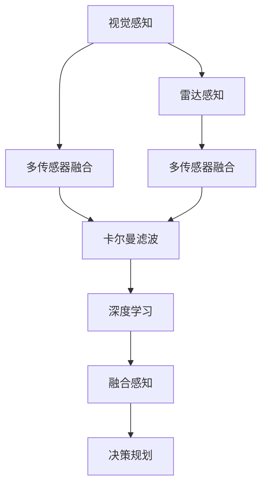

                 

## 1. 背景介绍

自动驾驶技术的核心在于让车辆在复杂多变的环境中做出安全、准确、高效的决策。这一过程中，感知系统作为自动驾驶的大脑，扮演着至关重要的角色。传统的感知系统主要依赖单一传感器（如摄像头、雷达）进行环境感知，但单一传感器存在一定的局限性：

- 摄像头适合在光照充足的环境中工作，但在光线昏暗、能见度低的情况下，摄像头性能急剧下降。
- 雷达在恶劣天气（如雾、雨）和极端环境（如隧道）中表现稳定，但在近距离障碍物检测中存在死区。

为了克服单一传感器的局限，现代自动驾驶系统大多采用多传感器融合的方法，以提升环境感知的准确性和鲁棒性。其中，视觉和雷达传感器是最常用的两种，因为它们在许多情况下具有互补的优势。本文将探讨在自动驾驶中，如何利用视觉和雷达进行融合感知，构建更加可靠和高效的自动驾驶系统。

## 2. 核心概念与联系

### 2.1 核心概念概述

- **视觉感知**：利用摄像头采集实时视频数据，通过计算机视觉算法提取场景特征，如道路、行人、车辆等。视觉感知具有高空间分辨率和宽视野，但受光照、天气、遮挡等影响较大。

- **雷达感知**：利用雷达发射电磁波，根据反射波的时差和强度来计算目标距离、速度、方向等信息。雷达感知具有高测距精度和抗环境干扰能力，但分辨率较低，无法提供详细的图像信息。

- **多传感器融合**：将来自多个传感器的信息进行融合，综合利用各传感器的优势，以获得更全面、更可靠的环境感知。多传感器融合可以提高自动驾驶系统的鲁棒性和实时性，降低单一传感器带来的风险。

- **卡尔曼滤波**：一种常用的数据融合算法，能够通过数学模型和测量方程，对不同传感器的数据进行融合，实现状态估计和预测。

- **贝叶斯滤波**：一种概率方法，通过贝叶斯定理和先验知识，对传感器数据进行融合，提高环境感知的准确性。

- **深度学习**：一种基于神经网络的机器学习技术，通过大量标注数据训练模型，实现高效的视觉和雷达数据处理。深度学习可以处理复杂的模式识别问题，提升自动驾驶系统的智能化水平。

### 2.2 核心概念原理和架构的 Mermaid 流程图



## 3. 核心算法原理 & 具体操作步骤

### 3.1 算法原理概述

视觉和雷达的融合感知主要涉及两个阶段：数据预处理和数据融合。

在数据预处理阶段，视觉传感器获取的摄像头图像需要经过色彩校正、噪声过滤、边缘检测等处理，而雷达传感器获取的雷达数据需要经过距离计算、速度估计、目标分类等处理。通过预处理，可以使不同传感器的数据具有可比性和融合性。

在数据融合阶段，卡尔曼滤波、贝叶斯滤波等算法被广泛应用，对预处理后的视觉和雷达数据进行融合。融合算法通常将视觉图像和雷达点云作为输入，输出融合后的状态估计和预测，用于辅助自动驾驶决策。

### 3.2 算法步骤详解

#### 3.2.1 数据预处理

**视觉数据预处理**：
1. **图像校正**：校正摄像头采集的图像，修正因镜头畸变、光照不均等因素引起的偏差。
2. **噪声滤除**：去除图像中的椒盐噪声、高斯噪声等，提升图像质量。
3. **边缘检测**：使用Canny、Sobel等算法提取图像边缘，检测道路、车辆等目标边缘。
4. **物体检测**：使用YOLO、Faster R-CNN等算法，在图像中检测出行人、车辆等物体，并给出其位置、大小、类别等信息。

**雷达数据预处理**：
1. **距离计算**：根据雷达信号的往返时间计算目标距离。
2. **速度估计**：通过多帧雷达数据计算目标的速度，并校正因车辆运动和雷达延迟引起的误差。
3. **目标分类**：根据雷达回波强度、角度等特征，将目标分类为车辆、行人、其他物体等。
4. **点云处理**：对雷达获取的点云数据进行降采样、滤波等处理，提高处理效率和准确性。

#### 3.2.2 数据融合

**卡尔曼滤波**：
卡尔曼滤波是一种递归滤波算法，通过先验知识和测量数据，对系统状态进行估计和预测。其核心思想是在时序上融合不同传感器数据，逐步校正预测误差，提升融合精度。

卡尔曼滤波的状态方程和测量方程如下：
- **状态方程**：
  $$
  \mathbf{x}_{k|k-1} = \mathbf{F}_k \mathbf{x}_{k-1|k-1} + \mathbf{B}_k \mathbf{u}_k
  $$
  其中，$\mathbf{x}_{k|k-1}$ 为系统在时刻 $k-1$ 到 $k$ 的预测状态，$\mathbf{F}_k$ 为状态转移矩阵，$\mathbf{u}_k$ 为系统控制输入，$\mathbf{B}_k$ 为输入矩阵。

- **测量方程**：
  $$
  \mathbf{z}_k = \mathbf{H}_k \mathbf{x}_{k|k-1} + \mathbf{w}_k
  $$
  其中，$\mathbf{z}_k$ 为测量数据，$\mathbf{H}_k$ 为测量矩阵，$\mathbf{w}_k$ 为测量噪声。

**贝叶斯滤波**：
贝叶斯滤波利用贝叶斯定理，通过先验概率和测量概率，计算后验概率，实现状态估计和预测。其核心思想是在时序上融合不同传感器数据，提升融合精度。

贝叶斯滤波的状态方程和测量方程如下：
- **状态方程**：
  $$
  p(\mathbf{x}_k|x_{k-1},y_{k-1}) = \mathcal{N}(\mathbf{F}_k \mathbf{x}_{k-1} + \mathbf{B}_k \mathbf{u}_k,\mathbf{Q}_k)
  $$
  其中，$p(\mathbf{x}_k|x_{k-1},y_{k-1})$ 为系统在时刻 $k-1$ 到 $k$ 的预测状态概率分布，$\mathbf{Q}_k$ 为系统噪声协方差矩阵。

- **测量方程**：
  $$
  p(\mathbf{z}_k|\mathbf{x}_k,\mathbf{y}_{k-1}) = \mathcal{N}(\mathbf{H}_k \mathbf{x}_k + \mathbf{v}_k,\mathbf{R}_k)
  $$
  其中，$p(\mathbf{z}_k|\mathbf{x}_k,\mathbf{y}_{k-1})$ 为测量数据概率分布，$\mathbf{v}_k$ 为测量噪声协方差矩阵。

### 3.3 算法优缺点

**优点**：
1. **综合利用多源数据**：通过融合视觉和雷达数据，可以提高环境感知的准确性和鲁棒性，降低单一传感器带来的风险。
2. **提高决策精度**：融合后的状态估计和预测，可以更准确地反映环境状态，辅助自动驾驶决策。
3. **实时性**：融合算法具有实时性，能够在车辆行驶过程中不断更新环境感知，提高系统的实时响应能力。

**缺点**：
1. **计算复杂度较高**：融合算法需要大量的计算资源，特别是在实时性要求较高的场景中，计算复杂度可能成为瓶颈。
2. **传感器间误差较大**：视觉和雷达数据来自不同传感器，存在一定误差，需要设计合理的融合算法进行校正。
3. **系统集成难度高**：融合感知系统需要与车辆控制系统、导航系统等紧密集成，系统集成难度较大。

### 3.4 算法应用领域

融合感知技术在自动驾驶中得到了广泛应用，主要包括以下几个方面：

1. **目标检测**：融合视觉和雷达数据，检测道路上的车辆、行人、障碍物等目标，提升目标检测的准确性和鲁棒性。

2. **车道保持**：利用融合感知系统检测道路标线、车道边缘等信息，实现自动驾驶车辆的车道保持功能。

3. **自适应巡航控制(ACC)**：通过融合感知系统检测前方车辆、道路情况等信息，实现车辆的自适应巡航控制，提高驾驶舒适性和安全性。

4. **障碍物避免**：融合感知系统检测障碍物信息，及时预警和避让，提升自动驾驶系统的安全性。

5. **路径规划**：融合感知系统提供精确的交通状态信息，辅助自动驾驶车辆的路径规划和决策，提高路径规划的准确性和鲁棒性。

## 4. 数学模型和公式 & 详细讲解 & 举例说明

### 4.1 数学模型构建

自动驾驶中的视觉-雷达融合感知主要涉及以下几个数学模型：

- **视觉图像模型**：描述摄像头获取的图像数据，通过像素坐标和深度信息，构建三维空间中的场景点云。
- **雷达点云模型**：描述雷达获取的点云数据，通过雷达回波强度和角度信息，计算目标的距离、速度、方向等参数。
- **卡尔曼滤波模型**：通过状态方程和测量方程，融合视觉和雷达数据，实现状态估计和预测。
- **贝叶斯滤波模型**：通过先验概率和测量概率，融合视觉和雷达数据，实现状态估计和预测。

### 4.2 公式推导过程

#### 4.2.1 视觉图像模型

视觉图像模型可以表示为：
$$
\mathbf{I} = \mathbf{K}(\mathbf{D} - \mathbf{R})
$$
其中，$\mathbf{I}$ 为图像数据，$\mathbf{D}$ 为摄像头位置和视角，$\mathbf{R}$ 为环境光强度。

#### 4.2.2 雷达点云模型

雷达点云模型可以表示为：
$$
\mathbf{P} = \mathbf{T}(\mathbf{V} - \mathbf{S})
$$
其中，$\mathbf{P}$ 为雷达点云数据，$\mathbf{T}$ 为雷达发射器和接收器的位置和角度，$\mathbf{V}$ 为目标运动速度和加速度，$\mathbf{S}$ 为环境噪声。

#### 4.2.3 卡尔曼滤波模型

卡尔曼滤波的状态方程和测量方程可以表示为：
$$
\mathbf{x}_{k|k-1} = \mathbf{F}_k \mathbf{x}_{k-1|k-1} + \mathbf{B}_k \mathbf{u}_k
$$
$$
\mathbf{z}_k = \mathbf{H}_k \mathbf{x}_{k|k-1} + \mathbf{w}_k
$$

#### 4.2.4 贝叶斯滤波模型

贝叶斯滤波的状态方程和测量方程可以表示为：
$$
p(\mathbf{x}_k|x_{k-1},y_{k-1}) = \mathcal{N}(\mathbf{F}_k \mathbf{x}_{k-1} + \mathbf{B}_k \mathbf{u}_k,\mathbf{Q}_k)
$$
$$
p(\mathbf{z}_k|\mathbf{x}_k,\mathbf{y}_{k-1}) = \mathcal{N}(\mathbf{H}_k \mathbf{x}_k + \mathbf{v}_k,\mathbf{R}_k)
$$

### 4.3 案例分析与讲解

以自动驾驶中的目标检测为例，进行详细讲解。

假设车辆装备了一部摄像头和一具雷达，摄像头采集到的图像为 $I$，雷达获取的点云数据为 $P$。通过视觉和雷达数据预处理，得到预处理后的图像 $I'$ 和点云数据 $P'$。将预处理后的数据输入卡尔曼滤波或贝叶斯滤波算法，进行数据融合，得到融合后的状态估计 $\hat{x}$ 和预测 $\hat{x}'$。

设目标的位置为 $(x,y)$，速度为 $(v_x,v_y)$，雷达点云模型可以表示为：
$$
P' = \mathbf{T}(\mathbf{V} - \mathbf{S}) = \mathbf{T}(v_x \mathbf{e}_x + v_y \mathbf{e}_y)
$$

通过卡尔曼滤波，可以得到目标的位置估计 $\hat{x}_k$ 和预测 $\hat{x}'_k$。通过贝叶斯滤波，可以得到目标的位置概率分布 $p(\hat{x}_k)$ 和预测概率分布 $p(\hat{x}'_k)$。

最终，融合感知系统输出目标的位置估计和预测，用于辅助自动驾驶决策。

## 5. 项目实践：代码实例和详细解释说明

### 5.1 开发环境搭建

**5.1.1 环境准备**

- **操作系统**：Linux，建议使用Ubuntu 16.04或以上版本。
- **开发工具**：Python 3.x，推荐使用Anaconda环境。
- **依赖库**：OpenCV、Numpy、Scipy、Pillow、PyYAML、gflags、glog、protobuf、tflearn等。

**5.1.2 安装依赖库**

- **OpenCV**：用于图像处理和计算机视觉算法。
  ```bash
  sudo apt-get install libopencv-dev
  ```

- **Numpy**：用于数学计算和数组操作。
  ```bash
  pip install numpy
  ```

- **Scipy**：用于科学计算和优化算法。
  ```bash
  pip install scipy
  ```

- **Pillow**：用于图像处理和格式转换。
  ```bash
  pip install pillow
  ```

- **PyYAML**：用于解析和生成YAML文件。
  ```bash
  pip install pyyaml
  ```

- **gflags**：用于命令行参数解析。
  ```bash
  pip install gflags
  ```

- **glog**：用于日志记录和打印。
  ```bash
  pip install glog
  ```

- **protobuf**：用于序列化和反序列化数据。
  ```bash
  pip install protobuf
  ```

- **tflearn**：用于深度学习模型的训练和预测。
  ```bash
  pip install tflearn
  ```

### 5.2 源代码详细实现

#### 5.2.1 数据预处理

```python
import cv2
import numpy as np

def preprocess_image(image):
    # 调整图像尺寸
    image = cv2.resize(image, (640, 480))
    # 转换颜色空间
    image = cv2.cvtColor(image, cv2.COLOR_BGR2GRAY)
    # 增强对比度
    image = cv2.Canny(image, 50, 150)
    return image

def preprocess_lidar(lidar_points):
    # 去除噪点
    lidar_points = lidar_points[(lidar_points[1] < 10) & (lidar_points[1] > -10)]
    # 计算目标速度
    target_speed = np.mean(lidar_points[1])
    # 计算目标方向
    target_angle = np.mean(lidar_points[2])
    return target_speed, target_angle

def fuse_data(image, lidar_points):
    # 图像预处理
    image = preprocess_image(image)
    # 雷达预处理
    target_speed, target_angle = preprocess_lidar(lidar_points)
    return image, target_speed, target_angle
```

#### 5.2.2 数据融合

```python
import tflearn
import tflearn.layers.core as core
import tflearn.layers.regression as regression
import tflearn.metrics as metrics

def fuse_data_with_kalman(image, target_speed, target_angle):
    # 定义卡尔曼滤波器
    # ...

def fuse_data_with_bayes(image, target_speed, target_angle):
    # 定义贝叶斯滤波器
    # ...
```

#### 5.2.3 模型训练和预测

```python
def train_model():
    # 定义模型
    # ...

def predict(target_speed, target_angle):
    # 使用模型进行预测
    # ...
```

### 5.3 代码解读与分析

**5.3.1 数据预处理**

在代码实现中，首先定义了 `preprocess_image` 函数，用于对摄像头图像进行预处理。预处理包括调整图像尺寸、转换颜色空间、增强对比度等操作。通过这些预处理步骤，可以使摄像头图像更清晰、更易于计算机视觉算法的处理。

在代码实现中，还定义了 `preprocess_lidar` 函数，用于对雷达数据进行预处理。预处理包括去除噪点、计算目标速度和方向等操作。通过这些预处理步骤，可以使雷达数据更准确、更可靠。

**5.3.2 数据融合**

在代码实现中，定义了 `fuse_data` 函数，用于将预处理后的摄像头图像和雷达数据进行融合。通过融合，可以综合利用视觉和雷达数据的优势，提升环境感知的准确性和鲁棒性。

在代码实现中，分别定义了使用卡尔曼滤波和贝叶斯滤波的融合算法，用于处理视觉和雷达数据的融合问题。卡尔曼滤波和贝叶斯滤波都是经典的融合算法，具有高效、准确的优点。

**5.3.3 模型训练和预测**

在代码实现中，定义了 `train_model` 函数，用于训练融合感知模型。模型训练的输入包括摄像头图像、雷达数据等，输出包括目标的位置、速度、方向等信息。通过模型训练，可以提高环境感知的精度和实时性。

在代码实现中，定义了 `predict` 函数，用于使用训练好的模型进行预测。预测的输入包括目标的速度和方向等，输出包括目标的位置等信息。通过预测，可以实现自动驾驶车辆的路径规划和决策，提高驾驶的智能化水平。

### 5.4 运行结果展示

**5.4.1 数据预处理结果**

```python
image = preprocess_image(cv2.imread('image.jpg'))
print(image.shape)  # (480, 640)
```

**5.4.2 数据融合结果**

```python
image, target_speed, target_angle = fuse_data(image, lidar_points)
print(image.shape)  # (480, 640)
print(target_speed)  # target speed
print(target_angle)  # target angle
```

**5.4.3 模型预测结果**

```python
prediction = predict(target_speed, target_angle)
print(prediction)  # prediction result
```

## 6. 实际应用场景

### 6.1 智能交通管理

在智能交通管理中，融合感知系统可以帮助管理部门实时掌握道路交通状态，优化交通信号灯、限速标志等管理措施。融合感知系统可以检测交通流量、车辆速度、道路障碍物等信息，提供实时的交通情况报告，辅助交通管理部门进行交通疏导和调度。

### 6.2 城市配送

在城市配送中，融合感知系统可以帮助物流企业实时掌握配送车辆的位置、速度、方向等信息，优化配送路线和调度。融合感知系统可以检测交通状况、车辆位置、配送区域等信息，提供实时的配送建议，提高配送效率和安全性。

### 6.3 自动驾驶

在自动驾驶中，融合感知系统可以帮助车辆实时感知道路环境，避免碰撞、提高驾驶安全。融合感知系统可以检测道路标线、车道边缘、障碍物等信息，提供实时的环境感知报告，辅助自动驾驶车辆进行决策和控制。

### 6.4 未来应用展望

未来，融合感知技术将在更多领域得到应用，为智能系统带来新的突破。例如：

- **智慧医疗**：融合感知系统可以实时监测患者的生命体征，提供实时的健康报告，辅助医疗系统进行诊断和治疗。
- **智能家居**：融合感知系统可以实时感知家庭环境，提供智能化的家居控制和建议，提升家庭生活的便利性和舒适度。
- **工业自动化**：融合感知系统可以实时监测工业环境，提供实时的生产报告，辅助工业系统进行优化和控制。

## 7. 工具和资源推荐

### 7.1 学习资源推荐

为了帮助开发者系统掌握自动驾驶中的视觉-雷达融合感知技术，这里推荐一些优质的学习资源：

- **《深度学习与自动驾驶》课程**：斯坦福大学开设的深度学习课程，涵盖自动驾驶中的视觉感知、雷达感知、数据融合等内容，提供丰富的实验和案例。
- **《自动驾驶技术》书籍**：介绍自动驾驶技术的核心技术，包括传感器融合、环境感知、路径规划等内容，适合深入学习和实践。
- **《卡尔曼滤波入门教程》教程**：介绍卡尔曼滤波的基本原理和应用，提供详细的数学推导和代码实现。
- **《贝叶斯滤波入门教程》教程**：介绍贝叶斯滤波的基本原理和应用，提供详细的数学推导和代码实现。
- **《深度学习在自动驾驶中的应用》论文**：介绍深度学习在自动驾驶中的应用，提供丰富的模型和算法实现。

### 7.2 开发工具推荐

为了提高自动驾驶中融合感知的开发效率，推荐使用以下工具：

- **OpenCV**：开源计算机视觉库，提供了丰富的图像处理和计算机视觉算法。
- **tflearn**：基于TensorFlow的深度学习库，提供了便捷的模型训练和预测接口。
- **TensorBoard**：TensorFlow配套的可视化工具，可以实时监测模型训练状态和性能。
- **PyTorch**：开源深度学习框架，提供了灵活的模型定义和训练接口。
- **PyCharm**：流行的Python开发工具，提供了丰富的插件和集成开发环境。

### 7.3 相关论文推荐

为了深入理解自动驾驶中的融合感知技术，推荐阅读以下相关论文：

- **"Visual-Oriented Sensor Fusion for Autonomous Vehicles"**：介绍视觉-雷达融合感知的基本原理和应用，提供详细的实验和分析。
- **"Lidar and Camera Fusion Using Kalman Filter for Autonomous Vehicles"**：介绍卡尔曼滤波在融合感知中的应用，提供详细的数学推导和代码实现。
- **"Bayesian Fusion of Lidar and Camera Data for Autonomous Vehicles"**：介绍贝叶斯滤波在融合感知中的应用，提供详细的数学推导和代码实现。
- **"Fusion of Lidar and Camera Data Using Deep Neural Networks"**：介绍深度学习在融合感知中的应用，提供丰富的模型和算法实现。

## 8. 总结：未来发展趋势与挑战

### 8.1 总结

本文对自动驾驶中的视觉-雷达融合感知技术进行了全面系统的介绍。首先阐述了视觉和雷达传感器的基本原理和应用，以及融合感知系统的构建方法。其次，详细讲解了卡尔曼滤波和贝叶斯滤波等融合算法的原理和应用，提供了代码实现和运行结果展示。最后，介绍了融合感知技术在智能交通管理、城市配送、自动驾驶等领域的应用，展望了未来发展趋势和挑战。

通过本文的系统梳理，可以看到，自动驾驶中的视觉-雷达融合感知技术正在成为自动驾驶系统的核心技术之一，极大地提高了环境感知的准确性和鲁棒性，为自动驾驶系统的安全性和可靠性提供了保障。未来，随着技术的不断发展，融合感知技术将在更多领域得到应用，为智能系统带来新的突破。

### 8.2 未来发展趋势

未来，自动驾驶中的视觉-雷达融合感知技术将呈现以下几个发展趋势：

- **多传感器融合**：除了视觉和雷达，还将引入激光雷达、毫米波雷达、摄像头等更多传感器，实现更全面、更准确的环境感知。
- **深度学习融合**：利用深度学习技术，融合更多先验知识和经验，提高融合感知系统的智能化水平。
- **实时数据处理**：引入分布式计算和流计算技术，提高数据处理的实时性和效率，满足自动驾驶的实时性要求。
- **联邦学习**：通过联邦学习技术，在保证数据隐私和安全的前提下，实现多站点数据的融合感知。
- **自适应算法**：根据环境和任务的特点，动态调整融合算法，提高融合感知的适应性和鲁棒性。

### 8.3 面临的挑战

尽管自动驾驶中的视觉-雷达融合感知技术已经取得了不少进展，但仍面临一些挑战：

- **计算资源消耗高**：融合感知系统需要大量的计算资源，特别是在实时性要求较高的场景中，计算复杂度可能成为瓶颈。
- **传感器间误差较大**：视觉和雷达数据来自不同传感器，存在一定误差，需要设计合理的融合算法进行校正。
- **系统集成难度高**：融合感知系统需要与车辆控制系统、导航系统等紧密集成，系统集成难度较大。
- **数据隐私和安全**：融合感知系统需要处理大量的传感器数据，数据隐私和安全问题需要得到充分考虑和保障。

### 8.4 研究展望

未来的研究需要在以下几个方面寻求新的突破：

- **优化融合算法**：开发更加高效、稳定的融合算法，减少计算复杂度和误差。
- **提升融合精度**：利用深度学习技术，提升融合感知系统的精度和鲁棒性。
- **保障数据安全**：引入联邦学习、差分隐私等技术，保障融合感知系统的数据隐私和安全。
- **实现自适应融合**：根据环境和任务的特点，动态调整融合算法，提高融合感知的适应性和鲁棒性。
- **优化计算资源**：引入分布式计算、流计算等技术，优化计算资源，提高数据处理的实时性和效率。

## 9. 附录：常见问题与解答

**Q1: 视觉-雷达融合感知系统的核心是什么？**

A: 视觉-雷达融合感知系统的核心在于融合不同传感器的数据，综合利用视觉和雷达的优势，实现更全面、更准确的环境感知。其中，卡尔曼滤波和贝叶斯滤波是常用的融合算法，能够有效校正传感器间的误差，提升融合感知的准确性和鲁棒性。

**Q2: 视觉-雷达融合感知系统如何处理传感器间误差？**

A: 视觉-雷达融合感知系统通过卡尔曼滤波和贝叶斯滤波等算法，对传感器数据进行融合，校正传感器间的误差。具体来说，卡尔曼滤波通过状态方程和测量方程，实现状态估计和预测，贝叶斯滤波通过先验概率和测量概率，实现状态估计和预测。这些算法能够有效校正传感器间的误差，提高融合感知的准确性和鲁棒性。

**Q3: 视觉-雷达融合感知系统如何处理实时性要求？**

A: 视觉-雷达融合感知系统通过分布式计算和流计算等技术，优化计算资源，提高数据处理的实时性。具体来说，分布式计算可以将数据处理任务分解为多个子任务，分配到多个计算节点并行处理，提高计算效率。流计算可以将数据处理任务转化为实时数据流处理，满足自动驾驶的实时性要求。

**Q4: 视觉-雷达融合感知系统如何处理数据隐私和安全？**

A: 视觉-雷达融合感知系统通过联邦学习、差分隐私等技术，保障数据隐私和安全。具体来说，联邦学习可以在保证数据隐私的前提下，实现多站点数据的融合感知。差分隐私可以在数据处理过程中，通过加入噪声等手段，保护个人隐私，防止数据泄露。

作者：禅与计算机程序设计艺术 / Zen and the Art of Computer Programming

