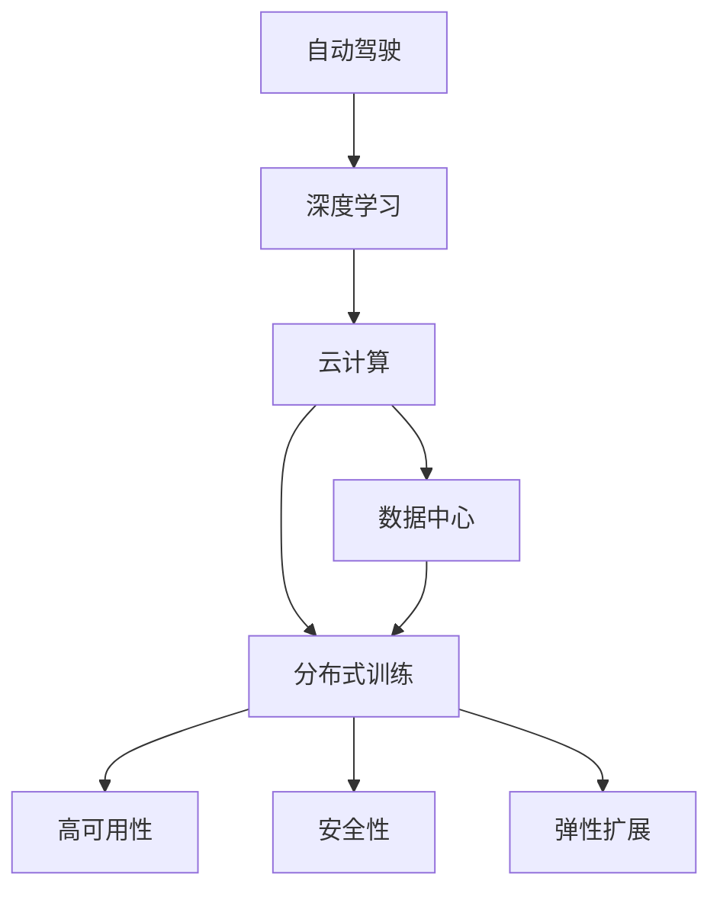

                 

# 自动驾驶公司的云端训练设施建设

> 关键词：自动驾驶, 深度学习, 云计算, 数据中心, 分布式训练, 高可用性, 安全性, 弹性扩展

## 1. 背景介绍

### 1.1 问题由来
随着自动驾驶技术的日益成熟，各大汽车制造商和科技公司纷纷将其作为未来业务的重要方向。自动驾驶系统依赖于复杂的感知、决策和控制模块，其中深度学习技术是核心技术之一。从感知摄像头、雷达到车辆的物理仿真，深度学习模型需要大量的数据和计算资源进行训练和优化。

然而，自建大规模数据中心和计算集群需要巨额的初始投入和后期维护成本。如何在不增加过重负担的情况下，高效、安全地进行深度学习模型的训练，成为了各大公司亟需解决的难题。

### 1.2 问题核心关键点
本节将介绍自动驾驶公司需要关注的几个关键问题：

- **数据获取和预处理**：如何高效、安全地收集和预处理自动驾驶数据？
- **计算资源管理**：如何在有限预算下，获取足够的计算资源进行深度学习模型训练？
- **模型性能优化**：如何提高深度学习模型的性能和泛化能力？
- **模型部署与监控**：如何将训练好的模型部署到生产环境，并进行有效的监控和维护？

这些问题的核心在于构建一个高效、可靠、安全的云端训练设施，来支撑自动驾驶技术的研究和开发。

## 2. 核心概念与联系

### 2.1 核心概念概述

为更好地理解自动驾驶公司的云端训练设施建设，本节将介绍几个密切相关的核心概念：

- **自动驾驶**：利用人工智能和计算机视觉技术，使车辆具备自主导航和决策能力。
- **深度学习**：通过多层神经网络，利用大量数据进行训练，实现模式识别、图像处理等任务。
- **云计算**：通过互联网提供可扩展的计算资源，支持大规模数据处理和模型训练。
- **数据中心**：由多个服务器和网络设备组成的计算机集群，用于高性能计算。
- **分布式训练**：通过多个计算节点同时进行模型训练，提高计算效率。
- **高可用性**：系统应能在硬件或软件故障时，保障服务的连续性。
- **安全性**：系统应能有效防范各类安全威胁，保障数据和计算资源的安全。
- **弹性扩展**：根据负载变化，动态调整资源配置，实现高效利用。

这些概念之间的逻辑关系可以通过以下Mermaid流程图来展示：



这个流程图展示了一系列相关概念及其之间的关系：

1. 自动驾驶技术依赖于深度学习模型的训练。
2. 深度学习模型需要大量的计算资源，而云计算提供了可扩展的计算平台。
3. 数据中心是云计算的硬件基础，用于支撑大规模计算任务。
4. 分布式训练利用多台计算机并行计算，提高训练效率。
5. 高可用性和安全性是系统稳定运行的基础。
6. 弹性扩展允许根据需求动态调整计算资源，确保最佳使用效率。

这些概念共同构成了自动驾驶公司云端训练设施建设的核心框架，支撑自动驾驶技术的研究和应用。

## 3. 核心算法原理 & 具体操作步骤
### 3.1 算法原理概述

自动驾驶公司的云端训练设施建设，本质上是一个复杂的高性能计算系统设计过程。其核心思想是：通过云计算和分布式计算技术，在远程数据中心内构建高效、可靠、安全的计算环境，用于深度学习模型的训练和优化。

形式化地，假设自动驾驶公司需要训练的深度学习模型为 $M_{\theta}$，其中 $\theta$ 为模型参数。给定计算集群 $C$ 和训练数据集 $D=\{(x_i, y_i)\}_{i=1}^N$，其中 $x_i$ 为训练样本，$y_i$ 为标签。模型的训练过程可以表示为：

$$
M_{\theta}^* = \mathop{\arg\min}_{\theta} \mathcal{L}(M_{\theta}, D)
$$

其中 $\mathcal{L}$ 为训练损失函数，用于衡量模型在训练集上的预测与真实标签之间的差距。常见的损失函数包括交叉熵损失、均方误差损失等。

### 3.2 算法步骤详解

自动驾驶公司的云端训练设施建设，一般包括以下几个关键步骤：

**Step 1: 数据中心设计与规划**
- 根据计算需求，选择合适的地理位置，设计数据中心的基本架构。
- 确定计算节点的数量、配置和网络拓扑。
- 设计高效的数据存储和备份机制，确保数据安全。

**Step 2: 计算资源配置与调度**
- 根据模型规模和训练需求，配置适量的计算资源。
- 引入分布式计算框架（如Spark、TensorFlow等），支持大规模并行训练。
- 设计资源调度策略，根据需求动态调整计算资源，实现弹性扩展。

**Step 3: 模型训练与优化**
- 选择合适的深度学习框架（如PyTorch、TensorFlow等），进行模型构建和训练。
- 引入高性能优化算法（如Adam、SGD等），加速模型收敛。
- 应用正则化技术（如L2正则、Dropout等），防止模型过拟合。
- 设计合理的超参数调整策略，提高模型泛化能力。

**Step 4: 模型部署与监控**
- 将训练好的模型部署到生产环境，设计合理的模型服务接口。
- 引入监控工具（如Prometheus、Grafana等），实时监测模型性能和状态。
- 设计告警机制，及时响应系统异常和故障。

**Step 5: 安全与备份**
- 引入网络安全技术（如防火墙、VPN等），保障数据中心的安全性。
- 设计数据备份和灾难恢复机制，确保数据的持续可用性。
- 定期进行安全审计和风险评估，及时修补漏洞。

### 3.3 算法优缺点

自动驾驶公司的云端训练设施建设，具有以下优点：
1. 高效利用资源：通过分布式计算和弹性扩展，最大化计算资源的利用效率。
2. 降低成本：利用云计算和第三方服务，减少自建数据中心的初始投入和维护成本。
3. 高可用性和安全性：通过分布式架构和多重安全防护，保障系统的稳定运行和数据安全。
4. 灵活扩展：根据业务需求动态调整计算资源，确保系统的可扩展性。

同时，该方法也存在一些局限性：
1. 延迟和带宽问题：远程计算可能导致数据传输延迟和带宽限制，影响训练效率。
2. 数据隐私风险：数据在云端存储和传输，可能面临数据泄露和隐私侵犯的风险。
3. 管理复杂度：分布式系统的管理和维护难度较高，需要专业运维团队支持。

尽管存在这些局限性，但就目前而言，云端训练设施建设仍是自动驾驶公司的主流选择。未来相关研究的重点在于如何进一步降低远程计算的延迟和带宽消耗，提高系统的管理效率，同时兼顾数据隐私和安全性。

### 3.4 算法应用领域

自动驾驶公司的云端训练设施建设，在深度学习模型的训练、优化和部署中具有广泛的应用。

1. **传感器数据处理**：自动驾驶车辆搭载的各种传感器（如摄像头、雷达）生成的海量数据，需要经过预处理和清洗，用于训练感知模型。
2. **场景模拟**：通过仿真环境，模拟复杂道路场景，用于训练车辆的决策和控制模型。
3. **驾驶策略优化**：利用强化学习等方法，优化车辆的驾驶策略，提升安全性和舒适性。
4. **路径规划与导航**：通过学习历史行驶数据，优化路径规划算法，实现高效导航。
5. **车辆通信与协作**：利用深度学习技术，提升车辆间的通信和协作能力，增强团队驾驶效果。

除了这些关键任务外，云端训练设施还为自动驾驶技术的研究和应用提供了重要的技术支撑，如数据管理、模型存储、模型部署等。

## 4. 数学模型和公式 & 详细讲解 & 举例说明

### 4.1 数学模型构建

本节将使用数学语言对自动驾驶公司云端训练设施建设过程中涉及的数学模型进行系统介绍。

假设自动驾驶公司需要训练的深度学习模型为 $M_{\theta}$，其中 $\theta$ 为模型参数。训练集为 $D=\{(x_i, y_i)\}_{i=1}^N$，其中 $x_i$ 为输入，$y_i$ 为标签。模型的训练过程可以表示为：

$$
M_{\theta}^* = \mathop{\arg\min}_{\theta} \mathcal{L}(M_{\theta}, D)
$$

其中 $\mathcal{L}$ 为训练损失函数，通常为交叉熵损失函数：

$$
\mathcal{L} = -\frac{1}{N}\sum_{i=1}^N \sum_{j=1}^C y_{i,j}\log M_{\theta}(x_i, j)
$$

其中 $y_{i,j}$ 为样本 $i$ 在类别 $j$ 上的标签，$M_{\theta}(x_i, j)$ 为模型在输入 $x_i$ 下，对类别 $j$ 的预测概率。

### 4.2 公式推导过程

以自动驾驶感知模型为例，其输入为摄像头拍摄的图像 $x$，输出为物体的位置和类别。假设模型结构为卷积神经网络，由多个卷积层和池化层组成。输入图像经过一系列卷积和池化操作后，进入全连接层进行分类，最终输出物体类别概率分布。

模型的训练过程可以表示为：

$$
\min_{\theta} \mathcal{L}(M_{\theta}, D) = \min_{\theta} \frac{1}{N}\sum_{i=1}^N \mathcal{L}_i
$$

其中 $\mathcal{L}_i = -\frac{1}{m_i}\sum_{j=1}^{m_i} y_{i,j}\log M_{\theta}(x_i, j)$，$m_i$ 为样本 $i$ 中物体的数量。

模型的梯度更新公式为：

$$
\theta \leftarrow \theta - \eta \nabla_{\theta} \mathcal{L}(\theta)
$$

其中 $\eta$ 为学习率，$\nabla_{\theta} \mathcal{L}(\theta)$ 为损失函数对模型参数的梯度，通过反向传播算法计算得到。

### 4.3 案例分析与讲解

假设自动驾驶公司需要训练的感知模型为卷积神经网络（CNN），输入为摄像头图像，输出为车辆周围物体的类别和位置。训练过程中，首先需要对图像进行预处理，包括归一化、裁剪、缩放等操作，以便模型能够更好地学习特征。然后，将处理后的图像输入卷积层进行特征提取，通过池化层降低特征图尺寸，进入全连接层进行分类，最后输出物体的类别和位置。

训练过程中，模型使用交叉熵损失函数，通过反向传播算法计算梯度，更新模型参数。为了加速训练过程，可以引入正则化技术（如L2正则、Dropout等），防止过拟合。同时，采用分布式训练框架（如TensorFlow、PyTorch等），将数据并行分布在多个计算节点上进行并行计算，显著提高训练效率。

## 5. 项目实践：代码实例和详细解释说明

### 5.1 开发环境搭建

在进行自动驾驶公司云端训练设施建设的项目实践前，我们需要准备好开发环境。以下是使用Python进行PyTorch开发的环境配置流程：

1. 安装Anaconda：从官网下载并安装Anaconda，用于创建独立的Python环境。

2. 创建并激活虚拟环境：
```bash
conda create -n pytorch-env python=3.8 
conda activate pytorch-env
```

3. 安装PyTorch：根据CUDA版本，从官网获取对应的安装命令。例如：
```bash
conda install pytorch torchvision torchaudio cudatoolkit=11.1 -c pytorch -c conda-forge
```

4. 安装TensorFlow：如果需要在模型中使用分布式训练，可以参考官方文档进行安装。

5. 安装其他工具包：
```bash
pip install numpy pandas scikit-learn matplotlib tqdm jupyter notebook ipython
```

完成上述步骤后，即可在`pytorch-env`环境中开始自动驾驶感知模型的训练实践。

### 5.2 源代码详细实现

下面我们以自动驾驶感知模型为例，给出使用PyTorch进行模型训练的代码实现。

首先，定义模型的数据处理函数：

```python
from torch.utils.data import Dataset, DataLoader
from torchvision import transforms
import torch

class ObjectDetectionDataset(Dataset):
    def __init__(self, images, annotations, transform=None):
        self.images = images
        self.annotations = annotations
        self.transform = transform
        
    def __len__(self):
        return len(self.images)
    
    def __getitem__(self, idx):
        image = self.images[idx]
        annotation = self.annotations[idx]
        
        if self.transform:
            image = self.transform(image)
        
        return {'image': image, 'annotation': annotation}

# 定义数据预处理和增强操作
transform = transforms.Compose([
    transforms.Resize((256, 256)),
    transforms.ToTensor(),
    transforms.Normalize(mean=[0.485, 0.456, 0.406], std=[0.229, 0.224, 0.225])
])

# 加载数据集
train_dataset = ObjectDetectionDataset(train_images, train_annotations, transform)
test_dataset = ObjectDetectionDataset(test_images, test_annotations, transform)
```

然后，定义模型和优化器：

```python
from torch.nn import Conv2d, MaxPool2d, AdaptiveAvgPool2d, BatchNorm2d
from torch.nn import Sequential
from torch.optim import Adam

# 定义模型结构
model = Sequential(
    Conv2d(3, 64, kernel_size=3, stride=1, padding=1),
    BatchNorm2d(64),
    MaxPool2d(kernel_size=2, stride=2),
    Conv2d(64, 128, kernel_size=3, stride=1, padding=1),
    BatchNorm2d(128),
    MaxPool2d(kernel_size=2, stride=2),
    AdaptiveAvgPool2d(7),
    Flatten(),
    Linear(2048, 10)
)

# 定义优化器
optimizer = Adam(model.parameters(), lr=0.001)
```

接着，定义训练和评估函数：

```python
from tqdm import tqdm

device = torch.device('cuda' if torch.cuda.is_available() else 'cpu')
model.to(device)

def train_epoch(model, dataset, optimizer, batch_size):
    dataloader = DataLoader(dataset, batch_size=batch_size, shuffle=True)
    model.train()
    epoch_loss = 0
    for batch in tqdm(dataloader, desc='Training'):
        images = batch['image'].to(device)
        annotations = batch['annotation'].to(device)
        model.zero_grad()
        outputs = model(images)
        loss = F.cross_entropy(outputs, annotations)
        epoch_loss += loss.item()
        loss.backward()
        optimizer.step()
    return epoch_loss / len(dataloader)

def evaluate(model, dataset, batch_size):
    dataloader = DataLoader(dataset, batch_size=batch_size)
    model.eval()
    preds, labels = [], []
    with torch.no_grad():
        for batch in tqdm(dataloader, desc='Evaluating'):
            images = batch['image'].to(device)
            outputs = model(images)
            preds.append(outputs.argmax(dim=1).tolist())
            labels.append(batch['annotation'].tolist())
    print(classification_report(labels, preds))
```

最后，启动训练流程并在测试集上评估：

```python
epochs = 10
batch_size = 16

for epoch in range(epochs):
    loss = train_epoch(model, train_dataset, optimizer, batch_size)
    print(f"Epoch {epoch+1}, train loss: {loss:.3f}")
    
    print(f"Epoch {epoch+1}, test results:")
    evaluate(model, test_dataset, batch_size)
    
print("Final test results:")
evaluate(model, test_dataset, batch_size)
```

以上就是使用PyTorch进行自动驾驶感知模型训练的完整代码实现。可以看到，利用TensorFlow等分布式框架，可以进一步优化模型的训练过程，提升计算效率。

### 5.3 代码解读与分析

让我们再详细解读一下关键代码的实现细节：

**ObjectDetectionDataset类**：
- `__init__`方法：初始化图像和标注数据，并进行数据预处理。
- `__len__`方法：返回数据集的样本数量。
- `__getitem__`方法：对单个样本进行处理，将图像和标注数据转换为Tensor，并进行标准化。

**数据预处理和增强操作**：
- 定义了数据预处理和增强操作，包括图像缩放、归一化等，用于提高模型训练的稳定性。

**模型定义**：
- 定义了卷积神经网络的层次结构，包括卷积层、池化层和全连接层。
- 使用PyTorch的Sequential模块进行模型封装，方便构建和训练。

**优化器定义**：
- 定义了Adam优化器，设置学习率为0.001。

**训练和评估函数**：
- 使用PyTorch的DataLoader进行数据批处理，便于模型的训练和推理。
- 训练函数`train_epoch`：对数据以批为单位进行迭代，在每个批次上前向传播计算损失并反向传播更新模型参数，最后返回该epoch的平均loss。
- 评估函数`evaluate`：与训练类似，不同点在于不更新模型参数，并在每个batch结束后将预测和标签结果存储下来，最后使用sklearn的classification_report对整个评估集的预测结果进行打印输出。

**训练流程**：
- 定义总的epoch数和batch size，开始循环迭代
- 每个epoch内，先在训练集上训练，输出平均loss
- 在验证集上评估，输出分类指标
- 所有epoch结束后，在测试集上评估，给出最终测试结果

可以看到，PyTorch配合TensorFlow等分布式框架使得自动驾驶感知模型的训练代码实现变得简洁高效。开发者可以将更多精力放在模型设计、数据处理等高层逻辑上，而不必过多关注底层的实现细节。

当然，工业级的系统实现还需考虑更多因素，如模型的保存和部署、超参数的自动搜索、更灵活的任务适配层等。但核心的训练范式基本与此类似。

## 6. 实际应用场景
### 6.1 智能驾驶系统

自动驾驶公司的云端训练设施，可以广泛应用于智能驾驶系统的构建。智能驾驶系统通过多传感器融合、路径规划和控制等模块，实现车辆自主导航和决策。利用云端训练设施，可以对感知模型、决策模型、控制模型进行高效训练和优化。

在技术实现上，可以收集车辆在实际道路上的行驶数据，标注其中的物体、道路和交通信号等信息。在此基础上，对预训练模型进行微调，使其适应实际驾驶场景。微调后的模型能够自动理解道路环境和交通情况，生成更准确的感知和决策结果。

### 6.2 模拟器训练

自动驾驶公司的云端训练设施，还可以用于驾驶模拟器中的训练。模拟器可以模拟各种道路和交通条件，用于测试和优化自动驾驶算法。利用云端训练设施，可以对模型在模拟器中的表现进行评估和优化，提升模型在真实道路上的可靠性。

在训练过程中，可以引入自动驾驶模拟器，对模型进行高精度模拟训练。通过反复迭代训练和评估，不断优化模型的感知和决策能力，确保其在各种复杂场景下都能稳定运行。

### 6.3 安全与测试

自动驾驶公司的云端训练设施，可以用于模型安全性和鲁棒性的测试。通过对模型进行攻击测试和鲁棒性评估，可以发现模型的漏洞和缺陷，及时进行修复和优化。

在测试过程中，可以引入对抗样本生成技术，对模型进行攻击测试。通过模拟各种攻击场景，评估模型的鲁棒性和安全性，确保其在实际应用中的可靠性。

### 6.4 未来应用展望

随着自动驾驶技术的不断发展，云端训练设施将在自动驾驶技术的研究和应用中发挥越来越重要的作用。

1. **大规模数据处理**：自动驾驶技术依赖于大量的道路数据，云端训练设施可以处理大规模数据，提高数据处理效率。
2. **高性能计算**：自动驾驶模型需要高精度计算，云端训练设施可以提供高效的计算资源。
3. **弹性扩展**：自动驾驶模型的训练和推理需求波动较大，云端训练设施可以动态调整计算资源，实现弹性扩展。
4. **模型部署与管理**：云端训练设施可以方便地将训练好的模型部署到生产环境，并对其进行监控和管理。
5. **多模态融合**：云端训练设施可以支持多模态数据的融合，提升模型的感知和决策能力。

以上趋势凸显了自动驾驶公司云端训练设施的广阔前景。这些方向的探索发展，必将进一步提升自动驾驶技术的性能和应用范围，为人类交通出行带来深刻变革。

## 7. 工具和资源推荐
### 7.1 学习资源推荐

为了帮助开发者系统掌握自动驾驶公司云端训练设施的理论基础和实践技巧，这里推荐一些优质的学习资源：

1. 《深度学习与自动驾驶》书籍：详细介绍自动驾驶中的深度学习技术，包括感知、决策和控制模块的构建和优化。
2. 《云计算与分布式计算》课程：介绍云计算和分布式计算的基本原理和应用，涵盖自动驾驶中计算资源的管理和调度。
3. 《自动驾驶技术与应用》课程：由各大高校和研究机构开设，涵盖自动驾驶技术的各个方面，包括感知、决策和控制等。
4. 《PyTorch官方文档》：PyTorch的官方文档，提供了丰富的模型训练和优化技巧，包括分布式训练、模型优化等。
5. 《TensorFlow官方文档》：TensorFlow的官方文档，提供了分布式计算和模型优化的详细指南。

通过对这些资源的学习实践，相信你一定能够快速掌握自动驾驶公司云端训练设施的理论基础和实践技巧，并在实际项目中灵活应用。

### 7.2 开发工具推荐

高效的开发离不开优秀的工具支持。以下是几款用于自动驾驶公司云端训练设施开发的常用工具：

1. PyTorch：基于Python的开源深度学习框架，灵活的计算图，支持分布式训练和优化。
2. TensorFlow：由Google主导开发的开源深度学习框架，生产部署方便，支持大规模工程应用。
3. Weights & Biases：模型训练的实验跟踪工具，可以记录和可视化模型训练过程中的各项指标，方便对比和调优。
4. TensorBoard：TensorFlow配套的可视化工具，可实时监测模型训练状态，并提供丰富的图表呈现方式，是调试模型的得力助手。
5. Prometheus：高性能监控系统，支持分布式计算资源的动态管理，实时监测系统的性能和健康状况。
6. Kubernetes：开源容器编排系统，支持大规模分布式应用的部署和管理。

合理利用这些工具，可以显著提升自动驾驶公司云端训练设施的开发效率，加快创新迭代的步伐。

### 7.3 相关论文推荐

自动驾驶公司云端训练设施的研究，源自学界的持续研究。以下是几篇奠基性的相关论文，推荐阅读：

1. "Towards High Performance and Fault-Tolerant Clusters for Distributed Machine Learning"：介绍大规模分布式计算集群的设计和优化，为自动驾驶公司提供了高效的计算资源管理方案。
2. "AutoML: Bridging Machine Learning and Artificial Intelligence"：探讨自动机器学习技术在自动驾驶中的应用，提升了模型训练的自动化和效率。
3. "Distributed Deep Learning for Real-Time Object Detection"：提出分布式深度学习框架，用于自动驾驶中实时目标检测任务，提高了计算效率和模型性能。
4. "Deep Reinforcement Learning for Autonomous Driving"：利用强化学习技术，优化自动驾驶中的决策和控制模型，提升了驾驶安全性。
5. "High-Performance Distributed Machine Learning for Autonomous Vehicles"：详细介绍分布式计算和机器学习在自动驾驶中的应用，探讨如何提高模型的训练和推理效率。

这些论文代表了大规模计算设施的研究进展，通过学习这些前沿成果，可以帮助研究者把握学科前进方向，激发更多的创新灵感。

## 8. 总结：未来发展趋势与挑战

### 8.1 总结

本文对自动驾驶公司云端训练设施建设进行了全面系统的介绍。首先阐述了自动驾驶技术对深度学习模型的依赖，明确了云端训练设施建设在自动驾驶研究和发展中的重要地位。其次，从原理到实践，详细讲解了计算资源管理、模型训练与优化、模型部署与监控等关键步骤，给出了自动驾驶感知模型的完整代码实现。同时，本文还广泛探讨了云端训练设施在智能驾驶系统、模拟器训练、安全与测试等多个应用场景中的价值，展示了其广阔的应用前景。

通过本文的系统梳理，可以看到，自动驾驶公司的云端训练设施建设，正在成为自动驾驶技术研究的重要基础设施，支撑自动驾驶技术在实际场景中的落地应用。未来，随着计算资源和技术的不断进步，自动驾驶技术的性能和应用范围将进一步提升，为人类交通出行带来深刻的变革。

### 8.2 未来发展趋势

展望未来，自动驾驶公司的云端训练设施建设将呈现以下几个发展趋势：

1. **大规模数据处理能力**：随着数据中心硬件的升级和计算能力的提升，自动驾驶公司将能够处理更大规模的数据，提高数据处理效率。
2. **高性能计算资源**：随着计算技术的进步，自动驾驶公司将能够获得更高性能的计算资源，提升模型的训练和推理速度。
3. **弹性扩展与灵活调度**：分布式计算框架和弹性计算资源调度技术将进一步发展，自动驾驶公司将能够根据需求动态调整计算资源，实现高效利用。
4. **多模态数据融合**：自动驾驶技术将能够融合视觉、雷达、激光雷达等多模态数据，提升模型的感知和决策能力。
5. **自动机器学习与模型优化**：自动机器学习（AutoML）技术将进一步普及，模型训练和优化过程将更加自动化，提升模型性能和泛化能力。
6. **边缘计算与智能网联**：自动驾驶技术将进一步向边缘计算和智能网联方向发展，提升系统的实时性和可靠性。

以上趋势凸显了自动驾驶公司云端训练设施的广阔前景。这些方向的探索发展，必将进一步提升自动驾驶技术的性能和应用范围，为人类交通出行带来深刻的变革。

### 8.3 面临的挑战

尽管自动驾驶公司的云端训练设施建设在技术上取得了显著进展，但在迈向更加智能化、普适化应用的过程中，它仍面临诸多挑战：

1. **计算资源成本**：大规模计算设施的建设、维护和运营成本较高，需要投入大量资金。如何降低成本，提高资源利用效率，是关键问题。
2. **数据隐私与安全**：自动驾驶公司需要处理大量敏感数据，数据隐私和安全性问题不容忽视。如何在保障数据安全的前提下，高效利用数据，是重要课题。
3. **系统复杂度**：自动驾驶系统涉及多层次、多领域的复杂计算任务，系统设计和维护难度较高。需要建立专业的运维团队，保障系统的稳定运行。
4. **环境变化与动态调整**：自动驾驶系统需要在不断变化的环境中运行，如何动态调整系统配置，满足实时需求，是技术难点。
5. **模型可解释性与透明度**：自动驾驶模型往往缺乏可解释性，难以理解其内部工作机制和决策逻辑。如何在提高模型性能的同时，增强可解释性和透明度，是亟待解决的问题。

尽管存在这些挑战，但随着技术的不断进步和实践的深入，自动驾驶公司云端训练设施建设必将逐步克服困难，为自动驾驶技术的研究和应用提供坚实的技术基础。未来，自动驾驶公司需进一步优化计算资源管理，提升数据处理能力，保障数据安全，增强模型可解释性和透明度，共同推动自动驾驶技术的进步和发展。

### 8.4 研究展望

面向未来，自动驾驶公司云端训练设施建设需要从以下几个方面进行深入研究：

1. **数据与模型协同优化**：结合大数据和深度学习技术，探索更高效的数据处理和模型训练方法，提高资源利用效率。
2. **自动机器学习与智能优化**：引入自动机器学习技术，自动化模型训练和超参数调整，提升模型性能和泛化能力。
3. **边缘计算与智能网联**：探索边缘计算和智能网联技术在自动驾驶中的应用，提升系统的实时性和可靠性。
4. **模型可解释性与透明度**：引入可解释性技术，增强模型决策过程的可理解性和透明度，提升模型的可信度和可用性。
5. **数据隐私与安全**：探索数据隐私保护技术，保障数据安全，提升用户信任和接受度。

这些研究方向将推动自动驾驶公司云端训练设施建设不断进步，为自动驾驶技术的研究和应用提供更强大的技术支撑，共同推动自动驾驶技术的进步和发展。

## 9. 附录：常见问题与解答

**Q1：如何优化自动驾驶感知模型的训练效率？**

A: 自动驾驶感知模型的训练效率优化可以从以下几个方面入手：
1. 使用分布式计算框架，如TensorFlow、PyTorch等，并行计算模型参数更新，提高训练速度。
2. 引入数据增强技术，扩充训练集，提升模型泛化能力。
3. 应用高性能优化算法，如Adam、SGD等，加快模型收敛速度。
4. 使用混合精度训练（Mixed Precision Training），减少计算资源消耗，提高训练效率。
5. 进行模型裁剪和量化，减小模型尺寸，提升推理速度。

**Q2：自动驾驶感知模型的计算资源需求如何估算？**

A: 自动驾驶感知模型的计算资源需求估算可以从以下几个方面考虑：
1. 根据模型规模和复杂度，估算模型参数数量，计算内存占用。
2. 根据训练样本数量和模型结构，估算模型训练所需的计算资源。
3. 根据模型推理和实时响应的要求，估算模型推理所需的计算资源。
4. 考虑模型的优化和压缩技术，如量化、剪枝等，进一步降低资源需求。
5. 参考已有的模型训练实践，根据实际效果进行动态调整。

**Q3：如何保障自动驾驶感知模型的安全性？**

A: 自动驾驶感知模型的安全性保障可以从以下几个方面考虑：
1. 引入数据加密和访问控制技术，保障数据传输和存储的安全性。
2. 设计模型漏洞检测和防护机制，及时发现和修补安全漏洞。
3. 引入对抗样本生成技术，测试和评估模型的鲁棒性和安全性。
4. 引入模型监控和告警机制，及时响应异常和故障。
5. 定期进行安全审计和风险评估，提升模型的安全性和可靠性。

**Q4：自动驾驶感知模型在实际应用中面临哪些挑战？**

A: 自动驾驶感知模型在实际应用中面临以下挑战：
1. 实时性和效率：模型需要在实时环境中运行，需要高效计算资源支持。
2. 数据多样性和泛化能力：不同环境和场景下的数据存在差异，模型需要具备较好的泛化能力。
3. 模型可解释性和透明度：模型的决策过程缺乏可解释性，难以理解和调试。
4. 数据隐私和安全：自动驾驶模型处理大量敏感数据，数据隐私和安全问题不容忽视。
5. 模型鲁棒性和可靠性：模型需要具备较高的鲁棒性和可靠性，以应对复杂多变的道路环境。

**Q5：自动驾驶感知模型的部署与监控策略是什么？**

A: 自动驾驶感知模型的部署与监控策略可以从以下几个方面考虑：
1. 选择合适的部署平台和环境，如云端或本地部署，考虑计算资源和网络带宽的限制。
2. 设计合理的模型服务接口，支持模型的集成和调用。
3. 引入监控工具，实时监测模型的性能和状态，如Prometheus、TensorBoard等。
4. 设计告警机制，及时响应系统异常和故障，保障系统的稳定运行。
5. 定期进行模型更新和维护，确保模型的可靠性和性能。

通过以上措施，可以有效保障自动驾驶感知模型的部署与监控，确保其在实际应用中的稳定运行和性能表现。

---

作者：禅与计算机程序设计艺术 / Zen and the Art of Computer Programming

