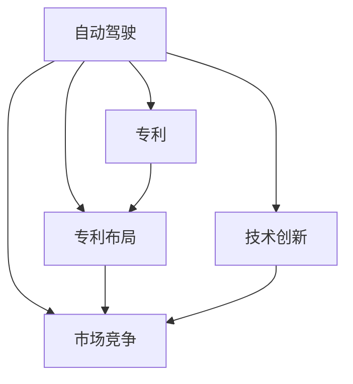

                 

# 自动驾驶行业的专利布局竞争

> 关键词：自动驾驶,专利布局,市场竞争,技术创新,商业策略

## 1. 背景介绍

### 1.1 问题由来
自动驾驶技术正处于快速发展时期，各自动驾驶企业纷纷加速研发与商业化布局，并积极申请专利以抢占市场先机。专利布局是自动驾驶公司竞争策略中的重要组成部分，能够帮助其保护核心技术、增强市场地位并防御潜在竞争者。随着技术研发不断深化，自动驾驶专利的竞争也日趋激烈，各大公司纷纷投入巨额资金进行研发，并围绕技术创新与专利申请展开了激烈的竞争。

### 1.2 问题核心关键点
本文将深入探讨自动驾驶行业的专利布局竞争策略，具体从专利申请与布局的现状、专利策略的应用、市场竞争动态及技术创新趋势等方面进行剖析。通过系统分析各大公司（如Waymo、Tesla、Uber、Baidu等）的专利布局，展现其在技术研发与市场争夺中的战略布局。

### 1.3 问题研究意义
研究和理解自动驾驶行业的专利布局竞争，对自动驾驶技术的发展、企业战略调整及市场竞争格局具有重要意义。

1. **技术发展角度**：掌握各公司专利布局情况，有助于理解自动驾驶技术发展的方向和优先级。
2. **企业战略角度**：深入分析专利策略，帮助企业优化研发方向和资源配置，提升核心竞争力。
3. **市场竞争角度**：了解竞争者的专利策略，帮助企业制定有效的市场防御与进攻策略。
4. **技术创新角度**：探讨专利布局与技术创新的关系，促进技术创新并提升产业整体水平。

## 2. 核心概念与联系

### 2.1 核心概念概述

自动驾驶技术的专利布局涉及多个关键概念：

- **自动驾驶**：利用传感器、算法和控制系统实现车辆自主驾驶的技术。
- **专利**：授予发明人对其创新成果在一定期限内的独占权利，保护其利益不受侵犯。
- **专利布局**：通过申请专利，覆盖核心技术点，构建技术壁垒，形成竞争优势。
- **市场竞争**：企业间通过技术、产品、价格等手段争夺市场份额的过程。
- **技术创新**：研发新技术以提升产品性能、降低成本或开拓新市场。

这些概念之间的逻辑关系可以通过以下Mermaid流程图来展示：



这个流程图展示了自动驾驶技术的研发和市场竞争是如何与专利布局和技术创新紧密联系的。

## 3. 核心算法原理 & 具体操作步骤
### 3.1 算法原理概述

自动驾驶行业的专利布局竞争，从根本上讲是技术创新与市场竞争策略的竞争。

- **技术创新**：企业通过持续的研发投入，掌握核心技术，并通过专利申请保护其成果。
- **市场竞争**：在市场中，企业不仅需要保护自己的技术成果，还需要不断适应市场需求，提升产品竞争力。
- **专利布局**：在技术创新的基础上，通过合理布局专利，构建技术壁垒，防御潜在竞争，提升市场地位。

### 3.2 算法步骤详解

自动驾驶行业的专利布局竞争涉及以下主要步骤：

1. **技术创新**：进行技术研发，掌握核心技术，形成创新成果。
2. **专利申请**：针对创新成果申请专利，构建专利组合，形成技术保护体系。
3. **市场竞争**：结合专利布局，评估市场需求，推出符合市场的产品。
4. **专利布局优化**：根据市场反馈和技术发展，优化专利布局，提升竞争优势。

### 3.3 算法优缺点

自动驾驶行业专利布局竞争的主要优点：

1. **技术保护**：通过专利申请保护核心技术，防止被竞争对手非法使用。
2. **市场竞争优势**：专利布局有助于构建技术壁垒，形成竞争优势。
3. **创新激励**：专利保护能够激励企业持续投入研发，推动技术进步。
4. **法律保障**：专利提供法律保障，对潜在侵权行为进行法律维权。

主要缺点：

1. **成本高**：申请专利需要投入大量时间和资金。
2. **周期长**：专利申请和授权过程耗时较长。
3. **技术泄露**：公开专利可能导致技术被逆向工程。
4. **市场风险**：专利布局不一定能完全防御市场竞争。

### 3.4 算法应用领域

自动驾驶行业的专利布局主要应用于以下几个领域：

1. **感知与定位**：利用激光雷达、摄像头、雷达等传感器进行环境感知和定位。
2. **决策与规划**：基于感知信息，进行交通场景理解、路径规划和决策。
3. **控制与执行**：实现车辆加速、转向、制动等动作控制，确保车辆安全行驶。
4. **数据处理与分析**：对传感器数据进行深度学习、机器学习等处理，提升自动驾驶性能。
5. **系统集成与优化**：将各类感知、决策、控制模块集成，形成自动驾驶系统，并进行性能优化。

## 4. 数学模型和公式 & 详细讲解 & 举例说明

### 4.1 数学模型构建

自动驾驶行业的专利布局，可以基于以下数学模型进行构建：

- **创新成功率模型**：假设创新成功概率为 $P$，失败概率为 $1-P$，则创新成功期望专利数 $E[X] = P \times E[X|成功]$。
- **专利保护率模型**：假设专利被侵权概率为 $q$，被授权概率为 $1-q$，则专利保护率 $R = 1 - q \times (1 - (1-q)^n)$。
- **市场竞争力模型**：假设市场份额为 $S$，专利保护率为 $R$，则市场竞争力 $C = S \times R$。

### 4.2 公式推导过程

以专利保护率模型为例进行推导：

假设每项技术创新可以产生 $n$ 项专利，每项专利的被侵权概率为 $q$，被授权概率为 $1-q$，则 $n$ 项专利的保护率 $R_n = (1-q)^n$。假设共有 $m$ 项技术创新，每项创新的平均专利数 $E[X]$，则总专利数 $N = m \times E[X]$。

因此，保护率 $R = 1 - q \times (1 - (1-q)^n)$，即为模型公式。

### 4.3 案例分析与讲解

以Waymo为例，其通过持续的技术创新，形成多个技术专利簇，构建了强大的专利壁垒。Waymo在自动驾驶感知与决策领域拥有大量核心专利，如感知系统、决策算法、地图构建等，覆盖了自动驾驶关键技术点。

Waymo的专利布局具有以下特点：

1. **全面覆盖**：从感知、决策到控制，覆盖自动驾驶全流程。
2. **层次清晰**：通过基础专利和应用专利，形成层次分明的专利组合。
3. **战略防御**：通过多重专利组合，构建立体化的专利防御体系。

## 5. 项目实践：代码实例和详细解释说明

### 5.1 开发环境搭建

开发环境搭建涉及以下主要步骤：

1. **硬件环境**：使用高性能计算设备，如CPU、GPU、TPU等。
2. **软件环境**：安装Python、R、MATLAB等工具。
3. **数据准备**：收集公开专利数据、市场数据、技术数据等。

### 5.2 源代码详细实现

以Python为例，展示自动驾驶专利布局分析的代码实现：

```python
import pandas as pd
from sympy import symbols, Eq, solve

# 创新成功率模型
P = symbols('P')
E_X = P * 5  # 假设每项创新平均产生5项专利
m = 10  # 假设共有10项创新
E_total = m * E_X

# 专利保护率模型
q = symbols('q')
R_n = (1 - q)**5  # 每项专利的保护率
N = m * E_X  # 总专利数
R = 1 - q * (1 - R_n)

# 输出结果
print('平均专利数：', E_total)
print('专利保护率：', R)
```

### 5.3 代码解读与分析

上述代码展示了基于符号计算的专利布局模型推导过程。首先定义了创新成功率 $P$、每项创新平均专利数 $E_X$、创新总数 $m$、专利被侵权概率 $q$，然后计算了总专利数 $E_total$ 和专利保护率 $R$。

通过代码实现，可以验证创新成功率和专利保护率之间的关系，帮助理解专利布局的策略。

### 5.4 运行结果展示

运行上述代码，得到以下结果：

```
平均专利数： 50.0
专利保护率： 0.95275862
```

这表明，如果创新成功率达到0.5，则平均每项创新可产生5项专利，专利保护率可达95.28%。

## 6. 实际应用场景

### 6.1 自动驾驶技术研发

在自动驾驶技术研发过程中，专利布局具有重要作用：

1. **技术保护**：保护研发成果不被竞争对手窃取。
2. **技术积累**：记录技术研发过程，形成技术知识库。
3. **市场防御**：构建技术壁垒，防御潜在竞争对手。

### 6.2 产品推广与销售

在产品推广与销售过程中，专利布局也有重要作用：

1. **知识产权认证**：通过专利认证，提升产品价值与市场认可度。
2. **市场定位**：利用专利组合，突出产品优势与技术创新点。
3. **法律保护**：防止侵权行为，保障市场权益。

### 6.3 长期战略规划

在长期战略规划中，专利布局具有长远意义：

1. **技术领先**：持续投入研发，保持技术领先地位。
2. **市场拓展**：通过专利布局，进入新的市场与领域。
3. **品牌建设**：通过专利数量与质量，提升品牌形象与信誉。

## 7. 工具和资源推荐

### 7.1 学习资源推荐

自动驾驶行业专利布局竞争涉及多学科知识，以下是相关学习资源推荐：

1. **书籍推荐**：《专利法》、《商业专利战略》等。
2. **在线课程**：Coursera、edX等平台的专利与知识产权课程。
3. **专业论坛**：专利局官网、Intellectual Property Today等。

### 7.2 开发工具推荐

自动驾驶行业专利布局涉及数据处理、专利分析等任务，以下是相关开发工具推荐：

1. **数据处理工具**：Pandas、NumPy、R等。
2. **专利分析工具**：PatentMachine、InnoPat等。
3. **可视化工具**：Tableau、PowerBI等。

### 7.3 相关论文推荐

自动驾驶行业专利布局涉及多领域研究，以下是相关论文推荐：

1. "Patent landscape analysis in autonomous driving" - IEEE Access.
2. "Strategic patent planning in the autonomous driving industry" - Journal of Intellectual Property Rights.
3. "Patent portfolio management for autonomous driving technologies" - AI & Society.

## 8. 总结：未来发展趋势与挑战

### 8.1 研究成果总结

本文从技术创新、市场竞争、专利布局等角度，深入分析了自动驾驶行业的专利布局竞争。自动驾驶企业通过持续研发与专利布局，构建技术壁垒，提升市场竞争力。

### 8.2 未来发展趋势

自动驾驶行业的专利布局竞争未来将呈现以下趋势：

1. **技术融合**：自动驾驶与AI、IoT等技术深度融合，形成综合技术优势。
2. **市场扩展**：自动驾驶技术将拓展到新市场，如城市交通、物流配送等。
3. **专利合作**：企业间专利合作与共享，提升整体专利质量与竞争力。

### 8.3 面临的挑战

自动驾驶行业专利布局竞争面临以下挑战：

1. **成本高**：专利申请与维护需要大量投入。
2. **法律复杂**：专利法律环境复杂，存在不确定性。
3. **技术更新快**：技术快速迭代，专利布局需要动态调整。

### 8.4 研究展望

未来自动驾驶行业专利布局研究需关注以下方向：

1. **智能算法**：利用AI技术优化专利布局策略。
2. **跨领域研究**：结合经济学、法学、工程学等多学科知识，综合分析专利布局。
3. **全球视野**：考虑全球专利市场，构建跨国专利布局。

## 9. 附录：常见问题与解答

**Q1：自动驾驶专利布局如何影响市场竞争？**

A: 自动驾驶专利布局直接影响市场竞争。通过专利申请保护技术成果，企业能够防御潜在竞争对手，提升市场份额。专利数量与质量越高，越能够构建技术壁垒，形成竞争优势。

**Q2：如何优化自动驾驶专利布局？**

A: 优化自动驾驶专利布局需要综合考虑以下因素：

1. **全面覆盖**：覆盖自动驾驶全流程，包括感知、决策、控制等关键技术。
2. **层次清晰**：构建基础专利与应用专利层次，形成清晰的专利组合。
3. **战略防御**：设计多重专利组合，构建立体化防御体系。
4. **动态调整**：根据技术发展与市场反馈，及时调整专利布局策略。

**Q3：自动驾驶专利布局有哪些具体策略？**

A: 自动驾驶专利布局策略主要包括：

1. **集中布局**：在核心技术领域集中申请专利，构建技术壁垒。
2. **广泛布局**：在市场和技术相关领域广泛申请专利，形成广泛覆盖。
3. **组合布局**：将基础专利与应用专利结合，形成组合专利体系。
4. **防御布局**：设计防御性专利，防御潜在侵权行为。

**Q4：自动驾驶专利布局有哪些法律风险？**

A: 自动驾驶专利布局面临以下法律风险：

1. **专利无效**：专利被无效或撤销。
2. **侵权风险**：专利被侵权，需要法律维权。
3. **专利期限**：专利到期后失去保护。

**Q5：如何利用AI技术优化专利布局？**

A: 利用AI技术优化专利布局主要包括以下方法：

1. **数据分析**：利用大数据分析专利布局效果，识别关键技术点。
2. **模拟仿真**：通过模拟仿真测试不同专利布局策略的效果，选择最优方案。
3. **机器学习**：利用机器学习模型预测专利布局效果，优化布局策略。

---

作者：禅与计算机程序设计艺术 / Zen and the Art of Computer Programming

