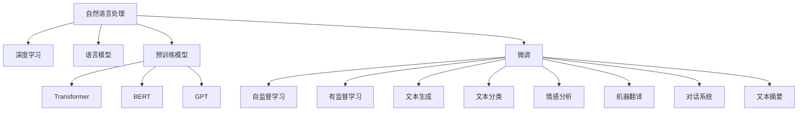

                 

# 自然语言处理的应用：AI内容创作革命

> 关键词：自然语言处理(NLP), AI内容创作,深度学习,语言模型,神经网络,Transformer,预训练模型,微调,Fine-tuning,应用案例

## 1. 背景介绍

### 1.1 问题由来
随着人工智能技术的迅猛发展，自然语言处理(NLP)领域涌现出一系列变革性的突破，显著提升了语言模型在内容生成、文本分析、机器翻译等方面的能力。其中，基于深度学习的语言模型，尤其是预训练模型，如BERT、GPT等，以其卓越的表现力和大规模应用潜力，成为当前NLP研究的热点。

自然语言处理技术不仅在文本分析和理解方面取得了显著进展，更在内容创作领域展示了广阔的应用前景。无论是自动写作、内容生成、智能对话，还是辅助创作、文本摘要、机器翻译，NLP技术正在逐步改变传统的文本生产方式，推动内容创作产业的革命。

### 1.2 问题核心关键点
NLP技术在内容创作中的应用主要集中在以下几个方面：

1. **自动写作与内容生成**：利用预训练语言模型，自动生成新闻、文章、报告等文本内容，辅助新闻、广告、教育等领域的内容创作。
2. **智能对话与客服**：构建智能客服系统，提供24小时在线服务，提升客户体验。
3. **文本摘要与压缩**：自动总结长篇文章或会议记录，生成简明扼要的摘要。
4. **机器翻译**：实现多语言即时翻译，促进跨国交流与合作。
5. **辅助创作**：在小说、剧本、广告等创作领域，提供灵感、润色和编辑支持。
6. **情感分析与舆情监测**：分析用户反馈，预测市场趋势，辅助企业决策。

这些应用领域展示了NLP技术在内容创作方面的巨大潜力和广泛应用前景。本文将从技术原理、算法实现、项目实践和未来展望等多个角度，全面阐述NLP在内容创作中的应用。

## 2. 核心概念与联系

### 2.1 核心概念概述

为更好地理解NLP在内容创作中的应用，本节将介绍几个密切相关的核心概念：

- **自然语言处理(NLP)**：涉及计算机与人类语言交互的技术，包括文本处理、语言理解、自然语言生成等。
- **深度学习(Deep Learning)**：基于神经网络模型的机器学习技术，能够处理大量复杂数据，实现自动化的特征学习。
- **语言模型(Language Model)**：用于预测文本序列的概率模型，通过训练大量语料数据，学习文本生成的规律。
- **预训练模型(Pre-trained Model)**：在大量无标签数据上进行自监督预训练的模型，如BERT、GPT等，能够处理复杂的自然语言任务。
- **微调(Fine-tuning)**：在预训练模型的基础上，利用少量有标签数据进行有监督微调，提升模型在特定任务上的性能。
- **Transformer(Transformer Model)**：一种基于自注意力机制的神经网络模型，常用于大规模语言模型的构建。
- **BERT(Bidirectional Encoder Representations from Transformers)**：一种基于Transformer的预训练语言模型，通过双向编码实现对上下文信息的全面理解。
- **GPT(GPT系列模型)**：一种基于Transformer的语言生成模型，具有强大的文本生成能力。

这些核心概念之间的逻辑关系可以通过以下Mermaid流程图来展示：



这个流程图展示了大语言模型在NLP领域的应用框架，各个核心概念通过不同技术手段连接在一起，共同构成了NLP技术在内容创作中的应用基础。

## 3. 核心算法原理 & 具体操作步骤
### 3.1 算法原理概述

NLP在内容创作中的应用主要基于深度学习语言模型，尤其是预训练模型和微调技术。其核心思想是通过大规模无标签数据的预训练，构建通用语言表示，再通过有标签数据的微调，提升模型在特定任务上的性能。

具体来说，NLP在内容创作中的应用主要包括以下几个步骤：

1. **预训练模型构建**：在大量无标签文本数据上训练通用语言模型，如BERT、GPT等，学习语言的基本结构和规律。
2. **任务适配层设计**：根据内容创作任务，设计相应的任务适配层，如分类器、生成器等，将预训练模型的输出转化为目标任务所需的格式。
3. **微调过程实施**：利用少量的有标签数据，在预训练模型的基础上进行有监督微调，优化模型在特定任务上的性能。
4. **内容生成与优化**：通过训练好的模型，自动生成文本内容，并通过持续优化提升模型性能。

### 3.2 算法步骤详解

以下详细介绍NLP在内容创作中的应用步骤：

**Step 1: 准备预训练模型和数据集**
- 选择合适的预训练语言模型，如BERT、GPT等，作为初始化参数。
- 准备内容创作任务的数据集，如新闻、文章、对话记录等，划分为训练集、验证集和测试集。

**Step 2: 添加任务适配层**
- 根据任务类型，在预训练模型的顶层设计合适的输出层和损失函数。
- 对于文本生成任务，通常使用语言模型的解码器输出概率分布，并以负对数似然为损失函数。
- 对于文本分类任务，通常在顶层添加线性分类器和交叉熵损失函数。

**Step 3: 设置微调超参数**
- 选择合适的优化算法及其参数，如AdamW、SGD等，设置学习率、批大小、迭代轮数等。
- 设置正则化技术及强度，包括权重衰减、Dropout、Early Stopping等。
- 确定冻结预训练参数的策略，如仅微调顶层，或全部参数都参与微调。

**Step 4: 执行梯度训练**
- 将训练集数据分批次输入模型，前向传播计算损失函数。
- 反向传播计算参数梯度，根据设定的优化算法和学习率更新模型参数。
- 周期性在验证集上评估模型性能，根据性能指标决定是否触发Early Stopping。
- 重复上述步骤直到满足预设的迭代轮数或Early Stopping条件。

**Step 5: 内容生成与优化**
- 使用微调后的模型对新样本进行推理预测，生成文本内容。
- 根据生成的文本质量，调整模型参数，优化模型性能。

### 3.3 算法优缺点

NLP在内容创作中的应用具有以下优点：
1. **自动生成文本**：能够快速生成大量高质量文本内容，提升创作效率。
2. **多样化创作**：可以根据不同任务需求，自动生成多种类型的文本，如新闻、报告、小说等。
3. **辅助创作**：为创作者提供灵感、润色和编辑支持，提升创作质量。
4. **持续优化**：通过持续优化模型，逐步提升文本生成质量和多样性。

同时，该方法也存在以下局限性：
1. **内容质量控制**：自动生成的文本可能存在语法错误、逻辑不连贯等问题。
2. **生成结果多样性**：生成结果可能过于单一，无法满足特定任务需求。
3. **上下文理解**：自动生成的文本可能无法全面理解上下文信息，导致生成结果偏离任务要求。
4. **模型依赖**：依赖于预训练模型和训练数据的质量，对模型训练要求较高。
5. **伦理问题**：自动生成的文本可能带有偏见、有害信息等，需要特别注意。

尽管存在这些局限性，但就目前而言，NLP在内容创作中的应用范式已经是大规模语言模型的重要应用方向之一，具有广阔的发展前景。

### 3.4 算法应用领域

NLP在内容创作中的应用领域广泛，以下是几个典型应用案例：

- **自动写作与内容生成**：利用预训练模型，自动生成新闻、文章、报告等文本内容。如智能新闻平台自动撰写新闻报道。
- **智能对话与客服**：构建智能客服系统，提供24小时在线服务，提升客户体验。如智能客服机器人。
- **文本摘要与压缩**：自动总结长篇文章或会议记录，生成简明扼要的摘要。如智能笔记应用。
- **机器翻译**：实现多语言即时翻译，促进跨国交流与合作。如谷歌翻译。
- **辅助创作**：在小说、剧本、广告等创作领域，提供灵感、润色和编辑支持。如辅助小说创作平台。
- **情感分析与舆情监测**：分析用户反馈，预测市场趋势，辅助企业决策。如舆情监测系统。

除了上述这些经典应用外，NLP在内容创作领域的应用还在不断拓展，如可控文本生成、内容推荐、数据增强等，为内容创作产业带来新的技术突破。

## 4. 数学模型和公式 & 详细讲解 & 举例说明

### 4.1 数学模型构建

假设预训练语言模型为 $M_{\theta}:\mathcal{X} \rightarrow \mathcal{Y}$，其中 $\mathcal{X}$ 为输入空间，$\mathcal{Y}$ 为输出空间，$\theta \in \mathbb{R}^d$ 为模型参数。假设内容创作任务为文本生成，目标是将输入 $x$ 生成目标文本序列 $y$。

定义模型 $M_{\theta}$ 在输入 $x$ 上的输出为 $\hat{y}=M_{\theta}(x) \in \mathcal{Y}$。文本生成的目标是最小化序列输出与真实标签之间的KL散度，即：

$$
\mathcal{L}(\theta) = -\sum_{i=1}^T \log p(y_i | y_{<i}, x)
$$

其中 $T$ 为输出序列长度，$y_{<i}$ 为输出序列前 $i-1$ 个时间步的标签，$p(y_i | y_{<i}, x)$ 为模型在给定上下文 $y_{<i}, x$ 下输出 $y_i$ 的概率分布。

### 4.2 公式推导过程

以BERT模型为例，其基于Transformer结构，利用自注意力机制实现序列建模。假设BERT模型在输入 $x$ 上的输出为 $h(x)$，则文本生成的目标函数为：

$$
\mathcal{L}(\theta) = -\sum_{i=1}^T \log p(y_i | y_{<i}, x) = -\sum_{i=1}^T \log \frac{e^{h(x)_i}}{\sum_{j=1}^V e^{h(x)_j}}
$$

其中 $V$ 为词汇表大小，$h(x)_i$ 为模型在输入 $x$ 下第 $i$ 个时间步的隐状态向量。

通过对目标函数求梯度，可以实现模型参数的更新。需要注意的是，BERT模型在预训练和微调过程中采用的任务不同，需要分别调整模型结构和损失函数。

### 4.3 案例分析与讲解

以智能客服机器人为例，其核心在于构建一个能够理解用户意图并生成回复的对话系统。假设系统已经收集到一批用户与客服机器人的对话数据，可以使用这些数据对预训练的Transformer模型进行微调。

首先，定义微调的损失函数为交叉熵损失：

$$
\mathcal{L}(\theta) = -\sum_{i=1}^N \log p(r_i | c, x_i)
$$

其中 $N$ 为对话数据数量，$r_i$ 为机器人回复，$c$ 为上下文信息，$x_i$ 为用户输入。

然后，通过微调过程优化模型参数，使得机器人能够生成符合用户期望的回复。在微调过程中，可以使用正则化技术（如Dropout）和对抗训练（如对抗样本）来提高模型鲁棒性和泛化能力。

最终，可以通过测试集评估模型性能，使用模型对新用户输入进行回复生成。根据生成的回复质量，调整模型参数，进一步优化模型性能。

## 5. 项目实践：代码实例和详细解释说明

### 5.1 开发环境搭建

在进行内容创作应用的开发前，需要先搭建好开发环境。以下是使用Python进行PyTorch开发的环境配置流程：

1. 安装Anaconda：从官网下载并安装Anaconda，用于创建独立的Python环境。

2. 创建并激活虚拟环境：
```bash
conda create -n pytorch-env python=3.8 
conda activate pytorch-env
```

3. 安装PyTorch：根据CUDA版本，从官网获取对应的安装命令。例如：
```bash
conda install pytorch torchvision torchaudio cudatoolkit=11.1 -c pytorch -c conda-forge
```

4. 安装Transformers库：
```bash
pip install transformers
```

5. 安装各类工具包：
```bash
pip install numpy pandas scikit-learn matplotlib tqdm jupyter notebook ipython
```

完成上述步骤后，即可在`pytorch-env`环境中开始内容创作应用的开发。

### 5.2 源代码详细实现

下面我们以文本生成任务为例，给出使用Transformers库对BERT模型进行微调的PyTorch代码实现。

首先，定义文本生成任务的数据处理函数：

```python
from transformers import BertTokenizer
from torch.utils.data import Dataset
import torch

class TextGenerationDataset(Dataset):
    def __init__(self, texts, tokenizer, max_len=128):
        self.texts = texts
        self.tokenizer = tokenizer
        self.max_len = max_len
        
    def __len__(self):
        return len(self.texts)
    
    def __getitem__(self, item):
        text = self.texts[item]
        
        encoding = self.tokenizer(text, return_tensors='pt', max_length=self.max_len, padding='max_length', truncation=True)
        input_ids = encoding['input_ids'][0]
        attention_mask = encoding['attention_mask'][0]
        
        # 对token-wise的标签进行编码
        labels = input_ids
        labels = labels + [tag2id['[PAD]']] * (self.max_len - len(labels))
        labels = torch.tensor(labels, dtype=torch.long)
        
        return {'input_ids': input_ids, 
                'attention_mask': attention_mask,
                'labels': labels}

# 标签与id的映射
tag2id = {'[PAD]': 0, 'o': 1}

# 创建dataset
tokenizer = BertTokenizer.from_pretrained('bert-base-cased')

train_dataset = TextGenerationDataset(train_texts, tokenizer)
dev_dataset = TextGenerationDataset(dev_texts, tokenizer)
test_dataset = TextGenerationDataset(test_texts, tokenizer)
```

然后，定义模型和优化器：

```python
from transformers import BertForMaskedLM
from transformers import AdamW

model = BertForMaskedLM.from_pretrained('bert-base-cased')
optimizer = AdamW(model.parameters(), lr=2e-5)
```

接着，定义训练和评估函数：

```python
from torch.utils.data import DataLoader
from tqdm import tqdm
from sklearn.metrics import precision_recall_fscore_support

device = torch.device('cuda') if torch.cuda.is_available() else torch.device('cpu')
model.to(device)

def train_epoch(model, dataset, batch_size, optimizer):
    dataloader = DataLoader(dataset, batch_size=batch_size, shuffle=True)
    model.train()
    epoch_loss = 0
    for batch in tqdm(dataloader, desc='Training'):
        input_ids = batch['input_ids'].to(device)
        attention_mask = batch['attention_mask'].to(device)
        labels = batch['labels'].to(device)
        model.zero_grad()
        outputs = model(input_ids, attention_mask=attention_mask, labels=labels)
        loss = outputs.loss
        epoch_loss += loss.item()
        loss.backward()
        optimizer.step()
    return epoch_loss / len(dataloader)

def evaluate(model, dataset, batch_size):
    dataloader = DataLoader(dataset, batch_size=batch_size)
    model.eval()
    preds, labels = [], []
    with torch.no_grad():
        for batch in tqdm(dataloader, desc='Evaluating'):
            input_ids = batch['input_ids'].to(device)
            attention_mask = batch['attention_mask'].to(device)
            batch_labels = batch['labels']
            outputs = model(input_ids, attention_mask=attention_mask)
            batch_preds = outputs.logits.argmax(dim=2).to('cpu').tolist()
            batch_labels = batch_labels.to('cpu').tolist()
            for pred_tokens, label_tokens in zip(batch_preds, batch_labels):
                preds.append(pred_tokens[:len(label_tokens)])
                labels.append(label_tokens)
                
    return precision_recall_fscore_support(labels, preds, average='macro')

```

最后，启动训练流程并在测试集上评估：

```python
epochs = 5
batch_size = 16

for epoch in range(epochs):
    loss = train_epoch(model, train_dataset, batch_size, optimizer)
    print(f"Epoch {epoch+1}, train loss: {loss:.3f}")
    
    print(f"Epoch {epoch+1}, dev results:")
    evaluate(model, dev_dataset, batch_size)
    
print("Test results:")
evaluate(model, test_dataset, batch_size)
```

以上就是使用PyTorch对BERT进行文本生成任务微调的完整代码实现。可以看到，得益于Transformers库的强大封装，我们可以用相对简洁的代码完成BERT模型的加载和微调。

### 5.3 代码解读与分析

让我们再详细解读一下关键代码的实现细节：

**TextGenerationDataset类**：
- `__init__`方法：初始化文本、分词器等关键组件。
- `__len__`方法：返回数据集的样本数量。
- `__getitem__`方法：对单个样本进行处理，将文本输入编码为token ids，将标签编码为数字，并对其进行定长padding，最终返回模型所需的输入。

**tag2id字典**：
- 定义了标签与数字id之间的映射关系，用于将token-wise的预测结果解码回真实的标签。

**训练和评估函数**：
- 使用PyTorch的DataLoader对数据集进行批次化加载，供模型训练和推理使用。
- 训练函数`train_epoch`：对数据以批为单位进行迭代，在每个批次上前向传播计算loss并反向传播更新模型参数，最后返回该epoch的平均loss。
- 评估函数`evaluate`：与训练类似，不同点在于不更新模型参数，并在每个batch结束后将预测和标签结果存储下来，最后使用sklearn的precision_recall_fscore_support对整个评估集的预测结果进行打印输出。

**训练流程**：
- 定义总的epoch数和batch size，开始循环迭代
- 每个epoch内，先在训练集上训练，输出平均loss
- 在验证集上评估，输出精确度、召回率和F1分数
- 所有epoch结束后，在测试集上评估，给出最终测试结果

可以看到，PyTorch配合Transformers库使得BERT微调的代码实现变得简洁高效。开发者可以将更多精力放在数据处理、模型改进等高层逻辑上，而不必过多关注底层的实现细节。

当然，工业级的系统实现还需考虑更多因素，如模型的保存和部署、超参数的自动搜索、更灵活的任务适配层等。但核心的微调范式基本与此类似。

## 6. 实际应用场景

### 6.1 智能客服系统

智能客服系统是NLP技术在内容创作领域的重要应用之一。传统客服往往需要配备大量人力，高峰期响应缓慢，且一致性和专业性难以保证。而使用预训练大语言模型进行微调，可以构建智能客服系统，提升客户体验。

在技术实现上，可以收集企业内部的历史客服对话记录，将问题和最佳答复构建成监督数据，在此基础上对预训练对话模型进行微调。微调后的对话模型能够自动理解用户意图，匹配最合适的答案模板进行回复。对于客户提出的新问题，还可以接入检索系统实时搜索相关内容，动态组织生成回答。如此构建的智能客服系统，能大幅提升客户咨询体验和问题解决效率。

### 6.2 金融舆情监测

金融机构需要实时监测市场舆论动向，以便及时应对负面信息传播，规避金融风险。传统的人工监测方式成本高、效率低，难以应对网络时代海量信息爆发的挑战。基于预训练语言模型和微调技术的文本分类和情感分析技术，为金融舆情监测提供了新的解决方案。

具体而言，可以收集金融领域相关的新闻、报道、评论等文本数据，并对其进行主题标注和情感标注。在此基础上对预训练语言模型进行微调，使其能够自动判断文本属于何种主题，情感倾向是正面、中性还是负面。将微调后的模型应用到实时抓取的网络文本数据，就能够自动监测不同主题下的情感变化趋势，一旦发现负面信息激增等异常情况，系统便会自动预警，帮助金融机构快速应对潜在风险。

### 6.3 个性化推荐系统

当前的推荐系统往往只依赖用户的历史行为数据进行物品推荐，无法深入理解用户的真实兴趣偏好。基于预训练语言模型和微调技术，个性化推荐系统可以更好地挖掘用户行为背后的语义信息，从而提供更精准、多样的推荐内容。

在实践中，可以收集用户浏览、点击、评论、分享等行为数据，提取和用户交互的物品标题、描述、标签等文本内容。将文本内容作为模型输入，用户的后续行为（如是否点击、购买等）作为监督信号，在此基础上微调预训练语言模型。微调后的模型能够从文本内容中准确把握用户的兴趣点。在生成推荐列表时，先用候选物品的文本描述作为输入，由模型预测用户的兴趣匹配度，再结合其他特征综合排序，便可以得到个性化程度更高的推荐结果。

### 6.4 未来应用展望

随着预训练语言模型和微调方法的不断发展，基于微调范式将在更多领域得到应用，为传统行业带来变革性影响。

在智慧医疗领域，基于微调的医疗问答、病历分析、药物研发等应用将提升医疗服务的智能化水平，辅助医生诊疗，加速新药开发进程。

在智能教育领域，微调技术可应用于作业批改、学情分析、知识推荐等方面，因材施教，促进教育公平，提高教学质量。

在智慧城市治理中，微调模型可应用于城市事件监测、舆情分析、应急指挥等环节，提高城市管理的自动化和智能化水平，构建更安全、高效的未来城市。

此外，在企业生产、社会治理、文娱传媒等众多领域，基于大语言模型微调的人工智能应用也将不断涌现，为经济社会发展注入新的动力。相信随着技术的日益成熟，微调方法将成为人工智能落地应用的重要范式，推动人工智能技术在更广阔的应用领域大放异彩。

## 7. 工具和资源推荐
### 7.1 学习资源推荐

为了帮助开发者系统掌握预训练语言模型和微调技术的应用，这里推荐一些优质的学习资源：

1. 《Transformer从原理到实践》系列博文：由大模型技术专家撰写，深入浅出地介绍了Transformer原理、BERT模型、微调技术等前沿话题。

2. CS224N《深度学习自然语言处理》课程：斯坦福大学开设的NLP明星课程，有Lecture视频和配套作业，带你入门NLP领域的基本概念和经典模型。

3. 《Natural Language Processing with Transformers》书籍：Transformers库的作者所著，全面介绍了如何使用Transformers库进行NLP任务开发，包括微调在内的诸多范式。

4. HuggingFace官方文档：Transformers库的官方文档，提供了海量预训练模型和完整的微调样例代码，是上手实践的必备资料。

5. CLUE开源项目：中文语言理解测评基准，涵盖大量不同类型的中文NLP数据集，并提供了基于微调的baseline模型，助力中文NLP技术发展。

通过对这些资源的学习实践，相信你一定能够快速掌握预训练语言模型和微调技术在内容创作中的应用精髓，并用于解决实际的NLP问题。
###  7.2 开发工具推荐

高效的开发离不开优秀的工具支持。以下是几款用于预训练语言模型和微调开发的常用工具：

1. PyTorch：基于Python的开源深度学习框架，灵活动态的计算图，适合快速迭代研究。大部分预训练语言模型都有PyTorch版本的实现。

2. TensorFlow：由Google主导开发的开源深度学习框架，生产部署方便，适合大规模工程应用。同样有丰富的预训练语言模型资源。

3. Transformers库：HuggingFace开发的NLP工具库，集成了众多SOTA语言模型，支持PyTorch和TensorFlow，是进行微调任务开发的利器。

4. Weights & Biases：模型训练的实验跟踪工具，可以记录和可视化模型训练过程中的各项指标，方便对比和调优。与主流深度学习框架无缝集成。

5. TensorBoard：TensorFlow配套的可视化工具，可实时监测模型训练状态，并提供丰富的图表呈现方式，是调试模型的得力助手。

6. Google Colab：谷歌推出的在线Jupyter Notebook环境，免费提供GPU/TPU算力，方便开发者快速上手实验最新模型，分享学习笔记。

合理利用这些工具，可以显著提升预训练语言模型和微调任务的开发效率，加快创新迭代的步伐。

### 7.3 相关论文推荐

预训练语言模型和微调技术的发展源于学界的持续研究。以下是几篇奠基性的相关论文，推荐阅读：

1. Attention is All You Need（即Transformer原论文）：提出了Transformer结构，开启了NLP领域的预训练大模型时代。

2. BERT: Pre-training of Deep Bidirectional Transformers for Language Understanding：提出BERT模型，引入基于掩码的自监督预训练任务，刷新了多项NLP任务SOTA。

3. Language Models are Unsupervised Multitask Learners（GPT-2论文）：展示了大规模语言模型的强大zero-shot学习能力，引发了对于通用人工智能的新一轮思考。

4. Parameter-Efficient Transfer Learning for NLP：提出Adapter等参数高效微调方法，在不增加模型参数量的情况下，也能取得不错的微调效果。

5. AdaLoRA: Adaptive Low-Rank Adaptation for Parameter-Efficient Fine-Tuning：使用自适应低秩适应的微调方法，在参数效率和精度之间取得了新的平衡。

这些论文代表了大语言模型和微调技术的发展脉络。通过学习这些前沿成果，可以帮助研究者把握学科前进方向，激发更多的创新灵感。

## 8. 总结：未来发展趋势与挑战

### 8.1 总结

本文对预训练语言模型和微调技术在内容创作中的应用进行了全面系统的介绍。首先阐述了预训练语言模型和微调技术的研究背景和意义，明确了其在文本生成、对话、推荐等任务中的重要价值。其次，从原理到实践，详细讲解了预训练模型和微调过程的数学原理和关键步骤，给出了内容创作应用的完整代码实例。同时，本文还广泛探讨了预训练语言模型和微调技术在智能客服、金融舆情、个性化推荐等多个行业领域的应用前景，展示了其在内容创作中的巨大潜力和广泛应用。

通过本文的系统梳理，可以看到，预训练语言模型和微调技术正在成为NLP领域的重要范式，极大地拓展了语言模型的应用边界，催生了更多的落地场景。受益于大规模语料的预训练和微调方法的有效性，内容创作系统能够以更高的效率和更低的成本提供高质量文本内容，为各行各业带来创新价值。未来，伴随预训练语言模型和微调方法的持续演进，相信NLP技术将在更广阔的应用领域大放异彩，深刻影响人类的生产生活方式。

### 8.2 未来发展趋势

展望未来，预训练语言模型和微调技术将呈现以下几个发展趋势：

1. 模型规模持续增大。随着算力成本的下降和数据规模的扩张，预训练语言模型的参数量还将持续增长。超大规模语言模型蕴含的丰富语言知识，有望支撑更加复杂多变的文本创作和生成任务。

2. 微调方法日趋多样。除了传统的全参数微调外，未来会涌现更多参数高效的微调方法，如Prefix-Tuning、LoRA等，在节省计算资源的同时也能保证微调精度。

3. 持续学习成为常态。随着数据分布的不断变化，预训练语言模型也需要持续学习新知识以保持性能。如何在不遗忘原有知识的同时，高效吸收新样本信息，将成为重要的研究课题。

4. 标注样本需求降低。受启发于提示学习(Prompt-based Learning)的思路，未来的微调方法将更好地利用预训练语言模型的语言理解能力，通过更加巧妙的任务描述，在更少的标注样本上也能实现理想的微调效果。

5. 模型通用性增强。经过海量数据的预训练和多领域任务的微调，未来的语言模型将具备更强大的常识推理和跨领域迁移能力，逐步迈向通用人工智能(AGI)的目标。

以上趋势凸显了预训练语言模型和微调技术的广阔前景。这些方向的探索发展，必将进一步提升语言模型的性能和应用范围，为内容创作产业带来新的技术突破。

### 8.3 面临的挑战

尽管预训练语言模型和微调技术已经取得了瞩目成就，但在迈向更加智能化、普适化应用的过程中，它仍面临着诸多挑战：

1. 标注成本瓶颈。虽然微调大大降低了标注数据的需求，但对于长尾应用场景，难以获得充足的高质量标注数据，成为制约微调性能的瓶颈。如何进一步降低微调对标注样本的依赖，将是一大难题。

2. 模型鲁棒性不足。当前微调模型面对域外数据时，泛化性能往往大打折扣。对于测试样本的微小扰动，微调模型的预测也容易发生波动。如何提高微调模型的鲁棒性，避免灾难性遗忘，还需要更多理论和实践的积累。

3. 推理效率有待提高。大规模语言模型虽然精度高，但在实际部署时往往面临推理速度慢、内存占用大等效率问题。如何在保证性能的同时，简化模型结构，提升推理速度，优化资源占用，将是重要的优化方向。

4. 可解释性亟需加强。当前微调模型更像是"黑盒"系统，难以解释其内部工作机制和决策逻辑。对于医疗、金融等高风险应用，算法的可解释性和可审计性尤为重要。如何赋予预训练语言模型更强的可解释性，将是亟待攻克的难题。

5. 安全性有待保障。预训练语言模型难免会学习到有偏见、有害的信息，通过微调传递到下游任务，产生误导性、歧视性的输出，给实际应用带来安全隐患。如何从数据和算法层面消除模型偏见，避免恶意用途，确保输出的安全性，也将是重要的研究课题。

6. 知识整合能力不足。现有的微调模型往往局限于任务内数据，难以灵活吸收和运用更广泛的先验知识。如何让微调过程更好地与外部知识库、规则库等专家知识结合，形成更加全面、准确的信息整合能力，还有很大的想象空间。

正视预训练语言模型和微调面临的这些挑战，积极应对并寻求突破，将是预训练语言模型和微调走向成熟的必由之路。相信随着学界和产业界的共同努力，这些挑战终将一一被克服，预训练语言模型和微调技术必将在构建人机协同的智能时代中扮演越来越重要的角色。

### 8.4 未来突破

面对预训练语言模型和微调所面临的种种挑战，未来的研究需要在以下几个方面寻求新的突破：

1. 探索无监督和半监督微调方法。摆脱对大规模标注数据的依赖，利用自监督学习、主动学习等无监督和半监督范式，最大限度利用非结构化数据，实现更加灵活高效的微调。

2. 研究参数高效和计算高效的微调范式。开发更加参数高效的微调方法，在固定大部分预训练参数的同时，只更新极少量的任务相关参数。同时优化微调模型的计算图，减少前向传播和反向传播的资源消耗，实现更加轻量级、实时性的部署。

3. 融合因果和对比学习范式。通过引入因果推断和对比学习思想，增强预调模型建立稳定因果关系的能力，学习更加普适、鲁棒的语言表征，从而提升模型泛化性和抗干扰能力。

4. 引入更多先验知识。将符号化的先验知识，如知识图谱、逻辑规则等，与神经网络模型进行巧妙融合，引导微调过程学习更准确、合理的语言模型。同时加强不同模态数据的整合，实现视觉、语音等多模态信息与文本信息的协同建模。

5. 结合因果分析和博弈论工具。将因果分析方法引入微调模型，识别出模型决策的关键特征，增强输出解释的因果性和逻辑性。借助博弈论工具刻画人机交互过程，主动探索并规避模型的脆弱点，提高系统稳定性。

6. 纳入伦理道德约束。在模型训练目标中引入伦理导向的评估指标，过滤和惩罚有偏见、有害的输出倾向。同时加强人工干预和审核，建立模型行为的监管机制，确保输出符合人类价值观和伦理道德。

这些研究方向的探索，必将引领预训练语言模型和微调技术迈向更高的台阶，为构建安全、可靠、可解释、可控的智能系统铺平道路。面向未来，预训练语言模型和微调技术还需要与其他人工智能技术进行更深入的融合，如知识表示、因果推理、强化学习等，多路径协同发力，共同推动自然语言理解和智能交互系统的进步。只有勇于创新、敢于突破，才能不断拓展语言模型的边界，让智能技术更好地造福人类社会。

## 9. 附录：常见问题与解答

**Q1：预训练语言模型和微调技术在内容创作中的应用是否仅限于文本生成？**

A: 预训练语言模型和微调技术在内容创作中的应用不仅仅局限于文本生成。除了文本生成，还可以应用于智能对话、文本摘要、情感分析、推荐系统等多个领域。通过微调，预训练模型能够根据特定任务的要求，输出符合预期的结果。

**Q2：预训练语言模型和微调技术是否适用于所有NLP任务？**

A: 预训练语言模型和微调技术在大多数NLP任务上都能取得不错的效果，特别是对于数据量较小的任务。但对于一些特定领域的任务，如医学、法律等，仅仅依靠通用语料预训练的模型可能难以很好地适应。此时需要在特定领域语料上进一步预训练，再进行微调，才能获得理想效果。此外，对于一些需要时效性、个性化很强的任务，如对话、推荐等，微调方法也需要针对性的改进优化。

**Q3：预训练语言模型和微调技术是否需要大量的标注数据？**

A: 预训练语言模型和微调技术通常需要较少的标注数据。通过在大规模无标签数据上预训练，预训练模型能够学习到通用的语言知识，再通过少量标注数据的微调，模型即可适应特定任务。这种方法能够显著降低标注数据的需求，提升内容创作的效率。

**Q4：预训练语言模型和微调技术是否具有可解释性？**

A: 当前预训练语言模型和微调技术存在一定的可解释性问题。由于其复杂性，模型的内部工作机制和决策逻辑难以完全理解。但通过引入因果分析、符号规则等方法，可以逐步增强模型的可解释性，使其更容易被人们理解和信任。

**Q5：预训练语言模型和微调技术是否能够解决所有内容创作问题？**

A: 预训练语言模型和微调技术能够显著提升内容创作的效率和质量，但并不能解决所有内容创作问题。对于需要高度创意和人类情感介入的创作任务，如艺术创作、小说写作等，还需要人类创作者进行辅助。预训练语言模型和微调技术可以提供创作灵感和辅助工具，但不能完全取代人类创作者。

总之，预训练语言模型和微调技术在内容创作领域具有广阔的应用前景，能够显著提升创作效率和作品质量。但其发展仍面临一些挑战，需要持续的研究和优化。合理利用这些技术，将能够推动内容创作产业的革命性变革，为各行各业带来新的创新价值。

