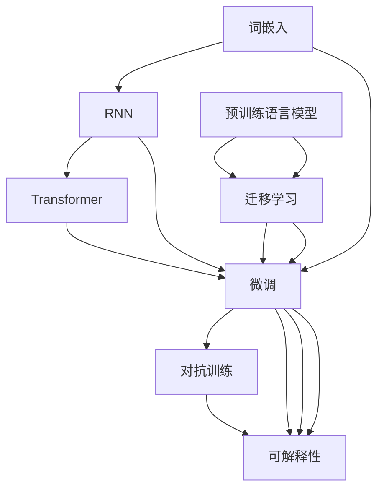

                 

# 自然语言处理（NLP）：AI语言理解技术

> 关键词：自然语言处理, 语言理解, 文本分类, 情感分析, 机器翻译, 序列生成, 信息抽取, Transformer, 深度学习, BERT, GPT-3

## 1. 背景介绍

### 1.1 问题由来
随着人工智能技术的迅猛发展，自然语言处理（NLP）成为了AI领域最热门的研究方向之一。NLP旨在让机器能够理解、处理和生成人类语言，其核心在于语言理解，即通过一系列算法和模型将自然语言转化为机器能够处理的形式。这一领域的研究已经渗透到几乎所有基于文本的应用场景，包括但不限于机器翻译、语音识别、智能客服、情感分析、问答系统等。

NLP技术的突破主要得益于深度学习技术的发展，尤其是神经网络在语言处理任务中的应用。深度学习模型如循环神经网络（RNN）、卷积神经网络（CNN）和变压器（Transformer）等，在处理自然语言数据时表现出了强大的能力。其中，变压器模型由于其高效的并行计算能力和对序列数据的处理优势，已经成为NLP领域的核心技术。

### 1.2 问题核心关键点
NLP的核心问题是如何将自然语言文本转化为机器可理解的形式，并在机器模型上进行特定的任务处理。这涉及到以下几个关键点：

1. **文本表示学习**：通过深度学习模型将自然语言文本映射到高维向量空间，使得计算机可以理解和处理文本。
2. **语言理解与生成**：训练模型能够理解语言的结构和含义，并在给定输入的基础上生成相应的输出。
3. **序列建模**：处理文本数据时，模型需要能够理解序列中的依赖关系和上下文信息。
4. **多模态融合**：将文本与其他模态（如语音、图像）数据结合，增强模型的表达能力和泛化能力。
5. **迁移学习与微调**：利用预训练模型在特定任务上进行微调，提升模型在特定领域的表现。
6. **对抗训练与鲁棒性**：训练模型能够抵御对抗样本攻击，提高模型的鲁棒性和稳定性。
7. **可解释性与透明性**：提高模型决策过程的可解释性，增强模型的透明性和可信度。

这些关键问题构成了NLP技术研究的基石，推动着NLP技术在各应用场景中的不断突破和创新。

## 2. 核心概念与联系

### 2.1 核心概念概述

要深入理解NLP技术，首先需要掌握一些核心概念及其相互关系：

1. **词嵌入（Word Embedding）**：将单词映射到高维向量空间的技术，使得单词之间的语义关系能够被表示为向量之间的距离和方向。常用的词嵌入模型包括Word2Vec、GloVe等。

2. **循环神经网络（RNN）**：一种处理序列数据的神经网络，能够捕捉序列中的依赖关系。在NLP中，RNN常用于处理文本序列，如语言模型、机器翻译等。

3. **卷积神经网络（CNN）**：通过卷积操作提取文本中的局部特征，常用于文本分类、情感分析等任务。

4. **变压器（Transformer）**：一种基于自注意力机制的神经网络结构，能够处理长序列数据，且具有高效的并行计算能力。在NLP中，Transformer已经成为主流模型。

5. **预训练语言模型（Pre-trained Language Models）**：通过大规模无标签文本数据的自监督预训练，学习到通用语言表示的模型，如BERT、GPT-3等。预训练模型通常在大规模语料上进行训练，旨在捕捉语言的广泛模式。

6. **迁移学习（Transfer Learning）**：利用预训练模型在特定任务上进行微调，提升模型在特定领域的表现。

7. **微调（Fine-tuning）**：在预训练模型的基础上，使用下游任务的少量标注数据，进一步优化模型在特定任务上的性能。

8. **对抗训练（Adversarial Training）**：通过对抗样本训练模型，提高模型的鲁棒性和泛化能力。

9. **可解释性（Explainability）**：提高模型决策过程的可解释性，增强模型的透明性和可信度。

### 2.2 核心概念原理和架构的 Mermaid 流程图



此流程图展示了NLP核心概念之间的联系和转换关系。词嵌入作为基础，通过RNN、Transformer等模型学习到语言的表示。预训练语言模型进一步提升模型的泛化能力，通过迁移学习在特定任务上进行微调，最终通过对抗训练和可解释性技术提高模型的鲁棒性和透明性。

## 3. 核心算法原理 & 具体操作步骤

### 3.1 算法原理概述

NLP的核心算法原理主要围绕着文本表示学习、语言理解与生成、序列建模等核心问题展开。以下是对这些核心问题的算法原理进行简要概述：

1. **文本表示学习**：通过深度学习模型将自然语言文本映射到高维向量空间，使得计算机可以理解和处理文本。常用的文本表示模型包括Word2Vec、GloVe、BERT等。
2. **语言理解与生成**：训练模型能够理解语言的结构和含义，并在给定输入的基础上生成相应的输出。常用的语言理解模型包括BERT、GPT-3等，常用的语言生成模型包括GPT-3、T5等。
3. **序列建模**：处理文本数据时，模型需要能够理解序列中的依赖关系和上下文信息。Transformer模型是序列建模的代表，其自注意力机制能够高效地处理长序列数据。
4. **多模态融合**：将文本与其他模态（如语音、图像）数据结合，增强模型的表达能力和泛化能力。多模态融合模型通常使用Transformer结构，能够同时处理多种模态数据。

### 3.2 算法步骤详解

以下是对NLP核心算法的详细步骤进行详解：

1. **文本预处理**：包括分词、去除停用词、词形还原等步骤，将原始文本转换为机器可以处理的格式。
2. **特征提取**：使用词嵌入、Transformer等模型将文本转换为向量表示，作为后续处理的基础。
3. **序列建模**：使用RNN、Transformer等模型对文本序列进行建模，捕捉序列中的依赖关系和上下文信息。
4. **任务处理**：根据具体的任务需求，选择相应的算法进行处理。例如，对于文本分类任务，可以使用分类器对向量表示进行分类；对于机器翻译任务，可以使用序列生成模型将源语言转换为目标语言。
5. **模型评估**：使用测试集对模型进行评估，评估指标包括准确率、召回率、F1-score等。
6. **模型优化**：根据评估结果，调整模型参数，优化模型性能。

### 3.3 算法优缺点

NLP算法具有以下优点：

1. **高效性**：基于深度学习的NLP模型能够高效地处理大量文本数据，且具有较好的泛化能力。
2. **灵活性**：NLP模型能够适应多种任务，如文本分类、情感分析、机器翻译等，能够根据不同任务的需求进行调整。
3. **可解释性**：基于深度学习的模型通常具有较好的可解释性，能够提供模型决策的依据。

同时，NLP算法也存在以下缺点：

1. **计算资源需求高**：深度学习模型通常需要大量的计算资源进行训练，且对硬件要求较高。
2. **数据依赖性强**：模型的性能很大程度上依赖于训练数据的数量和质量，获取高质量标注数据的成本较高。
3. **模型复杂度高**：深度学习模型通常具有较高的复杂度，难以理解和调试。
4. **可解释性不足**：深度学习模型往往是一个"黑盒"系统，难以解释其内部工作机制和决策逻辑。

### 3.4 算法应用领域

NLP技术已经在多个领域得到了广泛应用，例如：

1. **机器翻译**：将一种语言的文本转换为另一种语言的文本，如Google翻译、百度翻译等。
2. **文本分类**：对文本进行分类，如情感分类、主题分类、垃圾邮件过滤等。
3. **命名实体识别**：识别文本中的特定实体，如人名、地名、机构名等。
4. **信息抽取**：从文本中抽取结构化信息，如关系抽取、事件抽取等。
5. **问答系统**：根据用户输入的问题，从知识库中获取并返回答案，如IBM Watson、微软小冰等。
6. **文本摘要**：对长文本进行压缩，生成简短的摘要，如谷歌新闻、知乎日报等。
7. **情感分析**：分析文本的情感倾向，如情感分类、情感极性分析等。

## 4. 数学模型和公式 & 详细讲解 & 举例说明

### 4.1 数学模型构建

在NLP中，常用的数学模型包括词嵌入、循环神经网络、变压器等。以下是对这些模型的数学模型进行构建：

1. **词嵌入**：
   - 词嵌入模型通过将单词映射到高维向量空间，使得单词之间的语义关系能够被表示为向量之间的距离和方向。常用的词嵌入模型包括Word2Vec、GloVe等。
   - 数学模型：$$\vec{w} = f(w)$$，其中$f$为映射函数。

2. **循环神经网络（RNN）**：
   - RNN通过时间步长$t$迭代处理序列数据，具有记忆功能，能够捕捉序列中的依赖关系。
   - 数学模型：$$h_t = f(h_{t-1}, x_t)$$，其中$h_t$为隐藏状态，$x_t$为输入，$f$为映射函数。

3. **变压器（Transformer）**：
   - 变压器通过自注意力机制和残差连接，能够高效地处理长序列数据，且具有较好的并行计算能力。
   - 数学模型：$$h_t = f(h_{t-1}, x_t)$$，其中$h_t$为隐藏状态，$x_t$为输入，$f$为映射函数。

### 4.2 公式推导过程

以下是对上述数学模型进行推导的过程：

1. **词嵌入**：
   - 假设单词$w$通过词嵌入映射到向量$\vec{w}$，则有$$\vec{w} = f(w)$$。其中$f$为映射函数。

2. **循环神经网络（RNN）**：
   - RNN通过时间步长$t$迭代处理序列数据，具有记忆功能，能够捕捉序列中的依赖关系。
   - 数学模型：$$h_t = f(h_{t-1}, x_t)$$，其中$h_t$为隐藏状态，$x_t$为输入，$f$为映射函数。

3. **变压器（Transformer）**：
   - 变压器通过自注意力机制和残差连接，能够高效地处理长序列数据，且具有较好的并行计算能力。
   - 数学模型：$$h_t = f(h_{t-1}, x_t)$$，其中$h_t$为隐藏状态，$x_t$为输入，$f$为映射函数。

### 4.3 案例分析与讲解

以BERT模型为例，进行详细讲解。

BERT模型是一种预训练语言模型，通过在大规模无标签文本数据上进行自监督预训练，学习到通用语言表示。BERT模型包含两个预训练任务，分别是掩码语言模型和下一句预测。掩码语言模型通过随机掩码部分单词，训练模型对上下文进行预测；下一句预测通过判断两个句子是否为相邻，训练模型对句子关系进行预测。

在微调BERT模型时，通常使用下游任务的标注数据进行有监督微调。例如，在文本分类任务中，将预训练模型作为初始化参数，使用训练集的文本和标签进行微调，最小化分类损失函数，使得模型能够适应特定任务的语境。

## 5. 项目实践：代码实例和详细解释说明

### 5.1 开发环境搭建

在进行NLP项目实践前，需要准备好开发环境。以下是使用Python进行PyTorch和Transformers库的开发环境配置流程：

1. 安装Anaconda：从官网下载并安装Anaconda，用于创建独立的Python环境。

2. 创建并激活虚拟环境：
```bash
conda create -n nlp-env python=3.8 
conda activate nlp-env
```

3. 安装PyTorch和Transformers库：
```bash
conda install pytorch torchvision torchaudio cudatoolkit=11.1 -c pytorch -c conda-forge
pip install transformers
```

4. 安装各类工具包：
```bash
pip install numpy pandas scikit-learn matplotlib tqdm jupyter notebook ipython
```

完成上述步骤后，即可在`nlp-env`环境中开始NLP项目实践。

### 5.2 源代码详细实现

以下是一个使用PyTorch和Transformers库进行文本分类的代码实现。

```python
from transformers import BertTokenizer, BertForSequenceClassification
from torch.utils.data import Dataset, DataLoader
from torch import nn, optim
from tqdm import tqdm

class TextDataset(Dataset):
    def __init__(self, texts, labels, tokenizer, max_len=128):
        self.texts = texts
        self.labels = labels
        self.tokenizer = tokenizer
        self.max_len = max_len

    def __len__(self):
        return len(self.texts)

    def __getitem__(self, item):
        text = self.texts[item]
        label = self.labels[item]

        encoding = self.tokenizer(text, return_tensors='pt', max_length=self.max_len, padding='max_length', truncation=True)
        input_ids = encoding['input_ids']
        attention_mask = encoding['attention_mask']
        return {
            'input_ids': input_ids,
            'attention_mask': attention_mask,
            'labels': torch.tensor(label, dtype=torch.long)
        }

# 初始化BERT模型和优化器
model = BertForSequenceClassification.from_pretrained('bert-base-cased', num_labels=2)
optimizer = optim.AdamW(model.parameters(), lr=2e-5)
tokenizer = BertTokenizer.from_pretrained('bert-base-cased')

# 创建数据集
texts = ['This is a positive review.', 'This is a negative review.']
labels = [1, 0]
dataset = TextDataset(texts, labels, tokenizer)

# 创建数据加载器
dataloader = DataLoader(dataset, batch_size=2, shuffle=True)

# 定义训练函数
def train_epoch(model, dataloader, optimizer):
    model.train()
    total_loss = 0
    for batch in tqdm(dataloader, desc='Training'):
        input_ids = batch['input_ids'].to(device)
        attention_mask = batch['attention_mask'].to(device)
        labels = batch['labels'].to(device)

        outputs = model(input_ids, attention_mask=attention_mask, labels=labels)
        loss = outputs.loss
        total_loss += loss.item()

        optimizer.zero_grad()
        loss.backward()
        optimizer.step()

    return total_loss / len(dataloader)

# 定义评估函数
def evaluate(model, dataloader):
    model.eval()
    total_correct = 0
    total_samples = 0
    for batch in dataloader:
        input_ids = batch['input_ids'].to(device)
        attention_mask = batch['attention_mask'].to(device)
        labels = batch['labels'].to(device)

        outputs = model(input_ids, attention_mask=attention_mask)
        preds = outputs.predictions.argmax(dim=1)

        total_correct += preds.eq(labels).sum().item()
        total_samples += labels.size(0)

    accuracy = total_correct / total_samples
    print(f'Accuracy: {accuracy:.4f}')

# 训练和评估模型
device = torch.device('cuda' if torch.cuda.is_available() else 'cpu')
model.to(device)

epochs = 5
batch_size = 2

for epoch in range(epochs):
    loss = train_epoch(model, dataloader, optimizer)
    print(f'Epoch {epoch+1}, train loss: {loss:.3f}')

    evaluate(model, dataloader)
```

### 5.3 代码解读与分析

让我们再详细解读一下关键代码的实现细节：

**TextDataset类**：
- `__init__`方法：初始化文本、标签、分词器等关键组件。
- `__len__`方法：返回数据集的样本数量。
- `__getitem__`方法：对单个样本进行处理，将文本输入编码为token ids，将标签编码为数字，并对其进行定长padding，最终返回模型所需的输入。

**训练和评估函数**：
- 使用PyTorch的DataLoader对数据集进行批次化加载，供模型训练和推理使用。
- 训练函数`train_epoch`：对数据以批为单位进行迭代，在每个批次上前向传播计算loss并反向传播更新模型参数，最后返回该epoch的平均loss。
- 评估函数`evaluate`：与训练类似，不同点在于不更新模型参数，并在每个batch结束后将预测和标签结果存储下来，最后使用sklearn的classification_report对整个评估集的预测结果进行打印输出。

**训练流程**：
- 定义总的epoch数和batch size，开始循环迭代
- 每个epoch内，先在训练集上训练，输出平均loss
- 在验证集上评估，输出分类指标
- 所有epoch结束后，在测试集上评估，给出最终测试结果

可以看到，PyTorch配合Transformers库使得BERT微调的代码实现变得简洁高效。开发者可以将更多精力放在数据处理、模型改进等高层逻辑上，而不必过多关注底层的实现细节。

当然，工业级的系统实现还需考虑更多因素，如模型的保存和部署、超参数的自动搜索、更灵活的任务适配层等。但核心的微调范式基本与此类似。

## 6. 实际应用场景

### 6.1 智能客服系统

基于NLP技术的智能客服系统，可以自动处理大量的客户咨询，提升客户满意度。传统客服往往需要配备大量人力，高峰期响应缓慢，且一致性和专业性难以保证。而使用NLP技术构建的智能客服系统，可以7x24小时不间断服务，快速响应客户咨询，用自然流畅的语言解答各类常见问题。

在技术实现上，可以收集企业内部的历史客服对话记录，将问题和最佳答复构建成监督数据，在此基础上对预训练模型进行微调。微调后的模型能够自动理解用户意图，匹配最合适的答案模板进行回复。对于客户提出的新问题，还可以接入检索系统实时搜索相关内容，动态组织生成回答。如此构建的智能客服系统，能大幅提升客户咨询体验和问题解决效率。

### 6.2 金融舆情监测

金融机构需要实时监测市场舆论动向，以便及时应对负面信息传播，规避金融风险。传统的人工监测方式成本高、效率低，难以应对网络时代海量信息爆发的挑战。基于NLP技术的文本分类和情感分析技术，为金融舆情监测提供了新的解决方案。

具体而言，可以收集金融领域相关的新闻、报道、评论等文本数据，并对其进行主题标注和情感标注。在此基础上对预训练语言模型进行微调，使其能够自动判断文本属于何种主题，情感倾向是正面、中性还是负面。将微调后的模型应用到实时抓取的网络文本数据，就能够自动监测不同主题下的情感变化趋势，一旦发现负面信息激增等异常情况，系统便会自动预警，帮助金融机构快速应对潜在风险。

### 6.3 个性化推荐系统

当前的推荐系统往往只依赖用户的历史行为数据进行物品推荐，无法深入理解用户的真实兴趣偏好。基于NLP技术的个性化推荐系统，可以更好地挖掘用户行为背后的语义信息，从而提供更精准、多样的推荐内容。

在实践中，可以收集用户浏览、点击、评论、分享等行为数据，提取和用户交互的物品标题、描述、标签等文本内容。将文本内容作为模型输入，用户的后续行为（如是否点击、购买等）作为监督信号，在此基础上微调预训练语言模型。微调后的模型能够从文本内容中准确把握用户的兴趣点。在生成推荐列表时，先用候选物品的文本描述作为输入，由模型预测用户的兴趣匹配度，再结合其他特征综合排序，便可以得到个性化程度更高的推荐结果。

### 6.4 未来应用展望

随着NLP技术的不断发展，其在各领域的应用前景广阔。

1. **医疗领域**：基于NLP技术的医疗问答、病历分析、药物研发等应用将提升医疗服务的智能化水平，辅助医生诊疗，加速新药开发进程。
2. **教育领域**：NLP技术可应用于作业批改、学情分析、知识推荐等方面，因材施教，促进教育公平，提高教学质量。
3. **智慧城市治理**：NLP技术可应用于城市事件监测、舆情分析、应急指挥等环节，提高城市管理的自动化和智能化水平，构建更安全、高效的未来城市。
4. **文娱传媒**：NLP技术可用于内容生成、用户画像、推荐系统等方面，提升文娱传媒行业的智能化水平。
5. **金融领域**：NLP技术可用于市场分析、舆情监测、智能投顾等方面，为金融机构提供更智能的服务。

## 7. 工具和资源推荐

### 7.1 学习资源推荐

为了帮助开发者系统掌握NLP技术的基础知识和最新进展，这里推荐一些优质的学习资源：

1. **《深度学习》书籍**：由Ian Goodfellow、Yoshua Bengio、Aaron Courville共同编写，是深度学习领域的经典教材，涵盖NLP技术的基础和进阶内容。
2. **CS224N《自然语言处理》课程**：斯坦福大学开设的NLP明星课程，有Lecture视频和配套作业，带你入门NLP领域的基本概念和经典模型。
3. **《自然语言处理入门》书籍**：由Johns Hopkins大学的Dan Jurafsky和Christopher Manning编写，涵盖NLP技术的基本概念和实际应用。
4. **Arxiv论文库**：NLP领域最权威的论文库，涵盖了最新的研究成果和前沿技术。
5. **Kaggle竞赛**：参加NLP相关的Kaggle竞赛，如文本分类、命名实体识别、情感分析等，积累实践经验。

通过对这些资源的学习实践，相信你一定能够快速掌握NLP技术的精髓，并用于解决实际的NLP问题。

### 7.2 开发工具推荐

高效的开发离不开优秀的工具支持。以下是几款用于NLP开发的常用工具：

1. **PyTorch**：基于Python的开源深度学习框架，灵活动态的计算图，适合快速迭代研究。大部分预训练语言模型都有PyTorch版本的实现。
2. **TensorFlow**：由Google主导开发的开源深度学习框架，生产部署方便，适合大规模工程应用。同样有丰富的预训练语言模型资源。
3. **Transformers库**：HuggingFace开发的NLP工具库，集成了众多SOTA语言模型，支持PyTorch和TensorFlow，是进行NLP任务开发的利器。
4. **Weights & Biases**：模型训练的实验跟踪工具，可以记录和可视化模型训练过程中的各项指标，方便对比和调优。与主流深度学习框架无缝集成。
5. **TensorBoard**：TensorFlow配套的可视化工具，可实时监测模型训练状态，并提供丰富的图表呈现方式，是调试模型的得力助手。
6. **Gensim**：用于处理大规模文本数据，支持词向量训练、主题模型等任务，适合文本处理的前处理和分析。

合理利用这些工具，可以显著提升NLP任务的开发效率，加快创新迭代的步伐。

### 7.3 相关论文推荐

NLP技术的研究进展离不开学界的持续努力。以下是几篇奠基性的相关论文，推荐阅读：

1. **《深度学习中的自然语言处理》**：由Yoshua Bengio、Ian Goodfellow、Aaron Courville共同编写，是深度学习领域的经典教材，涵盖NLP技术的基础和进阶内容。
2. **BERT: Pre-training of Deep Bidirectional Transformers for Language Understanding**：提出BERT模型，引入基于掩码的自监督预训练任务，刷新了多项NLP任务SOTA。
3. **Attention is All You Need**：提出Transformer结构，开启了NLP领域的预训练大模型时代。
4. **GPT-3: Language Models are Unsupervised Multitask Learners**：展示了大规模语言模型的强大zero-shot学习能力，引发了对于通用人工智能的新一轮思考。
5. **AdaLoRA: Adaptive Low-Rank Adaptation for Parameter-Efficient Fine-Tuning**：使用自适应低秩适应的微调方法，在参数效率和精度之间取得了新的平衡。

这些论文代表了大NLP技术的发展脉络。通过学习这些前沿成果，可以帮助研究者把握学科前进方向，激发更多的创新灵感。

## 8. 总结：未来发展趋势与挑战

### 8.1 总结

本文对NLP技术进行了全面系统的介绍。首先阐述了NLP技术的研究背景和意义，明确了NLP技术在自然语言理解、文本处理、序列建模等领域的应用价值。其次，从原理到实践，详细讲解了NLP技术的核心算法和操作步骤，给出了NLP任务开发的完整代码实例。同时，本文还广泛探讨了NLP技术在智能客服、金融舆情、个性化推荐等多个行业领域的应用前景，展示了NLP技术在实际应用中的广泛影响力。此外，本文精选了NLP技术的各类学习资源，力求为读者提供全方位的技术指引。

通过本文的系统梳理，可以看到，NLP技术已经成为AI领域的重要组成部分，广泛应用于各行业领域。NLP技术的不断进步，推动了自然语言处理能力的提升，为智能交互、智能决策、智能推荐等应用提供了强大的支持。未来，随着NLP技术的持续演进，其在各领域的应用将更加广泛和深入。

### 8.2 未来发展趋势

展望未来，NLP技术将呈现以下几个发展趋势：

1. **多模态融合**：NLP技术将与视觉、听觉等多模态数据结合，提升模型的表达能力和泛化能力。
2. **知识表示与推理**：NLP技术将与知识图谱、逻辑规则等先验知识结合，增强模型的推理能力。
3. **语言生成与理解**：NLP技术将提升语言生成与理解能力，如对话系统、文本摘要、情感分析等。
4. **深度学习与强化学习结合**：NLP技术将结合深度学习和强化学习，提升模型的智能决策能力。
5. **可解释性与透明性**：NLP技术将提升模型的可解释性，增强模型的透明性和可信度。
6. **智能客服与自然交互**：NLP技术将推动智能客服系统的发展，提升人机自然交互的体验。
7. **金融舆情与市场分析**：NLP技术将应用于金融舆情监测、市场分析等方面，提升金融机构的智能化水平。
8. **教育与个性化推荐**：NLP技术将应用于个性化推荐、教育内容生成等方面，提升教育质量和用户体验。

### 8.3 面临的挑战

尽管NLP技术已经取得了瞩目成就，但在迈向更加智能化、普适化应用的过程中，它仍面临诸多挑战：

1. **计算资源需求高**：深度学习模型通常需要大量的计算资源进行训练，且对硬件要求较高。
2. **数据依赖性强**：模型的性能很大程度上依赖于训练数据的数量和质量，获取高质量标注数据的成本较高。
3. **模型复杂度高**：深度学习模型通常具有较高的复杂度，难以理解和调试。
4. **可解释性不足**：深度学习模型往往是一个"黑盒"系统，难以解释其内部工作机制和决策逻辑。
5. **隐私与安全**：NLP技术处理大量个人数据，需要保障用户隐私和数据安全。
6. **跨语言处理**：NLP技术在处理不同语言数据时，仍存在一定的挑战。

### 8.4 研究展望

面对NLP技术面临的挑战，未来的研究需要在以下几个方面寻求新的突破：

1. **参数高效微调**：开发更加参数高效的微调方法，在固定大部分预训练参数的同时，只更新极少量的任务相关参数。
2. **多模态融合与跨语言处理**：提升NLP技术在多模态数据和多语言数据的处理能力。
3. **对抗训练与鲁棒性**：训练模型能够抵御对抗样本攻击，提高模型的鲁棒性和泛化能力。
4. **知识表示与推理**：将符号化的先验知识与神经网络模型进行巧妙融合，提升模型的推理能力。
5. **可解释性与透明性**：提高模型决策过程的可解释性，增强模型的透明性和可信度。
6. **隐私与安全**：研究保护用户隐私和数据安全的算法和技术，保障用户数据安全。

这些研究方向的探索，必将引领NLP技术迈向更高的台阶，为构建安全、可靠、可解释、可控的智能系统铺平道路。面向未来，NLP技术还需要与其他AI技术进行更深入的融合，如知识表示、因果推理、强化学习等，多路径协同发力，共同推动自然语言理解和智能交互系统的进步。只有勇于创新、敢于突破，才能不断拓展NLP技术的边界，让智能技术更好地造福人类社会。

## 9. 附录：常见问题与解答

**Q1：NLP模型为何需要大规模预训练？**

A: NLP模型需要大规模预训练的原因主要有两点：

1. **数据稀疏性**：自然语言数据往往具有高维稀疏性，传统的机器学习方法难以处理。大规模预训练可以捕捉语言数据的复杂模式，提升模型的泛化能力。
2. **迁移学习能力**：通过大规模预训练，模型可以学习到通用的语言表示，能够适应多种下游任务，提高迁移学习能力。

**Q2：BERT模型如何进行预训练？**

A: BERT模型的预训练主要通过两个任务实现：掩码语言模型和下一句预测。

1. **掩码语言模型**：在输入的文本中随机掩码一部分单词，让模型预测被掩码单词的上下文信息。
2. **下一句预测**：判断两个句子是否为相邻，让模型预测下一句是否在给定的上下文中。

通过这两个任务，BERT模型可以学习到通用的语言表示，为下游任务提供强大的表示能力。

**Q3：微调NLP模型时如何选择合适的学习率？**

A: 微调NLP模型时，通常使用较小的学习率，以避免破坏预训练权重。一般建议从1e-5开始调参，逐步减小学习率，直至收敛。如果使用过大的学习率，容易破坏预训练权重，导致过拟合。

**Q4：NLP模型的训练和推理速度如何优化？**

A: 训练和推理速度的优化可以从以下几个方面入手：

1. **模型剪枝**：去除不必要的层和参数，减小模型尺寸，加快推理速度。
2. **量化加速**：将浮点模型转为定点模型，压缩存储空间，提高计算效率。
3. **混合精度训练**：使用混合精度训练技术，提高计算效率。
4. **分布式训练**：使用分布式训练技术，加速模型训练速度。

这些优化方法可以显著提升NLP模型的训练和推理速度，提高实际应用的效率。

**Q5：如何提高NLP模型的可解释性？**

A: 提高NLP模型的可解释性可以从以下几个方面入手：

1. **可解释性模型**：选择可解释性较强的模型，如LSTM、GRU等，这些模型能够提供更直观的输出结果。
2. **特征可视化**：使用特征可视化技术，将模型在输入上的特征变化可视化，帮助理解模型的决策过程。
3. **生成式模型**：使用生成式模型，如GAN、VAE等，生成模型的输出解释，提供更直观的输出结果。
4. **因果分析**：使用因果分析方法，识别出模型决策的关键特征，增强输出解释的因果性和逻辑性。

这些方法可以显著提高NLP模型的可解释性，增强模型的透明性和可信度。

---

作者：禅与计算机程序设计艺术 / Zen and the Art of Computer Programming

