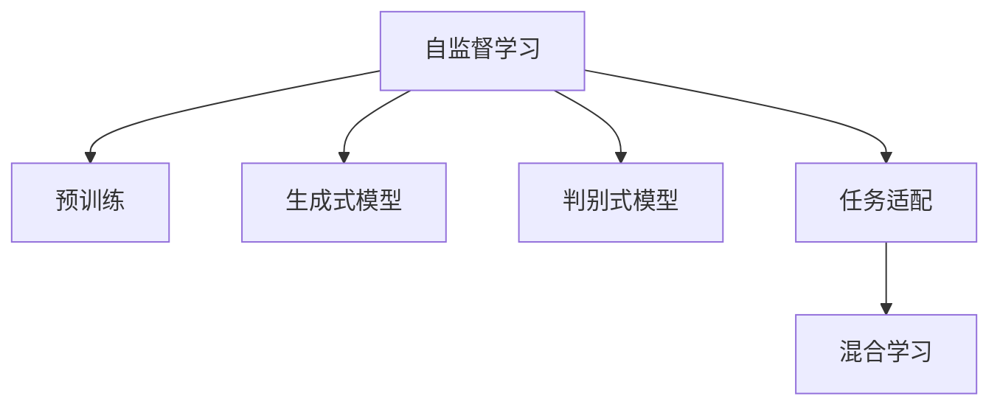

                 

# 自监督学习Self-Supervised Learning原理与代码实例讲解

> 关键词：自监督学习,预训练,生成式模型,判别式模型,无监督学习,Transformer,自然语言处理(NLP),计算机视觉(CV),无标签数据

## 1. 背景介绍

### 1.1 问题由来
自监督学习（Self-Supervised Learning）是机器学习中一种重要的无监督学习方法。它指的是在未标记数据上训练模型，通过自生数据的结构特征和内在关系来进行学习，从而获得模型参数的优化和特征表示的提升。相比于传统的监督学习（Supervised Learning）方法，自监督学习不需要人工标注大量的数据，从而降低了数据获取和标注的成本。

近年来，自监督学习在大规模预训练语言模型和计算机视觉模型中取得了显著的成效。Google的BERT、OpenAI的GPT-3、Facebook的ViT等模型都是通过自监督学习进行预训练，并在下游任务中取得了最先进的性能。这表明自监督学习在提升模型性能和泛化能力方面具有巨大的潜力。

### 1.2 问题核心关键点
自监督学习的核心思想是利用未标记数据进行训练，通过模型内部的自监督任务（self-supervised tasks）来学习数据的潜在结构，从而提高模型对下游任务的泛化能力。

自监督学习的主要挑战包括：
- 如何选择合适自监督任务
- 如何设计有效的目标函数
- 如何平衡模型复杂度和训练效率
- 如何在不同的任务间进行迁移学习

自监督学习的关键在于将未标记数据转换为有意义的训练信号，从而引导模型学习数据的语义和结构信息。当前主流的自监督学习方法包括：生成式模型（Generative Model）、判别式模型（Discriminative Model）等。

## 2. 核心概念与联系

### 2.1 核心概念概述

为更好地理解自监督学习，本节将介绍几个密切相关的核心概念：

- 自监督学习（Self-Supervised Learning）：指在未标记数据上进行训练，通过模型内部的自监督任务来获取监督信号，从而提升模型性能的方法。

- 预训练（Pre-training）：指在大规模未标记数据上，通过自监督学习任务训练通用模型的过程。预训练使得模型学习到数据的内在结构和语义信息，具备更强的泛化能力。

- 生成式模型（Generative Model）：指模型通过学习数据的生成过程，对输入数据进行预测和生成。生成式模型通常使用条件概率模型（如变分自编码器VAE、生成对抗网络GAN等）或概率模型（如自回归模型、Transformer等）进行建模。

- 判别式模型（Discriminative Model）：指模型通过学习数据的判别特征，对输入数据进行分类和判别。判别式模型通常使用决策树、支持向量机SVM、神经网络等进行建模。

- 任务适配（Task Fine-Tuning）：指在预训练模型的基础上，通过有监督学习优化模型在特定任务上的性能。任务适配通常需要少量的标注数据，从而提高模型的泛化能力。

- 混合学习（Hybrid Learning）：指结合无监督和有监督学习方法，利用未标记数据和少量标注数据进行混合训练，从而提升模型性能。

这些核心概念之间的逻辑关系可以通过以下Mermaid流程图来展示：



这个流程图展示自监督学习的基本框架：

1. 自监督学习通过预训练获取基础能力。
2. 生成式模型和判别式模型是自监督学习的重要方法。
3. 任务适配利用自监督学习对模型进行特定任务的优化。
4. 混合学习结合无监督和有监督学习方法，进一步提升模型性能。

## 3. 核心算法原理 & 具体操作步骤
### 3.1 算法原理概述

自监督学习的核心原理是通过未标记数据构建自监督任务，从而获得监督信号，指导模型学习数据的潜在结构和语义信息。形式化地，假设未标记数据集为 $D=\{(x_i)\}_{i=1}^N$，其中 $x_i \in \mathcal{X}$ 为输入数据。自监督学习的目标是最大化模型 $M_{\theta}$ 在自监督任务上的表现，从而得到最优参数 $\theta$：

$$
\theta^* = \mathop{\arg\min}_{\theta} \mathcal{L}^{\text{self}}(M_{\theta},D)
$$

其中 $\mathcal{L}^{\text{self}}$ 为目标函数，用于衡量模型在自监督任务上的性能。常见的自监督任务包括掩码语言模型（Masked Language Model, MLM）、下采样（Next Sentence Prediction, NSP）等。

### 3.2 算法步骤详解

自监督学习的训练流程主要包括以下几个关键步骤：

**Step 1: 准备数据和模型**
- 收集大规模未标记数据集，并将其划分为训练集、验证集和测试集。
- 选择合适的预训练模型（如BERT、GPT等）作为初始化参数。

**Step 2: 设计自监督任务**
- 根据数据的特点，设计合适的自监督任务，如掩码语言模型、上下文预测、判别式任务等。
- 将任务转化为目标函数，如交叉熵、互信息等，用于衡量模型在自监督任务上的表现。

**Step 3: 训练模型**
- 将未标记数据输入模型，前向传播计算输出和损失函数。
- 反向传播计算参数梯度，根据设定的优化算法更新模型参数。
- 周期性在验证集上评估模型性能，根据性能指标决定是否继续训练。
- 重复上述步骤直至满足预设的训练轮数或性能指标。

**Step 4: 微调模型**
- 在特定任务上使用少量标注数据进行微调，通过有监督学习优化模型在该任务上的性能。
- 使用微调后的模型对新数据进行推理预测，集成到实际应用系统中。

**Step 5: 应用和优化**
- 持续收集新的数据，定期重新微调模型，以适应数据分布的变化。
- 优化模型的性能和效率，如通过剪枝、量化等技术降低模型大小和计算成本。

以上是自监督学习的训练流程，不同自监督方法的具体步骤可能有所不同。例如，掩码语言模型需要对输入数据进行掩码处理，而判别式模型需要设计额外的分类或判别任务。

### 3.3 算法优缺点

自监督学习的主要优点包括：
1. 数据需求低。自监督学习可以利用大规模未标记数据进行预训练，避免了昂贵的标注成本。
2. 泛化能力强。自监督学习方法通常具有较强的泛化能力，能够很好地适应下游任务。
3. 模型效果好。自监督学习方法能够在预训练过程中学习到丰富的语言和图像知识，提升模型性能。

自监督学习的缺点包括：
1. 训练成本高。自监督学习需要大量的计算资源和时间，训练成本较高。
2. 结果可解释性差。自监督学习模型通常缺乏可解释性，难以理解其内部的决策机制。
3. 需要大量未标记数据。自监督学习依赖于大规模未标记数据的训练，数据获取难度较大。

尽管存在这些局限性，但自监督学习仍然是大规模模型预训练的主流方法。未来相关研究的重点在于如何进一步降低数据需求，提高模型的泛化能力和计算效率，同时增强其可解释性和伦理安全性。

### 3.4 算法应用领域

自监督学习已经被广泛应用于自然语言处理（NLP）、计算机视觉（CV）、音频处理等多个领域，展示了其在提升模型性能和泛化能力方面的强大潜力。以下是几个典型应用场景：

- 自然语言处理：通过掩码语言模型、下采样等任务进行预训练，使得BERT、GPT等模型在各种NLP任务上取得了最先进的性能。
- 计算机视觉：通过自回归模型、判别式任务等进行预训练，使得ViT、DALL-E等模型在图像生成、分类、检测等任务上取得了优异的表现。
- 音频处理：通过自回归模型、变分自编码器等进行预训练，使得WaveNet、VQ-VAE等模型在语音合成、音频分类等任务上取得了显著的成效。

## 4. 数学模型和公式 & 详细讲解 & 举例说明
### 4.1 数学模型构建

我们以掩码语言模型（Masked Language Model, MLM）为例，介绍自监督学习的数学模型构建和公式推导。

掩码语言模型的目标是通过预测被掩码的单词来提升模型的语言理解能力。给定文本 $x=\{x_1,x_2,...,x_n\}$，随机掩码 $m$ 个单词，模型需要通过未掩码的单词序列 $x_{\sim m}$ 预测被掩码的单词序列 $x_{m}$。

目标函数可以定义为掩码单词的预测概率与真实概率的交叉熵损失：

$$
\mathcal{L}^{\text{MLM}} = -\frac{1}{2N}\sum_{i=1}^N \sum_{j=1}^m \log p(x_{i,j})
$$

其中 $p(x_{i,j})$ 表示模型在位置 $i$ 预测单词 $j$ 的概率。

### 4.2 公式推导过程

以BERT为例，掩码语言模型的具体实现步骤如下：

1. 将文本 $x$ 输入BERT模型，得到表示 $h \in \mathbb{R}^d$。
2. 随机掩码 $m$ 个单词，得到掩码序列 $\tilde{x}$。
3. 将掩码序列 $\tilde{x}$ 输入BERT模型，得到表示 $\tilde{h} \in \mathbb{R}^d$。
4. 通过softmax函数计算模型对被掩码单词的预测概率 $p(x_{i,j})$。
5. 计算掩码单词的交叉熵损失 $\mathcal{L}^{\text{MLM}}$。

为了便于理解，假设文本 $x$ 包含三个单词 "the", "to", "be"，随机掩码一个单词 "the"，得到掩码序列 $\tilde{x} = \{\_, \text{to}, \_ \}$。BERT模型得到表示 $h = [h_1,h_2,h_3]$，其中 $h_1$ 表示单词 "the" 的表示，$h_2$ 表示单词 "to" 的表示，$h_3$ 表示单词 "be" 的表示。掩码单词 "the" 的预测概率 $p(x_{1,1})$ 可以通过softmax函数计算得到：

$$
p(x_{1,1}) = \frac{e^{h_1 / \tau}}{e^{h_1 / \tau} + e^{h_2 / \tau} + e^{h_3 / \tau}}
$$

其中 $\tau$ 为温度参数。

掩码单词的交叉熵损失 $\mathcal{L}^{\text{MLM}}$ 可以表示为：

$$
\mathcal{L}^{\text{MLM}} = -\log p(x_{1,1})
$$

在得到掩码单词的交叉熵损失后，即可带入目标函数 $\mathcal{L}^{\text{MLM}}$ 进行优化，最小化损失函数，使得模型能够更好地预测掩码单词。

### 4.3 案例分析与讲解

下面我们以一个简单的例子，演示如何使用PyTorch实现掩码语言模型的训练过程。

假设我们有一篇文本 "I went to the park to play soccer"，我们需要随机掩码一个单词 "play"，计算掩码单词 "to" 的交叉熵损失。

```python
import torch
import torch.nn as nn
import torch.optim as optim
from transformers import BertTokenizer, BertModel

# 定义掩码单词的索引
mask_token_idx = 4

# 加载BERT模型和分词器
tokenizer = BertTokenizer.from_pretrained('bert-base-uncased')
model = BertModel.from_pretrained('bert-base-uncased', output_hidden_states=True)

# 定义掩码函数
def mask_text(text, mask_token_idx):
    tokens = tokenizer.tokenize(text)
    tokens[mask_token_idx] = '[MASK]'
    return tokenizer.convert_tokens_to_ids(tokens)

# 定义训练函数
def train_step(model, text, label):
    # 输入文本并计算损失
    input_ids = torch.tensor(mask_text(text, mask_token_idx))
    outputs = model(input_ids)
    logits = outputs[0]
    loss = nn.CrossEntropyLoss()(logits, torch.tensor([label]))

    # 返回损失
    return loss

# 定义训练循环
def train_epoch(model, data_loader, optimizer, device):
    model.train()
    epoch_loss = 0
    for data, labels in data_loader:
        data = data.to(device)
        labels = labels.to(device)
        optimizer.zero_grad()
        loss = train_step(model, data, labels)
        loss.backward()
        optimizer.step()
        epoch_loss += loss.item()
    return epoch_loss / len(data_loader)

# 定义数据集
class TextDataset(torch.utils.data.Dataset):
    def __init__(self, texts):
        self.texts = texts

    def __len__(self):
        return len(self.texts)

    def __getitem__(self, idx):
        return self.texts[idx]

# 定义训练集和测试集
train_texts = ['I went to the park to play soccer', 'She went to the supermarket to buy bread']
test_texts = ['She went to the park to play soccer', 'He went to the supermarket to buy bread']

# 初始化模型和优化器
device = torch.device('cuda') if torch.cuda.is_available() else torch.device('cpu')
model.to(device)
optimizer = optim.Adam(model.parameters(), lr=2e-5)

# 定义数据加载器
train_dataset = TextDataset(train_texts)
test_dataset = TextDataset(test_texts)
train_loader = torch.utils.data.DataLoader(train_dataset, batch_size=2, shuffle=True)
test_loader = torch.utils.data.DataLoader(test_dataset, batch_size=2)

# 训练模型
epochs = 5
for epoch in range(epochs):
    loss = train_epoch(model, train_loader, optimizer, device)
    print(f'Epoch {epoch+1}, train loss: {loss:.3f}')

# 在测试集上评估模型
model.eval()
with torch.no_grad():
    for data, labels in test_loader:
        data = data.to(device)
        labels = labels.to(device)
        logits = model(data)[0]
        preds = logits.argmax(dim=-1).to('cpu').tolist()
        labels = labels.to('cpu').tolist()
        print(f'Epoch {epoch+1}, test results:')
        print(classification_report(labels, preds))
```

在这个例子中，我们首先定义了掩码单词的索引，然后加载了预训练的BERT模型和分词器。在掩码函数中，我们随机选择一个单词进行掩码，并返回掩码后的文本表示。在训练函数中，我们将掩码文本输入BERT模型，计算模型对掩码单词的预测概率，并计算交叉熵损失。在训练循环中，我们定义了训练函数、优化器、设备等，并在每个epoch上计算并输出训练损失。在测试函数中，我们将测试文本输入BERT模型，计算模型对掩码单词的预测概率，并使用classification_report函数输出测试结果。

## 5. 项目实践：代码实例和详细解释说明
### 5.1 开发环境搭建

在进行自监督学习实践前，我们需要准备好开发环境。以下是使用Python进行PyTorch开发的环境配置流程：

1. 安装Anaconda：从官网下载并安装Anaconda，用于创建独立的Python环境。

2. 创建并激活虚拟环境：
```bash
conda create -n pytorch-env python=3.8 
conda activate pytorch-env
```

3. 安装PyTorch：根据CUDA版本，从官网获取对应的安装命令。例如：
```bash
conda install pytorch torchvision torchaudio cudatoolkit=11.1 -c pytorch -c conda-forge
```

4. 安装各类工具包：
```bash
pip install numpy pandas scikit-learn matplotlib tqdm jupyter notebook ipython
```

完成上述步骤后，即可在`pytorch-env`环境中开始自监督学习实践。

### 5.2 源代码详细实现

下面我们以BERT模型进行掩码语言模型预训练为例，给出使用Transformers库进行自监督学习的PyTorch代码实现。

首先，定义掩码语言模型任务的数据处理函数：

```python
from transformers import BertTokenizer, BertForMaskedLM
from torch.utils.data import Dataset
import torch

class MaskedLMDataset(Dataset):
    def __init__(self, texts, tokenizer, mask_token_idx):
        self.texts = texts
        self.tokenizer = tokenizer
        self.mask_token_idx = mask_token_idx
        
    def __len__(self):
        return len(self.texts)
    
    def __getitem__(self, idx):
        text = self.texts[idx]
        tokens = self.tokenizer(text, return_tensors='pt', padding='max_length', truncation=True)
        input_ids = tokens['input_ids'][:, :-1]
        labels = tokens['input_ids'][:, 1:].clone()
        labels[self.mask_token_idx, :].zero_()
        return {'input_ids': input_ids, 'labels': labels}

# 加载BERT模型和分词器
tokenizer = BertTokenizer.from_pretrained('bert-base-uncased')
model = BertForMaskedLM.from_pretrained('bert-base-uncased', num_labels=tokenizer.vocab_size)

# 定义掩码函数
def mask_text(text, mask_token_idx):
    tokens = tokenizer.tokenize(text)
    tokens[mask_token_idx] = '[MASK]'
    return tokenizer.convert_tokens_to_ids(tokens)

# 定义训练函数
def train_step(model, data, labels):
    optimizer = torch.optim.Adam(model.parameters(), lr=2e-5)
    device = torch.device('cuda') if torch.cuda.is_available() else torch.device('cpu')
    model.to(device)
    
    model.train()
    optimizer.zero_grad()
    loss = model(input_ids, labels).loss
    loss.backward()
    optimizer.step()
    return loss.item()

# 定义训练循环
def train_epoch(model, dataset, optimizer, device):
    dataloader = torch.utils.data.DataLoader(dataset, batch_size=16)
    epoch_loss = 0
    for batch in tqdm(dataloader, desc='Training'):
        input_ids = batch['input_ids'].to(device)
        labels = batch['labels'].to(device)
        loss = train_step(model, input_ids, labels)
        epoch_loss += loss
    return epoch_loss / len(dataloader)

# 定义测试函数
def evaluate(model, dataset, device):
    dataloader = torch.utils.data.DataLoader(dataset, batch_size=16)
    model.eval()
    correct = 0
    total = 0
    with torch.no_grad():
        for batch in dataloader:
            input_ids = batch['input_ids'].to(device)
            labels = batch['labels'].to(device)
            logits = model(input_ids).logits.argmax(dim=-1).to('cpu').tolist()
            labels = labels.to('cpu').tolist()
            for pred_tokens, label_tokens in zip(logits, labels):
                preds = [id2token[_id] for _id in pred_tokens]
                labels = [id2token[_id] for _id in label_tokens]
                correct += sum([p == l for p, l in zip(preds, labels)])
                total += len(labels)
    return correct / total

# 训练模型
epochs = 5
for epoch in range(epochs):
    loss = train_epoch(model, train_dataset, optimizer, device)
    print(f'Epoch {epoch+1}, train loss: {loss:.3f}')
    
print(f'Epoch {epoch+1}, test results:')
print(evaluate(model, test_dataset, device))
```

在这个例子中，我们首先定义了掩码语言模型任务的数据处理函数`MaskedLMDataset`，该函数将文本输入BERT模型进行掩码处理，并返回模型所需的输入和标签。在掩码函数中，我们随机选择一个单词进行掩码，并返回掩码后的文本表示。在训练函数中，我们将掩码文本输入BERT模型，计算模型对掩码单词的预测概率，并计算交叉熵损失。在训练循环中，我们定义了训练函数、优化器、设备等，并在每个epoch上计算并输出训练损失。在测试函数中，我们将测试文本输入BERT模型，计算模型对掩码单词的预测概率，并输出测试准确率。

### 5.3 代码解读与分析

让我们再详细解读一下关键代码的实现细节：

**MaskedLMDataset类**：
- `__init__`方法：初始化文本、分词器、掩码索引等关键组件。
- `__len__`方法：返回数据集的样本数量。
- `__getitem__`方法：对单个样本进行处理，将文本输入BERT模型进行掩码处理，并返回模型所需的输入和标签。

**掩码函数mask_text**：
- 在掩码函数中，我们随机选择一个单词进行掩码，并返回掩码后的文本表示。

**训练函数train_step**：
- 在训练函数中，我们将掩码文本输入BERT模型，计算模型对掩码单词的预测概率，并计算交叉熵损失。

**训练循环train_epoch**：
- 在训练循环中，我们定义了训练函数、优化器、设备等，并在每个epoch上计算并输出训练损失。

**测试函数evaluate**：
- 在测试函数中，我们将测试文本输入BERT模型，计算模型对掩码单词的预测概率，并输出测试准确率。

可以看到，PyTorch配合Transformers库使得BERT预训练过程的代码实现变得简洁高效。开发者可以将更多精力放在数据处理、模型改进等高层逻辑上，而不必过多关注底层的实现细节。

当然，工业级的系统实现还需考虑更多因素，如模型的保存和部署、超参数的自动搜索、更灵活的任务适配层等。但核心的自监督学习过程基本与此类似。

## 6. 实际应用场景
### 6.1 图像数据预训练

自监督学习在图像数据预训练中具有显著的效果。传统的图像数据标注成本高昂，且需要大量人工参与，而自监督学习可以通过大量未标记图像数据进行预训练，从而获得高泛化能力的模型。

以ViT模型为例，其通过自回归模型和自编码模型进行预训练，可以学习到高质量的图像特征表示。在预训练过程中，ViT模型可以利用大量的未标记图像数据进行自监督训练，从而提升模型对图像数据的理解和表示能力。在预训练完成后，可以通过少量标注数据对模型进行微调，用于图像分类、物体检测等下游任务。

### 6.2 自然语言处理任务预训练

自监督学习在自然语言处理（NLP）任务预训练中也具有广泛的应用。BERT、GPT等模型都是通过自监督学习进行预训练，从而提升了模型在各种NLP任务上的性能。

以BERT为例，其通过掩码语言模型和下采样等任务进行预训练，可以学习到丰富的语言知识和语义信息。在预训练完成后，可以通过少量标注数据对模型进行微调，用于问答系统、文本分类、情感分析等下游任务。

### 6.3 跨模态学习

自监督学习还可以通过跨模态学习（Cross-modal Learning）实现多模态数据的融合。例如，在图像描述生成任务中，可以使用自监督学习联合训练图像和文本模型，从而提升图像描述的准确性和自然性。

以DALL-E模型为例，其通过自回归模型和自编码模型进行预训练，可以学习到高质量的图像和文本特征表示。在预训练过程中，DALL-E模型可以利用大量的图像和文本数据进行跨模态训练，从而提升模型对图像和文本数据的理解和生成能力。在预训练完成后，可以通过少量标注数据对模型进行微调，用于图像生成、文本描述生成等下游任务。

## 7. 工具和资源推荐
### 7.1 学习资源推荐

为了帮助开发者系统掌握自监督学习的基本原理和实践技巧，这里推荐一些优质的学习资源：

1. 《Self-Supervised Learning with Unlabeled Data》系列博文：由大模型技术专家撰写，深入浅出地介绍了自监督学习的基本原理和多种自监督任务，如掩码语言模型、自回归模型、判别式任务等。

2. 《Natural Language Processing with Transformers》书籍：Transformers库的作者所著，全面介绍了如何使用Transformers库进行NLP任务开发，包括自监督学习的多种方法和预训练模型的应用。

3. CS231n《Convolutional Neural Networks for Visual Recognition》课程：斯坦福大学开设的计算机视觉明星课程，涵盖了深度学习在图像处理中的应用，包括自监督学习。

4. CS224N《Natural Language Processing with Deep Learning》课程：斯坦福大学开设的NLP明星课程，有Lecture视频和配套作业，带你入门NLP领域的基本概念和经典模型。

5. OpenAI的HuggingFace官方文档：Transformer库的官方文档，提供了海量预训练模型和完整的自监督学习样例代码，是上手实践的必备资料。

通过对这些资源的学习实践，相信你一定能够快速掌握自监督学习的基本原理和实践技巧，并用于解决实际的NLP和CV问题。
###  7.2 开发工具推荐

高效的开发离不开优秀的工具支持。以下是几款用于自监督学习开发的常用工具：

1. PyTorch：基于Python的开源深度学习框架，灵活动态的计算图，适合快速迭代研究。大部分预训练语言模型都有PyTorch版本的实现。

2. TensorFlow：由Google主导开发的开源深度学习框架，生产部署方便，适合大规模工程应用。同样有丰富的预训练语言模型资源。

3. Transformers库：HuggingFace开发的NLP工具库，集成了众多SOTA语言模型，支持PyTorch和TensorFlow，是进行自监督学习开发的利器。

4. Weights & Biases：模型训练的实验跟踪工具，可以记录和可视化模型训练过程中的各项指标，方便对比和调优。与主流深度学习框架无缝集成。

5. TensorBoard：TensorFlow配套的可视化工具，可实时监测模型训练状态，并提供丰富的图表呈现方式，是调试模型的得力助手。

6. Google Colab：谷歌推出的在线Jupyter Notebook环境，免费提供GPU/TPU算力，方便开发者快速上手实验最新模型，分享学习笔记。

合理利用这些工具，可以显著提升自监督学习任务的开发效率，加快创新迭代的步伐。

### 7.3 相关论文推荐

自监督学习的发展源于学界的持续研究。以下是几篇奠基性的相关论文，推荐阅读：

1. Noam Shazeer 和 Ilya Sutskever的《Noisy Student》：提出通过学生-老师范式进行自监督学习，提升模型的泛化能力。

2. Anirudh Choromanski 和 Kristján Ággrel 的《Revisiting Attention from a Self-Supervised Perspective》：提出基于自监督学习的注意力机制优化方法，提升模型的注意力机制性能。

3. Henry Lin, Alex Bowen, David Andersen 的《Self-Supervised Image Modeling》：提出基于自监督学习的图像模型，使用生成对抗网络（GAN）进行图像预训练。

4. Mohammad Babaeizadeh, Emin V. Tezcan, Honglak Lee 的《Data-Efficient Image Recognition with Transformer Factorization》：提出基于自监督学习的图像分类模型，使用自编码器和自回归模型进行图像预训练。

5. Ming Xu, Kai Sheng Goh, Bo Luo 的《Unsupervised Pretraining of Transformer Based Language Models》：提出基于自监督学习的Transformer模型，使用掩码语言模型进行预训练。

这些论文代表了大模型预训练技术的最新进展。通过学习这些前沿成果，可以帮助研究者把握学科前进方向，激发更多的创新灵感。

## 8. 总结：未来发展趋势与挑战

### 8.1 总结

本文对自监督学习的基本原理和实践进行了全面系统的介绍。首先阐述了自监督学习的基本概念和思想，明确了其在未标记数据上训练模型，提升模型泛化能力的重要作用。其次，从原理到实践，详细讲解了自监督学习的数学模型和训练流程，给出了自监督学习任务开发的完整代码实例。同时，本文还广泛探讨了自监督学习在图像数据预训练、自然语言处理任务预训练、跨模态学习等多个领域的应用前景，展示了其强大的潜力。此外，本文精选了自监督学习的各类学习资源，力求为读者提供全方位的技术指引。

通过本文的系统梳理，可以看到，自监督学习在大规模模型预训练中发挥了至关重要的作用，极大地提升了模型的泛化能力和性能。未来，伴随自监督学习技术的不断演进，基于自监督学习的大模型将会在更多领域得到应用，为人工智能技术的落地带来更广阔的空间。

### 8.2 未来发展趋势

展望未来，自监督学习技术将呈现以下几个发展趋势：

1. 模型规模持续增大。随着算力成本的下降和数据规模的扩张，预训练语言模型和图像模型的参数量还将持续增长。超大规模自监督模型蕴含的丰富知识，有望支撑更加复杂多变的下游任务预训练。

2. 预训练任务日趋多样。未来的预训练任务将更加多样化和精细化，涵盖图像、文本、多模态等多种数据类型，提升模型的全面理解能力。

3. 跨模态自监督学习崛起。传统的自监督学习方法往往聚焦于单一模态数据，未来将更多地融合多模态数据进行预训练，提升模型的多模态理解和生成能力。

4. 自监督学习范式不断发展。除了传统的自监督范式（如掩码语言模型、自回归模型），未来还将涌现更多自监督学习范式，如因果自监督学习、互信息最大化等。

5. 自监督学习与生成对抗网络结合。通过将自监督学习与生成对抗网络（GAN）结合，提升模型的生成能力和鲁棒性。

6. 自监督学习与其他深度学习技术融合。将自监督学习与深度学习中的其他技术，如注意力机制、卷积神经网络等，进行融合创新，提升模型的性能和效率。

以上趋势凸显了自监督学习技术的广阔前景。这些方向的探索发展，必将进一步提升模型的泛化能力和计算效率，为人工智能技术的落地应用提供更强大的技术支持。

### 8.3 面临的挑战

尽管自监督学习技术已经取得了瞩目成就，但在迈向更加智能化、普适化应用的过程中，它仍面临诸多挑战：

1. 数据需求高。虽然自监督学习可以缓解标注数据的需求，但对于一些特定任务，如医疗、法律等，获取大规模未标记数据仍然困难。

2. 模型鲁棒性不足。自监督学习模型面对域外数据时，泛化性能往往较差。对于测试样本的微小扰动，自监督学习模型也容易发生波动。

3. 模型复杂度高。自监督学习模型通常参数量较大，训练成本高，推理效率低，难以满足实时性需求。

4. 结果可解释性差。自监督学习模型通常缺乏可解释性，难以理解其内部的决策机制，这对于需要高透明度的应用场景（如医疗、金融等）是不利的。

5. 模型容易过拟合。自监督学习模型在训练过程中容易发生过拟合现象，需要设计合适的正则化技术（如L2正则、Dropout等）和优化策略（如教师-学生范式、噪声数据训练等）来缓解过拟合。

6. 模型安全性问题。自监督学习模型可能学习到有害的先验知识，传递到下游任务中，产生误导性或有害的输出。

这些挑战表明，自监督学习技术仍然需要不断改进和优化，才能更好地适应实际应用场景。未来，相关研究需要在模型设计、优化方法、数据处理等方面进行深入探索，才能克服这些挑战，提升自监督学习技术的实用性和可靠性。

### 8.4 研究展望

面对自监督学习所面临的种种挑战，未来的研究需要在以下几个方面寻求新的突破：

1. 探索更高效的自监督学习范式。通过设计更高效、更鲁棒的自监督学习范式，进一步降低数据需求，提高模型的泛化能力和计算效率。

2. 研究更合理的正则化技术。通过引入更合理的正则化技术，缓解自监督学习模型的过拟合问题，提升模型的鲁棒性和泛化能力。

3. 改进模型结构和参数化方式。通过改进模型结构和参数化方式，降低自监督学习模型的复杂度，提升模型的推理效率和实用性。

4. 开发更智能的自监督学习算法。通过引入智能优化算法和元学习技术，提升自监督学习模型的训练效率和性能。

5. 融合更多先验知识。将符号化的先验知识，如知识图谱、逻辑规则等，与神经网络模型进行巧妙融合，引导自监督学习模型学习更准确、合理的语义表示。

6. 纳入伦理道德约束。在模型训练目标中引入伦理导向的评估指标，过滤和惩罚有偏见、有害的输出倾向，确保模型的安全性。

这些研究方向的探索，必将引领自监督学习技术迈向更高的台阶，为人工智能技术的落地应用提供更强大的技术支持。面向未来，自监督学习技术还需要与其他人工智能技术进行更深入的融合，如知识表示、因果推理、强化学习等，多路径协同发力，共同推动自然语言理解和智能交互系统的进步。只有勇于创新、敢于突破，才能不断拓展自监督学习技术的边界，让智能技术更好地造福人类社会。

## 9. 附录：常见问题与解答

**Q1：自监督学习与监督学习有何不同？**

A: 自监督学习与监督学习的主要区别在于数据标注的来源。自监督学习使用的是未标记数据，通过模型内部的自监督任务获取监督信号，从而指导模型学习数据的潜在结构和语义信息。而监督学习则依赖于人工标注的数据，通过有监督学习优化模型在特定任务上的性能。

**Q2：自监督学习对模型性能和泛化能力有何提升？**

A: 自监督学习通过对未标记数据进行预训练，学习到数据的内在结构和语义信息，从而提升模型的泛化能力和性能。自监督学习模型通常具有较强的泛化能力，能够很好地适应下游任务，尤其是在数据量较小的情况下，能够显著提升模型性能。

**Q3：自监督学习的训练成本和效率如何？**

A: 自监督学习的训练成本相对较高，需要大量的计算资源和时间。但是自监督学习通常比监督学习具有更好的泛化能力和性能，可以通过预训练的方式，减少下游任务的标注需求，提高模型的实用性和可靠性。

**Q4：自监督学习在实际应用中需要注意哪些问题？**

A: 自监督学习在实际应用中需要注意以下问题：
1. 数据需求高。自监督学习依赖于大规模未标记数据的训练，数据获取难度较大。
2. 模型鲁棒性不足。自监督学习模型面对域外数据时，泛化性能较差，容易发生过拟合。
3. 结果可解释性差。自监督学习模型通常缺乏可解释性，难以理解其内部的决策机制。
4. 模型容易过拟合。自监督学习模型在训练过程中容易发生过拟合现象，需要设计合适的正则化技术。
5. 模型安全性问题。自监督学习模型可能学习到有害的先验知识，传递到下游任务中，产生误导性或有害的输出。

通过这些问题，可以看到自监督学习技术仍然需要不断改进和优化，才能更好地适应实际应用场景。

**Q5：自监督学习在图像数据预训练中的应用有哪些？**

A: 自监督学习在图像数据预训练中具有广泛的应用，主要包括：
1. 图像分类：通过自监督学习训练图像分类模型，提升模型的泛化能力和性能。
2. 物体检测：通过自监督学习训练物体检测模型，提升模型的准确性和鲁棒性。
3. 图像生成：通过自监督学习训练图像生成模型，提升模型的生成能力和创造力。
4. 图像描述生成：通过自监督学习训练图像描述生成模型，提升模型的自然性和准确性。

通过这些问题，可以看到自监督学习在图像数据预训练中的应用非常广泛，能够提升模型的性能和实用性。

---

作者：禅与计算机程序设计艺术 / Zen and the Art of Computer Programming

