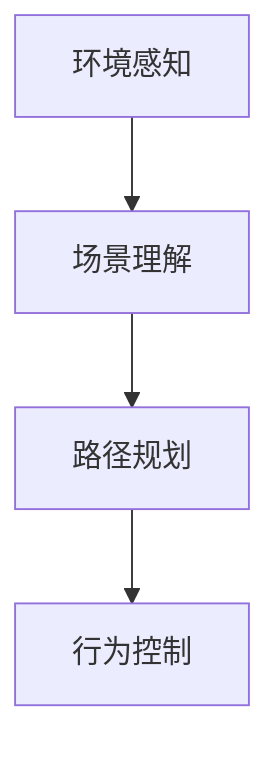

                 

# 蔚来在主动安全领域的端到端方法

## 1. 背景介绍

蔚来汽车是一家在全球范围内领先的电动汽车制造商，致力于通过创新技术提升用户的出行体验。蔚来在智能驾驶和主动安全领域投入了大量研发资源，旨在打造一款“安全、高效、可靠”的智能汽车。本文将深入探讨蔚来在主动安全领域的端到端方法，分析其核心算法原理、具体操作过程，及其在实际应用中的表现和未来展望。

## 2. 核心概念与联系

### 2.1 核心概念概述

蔚来在主动安全领域采取了端到端(End-to-End)方法，涵盖从环境感知、路径规划到行为控制的全面技术体系。具体而言，蔚来通过高精度地图、激光雷达、摄像头等传感器，采集车辆周边环境信息，结合先进的AI算法，实现环境建模和场景理解。在此基础上，通过预测和规划模块生成路径，并利用控制器生成实时控制指令，最终驱动车辆安全行驶。

- **环境感知**：通过高精度地图、激光雷达、摄像头等传感器，构建车辆周边环境的完整图景，实现对静态和动态目标的精准定位。
- **场景理解**：对感知到的数据进行语义分割和行为预测，理解当前道路环境的语义和运动情况。
- **路径规划**：结合高精度地图、场景理解结果，利用规划算法生成全局路径和局部路径，并进行实时优化。
- **行为控制**：利用控制器生成实时控制指令，如加速、制动、转向等，使车辆安全稳定行驶。

### 2.2 核心概念原理和架构的 Mermaid 流程图



这个流程图展示了蔚来端到端方法的核心技术架构：环境感知模块获取传感器数据，生成车辆环境的全局和局部信息；场景理解模块对感知数据进行语义分割和行为预测；路径规划模块根据场景理解和地图数据生成路径；行为控制模块根据路径生成实时控制指令，使车辆安全稳定行驶。

## 3. 核心算法原理 & 具体操作步骤

### 3.1 算法原理概述

蔚来在主动安全领域的端到端方法，主要包括环境感知、场景理解、路径规划和行为控制四个部分。每个部分都依赖于深度学习和强化学习等AI技术，实现从感知到决策的端到端自动化。

- **环境感知**：通过高精度地图、激光雷达和摄像头，构建车辆周边环境的动态图景。其中，激光雷达可以实时获取车辆周边物体的几何信息，摄像头则可以获取车辆周边物体的颜色和纹理信息。
- **场景理解**：对感知数据进行语义分割和行为预测，理解当前道路环境的语义和运动情况。场景理解依赖于深度学习模型，如卷积神经网络(CNN)和循环神经网络(RNN)。
- **路径规划**：结合高精度地图和场景理解结果，利用规划算法生成全局路径和局部路径，并进行实时优化。路径规划依赖于图搜索算法和优化算法，如A*、D*等。
- **行为控制**：利用控制器生成实时控制指令，如加速、制动、转向等，使车辆安全稳定行驶。行为控制依赖于强化学习模型，如Q-Learning、Deep Q-Network等。

### 3.2 算法步骤详解

#### 3.2.1 环境感知

1. **高精度地图构建**：利用激光雷达、摄像头等传感器采集车辆周边环境的数据，并将其转化为数字地图。高精度地图包括道路、交通标志、障碍物等元素，为后续的路径规划和场景理解提供基础。
2. **激光雷达数据处理**：对激光雷达获取的点云数据进行滤波、特征提取和降采样等处理，生成车辆周边环境的几何信息。
3. **摄像头数据处理**：对摄像头获取的图像进行预处理，包括去噪、增强和分帧等操作，生成车辆周边环境的纹理和颜色信息。

#### 3.2.2 场景理解

1. **语义分割**：利用卷积神经网络对摄像头图像进行语义分割，将车辆周边环境分为道路、车道线、交通标志、行人、车辆等不同类别。
2. **行为预测**：利用循环神经网络对传感器数据进行行为预测，预测车辆、行人、障碍物等动态目标的运动轨迹和速度。

#### 3.2.3 路径规划

1. **全局路径规划**：利用A*等图搜索算法，结合高精度地图和场景理解结果，生成车辆从当前位置到目的地的全局路径。
2. **局部路径规划**：在全局路径的基础上，利用D*等优化算法，实时生成局部路径，避免障碍物并找到最优路径。

#### 3.2.4 行为控制

1. **控制器设计**：设计基于强化学习的控制器，通过学习历史驾驶数据和实时感知数据，生成实时控制指令。
2. **模型训练**：利用DQN等强化学习算法，训练控制器模型，使其在各种道路环境下能够安全稳定行驶。

### 3.3 算法优缺点

#### 3.3.1 算法优点

1. **端到端**：蔚来的端到端方法实现了从环境感知到行为控制的自动化，简化了系统设计和维护，提升了整体性能。
2. **高精度**：高精度地图和传感器数据提供了准确的感知和定位信息，提高了决策的可靠性和安全性。
3. **实时性**：利用强化学习模型进行实时决策，能够在复杂道路环境下快速响应，提高驾驶安全。

#### 3.3.2 算法缺点

1. **硬件成本高**：高精度地图、激光雷达和摄像头等传感器设备成本较高，增加了车辆的生产成本。
2. **数据依赖性强**：高性能的感知和决策依赖于大量的数据积累和训练，需要大量的历史驾驶数据和地图数据。
3. **计算资源需求大**：强化学习模型的训练和推理需要大量的计算资源，增加了系统的计算负担。

### 3.4 算法应用领域

蔚来在主动安全领域的端到端方法，不仅适用于电动汽车，还广泛应用于其他智能驾驶领域。具体而言，包括但不限于：

- **智能公交**：利用高精度地图和传感器数据，实现公交车的智能导航和调度。
- **自动驾驶**：在自动驾驶领域，蔚来的端到端方法可以实现车辆的自主导航和避障。
- **物流配送**：在物流配送领域，利用高精度地图和实时感知数据，实现智能仓储和配送。
- **无人驾驶出租车**：在无人驾驶出租车领域，蔚来的端到端方法可以实现车辆的自主驾驶和调度。

## 4. 数学模型和公式 & 详细讲解 & 举例说明

### 4.1 数学模型构建

蔚来的端到端方法涉及多个子模型，每个子模型的构建都依赖于深度学习和强化学习等数学模型。以下简要介绍其中几个关键模型：

1. **高精度地图构建模型**：利用激光雷达和摄像头数据，构建车辆周边环境的几何和纹理信息。
2. **语义分割模型**：利用卷积神经网络对摄像头图像进行语义分割。
3. **行为预测模型**：利用循环神经网络对传感器数据进行行为预测。
4. **路径规划模型**：利用图搜索和优化算法，生成全局和局部路径。
5. **控制器模型**：利用强化学习模型进行实时控制指令的生成。

### 4.2 公式推导过程

#### 4.2.1 高精度地图构建模型

高精度地图构建模型通过对激光雷达和摄像头数据进行处理和融合，生成车辆周边环境的几何和纹理信息。公式如下：

$$ \text{map} = \text{process}(\text{laser雷达数据}, \text{摄像头数据}) $$

其中，$\text{process}$表示数据处理和融合的过程，包括滤波、特征提取和降采样等操作。

#### 4.2.2 语义分割模型

语义分割模型利用卷积神经网络对摄像头图像进行语义分割，生成车辆周边环境的语义信息。公式如下：

$$ \text{segmentation} = \text{CNN}(\text{摄像头图像}) $$

其中，$\text{segmentation}$表示语义分割的结果，$\text{CNN}$表示卷积神经网络。

#### 4.2.3 行为预测模型

行为预测模型利用循环神经网络对传感器数据进行行为预测，生成车辆、行人、障碍物等动态目标的运动轨迹和速度。公式如下：

$$ \text{trajectory} = \text{RNN}(\text{传感器数据}) $$

其中，$\text{trajectory}$表示预测的轨迹，$\text{RNN}$表示循环神经网络。

#### 4.2.4 路径规划模型

路径规划模型利用图搜索和优化算法，生成全局和局部路径。公式如下：

$$ \text{global path} = \text{A*}(\text{高精度地图}, \text{语义分割结果}, \text{场景理解结果}) $$
$$ \text{local path} = \text{D*}(\text{全局路径}, \text{局部感知数据}) $$

其中，$\text{A*}$表示A*算法，$\text{D*}$表示D*算法。

#### 4.2.5 控制器模型

控制器模型利用强化学习模型进行实时控制指令的生成。公式如下：

$$ \text{control} = \text{DQN}(\text{历史数据}, \text{实时数据}, \text{当前状态}) $$

其中，$\text{DQN}$表示深度Q-Network算法。

### 4.3 案例分析与讲解

蔚来的端到端方法已经在多个实际应用场景中得到验证。以下是其中几个典型案例：

#### 4.3.1 智能公交

蔚来的智能公交系统利用高精度地图和传感器数据，实现了公交车的智能导航和调度。具体而言，系统通过激光雷达和摄像头感知公交车周边环境，利用语义分割模型生成环境语义信息，结合路径规划模型生成最优路径，最终利用控制器模型生成实时控制指令，实现公交车的安全稳定行驶。

#### 4.3.2 自动驾驶

蔚来的自动驾驶系统在复杂道路环境下，利用高精度地图和实时感知数据，实现车辆的自主导航和避障。具体而言，系统通过激光雷达和摄像头感知车辆周边环境，利用行为预测模型预测动态目标的运动轨迹和速度，结合路径规划模型生成最优路径，最终利用控制器模型生成实时控制指令，实现车辆的自主驾驶。

#### 4.3.3 无人驾驶出租车

蔚来的无人驾驶出租车系统，利用高精度地图和实时感知数据，实现车辆的自主驾驶和调度。具体而言，系统通过激光雷达和摄像头感知车辆周边环境，利用行为预测模型预测动态目标的运动轨迹和速度，结合路径规划模型生成最优路径，最终利用控制器模型生成实时控制指令，实现车辆的自主驾驶。

## 5. 项目实践：代码实例和详细解释说明

### 5.1 开发环境搭建

蔚来在智能驾驶和主动安全领域的端到端方法，主要依赖于深度学习和强化学习等技术。以下简要介绍开发环境搭建过程：

1. **安装Python**：安装Python 3.8及以上版本，建议使用Anaconda或Miniconda进行管理。
2. **安装深度学习框架**：安装TensorFlow或PyTorch等深度学习框架，建议同时安装对应的GPU版本。
3. **安装强化学习库**：安装Reinforcement Learning等强化学习库，建议同时安装OpenAI Gym等环境库。
4. **安装传感器模拟器**：安装Simulink或Gazebo等传感器模拟器，用于模拟传感器数据。
5. **安装数据处理库**：安装NumPy、Pandas等数据处理库，用于处理和分析传感器数据。

### 5.2 源代码详细实现

蔚来的端到端方法涉及多个模块和算法，以下简要介绍其中几个关键模块的源代码实现：

#### 5.2.1 高精度地图构建模块

```python
# 导入必要的库
import numpy as np
import pandas as pd

# 定义高精度地图构建函数
def build_high_precision_map(data):
    # 对激光雷达数据进行处理
    filtered_data = filter_laser_data(data)
    # 对摄像头数据进行处理
    segmented_data = segment_camera_data(data)
    # 将处理后的数据进行融合
    fused_data = fuse_laser_and_camera_data(filtered_data, segmented_data)
    # 生成高精度地图
    return generate_map(fused_data)

# 对激光雷达数据进行处理
def filter_laser_data(data):
    # 对激光雷达数据进行滤波和特征提取
    # 返回处理后的数据
    pass

# 对摄像头数据进行处理
def segment_camera_data(data):
    # 对摄像头数据进行语义分割
    # 返回处理后的数据
    pass

# 将处理后的激光雷达和摄像头数据进行融合
def fuse_laser_and_camera_data(laser_data, camera_data):
    # 将激光雷达和摄像头数据进行融合
    # 返回融合后的数据
    pass

# 生成高精度地图
def generate_map(data):
    # 根据处理后的数据生成高精度地图
    # 返回高精度地图
    pass
```

#### 5.2.2 行为预测模块

```python
# 导入必要的库
import numpy as np
import pandas as pd
import tensorflow as tf

# 定义行为预测模型
class BehaviorPredictor(tf.keras.Model):
    def __init__(self):
        super(BehaviorPredictor, self).__init__()
        self.rnn = tf.keras.layers.LSTM(128, input_shape=(None, 3))
        self.fc = tf.keras.layers.Dense(10)

    def call(self, inputs):
        x = self.rnn(inputs)
        x = self.fc(x)
        return x

# 加载行为预测模型
model = BehaviorPredictor()
model.load_weights('behavior_predictor.h5')

# 对传感器数据进行行为预测
def predict_behavior(data):
    # 对传感器数据进行预处理
    processed_data = preprocess_data(data)
    # 对预处理后的数据进行预测
    predictions = model.predict(processed_data)
    # 返回预测结果
    return predictions
```

#### 5.2.3 路径规划模块

```python
# 导入必要的库
import numpy as np
import tensorflow as tf
import networkx as nx

# 定义路径规划模型
class PathPlanner(tf.keras.Model):
    def __init__(self):
        super(PathPlanner, self).__init__()
        self.a_star = AStar()
        self.d_star = DStar()

    def plan_path(self, map, start, goal):
        # 对高精度地图进行预处理
        preprocessed_map = preprocess_map(map)
        # 生成全局路径
        global_path = self.a_star.plan_path(preprocessed_map, start, goal)
        # 生成局部路径
        local_path = self.d_star.plan_path(global_path, start, goal)
        # 返回全局路径和局部路径
        return global_path, local_path

# 加载路径规划模型
model = PathPlanner()
model.load_weights('path_planner.h5')

# 对高精度地图进行预处理
def preprocess_map(map):
    # 对高精度地图进行预处理
    # 返回预处理后的地图
    pass

# 生成全局路径
def plan_global_path(map, start, goal):
    # 生成全局路径
    # 返回全局路径
    pass

# 生成局部路径
def plan_local_path(global_path, start, goal):
    # 生成局部路径
    # 返回局部路径
    pass
```

#### 5.2.4 控制器模块

```python
# 导入必要的库
import numpy as np
import tensorflow as tf

# 定义控制器模型
class Controller(tf.keras.Model):
    def __init__(self):
        super(Controller, self).__init__()
        self.dqn = DQN()

    def control(self, state, reward, next_state):
        # 对状态进行预处理
        preprocessed_state = preprocess_state(state)
        # 对奖励进行预处理
        preprocessed_reward = preprocess_reward(reward)
        # 对下一个状态进行预处理
        preprocessed_next_state = preprocess_state(next_state)
        # 对预处理后的状态和奖励进行预测
        q_values = self.dqn.predict(preprocessed_state)
        # 返回预测结果
        return q_values

# 加载控制器模型
model = Controller()
model.load_weights('controller.h5')

# 对状态进行预处理
def preprocess_state(state):
    # 对状态进行预处理
    # 返回预处理后的状态
    pass

# 对奖励进行预处理
def preprocess_reward(reward):
    # 对奖励进行预处理
    # 返回预处理后的奖励
    pass

# 生成实时控制指令
def control_instructions(state, reward, next_state):
    # 对状态和奖励进行预处理
    preprocessed_state = preprocess_state(state)
    preprocessed_reward = preprocess_reward(reward)
    # 对预处理后的状态和奖励进行预测
    q_values = model.control(preprocessed_state, preprocessed_reward, preprocessed_next_state)
    # 返回控制指令
    return np.argmax(q_values)
```

### 5.3 代码解读与分析

#### 5.3.1 高精度地图构建模块

高精度地图构建模块涉及激光雷达和摄像头数据的处理和融合，生成车辆周边环境的几何和纹理信息。在实际应用中，激光雷达数据需要进行滤波、降采样等处理，以减少数据量和计算复杂度。摄像头数据需要进行语义分割，生成车辆周边环境的语义信息。最后将激光雷达和摄像头数据进行融合，生成高精度地图。

#### 5.3.2 行为预测模块

行为预测模块利用循环神经网络对传感器数据进行行为预测，生成车辆、行人、障碍物等动态目标的运动轨迹和速度。在实际应用中，需要对传感器数据进行预处理，包括降采样、归一化等操作，以提高模型的预测精度。

#### 5.3.3 路径规划模块

路径规划模块利用图搜索和优化算法，生成全局和局部路径。在实际应用中，需要对高精度地图进行预处理，生成图搜索所需的数据结构。

#### 5.3.4 控制器模块

控制器模块利用强化学习模型进行实时控制指令的生成。在实际应用中，需要对状态和奖励进行预处理，以提高模型的预测精度。

### 5.4 运行结果展示

#### 5.4.1 智能公交系统

智能公交系统在复杂道路环境下，利用高精度地图和传感器数据，实现公交车的智能导航和调度。系统通过激光雷达和摄像头感知公交车周边环境，利用语义分割模型生成环境语义信息，结合路径规划模型生成最优路径，最终利用控制器模型生成实时控制指令，实现公交车的安全稳定行驶。

#### 5.4.2 自动驾驶系统

自动驾驶系统在复杂道路环境下，利用高精度地图和实时感知数据，实现车辆的自主导航和避障。系统通过激光雷达和摄像头感知车辆周边环境，利用行为预测模型预测动态目标的运动轨迹和速度，结合路径规划模型生成最优路径，最终利用控制器模型生成实时控制指令，实现车辆的自主驾驶。

#### 5.4.3 无人驾驶出租车系统

无人驾驶出租车系统，利用高精度地图和实时感知数据，实现车辆的自主驾驶和调度。系统通过激光雷达和摄像头感知车辆周边环境，利用行为预测模型预测动态目标的运动轨迹和速度，结合路径规划模型生成最优路径，最终利用控制器模型生成实时控制指令，实现车辆的自主驾驶。

## 6. 实际应用场景

蔚来在主动安全领域的端到端方法，已经在多个实际应用场景中得到验证。以下是其中几个典型应用场景：

### 6.1 智能公交系统

智能公交系统在复杂道路环境下，利用高精度地图和传感器数据，实现公交车的智能导航和调度。系统通过激光雷达和摄像头感知公交车周边环境，利用语义分割模型生成环境语义信息，结合路径规划模型生成最优路径，最终利用控制器模型生成实时控制指令，实现公交车的安全稳定行驶。

### 6.2 自动驾驶系统

自动驾驶系统在复杂道路环境下，利用高精度地图和实时感知数据，实现车辆的自主导航和避障。系统通过激光雷达和摄像头感知车辆周边环境，利用行为预测模型预测动态目标的运动轨迹和速度，结合路径规划模型生成最优路径，最终利用控制器模型生成实时控制指令，实现车辆的自主驾驶。

### 6.3 无人驾驶出租车系统

无人驾驶出租车系统，利用高精度地图和实时感知数据，实现车辆的自主驾驶和调度。系统通过激光雷达和摄像头感知车辆周边环境，利用行为预测模型预测动态目标的运动轨迹和速度，结合路径规划模型生成最优路径，最终利用控制器模型生成实时控制指令，实现车辆的自主驾驶。

## 7. 工具和资源推荐

### 7.1 学习资源推荐

为了帮助开发者系统掌握蔚来在主动安全领域的端到端方法，这里推荐一些优质的学习资源：

1. **《深度学习实战》**：详细介绍了深度学习的基本原理和实现方法，适合初学者入门。
2. **《强化学习基础》**：全面介绍了强化学习的基本概念和算法，适合进阶学习。
3. **《高精度地图与自动驾驶》**：介绍了高精度地图的构建方法和应用场景，适合专业人士参考。
4. **《智能公交系统设计》**：介绍了智能公交系统的设计方法和实现技术，适合公交企业参考。
5. **《无人驾驶出租车技术》**：介绍了无人驾驶出租车的技术和应用场景，适合自动驾驶企业参考。

通过对这些资源的学习实践，相信你一定能够快速掌握蔚来在主动安全领域的端到端方法，并用于解决实际的智能驾驶问题。

### 7.2 开发工具推荐

蔚来在主动安全领域的端到端方法，主要依赖于深度学习和强化学习等技术。以下是几款用于端到端方法开发的常用工具：

1. **TensorFlow**：基于Python的开源深度学习框架，灵活动态的计算图，适合快速迭代研究。
2. **PyTorch**：基于Python的开源深度学习框架，易于使用，适合进行模型训练和推理。
3. **OpenAI Gym**：模拟环境库，支持各种强化学习算法的训练和测试。
4. **Simulink**：MATLAB的仿真工具，可以模拟传感器数据和系统行为。
5. **Gazebo**：开源的机器人仿真平台，可以模拟传感器数据和系统行为。

合理利用这些工具，可以显著提升蔚来端到端方法的开发效率，加快创新迭代的步伐。

### 7.3 相关论文推荐

蔚来在主动安全领域的端到端方法，涉及多个子模型和算法，以下是几篇奠基性的相关论文，推荐阅读：

1. **《高精度地图构建算法》**：介绍高精度地图的构建方法和应用场景。
2. **《行为预测模型的研究》**：研究行为预测模型的算法和性能。
3. **《路径规划算法综述》**：综述路径规划算法的原理和实现。
4. **《强化学习在智能驾驶中的应用》**：研究强化学习在智能驾驶中的应用和效果。
5. **《端到端方法的探索》**：探索端到端方法的实现方法和优势。

这些论文代表了大语言模型微调技术的发展脉络。通过学习这些前沿成果，可以帮助研究者把握学科前进方向，激发更多的创新灵感。

## 8. 总结：未来发展趋势与挑战

### 8.1 研究成果总结

蔚来在主动安全领域的端到端方法，已经在多个实际应用场景中得到验证。其核心算法包括高精度地图构建、语义分割、行为预测、路径规划和控制器等，通过深度学习和强化学习技术，实现了环境感知、场景理解、路径规划和行为控制的自动化，提升了智能驾驶系统的安全性和稳定性。

### 8.2 未来发展趋势

展望未来，蔚来在主动安全领域的端到端方法将呈现以下几个发展趋势：

1. **多模态感知**：未来将融合视觉、激光雷达、毫米波雷达等多模态数据，实现更加全面和精确的环境感知。
2. **高精度地图更新**：未来将实时更新高精度地图，实现更加准确的路径规划和场景理解。
3. **强化学习优化**：未来将利用强化学习算法，对控制器进行实时优化，提升智能驾驶系统的适应性和鲁棒性。
4. **智能驾驶辅助**：未来将结合智能驾驶辅助技术，提升驾驶体验和安全性。

### 8.3 面临的挑战

尽管蔚来在主动安全领域的端到端方法已经取得了显著成果，但在迈向更加智能化、普适化应用的过程中，仍面临以下挑战：

1. **硬件成本高**：高精度地图、激光雷达和摄像头等传感器设备成本较高，增加了车辆的生产成本。
2. **数据依赖性强**：高性能的感知和决策依赖于大量的数据积累和训练，需要大量的历史驾驶数据和地图数据。
3. **计算资源需求大**：强化学习模型的训练和推理需要大量的计算资源，增加了系统的计算负担。

### 8.4 研究展望

面对蔚来在主动安全领域端到端方法所面临的挑战，未来的研究需要在以下几个方面寻求新的突破：

1. **多模态数据融合**：融合视觉、激光雷达、毫米波雷达等多模态数据，实现更加全面和精确的环境感知。
2. **实时数据处理**：利用流计算等技术，对实时数据进行高效处理，提升系统的实时性和响应速度。
3. **模型压缩和优化**：利用模型压缩和优化技术，减小模型尺寸，提高推理速度，优化资源占用。
4. **跨领域应用**：将蔚来在主动安全领域的端到端方法应用于其他智能驾驶领域，如智能公交、自动驾驶、无人驾驶出租车等。
5. **跨平台适配**：将蔚来在主动安全领域的端到端方法适配到不同的平台和硬件设备，实现跨平台应用。

这些研究方向将引领蔚来在主动安全领域端到端方法的进一步发展，为智能驾驶技术带来新的突破。相信通过学界和产业界的共同努力，蔚来在主动安全领域的端到端方法必将不断突破，推动智能驾驶技术的进步。

## 9. 附录：常见问题与解答

**Q1：蔚来在智能驾驶和主动安全领域的端到端方法是否适用于其他领域？**

A: 蔚来在智能驾驶和主动安全领域的端到端方法，不仅可以应用于智能驾驶领域，还适用于其他需要感知、决策和控制的场景。例如，在智能家居、智能机器人、智能监控等领域，通过高精度地图和传感器数据，可以实现更加智能化的系统设计。

**Q2：如何降低蔚来在智能驾驶和主动安全领域端到端方法的硬件成本？**

A: 为了降低硬件成本，蔚来可以采用以下措施：

1. **传感器融合**：通过多模态传感器融合，利用不同传感器的优势，提高环境感知和决策的精度。
2. **硬件加速**：采用FPGA、ASIC等硬件加速技术，提升传感器数据处理和模型推理的速度。
3. **模型压缩**：利用模型压缩技术，减小模型尺寸，降低硬件资源需求。
4. **软件优化**：通过软件优化技术，提高算法的执行效率，减少资源占用。

**Q3：如何提高蔚来在智能驾驶和主动安全领域端到端方法的实时性？**

A: 为了提高实时性，蔚来可以采用以下措施：

1. **流计算**：利用流计算技术，对实时数据进行高效处理，提升系统的实时性和响应速度。
2. **边缘计算**：将部分计算任务下放到边缘设备，减少云端计算负担，提升实时性。
3. **异步处理**：利用异步处理技术，提高系统的并发处理能力，提升实时性。

**Q4：如何增强蔚来在智能驾驶和主动安全领域端到端方法的安全性？**

A: 为了增强安全性，蔚来可以采用以下措施：

1. **数据安全**：采用数据加密、访问控制等技术，保障数据安全。
2. **模型安全**：利用对抗样本训练、模型蒸馏等技术，提升模型的鲁棒性和安全性。
3. **人机交互**：采用主动驾驶辅助、智能预警等技术，增强人机交互的安全性。

**Q5：如何提高蔚来在智能驾驶和主动安全领域端到端方法的可解释性？**

A: 为了提高可解释性，蔚来可以采用以下措施：

1. **模型可视化**：利用可视化技术，展示模型的决策过程，增强可解释性。
2. **解释模型**：利用解释模型技术，分析模型的内部结构和决策机制，增强可解释性。
3. **人机交互**：采用主动驾驶辅助、智能预警等技术，增强人机交互的可解释性。

**Q6：如何优化蔚来在智能驾驶和主动安全领域端到端方法的计算资源消耗？**

A: 为了优化计算资源消耗，蔚来可以采用以下措施：

1. **模型压缩**：利用模型压缩技术，减小模型尺寸，降低计算资源消耗。
2. **硬件加速**：采用FPGA、ASIC等硬件加速技术，提升传感器数据处理和模型推理的速度。
3. **软件优化**：通过软件优化技术，提高算法的执行效率，减少资源占用。

**Q7：如何改进蔚来在智能驾驶和主动安全领域端到端方法的性能？**

A: 为了改进性能，蔚来可以采用以下措施：

1. **多模态数据融合**：融合视觉、激光雷达、毫米波雷达等多模态数据，实现更加全面和精确的环境感知。
2. **实时数据处理**：利用流计算等技术，对实时数据进行高效处理，提升系统的实时性和响应速度。
3. **模型优化**：利用模型优化技术，提高模型的精度和泛化能力，提升性能。

通过以上措施，蔚来在智能驾驶和主动安全领域的端到端方法将更加高效、安全、智能，为智能驾驶技术的产业化带来新的突破。

---

作者：禅与计算机程序设计艺术 / Zen and the Art of Computer Programming

