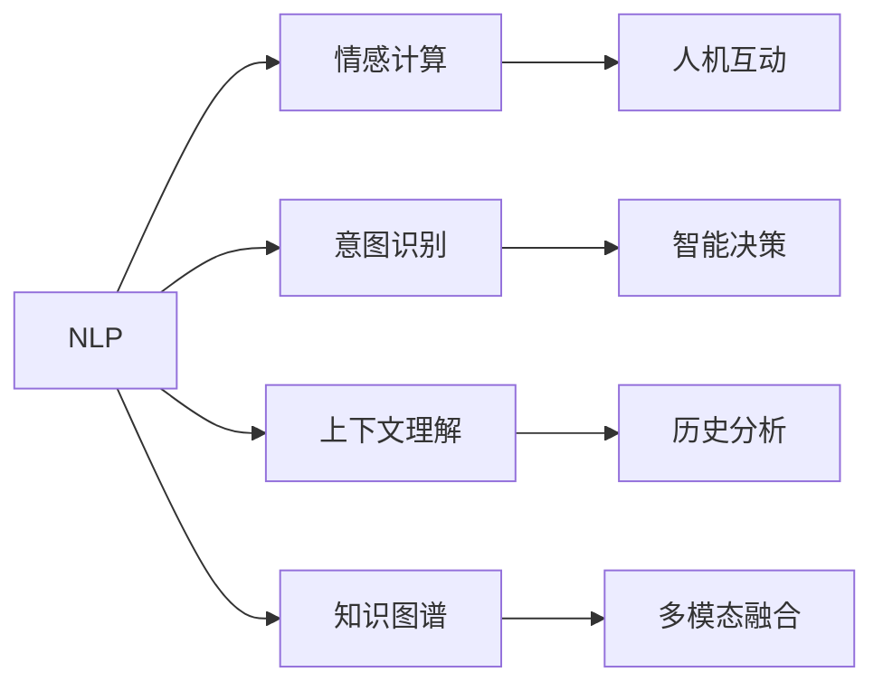

                 

# 虚拟关系：AI时代的亲密之旅

## 1. 背景介绍

### 1.1 问题由来
随着人工智能技术的飞速发展，虚拟关系（Virtual Relationships），即通过AI技术构建和维护的人机关系，成为新一轮科技革新浪潮中的重要方向。无论是在智能客服、虚拟助手、智能家居等场景，还是在情感计算、社交网络、医疗健康等领域，虚拟关系技术都在逐步渗透，深度改变着人类与机器的互动模式。

### 1.2 问题核心关键点
虚拟关系的构建涉及多个维度：从基础的自然语言处理(NLP)、计算机视觉(CV)等核心技术，到更复杂的情感识别、意图理解、决策建模等高级应用。本文将重点聚焦于基于自然语言处理的虚拟关系构建，探讨如何在AI时代，通过构建虚拟关系提升用户体验和智能化水平。

## 2. 核心概念与联系

### 2.1 核心概念概述

为更好地理解虚拟关系的AI构建过程，本节将介绍几个关键核心概念：

- 自然语言处理（Natural Language Processing, NLP）：涉及语言理解、语言生成、情感分析、实体识别等，是构建虚拟关系的基础。
- 情感计算（Affective Computing）：通过分析情感特征，使机器能够理解和表达情感，是虚拟关系中人机互动的重要组成部分。
- 意图识别（Intent Recognition）：理解用户的意图，引导AI做出恰当的回应，提升用户满意度。
- 上下文理解（Contextual Understanding）：结合历史对话和上下文信息，提升AI对用户需求的理解深度。
- 知识图谱（Knowledge Graph）：提供丰富的知识表示和推理能力，帮助AI构建更全面的背景知识库。

这些核心概念通过Mermaid流程图来展示其相互联系：



此流程图展示了各个概念之间的关系：

1. NLP是情感计算、意图识别、上下文理解、知识图谱等的基础，提供了语言处理的基础能力。
2. 情感计算使得AI能够理解用户情感，增强人机互动的亲密感。
3. 意图识别帮助AI准确把握用户需求，做出合理的回应。
4. 上下文理解结合历史对话和用户背景信息，提升AI的理解能力。
5. 知识图谱提供了丰富的知识库，帮助AI进行多模态信息的融合和推理。
6. 人机互动、智能决策、历史分析和多模态融合等模块共同构成了虚拟关系的综合应用。

## 3. 核心算法原理 & 具体操作步骤
### 3.1 算法原理概述

基于自然语言处理的虚拟关系构建，其核心思想是通过自然语言处理技术，使AI系统能够理解用户输入的文本信息，并据此做出恰当的回应。

具体而言，虚拟关系构建过程可以分为以下几个关键步骤：

1. **语言理解**：利用NLP技术，对用户输入的自然语言文本进行理解，提取文本中的关键信息。
2. **情感分析**：对用户文本进行情感分析，识别出用户的情感状态。
3. **意图识别**：根据用户文本和历史对话，识别出用户的意图。
4. **上下文理解**：结合历史对话和上下文信息，增强对用户意图的理解。
5. **多模态融合**：将情感分析、意图识别和上下文理解等信息进行融合，形成综合的决策依据。
6. **智能决策**：根据融合后的信息，做出合适的回应或推荐。
7. **人机互动**：将决策结果转化为自然语言文本，与用户进行互动。

### 3.2 算法步骤详解

以下是虚拟关系构建的主要步骤和详细步骤：

**Step 1: 数据收集与预处理**
- 收集用户与AI系统的互动数据，如聊天记录、用户反馈等。
- 对数据进行清洗，去除噪音和无关信息。
- 对文本进行分词、标注实体等预处理操作。

**Step 2: 语言理解**
- 利用预训练的语言模型（如BERT、GPT等）对用户输入的文本进行理解，提取关键信息。
- 使用命名实体识别(NER)、依存句法分析(POS)等技术，对文本进行结构化处理。

**Step 3: 情感分析**
- 使用情感分析模型对用户文本进行情感极性分类，识别出用户的情感状态（如正面、负面、中性等）。
- 对情感进行强度量化，理解用户的情绪程度。

**Step 4: 意图识别**
- 利用意图识别模型对用户文本进行意图分类，识别出用户的具体需求（如咨询、投诉、建议等）。
- 对意图进行细粒度标注，如用户想要询问天气、查看新闻等。

**Step 5: 上下文理解**
- 结合历史对话记录，使用上下文理解模型对用户意图进行补充和修正。
- 考虑上下文信息，如用户之前的提问和回答，进行上下文推理。

**Step 6: 多模态融合**
- 将情感分析、意图识别、上下文理解等信息进行融合，形成一个综合的决策依据。
- 利用知识图谱进行多模态信息的融合，引入领域知识提升决策的准确性。

**Step 7: 智能决策**
- 根据融合后的信息，使用决策模型（如逻辑回归、神经网络等）做出合适的回应或推荐。
- 结合用户历史行为和偏好，优化决策模型的输出。

**Step 8: 人机互动**
- 将决策结果转化为自然语言文本，生成合适的回复。
- 与用户进行互动，验证用户是否满意，并根据反馈进行后续调整。

### 3.3 算法优缺点

基于自然语言处理的虚拟关系构建方法具有以下优点：
1. 智能化水平高：通过NLP技术，AI能够高效理解自然语言文本，提供智能化的回复。
2. 灵活性高：利用上下文理解和知识图谱，AI能够灵活适应不同用户的个性化需求。
3. 可扩展性强：虚拟关系构建方法可以轻松应用于多个领域，如智能客服、虚拟助手、社交网络等。

同时，该方法也存在一定的局限性：
1. 数据依赖性高：虚拟关系构建需要大量的用户互动数据，数据收集和清洗难度较大。
2. 准确性受限：由于语言的多义性和复杂性，NLP模型的理解能力可能存在偏差。
3. 缺乏可解释性：虚拟关系构建模型的决策过程往往缺乏可解释性，难以进行调试和优化。

尽管存在这些局限性，但就目前而言，基于自然语言处理的虚拟关系构建方法仍然是构建人机互动系统的核心技术之一。未来相关研究的重点在于如何进一步提升模型的准确性和可解释性，降低对数据的需求，提高模型的鲁棒性和泛化能力。

### 3.4 算法应用领域

基于自然语言处理的虚拟关系构建方法，已经在多个领域得到了广泛的应用，例如：

- 智能客服：通过自然语言处理技术，使AI系统能够理解用户的问题和需求，提供快速准确的答复。
- 虚拟助手：为用户提供多轮对话支持，解答用户问题，执行任务操作。
- 社交网络：通过情感分析、意图识别等技术，分析用户情绪和行为，提供个性化的社交推荐。
- 医疗健康：利用上下文理解和情感分析技术，提供心理健康支持和治疗建议。
- 智能家居：通过自然语言处理，与用户进行互动，执行家居控制和任务调度。

除了这些经典应用外，虚拟关系技术还在智能交通、金融理财、智能广告等多个领域逐步落地，为人们的日常生活和工作带来了便捷和智能化。

## 4. 数学模型和公式 & 详细讲解 & 举例说明

### 4.1 数学模型构建

本节将使用数学语言对虚拟关系构建的主要算法进行更加严格的刻画。

设用户输入的文本为 $x$，AI系统的回复为 $y$。假设模型能够精确地理解文本 $x$ 并生成回复 $y$，则虚拟关系构建的过程可以表示为：

$$
y = f(x; \theta)
$$

其中 $f$ 为虚拟关系构建模型，$\theta$ 为模型的参数。模型 $f$ 的设计目标是最大化对用户输入的理解准确度和生成回应的质量。

### 4.2 公式推导过程

以下我们以一个简单的情感分析模型为例，推导其基本公式和训练过程。

假设情感分析模型的输入为文本 $x$，输出为情感极性 $y \in \{0,1\}$，其中 $0$ 表示负面情绪，$1$ 表示正面情绪。

定义模型 $f$ 为简单的线性分类器，输入为文本的特征向量 $x \in \mathbb{R}^d$，输出为情感极性 $y \in \{0,1\}$。模型 $f$ 可以表示为：

$$
y = \sigma(\mathbf{W}x + b)
$$

其中 $\sigma$ 为激活函数，$\mathbf{W}$ 和 $b$ 为模型参数。模型的损失函数为二分类交叉熵损失：

$$
\mathcal{L}(\theta) = -\frac{1}{N} \sum_{i=1}^N [y_i \log \hat{y_i} + (1-y_i) \log (1-\hat{y_i})]
$$

训练模型时，最小化损失函数 $\mathcal{L}(\theta)$，通过梯度下降算法更新模型参数：

$$
\theta \leftarrow \theta - \eta \nabla_{\theta}\mathcal{L}(\theta)
$$

其中 $\eta$ 为学习率，$\nabla_{\theta}\mathcal{L}(\theta)$ 为损失函数对模型参数的梯度。

### 4.3 案例分析与讲解

假设我们有一组训练数据，其中 $x_i$ 为输入文本，$y_i$ 为对应情感极性标签。例如：

| 文本 | 情感极性 |
| --- | --- |
| "我心情很好" | 1 |
| "我非常生气" | 0 |
| "今天天气不错" | 1 |
| "公司最近忙死了" | 0 |

我们可以使用上述模型进行训练。首先，将文本进行向量化处理，得到一个特征向量 $x_i \in \mathbb{R}^d$。然后，将特征向量输入模型 $f$，得到情感极性预测 $\hat{y_i}$。接下来，计算损失函数 $\mathcal{L}(\theta)$ 并根据梯度下降算法更新模型参数 $\theta$。重复上述过程，直到模型收敛。

## 5. 项目实践：代码实例和详细解释说明
### 5.1 开发环境搭建

在进行虚拟关系构建实践前，我们需要准备好开发环境。以下是使用Python进行PyTorch开发的环境配置流程：

1. 安装Anaconda：从官网下载并安装Anaconda，用于创建独立的Python环境。

2. 创建并激活虚拟环境：
```bash
conda create -n pytorch-env python=3.8 
conda activate pytorch-env
```

3. 安装PyTorch：根据CUDA版本，从官网获取对应的安装命令。例如：
```bash
conda install pytorch torchvision torchaudio cudatoolkit=11.1 -c pytorch -c conda-forge
```

4. 安装相关库：
```bash
pip install numpy pandas scikit-learn transformers pytorch-lightning
```

5. 安装Tensorboard：
```bash
pip install tensorboard
```

完成上述步骤后，即可在`pytorch-env`环境中开始虚拟关系构建的实践。

### 5.2 源代码详细实现

这里我们以一个简单的情感分析模型为例，给出使用PyTorch进行训练和推理的完整代码实现。

```python
import torch
import torch.nn as nn
import torch.optim as optim
from torchtext import datasets
from torchtext import data

# 定义特征提取器
class TextField(data.Field):
    def __init__(self, tokenizer=None, lower=True, include_lengths=False):
        super().__init__(tokenizer=tokenizer, lower=lower, include_lengths=include_lengths)
        self.pad_token = '<PAD>'
        self.eos_token = '<EOS>'
        self.unk_token = '<UNK>'
        self.batch_first = True

    def preprocessing(self, text):
        text = self.tokenizer(text)
        text = [self.eos_token] + text + [self.pad_token]
        return text

    def postprocessing(self, tokens):
        return ' '.join(tokens)

    def collate(self, batch, pad_idx=1):
        text = [self.pad_token] * len(batch)
        texts = []
        for i in range(len(batch)):
            text += batch[i]
        texts.append(text)
        return texts

# 加载数据集
texts, labels = datasets.IMDB.splits(exts=['.txt'], fields=[('text', TextField())])
texts = [t.lower() for t in texts]

# 划分训练集和测试集
train_texts, test_texts = texts[:15000], texts[15000:]

# 定义模型
class SentimentClassifier(nn.Module):
    def __init__(self, embedding_dim, hidden_dim, output_dim):
        super().__init__()
        self.embedding = nn.Embedding(len(vocab), embedding_dim)
        self.fc1 = nn.Linear(embedding_dim, hidden_dim)
        self.fc2 = nn.Linear(hidden_dim, output_dim)
        self.sigmoid = nn.Sigmoid()

    def forward(self, x):
        x = self.embedding(x)
        x = self.fc1(x)
        x = self.fc2(x)
        return self.sigmoid(x)

# 定义超参数
embedding_dim = 100
hidden_dim = 256
output_dim = 1
learning_rate = 1e-3
num_epochs = 10

# 初始化模型和优化器
model = SentimentClassifier(embedding_dim, hidden_dim, output_dim)
optimizer = optim.Adam(model.parameters(), lr=learning_rate)

# 定义损失函数
criterion = nn.BCELoss()

# 训练模型
for epoch in range(num_epochs):
    for i, (texts, labels) in enumerate(train_loader):
        texts = [texts]
        labels = labels.unsqueeze(1)
        optimizer.zero_grad()
        outputs = model(texts)
        loss = criterion(outputs, labels)
        loss.backward()
        optimizer.step()
        if (i+1) % 10 == 0:
            print(f'Epoch {epoch+1}, Step {i+1}, Loss: {loss.item():.4f}')
    
# 测试模型
with torch.no_grad():
    correct = 0
    total = 0
    for i, (texts, labels) in enumerate(test_loader):
        texts = [texts]
        labels = labels.unsqueeze(1)
        outputs = model(texts)
        _, predicted = torch.max(outputs, 1)
        total += labels.size(0)
        correct += (predicted == labels).sum().item()
    print(f'Accuracy: {100 * correct / total:.2f}%')
```

### 5.3 代码解读与分析

让我们再详细解读一下关键代码的实现细节：

**TextField类**：
- 定义了文本数据的预处理、后处理和拼接操作，同时定义了填充符、结束符和未知符。
- 实现了一个自定义的collate方法，用于将多段文本拼接并填充到同一长度。

**SentimentClassifier模型**：
- 定义了一个简单的线性分类器，包含一个嵌入层、两个全连接层和一个sigmoid激活函数。
- 在正向传播中，将输入文本进行嵌入，通过两个全连接层进行特征提取，最后输出情感极性。

**训练过程**：
- 使用Adam优化器和交叉熵损失函数，对模型进行训练。
- 在每个epoch中，对训练集进行迭代，计算损失并更新模型参数。
- 每10步输出一次损失信息，便于监控训练进度。

**测试过程**：
- 在测试集上对模型进行评估，计算准确率。
- 使用with torch.no_grad()模式，避免在测试过程中计算梯度，提高计算效率。

可以看出，使用PyTorch进行虚拟关系构建的实践代码简洁高效，模块化设计使得代码易于扩展和维护。

## 6. 实际应用场景
### 6.1 智能客服

智能客服系统是虚拟关系构建的重要应用场景。通过自然语言处理技术，智能客服能够理解用户问题，提供快速准确的答复，提升客户满意度。

在技术实现上，可以收集企业的历史客服对话记录，将问题和最佳答复构建成监督数据，在此基础上对预训练模型进行微调。微调后的模型能够自动理解用户意图，匹配最合适的答案模板进行回复。对于客户提出的新问题，还可以接入检索系统实时搜索相关内容，动态组织生成回答。如此构建的智能客服系统，能大幅提升客户咨询体验和问题解决效率。

### 6.2 虚拟助手

虚拟助手通过自然语言处理技术，与用户进行多轮对话支持，解答用户问题，执行任务操作。例如，智能音箱、智能手机助手等，通过语音识别和自然语言处理技术，理解用户的指令和需求，进行语音交互和任务调度。

在技术实现上，可以使用基于深度学习模型的虚拟助手，如Google Assistant、Amazon Alexa等。这些系统通过多轮对话和上下文理解技术，能够提供个性化、智能化的服务，如天气查询、日程管理、在线购物等。

### 6.3 社交网络

社交网络通过情感分析、意图识别等技术，分析用户情绪和行为，提供个性化的社交推荐。例如，社交媒体平台可以根据用户的情绪状态，推荐相关的文章、视频等内容，增强用户粘性。

在技术实现上，可以使用情感分析模型，对用户的评论、点赞、分享等行为进行情感分析，生成情感标签。基于这些情感标签，社交平台可以推荐相似情感内容，增强用户互动和粘性。

### 6.4 未来应用展望

随着虚拟关系构建技术的不断发展，其在更多领域的应用前景将不断拓展，为人们的生活和工作带来深远影响。

- **医疗健康**：利用上下文理解和情感分析技术，提供心理健康支持和治疗建议，如智能问诊、情绪疏导等。
- **智能家居**：通过自然语言处理，与用户进行互动，执行家居控制和任务调度，如语音控制灯光、温度等。
- **金融理财**：利用意图识别和多模态融合技术，提供个性化的金融建议和理财服务，如智能投顾、风险评估等。
- **智能交通**：通过情感分析和上下文理解技术，提供路况、天气等出行建议，提升出行体验。
- **智能广告**：根据用户的情绪和行为，提供个性化的广告推荐，提升广告效果和用户体验。

## 7. 工具和资源推荐
### 7.1 学习资源推荐

为了帮助开发者系统掌握虚拟关系构建的理论基础和实践技巧，这里推荐一些优质的学习资源：

1. 《自然语言处理综论》（自然语言处理概论、文本分类、信息检索、机器翻译、语义分析等）：全面介绍自然语言处理技术的基础和应用。
2. 《深度学习》（神经网络、卷积神经网络、循环神经网络、深度强化学习等）：深度介绍深度学习技术，涵盖图像、语音、文本等多个领域。
3. 《情感计算》（情感识别、情感生成、情感交互等）：详细讲解情感计算的基础理论和应用。
4. 《意图识别》（用户意图理解、意图分类、多模态意图识别等）：介绍意图识别的算法和应用。
5. 《上下文理解》（上下文表示、上下文推理、对话管理等）：讲解上下文理解的技术和应用。

通过对这些资源的学习实践，相信你一定能够快速掌握虚拟关系构建的精髓，并用于解决实际的NLP问题。

### 7.2 开发工具推荐

高效的开发离不开优秀的工具支持。以下是几款用于虚拟关系构建开发的常用工具：

1. PyTorch：基于Python的开源深度学习框架，灵活动态的计算图，适合快速迭代研究。大部分虚拟关系构建模型都有PyTorch版本的实现。
2. TensorFlow：由Google主导开发的开源深度学习框架，生产部署方便，适合大规模工程应用。同样有丰富的虚拟关系构建资源。
3. HuggingFace Transformers库：提供预训练语言模型和工具库，支持自然语言处理任务。
4. Weights & Biases：模型训练的实验跟踪工具，可以记录和可视化模型训练过程中的各项指标，方便对比和调优。
5. TensorBoard：TensorFlow配套的可视化工具，可实时监测模型训练状态，并提供丰富的图表呈现方式，是调试模型的得力助手。

合理利用这些工具，可以显著提升虚拟关系构建的开发效率，加快创新迭代的步伐。

### 7.3 相关论文推荐

虚拟关系构建技术的发展源于学界的持续研究。以下是几篇奠基性的相关论文，推荐阅读：

1. Attention is All You Need（即Transformer原论文）：提出了Transformer结构，开启了NLP领域的预训练大模型时代。
2. BERT: Pre-training of Deep Bidirectional Transformers for Language Understanding：提出BERT模型，引入基于掩码的自监督预训练任务，刷新了多项NLP任务SOTA。
3. Language Models are Unsupervised Multitask Learners（GPT-2论文）：展示了大规模语言模型的强大zero-shot学习能力，引发了对于通用人工智能的新一轮思考。
4. Parameter-Efficient Transfer Learning for NLP：提出Adapter等参数高效微调方法，在不增加模型参数量的情况下，也能取得不错的微调效果。
5. Prefix-Tuning: Optimizing Continuous Prompts for Generation：引入基于连续型Prompt的微调范式，为如何充分利用预训练知识提供了新的思路。
6. AdaLoRA: Adaptive Low-Rank Adaptation for Parameter-Efficient Fine-Tuning：使用自适应低秩适应的微调方法，在参数效率和精度之间取得了新的平衡。

这些论文代表了大语言模型微调技术的发展脉络。通过学习这些前沿成果，可以帮助研究者把握学科前进方向，激发更多的创新灵感。

## 8. 总结：未来发展趋势与挑战
### 8.1 总结

本文对基于自然语言处理的虚拟关系构建方法进行了全面系统的介绍。首先阐述了虚拟关系构建的研究背景和意义，明确了虚拟关系在提升用户体验和智能化水平方面的独特价值。其次，从原理到实践，详细讲解了虚拟关系构建的数学原理和关键步骤，给出了虚拟关系构建任务开发的完整代码实例。同时，本文还广泛探讨了虚拟关系构建在智能客服、虚拟助手、社交网络等多个领域的应用前景，展示了虚拟关系构建技术的广阔潜力。此外，本文精选了虚拟关系构建技术的各类学习资源，力求为读者提供全方位的技术指引。

通过本文的系统梳理，可以看到，基于自然语言处理的虚拟关系构建方法正在成为NLP领域的重要范式，极大地拓展了虚拟关系构建技术的应用边界，催生了更多的落地场景。受益于自然语言处理技术的快速发展，虚拟关系构建技术将在未来进一步渗透到更多领域，为人类认知智能的进化带来深远影响。

### 8.2 未来发展趋势

展望未来，虚拟关系构建技术将呈现以下几个发展趋势：

1. **多模态融合**：未来的虚拟关系构建将更加注重多模态信息的融合，结合语音、图像、视频等多种信息源，提供更加全面、真实的用户理解。
2. **上下文理解**：结合历史对话和上下文信息，进一步提升虚拟关系构建模型的理解能力，使其能够更好地适应不同用户的个性化需求。
3. **情感计算**：情感计算技术将得到更加广泛的应用，使虚拟关系构建系统能够更好地理解和表达用户的情绪，提升用户体验。
4. **知识图谱**：知识图谱的应用将更加深入，利用领域知识提升虚拟关系构建模型的泛化能力和决策精度。
5. **自监督学习**：通过自监督学习范式，进一步降低对标注数据的需求，提升虚拟关系构建模型的鲁棒性和泛化能力。
6. **可解释性**：提升虚拟关系构建模型的可解释性，使系统的决策过程更加透明、可信。

这些趋势凸显了虚拟关系构建技术的广阔前景。这些方向的探索发展，必将进一步提升虚拟关系构建系统的性能和应用范围，为人类认知智能的进化带来深远影响。

### 8.3 面临的挑战

尽管虚拟关系构建技术已经取得了瞩目成就，但在迈向更加智能化、普适化应用的过程中，它仍面临着诸多挑战：

1. **数据依赖性高**：虚拟关系构建需要大量的用户互动数据，数据收集和清洗难度较大。如何获取更多高质量的数据，是一个重要挑战。
2. **准确性受限**：由于语言的多义性和复杂性，NLP模型的理解能力可能存在偏差。如何提高模型的准确性和泛化能力，是一个重要研究方向。
3. **可解释性不足**：虚拟关系构建模型的决策过程往往缺乏可解释性，难以进行调试和优化。如何提高模型的可解释性，是一个重要挑战。
4. **鲁棒性不足**：虚拟关系构建模型面对域外数据时，泛化性能往往大打折扣。如何提高模型的鲁棒性，避免灾难性遗忘，是一个重要研究方向。
5. **资源消耗大**：大规模虚拟关系构建模型对计算资源和存储资源的需求较高，如何降低资源消耗，提高模型的部署效率，是一个重要研究方向。

尽管存在这些挑战，但随着学界和产业界的共同努力，这些挑战终将一一被克服，虚拟关系构建技术必将迎来更加广阔的发展空间。

### 8.4 未来突破

面对虚拟关系构建所面临的种种挑战，未来的研究需要在以下几个方面寻求新的突破：

1. **多模态融合**：通过引入多模态信息，提升虚拟关系构建模型的理解能力和泛化能力。
2. **上下文理解**：结合历史对话和上下文信息，提升模型的理解深度，增强系统的个性化能力。
3. **情感计算**：通过情感计算技术，提升虚拟关系构建模型的情感理解能力，增强系统的互动性和用户体验。
4. **知识图谱**：将知识图谱与虚拟关系构建模型进行融合，提升系统的决策能力和泛化能力。
5. **自监督学习**：通过自监督学习范式，降低对标注数据的需求，提升模型的鲁棒性和泛化能力。
6. **可解释性**：通过可解释性技术，提升虚拟关系构建模型的决策透明度和可信度。

这些研究方向的探索，必将引领虚拟关系构建技术迈向更高的台阶，为构建安全、可靠、可解释、可控的智能系统铺平道路。面向未来，虚拟关系构建技术还需要与其他人工智能技术进行更深入的融合，如知识表示、因果推理、强化学习等，多路径协同发力，共同推动虚拟关系构建技术的进步。只有勇于创新、敢于突破，才能不断拓展虚拟关系构建技术的边界，让智能技术更好地造福人类社会。

## 9. 附录：常见问题与解答

**Q1：虚拟关系构建需要大量的用户互动数据，如何获取这些数据？**

A: 获取高质量的用户互动数据，是虚拟关系构建的难点之一。以下是几种常用的数据获取方法：

1. **内部数据**：利用企业内部的客户服务记录、客服对话数据等，这些数据一般较为丰富且质量较高。
2. **公开数据集**：利用公开的NLP数据集，如IMDB、Yelp等，这些数据集提供了大量的情感标注数据。
3. **众包平台**：通过众包平台，如Amazon Mechanical Turk等，进行标注数据收集。这些平台可以提供大量的标注任务，且质量较高。
4. **自收集数据**：利用自收集手段，如问卷调查、在线评论等，进行数据收集。这些数据一般较为真实，但收集成本较高。

**Q2：虚拟关系构建模型如何实现多轮对话管理？**

A: 多轮对话管理是虚拟关系构建的重要组成部分。以下是一种常见的方法：

1. **上下文向量**：在每一轮对话中，记录并存储上下文信息，如前一轮的输入和输出，作为上下文向量。
2. **上下文编码器**：将上下文向量输入上下文编码器，提取上下文信息，更新模型参数。
3. **上下文融合**：在生成新回复时，将当前输入和上下文信息融合，作为模型的输入。
4. **多轮反馈**：根据用户反馈，对模型进行调整和优化，逐步提高模型的对话能力。

**Q3：虚拟关系构建模型如何提高鲁棒性？**

A: 提高虚拟关系构建模型的鲁棒性，需要从多个方面进行改进：

1. **数据增强**：通过数据增强技术，扩充训练集，提高模型的泛化能力。
2. **正则化技术**：使用正则化技术，如L2正则、Dropout等，防止模型过拟合。
3. **对抗训练**：引入对抗样本，训练模型对噪声和干扰的鲁棒性。
4. **参数高效微调**：只更新少量参数，保留大部分预训练参数，提高模型的泛化能力。
5. **多模型集成**：训练多个虚拟关系构建模型，取平均输出，抑制过拟合，提高鲁棒性。

这些方法可以灵活组合，根据具体任务进行调整，提高模型的鲁棒性。

**Q4：虚拟关系构建模型如何提高可解释性？**

A: 提高虚拟关系构建模型的可解释性，是未来的一个重要研究方向。以下是几种常见的方法：

1. **可解释性模型**：选择可解释性较强的模型，如决策树、线性回归等，进行虚拟关系构建。
2. **特征可视化**：通过特征可视化技术，展示模型的输入和输出特征，帮助理解模型的决策过程。
3. **规则提取**：通过规则提取技术，将模型的决策过程转化为具体的规则，提高模型的可解释性。
4. **对抗样本**：通过对抗样本生成技术，检测模型的鲁棒性和脆弱点，提升模型的可信度。

这些方法可以帮助提高虚拟关系构建模型的可解释性，使其更透明、可信。

**Q5：虚拟关系构建模型如何降低资源消耗？**

A: 虚拟关系构建模型对资源的需求较高，以下是几种降低资源消耗的方法：

1. **模型压缩**：通过模型压缩技术，如剪枝、量化等，减小模型大小，降低内存和计算资源消耗。
2. **分布式训练**：利用分布式训练技术，提高训练效率，减少计算时间。
3. **多级缓存**：利用多级缓存技术，加速模型推理过程，降低计算资源消耗。
4. **硬件加速**：利用GPU、TPU等硬件加速设备，提高模型计算速度，降低计算资源消耗。

这些方法可以灵活组合，根据具体需求进行调整，提高模型的资源效率。

---

作者：禅与计算机程序设计艺术 / Zen and the Art of Computer Programming

