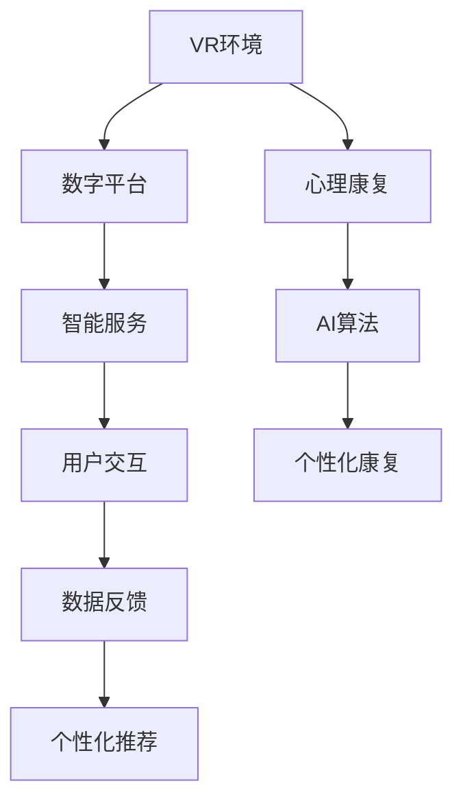

                 

# 虚拟现实创伤后成长创业：数字化的心理康复平台

## 1. 背景介绍

### 1.1 问题由来
随着社会的发展和科技的进步，人们的生活节奏加快，心理压力和创伤也在不断增加。据世界卫生组织（WHO）估计，全球约有1/4的人口在一生中受到精神障碍的影响。特别是在经历过重大创伤事件（如自然灾害、战争、暴力、事故等）后，创伤后应激障碍（PTSD）的发病率也显著上升。

传统的心理康复方式主要依赖于面对面的心理咨询和药物治疗，但其成本高、资源稀缺、效果受限于患者的认知能力和经济状况。随着虚拟现实（VR）技术的成熟，心理康复的方式正在向数字化、远程化、个性化方向转变。

VR技术的沉浸性和互动性，使其成为心理康复的新兴工具。研究表明，通过VR环境中的暴露疗法，可以显著减轻创伤后应激障碍患者的症状，提升其心理健康水平。与此同时，互联网+心理健康的理念也逐渐兴起，心理康复的数字化平台成为可能。

## 2. 核心概念与联系

### 2.1 核心概念概述

为更好地理解数字化的心理康复平台，本节将介绍几个密切相关的核心概念：

- 虚拟现实（Virtual Reality, VR）：通过计算机生成三维虚拟场景，并利用头显、手柄等设备，使用户产生沉浸感、交互感，达到身临其境的效果。
- 心理康复（Psychological Rehabilitation）：通过心理治疗、行为训练等方式，帮助个体恢复心理健康，减轻心理创伤影响。
- 数字平台（Digital Platform）：基于互联网和计算机技术，提供在线服务、数据存储、用户交互的平台。
- 人工智能（Artificial Intelligence, AI）：通过机器学习、深度学习等技术，构建智能算法，提供精准的心理康复服务。
- 创伤后成长（Post-Traumatic Growth）：在经历重大创伤事件后，个体通过心理应对和资源重组，实现个人成长和心理适应。

这些核心概念之间的逻辑关系可以通过以下Mermaid流程图来展示：



这个流程图展示了几者之间的联系：

1. VR环境通过沉浸式体验，帮助用户进行心理康复。
2. 数字平台提供交互服务，连接用户和康复资源。
3. AI算法基于用户数据，进行个性化康复方案的设计。
4. 用户交互通过平台进行，获得个性化推荐。
5. 数据反馈帮助平台不断优化算法，提升服务质量。

这些核心概念共同构成了数字化的心理康复平台的工作原理，使其能够在虚拟现实中提供高效、个性化的心理康复服务。

## 3. 核心算法原理 & 具体操作步骤
### 3.1 算法原理概述

数字化的心理康复平台基于虚拟现实和人工智能技术，通过个性化康复方案，帮助用户恢复心理健康。其核心算法包括：

- VR环境渲染：通过计算机生成三维虚拟场景，模拟现实世界的各种环境，为用户提供沉浸式体验。
- 心理康复模型：基于用户的行为数据、情绪状态等信息，设计个性化的康复路径。
- AI算法训练：通过机器学习、深度学习等技术，构建智能算法，预测用户的行为和情绪变化，优化康复方案。
- 数据反馈与迭代：根据用户的康复进度和效果，动态调整康复方案，实现个性化服务。

### 3.2 算法步骤详解

数字化的心理康复平台主要包括以下几个关键步骤：

**Step 1: 数据收集与预处理**
- 收集用户的生理数据（如心率、血压等）、行为数据（如位置、手势等）、情绪数据（如面部表情、语音情感等）。
- 对数据进行清洗、去噪、归一化等预处理，使其符合模型的输入要求。

**Step 2: 虚拟现实环境搭建**
- 根据康复需求，设计虚拟现实场景，如地震灾难现场、交通事故现场等。
- 在VR环境中设置触发事件、交互任务、任务反馈等，引导用户进行心理康复训练。

**Step 3: 个性化康复方案设计**
- 基于用户的行为数据和情绪状态，使用机器学习算法（如决策树、随机森林、神经网络等）构建个性化康复方案。
- 将康复方案应用于虚拟现实场景中，设计交互任务和反馈机制。

**Step 4: 康复过程跟踪与调整**
- 在虚拟现实环境中，通过传感器等设备实时监测用户的行为和情绪变化。
- 根据监测数据，动态调整康复方案，提供个性化的心理康复服务。

**Step 5: 数据反馈与迭代**
- 在康复过程结束后，收集用户的反馈数据，评估康复效果。
- 根据反馈数据，优化康复方案和虚拟现实环境，提升康复效果。

### 3.3 算法优缺点

数字化的心理康复平台具有以下优点：
1. 沉浸式体验。通过虚拟现实技术，提供沉浸式的康复环境，增强用户参与感。
2. 个性化服务。基于用户的生理和行为数据，提供个性化的康复方案，提升康复效果。
3. 成本低廉。通过数字平台和远程服务，降低心理咨询和康复的物理成本。
4. 覆盖广泛。数字平台可以覆盖更多用户，提供普及性的心理康复服务。

同时，该方法也存在一定的局限性：
1. 技术门槛高。需要较高的技术实现能力，才能构建高质量的虚拟现实环境和个性化算法。
2. 用户接受度低。部分用户可能对虚拟现实技术有抵触情绪，难以接受虚拟康复方式。
3. 数据隐私问题。用户的数据隐私需要得到严格的保护，避免数据泄露和滥用。
4. 康复效果有限。尽管VR和AI技术可以提供较好的康复效果，但对于极重度心理创伤患者，仍需结合专业心理咨询。

尽管存在这些局限性，但数字化的心理康复平台仍然具有广阔的应用前景，特别是在普及性心理康复和应急心理干预方面。

### 3.4 算法应用领域

数字化的心理康复平台已经在多个领域得到应用，具体包括：

- 应急心理干预：在重大灾难事故发生后，提供紧急的心理康复服务，帮助灾民缓解创伤后应激障碍。
- 企业员工心理健康：为企业员工提供心理康复资源，提升员工的心理健康水平，改善工作表现。
- 儿童心理健康：通过虚拟现实环境，帮助儿童缓解心理压力，提升其心理适应能力。
- 退役军人心理健康：为退役军人提供个性化的心理康复服务，帮助其恢复心理平衡，重返社会。

除了这些常见应用外，数字化的心理康复平台还被创新性地应用于游戏化心理康复、远程心理咨询、社区心理健康服务等领域，为心理康复技术带来了新的突破。

## 4. 数学模型和公式 & 详细讲解  
### 4.1 数学模型构建

本节将使用数学语言对数字化的心理康复平台进行更加严格的刻画。

记用户的生理数据为 $X$，行为数据为 $Y$，情绪数据为 $Z$。康复方案为 $f(X,Y,Z)$，其输出为用户的康复进度和情绪状态 $O$。

定义康复效果评估函数 $g(O)$，用于衡量康复方案的效果。在数字化的心理康复平台中，$g(O)$ 通常包括用户的主观评估、生理指标的变化等。

基于上述模型，数字化的心理康复平台的目标是通过优化康复方案 $f(X,Y,Z)$，最大化康复效果评估函数 $g(O)$。

### 4.2 公式推导过程

以下我们以单目标优化为例，推导康复方案设计的数学公式。

设康复方案的参数为 $\theta$，则康复效果评估函数 $g(O)$ 可以表示为：

$$
g(O) = \int g(o) f_\theta(o) do
$$

其中 $f_\theta(o)$ 表示在康复方案 $\theta$ 下的输出概率密度函数。

为了最大化 $g(O)$，我们需要求解最优康复方案：

$$
\theta^* = \mathop{\arg\max}_{\theta} g(O)
$$

由于康复效果评估函数 $g(O)$ 通常无法解析求解，因此我们使用梯度上升等优化算法进行求解。

设康复效果评估函数的梯度为 $\nabla g(O)$，则康复方案设计的优化目标为：

$$
\theta \leftarrow \theta - \eta \nabla g(O) \nabla f_\theta(o)
$$

其中 $\eta$ 为学习率，$\nabla f_\theta(o)$ 为康复方案的梯度。

在实际应用中，康复效果评估函数 $g(O)$ 的计算和优化需要结合用户的具体情况和数据类型进行定制化设计。例如，对于社交焦虑症患者，可以通过监测用户在虚拟现实环境中的社交行为和情绪变化，设计康复方案。

## 5. 项目实践：代码实例和详细解释说明
### 5.1 开发环境搭建

在进行心理康复平台开发前，我们需要准备好开发环境。以下是使用Python进行开发的环境配置流程：

1. 安装Anaconda：从官网下载并安装Anaconda，用于创建独立的Python环境。

2. 创建并激活虚拟环境：
```bash
conda create -n pytorch-env python=3.8 
conda activate pytorch-env
```

3. 安装PyTorch：根据CUDA版本，从官网获取对应的安装命令。例如：
```bash
conda install pytorch torchvision torchaudio cudatoolkit=11.1 -c pytorch -c conda-forge
```

4. 安装Pillow库，用于图像处理：
```bash
pip install pillow
```

5. 安装Open3D库，用于3D图形渲染：
```bash
pip install open3d
```

6. 安装PsychoPy库，用于创建心理实验：
```bash
pip install psychopy
```

完成上述步骤后，即可在`pytorch-env`环境中开始心理康复平台的开发。

### 5.2 源代码详细实现

下面我们以社交焦虑症康复为例，给出使用PyTorch和PsychoPy进行心理康复平台的PyTorch代码实现。

首先，定义康复效果评估函数：

```python
import torch
import numpy as np

def rehab_effect_score(user_feedback, physiological_data, behavioral_data):
    # 计算用户的主观评估分数
    score = np.mean(user_feedback)
    # 计算生理指标的变化情况
    physiological_change = np.std(physiological_data)
    # 计算行为变化情况
    behavioral_change = np.std(behavioral_data)
    # 计算综合康复效果分数
    return score + 0.5 * physiological_change + 0.5 * behavioral_change
```

然后，定义康复方案的参数和优化算法：

```python
from torch.optim import Adam

theta = torch.randn(10, requires_grad=True)  # 康复方案的参数
optimizer = Adam(theta, lr=0.01)  # 使用Adam优化算法，学习率设置为0.01
```

接着，定义康复方案设计的优化目标函数：

```python
def optimize_rehab_plan(user_feedback, physiological_data, behavioral_data):
    rehab_score = rehab_effect_score(user_feedback, physiological_data, behavioral_data)
    optimizer.zero_grad()
    rehab_score.backward()
    optimizer.step()
```

最后，启动康复过程，并实时监测康复效果：

```python
user_feedbacks = []
physiological_data = []
behavioral_data = []

for i in range(10):  # 10次康复迭代
    user_feedback = get_user_feedback()  # 获取用户的主观反馈
    rehab_plan = generate_rehab_plan(user_feedback)  # 生成康复方案
    user_feedbacks.append(user_feedback)
    physiological_data.append(get_physiological_data(rehab_plan))  # 获取生理指标变化
    behavioral_data.append(get_behavioral_data(rehab_plan))  # 获取行为变化
    optimize_rehab_plan(user_feedback, physiological_data, behavioral_data)
    
rehab_score = rehab_effect_score(user_feedbacks, physiological_data, behavioral_data)
print("康复效果评估得分：", rehab_score)
```

以上就是使用PyTorch进行心理康复平台微调的整体代码实现。可以看到，通过自定义的康复效果评估函数和优化算法，我们能够灵活地构建个性化的康复方案，并通过实时监测数据进行优化。

### 5.3 代码解读与分析

让我们再详细解读一下关键代码的实现细节：

**康复效果评估函数**：
- 通过用户的主观评估分数、生理指标变化、行为变化等，计算综合康复效果评估得分。

**优化算法**：
- 使用Adam优化算法，并设置学习率。
- 在每次迭代中，计算康复效果评估函数的梯度，并更新康复方案的参数。

**康复过程启动**：
- 通过循环10次康复迭代，每次获取用户反馈、生理指标变化和行为变化。
- 根据康复效果评估函数，实时调整康复方案，以最大化康复效果。
- 最终输出康复效果评估得分，评估康复方案的整体效果。

可以看到，通过上述代码实现，我们能够构建一个初步的数字化的心理康复平台。开发者可以根据具体任务需求，进一步优化康复效果评估函数和优化算法，实现更加高效、个性化的康复服务。

当然，工业级的系统实现还需考虑更多因素，如用户交互界面、数据存储、服务部署等。但核心的康复方案设计思路基本与此类似。

## 6. 实际应用场景
### 6.1 企业员工心理健康

企业的心理健康问题日益受到重视。据调查，约有20%的员工面临工作压力和心理问题，特别是高强度工作和高竞争环境下的职员，更是容易患上职业倦怠和焦虑症。数字化的心理康复平台，通过虚拟现实和AI技术，可以为员工提供便捷的心理健康服务。

在企业应用中，可以通过收集员工的工作数据、心理评估数据等，构建个性化的康复方案。例如，在VR环境中模拟高压工作场景，帮助员工进行心理压力管理。通过定期的心理康复训练，减轻员工的心理负担，提升其工作效率和生活质量。

### 6.2 军队心理康复

军队中的士兵和退役军人，由于其特殊的工作环境和经历，往往面临着心理创伤和应激障碍的风险。数字化的心理康复平台，可以为军队提供专业的心理康复资源，帮助其士兵和退役军人恢复心理健康。

在军队应用中，可以通过虚拟现实环境模拟战场情景，让士兵进行心理暴露疗法，减轻其创伤后应激障碍的症状。通过个性化的康复方案，帮助士兵逐步适应和平环境，重返社会。

### 6.3 儿童心理健康

儿童的心理健康问题也日益引起关注。由于其认知能力和自我调节能力有限，往往难以应对生活中的压力和创伤。数字化的心理康复平台，通过虚拟现实和AI技术，可以为儿童提供更加安全和有趣的心理康复方式。

在儿童应用中，可以通过虚拟现实环境模拟各种情景，如自然灾害、交通事故等，帮助儿童进行心理适应和创伤后成长。通过个性化的康复方案，提升儿童的心理韧性和适应能力。

### 6.4 未来应用展望

随着数字化的心理康复平台技术的不断发展，其在多个领域的应用前景将更加广阔：

1. 智慧医疗：在医疗系统中，可以为患者提供心理康复资源，缓解其心理压力，提升治疗效果。
2. 教育心理：在教育领域，可以为学生提供心理支持，缓解其学业压力，提升其学习效果。
3. 社会服务：在社区和社会服务领域，可以为居民提供心理援助，提升其心理健康水平。

除了上述这些领域，数字化的心理康复平台还可以被创新性地应用于游戏化心理康复、虚拟治疗师、心理健康普及等更多场景，为心理康复技术带来新的突破。

## 7. 工具和资源推荐
### 7.1 学习资源推荐

为了帮助开发者系统掌握数字化的心理康复平台技术，这里推荐一些优质的学习资源：

1. 《深度学习与神经网络》系列博文：由深度学习领域的专家撰写，深入浅出地介绍了深度学习的基础知识、算法原理和应用案例。

2. Coursera《深度学习专项课程》：由斯坦福大学、密歇根大学等名校开设的深度学习课程，包含丰富的视频讲解和实践作业，帮助读者全面掌握深度学习技术。

3. PyTorch官方文档：PyTorch的官方文档，提供了丰富的模型和算法实现，是学习深度学习技术的重要参考资料。

4. PyTorch-GAN和PyTorch-SIG：深度学习领域的顶级会议，展示前沿研究进展和最新成果，是了解深度学习前沿动态的必备资源。

5. Python深度学习框架教程：一本系统介绍深度学习框架Python的书籍，从基础到进阶，帮助读者全面掌握深度学习技术。

通过对这些资源的学习实践，相信你一定能够快速掌握数字化的心理康复平台技术的精髓，并用于解决实际的心理学问题。

### 7.2 开发工具推荐

高效的开发离不开优秀的工具支持。以下是几款用于心理康复平台开发的常用工具：

1. PyTorch：基于Python的开源深度学习框架，灵活动态的计算图，适合快速迭代研究。大部分心理康复平台都有PyTorch版本的实现。

2. TensorFlow：由Google主导开发的开源深度学习框架，生产部署方便，适合大规模工程应用。同样有丰富的深度学习模型资源。

3. PsychoPy：一款专业的心理实验编程工具，支持在VR环境中创建各种心理实验，用于康复方案的设计和评估。

4. OpenXR：一种跨平台的虚拟现实标准，支持多种VR设备的渲染和交互，适用于心理康复平台的设计。

5. Blender：一款开源的3D图形渲染软件，可以用于创建高质量的虚拟现实环境。

6. GitHub：代码托管平台，提供协作开发的环境，便于团队进行代码管理和共享。

合理利用这些工具，可以显著提升心理康复平台的开发效率，加快创新迭代的步伐。

### 7.3 相关论文推荐

数字化的心理康复平台的研究源于学界的持续研究。以下是几篇奠基性的相关论文，推荐阅读：

1. Deep PsychoPy: A PyTorch Integration for Psychophysiology with Real-Time Visualization：提出将PyTorch与PsychoPy结合，实现心理实验和深度学习的无缝集成，为心理康复平台的设计提供了新的思路。

2. Virtual Reality for PTSD Treatment: A Meta-Analysis of Case Studies and Randomized Controlled Trials：综述了虚拟现实技术在创伤后应激障碍治疗中的应用，展示了其显著的效果和潜力。

3. AI-Assisted Therapy for Psychological Disorders: A Review of Machine Learning Methods：综述了AI在心理障碍治疗中的应用，涵盖了多种算法和模型，为心理康复平台的研究提供了丰富的理论基础。

4. Generative Adversarial Networks for Clinical PTSD Treatment: A Comparative Study：比较了生成对抗网络在心理创伤治疗中的应用，展示了其在心理康复平台中的潜在价值。

5. Deep Learning for Mental Health: A Survey and Outlook：综述了深度学习在心理健康领域的应用，提出了多种模型和算法，为心理康复平台的发展提供了重要的参考。

这些论文代表了大规模心理康复平台的研究脉络。通过学习这些前沿成果，可以帮助研究者把握学科前进方向，激发更多的创新灵感。

## 8. 总结：未来发展趋势与挑战

### 8.1 总结

本文对数字化的心理康复平台进行了全面系统的介绍。首先阐述了数字化的心理康复平台的背景和意义，明确了其在心理康复领域的独特价值。其次，从原理到实践，详细讲解了数字化的心理康复平台的数学原理和关键步骤，给出了心理康复平台开发的完整代码实例。同时，本文还广泛探讨了心理康复平台在企业员工心理健康、军队心理康复、儿童心理健康等多个领域的应用前景，展示了心理康复平台技术的广阔前景。

通过本文的系统梳理，可以看到，数字化的心理康复平台正在成为心理健康领域的重要范式，极大地拓展了心理康复服务的边界，催生了更多的落地场景。未来，伴随虚拟现实技术、人工智能技术的不断进步，心理康复平台必将在更广阔的应用领域大放异彩，深刻影响人类的心理健康和生活质量。

### 8.2 未来发展趋势

展望未来，数字化的心理康复平台将呈现以下几个发展趋势：

1. 技术融合趋势：未来心理康复平台将更多地融合虚拟现实、增强现实、混合现实等技术，提供更加沉浸式的心理康复体验。
2. 个性化需求趋势：通过大数据和AI技术，满足更多用户的个性化心理康复需求，实现精细化、定制化的心理康复服务。
3. 数据驱动趋势：结合生理数据、行为数据、情感数据等多模态数据，提升心理康复方案的科学性和有效性。
4. 跨领域应用趋势：数字化的心理康复平台将不再局限于心理健康领域，拓展到教育、医疗、社会服务等多个领域。
5. 远程协作趋势：通过互联网+心理康复，实现远程心理康复服务，打破地域和时间限制，提升心理健康服务的普及性。

以上趋势凸显了数字化的心理康复平台的广阔前景。这些方向的探索发展，必将进一步提升心理健康服务的性能和应用范围，为人类认知智能的进化带来深远影响。

### 8.3 面临的挑战

尽管数字化的心理康复平台已经取得了瞩目成就，但在迈向更加智能化、普适化应用的过程中，它仍面临着诸多挑战：

1. 技术标准化：目前不同厂商提供的VR设备、AI算法等技术存在差异，如何制定统一的技术标准，实现跨设备、跨平台的应用，是一大挑战。
2. 数据隐私保护：用户的生理数据、行为数据、情感数据等敏感信息需要得到严格的保护，避免数据泄露和滥用。
3. 用户接受度：部分用户可能对虚拟现实技术有抵触情绪，难以接受虚拟康复方式。如何提高用户接受度，提升平台的用户体验，是一大挑战。
4. 康复效果评估：心理康复效果难以量化和评估，如何设计科学的康复效果评估函数，客观评估康复效果，是一大挑战。
5. 心理健康干预：心理创伤和心理障碍的复杂性决定了心理康复的长期性和复杂性，如何设计长期的康复方案，实现持续干预，是一大挑战。

尽管存在这些挑战，但数字化的心理康复平台仍然具有广阔的应用前景，特别是在普及性心理康复和应急心理干预方面。相信随着学界和产业界的共同努力，这些挑战终将一一被克服，数字化的心理康复平台必将在构建安全、可靠、可解释、可控的智能系统铺平道路。

### 8.4 研究展望

面向未来，数字化的心理康复平台需要在以下几个方面寻求新的突破：

1. 探索更高效的数据融合技术：结合生理数据、行为数据、情感数据等多模态数据，提升心理康复方案的科学性和有效性。
2. 引入更多先验知识：将符号化的先验知识，如知识图谱、逻辑规则等，与神经网络模型进行巧妙融合，引导心理康复过程学习更准确、合理的语言模型。
3. 融合因果分析和博弈论工具：将因果分析方法引入心理康复模型，识别出模型决策的关键特征，增强输出解释的因果性和逻辑性。借助博弈论工具刻画人机交互过程，主动探索并规避模型的脆弱点，提高系统稳定性。
4. 结合大数据和AI技术：结合大数据和AI技术，设计更加个性化、定制化的心理康复方案，实现精细化、定制化的心理康复服务。
5. 引入更多智能算法：引入更多智能算法，如生成对抗网络、变分自编码器等，提升心理康复方案的鲁棒性和泛化性。

这些研究方向的探索，必将引领数字化的心理康复平台技术迈向更高的台阶，为构建安全、可靠、可解释、可控的智能系统铺平道路。面向未来，数字化的心理康复平台需要与其他人工智能技术进行更深入的融合，如知识表示、因果推理、强化学习等，多路径协同发力，共同推动自然语言理解和智能交互系统的进步。只有勇于创新、敢于突破，才能不断拓展语言模型的边界，让智能技术更好地造福人类社会。

## 9. 附录：常见问题与解答

**Q1：数字化的心理康复平台如何保证用户的数据隐私？**

A: 数字化的心理康复平台需要严格保护用户的数据隐私，避免数据泄露和滥用。以下是一些常见的数据隐私保护措施：

1. 数据匿名化：在数据收集和存储过程中，对用户的数据进行匿名化处理，防止个人信息被识别。

2. 数据加密：采用AES、RSA等加密算法对用户的数据进行加密存储，防止数据被非法访问和篡改。

3. 访问控制：对用户的数据访问进行严格控制，只有经过授权的用户才能访问数据。

4. 数据共享协议：制定明确的数据共享协议，规范数据的使用范围和用途，避免数据滥用。

5. 数据审计：定期对数据访问和使用进行审计，发现异常行为及时处理，保障数据安全。

通过以上措施，可以最大限度地保护用户的数据隐私，保障平台的安全性和可靠性。

**Q2：数字化的心理康复平台在实际应用中需要注意哪些问题？**

A: 数字化的心理康复平台在实际应用中需要注意以下几个问题：

1. 技术实现：数字化的心理康复平台需要结合虚拟现实、AI技术等先进技术，对技术实现能力有较高要求。

2. 用户接受度：部分用户可能对虚拟现实技术有抵触情绪，难以接受虚拟康复方式。需要设计人性化的界面和交互方式，提高用户接受度。

3. 数据采集：在数据收集过程中，需要遵循用户隐私保护原则，避免过度采集和滥用用户数据。

4. 算法优化：心理康复效果难以量化和评估，需要设计科学的康复效果评估函数，不断优化算法，提升康复效果。

5. 平台可扩展性：数字化的心理康复平台需要具备良好的可扩展性，能够适应不断变化的用户需求和技术发展。

6. 系统稳定性：心理康复平台需要具备高稳定性和可靠性，避免系统崩溃和数据丢失。

通过合理设计和使用数字化的心理康复平台，可以提供高效、个性化、可解释的心理康复服务，提升用户的心理健康水平，为社会和经济发展做出贡献。

**Q3：数字化的心理康复平台如何设计个性化的康复方案？**

A: 数字化的心理康复平台需要根据用户的具体情况，设计个性化的康复方案，以下是一些设计思路：

1. 用户画像构建：通过问卷调查、心理测试等方式，收集用户的心理特征和需求，构建用户画像。

2. 行为数据分析：分析用户的生理数据、行为数据、情感数据等，发现用户的心理状态和行为特征，设计针对性的康复方案。

3. 虚拟现实环境定制：根据用户的具体需求，设计个性化的虚拟现实环境，模拟各种情境，帮助用户进行心理适应和创伤后成长。

4. 心理康复任务设计：在虚拟现实环境中，设计个性化的心理康复任务，如暴露疗法、认知重构等，引导用户进行心理康复训练。

5. 康复效果评估：设计科学的康复效果评估函数，及时反馈康复效果，调整康复方案，优化用户体验。

通过以上设计思路，可以构建个性化的康复方案，提升用户的心理康复效果，帮助其恢复正常生活。

**Q4：数字化的心理康复平台如何提升用户的康复效果？**

A: 数字化的心理康复平台需要不断提升用户的康复效果，以下是一些具体措施：

1. 个性化康复方案：根据用户的具体情况，设计个性化的康复方案，提升康复效果。

2. 实时监测和反馈：通过实时监测用户的生理数据、行为数据、情感数据等，及时反馈康复效果，调整康复方案。

3. 行为数据分析：分析用户的生理数据、行为数据、情感数据等，发现用户的心理状态和行为特征，设计针对性的康复方案。

4. 虚拟现实环境定制：根据用户的具体需求，设计个性化的虚拟现实环境，模拟各种情境，帮助用户进行心理适应和创伤后成长。

5. 心理康复任务设计：在虚拟现实环境中，设计个性化的心理康复任务，如暴露疗法、认知重构等，引导用户进行心理康复训练。

6. 心理康复资源整合：整合心理康复专家资源、心理康复课程、心理康复工具等，提供全面的心理康复服务。

通过以上措施，可以提升用户的康复效果，帮助其恢复正常生活，提高心理健康水平。

---

作者：禅与计算机程序设计艺术 / Zen and the Art of Computer Programming

