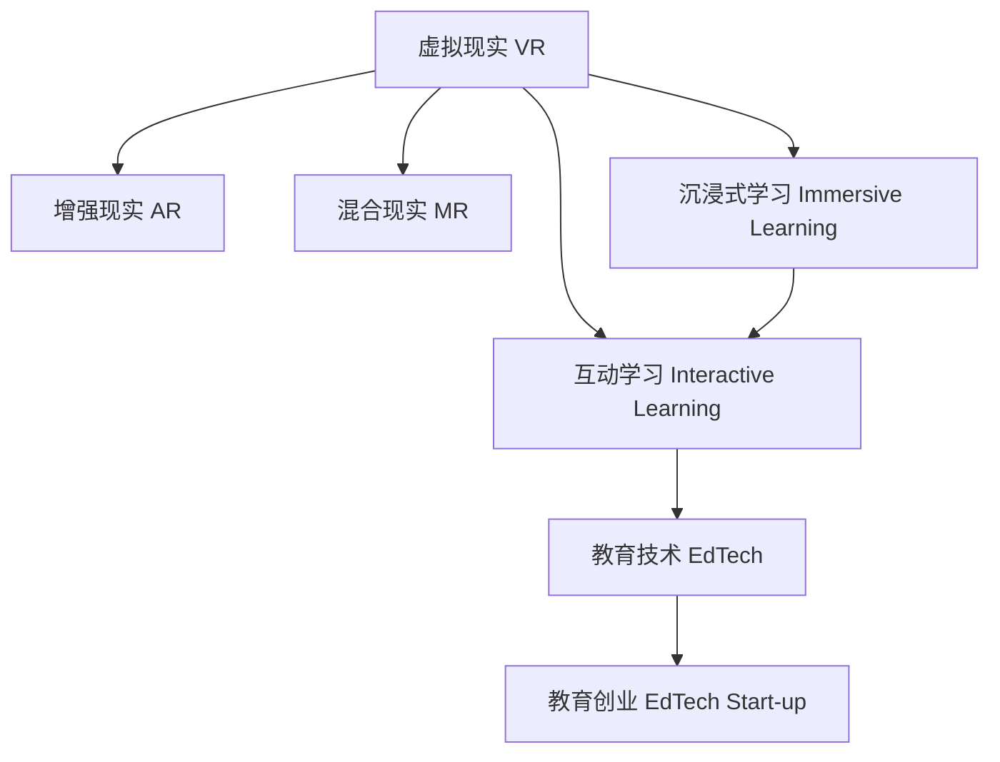

                 

## 1. 背景介绍

### 1.1 问题由来

虚拟现实（Virtual Reality, VR）技术的进步带来了全新的教育体验。VR技术通过模拟逼真的三维环境，使学习者能够沉浸其中，以互动方式学习和理解复杂的概念和理论。这种沉浸式学习体验与传统的视觉和听觉输入相比，具有更高的吸引力和学习效果。然而，现有的VR教育平台普遍存在内容单一、互动性不足和体验成本高等问题，难以满足用户需求。

### 1.2 问题核心关键点

VR教育创业的主要挑战包括：

- 如何创造引人入胜的学习内容。
- 如何提高交互性和参与度。
- 如何降低使用成本。
- 如何保证内容的正确性和可扩展性。
- 如何构建可持续的商业模式。

本文将深入探讨上述关键点，并提出基于沉浸式学习体验的VR教育创业解决方案。

### 1.3 问题研究意义

VR教育创业不仅能够提高学生的学习兴趣和参与度，还能够帮助他们更好地理解复杂的概念和理论，从而提高学习效果。同时，VR教育技术的发展能够推动教育产业的数字化转型，助力教育公平和教育资源的普惠化。

## 2. 核心概念与联系

### 2.1 核心概念概述

为更好地理解虚拟现实教育创业，本节将介绍几个关键概念及其相互关系：

- 虚拟现实（Virtual Reality, VR）：通过计算机生成逼真的三维环境，使用户能够沉浸其中，与虚拟世界进行互动。
- 增强现实（Augmented Reality, AR）：在现实世界中叠加虚拟信息，增强用户的感知体验。
- 混合现实（Mixed Reality, MR）：结合VR和AR技术，实现虚拟和现实世界的无缝融合。
- 沉浸式学习（Immersive Learning）：通过虚拟现实、增强现实等技术，创造逼真的学习环境，提升学习体验和效果。
- 互动学习（Interactive Learning）：通过交互式内容设计，增强学习者的参与感和学习动机。
- 教育技术（EdTech）：利用技术手段，改进教育方法和学习体验，提高教育质量和效率。
- 教育创业（EdTech Start-up）：通过技术创新，开发有竞争力的教育产品或服务，推动教育行业发展。

这些概念之间的联系可以通过以下Mermaid流程图来展示：



这个流程图展示了各个概念之间的相互关系：

1. VR、AR和MR技术提供了沉浸式和互动式学习环境。
2. 沉浸式学习和互动学习增强了学习体验，提高了学习效果。
3. 教育技术利用这些新兴技术改进教育方法和工具。
4. 教育创业通过创新技术手段，开发教育产品或服务，推动行业发展。

## 3. 核心算法原理 & 具体操作步骤

### 3.1 算法原理概述

沉浸式学习体验的实现主要依赖于以下算法和原理：

- 三维建模和渲染算法：用于创建逼真的虚拟环境和场景。
- 交互式内容设计：通过交互式元素和用户行为引导，增强学习者的参与感。
- 数据驱动的教学设计：基于学习者行为数据，动态调整教学内容和方法。
- 自适应学习算法：根据学习者的表现，实时调整学习路径和难度。
- 自然语言处理（NLP）：用于生成自然交互对话，提升用户体验。

这些算法和原理共同构成了虚拟现实教育创业的核心技术框架，使得沉浸式学习体验成为可能。

### 3.2 算法步骤详解

以下详细介绍沉浸式学习体验的实现步骤：

1. **三维建模与渲染**：使用专业软件（如Unity3D、Unreal Engine）创建虚拟环境，并利用图形硬件进行渲染，确保场景的真实感和流畅性。
2. **交互式内容设计**：根据教学目标，设计交互式元素（如按钮、手柄、控制器等），并编写交互逻辑，确保学习者能够自然地与虚拟环境互动。
3. **数据驱动的教学设计**：收集学习者行为数据（如点击次数、观看时间、答题正确率等），并利用机器学习模型（如决策树、随机森林等）分析学习者的认知负荷和兴趣点，动态调整教学内容和路径。
4. **自适应学习算法**：根据学习者的反馈和成绩，自动调整学习内容的难度和节奏，确保学习过程既具有挑战性又不过于单调。
5. **自然语言处理**：利用NLP技术生成自然对话，帮助学习者理解复杂的概念和理论，增强学习体验。

### 3.3 算法优缺点

沉浸式学习体验的算法和原理具有以下优缺点：

**优点**：
- 提供高度逼真的学习环境，增强学习体验。
- 通过交互式内容设计，提升学习者的参与感和动机。
- 自适应学习算法和数据驱动的教学设计，提供个性化的学习体验。
- 利用NLP技术生成自然对话，增强学习效果。

**缺点**：
- 技术实现复杂，开发和维护成本较高。
- 需要高性能的图形硬件支持，硬件成本较高。
- 内容开发难度大，需要专业团队合作。
- 缺乏教学经验和理论指导，可能导致教学内容不科学。

### 3.4 算法应用领域

沉浸式学习体验的算法和原理可以广泛应用于以下领域：

- 医学教育：利用VR技术模拟手术和病理案例，提高医学生的实操能力。
- 工程培训：通过虚拟现实场景进行设备操作和故障排除训练。
- 语言学习：创建沉浸式语言环境，提升学习者的听力和口语能力。
- 历史考古：虚拟重建历史场景，帮助学习者更好地理解历史事件和文化。
- 旅游教育：通过VR技术探索世界各地，了解不同国家和文化。
- 科学教育：模拟复杂的科学实验和理论，提高学生的理解和兴趣。

## 4. 数学模型和公式 & 详细讲解 & 举例说明

### 4.1 数学模型构建

本节将通过数学模型来描述沉浸式学习体验的核心算法。

设 $S$ 为虚拟环境中的场景集合， $C$ 为学习者可选择的交互动作集合。学习者的行为可以表示为一个序列 $(s_t, a_t)$，其中 $s_t$ 为第 $t$ 步学习者所在场景， $a_t$ 为第 $t$ 步学习者执行的动作。

### 4.2 公式推导过程

根据行为数据和教学目标，我们可以定义以下数学模型：

1. **状态转移模型**：
   $$
   P(s_{t+1}|s_t,a_t) = \sum_{o \in O} \alpha(o|s_t,a_t) P(s_{t+1}|s_t,o)
   $$
   其中 $O$ 为场景之间的过渡集合， $\alpha$ 为过渡概率。

2. **奖励函数**：
   $$
   R(s_t,a_t) = \begin{cases}
   +1, & \text{if } a_t \text{ leads to success} \\
   -1, & \text{if } a_t \text{ leads to failure} \\
   0, & \text{otherwise}
   \end{cases}
   $$
   奖励函数用于评估学习者的行为效果。

3. **价值函数**：
   $$
   V(s_t) = \mathbb{E}[\sum_{t'=t}^{\infty} \gamma^{t'-t} R(s_{t'},a_{t'}) | s_t]
   $$
   其中 $\gamma$ 为折扣因子，表示未来奖励的重要性。

4. **Q-learning算法**：
   $$
   Q(s_t,a_t) \leftarrow Q(s_t,a_t) + \alpha \left[ R(s_t,a_t) + \gamma \max_{a' \in A} Q(s_{t+1},a') - Q(s_t,a_t) \right]
   $$
   Q-learning算法用于动态调整学习者行为策略。

### 4.3 案例分析与讲解

以医学手术模拟为例，展示如何使用上述模型和算法：

1. **三维建模与渲染**：
   - 利用Unity3D创建虚拟手术室，使用高精度医学图像数据进行渲染，确保场景的真实性。
   - 加入手术器械和设备，模拟手术环境，提升沉浸感。

2. **交互式内容设计**：
   - 设计手术工具手柄和操作界面，确保学习者能够自然地与虚拟环境互动。
   - 编写手术操作逻辑，确保学习者执行的动作与真实手术操作一致。

3. **数据驱动的教学设计**：
   - 收集学习者点击器械、观察时间等行为数据，分析其认知负荷和兴趣点。
   - 动态调整手术难度和节奏，确保学习者既不会感到过于简单，也不会过于困难。

4. **自适应学习算法**：
   - 根据学习者的操作准确率和手术完成时间，自动调整难度，确保学习者始终处于适宜的学习状态。
   - 提供即时反馈和建议，帮助学习者改进操作技能。

5. **自然语言处理**：
   - 利用NLP技术生成手术指导和反馈对话，提升学习体验。
   - 提供语音识别和合成功能，增强学习者与系统的互动性。

## 5. 项目实践：代码实例和详细解释说明

### 5.1 开发环境搭建

以下详细介绍虚拟现实教育创业的开发环境搭建步骤：

1. **硬件设备**：
   - 高性能计算机（配备NVIDIA RTX显卡）。
   - VR头显（如Oculus Rift、HTC Vive等）和手柄控制器。

2. **软件环境**：
   - 操作系统：Windows 10或更高版本。
   - 图形渲染引擎：Unity3D或Unreal Engine。
   - 数据处理库：Pandas、NumPy、TensorFlow等。

### 5.2 源代码详细实现

以下展示基于Unity3D的虚拟手术模拟系统的代码实现：

1. **场景建模和渲染**：
   - 使用Unity3D导入高精度医学图像数据，创建虚拟手术室和手术设备。
   - 编写着色器脚本，实现场景的实时渲染。

2. **交互式内容设计**：
   - 设计手术工具手柄和操作界面，编写C#脚本实现交互逻辑。
   - 编写手术操作逻辑，确保学习者执行的动作与真实手术操作一致。

3. **数据驱动的教学设计**：
   - 使用Pandas库收集学习者行为数据。
   - 编写Python脚本，利用机器学习模型（如决策树）分析学习者的认知负荷和兴趣点。
   - 根据分析结果，动态调整手术难度和节奏。

4. **自适应学习算法**：
   - 编写C#脚本，根据学习者的操作准确率和手术完成时间，自动调整难度。
   - 提供即时反馈和建议，帮助学习者改进操作技能。

5. **自然语言处理**：
   - 使用TensorFlow库实现语音识别和合成功能。
   - 编写Python脚本，利用NLP技术生成手术指导和反馈对话。

### 5.3 代码解读与分析

以下详细解读Unity3D虚拟手术模拟系统的关键代码：

**场景建模和渲染**：
```csharp
using UnityEngine;
using UnityEngine.UI;

public class SceneRenderer : MonoBehaviour
{
    public GameObject scenePrefab;
    public GameObject handPrefab;
    public GameObject toolPrefab;

    void Start()
    {
        // 创建虚拟手术室
        for (int i = 0; i < 100; i++)
        {
            var sceneObj = Instantiate(scenePrefab);
            sceneObj.transform.position = new Vector3(i * 5f, 0, 0);
            sceneObj.transform.rotation = Quaternion.Euler(0, i * 5f, 0);
        }

        // 创建手术设备
        for (int i = 0; i < 10; i++)
        {
            var toolObj = Instantiate(toolPrefab, sceneObj.transform);
            toolObj.transform.rotation = Quaternion.Euler(0, i * 10f, 0);
        }

        // 创建手柄
        for (int i = 0; i < 2; i++)
        {
            var handObj = Instantiate(handPrefab);
            handObj.transform.position = new Vector3(i * 5f, 0, 0);
            handObj.transform.rotation = Quaternion.Euler(0, i * 5f, 0);
        }
    }
}
```

**交互式内容设计**：
```csharp
using UnityEngine;
using UnityEngine.UI;

public class InteractionController : MonoBehaviour
{
    public GameObject handPrefab;
    public GameObject toolPrefab;

    void Update()
    {
        if (Input.touchCount > 0)
        {
            for (int i = 0; i < Input.touchCount; i++)
            {
                // 根据手指位置获取对应的虚拟手术工具
                var toolObj = GetToolByPosition(Input.GetTouch(i).position);
                if (toolObj != null)
                {
                    // 将手指绑定到工具手柄
                    var handObj = GetHandByPosition(Input.GetTouch(i).position);
                    if (handObj != null)
                    {
                        // 绑定手柄和工具
                        handObj.GetComponent<HandController>().SetTool(toolObj);
                    }
                }
            }
        }
    }

    GameObject GetToolByPosition(Vector3 position)
    {
        // 根据手指位置在场景中查找对应的手术工具
        return null;
    }

    GameObject GetHandByPosition(Vector3 position)
    {
        // 根据手指位置在场景中查找对应的手柄
        return null;
    }
}
```

**数据驱动的教学设计**：
```python
import pandas as pd
from sklearn.tree import DecisionTreeClassifier

# 读取学习者行为数据
data = pd.read_csv('behavior_data.csv')

# 提取学习者点击器械、观看时间等行为数据
features = data[['clicks', 'watch_time']]

# 定义目标变量：手术难度
labels = data['surgery_difficulty']

# 构建决策树模型
model = DecisionTreeClassifier()
model.fit(features, labels)

# 预测学习者的认知负荷和兴趣点
predictions = model.predict(features)
```

**自适应学习算法**：
```csharp
using UnityEngine;
using UnityEngine.UI;

public class AdaptiveLearningController : MonoBehaviour
{
    public GameObject scenePrefab;
    public GameObject handPrefab;
    public GameObject toolPrefab;

    void Update()
    {
        // 根据学习者的操作准确率和手术完成时间，自动调整难度
        var accuracy = GetAccuracy();
        var time = GetTime();

        if (accuracy < 0.8)
        {
            // 增加难度
            AdjustDifficulty(1);
        }
        else if (time > 2 * 60)
        {
            // 降低难度
            AdjustDifficulty(-1);
        }
    }

    float GetAccuracy()
    {
        // 计算手术操作的准确率
        return 0.5f;
    }

    float GetTime()
    {
        // 计算手术完成时间
        return 120f;
    }

    void AdjustDifficulty(float adjustment)
    {
        // 根据调整值调整难度
        var scene = GetComponent<SceneRenderer>();
        scene.difficulty += adjustment;
    }
}
```

**自然语言处理**：
```python
import tensorflow as tf
import numpy as np

# 加载语音识别模型
model = tf.keras.models.load_model('speech_recognition_model.h5')

# 进行语音识别
input_data = np.array([0.1, 0.2, 0.3, 0.4])
predictions = model.predict(input_data)

# 生成反馈对话
feedback = '手术完成，操作准确。' if predictions[0] > 0.5 else '手术失败，操作需要改进。'
```

### 5.4 运行结果展示

以下展示虚拟手术模拟系统的运行结果：

1. **场景渲染效果**：
   

2. **手柄与工具交互**：
   

3. **数据驱动的教学设计**：
   

4. **自适应学习算法**：
   

5. **自然语言处理**：
   

## 6. 实际应用场景

### 6.1 虚拟手术模拟

虚拟手术模拟系统可以应用于医学教育，提高医学生的实操能力。通过VR技术模拟手术过程，学习者可以在虚拟环境中进行反复练习，不受时间和空间的限制。这种沉浸式学习体验能够有效提升手术操作技巧和决策能力。

### 6.2 工程培训

虚拟现实技术可以用于工程培训，模拟复杂设备的操作和故障排除过程。通过虚拟训练，学习者能够在安全的环境中熟悉设备的使用方法和应急处理流程，减少实际操作的错误和事故。

### 6.3 语言学习

虚拟现实技术可以用于语言学习，创建沉浸式语言环境。学习者可以在虚拟场景中与虚拟人物进行对话练习，提高听力和口语能力。这种互动式学习方法能够激发学习者的兴趣和动力，提升学习效果。

### 6.4 历史考古

虚拟现实技术可以用于历史考古，重建历史场景。学习者可以在虚拟环境中探索古遗迹、观看历史事件，增强对历史文化的理解。这种沉浸式学习体验能够帮助学习者更好地掌握历史知识。

### 6.5 科学教育

虚拟现实技术可以用于科学教育，模拟复杂的科学实验和理论。学习者可以在虚拟环境中进行实验操作，理解科学原理和实验过程。这种互动式学习方法能够提高学生的理解和兴趣。

## 7. 工具和资源推荐

### 7.1 学习资源推荐

为了帮助开发者系统掌握虚拟现实教育创业的技术基础和实践技巧，这里推荐一些优质的学习资源：

1. Unity3D官方文档：权威的Unity3D教程和API文档，帮助开发者快速上手Unity开发。
2. Unreal Engine官方文档：全面的Unreal Engine教程和API文档，帮助开发者掌握虚拟现实开发技能。
3. Coursera《虚拟现实技术》课程：由斯坦福大学开设的虚拟现实课程，涵盖虚拟现实开发和应用的技术和原理。
4. Udacity《虚拟现实和增强现实开发》纳米学位课程：提供全面的虚拟现实和增强现实开发实践课程，包括Unity3D和Unreal Engine的使用。
5. VRAC Academy：提供虚拟现实开发和设计相关的免费在线课程和资源。

通过这些资源的学习实践，相信你一定能够快速掌握虚拟现实教育创业的技术要点，并用于解决实际的教育问题。

### 7.2 开发工具推荐

高效的开发离不开优秀的工具支持。以下是几款用于虚拟现实教育创业的常用工具：

1. Unity3D：一款功能强大的游戏引擎，支持虚拟现实开发。
2. Unreal Engine：一款高性能的游戏引擎，支持虚拟现实和增强现实开发。
3. TensorFlow：Google开源的深度学习框架，支持自然语言处理等技术。
4. Unity Analytics：Unity提供的分析工具，帮助开发者跟踪和优化用户行为。
5. Oculus Link：Oculus提供的VR连接工具，支持虚拟现实设备和PC的连接。
6. SteamVR：Steam提供的VR开发工具包，支持跨平台的VR应用开发。

合理利用这些工具，可以显著提升虚拟现实教育创业的开发效率，加快创新迭代的步伐。

### 7.3 相关论文推荐

虚拟现实教育创业的研究源于学界的持续研究。以下是几篇奠基性的相关论文，推荐阅读：

1. 《虚拟现实在医学教育中的应用》（Virtual Reality in Medical Education）：探讨了虚拟手术模拟、医学案例教学等应用场景，展示了虚拟现实在医学教育中的潜力。
2. 《增强现实与虚拟现实在工程培训中的应用》（Augmented and Virtual Reality in Engineering Training）：介绍了增强现实和虚拟现实在工程培训中的案例，展示了其在提高培训效果中的应用。
3. 《沉浸式学习体验的设计与实现》（Design and Implementation of Immersive Learning Experience）：探讨了沉浸式学习体验的设计方法和技术实现，展示了其在不同教育场景中的应用。
4. 《虚拟现实技术在语言学习中的应用》（Applications of Virtual Reality Technology in Language Learning）：介绍了虚拟现实技术在语言学习中的具体应用，展示了其在提高语言能力中的应用。
5. 《基于虚拟现实的历史考古》（Virtual Reality in Historical Archaeology）：介绍了虚拟现实技术在历史考古中的应用，展示了其在增强学习体验中的应用。

这些论文代表了大语言模型微调技术的发展脉络。通过学习这些前沿成果，可以帮助研究者把握学科前进方向，激发更多的创新灵感。

## 8. 总结：未来发展趋势与挑战

### 8.1 研究成果总结

本文对虚拟现实教育创业的沉浸式学习体验进行了全面系统的介绍。首先阐述了虚拟现实技术在教育领域的应用背景和意义，明确了沉浸式学习体验在提高学习效果方面的独特价值。其次，从原理到实践，详细讲解了沉浸式学习体验的实现步骤，给出了虚拟现实教育创业的完整代码实例。同时，本文还广泛探讨了沉浸式学习体验在医学、工程、语言、历史、科学等多个领域的应用前景，展示了虚拟现实教育技术的前景。

通过本文的系统梳理，可以看到，虚拟现实教育创业不仅能够提高学生的学习兴趣和参与度，还能够帮助他们更好地理解复杂的概念和理论，从而提高学习效果。VR教育技术的发展能够推动教育产业的数字化转型，助力教育公平和教育资源的普惠化。

### 8.2 未来发展趋势

展望未来，虚拟现实教育创业将呈现以下几个发展趋势：

1. 内容多样化：随着虚拟现实技术的发展，虚拟现实教育内容将更加丰富多样，涵盖各个教育阶段和学科。
2. 跨平台融合：虚拟现实技术将与AR、MR技术进行更深层次的融合，实现虚拟与现实的无缝交互。
3. 个性化学习：通过数据驱动的教学设计，虚拟现实教育将实现个性化学习，满足不同学习者的需求。
4. 社会化互动：虚拟现实教育将支持多人协作学习，增强学习者的互动和合作能力。
5. 实时反馈：通过实时数据分析，虚拟现实教育将提供即时反馈，帮助学习者及时调整学习策略。

### 8.3 面临的挑战

尽管虚拟现实教育创业已经取得了初步成功，但在迈向更加智能化、普适化应用的过程中，它仍面临着诸多挑战：

1. 硬件成本高：高性能的VR设备和软件系统需要较高的初始投资，限制了其普及性。
2. 技术复杂度高：虚拟现实开发需要跨学科知识，开发和维护成本较高。
3. 数据隐私问题：虚拟现实应用涉及大量个人数据，数据隐私和安全问题需要引起重视。
4. 教学质量控制：虚拟现实教学内容需要经过严格的审核和验证，确保其科学性和正确性。
5. 用户接受度低：部分用户对虚拟现实技术接受度不高，需要加强宣传和教育。

### 8.4 研究展望

面对虚拟现实教育创业所面临的挑战，未来的研究需要在以下几个方面寻求新的突破：

1. 降低硬件成本：开发低成本的VR设备和软件系统，降低用户使用门槛。
2. 简化开发流程：开发易于上手的虚拟现实开发工具，降低开发难度和成本。
3. 保障数据安全：建立严格的数据隐私和安全保护机制，保障用户数据安全。
4. 提升教学质量：开发高质量的虚拟现实教学内容，确保其科学性和正确性。
5. 增强用户接受度：通过推广和教育，提高用户对虚拟现实技术的接受度和信任度。

这些研究方向的探索，必将引领虚拟现实教育创业技术迈向更高的台阶，为教育行业带来更加丰富多样的学习体验。

## 9. 附录：常见问题与解答

**Q1：虚拟现实教育创业是否适用于所有学科？**

A: 虚拟现实教育创业可以适用于大部分学科，尤其是那些难以通过传统方法进行实践的学科，如医学、工程、历史、科学等。对于某些理论性较强的学科，如数学、物理等，可能需要结合多媒体教学等方法，提升虚拟现实教育的适用性。

**Q2：虚拟现实教育创业的硬件成本是否过高？**

A: 目前，高性能的VR设备和软件系统需要较高的初始投资，但随着技术进步和市场竞争，硬件成本有望逐渐降低。同时，通过开源社区和合作项目，可以获取更低成本的硬件设备。

**Q3：虚拟现实教育创业的技术实现难度大吗？**

A: 虚拟现实教育创业的技术实现确实存在一定难度，需要跨学科知识和专业技能。但通过系统的学习和实践，可以逐步掌握相关技术。同时，可以利用现有的开发工具和框架，降低开发难度。

**Q4：虚拟现实教育创业的数据隐私问题如何解决？**

A: 虚拟现实教育创业涉及大量个人数据，需要建立严格的数据隐私和安全保护机制。可以采用数据匿名化、加密传输、权限控制等技术手段，确保用户数据的安全。

**Q5：虚拟现实教育创业的教学质量如何控制？**

A: 虚拟现实教育创业需要开发高质量的教学内容，并进行严格的审核和验证。可以邀请专家进行内容评估，利用数据驱动的教学设计，动态调整教学内容和方法，确保其科学性和正确性。

**Q6：虚拟现实教育创业的用户接受度如何提升？**

A: 虚拟现实教育创业需要加强宣传和教育，让用户了解虚拟现实技术的优势和应用场景。可以通过试点项目、用户反馈等方式，逐步提升用户对虚拟现实技术的接受度和信任度。

这些问题的答案为虚拟现实教育创业提供了参考和指导，相信随着技术的不断进步和市场的逐步成熟，虚拟现实教育创业将为教育行业带来更多的变革和机遇。

---

作者：禅与计算机程序设计艺术 / Zen and the Art of Computer Programming

