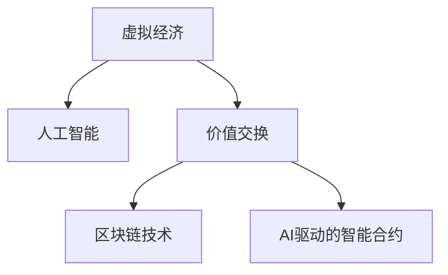

                 

# 虚拟经济：AI驱动的新型价值交换

## 1. 背景介绍

### 1.1 问题由来
在数字经济迅猛发展的今天，虚拟经济作为经济活动的一个重要组成部分，正在成为推动全球经济增长的关键力量。传统经济活动逐渐被虚拟经济所替代，数字化转型成为企业的重要战略。人工智能（AI）作为虚拟经济的核心驱动力，正在重新定义价值交换的方式和模式。

虚拟经济不仅包括互联网、电子商务、数字货币等虚拟形态，还包括基于AI技术的各类新兴产业，如智能制造、医疗健康、金融科技等。这些领域中，AI技术的应用使得虚拟经济的规模和复杂性日益增加，同时也带来了新的挑战和机遇。

### 1.2 问题核心关键点
虚拟经济中，AI驱动的价值交换主要体现在以下几个方面：

- **数据驱动决策**：AI通过对海量数据的分析和处理，可以为企业提供更精准的市场预测、需求分析和个性化服务。
- **自动化流程**：AI技术能够自动完成大量繁琐的重复性工作，如自动化财务报表生成、供应链优化等，大大提升了生产效率和运营效率。
- **智能交互**：AI技术使得虚拟经济中的各种交互形式更加智能化，如智能客服、虚拟助手、智能投顾等，提升了用户体验和服务质量。
- **预测分析**：AI技术在金融领域的应用，如风险预测、信用评估、投资策略优化等，为金融市场带来了新的机遇和挑战。

这些AI技术的应用，使得虚拟经济的价值交换模式发生了根本性的改变，同时也对传统的经济理论提出了新的挑战。本文将从理论到实践，深入探讨AI驱动下的虚拟经济价值交换模式，为AI技术在虚拟经济中的应用提供一些思考和见解。

## 2. 核心概念与联系

### 2.1 核心概念概述

为更好地理解AI在虚拟经济中的应用，本节将介绍几个关键概念：

- **虚拟经济**：指基于数字技术和互联网平台，以数据、信息和服务为主要形态，与传统实物经济相对应的经济形态。
- **人工智能**：指通过计算机技术和算法模拟人类智能活动的科学，包括机器学习、深度学习、自然语言处理等。
- **价值交换**：指在虚拟经济中，不同主体之间通过货币、数据、服务等媒介进行价值传递和交易的过程。
- **区块链技术**：指一种分布式账本技术，能够保障交易的透明、安全和不可篡改，广泛应用于数字货币和智能合约等领域。
- **AI驱动的智能合约**：指利用AI技术对合同条款进行自动执行和监督的合约形式，提高了合同执行的效率和公平性。

这些核心概念之间的逻辑关系可以通过以下Mermaid流程图来展示：



这个流程图展示了几大核心概念之间的联系：

1. 虚拟经济是人工智能应用的土壤，AI技术为虚拟经济提供了技术支持。
2. 价值交换是虚拟经济的核心，是AI技术的重要应用场景。
3. 区块链技术为价值交换提供了可靠的技术保障，增强了交易的透明度和安全性。
4. AI驱动的智能合约进一步提升了价值交换的自动化和智能化程度。

这些概念共同构成了AI在虚拟经济中的应用框架，使得AI技术能够更好地发挥其在价值交换中的作用。

## 3. 核心算法原理 & 具体操作步骤
### 3.1 算法原理概述

AI在虚拟经济中的应用，主要通过以下几种算法原理来实现：

- **深度学习算法**：利用深度神经网络对海量数据进行建模和预测，为企业决策提供科学依据。
- **自然语言处理（NLP）算法**：通过文本分析、情感分析等技术，提升智能客服、虚拟助手等交互形式的智能化程度。
- **强化学习算法**：通过与环境交互，优化智能投顾、供应链管理等系统的决策效率和效果。
- **推荐系统算法**：利用协同过滤、内容推荐等技术，提升个性化推荐服务的准确性和用户体验。

这些算法原理共同构成了AI在虚拟经济中的应用基础，为虚拟经济中的价值交换提供了技术支撑。

### 3.2 算法步骤详解

基于AI的虚拟经济价值交换主要包括以下几个关键步骤：

**Step 1: 数据采集与预处理**
- 收集虚拟经济中的各类数据，如交易数据、市场数据、用户行为数据等。
- 对数据进行清洗和预处理，包括去除噪声、填补缺失值、标准化处理等。

**Step 2: 数据建模与分析**
- 利用深度学习算法、NLP算法、强化学习算法等对数据进行建模和分析。
- 通过模型训练，提取数据中的关键特征和规律，为决策提供依据。

**Step 3: 智能决策与执行**
- 根据模型分析结果，制定相应的智能决策策略。
- 利用自动化流程、智能合约等技术，自动执行决策，提升效率和效果。

**Step 4: 用户体验优化**
- 利用NLP算法、推荐系统算法等提升智能客服、个性化推荐等交互形式的用户体验。
- 根据用户反馈，不断优化算法模型，提升系统的智能化水平。

**Step 5: 风险管理和监控**
- 利用AI技术对交易数据进行实时监控，识别异常行为和风险。
- 根据实时监控结果，采取相应的风险管理措施，保障系统安全和稳定。

### 3.3 算法优缺点

AI在虚拟经济中的应用，具有以下优点：

- **高效性**：利用AI技术可以快速处理海量数据，提升决策和执行效率。
- **准确性**：通过深度学习和强化学习算法，可以提升决策的准确性和智能化程度。
- **自动化**：利用自动化流程和智能合约，可以大幅提升运营效率和系统可靠性。
- **个性化**：利用推荐系统和NLP算法，可以提供更加个性化和精准的服务。

但AI技术在虚拟经济中的应用也存在一些缺点：

- **数据依赖**：AI技术的有效性依赖于高质量、大规模的数据，数据获取和处理成本较高。
- **算法复杂**：深度学习和强化学习算法模型的复杂性较高，需要较高的计算资源和技术能力。
- **透明性不足**：AI系统的决策过程较为复杂，难以解释和调试，缺乏透明性。
- **安全风险**：AI系统可能存在模型偏见、安全漏洞等问题，需要加强管理和监控。

### 3.4 算法应用领域

AI在虚拟经济中的应用非常广泛，涉及多个领域：

- **金融科技**：利用AI技术进行风险预测、信用评估、智能投顾等，提升了金融服务的智能化水平。
- **智能制造**：通过AI技术进行生产流程优化、供应链管理、质量控制等，提升了制造业的自动化和智能化水平。
- **医疗健康**：利用AI技术进行疾病预测、诊断、治疗方案优化等，提升了医疗服务的精准性和效率。
- **智能客服**：通过NLP和推荐系统算法，提升了客服交互的智能化和个性化水平，提升了用户体验。
- **电子商务**：利用推荐系统和智能合约等技术，提升了电商平台的个性化推荐和用户体验。

## 4. 数学模型和公式 & 详细讲解 & 举例说明

### 4.1 数学模型构建

在虚拟经济中，AI的应用主要通过以下数学模型来实现：

- **线性回归模型**：用于预测价格、需求等指标，形式为 $y = \beta_0 + \beta_1 x_1 + \beta_2 x_2 + ... + \beta_n x_n + \epsilon$。
- **卷积神经网络（CNN）模型**：用于图像识别和文本分类，形式为 $y = f(x; \theta) = \sum_k \alpha_k \sigma(\theta_k \cdot x + b_k)$。
- **长短时记忆网络（LSTM）模型**：用于时间序列预测，形式为 $y_t = f(x_t, h_{t-1}; \theta)$。

### 4.2 公式推导过程

以线性回归模型为例，推导其预测函数和损失函数。

假设输入特征 $x = [x_1, x_2, ..., x_n]^T$，输出为 $y$，回归模型为 $y = \beta_0 + \beta_1 x_1 + \beta_2 x_2 + ... + \beta_n x_n + \epsilon$，其中 $\beta_0, \beta_1, ..., \beta_n$ 为模型参数，$\epsilon$ 为误差项。

预测函数为：
$$
\hat{y} = \beta_0 + \beta_1 x_1 + \beta_2 x_2 + ... + \beta_n x_n
$$

均方误差损失函数为：
$$
\mathcal{L}(\theta) = \frac{1}{2N} \sum_{i=1}^N (y_i - \hat{y}_i)^2
$$

其中 $N$ 为样本数量。

### 4.3 案例分析与讲解

以金融科技中的信用评估为例，分析AI技术在虚拟经济中的应用。

- **数据采集**：收集用户的信用记录、收入状况、职业等数据。
- **数据预处理**：对数据进行清洗、标准化处理。
- **模型构建**：利用逻辑回归模型对用户进行信用评估。
- **预测与分析**：利用模型对新用户的信用状况进行预测，评估其还款能力。
- **决策与执行**：根据预测结果，决定是否发放贷款、贷款额度等。

## 5. 项目实践：代码实例和详细解释说明

### 5.1 开发环境搭建

在进行AI在虚拟经济中的应用开发前，需要先准备好开发环境。以下是使用Python进行TensorFlow开发的环境配置流程：

1. 安装Anaconda：从官网下载并安装Anaconda，用于创建独立的Python环境。

2. 创建并激活虚拟环境：
```bash
conda create -n tf-env python=3.8 
conda activate tf-env
```

3. 安装TensorFlow：根据CUDA版本，从官网获取对应的安装命令。例如：
```bash
conda install tensorflow -c tf -c conda-forge
```

4. 安装TensorFlow Addons：
```bash
conda install tensorflow-addons
```

5. 安装各类工具包：
```bash
pip install numpy pandas scikit-learn matplotlib tqdm jupyter notebook ipython
```

完成上述步骤后，即可在`tf-env`环境中开始项目实践。

### 5.2 源代码详细实现

以下以信用评估为例，给出使用TensorFlow进行AI在虚拟经济中的应用开发的代码实现。

首先，定义信用评估的数据集：

```python
import tensorflow as tf
import pandas as pd
from sklearn.model_selection import train_test_split

# 加载数据集
data = pd.read_csv('credit_data.csv')

# 数据预处理
data['income'] = data['income'].fillna(data['income'].mean())
data['income'] = (data['income'] - data['income'].mean()) / data['income'].std()

# 将数据划分为训练集和测试集
train_data, test_data = train_test_split(data, test_size=0.2, random_state=42)
```

然后，定义模型和优化器：

```python
# 定义模型
model = tf.keras.Sequential([
    tf.keras.layers.Dense(64, activation='relu', input_shape=[n_features]),
    tf.keras.layers.Dense(1)
])

# 定义损失函数和优化器
loss_fn = tf.keras.losses.BinaryCrossentropy()
optimizer = tf.keras.optimizers.Adam(learning_rate=0.001)
```

接着，定义训练和评估函数：

```python
# 训练函数
def train(model, train_data, epochs, batch_size, loss_fn, optimizer):
    train_dataset = train_data.shuffle(buffer_size=1024).batch(batch_size)
    for epoch in range(epochs):
        for batch in train_dataset:
            x, y = batch
            with tf.GradientTape() as tape:
                logits = model(x)
                loss = loss_fn(y, logits)
            grads = tape.gradient(loss, model.trainable_variables)
            optimizer.apply_gradients(zip(grads, model.trainable_variables))
```

最后，启动训练流程并在测试集上评估：

```python
# 训练模型
train(model, train_data, epochs=10, batch_size=128, loss_fn=loss_fn, optimizer=optimizer)

# 评估模型
test_dataset = test_data.batch(batch_size)
model.evaluate(test_dataset)
```

以上就是使用TensorFlow进行信用评估的完整代码实现。可以看到，得益于TensorFlow的强大封装，我们可以用相对简洁的代码完成信用评估模型的构建和训练。

### 5.3 代码解读与分析

让我们再详细解读一下关键代码的实现细节：

**data处理函数**：
- 定义了信用评估的数据集，包括特征和标签。
- 对数据进行了清洗和标准化处理，如填补缺失值、归一化等。

**模型定义函数**：
- 定义了信用评估的模型结构，包括输入层、隐藏层和输出层。
- 使用了ReLU激活函数，加快模型收敛速度。
- 设置了损失函数和优化器，为训练提供了参数。

**训练函数**：
- 定义了模型在训练集上的训练流程。
- 使用了Adam优化器，自适应调整学习率。
- 在每个epoch结束后，评估模型在测试集上的性能。

**评估函数**：
- 定义了模型在测试集上的评估流程。
- 使用了evaluate方法，自动计算模型在测试集上的性能指标。

## 6. 实际应用场景

### 6.1 智能投顾

智能投顾是AI在虚拟经济中应用最为广泛的场景之一。通过利用深度学习、强化学习等技术，智能投顾可以实时分析市场数据，为客户提供个性化的投资建议和资产配置方案。

智能投顾的实现流程如下：

1. **数据采集**：收集市场数据、用户行为数据等。
2. **数据建模与分析**：利用深度学习模型分析市场趋势，预测股票、基金等资产价格。
3. **智能决策与执行**：根据市场预测结果，自动调整投资组合，优化收益风险。
4. **用户体验优化**：利用NLP技术，提升与用户的交互体验，提供更加个性化的服务。

### 6.2 智能供应链

智能供应链是AI在制造业中应用的重要场景。通过AI技术，可以实现供应链的数字化、自动化和智能化，提升供应链的效率和透明度。

智能供应链的实现流程如下：

1. **数据采集**：收集供应链中的各项数据，如订单、库存、物流等。
2. **数据建模与分析**：利用深度学习模型分析供应链中的各项数据，识别瓶颈和风险。
3. **智能决策与执行**：根据分析结果，优化供应链管理策略，提高效率和降低成本。
4. **用户体验优化**：利用推荐系统算法，提升供应链中的个性化服务，满足不同用户的需求。

### 6.3 智能客服

智能客服是AI在虚拟经济中另一个重要的应用场景。通过利用NLP和推荐系统等技术，智能客服可以提升客服效率和用户体验。

智能客服的实现流程如下：

1. **数据采集**：收集用户咨询记录、历史问题、用户行为等数据。
2. **数据建模与分析**：利用NLP模型分析用户咨询意图和情感，识别常见问题。
3. **智能决策与执行**：根据用户咨询内容，自动匹配答案或生成回复，提高客服效率。
4. **用户体验优化**：利用推荐系统算法，提升个性化推荐服务，提升用户满意度。

## 7. 工具和资源推荐

### 7.1 学习资源推荐

为了帮助开发者系统掌握AI在虚拟经济中的应用，这里推荐一些优质的学习资源：

1. 《深度学习》系列书籍：由Yoshua Bengio、Ian Goodfellow、Aaron Courville等著名学者合著，系统介绍了深度学习的基础理论和算法。
2. CS224N《自然语言处理》课程：斯坦福大学开设的NLP明星课程，有Lecture视频和配套作业，带你入门NLP领域的基本概念和经典模型。
3. 《TensorFlow实战》书籍：Google TensorFlow团队出版的实战书籍，涵盖TensorFlow的基本原理和应用案例，是TensorFlow学习的入门佳作。
4. Weights & Biases：模型训练的实验跟踪工具，可以记录和可视化模型训练过程中的各项指标，方便对比和调优。
5. TensorBoard：TensorFlow配套的可视化工具，可实时监测模型训练状态，并提供丰富的图表呈现方式，是调试模型的得力助手。

通过对这些资源的学习实践，相信你一定能够快速掌握AI在虚拟经济中的应用精髓，并用于解决实际的业务问题。

### 7.2 开发工具推荐

高效的开发离不开优秀的工具支持。以下是几款用于AI在虚拟经济中的应用开发的常用工具：

1. TensorFlow：由Google主导开发的开源深度学习框架，生产部署方便，适合大规模工程应用。
2. PyTorch：基于Python的开源深度学习框架，灵活动态的计算图，适合快速迭代研究。
3. TensorFlow Addons：TensorFlow的扩展库，提供了更多深度学习模型的实现和工具支持。
4. Weights & Biases：模型训练的实验跟踪工具，可以记录和可视化模型训练过程中的各项指标，方便对比和调优。
5. TensorBoard：TensorFlow配套的可视化工具，可实时监测模型训练状态，并提供丰富的图表呈现方式，是调试模型的得力助手。

合理利用这些工具，可以显著提升AI在虚拟经济中的应用开发效率，加快创新迭代的步伐。

### 7.3 相关论文推荐

AI在虚拟经济中的应用源于学界的持续研究。以下是几篇奠基性的相关论文，推荐阅读：

1. **《ImageNet Classification with Deep Convolutional Neural Networks》**：AlexNet论文，展示了深度卷积神经网络在图像识别任务上的出色表现。
2. **《A Framework for Building Efficient, Scalable, and Distributable Machine Learning Models》**：TensorFlow团队发表的论文，介绍了TensorFlow的基本原理和应用场景。
3. **《Sequence to Sequence Learning with Neural Networks》**：LSTM模型论文，展示了长短期记忆网络在序列预测任务上的优秀表现。
4. **《Deep Learning for Recommender Systems》**：推荐系统论文，展示了协同过滤和深度学习在推荐系统中的应用效果。
5. **《Neural Machine Translation by Jointly Learning to Align and Translate》**：Seq2Seq模型论文，展示了序列到序列模型在机器翻译任务上的出色表现。

这些论文代表了大语言模型微调技术的发展脉络。通过学习这些前沿成果，可以帮助研究者把握学科前进方向，激发更多的创新灵感。

## 8. 总结：未来发展趋势与挑战

### 8.1 总结

本文对AI在虚拟经济中的应用进行了全面系统的介绍。首先阐述了虚拟经济的背景和AI技术的应用意义，明确了AI技术在虚拟经济中的核心地位。其次，从原理到实践，详细讲解了AI在虚拟经济中的数学模型和算法步骤，给出了实际应用中的代码实现和详细解释。同时，本文还广泛探讨了AI技术在智能投顾、智能供应链、智能客服等领域的实际应用，展示了AI技术在虚拟经济中的应用前景。此外，本文精选了AI在虚拟经济中的应用相关资源，力求为读者提供全方位的技术指引。

通过本文的系统梳理，可以看到，AI技术正在成为虚拟经济的核心驱动力，推动着虚拟经济的发展和创新。未来，伴随AI技术的不断进步，虚拟经济中的价值交换模式也将发生深刻变革，带来更多新的机遇和挑战。

### 8.2 未来发展趋势

展望未来，AI在虚拟经济中的应用将呈现以下几个发展趋势：

1. **深度学习模型的持续优化**：随着算力成本的下降和数据规模的扩张，深度学习模型的精度和效率将进一步提升，为虚拟经济带来更多的创新应用。
2. **多模态融合技术的发展**：随着AI技术的进步，多模态融合技术将更加成熟，支持图像、语音、文本等多种数据源的融合应用。
3. **自监督学习的应用**：自监督学习技术在虚拟经济中的应用将更加广泛，利用无标签数据提升模型的泛化能力和鲁棒性。
4. **区块链技术的深入应用**：区块链技术将为虚拟经济中的价值交换提供更加安全、透明的技术保障，提升交易的信任度。
5. **隐私保护和数据安全**：随着AI技术的广泛应用，隐私保护和数据安全问题将更加突出，需要从技术和管理层面进行全面保障。

这些趋势凸显了AI在虚拟经济中的广阔前景，AI技术的应用将不断拓展虚拟经济的边界，带来更多的创新机遇。

### 8.3 面临的挑战

尽管AI在虚拟经济中的应用已经取得了显著成效，但在迈向更加智能化、普适化应用的过程中，它仍面临着诸多挑战：

1. **数据隐私和安全**：AI技术的广泛应用带来了数据隐私和安全问题，需要加强数据保护和管理，确保数据安全。
2. **模型复杂性和透明性**：深度学习模型的复杂性较高，难以解释和调试，缺乏透明性，需要开发更好的可解释性技术。
3. **技术标准化和互操作性**：虚拟经济中的不同系统和平台需要实现互操作性，需要技术标准和规范的支持。
4. **法律法规和伦理问题**：AI技术的应用需要符合法律法规和伦理规范，避免有害的AI应用和社会影响。
5. **市场准入和监管**：AI技术的应用需要符合市场准入和监管要求，避免对市场和经济的负面影响。

这些挑战需要多方协同努力，才能确保AI在虚拟经济中的健康发展。

### 8.4 研究展望

面对AI在虚拟经济中的挑战，未来的研究需要在以下几个方面寻求新的突破：

1. **数据隐私保护技术**：开发更好的数据隐私保护技术，确保数据安全和使用合规。
2. **AI可解释性技术**：开发更好的AI可解释性技术，提升模型的透明性和可解释性，提高用户信任度。
3. **AI标准化技术**：开发AI技术标准化和互操作性技术，实现不同系统和平台的协同工作。
4. **法律法规和伦理规范**：制定AI技术的法律法规和伦理规范，确保AI技术的应用符合社会价值观和伦理规范。
5. **市场监管和准入机制**：制定AI技术的市场监管和准入机制，确保AI技术的应用符合市场和监管要求。

这些研究方向将推动AI技术在虚拟经济中的健康发展，为虚拟经济带来更多的创新机遇和挑战。

## 9. 附录：常见问题与解答

**Q1: AI在虚拟经济中的应用前景如何？**

A: AI在虚拟经济中的应用前景非常广阔，未来将涉及到更多的领域和场景。例如，智能投顾、智能供应链、智能客服、智能制造、医疗健康等。AI技术可以通过深度学习、自然语言处理、强化学习等技术，提升虚拟经济中的决策效率、运营效率和用户体验。

**Q2: AI在虚拟经济中存在哪些挑战？**

A: AI在虚拟经济中也面临诸多挑战。例如，数据隐私和安全问题、模型复杂性和透明性、技术标准化和互操作性、法律法规和伦理问题、市场准入和监管等。需要从技术、管理、法律法规等多个方面进行全面应对，才能确保AI在虚拟经济中的健康发展。

**Q3: 如何进行AI在虚拟经济中的应用开发？**

A: AI在虚拟经济中的应用开发需要遵循以下步骤：数据采集与预处理、数据建模与分析、智能决策与执行、用户体验优化等。可以使用Python、TensorFlow、PyTorch等工具进行开发。同时，需要关注数据隐私和安全、模型复杂性和透明性、技术标准化和互操作性、法律法规和伦理问题等挑战，进行全面应对。

**Q4: AI在虚拟经济中的未来发展趋势是什么？**

A: AI在虚拟经济中的未来发展趋势包括深度学习模型的持续优化、多模态融合技术的发展、自监督学习的应用、区块链技术的深入应用、隐私保护和数据安全等。这些趋势将带来更多的创新机遇和挑战，推动虚拟经济的不断发展和变革。

---

作者：禅与计算机程序设计艺术 / Zen and the Art of Computer Programming

